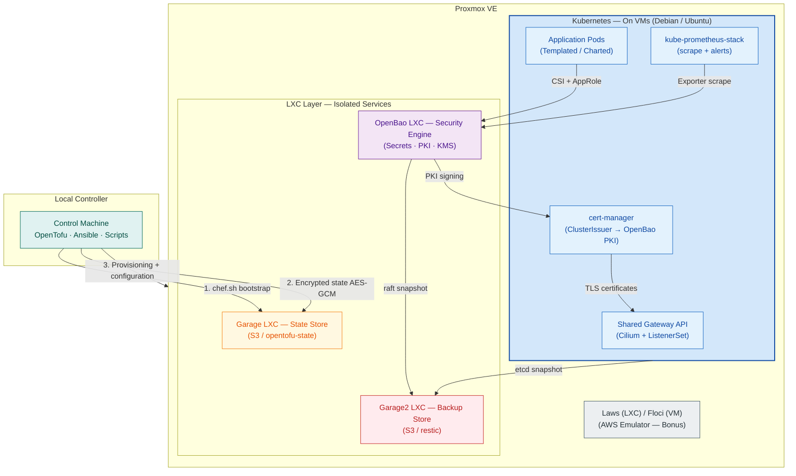
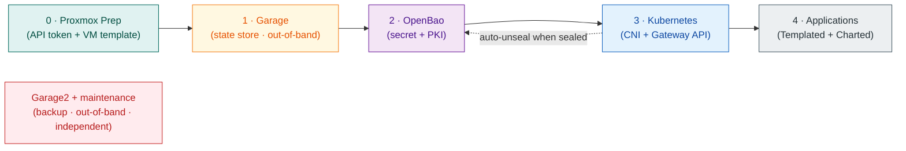

# Cloud-in-Lab

> **Self-Hosted Platform Engineering Toolkit** — A cloud-like platform engineering lab built on Proxmox VE with OpenTofu + Ansible. You can evaluate Kubernetes, secrets/PKI, S3 storage, observability, backup, and disaster recovery workflows on your own hardware without incurring real cloud costs; you can wipe everything and reproduce it from scratch with the same parameters.

[](https://opentofu.org)
[](https://www.ansible.com)
[](https://kubernetes.io)
[](https://www.proxmox.com)
[](https://openbao.org)
[](LICENSE)

**6 isolated stacks** · **~15 GB RAM (core environment)** · **fully code-defined and reproducible**

**Language:** 🇬🇧 English · 🇹🇷 [Türkçe](README.tr.md)

[Design Decisions](#design-decisions) · [Architecture](#architecture) · [Quick Start](#quick-start) · [Documentation](#documentation) · [FAQ](#frequently-asked-questions)

---

## Architecture

Built on four pillars: **Proxmox** (foundation), **OpenTofu** (provisioning), **Ansible** (configuration), **OpenBao** (secrets, PKI, KMS). *Security is not a layer added afterwards; it is an architectural choice built into the topology itself.*



| Layer | What it does | Tool |
|-------|--------------|------|
| **Virtualization** | Network discovery, API token, cloud-image VM template (via scripts) | Proxmox VE |
| **Provisioning** | 6 independent stacks (`openbao`, `k8s-cluster`, `databases`, `efk`, `floci`, `laws`); IPs computed from index, `./deploy.sh <env> <stack>` | OpenTofu |
| **Configuration** | 8 playbooks + wrapper, 7 roles; steps selected with `enable` flags, dynamic inventory | Ansible |
| **Secrets / PKI / KMS** | Outside the cluster, on a dedicated LXC | OpenBao |
| **Storage** | State store + backup store (two separate LXCs) | GarageHQ (S3) |
| **Kubernetes** | kubeadm, Cilium (CNI + GatewayClass + policy), Gateway API, cert-manager, CSI | K8s 1.36 |
| **Application deployment** | Templated (generic) + Charted (Helm) | Ansible |
| **Observability** | Three-way scrape + custom alerts | kube-prometheus-stack |
| **Backup / DR** | vzdump + ZFS snapshots, etcd/raft → restic, `restore.sh` | restic |


> Architecture details: [`master-design.md`](docs/en/architecture/master-design.md)


**Setup order:** *The project assumes Proxmox is already installed. It prepares for provisioning with purpose-built scripts that create the Proxmox API token and VM template* (details: [docs/en/proxmox/proxmox-preps.md](docs/en/proxmox/proxmox-preps.md).)



---

## Design Decisions

Many similar homelab projects are GitOps-centric; `Cloud-in-Lab` focuses on security, state, and disaster recovery:

| Area | Common approach | Cloud-in-Lab |
|------|-----------------|--------------|
| **Secrets / PKI** | In-cluster solutions or external services | OpenBao outside K8s: PKI, KMS, dynamic credentials |
| **OpenTofu state** | Local or unencrypted remote state | Enforced encrypted state, self-hosted S3 |
| **Backup / DR** | Often added afterwards or undocumented | Layered backups + `restore.sh` + scenarios |
| **Provision → configure** | Triggering Ansible directly from Tofu | The inventory file is the only bridge |
| **Deployment model** | GitOps (Flux / Argo CD) | Tofu + Ansible; GitOps deliberately excluded |

**1. Secrets live outside the cluster.**
OpenBao runs on a dedicated LXC, not inside Kubernetes: PKI (Root 10 years → Intermediate 5 years → leaf 90 days, auto-renewed), KV v2, Transit KMS, TTL-bound dynamic database credentials, and full audit logging. Pods pull secrets at runtime via CSI; secrets are written neither to the Tofu state nor to the repo.

**2. State is encrypted from the start.**
OpenTofu state is encrypted with AES-GCM, and since `enforced=true`, unencrypted state is rejected. The key is kept outside the backup chain, on the controller via a separate channel.

**3. OpenTofu and Ansible never call each other.**
The only bridge between the two layers is the inventory file produced by OpenTofu; triggering via `local-exec`/provisioners is forbidden. Each stack has its own state: destroying one does not affect the others.

**4. Chicken-and-egg: the state store is created outside Tofu.**
The state store (Garage) cannot be created with OpenTofu; so it is created out-of-band with `chef.sh`, which also generates the backend configs.

**5. Disaster recovery is part of the design.**
At the infrastructure level, weekly `vzdump` + ZFS snapshots; at the state level, etcd and OpenBao raft data are encrypted with restic every 4 hours, weekly, and monthly into a separate store (Garage2). Worker loss needs no backup (`tofu apply`); for total loss there is an ordered `restore.sh` flow.

**6. Gateway API-native and zero-trust networking.**
Since the community `ingress-nginx` was retired in March 2026, there was no legacy Ingress to migrate away from: a single Shared Gateway (Cilium) + ListenerSet, Gateway API CRDs pinned to v1.6.1, cluster-wide `deny-all` policy. Three policy layers on top: global CCNP (deny-all, DNS, gateway ingress/egress), namespace CNP (isolation), pod CCNP (OpenBao/cidr/fqdn egress). Traffic from the Gateway reaches only pods labeled `ingress-exposed: "true"` (label gate).

**7. Observability covers OpenBao too.**
Three-way scrape for in-cluster, out-of-cluster (Proxmox, OpenBao LXC), and backup metrics; 15 custom OpenBao alerts (4 critical, 11 warning). The exporter returns `200 OK` even while OpenBao is *sealed*.

---

## Core Principles

### OpenTofu — Provisioning

Handles provisioning of VMs and LXCs; the infrastructure is split into 6 independent stacks (`openbao`, `k8s-cluster`, `databases`, `efk`, `floci`, `laws`). Each stack has its own state: destroying one does not affect the others, and `plan` output shows only the relevant resources. All VM/LXC definitions derive from 2 generic modules (`proxmox-vm`, `proxmox-lxc`).

| Principle | Mechanism |
|-----------|-----------|
| **One bucket, separate keys** | Remote state in the single `opentofu-state` bucket on GarageHQ S3; each stack under its own key (`<stack>/terraform.tfstate`) |
| **No hand-written IPs** | `for_each + cidrhost`: only the index is written in tfvars (`ip_start_index` / `ip_offset`), IPs are computed |
| **Multiple pools** | One module per pool with `for_each = var.node_pools`; `vm_count` clones per pool, each clone's IP computed from index |
| **Environment differences in variables only** | The same code runs in two environments with `dev`/`prod` tfvars (`common.tfvars` + stack tfvars) |
| **One command per stack** | `./deploy.sh <env> <stack>` → backend + tfvars check → `tofu init + apply` |
| **Never calls Ansible** | The only bridge between the two layers is the inventory file it produces (`local_file` → `*.ini.generated`); triggering via provisioner/`local-exec` is forbidden |
| **Provider pinning** | `bpg/proxmox ~> 0.78`: the `~>` range guards against breaking changes |
| **State encrypted from the start** | `encryption.tofu` (PBKDF2 + AES-GCM, `enforced=true`); unencrypted state is rejected. The key is generated with `init-encryption.sh` (`600`, on the controller + backup on a separate channel). Emulator stacks (floci, laws) are out of scope |

> State and IaC security flow: [`master-design.md §3.3`](docs/en/architecture/master-design.md#33-state-ve-iac-güvenlik-akışı-opentofu-backend)

### Ansible — Configuration

Handles configuration of the provisioned machines: 8 playbooks + wrapper, 7 roles. `enable` flags decide which steps run; everything runs through the dynamic inventories produced by OpenTofu — no manual inventory definition needed.

| Playbook | What it does |
|----------|--------------|
| `openbao.yml` | Setup + init + unseal + bootstrap: engines, PKI hierarchy, AppRole identities, policies |
| `k8s.yml` | Cluster skeleton: containerd/kubeadm, `init/join`, Cilium CNI + IP pool + L2, shared Gateway, cert-manager, CSI driver, RBAC (9 custom + 5 aggregated ClusterRoles) + kubeconfigs, deny-all policies |
| `k8s_apps.yml` | Application deployment: Templated + Charted; mark `enable: true` to install |
| `k8s_apps_remove.yml` | Application removal: Templated; mark `state: absent` (Helm-installed releases are removed with `helm uninstall`) |
| `maintenance.yml` | restic + systemd timer rollout; chef.sh generates its inventory |
| `floci.yml` · `laws.yml` · `gen-kubeconfig.yml` | Emulator setups + on-demand kubeconfigs per role/namespace |
| `playbook.yml` (wrapper) | Imports `openbao.yml` + `k8s.yml`; flags select |

> Note: the openbao-ops gate inside `k8s.yml` (role: `ansible/roles/k8s/openbao-ops`) performs OpenBao access control + automatic unseal; `pre/` checks run before every play.
> The two playbooks' flags are independent: write `enable: true` in the relevant app's vars record to install, `state: absent` to remove; neither affects the other.
> Enable-flag mechanism: [`master-design.md §6.3`](docs/en/architecture/master-design.md#63-stack-açmakapama-ansible-enable-flag)

### OpenBao — Secrets, PKI, and KMS

Centrally handles sensitive data (secrets), certificates, encryption (KMS), identity, and key management; each engine commissioned at bootstrap (the `openbao/server` role) addresses a concrete problem:

- **Generic (templated) policies** — 8 `workload-*-templated` templates cover all applications from a single pattern: the policy count stays at 8 no matter how many apps are added
- **AppRole auth** — 8 workload profiles + platform roles + service identities (k8s-csi, cert-manager); machine identity independent of Kubernetes ServiceAccounts
- **PKI Root + Intermediate CA** — Root 10 years, Intermediate 5 years, leaf 90 days, auto-renewed; the cert-manager ClusterIssuer keeps Gateway TLS self-renewing; the OpenBao server certificate is self-signed, valid for 1 year
- **KV v2** — Credential vault; secrets are never written to Tofu state or the repo, pods pull them at runtime via CSI
- **Transit + Database engines** — Envelope encryption; TTL-bound, leased dynamic database credentials, no passwords sitting in code
- **Kubernetes auth + CSI provider** — Provides the path from pod identity to mounted secrets
- **Audit logging + Shamir 3/5 unseal** — Every API call is logged (CloudTrail equivalent); unseal keys are never stored on machines, they are piped via stdin; token TTLs 15 minutes – 24 hours

> Single source of the identity catalog: `ansible/roles/openbao/security/defaults/main.yml` · Details: [`docs/en/openbao/openbao-architecture-guide.md`](docs/en/openbao/openbao-architecture-guide.md) · RBAC: [`docs/en/openbao/openbao-rbac.md`](docs/en/openbao/openbao-rbac.md)

---

## Platform Layers

### Kubernetes Networking: Gateway API + Cilium

The network layer is built directly on **Kubernetes Gateway API** standards instead of legacy Ingress. (Since the community `ingress-nginx` project was retired in March 2026, there was no legacy Ingress to migrate away from.)

| Architectural Problem Encountered | Solution Applied |
| :--- | :--- |
| **Central gateway complexity:** risk of modifying the Gateway object with every new app | **Shared Gateway architecture:** a single central Gateway (`gatewayClassName: cilium`, `allowedListeners.namespaces.from: All`); later deployments never touch the Gateway |
| **Reference dependency:** cross-namespace secret sharing and `ReferenceGrant` complexity | **ListenerSet integration:** each app binds its own TLS `Secret` directly to the Gateway; cross-namespace dependencies disappear |
| **Version uncertainty:** incompatibilities between Gateway API versions | **Pinned CRDs:** Gateway API CRDs installed pinned to *Standard Channel v1.6.1* |

Apps needing dedicated TLS get an auto-derived `Certificate` (`<name>-tls`) and `ListenerSet`; the wildcard certificate stays fixed on the Shared Gateway. Different domains are also supported with `tls.mode: dedicated` + `use_base_domain: false` (`openbao-pki-<domain>`, e.g. `echo3.lab.internal`). Details: [`k8s-design.md §3`](docs/en/architecture/k8s-design.md#3-gateway-api--cilium-genel-ağ-yapısı).

### Application Deployment: Templated + Charted

Developers only declare **the desired state**; `HTTPRoute`, Cilium network policies, and dedicated `Certificate`/`ListenerSet` when needed are generated automatically. Two keys:

- **`expose`** (default: `true`) — Generates the app's `HTTPRoute`, `gateway-CNP` (CiliumNetworkPolicy), and dedicated `Certificate`/`ListenerSet` when needed.
- **`templateLabels: ingress-exposed: "true"`** — Pod-level label; defines the selector in the CNP network policy that permits Gateway-to-pod traffic.

Two engines work together: **Templated (`app-deploy`)** derives `Service` and `HTTPRoute`s from `Deployment`/`StatefulSet`/`Job`/`CronJob` templates; **Charted (`chart-deploy`)** releases Helm charts and integrates `HTTPRoute`s via `lookup`. ([`k8s-apps-design.md §1.3`](docs/en/architecture/k8s-apps-design.md#13-dağıtım-stratejisi-templated-app-deploy-vs-charted-chart-deploy))

```yaml
# ansible/inventory/group_vars/all/k8s_apps.yml (simplified)
apps:
  - name: echo-server
    enable: true
    image: ealen/echo-server:latest
    hostnames: ["echo"]         # → HTTPRoute + gateway-CNP automatic
    namespace: demo
    port: 80
    templateLabels:
      ingress-exposed: "true"   # → Cilium permit for Gateway→pod traffic
```

### State and Storage: GarageHQ

Two isolated Alpine LXCs based on the lightweight S3-compatible Rust binary, with clear roles:

- **Garage (state store):** A single `opentofu-state` bucket; each stack under its own key path (`<stack>/terraform.tfstate`).
- **Garage2 (backup store):** Hosts a separate `restic` repository per bucket.

The state store **cannot** be created with OpenTofu — Tofu needs the state store before it can run (bootstrap dependency / chicken-and-egg). So `chef.sh` starts it outside the Tofu lifecycle (*out-of-band*): `--tofu-backend true` produces the state bucket + Tofu backend configs; `--tofu-backend false --enable-ssh true` creates the restic buckets + the `maintenance` inventory. ([`chef-sh-how-it-works.md §2`](docs/en/garagehq/chef-sh-how-it-works.md#2-bu-projede-iki-garaj-var))

### Observability: Three-Way Scrape

Installed via the `kube-prometheus-stack` Helm chart; metric collection is fully pull-based (**three-way scrape**):

| Collection Dimension | Target Metrics | How It Works |
| :--- | :--- | :--- |
| **In-cluster** | OpenBao `/sys/metrics` + `/sys/health` | `openbao-metrics-exporter` pulls with AppRole and merges on unauthenticated `:9090/metrics` (returns `200 OK` even when *sealed*); scraped via `ServiceMonitor` |
| **Out-of-cluster** | Proxmox VE, OpenBao LXC | The `maintenance` role; produces `Service`/`Endpoints`/`ServiceMonitor` with the required *egress* permissions under `deny-all` |
| **Backup** | Periodic backup job status | `node-exporter` *textfile collector* on masters; each job writes a `.prom` file |

**15 custom OpenBao alerts** (`openbao-alerts.yaml`) + integrated `maintenance` backup alerts:

| Severity | Covered operational states |
| :--- | :--- |
| **`critical` (4)** | `OpenBaoDown` · `OpenBaoSealed` · `OpenBaoRootTokenCreated` · `OpenBaoAutopilotUnhealthy` |
| **`warning` (11)** | Request/login latencies · Token counts/spikes · Lease errors · Raft heartbeat/leader/lag · Goroutine bloat · Exporter data freshness |

> Test procedures: [`openbao-tests.md`](docs/en/openbao/openbao-tests.md)

### Backup and Disaster Recovery

Infrastructure and configuration are rolled out with the `maintenance` role; **two-layer** protection:

- **Infrastructure level (disk/LXC):** weekly full disk images with `vzdump` + ZFS snapshots.
- **State level (data/state):** `etcd` and OpenBao raft data encrypted with `restic` every 4 hours, weekly, and monthly into the **Garage2** store.

Continuity is supervised with `healthcheck.sh`, recovery runs through the interactive `restore.sh` menu:

- **Partial loss (etcd / OpenBao):** the relevant raft/etcd snapshot is restored.
- **Worker loss:** no backup needed — the node is recreated with `tofu apply`.
- **Total loss:** a dependency-ordered restore flow.

> Details: [`docs/en/maintenance/maintenance.md`](docs/en/maintenance/maintenance.md) · Scenarios: [`docs/en/maintenance/disaster-recovery.md`](docs/en/maintenance/disaster-recovery.md)

### Operational Scripts

Helpers in most places, cornerstones in two:

| Script | Job |
|--------|-----|
| `chef.sh` (**cornerstone**) | Interactive bootstrap of the two Garage LXCs: discovery → setup → credentials → backend configs (the state store cannot be built with Tofu, so this bootstrap step is performed manually) |
| `init-encryption.sh` (**cornerstone**) | Generates the state encryption key; `tofu init` does not run without the key |
| `generate-garage-backend.sh` | Generates the 6 stacks' backend configs from the credential file |
| `gen-maintenance-inventory.sh` + `gen-restic-passwords.sh` | Backup inventory + per-bucket passwords (called inside chef.sh) |
| `unseal.sh` | Unseals OpenBao that remains sealed after a reboot: Shamir 3/5 keys live only on the controller, sent via stdin |
| `restore.sh` | Recovery menu: interactive / parameters / `--yes` (VM, etcd, OpenBao raft) |
| `discover-pve.sh` · `setup-proxmox-token.sh` · `create-vm-template.sh` | PVE prep: network discovery (`pve-discovered.txt`), idempotent API token, cloud-image VM template |
| `get-credentials.sh` | Credential copying |

> Details: [`docs/en/garagehq/chef-sh-how-it-works.md`](docs/en/garagehq/chef-sh-how-it-works.md) · [`docs/en/proxmox/proxmox-preps.md`](docs/en/proxmox/proxmox-preps.md) · [`docs/en/proxmox/how-to-create-vm-template.md`](docs/en/proxmox/how-to-create-vm-template.md) · [`docs/en/maintenance/restore-sh-how-it-works.md`](docs/en/maintenance/restore-sh-how-it-works.md)

### Emulators (Bonus)

For testing without a real AWS account: **Laws** (LXC, single Rust binary, for the dev environment) and **Floci** (VM, LocalStack-compatible 68 services + web UI). Not the platform's main purpose — a development bonus. ([`floci-test-commands.md`](docs/en/emulators/floci-test-commands.md) · [`laws-test-commands.md`](docs/en/emulators/laws-test-commands.md))

---

## Quick Start

The full guide is **[quick-start.md](docs/en/quick-start.md)** — a 16-step end-to-end setup on a single-node Proxmox. Only the core flow below.

**Prerequisites:** Pre-installed Proxmox VE 9.x (API + SSH access) · On the controller: OpenTofu 1.9.x, ansible-core 2.21.x, bash, SSH · the following resources:

| Component | Min RAM | Min CPU | Type | Cloud equivalent |
|-----------|---------|---------|------|------------------|
| **GarageHQ (×2 LXC)** | 256 MB (each) | 1 Core (each) | Alpine LXC (state + backup) | S3 / Blob Storage / MinIO |
| **OpenBao** | 2 GB | 1 Core | Ubuntu 26.04 LXC | KMS + Secrets Manager + ACM |
| **K8s Master** | 4 GB | 2 Cores | Debian VM | EKS / AKS / GKE |
| **K8s Workers (×2)** | 4 GB (each) | 2 Cores (each) | Debian VM | Node pool |
| **TOTAL (core)** | **~14.5 GB** | **9 vCPU** | Single machine | — |

> Values are minimums. Floci (4 GB / 2 Cores) + Laws (2 GB / 1 Core) are optional. Databases and EFK are under development and excluded from the totals.

```bash
# 1. Proxmox prep: network discovery, API token, VM template
cd scripts/proxmox
./discover-pve.sh <PVE_IP> && ./setup-proxmox-token.sh <PVE_IP> && ./create-vm-template.sh <PVE_IP>

# 2. Garage state store (interactive; generates backend configs)
cd ../garage-setup && ./chef.sh --host <PVE_IP> --tofu-backend true

# 3. OpenBao + Kubernetes stacks
cd ../../tofu && ./deploy.sh dev openbao && ./deploy.sh dev k8s-cluster

# 4. Configuration: OpenBao init/unseal, then K8s setup
cd ../ansible
ansible-playbook -i inventory/openbao.ini.generated playbooks/openbao.yml
ansible-playbook -i inventory/hosts.ini.generated playbooks/k8s.yml
```

**Verification** — after adding the gateway IP + `echo.tofu.lan` to the client's `/etc/hosts` ([handbook §3.8.4](docs/en/platform-handbook.md#384-gateway-api-ve-tls-demo-echotofulan)), open `https://echo.tofu.lan` in a browser. The certificate comes from the platform's self-signed PKI; accept the browser warning to proceed. From a terminal: `curl -k https://echo.tofu.lan`.

---

## Project Status

✅ **Available:** OpenTofu provisioning (6 stacks) · Ansible automation · Kubernetes + Cilium · OpenBao (secrets, PKI, KMS, CSI) · RBAC & kubeconfigs · Prometheus + alerts · Backup & DR · K8s application deployment · Laws / Floci emulators

🚧 **In development:** Databases (PostgreSQL) · EFK Stack

**Tested versions:**

| Component | Version |
|-----------|---------|
| Proxmox VE | 9.x |
| OpenTofu | 1.9.x |
| Ansible (ansible-core) | 2.21.x |
| Kubernetes | 1.36.2 |
| Cilium | 1.20.1 |
| Gateway API | 1.6.1 |
| OpenBao | 2.6.2 |
| GarageHQ | 2.3 |
| cert-manager | 1.21.1 |
| Restic | 0.19.1 |
| Cilium CLI | 0.19.7 |
| metrics-server | Helm chart 3.14.0 |
| CSI Secrets Store Driver | 1.6.0 |
| OpenBao CSI Provider | chart 0.29.4 |

> Version pins are defined in the Ansible roles' `defaults/main.yml` files; updates happen from a single point. Garage and Alpine template versions come via `apk`/`pveam`.

---

## Known Limitations

Cloud-in-Lab deliberately focuses on a specific problem area; honest boundaries:

- Is not a replacement for public cloud providers, general-purpose virtualization, or production operations
- Does not hide Kubernetes complexity — it is a platform engineering learning and evaluation environment
- OpenBao is a single LXC (protected by raft snapshots + restore runbook)
- No CRL/OCSP or revoke automation in PKI (managed with 90-day leaf + auto-renew)
- No Root CA rotation runbook (Root 10 years + Intermediate 5 years)

> Full list and practical solutions: [`docs/en/architecture/project-constraints-and-solutions.md`](docs/en/architecture/project-constraints-and-solutions.md)

---

## Frequently Asked Questions

**Is this a Kubernetes distribution?** No. Kubernetes is only one component of the overall platform.

**Is this a Proxmox automation project?** Partly. Proxmox is assumed pre-installed; the project does not set up Proxmox itself, but the platform on top of it.

**Can stacks be deployed independently?** Yes. Each stack has isolated state; a change in one does not affect the others.

**Why is there no GitOps (ArgoCD/Flux)?** A deliberate choice: the Tofu + Ansible approach is sufficient for homelab/dev-test with fewer dependencies; GitOps integration may be evaluated later.

**Why do the docs mention "Tofu-lar" and `tofu.lan`?** The project started as "Tofu-lar" and was renamed to "Cloud-in-Lab" to match its scope. `tofu.lan` in internal domain and certificate sections is intentionally kept for practicality.

---

## Documentation

Full documentation is currently in Turkish under `docs/tr/`; English translations are in progress.

| Area | Documents | EN | TR |
|------|-----------|----|----|
| **Getting started** | [platform-handbook.md](docs/en/platform-handbook.md) (main guide) · [quick-start.md](docs/en/quick-start.md) (from-scratch setup) | ✅ | ✅ |
| **Architecture** | [master-design.md](docs/en/architecture/master-design.md) · [k8s-design.md](docs/en/architecture/k8s-design.md) · [k8s-apps-design.md](docs/en/architecture/k8s-apps-design.md)  · [project-constraints-and-solutions.md](docs/en/architecture/project-constraints-and-solutions.md) · [openbao-output-contract.md](docs/en/architecture/openbao-output-contract.md)  | ✅ | ✅ |
| **OpenBao & security** | [openbao-architecture-guide.md](docs/en/openbao/openbao-architecture-guide.md) · [openbao-rbac.md](docs/en/openbao/openbao-rbac.md) · [openbao-tests.md](docs/en/openbao/openbao-tests.md) · [k8s-rbac.md](docs/en/kubernetes/rbac.md) | ✅ | ✅ |
| **Maintenance & DR** | [maintenance.md](docs/en/maintenance/maintenance.md) · [disaster-recovery.md](docs/en/maintenance/disaster-recovery.md) · [restore-sh-how-it-works.md](docs/en/maintenance/restore-sh-how-it-works.md) | 🚧 | ✅ |
| **Garage & Proxmox** | [chef-sh-how-it-works.md](docs/en/garagehq/chef-sh-how-it-works.md) · [proxmox-preps.md](docs/en/proxmox/proxmox-preps.md) · [how-to-create-vm-template.md](docs/en/proxmox/how-to-create-vm-template.md) | ✅ | ✅ |
| **Emulators** | [floci-test-commands.md](docs/en/emulators/floci-test-commands.md) · [laws-test-commands.md](docs/en/emulators/laws-test-commands.md) | ✅ | ✅ |
| **Other** | [cloud-equivalents.md](docs/en/cloud-equivalents.md) · [policy-examples/](extra-samples/policy-examples/) · [openbao-auto-unseal/](extra-samples/openbao-auto-unseal/) | 🚧 | ✅ |

---

## License

This project is published under the **MIT License**. See the [LICENSE](LICENSE) file for details.
