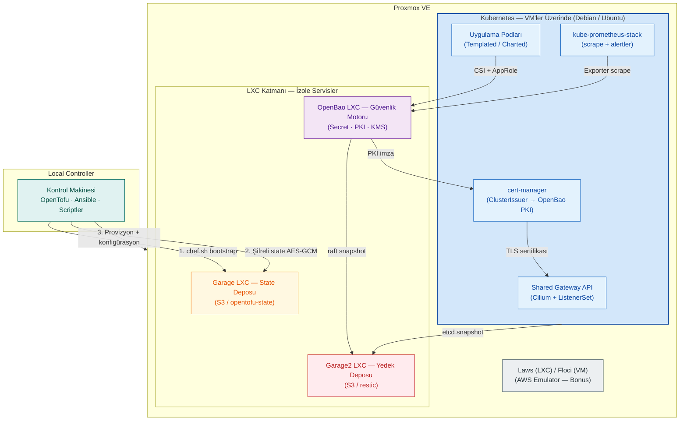
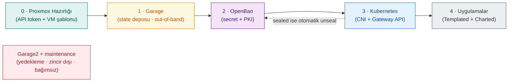

# Cloud-in-Lab

> **Self-hosted Platform Engineering Toolkit** — Proxmox VE üzerinde OpenTofu + Ansible ile kurulan, bulut-benzeri bir platform mühendisliği laboratuvarı. Kubernetes, secret/PKI, S3 depolama, izlenebilirlik, yedekleme ve felaket kurtarma akışlarını gerçek bulut maliyetine girmeden kendi donanımınızda sınayabilir; her şeyi silip aynı parametrelerle sıfırdan yeniden üretebilirsiniz.

[](https://opentofu.org)
[](https://www.ansible.com)
[](https://kubernetes.io)
[](https://www.proxmox.com)
[](https://openbao.org)
[](LICENSE)

**6 izole stack** · **~15 GB RAM (çekirdek ortam)** · **tamamen kod-tanımlı ve tekrar üretilebilir**

**Dil:** 🇹🇷 Türkçe · 🇬🇧 [English](README.md)

[Tasarım Kararları](#tasarım-kararları) · [Mimari](#mimari) · [Hızlı Başlangıç](#hızlı-başlangıç) · [Dokümantasyon](#dokümantasyon) · [SSS](#sıkça-sorulan-sorular)

---

## Mimari

Dört esas üzerine kuruludur: **Proxmox** (zemin), **OpenTofu** (provizyon), **Ansible** (konfigürasyon), **OpenBao** (secret, PKI, KMS). *Güvenlik sonradan eklenen bir katman değil, topolojik düzeyde kararı alınmış bir mimari tercihtir.*



| Katman | Ne yapar | Araç |
|--------|----------|------|
| **Sanallaştırma** | Ağ keşfi, API token, cloud-image VM şablonu (scriptlerle) | Proxmox VE |
| **Provizyon** | 6 bağımsız stack (`openbao`, `k8s-cluster`, `databases`, `efk`, `floci`, `laws`); IP'ler index'ten hesaplanır, `./deploy.sh <env> <stack>` | OpenTofu |
| **Konfigürasyon** | 8 playbook + wrapper, 7 rol; `enable` bayraklarıyla seçilen adımlar, dinamik envanter | Ansible |
| **Secret / PKI / KMS** | Kümenin dışında, bağımsız LXC | OpenBao |
| **Depolama** | State deposu + yedek deposu (iki ayrı LXC) | GarageHQ (S3) |
| **Kubernetes** | kubeadm, Cilium (CNI + GatewayClass + policy), Gateway API, cert-manager, CSI | K8s 1.36 |
| **Uygulama dağıtımı** | Templated (generic) + Charted (Helm) | Ansible |
| **İzlenebilirlik** | Üç yönlü scrape + özel alarmlar | kube-prometheus-stack |
| **Yedekleme / DR** | vzdump + ZFS snapshot, etcd/raft → restic, `restore.sh` | restic |


> Mimari detay: [`master-design.md`](docs/tr/architecture/master-design.md)


**Kurulum sırası:** *Proje, Proxmox'un önceden kurulu olduğunu varsayarak ilerler. Proxmox erişim API token'ı ve VM şablonu oluşturulması işlerini yapan `özel yazılmış scriptlerle` provizyona hazırlanır* (detay için: [docs/tr/proxmox/proxmox-preps.md](docs/tr/proxmox/proxmox-preps.md).)



---

## Tasarım Kararları

**1. Secret'lar kümenin dışında yaşar.**
OpenBao, Kubernetes içinde değil ayrı bir LXC'de çalışır: PKI (Root 10 yıl → Intermediate 5 yıl → leaf 90 gün, otomatik yenilenir), KV v2, Transit KMS, TTL'li dinamik veritabanı credential'ları ve tam audit log. Pod'lar secret'ları runtime'da CSI ile çeker; secret ne Tofu state'ine ne de repoya yazılır.

**2. State en baştan şifreli.**
OpenTofu state'i AES-GCM ile şifrelenir ve `enforced=true` olduğu için şifresiz state reddedilir. Anahtar yedek zincirinin dışında, controller'da ayrı kanalda tutulur.

**3. OpenTofu ile Ansible birbirini çağırmaz.**
İki katmanın tek köprüsü OpenTofu'nun ürettiği envanter dosyasıdır; `local-exec`/provisioner ile tetikleme yasaktır. Her stack kendi state'indedir: birinin destroy'u diğerini etkilemez.

**4. Chicken-and-egg problemi: state deposu Tofu dışında kurulur.**
State deposu (Garage) OpenTofu ile kurulamaz; bu yüzden `chef.sh` ile Tofu yaşam döngüsünün dışında (out-of-band) kurulur ve backend config'lerini üretir.

**5. Felaket kurtarma tasarımın parçası.**
Altyapı seviyesinde haftalık `vzdump` + ZFS snapshot; durum seviyesinde etcd ve OpenBao raft verisi 4 saatte bir, haftalık ve aylık olarak restic ile şifrelenip ayrı bir depoya (Garage2) gider. Worker kaybı yedek gerektirmez (`tofu apply`); topyekûn kayıp için bağımlılık sırasına göre `restore.sh` akışı vardır.

**6. Gateway API-native ve sıfır güvenli ağ.**
Community `ingress-nginx` Mart 2026'da emekliye ayrıldığı için Ingress mirası baştan bırakılmamıştır: tek Shared Gateway (Cilium) + ListenerSet, Gateway API CRD'leri v1.6.1'e sabitlenmiş, küme genelinde `deny-all` politikası. Üzerine 3 katmanlı policy dizilir: global CCNP (deny-all, DNS, gateway ingress/egress), namespace CNP (izolasyon), pod CCNP (OpenBao/cidr/fqdn egress). Gateway'den pod'a trafik yalnız `ingress-exposed: "true"` etiketli pod'lara akar (label gate).

**7. İzlenebilirlik OpenBao'yu da kapsar.**
Küme içi, küme dışı (Proxmox, OpenBao LXC) ve yedekleme metrikleri için üç yönlü scrape; 15 özel OpenBao alarmı (4 critical, 11 warning). Exporter, OpenBao *sealed* durumdayken bile `200 OK` döner.

Birçok benzer homelab projesi GitOps odaklıdır; `Cloud-in-Lab` güvenlik, state ve felaket kurtarma tarafını merkeze alır:

| Alan | Sıkça görülen yaklaşım | Cloud-in-Lab |
|------|------------------------|--------------|
| **Secret / PKI** | Küme içi çözümler veya harici servisler | K8s dışında OpenBao: PKI, KMS, dinamik credential |
| **OpenTofu state** | Yerel veya şifresiz uzak state | Zorunlu şifreli state, self-hosted S3 |
| **Yedekleme / DR** | Sıklıkla sonradan eklenir veya belgelenmez | Katmanlı yedekleme + `restore.sh` + senaryolar |
| **Provizyon → konfigürasyon** | Tofu'dan Ansible'ın doğrudan tetiklenmesi | Yalnızca envanter dosyası köprüdür |
| **Dağıtım modeli** | GitOps (Flux / Argo CD) | Tofu + Ansible; GitOps bilinçli olarak dışarıda |

---

## Temel Esaslar

### OpenTofu — Provizyon

VM ve LXC'lerin açılmasını üstlenir; altyapı 6 bağımsız stack'e bölünmüştür (`openbao`, `k8s-cluster`, `databases`, `efk`, `floci`, `laws`). Her stack'in state'i ayrıdır: birinin destroy'u diğerini etkilemez, `plan` çıktısı yalnız ilgili kaynakları gösterir. Tüm VM/LXC tanımları 2 generic modülden türer (`proxmox-vm`, `proxmox-lxc`).

| İlke | Mekanizma |
|------|-----------|
| **Tek kova, ayrı key** | Uzak state GarageHQ S3'teki tek `opentofu-state` kovasında; her stack kendi key'inde (`<stack>/terraform.tfstate`) |
| **Elle IP yazılmaz** | `for_each + cidrhost`: tfvars'ta yalnız index yazılır (`ip_start_index` / `ip_offset`), IP hesaplanır |
| **Çoklu havuz** | `for_each = var.node_pools` ile havuz başına modül; havuz içi `vm_count` kadar klon, her klonun IP'si index'ten hesaplanır |
| **Ortam farkı yalnız değişkende** | Aynı kod `dev`/`prod` tfvars ile iki ortamda çalışır (`common.tfvars` + stack tfvars) |
| **Stack başına tek komut** | `./deploy.sh <env> <stack>` → backend + tfvars kontrolü → `tofu init + apply` |
| **Ansible'yı asla çağırmaz** | İki katmanın köprüsü yalnızca ürettiği envanter dosyasıdır (`local_file` → `*.ini.generated`); provisioner/`local-exec` ile tetikleme yasaktır |
| **Provider sabitleme** | `bpg/proxmox ~> 0.78`: `~>` aralığıyla breaking change koruması |
| **State en baştan şifrelidir** | `encryption.tofu` (PBKDF2 + AES-GCM, `enforced=true`); şifresiz state reddedilir. Anahtar `init-encryption.sh` ile üretilir (`600`, controller'da + ayrı kanalda yedek). Emülatör stack'leri (floci, laws) kapsam dışındadır |

> State ve IaC güvenlik akışı: [`master-design.md §3.3`](docs/tr/architecture/master-design.md#33-state-ve-iac-güvenlik-akışı-opentofu-backend)

### Ansible — Konfigürasyon

Provizyon edilen makinelerin konfigürasyonunu üstlenir: 8 playbook + wrapper, 7 rol. Hangi adımların çalıştırılacağını `enable` bayrakları belirler; tüm süreç OpenTofu'nun ürettiği dinamik envanterler üzerinden yürür, manuel envanter tanımı gerekmez.

| Playbook | Yaptığı iş |
|----------|-------------|
| `openbao.yml` | Kurulum + init + unseal + bootstrap: motorlar, PKI hiyerarşisi, AppRole kimlikleri, policy'ler |
| `k8s.yml` | Kümenin iskeleti: containerd/kubeadm, `init/join`, Cilium CNI + IP havuzu + L2, shared Gateway, cert-manager, CSI driver, RBAC (9 custom + 5 aggregated ClusterRole) + kubeconfig'ler, deny-all policy'ler |
| `k8s_apps.yml` | Uygulama dağıtımı: Templated + Charted; kurmak için `enable: true` işaretlenir |
| `k8s_apps_remove.yml` | Uygulama kaldırma: Templated; `state: absent` işaretlenir (Helm ile kurulanlar `helm uninstall` ile kaldırılır) |
| `maintenance.yml` | restic + systemd timer dağıtımı; envanteri chef.sh üretir |
| `floci.yml` · `laws.yml` · `gen-kubeconfig.yml` | Emülatör kurulumları + rol/namespace bazında ihtiyaca özel kubeconfig |
| `playbook.yml` (wrapper) | `openbao.yml` + `k8s.yml` import; bayraklar seçer |

> Not: `k8s.yml` içindeki openbao-ops kapısı (rol: `ansible/roles/k8s/openbao-ops`) OpenBao erişim denetimi + otomatik unseal yapar; `pre/` kontrolleri her play'den önce koşar.
> İki playbook'un bayrakları bağımsızdır: ilgili app'in vars kaydında kurmak için `enable: true`, kaldırmak için `state: absent` yazılır; biri diğerini etkilemez.
> Enable flag mekanizması: [`master-design.md §6.3`](docs/tr/architecture/master-design.md#63-stack-açmakapama-ansible-enable-flag)

### OpenBao — Secret, PKI ve KMS

Hassas veri (secret), sertifika, şifreleme (KMS), kimlik ve anahtar yönetimini merkezi olarak üstlenir; bootstrap (`openbao/server` rolü) ile devreye alınan her motor somut bir probleme karşılar:

- **Generic (templated) policy'ler** — 8 `workload-*-templated` şablonu tek kalıptan tüm uygulamaları kapsar: app sayısı artsa policy sayısı 8'de sabit kalır
- **AppRole auth** — 8 workload profili + platform rolleri + servis kimlikleri (k8s-csi, cert-manager); K8s ServiceAccount'a bağımlı olmayan machine identity
- **PKI Root + Intermediate CA** — Root 10 yıl, Intermediate 5 yıl, leaf 90 gün auto-renew; cert-manager ClusterIssuer ile Gateway TLS kendini yeniler; OpenBao sunucu sertifikası 1 yıl self-signed
- **KV v2** — Credential kasası; secret'lar Tofu state'ine ve repoya yazılmaz, pod'lar runtime'da CSI ile çeker
- **Transit + Database engine** — Envelope encryption; TTL'li, lease'li dinamik veritabanı kimlik bilgileri, kodda duran şifre kalmaz
- **Kubernetes auth + CSI provider** — Pod kimliğinden secret mount'a giden dosya yolu
- **Audit log + Shamir 3/5 unseal** — Her API çağrısı kayıttadır (CloudTrail karşılığı); unseal key'ler makinede saklanmaz, stdin ile gönderilir; token TTL'leri 15 dakika – 24 saat

> Kimlik katalogunun tek kaynağı: `ansible/roles/openbao/security/defaults/main.yml` · Detay: [`docs/tr/openbao/openbao-architecture-guide.md`](docs/tr/openbao/openbao-architecture-guide.md) · RBAC: [`docs/tr/openbao/openbao-rbac.md`](docs/tr/openbao/openbao-rbac.md)

---

## Platform Katmanları

### Kubernetes Ağı: Gateway API + Cilium

Ağ katmanı legacy Ingress yerine doğrudan **Kubernetes Gateway API** standartları üzerine kuruludur. (Community `ingress-nginx` projesi Mart 2026'da emekliye ayrıldığı için göç edilecek bir Ingress mirası bırakılmamıştır.)

| Karşılaşılan Mimarî Problem | Uygulanan Çözüm |
| :--- | :--- |
| **Merkezi Gateway Karmaşası:** Her yeni uygulamada Gateway nesnesinin değiştirilme riski | **Shared Gateway Mimarisi:** Tek merkezi Gateway (`gatewayClassName: cilium`, `allowedListeners.namespaces.from: All`); sonraki dağıtımlar Gateway'e dokunmaz |
| **Referans Bağımlılığı:** Cross-namespace secret paylaşımı ve `ReferenceGrant` karmaşası | **ListenerSet Entegrasyonu:** Uygulama kendi TLS `Secret`'ını Gateway'e doğrudan bağlar; ad alanları arası bağımlılık kalkar |
| **Sürüm Belirsizliği:** Gateway API sürümleri arası uyumsuzluklar | **Sabitlenmiş CRD'ler:** Gateway API CRD'leri *Standard Channel v1.6.1*'e sabitlenerek kurulur |

Dedicated TLS gerektiren uygulamalar için `Certificate` (`<name>-tls`) ve `ListenerSet` otomatik türetilir; wildcard sertifika Shared Gateway üzerinde sabittir. `tls.mode: dedicated` + `use_base_domain: false` ile farklı domain desteği de vardır (`openbao-pki-<domain>`, örn: `echo3.lab.internal`). Detay: [`k8s-design.md §3`](docs/tr/architecture/k8s-design.md#3-gateway-api--cilium-genel-ağ-yapısı).

### Uygulama Dağıtımı: Templated + Charted

Geliştirici yalnızca **bildirisel niyetini** beyan eder; `HTTPRoute`, Cilium network policy ve gerekirse dedicated `Certificate`/`ListenerSet` otomatik üretilir. İki anahtar:

- **`expose`** (Varsayılan: `true`) — Uygulama için `HTTPRoute`, `gateway-CNP` (CiliumNetworkPolicy) ve gerektiğinde dedicated `Certificate`/`ListenerSet` nesnelerini üretir.
- **`templateLabels: ingress-exposed: "true"`** — Pod seviyesindeki etiket; Cilium'un Gateway'den pod'a giden trafiğe izin veren ağ politikasındaki (CNP) selector'ını tanımlar.

İki motor birlikte çalışır: **Templated (`app-deploy`)** `Deployment`/`StatefulSet`/`Job`/`CronJob` şablonlarıyla `Service` ve `HTTPRoute`'ları türetir; **Charted (`chart-deploy`)** Helm chart'larını yayına alır ve `HTTPRoute`'ları `lookup` ile entegre eder. ([`k8s-apps-design.md §1.3`](docs/tr/architecture/k8s-apps-design.md#13-dağıtım-stratejisi-templated-app-deploy-vs-charted-chart-deploy))

```yaml
# ansible/inventory/group_vars/all/k8s_apps.yml (sadeleştirilmiş)
apps:
  - name: echo-server
    enable: true
    image: ealen/echo-server:latest
    hostnames: ["echo"]         # → HTTPRoute + gateway-CNP otomatik
    namespace: demo
    port: 80
    templateLabels:
      ingress-exposed: "true"   # → Gateway→pod trafiğine Cilium izni
```

### State ve Depolama: GarageHQ

S3 uyumlu hafif Rust binary'si tabanlı iki izole Alpine LXC, net rollerle çalışır:

- **Garage (state deposu):** Tek `opentofu-state` kovası; her stack kendi anahtar yolunda (`<stack>/terraform.tfstate`).
- **Garage2 (yedek deposu):** Kova başına ayrı bir `restic` deposu barındırır.

State deposu OpenTofu ile **kurulamaz** — Tofu'nun çalışabilmesi için önce state deposu gerekir (bootstrap bağımlılığı / chicken-and-egg). Bu yüzden `chef.sh` ile Tofu yaşam döngüsünün dışında (*out-of-band*) başlatılır: `--tofu-backend true` state kovası + Tofu backend config'lerini üretir; `--tofu-backend false --enable-ssh true` restic kovaları + `maintenance` envanterini oluşturur. ([`chef-sh-how-it-works.md §2`](docs/tr/garagehq/chef-sh-how-it-works.md#2-bu-projede-iki-garaj-var))

### İzlenebilirlik: Üç Yönlü Scrape

`kube-prometheus-stack` Helm chart'ı ile kurulur; metrik toplama tamamen pull-based (**3 yönlü scrape**) üzerinedir:

| Toplama Boyutu | Hedef Metrikler | Çalışma Mekanizması |
| :--- | :--- | :--- |
| **Küme-İçi (In-Cluster)** | OpenBao `/sys/metrics` + `/sys/health` | `openbao-metrics-exporter` AppRole ile çeker, kimlik doğrulamasız `:9090/metrics`'te birleştirir (*sealed* iken dahi `200 OK`); `ServiceMonitor` ile scrape edilir |
| **Küme-Dışı (Out-of-Cluster)** | Proxmox VE, OpenBao LXC | `maintenance` rolü; `deny-all` altında gerekli *egress* izinleriyle `Service`/`Endpoints`/`ServiceMonitor` üretir |
| **Yedekleme (Backup)** | Periyodik yedek işlerinin durumu | Master'lardaki `node-exporter` *textfile collector*; her iş `.prom` dosyasına yazar |

**15 özel OpenBao alarmı** (`openbao-alerts.yaml`) + `maintenance` yedekleme alarmları entegredir:

| Severity | Kapsanan operasyonel durumlar |
| :--- | :--- |
| **`critical` (4)** | `OpenBaoDown` · `OpenBaoSealed` · `OpenBaoRootTokenCreated` · `OpenBaoAutopilotUnhealthy` |
| **`warning` (11)** | İstek/login gecikmeleri · Token sayısı/sıçramaları · Lease hataları · Raft heartbeat/leader/lag · Goroutine şişmesi · Exporter veri tazeliği |

> Test prosedürleri: [`openbao-tests.md`](docs/tr/openbao/openbao-tests.md)

### Yedekleme ve Felaket Kurtarma

Altyapı ve konfigürasyon `maintenance` rolü ile dağıtılır; **2 katmanlı** koruma:

- **Altyapı seviyesi (disk/LXC):** `vzdump` + ZFS snapshot ile haftalık tam disk görüntüsü.
- **Durum seviyesi (data/state):** `etcd` ve OpenBao Raft verisi 4 saatte bir, haftalık ve aylık `restic` ile şifrelenip **Garage2** deposuna aktarılır.

Süreklilik `healthcheck.sh` ile denetlenir, kurtarma interaktif `restore.sh` menüsü üzerinden yürür:

- **Kısmi kayıp (etcd / OpenBao):** İlgili raft/etcd snapshot'ı geri yüklenir.
- **Worker kaybı:** Yedek gerekmez — düğüm `tofu apply` ile yeniden üretilir.
- **Topyekûn kayıp:** Bağımlılık sırasına göre sıralı restore akışı.

> Detay: [`docs/tr/maintenance/maintenance.md`](docs/tr/maintenance/maintenance.md) · Senaryolar: [`docs/tr/maintenance/disaster-recovery.md`](docs/tr/maintenance/disaster-recovery.md)

### Operasyonel Scriptler

Çoğu yerde yardımcı, iki yerde temel taşıdır:

| Script | İş |
|--------|-----|
| `chef.sh` (**temel taşı**) | İki Garage LXC'nin interaktif bootstrap'ı: keşif → kurulum → credential → backend config (state deposu Tofu ile kurulamaz, bu iş elle başlar) |
| `init-encryption.sh` (**temel taşı**) | State şifreleme anahtarını üretir; anahtarsız `tofu init` çalışmaz |
| `generate-garage-backend.sh` | Credential dosyasından 6 stack'in backend config'ini üretir |
| `gen-maintenance-inventory.sh` + `gen-restic-passwords.sh` | Yedekleme envanteri + kova başına parolalar (chef.sh içinde çağrılır) |
| `unseal.sh` | Reboot sonrası sealed kalan OpenBao'yu açar: Shamir 3/5 anahtar yalnızca controller'da durur, stdin ile gönderilir |
| `restore.sh` | Kurtarma menüsü: interaktif / parametre / `--yes` (VM, etcd, OpenBao raft) |
| `discover-pve.sh` · `setup-proxmox-token.sh` · `create-vm-template.sh` | PVE hazırlığı: ağ keşfi (`pve-discovered.txt`), idempotent API token, cloud-image VM şablonu |
| `get-credentials.sh` | Credential kopyalama |

> Detay: [`docs/tr/garagehq/chef-sh-how-it-works.md`](docs/tr/garagehq/chef-sh-how-it-works.md) · [`docs/tr/proxmox/proxmox-preps.md`](docs/tr/proxmox/proxmox-preps.md) · [`docs/tr/proxmox/how-to-create-vm-template.md`](docs/tr/proxmox/how-to-create-vm-template.md) · [`docs/tr/maintenance/restore-sh-how-it-works.md`](docs/tr/maintenance/restore-sh-how-it-works.md)

### Emülatörler (Bonus)

Gerçek AWS hesabı olmadan sınamak için: **Laws** (LXC, Rust tek binary, dev ortamı için) ve **Floci** (VM, LocalStack uyumlu 68 servis + web UI). Platformun ana amacı değil, geliştirme bonusudur. ([`floci-test-commands.md`](docs/tr/emulators/floci-test-commands.md) · [`laws-test-commands.md`](docs/tr/emulators/laws-test-commands.md))

---

## Hızlı Başlangıç

Tam rehber **[docs/tr/quick-start.md](docs/tr/quick-start.md)** — tek node Proxmox'ta 16 adımlık uçtan uca kurulum. Aşağıda yalnızca öz akış var.

**Ön koşullar:** Önceden kurulu Proxmox VE 9.x (API + SSH erişimi) · Controller makinesinde OpenTofu 1.9.x, ansible-core 2.21.x, bash, SSH · aşağıdaki kaynaklar:

| Bileşen | Min RAM | Min CPU | Tip | Bulut karşılığı |
|---------|---------|---------|-----|-----------------|
| **GarageHQ (×2 LXC)** | 256 MB (her biri) | 1 Core (her biri) | Alpine LXC (state + yedek) | S3 / Blob Storage / MinIO |
| **OpenBao** | 2 GB | 1 Core | Ubuntu 26.04 LXC | KMS + Secrets Manager + ACM |
| **K8s Master** | 4 GB | 2 Core | Debian VM | EKS / AKS / GKE |
| **K8s Worker (×2)** | 4 GB (her biri) | 2 Core (her biri) | Debian VM | Node pool |
| **TOPLAM (çekirdek)** | **~14,5 GB** | **9 vCPU** | Tek bir makine | — |

> Değerler minimumdur. Floci (4 GB / 2 Core) + Laws (2 GB / 1 Core) isteğe bağlıdır. Databases ve EFK geliştirme aşamasındadır, toplama dahil değildir.

```bash
# 1. Proxmox Hazırlığı: ağ keşfi, API token, VM şablonu
cd scripts/proxmox
./discover-pve.sh <PVE_IP> && ./setup-proxmox-token.sh <PVE_IP> && ./create-vm-template.sh <PVE_IP>

# 2. Garage State Deposu (etkileşimli; backend config'lerini üretir)
cd ../garage-setup && ./chef.sh --host <PVE_IP> --tofu-backend true

# 3. OpenBao + Kubernetes Stack'leri
cd ../../tofu && ./deploy.sh dev openbao && ./deploy.sh dev k8s-cluster

# 4. Konfigürasyon: OpenBao init/unseal, ardından K8s kurulumu
cd ../ansible
ansible-playbook -i inventory/openbao.ini.generated playbooks/openbao.yml
ansible-playbook -i inventory/hosts.ini.generated playbooks/k8s.yml
```

**Doğrulama** — client `/etc/hosts`'a gateway IP + `echo.tofu.lan` eklendikten sonra ([handbook §3.8.4](docs/tr/platform-handbook.md#384-gateway-api-ve-tls-demo-echotofulan)) tarayıcıda `https://echo.tofu.lan` açılır. Sertifika platformun kendi kendine imzalı PKI'ındandır; tarayıcı uyarısı kabul edilerek ilerlenir. Terminalden: `curl -k https://echo.tofu.lan`.

---

## Proje Durumu

✅ **Kullanılabilir:** OpenTofu provizyon (6 stack) · Ansible otomasyonu · Kubernetes + Cilium · OpenBao (secret, PKI, KMS, CSI) · RBAC & kubeconfig · Prometheus + alarmlar · Yedekleme & DR · K8s uygulama dağıtımı · Laws / Floci emülatörleri

🚧 **Geliştirme aşamasında:** Databases (PostgreSQL) · EFK Stack

**Test edilen sürümler:**

| Bileşen | Sürüm |
|---------|-------|
| Proxmox VE | 9.x |
| OpenTofu | 1.9.x |
| Ansible (ansible-core) | 2.21.x |
| Kubernetes | 1.36.2 |
| Cilium | 1.20.1 |
| Gateway API | 1.6.1 |
| OpenBao | 2.6.2 |
| GarageHQ | 2.3 |
| cert-manager | 1.21.1 |
| Restic | 0.19.1 |
| Cilium CLI | 0.19.7 |
| metrics-server | Helm chart 3.14.0 |
| CSI Secrets Store Driver | 1.6.0 |
| OpenBao CSI Provider | chart 0.29.4 |

> Versiyon sabitleri Ansible rollerinin `defaults/main.yml` dosyalarında tanımlıdır; güncellemeler tek noktadan yapılır. Garage ve Alpine şablon sürümleri `apk`/`pveam` üzerinden gelir.

---

## Bilinen Kısıtlar

Cloud-in-Lab kasıtlı olarak belirli bir problem alanına odaklanır; dürüst sınırlar:

- Kamu bulut sağlayıcılarının, genel amaçlı sanallaştırmanın veya üretim operasyonlarının yerini almaz
- Kubernetes karmaşıklığını gizlemez — platform mühendisliği öğrenme ve sınama ortamıdır
- OpenBao tek LXC'dir (raft snapshot + restore runbook ile korunur)
- PKI'da CRL/OCSP ve revoke otomasyonu yok (90 günlük leaf + auto-renew ile idare edilir)
- Root CA rotasyon runbook'u yok (Root 10 yıl + Intermediate 5 yıl)

> Tam liste ve pratik çözümler: [`docs/tr/architecture/project-constraints-and-solutions.md`](docs/tr/architecture/project-constraints-and-solutions.md)

---

## Sıkça Sorulan Sorular

**Bu bir Kubernetes dağıtımı mı?** Hayır. Kubernetes, genel platformun yalnızca bir bileşenidir.

**Bu bir Proxmox otomasyon projesi mi?** Kısmen. Proxmox önceden kurulu varsayılır; proje Proxmox'un kendisini değil, üzerindeki platformu kurar.

**Stack'ler bağımsız deploy edilebilir mi?** Evet. Her stack izole state'e sahiptir; birindeki değişiklik diğerini etkilemez.

**Neden GitOps (ArgoCD/Flux) yok?** Bilinçli tercih: Tofu + Ansible çizgisi daha az bağımlılıkla homelab/dev-test için yeterlidir; GitOps entegrasyonu ileride değerlendirilebilir.

**Dokümanlarda neden "Tofu-lar" ve `tofu.lan` geçiyor?** Proje başlangıçta "Tofu-lar" adıyla oluşturulmuş, kapsamına uygun şekilde "Cloud-in-Lab" olarak yeniden adlandırılmıştır. Dahili domain ve sertifika bölümlerindeki `tofu.lan` pratiklik için bilerek korunmuştur.

---

## Dokümantasyon


| Alan | Belge |
|------|-------|
| **Başlangıç** | [platform-handbook.md](docs/tr/platform-handbook.md) (ana rehber) · [quick-start.md](docs/tr/quick-start.md) (sıfırdan kurulum) |
| **Mimari** | [master-design.md](docs/tr/architecture/master-design.md) · [k8s-design.md](docs/tr/architecture/k8s-design.md) · [k8s-apps-design.md](docs/tr/architecture/k8s-apps-design.md) |
| **OpenBao & güvenlik** | [openbao-architecture-guide.md](docs/tr/openbao/openbao-architecture-guide.md) · [openbao-rbac.md](docs/tr/openbao/openbao-rbac.md) · [openbao-tests.md](docs/tr/openbao/openbao-tests.md) · [rbac.md](docs/tr/kubernetes/rbac.md) |
| **Bakım & DR** | [maintenance.md](docs/tr/maintenance/maintenance.md) · [disaster-recovery.md](docs/tr/maintenance/disaster-recovery.md) · [restore-sh-how-it-works.md](docs/tr/maintenance/restore-sh-how-it-works.md) |
| **Garage & Proxmox** | [chef-sh-how-it-works.md](docs/tr/garagehq/chef-sh-how-it-works.md) · [proxmox-preps.md](docs/tr/proxmox/proxmox-preps.md) · [how-to-create-vm-template.md](docs/tr/proxmox/how-to-create-vm-template.md) |
| **Emülatörler** | [floci-test-commands.md](docs/tr/emulators/floci-test-commands.md) · [laws-test-commands.md](docs/tr/emulators/laws-test-commands.md) |
| **Diğer** | [cloud-equivalents.md](docs/tr/cloud-equivalents.md) · [policy-examples/](extra-samples/policy-examples/) · [openbao-auto-unseal/](extra-samples/openbao-auto-unseal/) |

---

## Lisans

Bu proje **MIT Lisansı** altında yayınlanmıştır. Ayrıntılar için [LICENSE](LICENSE) dosyasına bakınız.
