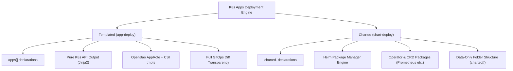
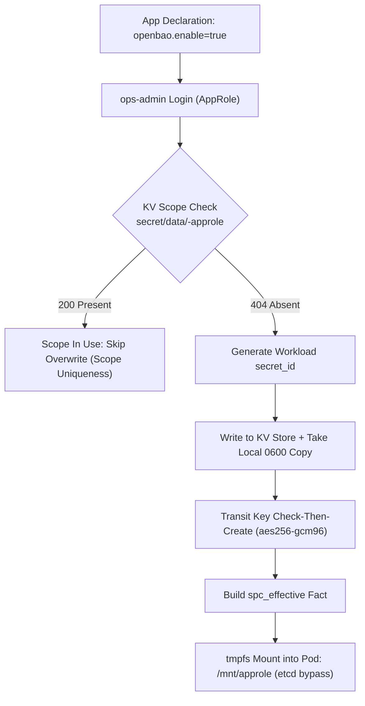
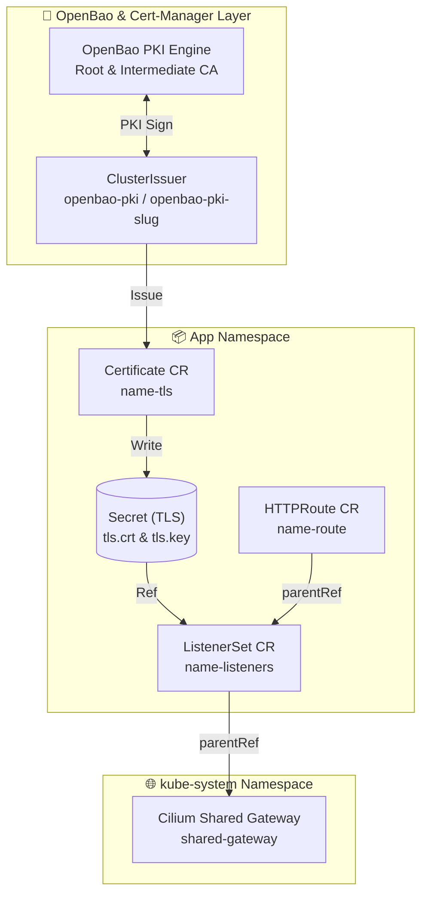
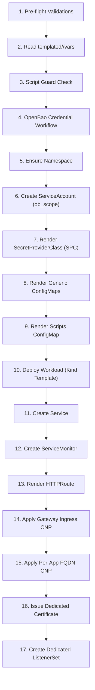
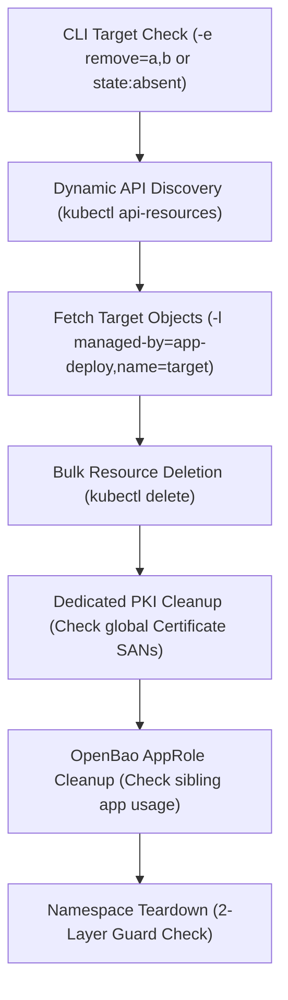
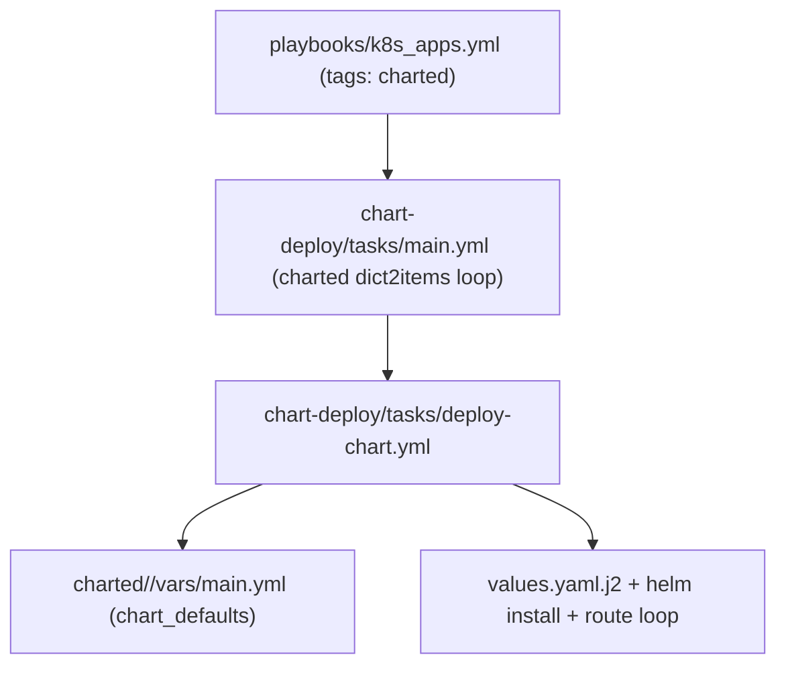

# K8s Apps Architecture and Lifecycle Guide (Internal Developer Platform & App Engine)

> **Scope and Authority:** This document is the **single technical and architectural reference** for the application layer (L3+) of the Kubernetes cluster within the `Cloud-in-Lab` platform — covering application declarations, deployment (`app-deploy`), removal (`app-remove`), Helm-based external ecosystem management (`chart-deploy`), security integrations (OpenBao, Cilium CNI, cert-manager, Gateway API), and the templating architecture. Infrastructure provisioning (L0–L2) lives in `docs/en/architecture/k8s-design.md`.

---

<details>
<summary><strong>Contents</strong></summary>

- [1. Architectural Overview and Engineering Principles](#1-architectural-overview-and-engineering-principles)
  - [1.1 Architectural Purpose and Platform Scope](#11-architectural-purpose-and-platform-scope)
  - [1.2 Core Engineering Principles and Trade-Off Analysis](#12-core-engineering-principles-and-trade-off-analysis)
  - [1.3 Deployment Strategy: Templated (`app-deploy`) vs Charted (`chart-deploy`)](#13-deployment-strategy-templated-app-deploy-vs-charted-chart-deploy)
- [2. Variable Schema, Configuration Hierarchy, and the App Contract](#2-variable-schema-configuration-hierarchy-and-the-app-contract)
  - [2.1 Configuration Hierarchy and Separation of Concerns](#21-configuration-hierarchy-and-separation-of-concerns)
  - [2.2 Core Fields and Defaults](#22-core-fields-and-defaults)
  - [2.3 OpenBao and Optional Fields Schema](#23-openbao-and-optional-fields-schema)
  - [2.4 Templated Folder Structure (`templated/<app>/`)](#24-templated-folder-structure-templatedapp)
  - [2.5 Pass-Through Template Pattern](#25-pass-through-template-pattern)
- [3. Subsystem and Security Architecture (Deep-Dive Engineering)](#3-subsystem-and-security-architecture-deep-dive-engineering)
  - [3.1 Zero-Trust Ephemeral Identity: OpenBao Self-Service Credential Flow](#31-zero-trust-ephemeral-identity-openbao-self-service-credential-flow)
  - [3.2 TLS, Domain Architecture & Gateway API Integration](#32-tls-domain-architecture--gateway-api-integration)
  - [3.3 Network Security Model & Cilium CNI Integration](#33-network-security-model--cilium-cni-integration)
- [4. Workload Lifecycle (Lifecycle Engine)](#4-workload-lifecycle-lifecycle-engine)
  - [4.1 Deploy Execution Flow (17 Sequential Steps)](#41-deploy-execution-flow-17-sequential-steps)
  - [4.2 Workload Kind Matrix](#42-workload-kind-matrix)
  - [4.3 Remove Flow and Clean Teardown](#43-remove-flow-and-clean-teardown)
- [5. Code Architecture, Helpers, and Templating Technique](#5-code-architecture-helpers-and-templating-technique)
  - [5.1 Pre-flight Validation Layers](#51-pre-flight-validation-layers)
  - [5.2 Helper System and Python Filter Plugin](#52-helper-system-and-python-filter-plugin)
  - [5.3 Template Dual Variable Set (`httproute.yaml.j2`)](#53-template-dual-variable-set-httprouteyamlj2)
- [6. Dispatcher Pattern in Charted (Helm) Architecture](#6-dispatcher-pattern-in-charted-helm-architecture)
  - [6.1 Data Merging and Values Selection](#61-data-merging-and-values-selection)
- [7. Reference Applications, File Map, and Operational Guide](#7-reference-applications-file-map-and-operational-guide)
  - [7.1 Reference Application Declarations (`group_vars/all/k8s_apps.yml`)](#71-reference-application-declarations-group_varsallk8s_appsyml)
  - [7.2 Project File Map](#72-project-file-map)
  - [7.3 Operational CLI Execution Guide](#73-operational-cli-execution-guide)

</details>

## 1. Architectural Overview and Engineering Principles

### 1.1 Architectural Purpose and Platform Scope

The core purpose of the application layer is to let developers and sysadmins ship secure, standardized, fully scalable workloads through **declarative statements (SSOT)** alone — without writing complex Kubernetes manifests. The `ansible/inventory/group_vars/all/k8s_apps.yml` file is the system's single source of truth (SSOT).

```
+---------------------------------------------------------------------------------+
|                       group_vars/all/k8s_apps.yml (SSOT)                        |
+---------------------------------------+-----------------------------------------+
                                        |
                   +--------------------+--------------------+
                   |                                         |
                   v                                         v
     +---------------------------+             +---------------------------+
     |     apps[] (Templated)    |             |     charted (Charted)     |
     |   - Jinja2 + Pure K8s API |             |   - Helm Package Manager  |
     |   - Ephemeral CSI & AppRole|             |   - Operator / CRD Stacks |
     +--------------+------------+             +--------------+------------+
                    |                                         |
                    v                                         v
         roles/k8s-apps/app-deploy                 roles/k8s-apps/chart-deploy
```

### 1.2 Core Engineering Principles and Trade-Off Analysis

The platform is built on six core architectural principles:

| Engineering Principle | Technical Meaning and Rationale (Why) | Concrete Counterpart in the System |
|---|---|---|
| **Convention over Configuration** | A standard application is declared in just a few lines. Edge cases move out to `templated/<app>/` without breaking the central structure. Minimizes developer cognitive load. | Minimal `apps[]` definition; automatic naming, default port and label derivation. |
| **Fail-Loud** | Broken or incompatible input is caught by Ansible `assert` tasks before `kubectl apply` and the run stops. No half-created/orphan objects are left in the cluster. | Pre-flight input validations (`assert`). |
| **Zero-Trust Ephemeral Identity** | Kubernetes Secrets are never written to the `etcd` database in plaintext. Pod identities come from OpenBao AppRole + Secrets Store CSI Driver via a `tmpfs` RAM-disk mount. | OpenBao CSI integration with `secretObjects` sync off. |
| **Non-Breaking Schema Extension** | Templates never constrain the Kubernetes API. Undefined fields are skipped, defined fields render raw. Platform updates never lock applications. | Pass-Through Template Pattern (`to_nice_yaml`). |
| **Default-Deny Network** | Default network access is closed in both directions. Traffic opens only through explicitly declared `expose` or `egress_fqdn` statements. | Cilium CNI default-deny and dynamic FQDN policies. |
| **Separation of Deploy and Remove** | Installation (`app-deploy`) and removal (`app-remove`) run as two independent worlds. Live state is read only from the cluster (`kubectl get`). | `enable: true` and `state: absent` flags working in independent plays without conflict. |

> **Deliberate Architecture Boundary (Critical Nuance):** `state: absent` or `enable: false` values never describe live cluster state. The system never assumes "is this application currently installed?" by looking at a config file; live state is always queried dynamically from the Kubernetes API server. An application may carry both `enable: true` and `state: absent` — this is not a contradiction, it answers the question of the play it runs in.

### 1.3 Deployment Strategy: Templated (`app-deploy`) vs Charted (`chart-deploy`)

The application layer offers two deployment patterns, depending on the nature of the workload:



1. **Templated (`app-deploy`):** Preferred for in-house microservices (.NET Web APIs, Python workers, Redis, etc.). Here Helm's state-tracking complexity would add overhead at this scale, so pure Kubernetes manifests are generated with Jinja2 instead. The GitOps `diff` shows every generated object transparently in a single YAML file.
2. **Charted (`chart-deploy`):** Used for external, complex ecosystems with CRDs and Operators (e.g. `kube-prometheus-stack`). Here Helm is not an architecture rule but a package manager that isolates upstream package updates. `charted/<key>/` folders carry only data/templates (`data-only`), no tasks.

---

[↑ Back to top](#k8s-apps-architecture-and-lifecycle-guide-internal-developer-platform--app-engine)

## 2. Variable Schema, Configuration Hierarchy, and the App Contract

### 2.1 Configuration Hierarchy and Separation of Concerns

Configuration in the system feeds from three layers, and the rule is crisp: **"vars points, app declares"**.

1. **App Declaration (`group_vars/all/k8s_apps.yml` -> `apps[]`):** What the application is, plus engine inputs (`command`, `port`, `image`, `egress_fqdn`).
2. **Templated Vars (`templated/<app>/vars/main.yml`):** Content pointers (`openbao_script_file`, `openbao_mount`, `openbao_key`).
3. **Charted Override (`group_vars/all/k8s_apps.yml` -> `charted.<key>`):** User configuration overriding the chart defaults (`charted/<key>/vars/main.yml`) via `combine(recursive=true)`.

### 2.2 Core Fields and Defaults

`app-deploy/tasks/main.yml` flattens each application input into flat task variables; templates read these flat variables:

| Field | Type | Default | Function | Consuming Steps |
|---|---|---|---|---|
| `name` | String | *Required* | Application name; all K8s object names and naming contracts derive from it. | Every template and task |
| `image` | String | *Required* | Container image and tag. | Workload templates |
| `enable` | Boolean | `false` | Deploy loop filter (`selectattr enable equalto true`). | `main.yml` |
| `state` | String | `present` | Remove target selector (`present` / `absent`). | `app-remove/main.yml` |
| `kind` | String | `deployment` | Workload type (`deployment`, `statefulset`, `job`, `cronjob`). | `deploy-app.yml` |
| `namespace` | String | `app.name` | Isolated namespace the objects land in. | Every template |
| `port` | Integer | `80` | Service external port. | `service.yaml.j2`, `httproute.yaml.j2` |
| `container_port` | Integer | `app.port \| 80` | In-pod listening port (Service targetPort). | Workload templates, `service.yaml.j2` |
| `replicas` | Integer | `1` | Deployment or StatefulSet replica count. | Workload templates |
| `hostnames` | String/List | `app.name` | Hostname list for HTTPRoute and Certificate; a comma-separated string is split. | `httproute.yaml.j2`, `certificate.yaml.j2` |
| `use_base_domain` | Boolean | `true` | Append `base_domain` to hostnames? | HTTPRoute, Certificate |
| `expose` | Boolean | `true` | HTTPRoute + Gateway CNP generation (ListenerSet too, for dedicated TLS). | `deploy-app.yml` |
| `schedule` | String | `''` | CRON schedule expression for CronJobs (*required on CronJobs*). | `cronjob.yaml.j2` |

### 2.3 OpenBao and Optional Fields Schema

```yaml
# OpenBao Configuration Block
openbao:
  enable: true                 # Enables OpenBao credential generation
  profile: transit-user        # Working profile (reader, job-run, transit-user, operator, etc.); one role per profile, isolation via identity-template; TTLs fixed in the catalog (`openbao_workload_profiles`: `token_ttl`/`token_max_ttl` + `renewable` → service/batch token)
  scope: myapp                 # KV and Transit key naming scope (at deploy the scope is always `app.name`; `scope` is only read in the remove AppRole guard)
  scope_level: app             # Scope level (app / namespace - untested)

# Optional Customizations
spc: {}                        # Manually provided SecretProviderClass (uses spc_effective when empty)
configmaps:                    # Generic ConfigMap list
  - name: custom-config
    data:
      app.json: '{"env": "prod"}'
monitoring:
  serviceMonitor:
    enabled: true              # Generates a Prometheus ServiceMonitor
    path: /metrics
    interval: 30s
    scrapeTimeout: 10s
egress_fqdn:                   # Per-app External Network Access Permissions
  - match: "api.stripe.com"
  - pattern: "*.pypi.org"
    ports: [443]
allow_script_mismatch: false   # Script guard escape hatch
tls:
  mode: dedicated              # TLS mode: shared (default) or dedicated
  duration: 2160h              # Certificate validity (90 days)
  renewBefore: 360h            # Renewal window (15 days)
  keyAlgorithm: ECDSA          # Dedicated key algorithm (ECDSA / RSA)
  keySize: 384                 # Key size
  issuerName: ""               # Optional field overriding automatic issuer selection
  domains: []                  # Custom domain list for the Certificate (`tls_domains` flat variable; default: hostnames)
```

### 2.4 Templated Folder Structure (`templated/<app>/`)

An optional dedicated folder may be created per application; `deploy-app.yml` loads it with `include_vars`, silently skipped when absent:

* `vars/main.yml`: Holds app-specific pointer variables (the `openbao_` prefix is not mandatory).
* `files/<script>`: Holds the Python or Bash scripts the workload runs; placed into a ConfigMap with `lookup('file')`.
* `alerts/`: Optionally stores `PrometheusRule` manifests for record-keeping (applied manually with `kubectl apply -f openbao-alerts.yaml -n monitoring`).

Reference application variable file for `transit-envelope-b` (`templated/transit-envelope-b/vars/main.yml`):

```yaml
openbao_spc_role: k8s-csi-provider
openbao_scripts_cm: transit-envelope-b-scripts
openbao_script_file: envelope.py
openbao_mount: transit
openbao_key: app-key            # Derived transit key: transit-envelope-b-app-key
openbao_approle_role_id_path: /mnt/approle/role_id
openbao_approle_secret_id_path: /mnt/approle/secret_id
```

### 2.5 Pass-Through Template Pattern

Workload templates **render fields with a Kubernetes API counterpart when given, skip them when absent**. The template engine wraps every field in a `` block with the `to_nice_yaml` filter. A new field arriving in the K8s API is thus usable via raw injection without updating the platform template.

```jinja2
{# Pass-Through Example: Probes & Resources #}


          livenessProbe:
{{ probes.liveness | to_nice_yaml(indent=2) | indent(12) }}


          readinessProbe:
{{ probes.readiness | to_nice_yaml(indent=2) | indent(12) }}


```

---

[↑ Back to top](#k8s-apps-architecture-and-lifecycle-guide-internal-developer-platform--app-engine)

## 3. Subsystem and Security Architecture (Deep-Dive Engineering)

### 3.1 Zero-Trust Ephemeral Identity: OpenBao Self-Service Credential Flow

The application layer uses OpenBao AppRole integration and the Secrets Store CSI Driver to keep static passwords out of the `etcd` database. The root token is never used; everything runs through the `ops-admin` AppRole token.



#### Credential Generation Flow Steps (`openbao-workflow.yml`)

1. **Mount Config Load:** `outputs/openbao/openbao-mount.json` is read to resolve the KV and AppRole mount paths.
2. **ops-admin Session:** A session opens on OpenBao with the `outputs/openbao/ops-admin.json` credential (`bao_token`).
3. **Scope Collision Check:** The `secret/data/<scope>-approle` address is queried. On `200`, steps are skipped to prevent collision. On `404`, new identity generation starts.
4. **Workload Secret-ID Generation (`produce-workload-creds`):** A new `secret_id` is generated per the profile definition and written to the local `outputs/openbao/<scope>-approle.json` file (`0600` permission, `no_log`) and the OpenBao KV store.
5. **Transit Key Setup (`produce-transit-key`):** When `openbao_mount` is defined, an `aes256-gcm96`, `exportable: false` key named `<scope>-<openbao_key>` is created with the check-then-create pattern.
6. **CSI SPC Setup (`read-workload-creds`):** `<scope>-approle.json` is read and the `spc_effective` object is built, mounting `/mnt/approle` into the pod as `tmpfs` (RAM disk).

```yaml
# Generated SecretProviderClass (SPC) Manifest
apiVersion: secrets-store.csi.x-k8s.io/v1
kind: SecretProviderClass
metadata:
  name: myapp-approle
  namespace: myapp
spec:
  provider: openbao
  parameters:
    roleName: "k8s-csi-provider"
    audience: "openbao"                # MANDATORY for OpenBao JWT verification (403 otherwise)
    objects: |
      - objectName: "role_id"
        secretPath: "secret/data/myapp-approle"
        secretKey: "role_id"
      - objectName: "secret_id"
        secretPath: "secret/data/myapp-approle"
        secretKey: "secret_id"
```

> **Critical Security Decision:** The `secretObjects` (Kubernetes Secret Sync) block is deliberately **absent** from the `SecretProviderClass` object. Credentials therefore never persist on etcd; the CSI driver reads from the OpenBao KV path and writes straight into the pod's in-RAM `tmpfs` area.

### 3.2 TLS, Domain Architecture & Gateway API Integration

Both Gateway listeners are always active: `http` (80) and `https` (443). HTTP→HTTPS redirection is managed cluster-wide with `tls_mode` (`allow-http` for dev, `redirect` for prod). TLS management runs in two modes over Gateway API v1.3+ and the cert-manager architecture:

| Feature | Shared TLS Mode (Default) | Dedicated TLS Mode |
|---|---|---|
| **Certificate Scope** | Wildcard `*.tofu.lan` | App-specific dedicated certificate |
| **Certificate Location** | `kube-system/gateway-tls` | `{name}-tls` in the app's own namespace |
| **Routing Object** | HTTPRoute -> `shared-gateway` | HTTPRoute -> `{name}-listeners` ListenerSet |
| **Cross-Namespace Secret** | Not needed | None (no `ReferenceGrant` needed thanks to ListenerSet) |
| **Use Case** | Standard internal services (under `base_domain`) | External domains, custom ECDSA keys |



#### Dedicated External Domain Pre-Flight (`dedicated-pki-domains.yml`)

When an application is defined with `use_base_domain: false` and `tls.mode: dedicated` (e.g. `echo3.lab.internal`), the system runs a preliminary step with the `pki-manager` AppRole identity and automatically provisions a dedicated PKI role and `ClusterIssuer`:

1. The first label of the hostname is dropped and a unique domain list is derived (`echo3.lab.internal` -> `lab.internal`).
2. The `pki-int/roles/dedicated-lab-internal` role is installed on OpenBao (`max_ttl 2160h`, `key_type ec`, `key_bits 384`).
3. A new `ClusterIssuer` named `openbao-pki-lab-internal` is published cluster-wide.

#### Architecture Decision: Gateway Certificate CR vs Annotation Rationale

A **separate Certificate CR and ListenerSet** architecture is chosen over cert-manager annotations (`cert-manager.io/*`) on the Gateway. Rationale:

| Angle | Annotation Approach | Separate Certificate CR + ListenerSet (Current Architecture) |
|---|---|---|
| **Certificate Control** | Limited parameter management via annotation. | Full `duration/renewBefore/privateKey` control. |
| **Multiple Certificates** | A Gateway annotation yields a single Secret. | Apps add self-service certificates with their own ListenerSet on top of the shared wildcard certificate. |
| **Hot-Reload & Cilium** | Gateway reconciles, which may lead to hard-to-diagnose states. | When the certificate Secret updates, the Cilium Envoy proxy loads the TLS Secret change instantly via dynamic hot-reload. |
| **GitOps Diff** | Auto-generated resources hide the diff. | Every CR shows transparently in its own GitOps diff. |

> **Static Gateway reference:** The Gateway `certificateRefs` list points only at the wildcard `gateway-tls` Secret; no variable generates a dynamic certificate list. Non-wildcard needs are served not on the Gateway but in the dedicated app's own Certificate + ListenerSet — the shared Gateway stays fixed.

> **Monitoring note:** To watch certificate expiry, alerts may target certificates entering their last 7 days via the `certmanager_certificate_expiration_timestamp_seconds` metric; TLS handshakes and SNI matches are visible in Hubble L7 flow observability.

### 3.3 Network Security Model & Cilium CNI Integration

Default network access in the system is closed by the **Global Default-Deny** policy (`global-default-deny-all`). DNS is exempt and open cluster-wide (`global-allow-essential-dns`, TCP/UDP 53); Envoy-to-pod ingress relies on these intermediate rules. Applications have network policies (CNPs) auto-generated by declaring the access they need.

```
                  +-----------------------------------+
                  |   Global Default-Deny Policy      |
                  +-----------------+-----------------+
                                    |
            +-----------------------+-----------------------+
            |                       |                       |
            v                       v                       v
+-----------------------+ +-----------------------+ +-----------------------+
|  OpenBao Egress Label | | Gateway Envoy         | | Per-App FQDN Egress   |
|  homelab.io/allow...  | | Ingress Policy        | | egress_fqdn[]       |
|  -> TCP 8200          | | -> reserved:ingress  | | -> pypi.org (TCP 443) |
+-----------------------+ +-----------------------+ +-----------------------+
```

#### Cilium 1.20 Deny-All Contract and Dummy Endpoint Technique

Cilium 1.20+ CRD validators reject empty `ingress: []` or `egress: []` arrays as invalid (`Valid: False`). To build a valid default close rule, the system uses a **dummy endpoint** label:

```yaml
# security/templates/cilium-default-deny.yaml.j2
apiVersion: "cilium.io/v2"
kind: CiliumNetworkPolicy
metadata:
  name: "app-default-deny"
spec:
  endpointSelector: {}
  ingress:
    - fromEndpoints:
        - matchLabels:
            k8s:non-existent: "true"   # Matches no pod, makes the rule Valid True
  egress:
    - toEndpoints:
        - matchLabels:
            k8s:non-existent: "true"
```

The `allow-gateway-egress-<name>` CNP is generated so the Gateway Envoy source (`reserved:ingress`) can reach web applications; otherwise Cilium Envoy returns a `403 server: envoy Access denied` error at the L7 layer.

---

[↑ Back to top](#k8s-apps-architecture-and-lifecycle-guide-internal-developer-platform--app-engine)

## 4. Workload Lifecycle (Lifecycle Engine)

### 4.1 Deploy Execution Flow (17 Sequential Steps)

Dependency ordering matters when shipping an application. The workload (pod) must find the Namespace, ServiceAccount, SPC, and ConfigMap objects it needs in place on the **first attempt**. Every rendered YAML file lands in `/tmp/app-<name>-<object>.yaml` and is applied with `kubectl apply -f` (`kubectl apply` is idempotent, so re-runs are safe; `changed_when: false` quiets reporting).



#### Step-by-Step Generation Matrix (`deploy-app.yml`)

| Step | Operation / Object | Run Condition | Generation Purpose |
|---|---|---|---|
| **1** | Pre-flight Assertions | Always | Stops missing/faulty inputs before they reach K8s (`name`+`image` required, `kind` valid, `schedule` required on cronjobs, hostname non-empty, `match`/`pattern` required in `egress_fqdn` entries). |
| **2** | Vars Load | When the folder exists | Reads `templated/<app>/vars/main.yml`. |
| **3** | Script Guard | When `command`/`args` are set + `openbao_script_file` is defined (with `allow_script_mismatch: false`) | Verifies the `openbao_script_file` match. |
| **4** | OpenBao Workflow | `openbao.enable: true` + `profile != none` | Generates credentials and `spc_effective`. |
| **5** | Namespace | Always | Creates the isolated work area. |
| **6** | ServiceAccount | `openbao.enable: true` | Pod identity for the CSI provider (`ob_scope`). |
| **7** | SecretProviderClass | When SPC or `spc_effective` is set | RAM-disk secret transfer definition. |
| **8** | Generic ConfigMaps | When `configmaps[]` is set | Application configuration files. |
| **9** | Scripts ConfigMap | When a script file exists | Binds the script body into the `/scripts` directory. |
| **10** | Workload Manifest | Always | Deployment, StatefulSet, Job, or CronJob (template file selected via `common/templates/{{ kind }}.yaml.j2`). |
| **11** | Service | Deployment/StatefulSet | Stable in-cluster IP:port address. |
| **12** | ServiceMonitor | Deployment/Sts + `serviceMonitor.enabled` | Prometheus scrape definition. |
| **13** | HTTPRoute | Deployment/Sts + `expose` | Gateway API traffic routing. |
| **14** | Gateway Ingress CNP | Deployment/Sts + `expose` | Ingress permission from the Envoy proxy into the pod. |
| **15** | FQDN Egress CNP | When `egress_fqdn[]` is set | Pod-to-outside egress permission (kind-independent). |
| **16** | Certificate | Deployment/Sts + `tls.mode: dedicated` + `expose` | Dedicated certificate request. |
| **17** | ListenerSet | Deployment/Sts + `tls.mode: dedicated` + `expose` | Dedicated HTTPS port and TLS termination. |

#### Automatic Engine Injections

* **Labeling:** Every generated object carries `app.kubernetes.io/managed-by: app-deploy` and `app.kubernetes.io/name: <name>`. The single exception is the Namespace: created without labels, remove deletes it through a guarded special flow.
* **OpenBao Egress Label:** When `openbao.enable: true`, the `homelab.io/allow-openbao-egress: "true"` label is stamped on the pod (opens port 8200 via CCNP).
* **OpenBao Environment Variables:** `OPENBAO_ADDR`, `APPROLE_ROLE_ID_PATH` (`/mnt/approle/role_id`), `APPROLE_SECRET_ID_PATH` (`/mnt/approle/secret_id`) are injected into Job and Deployment containers; Jobs additionally get `TRANSIT_MOUNT` and `TRANSIT_KEY`.
* **Scripts Default Command:** When a scripts-CM is defined, `/scripts` is mounted; when the app gives no `command`, the default `["python", "/scripts/<openbao_script_file>"]` runs.

#### Task Summary of Generated Objects

| Object | Function | Attached to |
|---|---|---|
| **Namespace** | Opens an isolated work area for the app | — |
| **ServiceAccount** | Pod identity for the CSI provider (`ob_scope`) | OpenBao `auth/kubernetes` |
| **SecretProviderClass** | Pod→OpenBao tmpfs secret flow definition (no `secretObjects` sync) | OpenBao CSI |
| **ConfigMap (generic/scripts)** | Config files; binds the script body into `/scripts` | Workload |
| **Deployment/StatefulSet** | Long-lived service | Service → HTTPRoute → Gateway |
| **Job/CronJob** | One-shot / scheduled work | — |
| **Service** | Stable IP:port (`port`/`container_port`) | HTTPRoute backend |
| **ServiceMonitor** | Prometheus scrape definition | kube-prometheus-stack |
| **HTTPRoute** | Hostname→service route | Gateway or `<name>-listeners` |
| **Gateway-CNP** | Ingress permission from Envoy into the pod | Cilium |
| **FQDN-CNP** | Egress permission to declared external targets | Cilium |
| **Certificate (`<name>-tls`)** | App-specific certificate request | Issuer → ListenerSet |
| **ListenerSet** | Dedicated TLS termination | Gateway (`kube-system`) |
| **ClusterIssuer (`openbao-pki-<slug>`)** | External domain signer | cert-manager |

### 4.2 Workload Kind Matrix

Capabilities supported by different Kubernetes workloads:

| Capability | Deployment | StatefulSet | Job | CronJob |
|---|---|---|---|---|
| **Namespace** | ✅ | ✅ | ✅ | ✅ |
| **ServiceAccount** | ✅ (when `openbao_enabled`) | ❌ | ✅ (when `openbao_enabled`) | ❌ |
| **Service & HTTPRoute** | ✅ (when exposed) | ✅ (when exposed) | ❌ | ❌ |
| **ServiceMonitor** | ✅ | ✅ | ❌ | ❌ |
| **OpenBao Wiring** | ✅ (automatic env/vol) | ❌ (*Unsupported*) | ✅ (automatic env/vol) | ❌ (*Unsupported*) |
| **Scripts CM Automation** | ✅ | ❌ | ✅ | ❌ |
| **Per-App FQDN Egress** | ✅ | ✅ | ✅ | ✅ |

> **Deliberate Architecture Boundary:** `statefulset` and `cronjob` templates carry no OpenBao automatic env/volume wiring. The `statefulset`/`cronjob` + `openbao.enable: true` combination is unsupported until the templates are extended.

### 4.3 Remove Flow and Clean Teardown

Deletion is driven not by the inventory file but **directly by the in-cluster label (`app.kubernetes.io/managed-by=app-deploy, app.kubernetes.io/name=<target>`)**. When `-e remove="a,b"` passes over the CLI, the CLI wins over the inventory's `state: absent` list.



#### Deletion Safety Guards (`app-remove`)

1. **Dynamic Resource Discovery (`delete-k8s-objects.yml`):** Deletable object types are never hand-written; they are pulled dynamically from the live cluster with `kubectl api-resources --verbs=delete --namespaced -o name` (excluding `events`, `endpoints`, `endpointslices`, `pods`). Even a newly added CRD falls automatically under the deletion engine. All listed resources delete in bulk with a single `kubectl delete` command. One exception to label-based discovery: the unlabeled `<target>-tls` Secret generated in older versions (under the dedicated TLS condition) deletes by name with `--ignore-not-found`; new certificates carry the label via `secretTemplate.labels` and fall into label discovery.
2. **Dedicated PKI Cleanup (`delete-dedicated-pki.yml`):** Before an external-domain certificate deletes, **all Certificate objects' (CR) SAN data** in the cluster scans. When another active application uses the same domain, the PKI role and ClusterIssuer are **not deleted (fail-loud / fail-safe)**.
3. **AppRole Guard Cleanup (`delete-openbao-approle.yml`):** When another active application (`state: present`) in `apps[]` shares the same OpenBao AppRole name, the AppRole is not deleted. The code carries no special filter excluding `target_app`; the target counts too — a target deleted via CLI but still `present` in inventory counts itself and the role stays conservatively protected.

> **Open point (code-verified):** While the produce side generates secret-ids through the profile-named role (`transit-user`), the remove side tries to delete a role named `app-<scope>-<profile>`. Since no role under that name exists in the catalog, DELETE returns 404 (silent no-op) — the profile role rightly survives sharing. Whether the KV entry (`<scope>-approle`) and the controller output (`outputs/openbao/<scope>-approle.json`) get cleaned on remove has not been verified live.
4. **Two-Layer Namespace Cleanup:**
   * *Layer 1 (Inventory Guard):* Does another application in `apps[]` still use that namespace with `enable: true`?
   * *Layer 2 (Cluster Guard):* Does any foreign Kubernetes resource remain in the namespace beyond the system defaults (`kube-root-ca.crt`, `serviceaccount/default`, `default-token-*`)?
   * When both guards pass, the namespace deletes with `timeout 150 kubectl delete namespace <ns> --wait=true`. When it refuses, the following are checked in order: finalizers/conditions, `v1beta1.metrics.k8s.io` apiservice corruption, metrics-server pod state (known root-cause candidate: a broken metrics-apiservice blocks termination); then retry with a `finalizers: null` patch + `--wait=false`, and manual intervention when that still fails.

---

[↑ Back to top](#k8s-apps-architecture-and-lifecycle-guide-internal-developer-platform--app-engine)

## 5. Code Architecture, Helpers, and Templating Technique

### 5.1 Pre-flight Validation Layers

A 3-layer mechanism that secures input safety:

| Layer | Location | Method | Responsibility |
|---|---|---|---|
| **1. Primary** | `deploy-app.yml` | `ansible.builtin.assert` (empty-check; no regex) | Stops inputs before apply (empty hostname, missing image, etc.). |
| **2. Defensive** | `httproute.yaml.j2` | Jinja string→list normalization (no `` inside the template) | Tolerates malformed variable shape at render time. |
| **3. Reusable** | `filter_plugins/k8s_helpers.py` | Python `validate_hostname()` | Defined but unused in templates — a reference custom Python filter. |

```yaml
# deploy-app.yml - Primary Assertion Example (real)
- name: Validate hostname format
  ansible.builtin.assert:
    that:
      - item | length > 0
    fail_msg: "{{ name }}: validate hostname format: {{ item }}"
  loop: "{{ hostnames.split(',') if hostnames is string else hostnames }}"
  when: hostnames is defined and hostnames | length > 0
```

> **Note:** No regex validation exists in code for `use_base_domain: false`; hostname checks stop at non-emptiness. The `use_base_domain` flag feeds FQDN generation (`httproute.yaml.j2`), issuer selection (`certificate.yaml.j2`), `dedicated_hostname` derivation, and external-domain filtering (`dedicated-pki-domains.yml`).

### 5.2 Helper System and Python Filter Plugin

Role-local filters move computation logic out of Jinja2 templates into Python code (`roles/k8s-apps/app-deploy/filter_plugins/k8s_helpers.py`):

```python
# filter_plugins/k8s_helpers.py (real code)
import re
import unicodedata


class FilterModule:
    def filters(self):
        return {
            'validate_hostname': self.validate_hostname,
            'to_kubernetes_name': self.to_kubernetes_name,
            'arch_image': self.arch_image,
        }

    @staticmethod
    def validate_hostname(value):
        if not isinstance(value, str):
            return False
        pattern = r'^[a-zA-Z0-9]([a-zA-Z0-9-]{0,61}[a-zA-Z0-9])?(\.[a-zA-Z0-9]([a-zA-Z0-9-]{0,61}[a-zA-Z0-9])?)*$'
        return bool(re.match(pattern, value))

    @staticmethod
    def to_kubernetes_name(value):
        value = unicodedata.normalize('NFKD', str(value)).encode('ASCII', 'ignore').decode('ascii')
        value = re.sub(r'[^a-zA-Z0-9-]', '-', value.lower())
        value = re.sub(r'-+', '-', value).strip('-')
        if len(value) > 253:
            value = value[:253].rstrip('-')
        if not value:
            value = 'default'
        return value

    @staticmethod
    def arch_image(repo, tag=None, arch=None):
        if arch:
            tag = f'{tag}-{arch}' if tag else arch
        return f'{repo}:{tag}' if tag else repo
```

### 5.3 Template Dual Variable Set (`httproute.yaml.j2`)

The `httproute.yaml.j2` template carries a dual-variable architecture supporting both generic `app-deploy` calls and specific calls such as `chart-deploy` (simplified summary; the real template includes `default('')` guards, `_use_bd`/`_fqdn_list` resolution, and the dedicated parentRef branch):

```jinja2
{# Variable Resolution Hierarchy #}





```

---

[↑ Back to top](#k8s-apps-architecture-and-lifecycle-guide-internal-developer-platform--app-engine)

## 6. Dispatcher Pattern in Charted (Helm) Architecture

The charted path consists of the `chart-deploy` dispatcher role merged with `charted/<key>/` data-only folders. No chart name lives in the playbook; the loop is inside the role.



### 6.1 Data Merging and Values Selection

1. `charted/<key>/vars/main.yml` loads (`chart_defaults`).
2. `chart_cfg` emerges from `chart_defaults | combine(charted[chart_key], recursive=true)`.
3. The mandatory `release_name`, `chart`, `namespace` fields assert.
4. Values selection: when `charted/<key>/templates/values.yaml.j2` exists it wins; otherwise, when `chart_cfg.helm_values` is set, it falls back to the `common/templates/helm-values.yaml.j2` skeleton.
5. Everything written under `helm_values` is rendered verbatim into the values file as passthrough. A wrong key is silently swallowed by Helm — verify with `helm show values`.

```yaml
# Charted Configuration Example (group_vars/all/k8s_apps.yml)
charted:
  prom_stack:
    enable: true
    release_name: kube-prom-stack
    namespace: monitoring
    prometheus:
      subdomain: prometheus
      port: 9090
    grafana:
      enabled: true
      subdomain: grafana
      port: 80
      admin_password: "ChangeMe-2026"  # Left empty, Helm generates one with randAlphaNum
    alertmanager:
      enabled: true
      subdomain: alertmanager
      port: 9093
```

---

[↑ Back to top](#k8s-apps-architecture-and-lifecycle-guide-internal-developer-platform--app-engine)

## 7. Reference Applications, File Map, and Operational Guide

### 7.1 Reference Application Declarations (`group_vars/all/k8s_apps.yml`)

The reference configuration set proving the platform's full capabilities:

```yaml
apps:
  # 1. Standard Web App (Shared TLS)
  - name: echo-server
    enable: false
    state: absent
    image: ealen/echo-server:latest
    hostnames: ["echo"]                # -> echo.tofu.lan
    namespace: demo
    port: 80
    templateLabels:
      ingress-exposed: "true"

  # 2. Dedicated TLS Web App
  - name: echo2-server
    enable: false
    state: absent
    image: ealen/echo-server:latest
    hostnames: ["echo2"]               # -> dedicated cert for echo2.tofu.lan
    namespace: demo
    port: 80
    templateLabels:
      ingress-exposed: "true"
    tls:
      mode: dedicated

  # 3. Dedicated External Domain (External Domain + PKI Pre-check)
  - name: echo3-server
    enable: false
    state: absent
    image: ealen/echo-server:latest
    hostnames: ["echo3.lab.internal"] # External domain
    namespace: demo
    port: 80
    use_base_domain: false
    templateLabels:
      ingress-exposed: "true"
    tls:
      mode: dedicated
      keyAlgorithm: ECDSA
      keySize: 384

  # 4. OpenBao Connectivity Proof Job (CONNECTIVITY PASS)
  - name: transit-envelope-demo
    enable: false
    state: absent
    kind: job
    image: python:3.11-slim-bookworm
    namespace: transit-demo
    openbao:
      enable: true
      profile: transit-user

  # 5. Production Envelope Cryptography Job (OpenBao + FQDN Egress)
  - name: transit-envelope-b
    enable: false
    state: absent
    kind: job
    image: python:3.11-slim-bookworm
    namespace: transit-demo
    command: ["python", "/scripts/envelope.py"]
    openbao:
      enable: true
      profile: transit-user
    egress_fqdn:                       # PyPI access permission
      - match: "pypi.org"
      - pattern: "*.pythonhosted.org"
        ports: [443]
    backoffLimit: 2
    ttlSecondsAfterFinished: 300
    activeDeadlineSeconds: 120

  # 6. Internal Metrics Exporter (ServiceMonitor)
  - name: openbao-metrics-exporter
    enable: false
    state: absent
    image: python:3.11-slim-bookworm
    namespace: monitoring
    container_port: 9090
    port: 9090
    expose: false                      # Closed to the outside, internal scrape only
    openbao:
      enable: true
      profile: metrics-reader
    labels:
      homelab.io/allow-openbao-egress: "true"
    monitoring:
      serviceMonitor:
        enabled: true
        port: 9090
        path: /metrics
        interval: 30s
        scrapeTimeout: 10s
```

> **Note — what happens to an app without `kind` (the `openbao-metrics-exporter` example):** This example carries no `kind` field; the engine treats it as **deployment** via the `app.kind | default('deployment')` rule (`main.yml`) (§2.2 core fields table). With `expose: false`, the outward-facing part of the web path is never generated; the internal service skeleton is built in full. Generated objects: Namespace (`monitoring`), ServiceAccount + SPC (OpenBao wiring, since `openbao.enable: true`), Deployment (OpenBao env/volume and pod egress label auto-injected), Service (`port`/`container_port: 9090`), ServiceMonitor (via `monitoring.serviceMonitor.enabled`). Never generated: HTTPRoute and gateway-CNP (`expose: false`), Certificate/ListenerSet (same condition; besides, no app certificate is needed in shared mode), and FQDN-CNP (no `egress_fqdn` declared). Which block is generated under which kind is summarized in the §4.2 kind matrix.

#### Playbook Execution Chain

Deploy (`k8s_apps.yml`): connect → env-check → `openbao-env-check` → ded-PKI pre-check → charted → app-deploy. Remove (`k8s_apps_remove.yml`): connect → env-check → `openbao-env-check` → app-remove. The `openbao-env-check` play guarantees the mandatory `openbao_address` fact for the credential flow of openbao-enabled apps; without the fact, the openbao-workflow fails.

### 7.2 Project File Map

```text
ansible/
├── playbooks/
│   ├── k8s_apps.yml                   # Deploy main orchestration playbook
│   └── k8s_apps_remove.yml            # Remove main orchestration playbook
├── inventory/
│   └── group_vars/all/k8s_apps.yml    # SINGLE SOURCE OF TRUTH (SSOT)
└── roles/k8s-apps/
    ├── app-deploy/                    # Generic Templated Deploy Role
    │   ├── defaults/main.yml          # base_domain, gateway_hostname, gateway_namespace, openbao_key, expose
    │   ├── filter_plugins/
    │   │   └── k8s_helpers.py         # Role-local custom Python filters
    │   └── tasks/
    │       ├── main.yml               # Flat variable derivation and loop
    │       ├── deploy-app.yml         # 17-step generation tasks
    │       ├── openbao-workflow.yml   # Credential orchestration
    │       ├── produce-workload-creds.yml # secret-id generation
    │       ├── produce-transit-key.yml # Transit key generation
    │       ├── read-workload-creds.yml # Credential read and spc_effective
    │       └── dedicated-pki-domains.yml # External domain PKI pre-flight
    ├── app-remove/                    # Dynamic Cleanup Role
    │   └── tasks/
    │       ├── main.yml               # Target detection and orchestration
    │       ├── delete-k8s-objects.yml # Label-based dynamic deletion
    │       ├── delete-dedicated-pki.yml # Guarded PKI deletion
    │       └── delete-openbao-approle.yml # Guarded AppRole deletion
    ├── chart-deploy/                  # Charted Helm Dispatcher Role
    │   └── tasks/
    │       ├── main.yml               # Chart loop filter
    │       └── deploy-chart.yml       # Helm install and route binding
    ├── common/templates/              # Shared Jinja2 Templates
    │   ├── namespace.yaml.j2, serviceaccount.yaml.j2, secretproviderclass.yaml.j2, configmap.yaml.j2
    │   ├── deployment.yaml.j2, statefulset.yaml.j2, job.yaml.j2, cronjob.yaml.j2
    │   ├── service.yaml.j2, servicemonitor.yaml.j2, httproute.yaml.j2
    │   ├── certificate.yaml.j2, listenerset.yaml.j2, cluster-issuer-dedicated.yaml.j2
    │   ├── cilium-allow-gateway-egress.yaml.j2, cilium-allow-egress-fqdn.yaml.j2
    │   ├── helm-values.yaml.j2        # Charted passthrough skeleton
    │   └── helpers/_helpers.j2        # Jinja2 Macros
    ├── templated/<app>/               # Per-app custom vars/files folders
    └── charted/<key>/                 # DATA-ONLY: Chart defaults and values templates
```

### 7.3 Operational CLI Execution Guide

Commands run from under the `ansible/` directory:

```bash
# 1. Deploy All Active Templated Applications
ansible-playbook -i inventory/hosts.ini.generated playbooks/k8s_apps.yml --tags apps

# 2. Deploy Only a Single Application (Filtered)
ansible-playbook -i inventory/hosts.ini.generated playbooks/k8s_apps.yml --tags apps -e app_filter=transit-envelope-b

# 3. Install Charted (Helm) Ecosystems
ansible-playbook -i inventory/hosts.ini.generated playbooks/k8s_apps.yml --tags charted

# 4. Install Only a Single Chart
ansible-playbook -i inventory/hosts.ini.generated playbooks/k8s_apps.yml --tags charted -e chart_filter=prom_stack

# 5. Remove Applications (deletes those with state: absent)
ansible-playbook -i inventory/hosts.ini.generated playbooks/k8s_apps_remove.yml

# 6. Delete Applications Directly via CLI (Inventory-independent CLI target)
ansible-playbook -i inventory/hosts.ini.generated playbooks/k8s_apps_remove.yml -e remove="echo-server,echo2-server"
```

[↑ Back to top](#k8s-apps-architecture-and-lifecycle-guide-internal-developer-platform--app-engine)
