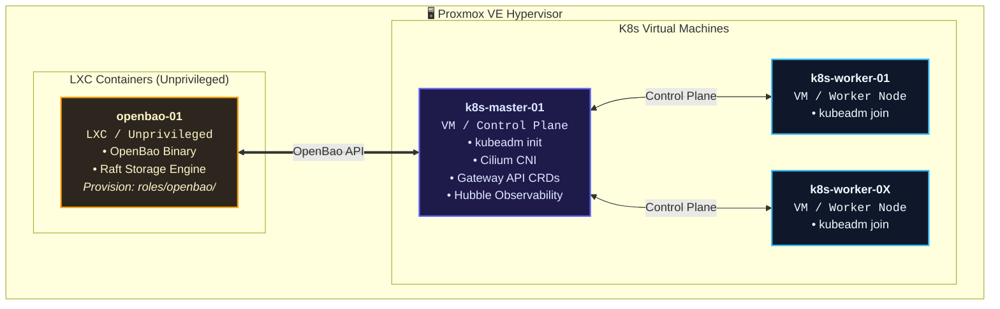
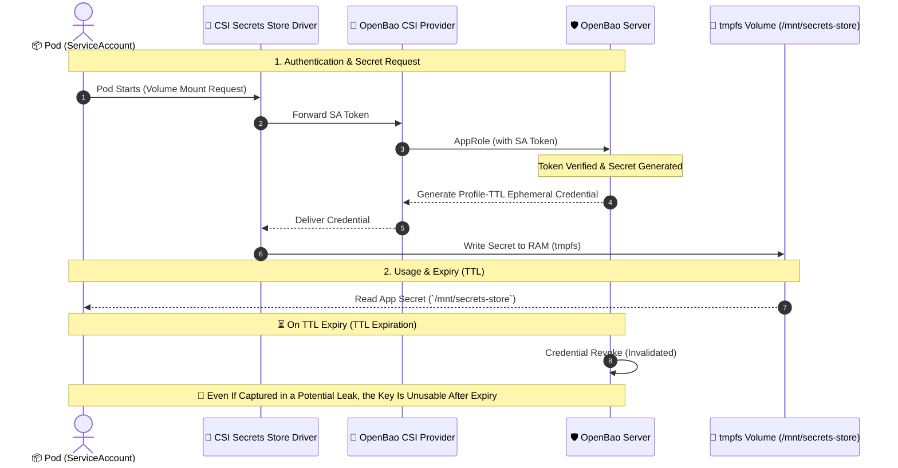
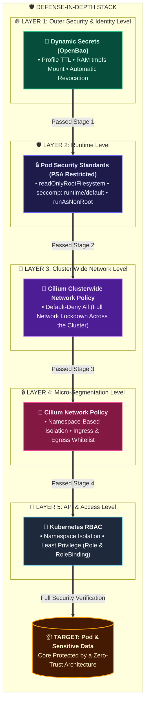

# K8s Design — Ansible Role Layer

---

<details>
<summary><strong>Contents</strong></summary>

- [1. Architecture Decisions](#1-architecture-decisions)
- [2. Architecture Diagram](#2-architecture-diagram)
  - [2.1. Proxmox & Virtualization Architecture](#21-proxmox--virtualization-architecture)
  - [2.2. Dynamic Secret Lifecycle (Secret Flow)](#22-dynamic-secret-lifecycle-secret-flow)
- [3. Gateway API × Cilium (General Network Design)](#3-gateway-api--cilium-general-network-design)
  - [3.1 Why Gateway API?](#31-why-gateway-api)
  - [3.2 The Role Model of Gateway API](#32-the-role-model-of-gateway-api)
  - [3.3 Why Cilium Is the Best-Fit Implementation](#33-why-cilium-is-the-best-fit-implementation)
  - [3.4 Traffic Path (Under Default-Deny)](#34-traffic-path-under-default-deny)
  - [3.5 Standard vs Experimental Channel (Why `standard-install` Only)](#35-standard-vs-experimental-channel-why-standard-install-only)
  - [3.6 Policy Taxonomy: HTTPRoute | CNP | CCNP | KCNP](#36-policy-taxonomy-httproute--cnp--ccnp--kcnp)
  - [3.7 Where in the Installation? (Code Map)](#37-where-in-the-installation-code-map)
- [4. Security](#4-security)
  - [4.1 Security Layers Summary and Red Team Perspective](#41-security-layers-summary-and-red-team-perspective)
  - [4.2 Defense-in-Depth Layers](#42-defense-in-depth-layers)
- [5. Multi-OS Pattern (Common to All Roles)](#5-multi-os-pattern-common-to-all-roles)
- [6. Ansible Roles and Installation Details](#6-ansible-roles-and-installation-details)
  - [6.0 `openbao` — OpenBao Server (OUTSIDE K8s, Separate LXC)](#60-openbao--openbao-server-outside-k8s-separate-lxc)
  - [6.1 `k8s/common` — All Nodes](#61-k8scommon--all-nodes)
  - [6.2 `k8s/master` — Control Plane](#62-k8smaster--control-plane)
  - [6.3 `k8s/worker` — Worker Node](#63-k8sworker--worker-node)
  - [6.4 `k8s/core` — CoreDNS Verification](#64-k8score--coredns-verification)
  - [6.5 `k8s/cni_crs` — CNI CRs](#65-k8scni_crs--cni-crs)
  - [6.6 `k8s/csi` — Secrets Store CSI (Inside K8s, Connected to OpenBao)](#66-k8scsi--secrets-store-csi-inside-k8s-connected-to-openbao)
  - [6.7 `k8s/addons` — Cluster Components](#67-k8saddons--cluster-components)
  - [6.8 `k8s/openbao-ops` — OpenBao Operations (Inside K8s)](#68-k8sopenbao-ops--openbao-operations-inside-k8s)
  - [6.9 `k8s/infra` — Platform Services](#69-k8sinfra--platform-services)
  - [6.10 `k8s/security` — Security Layer](#610-k8ssecurity--security-layer)
- [7. Execution Order](#7-execution-order)
  - [7.1 Tofu Backend (Garage S3 — All Stacks)](#71-tofu-backend-garage-s3--all-stacks)
  - [7.2 Inventory Structure (Generated by Tofu)](#72-inventory-structure-generated-by-tofu)
  - [7.3 Detailed Execution Flow](#73-detailed-execution-flow)
- [8. Code-Level Practices](#8-code-level-practices)
  - [8.1 Supply Chain and Version Pinning](#81-supply-chain-and-version-pinning)
  - [8.2 Resilience and Idempotency Patterns](#82-resilience-and-idempotency-patterns)
  - [8.3 Failure Culture: Diagnose-Before-Fail](#83-failure-culture-diagnose-before-fail)
  - [8.4 Helm Operational Hardening](#84-helm-operational-hardening)
  - [8.5 Secret Lifecycle and Identity Architecture](#85-secret-lifecycle-and-identity-architecture)
  - [8.6 Network Security Layer Ordering](#86-network-security-layer-ordering)
  - [8.7 RBAC and Identity Tiers](#87-rbac-and-identity-tiers)

</details>

## 1. Architecture Decisions

| Decision | Choice | Rationale |
|-------|-------|---------|
| **Secret management** | OpenBao + CSI Secrets Store Driver | Secrets are never written to etcd; tmpfs mount into the pod (etcd backups contain no application secrets) |
| **OpenBao placement** | Outside K8s, **separate unprivileged LXC** | Unaffected by K8s resets, no bootstrap chicken-and-egg problem |
| **Secret type** | **Dynamic secret engines** (from the start) | Ephemeral credentials, TTL-bound, secure at T=0 |
| **HA / recovery** | Single LXC Raft + daily snapshots (local + S3/Garage) | Simple to operate; restore from snapshot (§6.0) |
| **OpenBao's role** | **Single secret source** for the whole ecosystem | K8s, EFK, DB, other LXCs |
| **RBAC management** | 9 custom ClusterRoles + 5 aggregated roles | Details: [`docs/en/kubernetes/rbac.md`](../kubernetes/rbac.md) |
| **K8s networking** | Cilium (CNI + Gateway implementation) + Gateway API (standard channel) | eBPF CNI + general networking + CNP/CCNP in one stack; no separate ingress controller. Details: **§3** |
| **OS support** | Multi-OS (Debian + RedHat) | Split by `ansible_os_family` |
| **Ansible playbook** | `playbooks/k8s.yml` (with --tags) | Staged execution, or a single-command option |
| **Tofu backend** | Garage backend template, separate state per stack | `templates/garage-backend.tfbackend.template` – each stack is managed with its own `.backend.tfbackend` and S3 prefix; isolation for operability and security |

[↑ Back to top](#k8s-design--ansible-role-layer)

## 2. Architecture Diagram

```
Proxmox
 ├── LXC: openbao-01 (unprivileged, OpenBao binary + Raft storage)
 │     └── Ansible: provisioned with roles/openbao/
 │
 ├── VM: k8s-master-01
 │     └── kubeadm init → Cilium → Gateway API CRDs → Hubble
 │
 └── VM: k8s-worker-0X
       └── kubeadm join

Secret flow (dynamic):
  Pod (authenticates with SA)
    ↓ CSI Secrets Store Driver
      ↓ OpenBao CSI Provider
        ↓ fetches profile-TTL credentials from OpenBao
          ↓ tmpfs volume mount into the pod (`/mnt/approle` in the app flow)
            ↓ on TTL expiry OpenBao revokes; expired keys are unusable

Security layers:
  1. Dynamic secrets (TTL-bound, ephemeral)
  2. PSA restricted (readOnlyRootFilesystem, seccomp, runAsNonRoot)
  3. CiliumClusterwideNetworkPolicy (deny-all default)
  4. CiliumNetworkPolicy (per-namespace permissions)
  5. RBAC (ClusterRole + kubeconfig/SA on demand)
```
---
Detailed diagrams:
---

### 2.1. Proxmox & Virtualization Architecture



---

### 2.2. Dynamic Secret Lifecycle (Secret Flow)

How pods obtain profile-TTL ephemeral credentials through OpenBao and how they expire:



---

[↑ Back to top](#k8s-design--ansible-role-layer)

## 3. Gateway API × Cilium (General Network Design)

### 3.1 Why Gateway API

As of April 2026 — Kubernetes 1.36 (released ~April 22) — the community has standardized on Gateway API for networking. The modern controller path is therefore Gateway API (standard channel) + a Cilium Gateway implementation, which is what this repo uses.

### 3.2 The Role Model of Gateway API

Gateway API uses **role-separated** typed CRDs instead of a single monolithic `Ingress` object:

| Role | CRD | Written by | Function |
|-----|-----|------------|----------|
| Infrastructure / implementation | **GatewayClass** | Controller (here Cilium) | "Which data plane?" — `gatewayClassName: cilium` |
| Operations / platform | **Gateway** | This repo (`cni_crs`, shared) | Listeners (80/443), TLS termination, hostname, which namespaces routes are accepted from |
| Application owner | **HTTPRoute** | app-deploy | "Hostname → Service, path, header" routes; attached to the Gateway via `parentRef` |
| (Optional) App-specific TLS | **ListenerSet** + **Certificate** | app-deploy (dedicated) | Extra listener with its own namespace's Secret; no cross-namespace Secret / ReferenceGrant |

**Why the annotated model is not used:** in Ingress, features traveled in controller-specific annotation strings such as `nginx.ingress.kubernetes.io/*` — a surface outside the API — hard to validate, hard to port to another controller. Gateway API expresses the same behavior with **typed fields** (`requestRedirect`, `headerMatches`, `timeouts`, `allowedRoutes` / `allowedListeners`, etc.); behavior is defined in the spec, not squeezed into annotations. Depending on controller-specific annotations means stepping outside the standard; this repo uses only fields guaranteed in the standard channel. Authority boundaries are likewise embedded in the API — a route author's ability to open the Gateway into their own namespace depends on `allowedRoutes`/`allowedListeners`, not on annotations.

### 3.3 Why Cilium Is the Best-Fit Implementation

In this environment Gateway API is a **specification**; an **implementation** must be chosen to run it. Alternatives (NGINX Gateway Fabric, Envoy Gateway, Istio, kgateway…) bring a separate data plane, a separate controller, or mesh dependencies. **Cilium** unifies the following in **one stack** alongside the existing CNI requirement:

| Capability | Problem solved | Separate component needed? |
|---------|----------|---------------------------|
| **CNI + `kubeProxyReplacement`** | eBPF data path; no kube-proxy | No — DaemonSet suffices |
| **Gateway API implementation** | `gatewayClassName: cilium`; Envoy inside Cilium | No — no separate nginx/ingress pods |
| **CNP + CCNP (+ KCNP flag)** | Routing and filtering on the **same engine**; the gateway hole under default-deny is opened deliberately | No — policy controller lives in Cilium |
| **L2Announcement + IPPool** | No cloud LoadBalancer on bare metal → the Gateway's external IP is announced over ARP | No — `cni_crs` CRs suffice |
| **Hubble** | Flow observability for east-west **and** gateway traffic | No — no extra APM agent required |
| **No kube-proxy + single policy plane** | Service routing, L7 gateway, network policy on the same datapath | — |

**Comparison summary (why Cilium):**

| Criterion | Cilium + Gateway | Separate Gateway controller (nginx/Envoy/Istio) |
|--------|------------------|-----------------------------------------------|
| Pod count / maintenance | Existing Cilium DaemonSet + CRDs | Extra Deployment/DaemonSet + release channel |
| Policy ↔ route alignment | Single engine; `reserved:ingress` → pod policy | Usually two separate policy languages |
| Observability | Hubble on the same data | Separate collector or scope |
| Homelab resource cost | Low (eBPF, few extra processes) | High (extra proxy replicas) |

Conclusion: **Cilium is both the CNI and the Gateway API implementation**; choosing Gateway API in this repo automatically makes Cilium the GatewayClass.

### 3.4 Traffic Path (Under Default-Deny)

The cluster is **closed by default** (CCNP `default-deny-all`, §4). An inbound request reaches the application only if it passes each of the following rings in order:

```
Client
  → External IP (CiliumLoadBalancerIPPool + L2Announcement — bare-metal ARP)
    → Cilium data plane / Envoy (Gateway listeners 80|443, TLS termination)
      → Gateway API: HTTPRoute (hostname/path → Service)     [routing — not policy]
        → CCNP: allow-gateway-world-ingress  (world → gateway)
        → CCNP: allow-gateway-ingress        (gateway → selected namespace/pod)
        → CCNP: allow-gateway-egress         (reserved:ingress → ingress-exposed pods)
          → App pod (label: ingress-exposed=true; 403 without it)
            → (optional) egress: FQDN-CNP / OpenBao label CCNPs
```

**Distinction:** `HTTPRoute` defines "where it goes"; **CNP/CCNP** define "whether it may go". A route without a policy means traffic **drops with a 403** — the apps layer generates `allow-gateway-egress-<name>` for exactly this ([§3.3 and §4.1](k8s-apps-design.md)).

The shared **Shared Gateway** (`cni_crs`): installed once, accepts ListenerSets from all namespaces via `allowedListeners.namespaces.from: All`; adding an app never modifies the Gateway (self-service). HTTP 80 → HTTPS redirect behavior is cluster-wide via `tls_mode` (apps §3.2).

### 3.5 Standard vs Experimental Channel (Why `standard-install` Only)

| Channel | Contents | This repo |
|-------|-----------|---------|
| **Standard** | Production-ready core: `Gateway`, `GatewayClass`, `HTTPRoute`, `GRPCRoute`, `ReferenceGrant`, **`ListenerSet` (standard since v1.5+)** | **This is what gets installed** — `cni_prereqs.yml` → `standard-install.yaml` (pin: **v1.6.1**, §8.1) |
| **Experimental** | Experimental APIs; **a separate API group since v1.6** (`gateway.networking.x-k8s.io`, `X` prefix) — a clear line between standard and experimental | **Not installed** — the repo deliberately takes on neither the extra CRD surface, the version breakage, nor the "is this production?" ambiguity |

The same decision is written in code: for ListenerSet, "standard channel since v1.5.0; no separate experimental install needed" (`cni_prereqs.yml`). CRDs are version-checked via the `bundle-version` annotation; re-apply happens only on drift.

**KCNP / upstream ClusterNetworkPolicy** is a separate API (`policy.networking.k8s.io`, outside the Gateway channels); see §3.6.

### 3.6 Policy Taxonomy: HTTPRoute | CNP | CCNP | KCNP

Four different "rule" types coexist in the same cluster; they must **not be confused**:

| Type | API / group | Scope | Function | Enforced by / status |
|-----|------------|--------|----------|---------------------|
| **HTTPRoute** (+ Gateway, ListenerSet) | `gateway.networking.k8s.io/v1` | Routing / TLS | Hostname, path, header → Service; TLS listener binding | Gateway controller (Cilium); **standard channel** |
| **CNP** | Cilium CRD `CiliumNetworkPolicy` | **Namespace** | Pod-selector L3/L4/L7 permissions: gateway-CNP, FQDN-CNP, in-namespace micro-segmentation | Cilium datapath; authored by: app / platform |
| **CCNP** | Cilium CRD `CiliumClusterwideNetworkPolicy` | **Cluster** | Cluster-wide: **default-deny-all**, allow set (dns, health, world-ingress, openbao-egress…) | Cilium; `cilium-values.yaml.j2` → allows first, deny last (§8.6) |
| **KCNP** | **Upstream** `policy.networking.k8s.io` **v1alpha2** `ClusterNetworkPolicy` | Cluster + **tier/priority** | **Admin tier** second bar: `admin-deny-cloud-metadata` (`169.254.169.254/32` egress deny, `priority: 10`) | Fed by Cilium with **`k8sClusterNetworkPolicy.enabled: true`**; NP-API **experimental/v1alpha2** — deliberate, narrow use |

**Why both CCNP and KCNP?**

1. **CCNP** = the platform's everyday security surface (deny-all + ~15 allows). Anyone who may write policy in their namespace expresses the logic with the Cilium CRD.
2. **KCNP (Admin tier)** = the upper rule that allows written in a tenant's own namespace **cannot override**. Targets that must **never** stay open — like the cloud instance metadata endpoint — go to the Admin tier; higher priority beats in-namespace allows.
3. These two layers are **different APIs**: CCNP is Cilium-specific; KCNP is the upstream Network Policy API experiment — hence the **v1alpha2 / experimental** label and its deliberately narrow scope (a single policy: metadata-deny). As the production K8s release matures, the KCNP surface may be widened; before widening, it is evaluated together with the CRD pin in §8.1.

**In short:** `HTTPRoute` gives directions → `CCNP` opens/closes the door → `KCNP` Admin tier locks what must never open → the app pod is protected by PSA + dynamic secrets (§4).

### 3.7 Where in the Installation (Code Map)

| Step | Role / file | Installs |
|------|-------------|----------|
| Gateway API CRDs | `master/tasks/cni_prereqs.yml` | `standard-install.yaml` v1.6.1 + Established wait (both Gateway **and** ListenerSet) |
| Cilium values | `master/templates/cilium-values.yaml.j2` | `gatewayAPI.enabled: true`, `k8sClusterNetworkPolicy.enabled: true`, `l2announcements`, `externalIPs` |
| Shared Gateway + IPPool + L2 | `cni_crs` (`shared-gateway.yaml.j2`, CRs) | `gatewayClassName: cilium`, 80/443, `allowedListeners: All` |
| Gateway allow chain | `security/templates/cilium-allow-gateway-*.j2` | world-ingress → gateway-ingress → gateway-egress (`reserved:ingress` → `ingress-exposed`) |
| KCNP metadata-deny | `security/templates/kcnp-admin-metadata-deny.yaml.j2` | Admin tier cloud-metadata deny |
| App route + per-app CNP | `app-deploy` (apps docs) | HTTPRoute, gateway-CNP, FQDN-CNP, (dedicated) Certificate/ListenerSet |

Application developers do not need to know the Gateway API: an `expose: true` declaration suffices; the infrastructure provides the contract in §3 (apps [§2.2](k8s-apps-design.md)).

---

[↑ Back to top](#k8s-design--ansible-role-layer)

## 4. Security

### 4.1 Security Layers Summary and Red Team Perspective

| Layer | Security Mechanism | Scope | Benefit |
| --- | --- | --- | --- |
| **L1** | **Dynamic Secrets (TTL)** | Application / secret layer | Credential lifetimes are defined in the profile catalog (`token_ttl`/`token_max_ttl`; 15min–4h TTL range in the current catalog); kept in RAM (`tmpfs`) instead of disk, reducing leak risk. |
| **L2** | **PSA Restricted** | Pod / runtime | Blocks root access, makes the filesystem read-only, and prevents malicious binaries from running. |
| **L3** | **Cilium Clusterwide Policy** | Network layer (L3/L4 - cluster-wide) | Full lockdown (*default-deny*); no pod may send packets outside or to another pod without permission. |
| **L4** | **Cilium Network Policy** | Network layer (L7 - namespace) | Permits services to communicate only over the APIs and ports they need (micro-segmentation). |
| **L5** | **K8s RBAC** | Management / API layer | Each namespace is isolated within itself; blocks unauthorized ServiceAccounts from reaching the K8s API. |
| **L6** | **ToFu State Isolation / Backend Encryption** | IaC / state layer | Each stack is managed with its own `.backend.tfbackend` and S3 state prefix. Per-stack isolation limits accidental overwrites and state leakage. Backend files are protected with `secure_chmod 600` and optional `--encrypt`. Details: `7.1 Tofu Backend`. |

**Red Team Perspective**

| Layer | What does it protect? | Breach scenario | Next layer |
|--------|----------|-----------------|----------------|
| **Dynamic secrets (profile TTL)** | Stolen credentials | Attacker must use them before TTL expiry | Invalid once TTL lapses |
| **PSA restricted** | Tool execution after RCE | Attacker finds RCE but has no shell | Cannot write files, syscalls restricted |
| **readOnlyRootFilesystem** | Secret exfiltration | Read-only base (opened in templates via optional `securityContext`) restricts writes | Cannot leave the network |
| **CiliumNetworkPolicy** | Infiltration over the network | Attacker is in the pod but cannot get out | Only DNS + its own DB |
| **RBAC** | API privilege escalation | Attacker is in the pod but has no `kubectl` rights | `kubectl get secret` fails |

### 4.2 Defense-in-Depth Layers

A 6-layer security architecture protecting the system against external and internal threats. The layers are not a linear sequence but concentric, mutually reinforcing security rings; outer layers make breaking in harder, inner layers form the last line of defense.



[↑ Back to top](#k8s-design--ansible-role-layer)

## 5. Multi-OS Pattern (Common to All Roles)

```yaml
# defaults/main.yml
packages_common:
  debian:
    - curl, wget, vim, htop, net-tools
    - apt-transport-https, ca-certificates, gnupg
    - python3-pip, unzip, git, lsb-release
  redhat:
    - curl, wget, vim, htop, net-tools
    - ca-certificates, gnupg2
    - python3-pip, unzip, git

# tasks/main.yml
- name: Install packages (Debian)
  ansible.builtin.apt:
    name: "{{ packages_common.debian }}"
    state: present
    update_cache: yes
  when: ansible_os_family == "Debian"

- name: Install packages (RedHat)
  ansible.builtin.dnf:
    name: "{{ packages_common.redhat }}"
    state: present
  when: ansible_os_family == "RedHat"
```


[↑ Back to top](#k8s-design--ansible-role-layer)

## 6. Ansible Roles and Installation Details

### 6.0 `openbao` — OpenBao Server (OUTSIDE K8s, Separate LXC)

| Task | Details | Security note |
|------|-------|--------------|
| Install binary | `bao` binary to /usr/local/bin | SHA256 checksum verification |
| Systemd unit | `bao.service` | User: bao, restrict network |
| TLS certificate | Self-signed or internal CA | Listen: 8200 |
| Raft storage | `/var/lib/bao/raft` (snapshots: `/var/lib/bao/backups`) | Daily snapshots (7 days) + S3/Garage (30 days) |
| Config | `config.hcl` | storage=raft, listener=tcp, api_addr, cluster_addr |
| Root token | Generated after bootstrap | Plaintext output (0600) + `unseal-keys.txt`. Ansible Vault encryption is required by the checklist but still open — see `PRE_COMMIT_CHECKLIST.md`. |
| Unseal keys | 5 shards, 3 threshold | Separate secure location |
| Backup cron | Daily Raft snapshot + S3/Garage | Script: `maintenance/backup/app-data/backup-openbao.sh` |
| Monitoring | Exporter (optional) | /metrics endpoint |

```hcl
# config.hcl
storage "raft" {
  path = "/var/lib/bao/raft"
  node_id = "openbao-01"   # in the actual template: inventory_hostname
}

listener "tcp" {
  address     = "0.0.0.0:8200"
  tls_disable = false
  tls_cert_file = "/etc/bao/certs/cert.pem"
  tls_key_file  = "/etc/bao/certs/key.pem"
}

api_addr     = "https://164.102.98.xxx:8200"
cluster_addr = "https://164.102.98.xxx:8201"
```

### 6.1 `k8s/common` — All Nodes

| Task | Debian (apt) | RedHat (dnf) |
|------|-------------|--------------|
| swap disable | `swapoff -a` + /etc/fstab | Same |
| kernel modules | overlay, br_netfilter | Same |
| sysctl | 8 keys: `ip_forward`, `bridge-nf-call-iptables/ip6tables`, `fs.inotify.*` limits, `kernel.panic(+on_oops)`, `vm.overcommit_memory` | Same |
| install containerd | `apt install containerd` | `dnf install containerd` |
| containerd config | SystemdCgroup = true (template) | Same |
| add repo | pkgs.k8s.io repo | pkgs.k8s.io repo |
| install kubeadm/kubelet/kubectl | `apt install` + hold | `dnf install` + hold |
| kubelet enable | systemd enable+start | Same |
| firewall (ufw/firewalld) | Fully stopped (`state: stopped, enabled: false`) | Same (no ports opened, service disabled) |

> **Firewall decision:** The host firewall is disabled by **stopping it entirely** rather than by opening ports (`os_debian.yml`/`os_redhat.yml`); network security is delegated to the Cilium CNP layer (default-deny + allow set) and the Proxmox boundary.

### 6.2 `k8s/master` — Control Plane

| Task | Dependency | Security note |
|------|-----------|--------------|
| kubeadm init | `--config /tmp/kubeadm-config.yaml` + `--skip-phases=addon/kube-proxy`; CIDRs from `kubeadm-config.yaml.j2` | Config file instead of CLI flags; no JoinConfiguration YAML |
| admin kubeconfig (master) | `/etc/kubernetes/admin.conf`, mode 0644 | Homelab pragmatism |
| user kubeconfig (master) | `/home/{{ ansible_user }}/.kube/config`, mode 0600 | Owner: ansible_user |
| Install Cilium CLI | `curl` binary | SHA256 verification |
| Install Cilium Helm | with `cilium-values.yaml.j2` (below) | Helm values template |
| Gateway API CRDs | `kubectl apply -f` (**standard-install**, §3.5) | Why standard + why the Cilium implementation: **§3** |
| Join discovery | discovery-file based `/tmp/discovery.kubeconfig` (embedded token, 0600) | Token TTL 48h (`kubeadm token create --ttl 48h`); ephemeral artifacts removed at the end of the run |

**Cilium Helm values** (`roles/k8s/master/templates/cilium-values.yaml.j2` — single source):
```yaml
kubeProxyReplacement: true
k8sServiceHost: <master IP>   # ansible_facts["default_ipv4"]["address"]
k8sServicePort: "6443"
gatewayAPI:
  enabled: true
k8sClusterNetworkPolicy:
  enabled: true
hubble:
  enabled: true
  relay:
    enabled: true
  ui:
    enabled: true
ipam:
  mode: kubernetes
l2announcements:
  enabled: true
  leaseDuration: 120s
  leaseRenewDeadline: 60s
  leaseRetryPeriod: 5s
externalIPs:
  enabled: true
cni:
  binPath: /usr/lib/cni
  confPath: /etc/cni/net.d
  chainingMode: none
```

**etcd encryption:** not used. Since credentials are never kept in etcd
(OpenBao is the single source, CSI tmpfs mounts into pods), `EncryptionConfiguration`
is unnecessary and absent from the code.

**Kubelet and API hardening:** `protectKernelDefaults: true`, `seccompDefault: true`, `makeIPTablesUtilChains: true` inside `kubeadm-config.yaml.j2`; anonymous API access is open only to the `/livez`, `/readyz`, `/healthz` paths (AuthenticationConfiguration); join uses no anonymous cluster-info discovery. Details: §8.6.

### 6.3 `k8s/worker` — Worker Node

| Task | Details | Security note |
|------|-------|--------------|
| kubeadm join | `/tmp/discovery.kubeconfig` on the master is slurped | 48h token TTL; skipped if kubelet.conf exists |
| creates guard | skip if `/etc/kubernetes/kubelet.conf` exists | Idempotent |

### 6.4 `k8s/core` — CoreDNS Verification

The core role runs with `--tags=core` inside `k8s.yml` and verifies cluster DNS is healthy after the control plane is deployed. It runs on `hosts: k8s_master[0]` and uses `kubectl` commands with the kubeconfig. If DNS is broken, service discovery and pod-to-pod communication break, so the check runs right after the worker join.

| Task | Details | Note |
|------|-------|-----|
| Check CoreDNS is running | `kubectl get pods -n kube-system` | Runs on master[0] |
| Pod DNS resolution test | `nslookup kubernetes.default.svc` | Cluster DNS functional |

### 6.5 `k8s/cni_crs` — CNI CRs

This role applies the cluster-wide LoadBalancer IP pool, L2 announcements, and Gateway API shared-gateway CRs for the Cilium-based network. Rationale, 2026 context, channel choice, and policy taxonomy: **§3**. The Shared Gateway is open to ListenerSet admission with `spec.allowedListeners.namespaces.from: All`. The Gateway is thus installed once, and subsequent app additions never touch it. These resources are required for the CNI to work correctly and are applied on master[0] with the kubeconfig.

| CR | Details | Purpose |
|----|-------|------|
| CiliumLoadBalancerIPPool | IP pool definition | Bare-metal LoadBalancer IPs |
| CiliumL2AnnouncementPolicy | L2 announcement policy | ARP announcement |
| Shared Gateway | Gateway API shared gateway | HTTP/HTTPS traffic |

### 6.6 `k8s/csi` — Secrets Store CSI (Inside K8s, Connected to OpenBao)

Running with `--tags=csi`, this role installs the Secrets Store CSI Driver and the OpenBao CSI Provider with Helm. The driver runs on every node; the provider authenticates to OpenBao via AppRole. This role is designed to consume the AppRole credentials that openbao-ops writes into K8s.

| Component | Installation | Security note |
|---------|---------|--------------|
| **CSI Secrets Store Driver** | Helm chart | DaemonSet, on every node |
| **OpenBao CSI Provider** | Helm or manifest | AppRole auth with OpenBao |
| **SecretProviderClass** | No template in this role; app-deploy generates the SPCs (the CSI role only applies the agent-override ConfigMap) | app-deploy |

**SecretProviderClass example (schema — app-deploy generated, with example values):**
```yaml
apiVersion: secrets-store.csi.x-k8s.io/v1
kind: SecretProviderClass
metadata:
  name: myapp-approle
  namespace: myapp
spec:
  provider: openbao
  parameters:
    roleName: "k8s-csi-provider"
    audience: "openbao"
    objects: |
      - objectName: "role_id"
        secretPath: "secret/data/myapp-approle"
        secretKey: "role_id"
      - objectName: "secret_id"
        secretPath: "secret/data/myapp-approle"
        secretKey: "secret_id"
```

### 6.7 `k8s/addons` — Cluster Components

Running with `--tags=addons`, this role adds observability and core networking/gateway components to the cluster after the control plane and CNI are ready. Applied on master[0] with the kubeconfig.

| Component | Installation | Purpose |
|---------|---------|------|
| **cert-manager** | Manifest (`kubectl apply -f`, toleration patch + webhook wait) | OpenBao PKI issuer infrastructure (Vault issuer) |
| **metrics-server** | Helm chart 3.14.0 (with `metrics-server-values.yaml.j2`) | `kubectl top` |

The IP pool, L2 announcement, and Shared Gateway live in the `cni_crs` role, not here (§6.5); Hubble is enabled during master installation via the Cilium Helm values.

### 6.8 `k8s/openbao-ops` — OpenBao Operations (Inside K8s)

The role lives under `ansible/roles/k8s/openbao-ops`; its execution context is the K8s cluster. Opening the mounts and the engine content (AppRole policy/role, KV/Database/PKI/transit, kubernetes auth mount) is done once with the root token in `openbao.yml` → server role → inside `bootstrap.yml` (`rbac-platform.yml` is included there too). The `openbao-ops` role, in contrast, only reaches the OpenBao API from inside K8s with the **ops-admin AppRole token** (P4, `outputs/openbao/ops-admin.json`): it writes the kubernetes auth config/role and the `kube-system/openbao-csi-driver` / `cert-manager` AppRole Secrets into K8s. The root token is never used inside `openbao-ops`. The playbook therefore runs inside `ansible/playbooks/k8s.yml` with `hosts: k8s_master[0]`, `environment: "{{ kubeconfig_env }}"`. For OpenBao access, `ensure_ready.yml` first checks that `openbao_address` is reachable and unsealed. This role — and every preceding K8s role/task — therefore requires OpenBao to be up and reachable. If it isn't, the flow halts.

For this role to write the kubernetes auth config, the **TokenReview bridge** is required: OpenBao has the apiserver verify SA JWTs via `TokenReview` calls; the authority comes from the `kube-system/openbao-auth-reviewer` SA (`system:auth-delegator`, and since `tokenreviews` is cluster-scoped, `cluster_wide=true` is mandatory). The role idempotently generates this SA's kubeconfig (`outputs/k8s/openbao-auth-reviewer.conf`), reads the JWT from the conf, and writes it into `auth/kubernetes/config` as `token_reviewer_jwt`. Without the bridge, `k8s-csi-provider` SA-JWT logins fail → the entire workload credential flow over CSI stops; a missing conf fails loudly, while a 403 may drop auth silently (details: guide §6.1).

Configuration is done over the OpenBao HTTP API with the Ansible `uri` module
(not the `bao` CLI):

| Task | Details | Security note |
|------|-------|--------------|
| Reviewer kubeconfig (TokenReview bridge) | Idempotent via the `gen-kubeconfig.yml` include: SA `openbao-auth-reviewer` + `system:auth-delegator` + `cluster_wide=true` → `outputs/k8s/openbao-auth-reviewer.conf`; the conf JWT is stored in `auth/kubernetes/config` as `token_reviewer_jwt` | Contains the SA JWT; fail-loud without the conf; otherwise the CSI SA-JWT login and credential flow break; file is `no_log` + outputs are gitignored |
| K8s auth (AppRole) | k8s-csi / cert-manager role_id + secret_id generated with ops-admin; role definition bootstrapped once with root | Single `k8s-csi-provider` role; wildcard SA + `audience: openbao` + identity-template isolation |
| CSI credentials | role_id/secret_id stored in the `kube-system/openbao-csi-driver` Secret | `no_log: true` |
| K8s auth config/role | kubernetes auth mount opened at bootstrap; config/role (reviewer JWT included) written with ops-admin | token_reviewer_jwt is `no_log: true` |
| Root token | Server bootstrap only (one-time init) and break-glass | root is never used inside openbao-ops |

### 6.9 `k8s/infra` — Platform Services

This role installs helper services and operators used platform-wide after the cluster stabilizes. Its execution context is `k8s_master[0]` over the kubeconfig; it activates after the security and core networking layers are complete.

| Component | Details |
|---------|-------|
| `openbao-pki` ClusterIssuer | `cluster-issuer.yml`: installed with the CA in the `kube-system/openbao-ca-tls` Secret + the `cert-manager-approle` identity; the base for dedicated external-domain issuers |
| HTTP→HTTPS redirect | if `tls_mode == redirect`, `http-to-https-redirect.yaml.j2` is applied (never generated at the default `allow-http` value) |

### 6.10 `k8s/security` — Security Layer

| Header | Details | Source |
|--------|-------|--------|
| **Namespace lifecycle** | Namespaces are not opened in bulk in code; `gen-kubeconfig` creates them on demand (`--dry-run=client -o yaml \| kubectl apply -f`) | `gen-kubeconfig.yml` |
| **PSA (Pod Security Admission)** | No code step generates environment-based PSA labels; enforcement is left to the cluster default | — |
| **Default deny-all** | All inter-namespace traffic is closed with `default-deny-all`, enforced after the allows | CiliumClusterwideNetworkPolicy (§3.6) |
| **KCNP metadata-deny** | Upstream ClusterNetworkPolicy (**v1alpha2**, Admin tier) `admin-deny-cloud-metadata` — experimental API, narrow scope; overrides CCNP | `security/tasks/main.yml` (§3.6) |
| **Allow policy set** | webhook, apiserver-egress, prometheus-scrape, metrics-server, health, dns, **gateway world/ingress/egress**, hubble; conditional cidr/FQDN/ns-isolation/openbao-egress; plus KCNP `admin-deny-cloud-metadata` | `security/templates/*.j2` (§3.4, §3.6) |
| **9 Custom ClusterRoles** | pod-reader, pod-log-reader, workload-viewer, full-viewer, pod-operator, workload-operator, config-editor, deployer, monitoring-reader | `templates/cluster-roles.yaml.j2` |
| **5 Aggregated Roles** | aggregated-viewer, aggregated-developer, aggregated-deployer, aggregated-admin, aggregated-monitoring | Merge automatically by label |
| **Adding custom roles** | New roles without touching the template, via the `custom_cluster_roles` variable | `inventory/group_vars/all/all.yml` |
| **Generating kubeconfigs** | Default: 5 user kubeconfigs under `outputs/k8s/` (admin, deployer, developer, monitoring, viewer) + 1 system conf (`openbao-auth-reviewer` TokenReview bridge, §6.8) = 6 files. On demand: `playbooks/gen-kubeconfig.yml` | Details: [`docs/en/kubernetes/rbac.md`](../kubernetes/rbac.md) |
| **Pod Security Standards** | restricted: readOnlyRootFilesystem, seccomp, runAsNonRoot | PSA |


[↑ Back to top](#k8s-design--ansible-role-layer)

## 7. Execution Order

### 7.1 Tofu Backend (Garage S3 — All Stacks)

The Garage S3 instance is installed automatically with `scripts/garage-setup/chef.sh`. It must already be prepared before the ToFu installations. During the run, Chef pulls the credential file and, with `generate-garage-backend.sh`, generates the `.backend.tfbackend` files under `tofu/backends/` one by one per folder name for each stack under `tofu/stacks/*` — backing up pre-existing ones first, generating new ones, and encrypting them when the flag is given.

Once the backend is ready, all ToFu stacks can use remote state via `tofu init`. The reason for this separate creation is a security measure on the ToFu side, so that each stack keeps its own state.

For details, see [`docs/en/garagehq/chef-sh-how-it-works.md`](../garagehq/chef-sh-how-it-works.md) and `scripts/garage-setup/generate-garage-backend.sh`.

```
templates/garage-backend.tfbackend.template
scripts/garage-setup/generate-garage-backend.sh
tofu/backends/<stack>.backend.tfbackend (generated, in .gitignore)
```

One script generates every stack's backend (openbao included).

### 7.2 Inventory Structure (Generated by Tofu)

The Tofu `k8s-cluster` stack generates the `ansible/inventory/hosts.ini.generated` file after `tofu/apply`:

```ini
# Auto-generated by tofu — DO NOT EDIT
[k8s_master]
k8s-master-1 ansible_host=164.102.98.174 ansible_user=ubuntu ansible_ssh_private_key_file=~/.ssh/id_ed25519

[k8s_worker]
k8s-worker-1 ansible_host=164.102.98.184 ansible_user=ubuntu ansible_ssh_private_key_file=~/.ssh/id_ed25519
k8s-worker-2 ansible_host=164.102.98.185 ansible_user=ubuntu ansible_ssh_private_key_file=~/.ssh/id_ed25519

[k8s_cluster:children]
k8s_master
k8s_worker
```

> **Note**: `ansible_ssh_private_key_file` points to the private key path, not the public key (.pub). The `.pub` suffix is trimmed automatically with `trimsuffix`.

### 7.3 Detailed Execution Flow

```mermaid
flowchart TD
    %% 
    %% PHASE 1: OPENTOFU / INFRA & INVENTORY
    %% 
    TOFU_ENV["OpenTofu Provisioned Environment"]
    
    subgraph P1 [" 🏗️ PHASE 1: Infrastructure & Inventory Prep with OpenTofu "]
        S1["<b>1. OpenBao Stack Apply</b><br/><code>tofu/stacks/openbao</code>"]
        S2["<b>2. K8s Cluster ToFu Apply</b><br/><i>LXC + K8s VMs</i> <code>tofu/stacks/k8s-cluster</code>"]
        
        ART1[("📁 <b>inventory/hosts.ini.generated</b><br/><i>K8s servers</i>")]
        ART1_2[("📁 <b>inventory/openbao.ini.generated</b>")]
    end

    %% --------------------------------------------------
    %% ANSIBLE PHASE 1: OPENBAO BOOTSTRAPPING
    %% --------------------------------------------------
    subgraph P2 [" 🔐 PHASE 2: Ansible - OpenBao Bootstrapping "]
        S3["<b>3. Ansible OpenBao Playbook</b><br/><code>playbooks/openbao.yml</code><br/><i>Raft init, root token, backup</i>"]
        ART2[("📁 <b>outputs/openbao/</b><br/><i>Credentials & Unseal keys</i>")]
    end

    %% --------------------------------------------------
    %% ANSIBLE PHASE 2: KUBERNETES CLUSTER SETUP
    %% --------------------------------------------------
    subgraph P3 [" ☸️ PHASE 3: Ansible - K8s Cluster Installation "]
        S4["<b>4. K8s Common Node Prep</b><br/><code>--tags=common</code><br/><i>containerd + kubeadm/kubelet</i>"]
        S5["<b>5. K8s Master Node Setup</b><br/><code>--tags=master</code><br/><i>kubeadm init, Cilium, Gateway API, Hubble</i>"]
        ART3[("📁 <b>outputs/k8s/admin.conf</b>")]
        S6["<b>6. K8s Worker Nodes Join</b><br/><code>--tags=worker</code>"]
        S7["<b>7. K8s Core</b><br/><code>--tags=core</code><br/><i>CoreDNS verification</i>"]
        S8["<b>8. K8s CNI CRs</b><br/><code>--tags=cni_crs</code><br/><i>LoadBalancer IPPool, L2 Announcement</i>"]
    end

    %% --------------------------------------------------
    %% ANSIBLE PHASE 3: ADDONS, SECURITY & POST-INIT
    %% --------------------------------------------------
    subgraph P4 [" 🛡️ PHASE 4: Ansible - K8s Addons, Security & Integration "]
        S9["<b>9. K8s Addons</b><br/><code>--tags=addons</code><br/><i>cert-manager, metrics-server</i>"]
        S10["<b>10. CSI Driver Setup</b><br/><code>--tags=csi</code><br/><i>Secrets Store Driver + OpenBao Provider</i>"]
        S11["<b>11. OpenBao Ops</b><br/><code>--tags=openbao-ops</code><br/><i>AppRole, KV, DB Engine, Policy</i>"]
        S12["<b>12. K8s Infra</b><br/><code>--tags=infra</code><br/><i>Platform services</i>"]
        S13["<b>13. K8s Security & RBAC</b><br/><code>--tags=security</code><br/><i>ClusterRoles, CiliumNetworkPolicy</i>"]
        ART4[("📁 <b>outputs/k8s/</b><br/><i>developer, deployer, monitoring confs</i>")]
    end

    %% --------------------------------------------------
    %% PHASE 5: OPTIONAL OPERATIONS
    %% --------------------------------------------------
    subgraph P5 [" ⚙️ PHASE 5: Optional Operations "]
        S14["<b>14. Custom Kubeconfig Generator</b><br/><code>playbooks/gen-kubeconfig.yml</code><br/><i>E.g.: role=developer, namespace=redis</i>"]
        ART5[("📁 <b>outputs/k8s/redis-developer.conf</b>")]
    end

    %% --------------------------------------------------
    %% FLOW CONNECTIONS
    %% --------------------------------------------------
    
    TOFU_ENV --> S1
    TOFU_ENV --> S2
    
    %% Phase 1 internal
    S1 -->|OpenBao Inventory| ART1_2
    S2 -->|K8s Inventory| ART1

    %% OpenTofu -> Ansible Transition (OpenBao)
    ART1_2 --> S3
    S1 --> S3
    S3 --> ART2

    %% Ansible Flow: OpenBao Completed -> K8s Starts
    S3 ==>|OpenBao Ready & Active| S4
    ART1 --> S4

    %% K8s Internal Flow
    S4 --> S5
    S5 --> ART3
    S5 --> S6
    
    %% Integration & Addons
    S6 --> S7
    S7 --> S8
    S8 --> S9
    S9 --> S10
    S10 --> S11
    S11 --> S12
    S12 --> S13
    S13 --> ART4

    %% On-demand flow
    ART4 -.->|Special Authorization Need| S14
    S14 --> ART5

    %% --------------------------------------------------
    %% STYLES & COLOR SCHEME
    %% --------------------------------------------------
    classDef tofu fill:#1e293b,stroke:#38bdf8,stroke-width:2px,color:#f8fafc;
    classDef bao fill:#2d261e,stroke:#f59e0b,stroke-width:2px,color:#fef3c7;
    classDef k8s fill:#1e1b4b,stroke:#6366f1,stroke-width:2px,color:#e0e7ff;
    classDef artifact fill:#064e3b,stroke:#10b981,stroke-width:2px,color:#f8fafc;
    classDef optional fill:#3b0764,stroke:#a855f7,stroke-width:2px,color:#f3e8ff;

    class S1,S2 tofu;
    class S3,S11 bao;
    class S4,S5,S6,S7,S8,S9,S10,S12,S13 k8s;
    class ART1,ART1_2,ART2,ART3,ART4,ART5 artifact;
    class S14 optional;
```



Single command (all at once):
(with the relevant enable flags set to true)
```bash
cd ansible
ansible-playbook -i inventory/hosts.ini.generated playbooks/k8s.yml
```

---

[↑ Back to top](#k8s-design--ansible-role-layer)

## 8. Code-Level Practices

Role practices with code references (`file:line`):

### 8.1 Supply Chain and Version Pinning

| Component | Version | Integrity | Location |
|---|---|---|---|
| Helm | 4.2.4 | SHA256 checksum | `master/tasks/cni_prereqs.yml` + defaults |
| Cilium CLI | 0.19.7 | SHA256 checksum | same |
| crictl | 1.36.0 | SHA256 checksum | `common/tasks/containerd.yml` |
| Kubernetes packages | 1.36.2 | Fully pinned + `dpkg hold`/`yum versionlock` | `common/tasks/kubeadm.yml` |
| Cilium chart | 1.20.1 | `--version` pinned | `master/tasks/cni.yml` |
| Gateway API CRDs | 1.6.1 | URL pinned + bundle-version comparison; **standard-install only** (§3.5) | `cni_prereqs.yml` |
| CSI chart | 0.29.4 | Conditional `--version` (no pin when empty) | `csi/tasks/main.yml` |
| metrics-server chart | 3.14.0 | `--version` pinned | `addons/tasks/main.yml` |
| Sandbox image | pause:3.9 | Pinned | `common/templates/config.toml.j2` |

On the apt side the modern `signed-by` keyring pattern, on RedHat `gpgcheck=1`. No `latest` tag anywhere in the repo. Known debt: only `linux-amd64` is mapped (`common/defaults`).

### 8.2 Resilience and Idempotency Patterns

* **Sentinel-file idempotency:** `admin.conf` presence gates the init chain (`pre_checks.yml` → `init.yml`); `kubelet.conf` on workers; helm/cilium binaries skipped via `creates:`.
* **Automatic recovery:** init fails → "run again, kubeadm reset will run automatically" message → next run does `kubeadm reset --force` + re-init (`init.yml`). `force_reset: false` is the safe-by-default destructive flag.
* **Drift correction:** Cilium is re-applied with `helm upgrade --install` on every run; CRD installation runs only when the `bundle-version` annotation changes.
* **Readiness gate chain:** healthz poll → second healthz before Cilium (shell with timeout) → cilium rollout (180s) → CRD Established → node Ready → healthz+readyz+openapi → `cilium status --wait` → CoreDNS Available+Ready → busybox nslookup end-to-end test (unconditional cleanup, rc propagation) → cert-manager webhook Available (600s).
* **CRD install recipe:** check → conditional `--server-side --force-conflicts` apply (with retries) → Established wait; the same pattern for Gateway API and KCNP.

### 8.3 Failure Culture: Diagnose-Before-Fail

* In rescue blocks, gather evidence first, then fail: pod/describe/log dumps with `|| true` (`init.yml`, `core`, `cert-manager.yml`).
* Fail messages follow the **Why / Fix / Check** format (`cluster-issuer.yml`); the cert-manager rescue message contains a decision tree (ImagePullBackOff / TLS / timeout / Pending).
* Output-content verification: node Ready scan catches a single not-ready node with `grep -qv '^Ready$'`; the gateway-tls Secret is verified by byte count.
* `ensure_ready.yml`: OpenBao health semantics interpreted correctly (200/429/472/473 success, `503 = sealed`); automatic unseal from the controller when needed (30×2s).

### 8.4 Helm Operational Hardening

* **Preferred recipe:** idempotent `helm repo add` (`already exists` + `failed_when: false`) → `repo update` only when the repo is newly added → pre-cleanup of `pending-install` secrets/jobs → `helm upgrade --install` → on error, `rescue`: check stderr for `another operation`, clean the lock, targeted retry.
* **Where applied:** this recipe repeats at **every helm install point** — Cilium (`cni_prereqs.yml` repo + `cni.yml` upgrade), metrics-server (`addons`), CSI and openbao-csi (`csi`).

### 8.5 Secret Lifecycle and Identity Architecture

* **Piped secrets:** CA and AppRole secrets are written without ever touching disk via `create --dry-run=client -o yaml | kubectl apply`; then memory cleanup with `set_fact: null` (`csi/tasks/main.yml`).
* **Root token never actively used:** root only at bootstrap; `sys/generate-root-token` and `sys/seal` are `deny` even for ops-admin; ops-admin gets `token_bound_cidrs` + `token_no_default_policy`.
* **Lifetime = authority:** profiles split into service/batch tokens by TTL (`rbac-workload.yml`):

| Profile | Policy | TTL / Max | Renewable | Token |
|---|---|---|---|---|
| reader | workload-reader | 1h / 24h | ✓ | service |
| metrics-reader | workload-metrics-reader | 1h / 24h | ✓ | service |
| operator | workload-operator | 1h / 24h | ✓ | service |
| job-run | workload-job-run | 30m / 1h | ✗ | batch |
| transit-user | workload-transit-user | 30m / 1h | ✗ | batch |
| deployer | workload-deployer | 15m / 1h | ✗ | batch |
| kv-owner | workload-kv-owner | 1h / 8h | ✓ | service |
| db-consumer | workload-db-consumer | 1h / 24h | ✓ | service |

* **Identity-template isolation:** generic policy paths bind to the AppRole metadata `scope` (the SA name in k8s auth) through OpenBao template literals — a leaked identity only sees its own prefix.
* **`audience: "openbao"` pinning:** a JWT minted for the k8s API cannot be replayed at OpenBao (TokenReview audience mismatch).
* **`denied_parameters` pattern:** `allow_any_name` is banned at parameter level in pki-manager.
* **TokenReview delegation:** OpenBao uses a reviewer SA with `system:auth-delegator` (`openbao-auth-reviewer`) to verify SA JWTs at the apiserver via `TokenReview`; the SA has no other authority on the cluster. The reviewer kubeconfig lives in `outputs/k8s/openbao-auth-reviewer.conf` (generated by `openbao-ops`, §6.8); a missing conf or missing `tokenreviews` RBAC yields 403 on kubernetes auth login or lets verification **fail silently** — which stops the entire workload credential flow via CSI SA-JWT login.
* **systemd hardening (`bao.service.j2`):** User/Group=bao, `NoNewPrivileges`, `PrivateTmp`, `ProtectHome`, `ProtectSystem=full`, `ReadWritePaths`, single capability (`CAP_NET_BIND_SERVICE`), `Restart=on-failure`.

### 8.6 Network Security Layer Ordering

* **Allows first, deny last:** ~15 allow policies first, `global-default-deny-all` applied last — prevents greenfield lockout in additive policy merging (`security/tasks/main.yml`).
* **Gateway allow chain:** world-ingress → gateway-ingress → gateway-egress (`reserved:ingress` → `ingress-exposed`) — routing via HTTPRoute, CCNP opens the door (§3.4, §3.6).
* **Admin tier second bar:** upstream NP-API KCNP `admin-deny-cloud-metadata` (`tier: Admin, priority: 10`) denies `169.254.169.254/32` egress — permissions a tenant writes in their own namespace are overridden; KCNP is **v1alpha2/experimental**, scope deliberately narrow (§3.6).
* **Self-service labels:** `homelab.io/allow-openbao-egress` / `allow-apiserver-egress` / `ingress-exposed` — tenants get a network door without touching YAML; no-op without the label.
* **Kubelet hardening:** `protectKernelDefaults`, `seccompDefault`, `makeIPTablesUtilChains` (`kubeadm-config.yaml.j2`).
* **Anonymous access:** open only to the `/livez`, `/readyz`, `/healthz` paths (AuthenticationConfiguration).
* **sysctl set:** 8 keys (`ip_forward`, `bridge-nf-call-*`, inotify limits, `kernel.panic(+on_oops)`, `vm.overcommit_memory`) — `/etc/sysctl.d/99-k8s.conf`.

### 8.7 RBAC and Identity Tiers

* **9 ClusterRoles + 5 aggregated:** aggregationRule label merging (`rbac.aggregate/<name>`); `full-viewer` for admins only (reads secrets), `deployer` can create/update secrets but not delete.
* **Extension point:** new roles via the `custom_cluster_roles` inventory without touching the template → automatic membership in aggregated roles.
* **Kubeconfig tiers:** SA + manual token secret (k8s ≥1.24 aware); `cluster_wide: false → RoleBinding (ns), true → ClusterRoleBinding`; 0600 kubeconfigs, 0700 directories. Default 4 profiles: viewer/developer/deployer (ns-scoped) + monitoring (cluster-wide).
* **Pre-flight trio:** connect (interactive approval on known_hosts mismatch), env-check (cross-host version drift analysis on localhost), openbao-env-check (dependency gate).
* **Privilege separation:** installation with `become: true`, all operational plays with `become: false` + `kubeconfig_env`.

---

[↑ Back to top](#k8s-design--ansible-role-layer)
