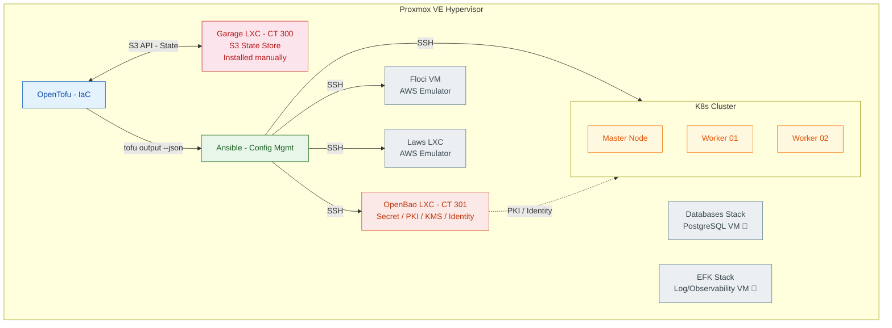
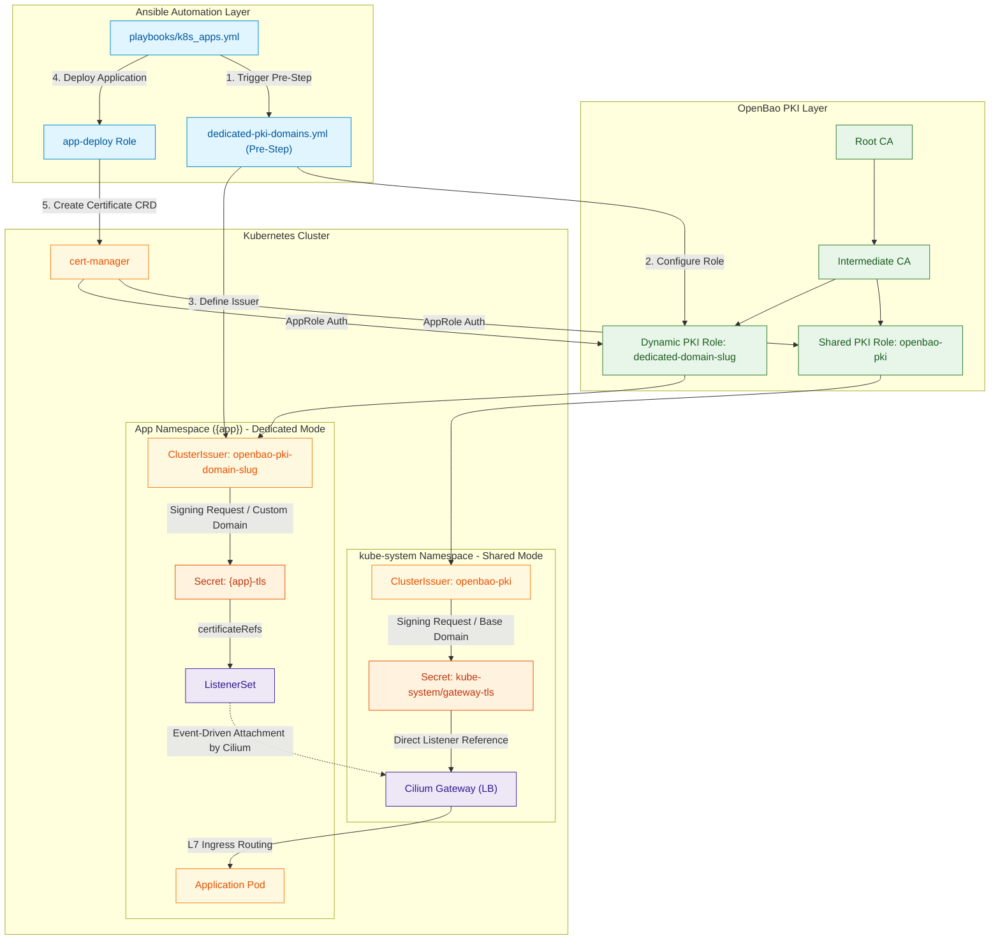
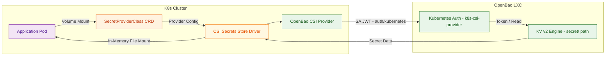
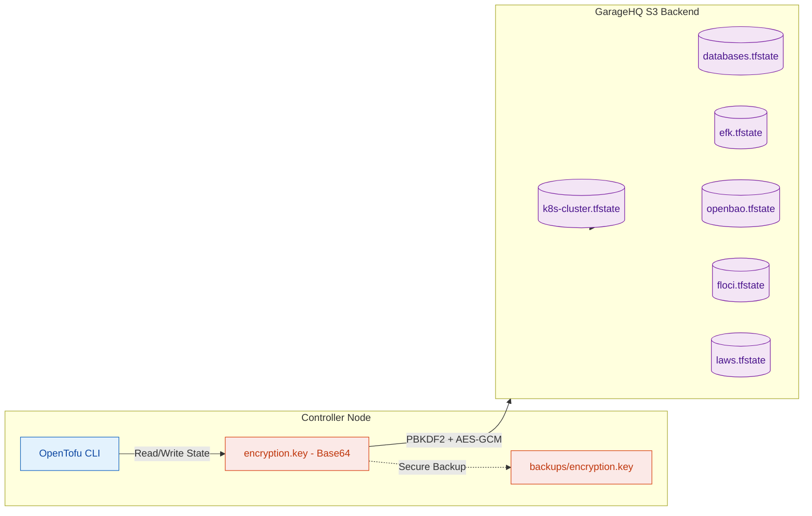
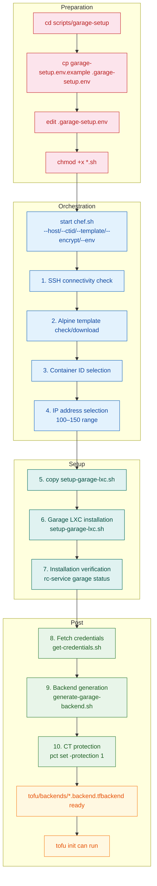
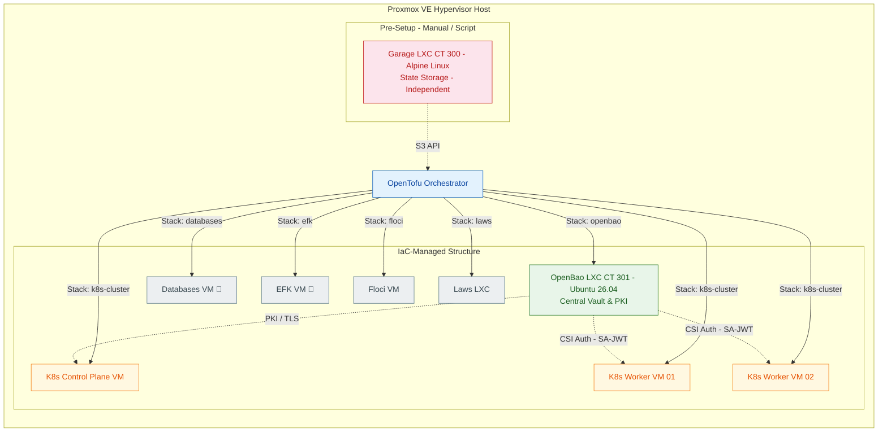
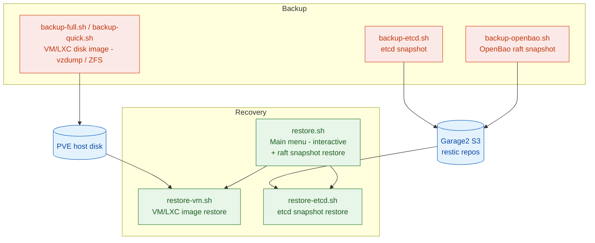

# Cloud-in-Lab — System Architecture

A detailed architecture and infrastructure document for the Cloud-in-Lab project. It describes how cloud-native services are modeled in a local environment, maps each component to its cloud equivalent, and explains how the system operates end to end.

> **What is tofu.lan?** It is the project's internal network domain. `tofu` = OpenTofu, `lan` = local area network. All internal services run under `*.tofu.lan` (e.g. `echo.tofu.lan`). It has no record in external DNS; it is only added to the `/etc/hosts` file inside the homelab or resolved via internal DNS.
> **Current versions of the components used in the project:** K8s 1.36.2 · Cilium 1.20.1 · Gateway API 1.6.1 · OpenBao 2.6.2 · cert-manager 1.21.1 · Helm 4.2.4 · kube-prometheus-stack 88.6.1 · Proxmox BPG Provider ~> 0.78 · GarageHQ 2.1.0

---

<details>
<summary><strong>Table of Contents</strong></summary>

- [1. System Overview](#1-system-overview)
- [2. Cloud Equivalents](#2-cloud-equivalents)
- [3. Data Flows and Architecture](#3-data-flows-and-architecture)
  - [3.1. Certificate Chain and Automation (TLS Architecture)](#31-certificate-chain-and-automation-tls-architecture)
  - [3.2. Secret Management Flow (Secrets Store CSI Driver + OpenBao)](#32-secret-management-flow-secrets-store-csi-driver--openbao)
  - [3.3. State and IaC Security Flow (OpenTofu Backend)](#33-state-and-iac-security-flow-opentofu-backend)
- [4. Isolation Model and Hypervisor Placement](#4-isolation-model-and-hypervisor-placement)
  - [4.1. Network and IP Planning](#41-network-and-ip-planning)
- [5. Architecture Design Decisions and Rationale](#5-architecture-design-decisions-and-rationale)
- [6. System Expansion Paths](#6-system-expansion-paths)
  - [6.1. New Tofu Stack (VM / LXC)](#61-new-tofu-stack-vm--lxc)
  - [6.2. Cluster Scaling](#62-cluster-scaling)
  - [6.3. Enabling/Disabling Stacks (Ansible Enable Flag)](#63-enablingdisabling-stacks-ansible-enable-flag)
- [7. Kubernetes Application Architecture (`k8s-apps`)](#7-kubernetes-application-architecture-k8s-apps)
  - [7.1. Generic Application Role — `app-deploy`](#71-generic-application-role--app-deploy)
  - [7.2. Complex Application Role — `chart-deploy` (Helm)](#72-complex-application-role--chart-deploy-helm)
  - [7.3. Infrastructure (Infra) Roles and Fail-Fast Principles](#73-infrastructure-infra-roles-and-fail-fast-principles)
- [8. Network & Security Policies (Cilium CNI & eBPF)](#8-network--security-policies-cilium-cni--ebpf)
  - [8.1. Cilium 3-Tier Policy Architecture](#81-cilium-3-tier-policy-architecture)
  - [8.2. Default-Deny Implementation (Cilium 1.20)](#82-default-deny-implementation-cilium-120)
  - [8.3. Gateway World Ingress Configuration](#83-gateway-world-ingress-configuration)
  - [8.4. Cilium Label Prefix (`k8s:`) Standard](#84-cilium-label-prefix-k8s-standard)
  - [8.5. Active Security Policy Distribution](#85-active-security-policy-distribution)
- [9. Monitoring and Observability (Monitoring)](#9-monitoring-and-observability-monitoring)
- [10. Disaster Recovery and Backup Flow](#10-disaster-recovery-and-backup-flow)
- [11. Related Documents](#11-related-documents)

</details>

## 1. System Overview



**Layer Responsibilities and Details:**

| Layer | Role | Tool / Version | Configuration Method |
| --- | --- | --- | --- |
| **Hypervisor** | Running VMs/LXCs and virtualization | Proxmox VE 9.x | API token-based access |
| **IaC** | Defining infrastructure as declarative code | OpenTofu v1.8+ | Modular Stack Architecture |
| **Config Mgmt** | Operating system, package and service installation | Ansible 2.16+ | SSH + Dynamic Inventory |
| **State Storage** | Storing OpenTofu state files encrypted on S3 | GarageHQ (Alpine LXC) | S3 API + PBKDF2 Encryption |
| **Secret Store** | Managing sensitive data, certificates and identities | OpenBao 2.6.2 (Ubuntu LXC) | KV v2 + PKI + Transit + AppRole / Kubernetes auth |
| **Orchestration** | Orchestrating containerized workloads | Kubernetes 1.36.2 | kubeadm + Cilium CNI |
| **AWS Emulation** | AWS API-compatible services for local development | Floci (VM) / Laws (LXC) | Independent stack, controlled via enable flag |

> **Critical Installation Order:** The Garage LXC (CT 300) is not created with Tofu. The state infrastructure must be ready before Tofu (even the Tofu `init` step depends on the remote state). For this reason it is installed independently with the automation scripts under `scripts/garage-setup/`. The OpenBao LXC (CT 301), on the other hand, is orchestrated with Tofu's `openbao` stack.

[↑ Back to top](#cloud-in-lab--system-architecture)

---

## 2. Cloud Equivalents

This table maps the cloud-native components deployed in this homelab / on-prem environment to their equivalents on AWS, GCP, and Azure. It is a summary; a more detailed cloud/open-source comparison is in `docs/en/cloud-equivalents.md`, and the OpenBao engine-by-engine equivalents and maturity matrix are in `docs/en/openbao/openbao-architecture-guide.md` §1.5 (see §11).

| Need | Cloud Equivalent (AWS / GCP / Azure) | Equivalent in This Project | Architecture Detail / Advantage |
| --- | --- | --- | --- |
| **Object Storage** | S3 / GCS / Azure Blob Storage | GarageHQ (Alpine LXC) | Lightweight, distributed, S3-compatible block/object store. |
| **Secret Manager** | AWS Secrets Manager / GCP Secret Manager / Azure Key Vault | OpenBao KV v2 | Dynamic secrets, versioning, tight access control. |
| **Certificate Authority** | AWS ACM / GCP Certificate Authority Service / Azure Key Vault | OpenBao PKI + cert-manager 1.21.1 | Automatic certificate issuance, rotation and local trust anchor. |
| **Load Balancer + TLS** | AWS ALB / GCP HTTPS LB / Azure Application Gateway | Gateway API 1.6.1 + Cilium Envoy | eBPF-based L4/L7 routing; external IP from the `lb_ip_pool` (L2 announcement). |
| **Container Orchestration** | EKS / GKE / AKS | Kubernetes (kubeadm) | Standard upstream Kubernetes architecture. |
| **IaC (Infrastructure as Code)** | Terraform Cloud / Pulumi / AWS CloudFormation | OpenTofu | Open-source, declarative IaC with state-locking support. |
| **Config Management** | AWS Systems Manager / GCP OS Config / Ansible Automation Platform | Ansible | Agentless SSH-based configuration management. |
| **Container Registry** | ECR / GCR / ACR | Docker Hub / Harbor (Optional) | Can be deployed into the cluster as a Helm chart. |
| **Identity & Access** | Cloud IAM / Workload Identity / Service Accounts | Kubernetes auth (SA-JWT) + AppRole + Kubernetes RBAC | Pods: SA-JWT (`auth/kubernetes`); machines/CI/ops: AppRole. |
| **KMS / Envelope Encryption** | AWS KMS / Azure Key Vault Keys / GCP Cloud KMS | OpenBao Transit Engine | Application level encrypt/decrypt/datakey; envelope encryption via the K8s EncryptionConfiguration feature. |
| **AWS API Emulation** | — (local development requires real AWS) | Floci (VM) / Laws (LXC) | Development/testing without cloud dependency via AWS API-compatible services. |
| **Network Observability (VPC Flow Logs / NSG Flow Logs)** | AWS VPC Flow Logs / Azure NSG Flow Logs / GCP VPC Flow Logs | Cilium Hubble (relay + UI) | eBPF flow/service map; policy allow-deny trace (k8s-design §3.3). |

[↑ Back to top](#cloud-in-lab--system-architecture)

---

## 3. Data Flows and Architecture

### 3.1. Certificate Chain and Automation (TLS Architecture)

**Problem:** In cloud environments (ACM etc.) TLS certificates are renewed automatically and cause no trust issues in client browsers since they are signed by well-known CAs. In on-prem setups self-signed certificates lead to security warnings, and manually installing a CA on every node is an unsustainable burden.

**Solution:** A two-tier PKI (Root CA and Intermediate CA) is configured in OpenBao. The certificate provisioning process is automated through two different paths (Shared and Dedicated) depending on the architecture need:

1. **Shared Mode (`*.tofu.lan`):** The shared `openbao-pki` ClusterIssuer resource is used. The issued certificate is stored as the `kube-system/gateway-tls` Secret and consumed directly by the Gateway listener.
2. **Dedicated Mode (Custom Domains):** When `tls.mode: dedicated` and `use_base_domain: false` (e.g. `echo3.lab.internal`), the `dedicated-pki-domains.yml` pre-step inside `playbooks/k8s_apps.yml` runs. This step dynamically creates the `dedicated-<domain-slug>` role in OpenBao and the `openbao-pki-<domain-slug>` ClusterIssuer object on the K8s side. The certificate is created in the application's own namespace as `{app}-tls` and attached to the Gateway by Cilium in an event-driven manner via `ListenerSet`.


**Benefits:**

* The certificate lifecycle is automated; renewals are performed in the background by `cert-manager` before expiry.
* Once the Root CA is distributed to clients, all `*.tofu.lan` subdomains are treated as trusted.

**Dedicated multi-domain (non-base_domain) flow:**

When an application runs under its own custom domain, the input should specify `tls.mode: dedicated` and `use_base_domain: false`; the hostname is entered as an FQDN and `base_domain` is not appended (`echo3-server` → `echo3.lab.internal`, see `ansible/inventory/group_vars/all/k8s_apps.yml`). The single `openbao-pki` ClusterIssuer of the shared flow is not authorized to sign for this domain; each non-base_domain domain needs its own PKI role and ClusterIssuer.

`playbooks/k8s_apps.yml` runs the `dedicated-pki-domains.yml` pre-step **before** `app-deploy` (same playbook, `apps` tags; see `ansible/playbooks/k8s_apps.yml`). The pre-step derives the unique domain list by dropping the first label from the `hostnames` of applications with `enable: true` + `tls.mode: dedicated` + `use_base_domain: false` (`echo3.lab.internal` → `lab.internal`) and creates the following for each domain:

* **PKI role:** `dedicated-<domain-slug>` on the OpenBao intermediate mount (`allowed_domains` set to the domain, `allow_subdomains: true`); updated if it already exists with different key_type/require_cn.
* **ClusterIssuer:** `openbao-pki-<domain-slug>` (`cluster-issuer-dedicated.yaml.j2`); for `lab.internal` the name becomes `openbao-pki-lab-internal`. cert-manager connects to the OpenBao `sign/dedicated-…` endpoint via AppRole (`cert-manager-approle`) with the `openbao-ca-tls` caBundle.

The Certificate template selects `issuerRef` automatically in this flow: `openbao-pki-<domain-slug>` when `tls.mode: dedicated` **and** `use_base_domain: false`, otherwise the shared `openbao-pki` (`common/templates/certificate.yaml.j2`). The certificate is created in the app namespace as `{app}-tls`; the ListenerSet attaches the in-namespace Secret to the Gateway (same continuation as the shared flow above).

The pre-step is not part of `cluster-issuer.yml` in `k8s.yml`; it runs only inside `k8s_apps.yml`, before the chart/app deploy. It fails when `outputs/openbao/openbao-mount.json` and `outputs/openbao/pki-manager.json` — which it needs — are missing, so `playbooks/openbao.yml` must have been run first.

---

### 3.2. Secret Management Flow (Secrets Store CSI Driver + OpenBao)

**Problem:** Passing passwords to pods via plain-text K8s Secret objects or ConfigMaps causes a security vulnerability (risk of leakage into etcd or the git repo). The cloud-native Pod Identity / Workload Identity model needs to be replicated in the on-prem environment.

**Solution:** The CSI Secrets Store Driver and the OpenBao CSI Provider are used. The provider authenticates via Kubernetes auth (`auth/kubernetes`, SA-bound `k8s-csi-provider` role) with the pod's ServiceAccount JWT; reads the secret from the relevant path in the KV v2 engine and mounts it into the pod's memory-backed (tmpfs) filesystem. AppRole is for operational and non-Kubernetes identities (ops-admin, cert-manager, workload authentication); the CSI provider path uses SA-JWT.



**Benefits:**

* Sensitive data is not stored as persistent plain text in the Kubernetes etcd database.
* When the pod terminates, the tmpfs memory area is wiped, leaving no trace.

---

### 3.3. State and IaC Security Flow (OpenTofu Backend)

**Problem:** The OpenTofu state file is the most critical file — it holds all IPs, virtual machine IDs, and sometimes even temporary passwords in the infrastructure. Theft or corruption of the state file puts the entire infrastructure at risk.

**Solution:** State data is stored in the GarageHQ S3 object store. Before being written to S3, it is protected on the local client side with PBKDF2 key derivation and AES-256-GCM symmetric encryption. Since stacks are also separated, corruption of one stack's state does not affect the others.



> The `encryption.key` file is initially created by `scripts/tofu-keys/init-encryption.sh` using `openssl rand -base64 32` and stored at `tofu/secrets/encryption.key`.

**Garage Bootstrap Order (chicken-and-egg solution):**

The Garage LXC that will hold the state for Tofu must *not* itself be created with Tofu (Tofu `init` depends on the state backend). For this reason the scripts under `scripts/garage-setup/` run before any Tofu execution, in an independent and fixed order orchestrated by `chef.sh`. **After the preparation stage, all steps run with a single command via `chef.sh`; no manual step-by-step execution is needed.**



> For the detailed script flow, usage examples and security measures, see `docs/en/garagehq/chef-sh-how-it-works.md`. All steps are orchestrated by `chef.sh` with a single command.

[↑ Back to top](#cloud-in-lab--system-architecture)

---

## 4. Isolation Model and Hypervisor Placement

All components are kept in logically and physically isolated layers on Proxmox VE. Authority boundaries between layers are enforced at the network level and at the identity layer.



**Layer Isolation Table:**

| Layer | Structure / Environment | Isolation Method | Security / Boundary Rationale |
| --- | --- | --- | --- |
| **State Layer** | GarageHQ LXC (CT 300) | Independent Alpine LXC + Dedicated S3 Bucket | Resolving the Tofu `init` dependency and isolating state. |
| **Secret Layer** | OpenBao LXC (CT 301) | Separate LXC Container, Outside K8s | Protecting the master Vault/PKI keys even if the K8s cluster is compromised. |
| **Compute Layer** | K8s Master & Worker VMs | Proxmox QEMU Virtual Machines | Hypervisor-level isolation of K8s workloads. |
| **Network Layer** | Cilium CNI + eBPF | 3-Tier Policy + Default-Deny | Managing East-West and North-South traffic with a zero-trust principle. |
| **Access Layer** | K8s RBAC (kubeconfigs) | 5 role-based kubeconfigs: `admin`, `deployer`, `developer`, `monitoring`, `viewer` | Limiting cluster access per role under the least-privilege principle. Details: `docs/en/kubernetes/rbac.md`. |

### 4.1. Network and IP Planning

IP addresses of all stacks are never hand-written; they are derived mathematically with a two-layer `for_each` + `count` + `cidrhost()` pattern:

```
common.tfvars (base_ip, ip_mask)
  └─→ <stack>.tfvars → node_pools.<pool> (for_each; e.g. masters, workers)
        └─→ ip_start_index + in-module count.index
              └─→ cidrhost("${base_ip}/${ip_mask}", ip_start_index + count.index)
```

* **Stack layer:** In multi-pool stacks such as `k8s-cluster`, the `node_pools` map is iterated with `for_each`; each pool defines its own `ip_start_index`.
* **Module layer:** Inside `proxmox-vm` there is `count = vm_count`; the IP is computed as `ip_start_index + count.index` (in single-VM LXC stacks `ip_start_index` goes directly to the module).

Each stack defines its own start index in `environments/<env>/<stack>.tfvars`; when adding a new stack or pool, overlap with neighboring ranges is checked. This prevents IP conflicts between stacks at the IaC level. Pod and Service CIDRs (`pod_cidr`, `service_cidr`) are outside this mechanism; the Gateway external IP pool is a separate `lb_ip_pool` definition. For a concrete numeric example, see README §3.3.1.

[↑ Back to top](#cloud-in-lab--system-architecture)

---

## 5. Architecture Design Decisions and Rationale

| Decision | Problem / Need Encountered | Chosen Solution and Technical Rationale |
| --- | --- | --- |
| **`for_each` + `cidrhost()`** | Hand-written static IPs in code caused confusion and conflicts. | `base_ip`/`ip_mask` in `common.tfvars`, `ip_start_index` in the stack tfvars; pools via `for_each`, in-module counts via `count`, computed as `cidrhost("${base_ip}/${ip_mask}", ip_start_index + count.index)`. |
| **Proxmox BPG Provider** | The legacy Telmate provider was outdated and did not fully support Proxmox VE 8/9 API changes. | The BPG provider (`bpg/proxmox`) was chosen for its support of Cloud-init, native NVMe/disk configurations, and full Proxmox VE 9+ compatibility. |
| **Authentication split (SA-JWT + AppRole)** | Pods and machines outside Kubernetes (CI, operational playbooks, cert-manager) cannot be authorized through a single shared mechanism. | CSI provider path: pod SA JWT via `auth/kubernetes` (SA-bound `k8s-csi-provider`). On this path OpenBao submits the JWT to the Kubernetes `TokenReview` API for validation; this trust bridge is established by `openbao-auth-reviewer.conf` (reviewer SA, `system:auth-delegator`) — without the bridge, CSI SA-JWT login and the entire workload credential flow stop (details: [`k8s-design.md`](k8s-design.md) §6.8). Operational / non-Kubernetes path: AppRole `role_id`/`secret_id` (ops-admin, cert-manager, workload authentication). |
| **Gateway API v1.6.1** | Traditional Kubernetes Ingress resources were limited in L7 routing and TLS termination capabilities. | Migrated to the Gateway API standard. TLS termination, path routing, and L2 announcement were unified under the Cilium Envoy proxy infrastructure. |
| **cert-manager + PKI Integration** | Self-signed certificates caused SSL errors on the client side. | The OpenBao PKI secrets engine was connected to the `cert-manager` AppRole. Internal HTTPS became trusted via the Root CA distributed to the local environment. |
| **Transit (KMS) Envelope Encryption** | While application keys were stored in plain text, K8s etcd encryption remained single-layered. | Envelope encryption with OpenBao Transit (`aes256-gcm96`) + local AES-GCM; keys are kept separate from data. |
| **Independent `providers.tofu` Structure** | A monolithic provider configuration blocked stacks from operating independently. | Each OpenTofu stack (`k8s-cluster`, `openbao`, `databases`, `efk`, `floci`, `laws`) has its own `providers.tofu` file. Modular versioning was achieved. |
| **SoftHSM Auto-Unseal Preparation** | When Proxmox/LXC rebooted, OpenBao entering a sealed state interrupted services. | Instead of the risk of keeping unseal keys on disk, the SSH pipe / stdin method is applied; in the OpenBao 2.6.2 architecture SoftHSM2 PKCS#11 auto-unseal is planned with the `kms` plugin type. In 2.7.0 built-in PKCS#11 will be removed, keeping compatibility with the plugin-based structure. |
| **Garage Manual Bootstrap** | Tofu creating its own state store with Tofu formed an impossible circular dependency (chicken-and-egg problem). | The GarageHQ S3 store was installed independently with the bash automation under `scripts/garage-setup/`, before running Tofu. |
| **Cilium 1.20 Default-Deny Dummy Label** | Cilium could treat ingress/egress rules left empty by default as syntax errors or invalid rules. | Together with `enableDefaultDeny: true`, the `matchLabels: k8s:non-existent: "true"` label was added to provide a synthetic default-deny. |
| **Gateway World Ingress Allowance** | Cilium Gateway Pods responded to external requests with HTTP 403 because of the `reserved:ingress` label. | The `global-allow-gateway-world-ingress` CCNP policy was written, allowing traffic on ports 80 and 443 from the `world`, `remote-node` and `host` entities. |
| **k8s-apps Modular Architecture** | Managing generic K8s manifests and complex Helm charts in the same Ansible role caused confusion. | Roles were split: `app-deploy` (pass-through + dual-variable) for standardized applications, `chart-deploy` (Helm deep merge) for complex structures. |
| **kube-prometheus-stack (v88.6.1)** | The need for cluster observability and metric collection. | `kube-prometheus-stack` was installed. Pod scrape capability was enabled with the Cilium Option A architecture (25/25 targets live; see §9). |
| **Role-Based Kubeconfig Separation** | Everyone accessing the cluster with full privileges via a single `admin.conf` violated the least-privilege principle. | With the `gen-kubeconfig.yml` playbook, separate limited-privilege kubeconfigs were produced for the `admin`, `deployer`, `developer`, `monitoring`, `viewer` roles. It is also set up as a play that can generate new combinations on demand. |
| **OpenBao 2.6 Security Posture** | `sys/generate-root-token` unauthenticated endpoint risk | With OpenBao 2.6, authenticated endpoints were introduced for `sys/generate-root-token`, and unauthenticated endpoints were deprecated. |

[↑ Back to top](#cloud-in-lab--system-architecture)

---

## 6. System Expansion Paths
Adding hosts (VM or LXC) is managed with OpenTofu, while application and stack installations on these hosts are managed at the Ansible layer. Example:

| What is added | Layer | Entry point |
| --- | --- | --- |
| New stack host (VM / LXC) | Tofu | `tofu/stacks/<name>/` → §6.1 |
| Application or Helm chart to Kubernetes | Ansible | `k8s_apps.yml` → §7 |
| Worker node | Tofu + Ansible | `node_pools` → join → §6.2 |
| Enable / disable new stack | Ansible | `all.yml` enable flag → §6.3 |

### 6.1. New Tofu Stack (VM / LXC)

Use this procedure to provision a new infrastructure component (VM or LXC).

1. **Stack file:** The VM or LXC resource is defined in `tofu/stacks/<stack_name>/main.tf` (`proxmox-vm` / `proxmox-lxc` modules). The stack folder contains `common.tofu` and `providers.tofu`; stacks that encrypt state (`k8s-cluster`, `openbao`, `databases`, `efk`) additionally have `encryption.tofu`.
2. **IP and shared values:** Shared network values (`base_ip`, `ip_mask`, `gateway`) live in `environments/<env>/common.tfvars`; the stack-specific start index is defined in `environments/<env>/<stack>.tfvars` (see §4.1). A new stack must not overlap the `ip_start_index` ranges of neighboring stacks. `common.tofu` in the stack folder is not the same as the tfvars file: one is code, the other is values.
3. **Backend and apply:** The backend file is `tofu/backends/<stack>.backend.tfbackend`; it is initially generated by `scripts/garage-setup/generate-garage-backend.sh`. Apply runs with `environments/<env>/common.tfvars` + the stack tfvars; state is independent of other stacks (§3.3).
4. **Inventory generation:** Inventory is never hand-written in this project. During Tofu apply, the `local_file` + `templates/inventory.ini.tftpl` template writes `ansible/inventory/<output>.ini.generated`; Ansible playbooks run with this file (`-i inventory/….generated`). Example stacks with generated and tested inventory: `k8s-cluster` → `hosts.ini.generated` (inside `outputs.tf`), `openbao`, `floci`, `laws`.
5. **Configuration (only for stacks with an Ansible side):** A role + playbook is added under `ansible/roles/`, and an `enable` flag is added to `ansible/inventory/group_vars/all/all.yml`.

### 6.2. Cluster Scaling

The worker count is determined by the `k8s-cluster` stack. Each pool is defined in the `node_pools` map: `vm_count` specifies how many machines to provision, `ip_start_index` defines which index the first IP starts from. These values live in `environments/<env>/k8s-cluster.tfvars`.

| Scenario | Change | What happens |
| --- | --- | --- |
| **Grow an existing pool** | Increase `node_pools.workers.vm_count` (e.g. 2 → 3) | The new VM extends the index range of the same pool (184, 185, 186…). Existing VMs' IPs do not change. |
| **Add a new pool** | New pool name + separate `ip_start_index` in `node_pools` | The new range must not overlap neighboring pools or other stacks. |
| **Shrink a pool** | Decrease `vm_count` | Tofu removes the relevant VM. Node leave and kube-side cleanup are done manually. |

**Order:**

1. `vm_count` is changed in `environments/<env>/k8s-cluster.tfvars`.
2. Tofu apply → VMs are created; IPs are computed automatically with `cidrhost` (§4.1). Apply also writes the `ansible/inventory/hosts.ini.generated` inventory (§6.1 item 4).
3. Join → `ansible-playbook -i inventory/hosts.ini.generated playbooks/k8s.yml --tags worker`.

Tofu only provisions the machine and writes inventory; joining is handled by Ansible.

### 6.3. Enabling/Disabling Stacks (Ansible Enable Flag)

These flags are only for Ansible stacks under `ansible/inventory/group_vars/all/all.yml`; application/Helm chart enables live in the §7 `k8s_apps.yml` inventory (`apps[].enable`, `charted.*.enable`).

Every newly added Ansible stack is marked with an `enable: true/false` flag in `all.yml`. The wrapper playbook (`ansible/playbook.yml`) imports only the `openbao` and `k8s` playbooks; `floci` and `laws` have flags but are outside the wrapper. Disabling one stack does not affect the others (see §4 stack isolation).

[↑ Back to top](#cloud-in-lab--system-architecture)

---

## 7. Kubernetes Application Architecture (`k8s-apps`)

Workloads on the Kubernetes cluster are split into two core architecture patterns by complexity level. Application deployment and removal processes are orchestrated via `playbooks/k8s_apps.yml` and `playbooks/k8s_apps_remove.yml`; they are separated from `k8s.yml` (the infrastructure setup playbook) with strict boundaries.

```
playbooks/
├── k8s.yml             ──> Cluster Bootstrap, Cilium CNI, cert-manager, Secrets Store CSI (Infrastructure)
├── k8s_apps.yml        ──> chart-deploy (Helm) + app-deploy (Generic) (Application Layer)
└── k8s_apps_remove.yml ──> app-remove (Application Removal)
```

Operations regarding the configuration and attributes of applications to be added in this scope are managed through the `ansible/inventory/group_vars/all/k8s_apps.yml` file. The key under which an input is defined determines which role runs:

* Inputs under `apps:` are deployed with the `app-deploy` role (§7.1). Both generic and templated applications live under `apps:`. A templated application is one whose extra script/vars files live under `roles/k8s-apps/templated/<name>/{vars,files}` and this folder is read automatically by `app-deploy` — the declaration is still under `apps:`. Hostname/TLS fields (`tls.mode`, `use_base_domain: false` → `dedicated-pki-domains.yml` pre-step) belong to this input.
* Inputs under `charted:` hold Helm chart definitions and are deployed by the `chart-deploy` role (§7.2, deep-merge). The chart's vars templates live under `roles/k8s-apps/charted/<key>/`.

* The `apps` and `charted` inputs are two independent keys. **For details see `docs/en/architecture/k8s-apps-design.md`.** They do, however, share templates (common/templates) for components such as HTTPRoute.

* When `playbooks/k8s_apps.yml` runs, `chart-deploy` runs first (`tags: charted`), then `app-deploy` (`tags: apps`) — the order is fixed in the playbook. Optionally, they can also be installed individually from the command line: applications with `-e app_filter=<name>`, Helm charts with `-e chart_filter=<name>`. **For details see `docs/en/architecture/k8s-apps-design.md`.**

* Application removal is done with the `k8s_apps_remove.yml` play. Applications given `state: absent` in their inputs are the target of this removal play (it ignores `enable`); the play checks only the `state` flag (the actual state is derived from the cluster, not from these flags). Alternatively, an application can be removed from the command line with `-e remove="<app name>"`. **For details see `docs/en/architecture/k8s-apps-design.md`.**

---

### 7.1. Generic Application Role — `app-deploy`

The `app-deploy` role is designed for deploying generic microservices that can be encapsulated within a single namespace (e.g. `echo-server`, stateless APIs).

#### 1. Automatically Created Kubernetes Resources:

* **Namespace:** Isolation area.
* **ServiceAccount:** Pod identity.
* **SecretProviderClass:** OpenBao CSI secret mount definition.
* **ConfigMap:** External configuration data.
* **Workload:** Deployment, StatefulSet, Job or CronJob.
* **Service:** Cluster-internal ClusterIP/NodePort service.
* **ServiceMonitor:** Prometheus scrape target (`prometheus-scrape: true`).
* **HTTPRoute:** Gateway API L7 routing rule.
* **Certificate:** cert-manager automatic TLS certificate request.
* **ListenerSet:** Attaches the app Secret to the Gateway in dedicated TLS mode.
* **CiliumNetworkPolicy (CNP):** Pod-level micro-segmentation (gateway egress + optional FQDN egress; one or two per application).

#### 2. Pass-Through Configuration Pattern:

Ansible Jinja2 templates avoid rigid parameter definitions. All fields supported by the Kubernetes API (`replicas`, `resources`, `env`, `affinity`, `tolerations`, `volumeMounts`) pass directly from the Ansible `apps[]` data array to the K8s manifest (pass-through).

#### 3. Dual-Variable Resolution Mechanism:

`httproute.yaml.j2` falls back with `default()` on undefined fields:

```jinja2
name: {{ httproute_name | default(name ~ '-route') }}
hostnames: {{ httproute_hostnames | default(hostnames) }}
```

HTTPRoute definitions coming from the generic `app-deploy` and Helm roles use the same template without conflict.

#### 4. Multi-Layer Fail-Fast Validation:

* **Ansible Assert Task (`deploy-app.yml`):** Validates URL format and mandatory fields at the start of runtime.
* **Template Render Validation:** Stops the process on missing parameters at the Jinja2 templating stage.
* **Custom Python Filter Plugin:** Validates complex domain and regex rules.

---

### 7.2. Complex Application Role — `chart-deploy` (Helm)

Multi-component architectures such as Prometheus, Grafana, Alertmanager and `kube-state-metrics` are managed with the `kube-prometheus-stack` Helm chart instead of generic templates. Chart installations are handled by the `k8s-apps/chart-deploy` role.

#### Variable Merging (Deep Merge) Logic:

Each chart's defaults are kept in its own `vars/main.yml` file under the `chart_defaults` key (e.g. `charted/prom_stack/vars/main.yml`). User customizations are defined in the inventory under `charted.<chart_key>` (e.g. `charted.prom_stack` inside `ansible/inventory/group_vars/all/k8s_apps.yml`). `chart-deploy` merges these two structures with `combine(recursive=true)`:

```yaml
# chart-deploy — Deep Merge example
- name: Merge Helm values
  ansible.builtin.set_fact:
    chart_merged: "{{ chart_defaults | combine(charted[chart_key] | default({}), recursive=true) }}"
```

#### Dynamic Service Name Derivation:

To avoid hardcoding service names in code, the following convention is used:

$$\text{Service Name} = \text{release\_name} + \text{"-"} + \text{component\_name}$$

*(Example: `kube-prom-stack-prometheus`, `kube-prom-stack-grafana`)*

---

### 7.3. Infrastructure (Infra) Roles and Fail-Fast Principles

Infrastructure roles guarantee that dependencies are ready before the application layer is deployed.

* **ClusterIssuer Verification:** The certificate creation step is not started unless the `ClusterIssuer` is ready.
* **Gateway Readiness Check:** HTTPRoute rules are not applied unless the Cilium Gateway pods' `Programmed: True` state is verified.

[↑ Back to top](#cloud-in-lab--system-architecture)

---

## 8. Network & Security Policies (Cilium CNI & eBPF)

Cilium CNI provides eBPF Identity-based micro-segmentation instead of the classic IP- or port-based firewall model on top of the eBPF infrastructure. The security model is based on **zero-trust** principles.

---

### 8.1. Cilium 3-Tier Policy Architecture

```
┌──────────────────────────────────────────────────────────┐
│ 1. CCNP (Cluster-wide Network Policy) — Global Scope     │
├──────────────────────────────────────────────────────────┤
│ 2. CNP  (Namespace Network Policy)    — Namespace Scope  │
├──────────────────────────────────────────────────────────┤
│ 3. Pod-Level CNP / Selector           — Workload Scope   │
└──────────────────────────────────────────────────────────┘
```

1. **CCNP (Clusterwide Network Policy):** Cluster-wide global rules (e.g. global DNS allowance, default-deny).
2. **CNP (Cilium Network Policy):** Rules between pod groups inside a specific namespace.
3. **Pod-Level Selectors:** Direct pod-to-pod access grants via `matchLabels`.

> **KCNP (Admin Tier):** Cluster-wide policies with admin priority are also applied via the `clusternetworkpolicies.policy.networking.k8s.io` API (e.g. `admin-deny-cloud-metadata`). These rules run with priority above standard policies. Details: `docs/en/architecture/k8s-design.md`.

---

### 8.2. Default-Deny Implementation (Cilium 1.20)

In Cilium 1.20, `enableDefaultDeny: true` is used to block all traffic by default for a pod or namespace. To ensure syntactic correctness, a synthetic label rule matching no entity is injected:

```yaml
apiVersion: "cilium.io/v2"
kind: CiliumClusterwideNetworkPolicy
metadata:
  name: "global-default-deny"
spec:
  endpointSelector: {}
  enableDefaultDeny:
    ingress: true
    egress: true
  ingress:
    - fromEndpoints:
        - matchLabels:
            k8s:non-existent: "true"
  egress:
    - toEndpoints:
        - matchLabels:
            k8s:non-existent: "true"
```

Since no pod carries the `k8s:non-existent: "true"` label, the rule allows no traffic, yet it is reported as `Valid: True` by the Cilium engine (the rule is syntactically valid, the requested behavior is achieved). Unless stated otherwise, all traffic is blocked.

---

### 8.3. Gateway World Ingress Configuration

Cilium Gateway pods respond to external requests with HTTP 403 due to the default security posture. The CCNP rule that lets external network traffic reach the Envoy proxy:

```yaml
apiVersion: "cilium.io/v2"
kind: CiliumClusterwideNetworkPolicy
metadata:
  name: "global-allow-gateway-world-ingress"
spec:
  endpointSelector:
    matchLabels:
      reserved:ingress: Exists
  ingress:
    - fromEntities:
        - world
        - remote-node
        - host
        - cluster
      toPorts:
        - ports:
            - port: "80"
              protocol: TCP
            - port: "443"
              protocol: TCP
```

---

### 8.4. Cilium Label Prefix (`k8s:`) Standard

The Cilium 1.20 engine mandates the `k8s:` prefix when processing Kubernetes labels into eBPF maps.

* **Correct Syntax:** `k8s:io.kubernetes.pod.namespace`, `k8s:app.kubernetes.io/name`
* **Wrong Syntax:** `k8s.io.kubernetes.pod.namespace` (using a dot `.` instead of the colon `:`)

> **Critical Warning:** When the `k8s:` prefix is mistyped, Cilium raises no syntax error, but since the selector matches no pod, the security rule **silently stays disabled (silent bypass/block)**.

---

### 8.5. Active Security Policy Distribution

Policies are produced in two layers: cluster installation (install) and application deploys (apps). `state: absent` in the inventory is only an `app-remove` target; live state is read from the cluster, not from the inventory.

#### Install (code-based)

`ansible/roles/k8s/security` templates (excluding ClusterRole/RBAC):

| Policy Type | Templates | Active with Default Flags |
| --- | --- | --- |
| **CCNP** | 20 | 19 (`ns_isolation` flag `false`) |
| **CNP** | 2 | 0 (`fqdn` flag `false`) |
| **KCNP** | 1 | 1 (`admin-deny-cloud-metadata`) |

Additionally 15 ClusterRoles are defined (RBAC; not network policies).

#### Application Layer (apps)

| Source | Policy It Produces |
| --- | --- |
| `charted/prom_stack` (cilium-monitoring-full-policy) | 4 CNPs (monitoring namespace) |
| `app-deploy` — gateway egress | 1 CNP / application |
| `app-deploy` — FQDN egress (`egress_fqdn`) | 1 CNP / application (optional) |

#### Policies created and tested in the repo

| Policy Type | Count | Status |
| --- | --- | --- |
| **CCNP** | 20 | All `Valid: True` |
| **CNP** | 8 | 3 demo + 4 monitoring + 1 transit |
| **KCNP** | 1 | `admin-deny-cloud-metadata` (`Tier: Admin`) |

The gap between the install CCNP template count (20) and default-flag activeness (19) comes from the fact that the `ns_isolation` policy also exists in the cluster. No short name (`kcnp`) is defined for KCNP; the full API name is `clusternetworkpolicies.policy.networking.k8s.io`.

[↑ Back to top](#cloud-in-lab--system-architecture)

---

## 9. Monitoring and Observability (Monitoring)

Cluster and infrastructure metrics are tracked via `kube-prometheus-stack` (v88.6.1).

```
┌────────────────────────────────────────────────────────────────────────┐
│                        kube-prometheus-stack                           │
│                                                                        │
│  ┌────────────────┐  ┌────────────────┐  ┌──────────────────────────┐  │
│  │ Prometheus Svr │  │   Grafana      │  │      Alertmanager        │  │
│  └───────▲────────┘  └────────────────┘  └──────────────────────────┘  │
│          │ (eBPF Scrape)                                               │
│  ┌───────┴──────────────────────────────────────────────────────────┐  │
│  │ kube-state-metrics + Node Exporters                              │  │
│  └──────────────────────────────────────────────────────────────────┘  │
└────────────────────────────────────────────────────────────────────────┘
```

#### 1. Target Scraping Status

All metric targets in the system have been verified against the live system as **25/25 UP**. The Cilium Option A architecture is applied in metric collection. Instead of fixed port grants, dynamic permissions are defined at the eBPF level via namespace selectors and `prometheus-scrape: true` labels.

#### 2. etcd Metric Configuration

Since the `kubeadm`-installed etcd component does not expose metrics externally by default, the etcd scraping step is explicitly disabled in the Prometheus configuration.

[↑ Back to top](#cloud-in-lab--system-architecture)

---

## 10. Disaster Recovery and Backup Flow

**Problem:** The installation automation (Tofu + Ansible) guarantees *how the infrastructure is built*, but *how the system is brought back* when a component fails (LXC loss, etcd corruption, OpenBao raft damage) is a separate concern. This project bridges that gap with a two-layer backup strategy.



**Critical notes:**

* **Unseal keys are never kept on Garage S3** — they are stored in a password manager as a separate channel; they do not share the backup channel with `encryption.key`.
* **Worker nodes require no disk backup** — being stateless, they can be rebuilt from scratch with Tofu + Ansible.
* **Master etcd does not rely on weekly disk backup alone** — etcd changes frequently; `etcd snapshot` (`backup-etcd.sh`) is additionally taken via restic in 4-hour, weekly and monthly series (see `docs/en/maintenance/maintenance.md`).
* **OpenBao single point of failure (SPOF) risk** is accepted; it is mitigated with raft snapshots + manual pre-change snapshots. Snapshots go to Garage2 in three tiers (`openbao-daily` every 4 hours · `openbao-weekly` Sunday 04:00 · `openbao-monthly` 1st of month 04:30, `keep-last 3` per bucket) and a 7-day permanent copy is kept on OpenBao's own disk. Snapshot collection **does not use a root token**; it is captured via the `bao agent` service's AppRole profile (see `docs/en/openbao/openbao-rbac.md` §4).
* **The PVE host itself is also a single point** — Garage2 (backup buckets) runs in a separate LXC from the state store and provides logical isolation with a bucket=repo + per-bucket key model; both LXCs' identities are assigned at installation time rather than being fixed values (values in the document are examples — see `docs/en/maintenance/maintenance.md` §2). Since they run on the same physical host, it is still **not an off-site copy**. Off-host backup (`restic copy`) is a separately planned future step.
* **Backup triggers are systemd timers** (not cron): `Persistent=true` + `RandomizedDelaySec` + `OnFailure` → `.prom` metrics → Prometheus/Alertmanager chain. Installation and environment management have a single source: `roles/maintenance` (see `docs/en/maintenance/maintenance.md`).

> For scenario-based, step-by-step recovery procedures, see `docs/en/maintenance/disaster-recovery.md`.

[↑ Back to top](#cloud-in-lab--system-architecture)

---

## 11. Related Documents

| Topic | File |
| --- | --- |
| Detailed cloud/open-source service comparison | `docs/en/cloud-equivalents.md` |
| OpenBao architecture guide (engines, cloud equivalents, maturity matrix) | `docs/en/openbao/openbao-architecture-guide.md` |
| OpenBao RBAC and IAM analogy (AppRole ↔ AssumeRole etc.) | `docs/en/openbao/openbao-rbac.md` |
| OpenBao output contract (`outputs/openbao/*.json`) | `docs/en/architecture/openbao-output-contract.md` |
| Kubernetes RBAC and role-based kubeconfigs | `docs/en/kubernetes/rbac.md` |
| Garage bootstrap script flow | `docs/en/garagehq/chef-sh-how-it-works.md` |
| Backup architecture, scripts and timers | `docs/en/maintenance/maintenance.md` |
| Disaster recovery procedures | `docs/en/maintenance/disaster-recovery.md` |
| Proxmox preparation steps | `docs/en/proxmox/proxmox-preps.md` |
| Kubernetes cluster design, Cilium policies and RBAC | `docs/en/architecture/k8s-design.md` |
| Kubernetes application (apps) architecture and deploy flow | `docs/en/architecture/k8s-apps-design.md` |

[↑ Back to top](#cloud-in-lab--system-architecture)
