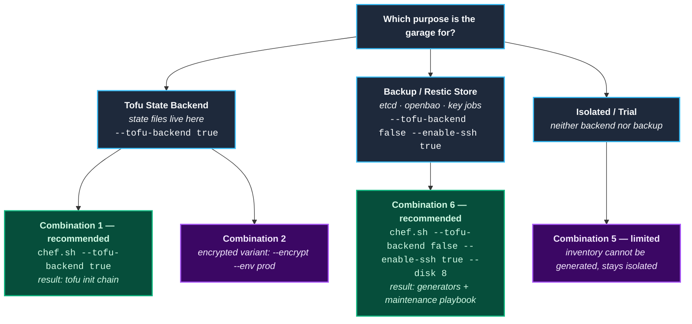
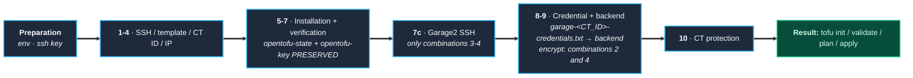

# How chef.sh Works

---

<details>
<summary><strong>Table of Contents</strong></summary>

- [1. Summary](#1-summary)
- [2. There Are Two Garages in This Project](#2-there-are-two-garages-in-this-project)
  - [2.1 Purpose Separation](#21-purpose-separation)
  - [2.2 Choosing a Purpose](#22-choosing-a-purpose)
- [3. Flow Diagrams](#3-flow-diagrams)
  - [3.1 Main Flow (all steps and branch points)](#31-main-flow-all-steps-and-branch-points)
  - [3.2 Tofu State Flow (Combinations 1–4)](#32-tofu-state-flow-combinations-14)
  - [3.3 Backup Flow (Combination 6)](#33-backup-flow-combination-6)
- [4. Quick Start](#4-quick-start)
- [5. Environment File: `.garage-setup.env`](#5-environment-file-garage-setupenv)
  - [5.1 Variable Responsibilities](#51-variable-responsibilities)
- [6. Adding the SSH Key to Proxmox (Optional)](#6-adding-the-ssh-key-to-proxmox-optional)
  - [6.1 Generate a Key Pair (skipped if it exists)](#61-generate-a-key-pair-skipped-if-it-exists)
  - [6.2 Copy the Public Key to Proxmox](#62-copy-the-public-key-to-proxmox)
  - [6.3 If `ssh-copy-id` Is Missing (manual)](#63-if-ssh-copy-id-is-missing-manual)
  - [6.4 Test](#64-test)
- [7. Installation Steps](#7-installation-steps)
  - [Step 1: SSH connection check](#step-1-ssh-connection-check)
  - [Step 2: Alpine template check](#step-2-alpine-template-check)
  - [Step 3: Container ID selection](#step-3-container-id-selection)
  - [Step 4: IP address selection](#step-4-ip-address-selection)
  - [Step 5: Copying the install script](#step-5-copying-the-install-script)
  - [Step 6: Garage LXC installation](#step-6-garage-lxc-installation)
  - [Step 7: Installation verification](#step-7-installation-verification)
  - [Step 7b: The `tofu-backend=false` branch (new CT)](#step-7b-the-tofu-backendfalse-branch-new-ct)
  - [Step 7c: Setting up SSH on Garage2 (`GARAGE_ENABLE_SSH=true`)](#step-7c-setting-up-ssh-on-garage2-garage_enable_sshtrue)
  - [Step 8: Retrieving the credential file](#step-8-retrieving-the-credential-file)
  - [Step 9: Generating the OpenTofu backend files](#step-9-generating-the-opentofu-backend-files)
  - [Step 10: Protection against CT deletion](#step-10-protection-against-ct-deletion)
- [8. Final Output and Branch Behavior](#8-final-output-and-branch-behavior)
  - [8.1 `--tofu-backend true` (Combinations 1–4) → tofu chain](#81---tofu-backend-true-combinations-14--tofu-chain)
  - [8.2 `--tofu-backend false --enable-ssh true` (Combination 6) → maintenance chain](#82---tofu-backend-false---enable-ssh-true-combination-6--maintenance-chain)
  - [8.3 `--tofu-backend false --enable-ssh false` (Combination 5)](#83---tofu-backend-false---enable-ssh-false-combination-5)
  - [8.4 Generator Contract](#84-generator-contract)
- [9. Flag Combinations (6)](#9-flag-combinations-6)
- [10. Direct Usage and Flag Reference](#10-direct-usage-and-flag-reference)
  - [10.1 Flags](#101-flags)
- [11. Related Documents](#11-related-documents)

</details>

## 1. Summary

`scripts/garage-setup/chef.sh` is the interactive installation orchestrator that connects
to the Proxmox Server (Proxmox VE — **PVE** for short; an open-source virtualization platform
that runs virtual machines and containers on a single server — the host machine in this
project, defined by `GARAGE_PVE_IP` in `.garage-setup.env`) over SSH and installs a single
Garage container end to end. The script executes the steps in order itself; you only answer
the questions it asks.

A quick primer on terms that appear frequently in this document:

* **LXC** — the name of the container technology that shares the operating system with the
  host and is far lighter than a virtual machine. **CT** (container) is an individual
  container installed with this technology; Proxmox assigns each one a number (300 and 310
  in this project), which is why you see expressions like "CT300" in the docs.
* **Garage** — the CT where the S3-compatible object storage software GarageHQ is
  installed. **Buckets** are created inside it, access is defined with a **key**; OpenTofu's
  state files and restic's backup repositories live in these buckets.
* **state backend** — the remote store where OpenTofu keeps the current state (state file)
  produced when it runs your infrastructure code. When you say `--tofu-backend true`, the
  garage is prepared for exactly this job.

A single script is used for two different purposes:

```bash
# Tofu STATE garage — state backend (combination 1)
./chef.sh --tofu-backend true

# BACKUP garage — restic repositories (combination 6, maintenance chain)
./chef.sh --tofu-backend false --enable-ssh true --disk 8
```

This document covers, in order: the purpose separation of the two garages (§2), flow
diagrams (§3), quick start (§4), the environment file (§5), SSH key preparation (§6),
step-by-step installation (§7), what gets printed at the end of installation (§8), the six
flag combinations (§9), and the flag reference (§10). The full list of command-line flags
is collected in [§10](#10-direct-usage-and-flag-reference); look there if you want to get
started quickly.

---

[↑ Back to top](#how-chefsh-works)

## 2. There Are Two Garages in This Project

All six combinations work technically; but *what each one is for* is a separate question.
For example, combination 5 (`--tofu-backend false --enable-ssh false`) installs without
problems — but it neither holds OpenTofu state nor can the maintenance playbook connect to
it: it runs, but it does not serve this project's purposes. The table below defines the
project's intent, not the technical possibilities.

### 2.1 Purpose Separation

Let's get to know the two access paths mentioned in the table up front: **`pct exec`** means
running a command *inside* the container via Proxmox's LXC command-line tool `pct` — it
requires no password or SSH server, Proxmox root is already authorized in every container.
**SSH**, on the other hand, requires installing a separate SSH server (sshd) inside the
container and connecting with a key. What gets used in a garage is determined by the
purpose itself; per the principle of least privilege, the state garage does not
unnecessarily open SSH, whereas the backup garage cannot be installed without SSH at all.

| | **Tofu State Garage** | **Backup Garage** |
|---|---|---|
| Live example | CT300 (`.env` → `GARAGE_CT_ID`) | CT310 (inventory `[garage-backup]` = `garage2`) |
| Purpose | OpenTofu **state** backend | **restic repositories** (etcd / openbao / key jobs) |
| Bucket + key | single bucket `opentofu-state` + `opentofu-key` | bucket = job (`etcd-daily` … `key`); **Ansible** generates a separate key for each bucket (maintenance §5) |
| Access | `pct exec`; SSH not recommended (least privilege) | SSH mandatory — Ansible connects to the `[garage-backup]` host over SSH |
| Standard combination | **#1**: `--tofu-backend true` | **#6**: `--tofu-backend false --enable-ssh true` |
| Post-install chain | `tofu init` → `tofu/backends/*.backend.tfbackend` | `gen-restic-passwords.sh` + `gen-maintenance-inventory.sh` → `playbooks/maintenance.yml` |
| Key storage (key file) | `garage-<id>-credentials.txt` (0600, in repo) | `restic-*.pw` is kept; `<bucket>.key` is deleted on a fresh garage install¹ |

> ¹ Key storage (key file) rules and restic details: [`maintenance/maintenance.md`](../maintenance/maintenance.md).

### 2.2 Choosing a Purpose

If your purpose is clear, so is your command; the question-and-answer flow in the
interactive installation proceeds in this order:



---

[↑ Back to top](#how-chefsh-works)

## 3. Flow Diagrams

The diagram numbers match chef.sh's own log output exactly — if you see `7b/10` on screen,
it's 7b here too, so you can match the phase easily. First the main flow covering
everything (3.1), then a simplified view of the two scenarios: tofu state (3.2) and
backup (3.3).

### 3.1 Main Flow (all steps and branch points)

The main flow splits in two at four points, and chef's subsequent behavior is determined
precisely there: **7b** (only `tofu-backend=false` + new CT), **7c** (only
`enable-ssh=true`), **step 9** (backend present/absent), and the **final output** (two
different chains).

```mermaid
flowchart TD
    %% ==================================================
    %% MAIN FLOW: all steps and branch points
    %% ==================================================
    Start["<b>chef.sh starts</b><br/><i>Orchestrates the Garage LXC installation — interactive</i><br/><code>--tofu-backend --enable-ssh --disk --encrypt --env</code>"]

    subgraph ORK [" 🎛️ STEPS 1-4: ORCHESTRATION "]
        S1["<b>1. SSH Connection Check</b><br/><code>ssh root@PVE · BatchMode · ConnectTimeout=10</code><br/><i>dies on failure — lists IP / SSH key / root access</i>"]
        S2["<b>2. Alpine Template Check</b><br/><code>pveam list local | grep template</code><br/><i>if missing: pveam update + download — no need to have it ready in advance</i>"]
        S3["<b>3. Container ID Selection</b><br/><i>existing CT: use · generate new ID · delete + reinstall</i><br/><i>protected CT cannot be deleted · deletion is confirmed, empty Enter cancels</i>"]
        S4["<b>4. IP Address Selection</b><br/><i>IPs in use collected from pct + qm configurations</i><br/><i>pick a free one from the 100-150 range — no eval, safe parsing</i>"]
        S1 --> S2 --> S3 --> S4
    end

    subgraph INST [" 🔧 STEPS 5-7: INSTALLATION "]
        S5["<b>5. Copy the Install Script</b><br/><code>scp setup-garage-lxc.sh → /root/ · chmod +x</code>"]
        S6["<b>6. Garage LXC Installation</b><br/><code>GARAGE_CT_CORES/RAM/DISK + ID storage IP/CIDR</code><br/><i>GarageHQ v2.1.0 · apk garage + openssl · OpenRC service</i><br/><i>opentofu-state bucket + opentofu-key generated</i><br/><i>credential: garage-&lt;CT_ID&gt;-credentials.txt — 0600</i>"]
        S7["<b>7. Status Verification</b><br/><code>pct exec -- rc-service garage status</code><br/><i>dies if not started — prints the manual check command</i>"]
        S5 --> S6 --> S7
    end

    subgraph COND [" ⚙️ 7b / 7c: CONDITIONAL STEPS "]
        D1{"<b>Is --tofu-backend false?</b><br/>state garage or backup garage?"}
        B7B["<b>7b. Placeholder cleanup + prerequisites</b><br/><code>garage bucket delete opentofu-state</code><br/><code>garage key delete opentofu-key</code><br/><i>this garage is not a tofu state backend — they are deleted</i><br/><i>node_exporter: 2 attempts, if it fails, [y/N] prompt</i><br/><i>python3: mandatory — dies if missing, ansible cannot run on the target</i>"]
        D2{"<b>Should SSH be set up on the LXC?</b><br/><code>--enable-ssh true|false</code><br/>"}
        B7C["<b>7c. Garage2 SSH Setup</b><br/><code>apk add openssh · rc-update sshd · authorized_keys</code><br/><i>GARAGE_SSH_PUB_KEY — default ~/.ssh/id_ed25519.pub</i><br/><i>stale host key: 6 probes + [Y/n] → ssh-keygen -R</i><br/><i>final check accept-new — else warn, env-check retries</i>"]
        D1 -->|yes — not state| B7B
        D1 -->|no — state garage| D2
        B7B --> D2
        D2 -->|yes — SSH on| B7C
        D2 -->|no — pct exec only| S8
        B7C ==> S8
    end

    subgraph POST [" 📦 STEPS 8-10: COMPLETION "]
        S8["<b>8. Retrieve Credentials</b><br/><code>get-credentials.sh → garage-&lt;CT_ID&gt;-credentials.txt</code><br/><i>scp + empty file check + chmod 600 · not sourced</i><br/><i>skipped for DHCP + existing CT</i>"]
        S9A["<b>9. Backend Generation</b><br/><code>generate-garage-backend.sh</code><br/><i>produces tofu/backends/*.backend.tfbackend from credentials</i><br/><i>existing files backed up under .backup/ with timestamp</i><br/><i>--encrypt → tofu/secrets/encryption.key · --env tag</i>"]
        S9B["<b>9. SKIPPED — no backend</b><br/><code>tofu/backends/ left untouched</code><br/><i>warn ... yok sayildi printed if --encrypt / --env passed</i>"]
        S10["<b>10. CT Protection</b><br/><i>interactive prompt — default E → pct set -protection 1</i>"]
        %% Step 9 looks at the SAME --tofu-backend flag — question not repeated,
        %% branching was asked in 7b (the question asked there governs)
        S8 ==>|tofu-backend = true — state backend| S9A
        S8 ==>|tofu-backend = false — no state, backup| S9B
        S9A --> S10
        S9B --> S10
    end

    subgraph RES [" 🎯 RESULT CHAINS "]
        R1["<b>Result A — Tofu Chain</b><br/><code>tofu init · validate · plan · apply</code><br/><i>backend files ready — Combinations 1-4</i>"]
        R6["<b>Result B — Maintenance Chain</b><br/><code>gen-restic-passwords</code> — repo passwords, does not overwrite<br/><code>gen-maintenance-inventory</code> — [garage-backup] line<br/><code>ansible-playbook playbooks/maintenance.yml</code><br/><i>Combination 6 — restic deployment begins</i>"]
    end

    %% FLOW CONNECTIONS
    Start ==> S1
    S4 ==> S5
    S7 ==> D1
    S10 ==> R1
    S10 ==> R6

    %% STYLES
    classDef ork fill:#1e293b,stroke:#38bdf8,stroke-width:2px,color:#f8fafc;
    classDef inst fill:#064e3b,stroke:#10b981,stroke-width:2px,color:#d1fae5;
    classDef cond fill:#2d261e,stroke:#f59e0b,stroke-width:2px,color:#fef3c7;
    classDef post fill:#1e1b4b,stroke:#6366f1,stroke-width:2px,color:#e0e7ff;
    classDef res fill:#3b0764,stroke:#a855f7,stroke-width:2px,color:#f3e8ff;
    class Start,S1,S2,S3,S4 ork;
    class S5,S6,S7 inst;
    class D1,B7B,D2,B7C cond;
    class S8,S9A,S9B,S10 post;
    class R1,R6 res;
```



Notes:

* The `SKIP_SETUP` (existing CT usage) and `SKIP_CREDENTIALS` (DHCP) branches are
  simplified in the diagram; their behavior is defined in §7 Step 3 and §8.
* **7b** only runs on a new CT install; for existing CT + `tofu-backend false`,
  a manual-command hint is printed for cleanup (§7 Step 7b).
* **Result A** is printed only for `tofu-backend=true`, **Result B** only for
  `tofu-backend=false + enable-ssh=true`.

### 3.2 Tofu State Flow (Combinations 1–4)

The flow for the garage that will hold OpenTofu state — in this scenario 7b does not run,
7c runs only in combinations 3/4:



* In this flow the `opentofu-state` bucket and `opentofu-key` are **preserved** — this
  garage is installed precisely to hold OpenTofu state; that bucket and key *are* that,
  deleting them would be pointless.
* 7b does not run; 7c runs only in combinations 3/4.

### 3.3 Backup Flow (Combination 6)

When the purpose is holding backups, the flow is extended by 7b and 7c — the real
differences are in these two steps:

```mermaid
flowchart LR
    %% BACKUP FLOW — combination 6
    H2["<b>Preparation</b><br/><i>env · ssh key</i>"]
    C1["<b>1-4</b> · SSH / template / CT ID / IP"]
    C2["<b>5-7</b> · Installation + verification"]
    C3["<b>7b</b> · Delete placeholders<br/><i>node_exporter · python3 mandatory</i>"]
    C4["<b>7c</b> · openssh + key<br/><i>stale host key approval</i>"]
    C6["<b>8-9</b> · Credential · backend SKIPPED<br/><code>tofu/backends/ left untouched</code><br/><i>encrypt/env ignored</i>"]
    C7["<b>10</b> · CT protection"]
    C8["<b>Generators</b><br/><code>gen-restic-passwords</code><br/><code>gen-maintenance-inventory --garage-ip</code>"]
    C9["<b>Result:</b> playbooks/maintenance.yml"]

    H2 ==> C1 ==> C2 ==> C3 ==> C4 ==> C6 ==> C7 ==> C8 ==> C9

    %% STYLES
    classDef bak fill:#2d261e,stroke:#f59e0b,stroke-width:2px,color:#fef3c7;
    classDef fin fill:#064e3b,stroke:#10b981,stroke-width:2px,color:#d1fae5;
    class H2,C1,C2,C3,C4,C6,C7 bak;
    class C8,C9 fin;
```



* In this flow the `opentofu-state` bucket + `opentofu-key` are **deleted**: since this
  garage will not be a state backend, those two items left over from the initial install
  (Step 6) are unnecessary; 7b cleans them up.
* Step 9 is skipped due to `tofu-backend=false`; `tofu/backends/` is left untouched.

---

[↑ Back to top](#how-chefsh-works)

## 4. Quick Start

```bash
cd scripts/garage-setup
cp garage-setup.env.example .garage-setup.env   # note the leading dot (.)!
nano .garage-setup.env                          # set GARAGE_PVE_IP
echo '.garage-setup.env' >> ../../.gitignore
chmod +x *.sh

./chef.sh --help                                # full flag list
```

The rationale behind the steps: the settings file is kept alongside the scripts under the
name `.garage-setup.env` and added to gitignore — it contains environment-specific
information like your IP, and should not remain in the repo. `chmod +x` is to avoid a
permission error on first run. All scripts run with `set -euo pipefail` (they halt on the
first serious error); logging, colors, and SSH connection options come from the shared
`_common.sh`.

`GARAGE_PVE_IP`, `GARAGE_CT_ID`, `GARAGE_ALPINE_TEMPLATE`, `GARAGE_ENABLE_SSH`,
`GARAGE_SSH_PUB_KEY` are not hardcoded: the single source is `.garage-setup.env`, and
command-line flags override these values per run — meaning if you don't pass a flag the
env value applies, if you do the flag value applies.

The generators (the file-*producing* scripts from §8.2) require `python3 + pyyaml` on the
machine they run on; if not installed, chef still finishes the installation, but cannot
invoke these scripts upon completion and prints the reason as a warning.

---

[↑ Back to top](#how-chefsh-works)

## 5. Environment File: `.garage-setup.env`

`.garage-setup.env` is your single settings file for the whole installation: scripts read
their defaults from it; command-line flags do not modify this file, they only override for
that run. There is no write-back to the file — the file is pure input. An exact copy of
the file follows (source: `scripts/garage-setup/garage-setup.env.example`):

```ini
# garage-setup.env.example
#
# Copy this file:    cp garage-setup.env.example .garage-setup.env
# Then edit the values in .garage-setup.env to match your environment.
#
# .garage-setup.env MUST NOT BE COMMITTED TO GIT (should be in the repo's
# .gitignore) - the proxmox IP in particular may be considered sensitive if
# it is inside, and this separation is also needed so teammates can use their
# own lab IPs.

# Proxmox host address (required - scripts prompt for --host if this is absent)
GARAGE_PVE_IP=164.102.98.152

# Default Garage LXC container ID
GARAGE_CT_ID=300

# SSH into Garage (default: false - overridden per run via CLI --enable-ssh):
#   true  -> chef.sh installs openssh + public key (backup garages;
#            maintenance connects to [garage-backup] host over ssh, requires this)
#   false -> no SSH; access only via pve through pct exec
#            (tofu state garages)
GARAGE_ENABLE_SSH=false

# Alpine LXC template name - to see the current version on Proxmox:
#   pveam available | grep alpine
GARAGE_ALPINE_TEMPLATE=alpine-3.23-default_20260116_amd64.tar.xz
```

### 5.1 Variable Responsibilities

| Variable | Who writes | Who reads |
|---|---|---|
| `GARAGE_PVE_IP`, `GARAGE_CT_ID`, `GARAGE_ALPINE_TEMPLATE` | user | all scripts (with `_common.sh` defaults) |
| `GARAGE_ENABLE_SSH` | user or `--enable-ssh` (overridden per run) | chef (7c), `gen-maintenance-inventory.sh` (die check) |
| `GARAGE_SSH_PUB_KEY` | user (optional; default `~/.ssh/id_ed25519.pub`) | chef 7c; maintenance.ini garage2 line uses the same key |

> **Gotcha — `--enable-ssh` is NOT written to `.env`.** The flag changes only the
> in-memory `GARAGE_ENABLE_SSH` value for that run; the `.env` file is not updated.
> However `gen-maintenance-inventory.sh` reads this flag **from the file** (it receives
> the garage IP from chef via the `--garage-ip` argument). Consequence: if you install
> with `--enable-ssh true` and leave `.env` at `false`, **even at the end of the same
> run** the inventory generation `die`s and chef prints the `Envanter uretilemedi`
> warning. To make SSH permanent, `.env` must define `GARAGE_ENABLE_SSH=true`.

---

[↑ Back to top](#how-chefsh-works)

## 6. Adding the SSH Key to Proxmox (Optional)

SSH key authentication means logging in with a private key instead of a password: on
Proxmox the permitted public keys live in the `authorized_keys` file, and the
corresponding private key stays only on your machine. This section does exactly that
preparation.

Which combination needs it: for the Tofu state garage (combination 1) it is **not
required** — access there is via `pct exec`, SSH is not installed. For the backup garage
(combination 6) the public key **must** be present on the local machine, because chef
writes this key into the CT in 7c and the maintenance playbook connects to the garage with
it over SSH. If the key is missing on your local machine, 7c `die`s right there.

### 6.1 Generate a Key Pair (skipped if it exists)

```bash
ssh-keygen -t ed25519 -f ~/.ssh/id_ed25519 -N "" -C "tofu-lar@proxmox"
```

### 6.2 Copy the Public Key to Proxmox

```bash
ssh-copy-id -i ~/.ssh/id_ed25519.pub root@<PROXMOX_IP>
```

### 6.3 If `ssh-copy-id` Is Missing (manual)

```bash
scp ~/.ssh/id_ed25519.pub root@<PROXMOX_IP>:/root/.ssh/authorized_keys
ssh root@<PROXMOX_IP> "chmod 600 /root/.ssh/authorized_keys && chmod 700 /root/.ssh"
```

### 6.4 Test

```bash
ssh root@<PROXMOX_IP>
```

Login should succeed without asking for a password.

---

[↑ Back to top](#how-chefsh-works)

## 7. Installation Steps

The steps proceed in the order you see on screen in chef.sh, and the numbers match the
logs exactly. **`die`** (error: installation halts) and **`warn`** (warning: installation
continues) mentioned here are the script's own output functions. If you hit an error at
some step, you can re-run chef from the same point — the steps are idempotent, i.e.
running them a second time does no harm.

> **Note:** the prompts and status/warning strings the script prints are still in Turkish;
> wherever this document quotes them, they are shown verbatim as the script emits them.

### Step 1: SSH connection check

* Before anything else, an SSH connection to Proxmox is attempted: since the rest of the
  script runs remotely, nothing can be done without this, so it halts with `die` right at
  the start. The connection is established with the shared `SSH_OPTS` in `_common.sh`:
  `ControlMaster=auto` (`ControlPersist=300` — dozens of `ssh` calls throughout the script
  share a single connection, no re-handshake every time), `BatchMode=yes` (no password
  prompt; works silently if you're connecting with a key, fails immediately instead of
  waiting if not), `ConnectTimeout=10`.
* On failure, an IP / SSH key / root access checklist is printed — this is the first place
  to look in the error chain.
* `ssh_close_master` is invoked on EXIT via `trap`, no lingering processes are left.

### Step 2: Alpine template check

The CT is installed from a ready-made **template** Proxmox can download; the template is
the `.tar.xz` file that serves as the container's initial disk image — Alpine Linux is
used in this project. Downloading the template beforehand is **not required**; chef checks
the state itself, and downloads it if needed (`pveam` is Proxmox's tool for downloading
these templates):
  1. Whether it exists locally is counted with `pveam list local | grep -c <template>`.
  2. If missing, `pveam update && pveam download local <template>` runs.
  3. If present, moves to the next step (no download).
* `GARAGE_ALPINE_TEMPLATE` in `.garage-setup.env` only provides the correct template name.
  You can list the current version with `pveam available | grep alpine` and update the env
  value.

### Step 3: Container ID selection

Every CT has a number (e.g. 300); existing numbers on Proxmox are read with `pct list`
and chef offers options based on them:

  1. Use existing CT (only update credential/backend)
  2. Create with a new ID (without deleting the old one; first free ID automatically)
  3. Delete the old CT and reinstall
* A protected CT cannot be deleted; the error message suggests `pct set <ID> -protection 0`.
* Deletion confirmation: the script prints `Devam etmek istiyor musun? (hayir/E)` — empty
  Enter cancels. *(The prompt itself is still in Turkish; the confirmation letter is `E`,
  matching `hayir/E`.)*
* ID selection is dynamic, no fixed assumption.
* When an existing CT is selected, if it has a static IP (manually assigned, fixed IP) it
  is reused; if **DHCP** (the automatically assigned IP that can change on reboot), we
  cannot know its IP in advance, so `SKIP_CREDENTIALS` skips the credential/backend steps.

### Step 4: IP address selection

* Network information is fetched from Proxmox. `eval` is **not used** — interpreting
  remote output as script language risks executing something malicious inside the output;
  instead, the output is parsed safely line by line as `key=value`
  (GATEWAY / BRIDGE / CIDR / PREFIX — CIDR is IP + mask notation, e.g.
  `164.102.98.101/24`).
* IPs in use are collected from `pct` and `qm` configurations, deduplicated.
* Free IPs in the `$PREFIX.100-150` range are listed (at most 30 shown); the user picks
  the last octet. Warning on entries outside 100–150, warning on used IPs.
* If no free IP in the range, manual entry is asked.
* Selected IP/CIDR is assigned to the `SELECTED_IP` variable. IP selection is skipped in
  `SKIP_SETUP` (existing CT) case.

### Step 5: Copying the install script

Since the script that actually performs the installation (`setup-garage-lxc.sh`) runs on
Proxmox, it is copied there via `scp` and `chmod +x` is applied remotely.

### Step 6: Garage LXC installation

**The exact form chef.sh calls:**

```bash
GARAGE_CT_CORES=<n> GARAGE_CT_RAM=<mb> GARAGE_CT_DISK=<gb> \
  /root/setup-garage-lxc.sh <CT_ID> <storage> <IP/CIDR> "<TEMPLATE>"
# template is passed as the 4th parameter — chef's $TEMPLATE
# (env GARAGE_ALPINE_TEMPLATE or --template flag)
```

**Usage of setup-garage-lxc.sh** (runs on the Proxmox host):

```bash
# Usage:
#   ./setup-garage-lxc.sh <container_id> [storage] [ip_cidr] [template]
#
# Example:
#   ./setup-garage-lxc.sh 300 local-lvm 164.102.98.101/24
```

Parameters (`storage` means the pool where the root disk is written — listed with
`pvesm status`, typically `local-lvm` in this project):

| Parameter | Meaning | Default |
|---|---|---|
| `<CT_ID>` | LXC container ID to be created | `200` |
| `[storage]` | storage pool for the root disk (listed with `pvesm status`) | `local-lvm` |
| `[ip_cidr]` | static IP + mask; `dhcp` for dynamic | `dhcp` |
| `[template]` | Alpine template name — chef passes it (`$TEMPLATE`: env or `--template`) | — (chef always passes) |

Resources (passed via env; chef flags map to these):

| Env | Chef flag | Default | Note |
|---|---|---|---|
| `GARAGE_CT_CORES` | `--cores` | 1 | LXC shares host CPU |
| `GARAGE_CT_RAM` | `--memory` | 256 | this job is verified to work on 256MB |
| `GARAGE_CT_DISK` | `--disk` | 2 | `--disk 8` recommended for backup garages |
| `GARAGE_CT_SWAP` | — | 0 | not passed from chef |
| — | `--storage` | `local-lvm` | 3rd parameter |

Steps the script performs on the Proxmox host:

1. Alpine LXC container is created, disk is allocated on the `storage` pool
   (template via `local:vztmpl/…`; download is in Step 2).
2. Container is started; `apk update/upgrade` (Alpine's package manager `apk` — think of
   it like `apt` on Debian) and `garage`, `openssl` packages are installed
   (GarageHQ **v2.1.0**, Alpine 3.23).
3. Garage binary is set up as an OpenRC (Alpine's service manager — used instead of
   systemd) service and started.
4. Garage configuration is created; `garage node id` is polled ready 5 times
   (it may not be ready immediately, briefly retried).
5. Cluster layout: `layout assign -z dc1 -c 10G` + `layout apply --version 1` —
   how data is distributed is defined and applied.
6. `opentofu-state` bucket + `opentofu-key` key are generated,
   `allow --read --write --owner` is granted (these two are for tofu state; deleted in
   Step 7b on a backup garage).
7. Credential file is saved as `/root/garage-<CT_ID>-credentials.txt` — the credential is
   the Key ID + Secret key pair used to access the garage's S3 API; if `Key ID` /
   `Secret key` cannot be parsed, leftover `PLACEHOLDER_*` explicitly errors out
   (no silent continuation — errors are not glossed over).
8. `secure_chmod` to 600; secret files on `/tmp` are removed with `shred -u`.

### Step 7: Installation verification

The only indication that the installation was done correctly is that the service is
running; therefore:

* Waits 3 seconds.
* Runs `rc-service garage status` via `pct exec` (running a command inside the container
  — §2.1).
* If status is not `started`, halts with `die` (manual check:
  `pct exec <ID> -- garage status`).

### Step 7b: The `tofu-backend=false` branch (new CT)

**Condition:** `--tofu-backend false` and a new CT has been installed (after Step 6).

The install script in Step 6 always prepares the `opentofu-state` bucket and the
`opentofu-key` key — these are the standard output of a fresh install; if this garage
will *not* be a state backend, they are no longer needed. 7b does exactly that: deletes
the placeholder items, then installs the two mandatory prerequisites of a backup garage
(node_exporter and python3).

1. Placeholder cleanup (`|| true` — silently passes if missing):
   ```bash
   pct exec <CT_ID> -- sh -c 'garage bucket delete opentofu-state --yes; garage key delete opentofu-key --yes'
   ```
2. **node_exporter** (optional, needed for scraping — a small service that lets Prometheus,
   the metric collection system, collect metrics from this machine):
   * Package name is `prometheus-node-exporter` — `apk add node_exporter` gives "no such
     package" (Alpine 3.23).
   * Service name is not guessed: it is detected with `grep -i exporter` in `/etc/init.d`,
     followed by `rc-update add` + `rc-service restart/start`.
   * 2 attempts; on failure, chef prints the remote output and prompts the user with
     `Continue without node_exporter? [y/N]` (default `N`; `N` → `die`,
     `Y` → manual install command printed and continuation).
3. **python3 — mandatory:** `apk add python3`, 2 attempts; on failure, remote output +
   `die`. Rationale: the maintenance role runs all Ansible modules on the target with
   python.
4. **Existing CT + `tofu-backend false`:** since installation is skipped, no cleanup is
   done; chef prints the manual command hint:
   ```bash
   pct exec <CT_ID> -- garage bucket delete opentofu-state --yes
   ```

### Step 7c: Setting up SSH on Garage2 (`GARAGE_ENABLE_SSH=true`)

**Condition:** env `GARAGE_ENABLE_SSH=true` or `--enable-ssh true` (default `false`).
Works on new and existing CTs, idempotent (re-running does no harm).

1. Public key file: `GARAGE_SSH_PUB_KEY` (default `~/.ssh/id_ed25519.pub`);
   if file missing, `die` + `ssh-keygen` suggestion.
2. Remotely (all idempotent):
   ```bash
   apk add openssh; rc-update add sshd default; rc-service sshd start|restart
   mkdir -p /root/.ssh && chmod 700
   touch authorized_keys && chmod 600
   grep -qxF '<key>' authorized_keys || echo '<key>' >> authorized_keys
   ```
3. **Stale host key flow** — on first SSH connection, the server's fingerprint is saved
   to the local `known_hosts` file and subsequent connections expect the same fingerprint.
   When a clean CT with no sshd is reinstalled at the same IP, the old fingerprint remains
   in the file; SSH treats this as "the server has been replaced" and refuses to connect.
   chef handles this as follows:
   * Probe: 6 attempts with `StrictHostKeyChecking=yes` — on `Connection refused`, waits
     and retries (sshd may just be starting); on changed-key signature, halts immediately.
   * On signature found, warning + `[Y/n]` prompt (default `Y`) → `ssh-keygen -R <IP>`.
     If you say "no", the old key remains (env-check retries later).
   * Final step: verification with `StrictHostKeyChecking=accept-new`; on failure, `warn`
     not `die` — `pre/maintenance-env-check` retries.

### Step 8: Retrieving the credential file

The credential (Key ID + Secret key pair) generated inside the CT in Step 6 stays there;
this step pulls it through Proxmox into your local repo, since the next step will generate
the backend files from it.

**Usage of get-credentials.sh:**

```bash
# Usage:
#   ./get-credentials.sh --host <PVE_IP> --ctid <CT_ID>
#
# Examples:
./get-credentials.sh                              # .garage-setup.env defaults
./get-credentials.sh --host 164.102.98.152 --ctid 310
```

* `scp` pulls `root@<PVE_IP>:/root/garage-<CT_ID>-credentials.txt` into the local
  `scripts/garage-setup/garage-<CT_ID>-credentials.txt`
  (examples in the repo: `garage-300-credentials.txt`, `garage-310-credentials.txt`).
* Thanks to `set -euo pipefail`, `scp` failure `die`s; empty file is deleted and error is
  raised.
* File is set to 600 via `secure_chmod`.
* This step is skipped when `SKIP_CREDENTIALS=true` (existing CT + DHCP).

The credential file is not `source`d; inside `generate-garage-backend.sh` only
`^[A-Z_][A-Z0-9_]*=` lines are parsed safely (code injection is prevented).

### Step 9: Generating the OpenTofu backend files

OpenTofu reads where to store state from small files with the `.tfbackend` extension;
this step generates those files from the credential — the `-backend-config=...` targets
passed during `tofu init` are exactly these.

**Usage of generate-garage-backend.sh:**

```bash
# Usage:
#   ./generate-garage-backend.sh <credential_file> [options]
#
# Options:
#   --dry-run    Only show, do not modify
#   --encrypt    Encrypt the backend files
#   --env        Environment name (dev/prod)
#
# Examples:
./generate-garage-backend.sh garage-300-credentials.txt
./generate-garage-backend.sh garage-300-credentials.txt --encrypt --env prod
```

* Project root is found dynamically with `find_project_root`; the script runs from any
  depth.
* Credential file is parsed safely; if a `PLACEHOLDER_*` value exists, `die`.
* Existing `tofu/backends/*.backend.tfbackend` files are backed up under
  `tofu/backends/.backup/` with a timestamp.
* Template is filled via `templates/garage-backend.tfbackend.template`;
  every output is set to 600 via `secure_chmod`.
* `--encrypt` → `openssl enc -aes-256-cbc -pbkdf2` + `tofu/secrets/encryption.key`.
* **If `--tofu-backend false`, this step is skipped:** `tofu/backends/` is left untouched;
  if `--encrypt` / `--env` is passed, the `warn ... yok sayildi` line is printed (their
  meanings only apply to backend generation).

### Step 10: Protection against CT deletion

`-protection` is Proxmox's flag preventing a CT from being deleted with `pct destroy` —
setting that flag is this step's job:

* Asked after steps 8-9 (also asked if skipped):
  the script prints `CT <ID> silinmeye karşı korunsun mu? (E/h)` — default `E`.
  *(The prompt itself is still in Turkish; the confirmation letter is `E`, matching
  `(E/h)`.)*
* If yes, `pct set <ID> -protection 1` is applied.
* If a protected CT is attempted to be deleted in Step 3, it is blocked; to remove the
  flag: `pct set <ID> -protection 0`.

In all steps, log functions come from `_common.sh`; error conditions halt with explicit
`die` messages; temporary secrets are cleaned up. After an error, `chef.sh` can be re-run
— completed steps are idempotent.

---

[↑ Back to top](#how-chefsh-works)

## 8. Final Output and Branch Behavior

The final chain printed after chef finishes depends on which branch you entered in Step 9:
if you close with `--tofu-backend true`, the tofu chain (8.1) runs; if you close with
`false` and SSH is also on, the maintenance chain (8.2) runs.

### 8.1 `--tofu-backend true` (Combinations 1–4) → tofu chain

The following sequence is executed: `init` reads the backend file and establishes the
state connection, `validate` checks the structure, `plan` shows what will change, `apply`
applies it.

```bash
cd tofu/stacks/k8s-cluster
tofu init -backend-config=../../backends/k8s-cluster.backend.tfbackend
tofu validate
tofu plan
tofu apply
```

* In this branch **no generator is called** — `gen-restic-passwords` /
  `gen-maintenance-inventory` only run under `tofu-backend=false` (§8.2). Even if
  `enable-ssh true` (combinations 3/4), the maintenance chain is not triggered.

### 8.2 `--tofu-backend false --enable-ssh true` (Combination 6) → maintenance chain

Upon completion, chef invokes two **generators** (scripts that read state and *produce*
new files) on a best-effort basis — meaning it runs if present and executable, otherwise
it does not break the installation, prints the reason and the manual command:

```bash
# 1) restic repo passwords — under ct-<ctid>, an existing .pw is NEVER overwritten
#    (only chef produces it; if skipped, run chef again)
# 2) maintenance inventory — maintenance-<ctid>.ini.generated (only chef produces it;
#    called with --garage-ip + --ct-id, if skipped, run chef again)
# 3) deployment
ansible-playbook -i ansible/inventory/maintenance-<ctid>.ini.generated ansible/playbooks/maintenance.yml
```

* If `gen-restic-passwords` fails, the reason (python3/pyyaml possibly missing) + the
  manual command is printed.
* If `gen-maintenance-inventory` fails, the reason (tofu inventories possibly missing) +
  the suggestion to re-run chef is printed.
* If the script itself is missing, the suggestion to re-run chef is printed.

### 8.3 `--tofu-backend false --enable-ssh false` (Combination 5)

```
GARAGE_ENABLE_SSH=false — maintenance envanteri uretilmedi (ssh'siz CT).
```

Inventory is not generated (chef does not call the generator in this combination at all —
the closing `enable-ssh false` branch); the garage remains accessible only via `pct exec`.

### 8.4 Generator Contract

| Script | Source | Output | Idempotency rule |
|---|---|---|---|
| `gen-restic-passwords.sh` | `roles/maintenance/defaults/main.yml` → `maintenance_jobs` (only `restic: true`) + `--ct-id` (chef provides) | `ansible/outputs/garage-backups/ct-<ctid>/restic-<job>.pw` (0600) | Existing `.pw` not overwritten — loss of repo password = loss of backups in that bucket |
| `gen-maintenance-inventory.sh` | `hosts.ini.generated` + `openbao.ini.generated` + `--garage-ip`/`--ct-id` (chef provides; only runs from chef) | `ansible/inventory/maintenance-<ctid>.ini.generated` (0600, DO NOT EDIT) | Dies if `--garage-ip`/`--ct-id` not given or if tofu inventories missing; no `GARAGE_ENABLE_SSH` check (the calling chef flow guarantees `enable-ssh true`) |

> Key storage (key file) distinction: `restic-*.pw` = repo password (kept, copied to a
> password manager); `<bucket>.key` = Garage instance key (deleted on a fresh install,
> can be regenerated). Details: [`maintenance/maintenance.md`](../maintenance/maintenance.md).

---

[↑ Back to top](#how-chefsh-works)

## 9. Flag Combinations (6)

There is no ready-made "profile" file in this project; the flags you provide on the
command line determine your behavior. Multiplying the binary options yields six
meaningful **combinations**: `--tofu-backend` (T/F) × `--enable-ssh` (T/F) × `--encrypt`
(only meaningful when `backend=true`). `--env dev|prod` is not a combination dimension,
it is only a tag stamped onto the backend files.

| # | backend | ssh | encrypt | Purpose | In this project |
|---|---|---|---|---|---|
| 1 | true | false | false | Tofu state garage | standard (CT300) |
| 2 | true | false | true | State + encrypted backend (`encryption.key`) | usable, optional |
| 3 | true | true | false | State + SSH on | usable; SSH not needed for state |
| 4 | true | true | true | State + SSH + encrypted backend | usable, optional |
| 5 | false | false | — | Isolated garage (neither backend nor backup) | works technically; inventory cannot be generated, function limited |
| 6 | false | true | — | Backup garage (restic + maintenance) | standard (CT310) |

* `encrypt` / `env` is only meaningful when `backend=true`; when `false`, chef prints the
  `yok sayildi` warning.
* Two live examples in the project: **combination 1** (CT300, state) and **combination 6**
  (CT310, backup).

---

[↑ Back to top](#how-chefsh-works)

## 10. Direct Usage and Flag Reference

One-page reference — usage template and examples:

```bash
# Usage:
#   ./chef.sh [--host IP] [--ctid ID] [--template NAME]
#             [--tofu-backend true|false] [--enable-ssh true|false]
#             [--cores N] [--memory MB] [--disk GB] [--storage NAME]
#             [--encrypt] [--env dev|prod] [-h|--help]
#
# Examples:
./chef.sh                                             # env defaults (combination 1)
./chef.sh --tofu-backend true --encrypt --env prod    # combination 2
./chef.sh --tofu-backend false --enable-ssh true --disk 8
                                                      # combination 6 - backup garages
./chef.sh --host 164.102.98.152 --ctid 350            # custom host / CT
./chef.sh --template alpine-3.23-default_20260116_amd64.tar.xz
```

### 10.1 Flags

| Flag | Effect |
|---|---|
| `--host`, `--ctid`, `--template` | override env defaults per run |
| `--tofu-backend false` | no backend generated, `tofu/backends/` untouched, 7b runs, final output becomes maintenance chain |
| `--enable-ssh true` | 7c (openssh + key + stale-key approval); mandatory for maintenance `[garage-backup]` — **must also be `true` in `.env` to be permanent** (§5.1 gotcha) |
| `--cores`, `--memory`, `--disk`, `--storage` | CT resources (mapped to env `GARAGE_CT_*`) — **only applied on new CT installs**; if an existing CT (`SKIP_SETUP`) is selected, these flags have no effect, no changes are made including disk |
| `--encrypt`, `--env` | only meaningful when `--tofu-backend true`; when false, the `yok sayildi` warning is printed |
| `-h`, `--help` | full help text |

---

[↑ Back to top](#how-chefsh-works)

## 11. Related Documents

* Backup/restic jobs, bucket/key ensure, alerts, env chain:
  [`maintenance/maintenance.md`](../maintenance/maintenance.md)


[↑ Back to top](#how-chefsh-works)

---

