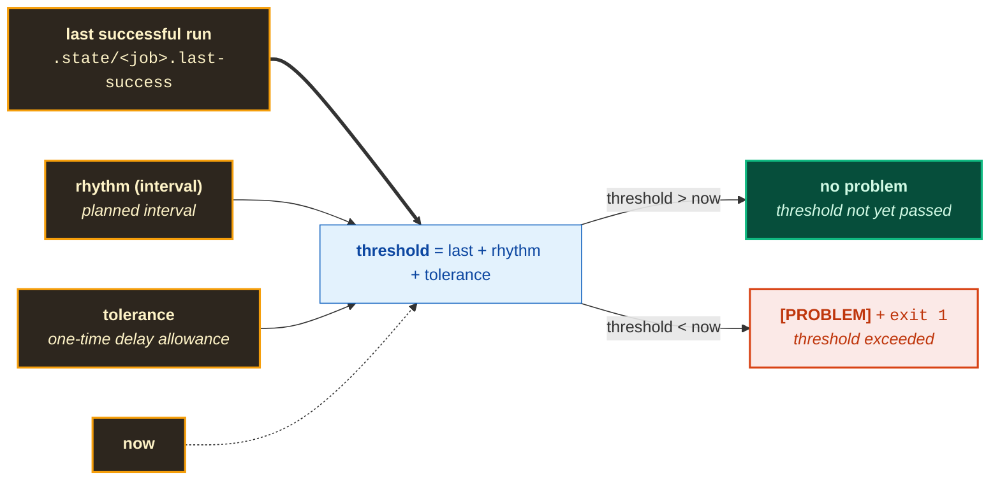
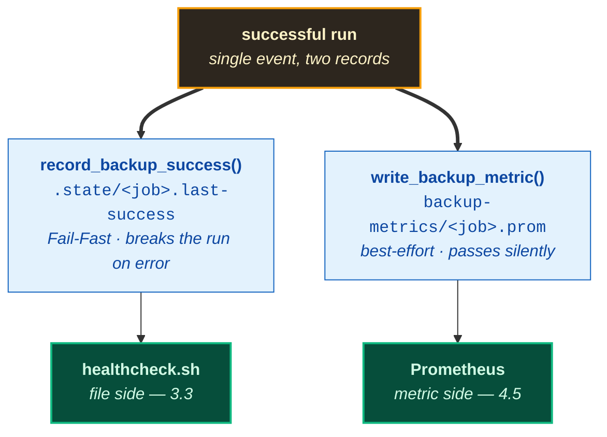
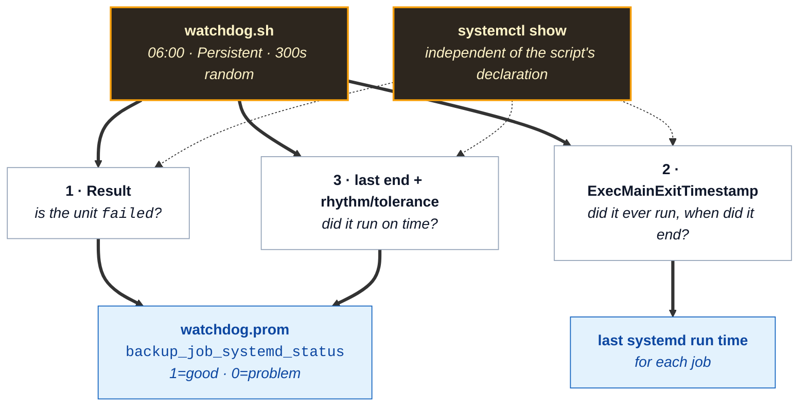
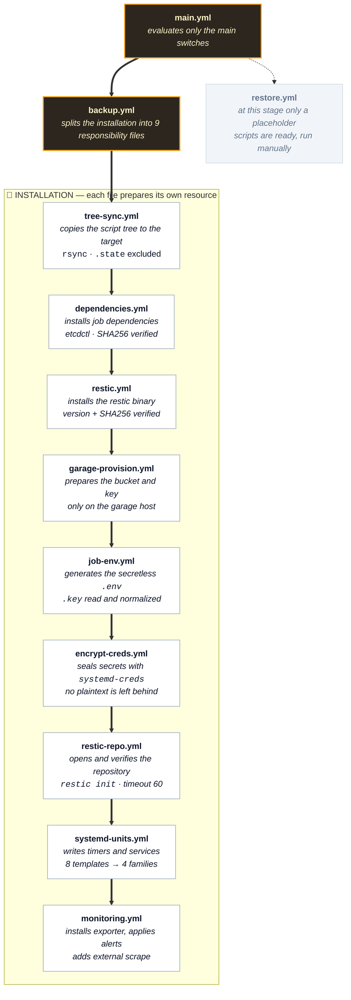
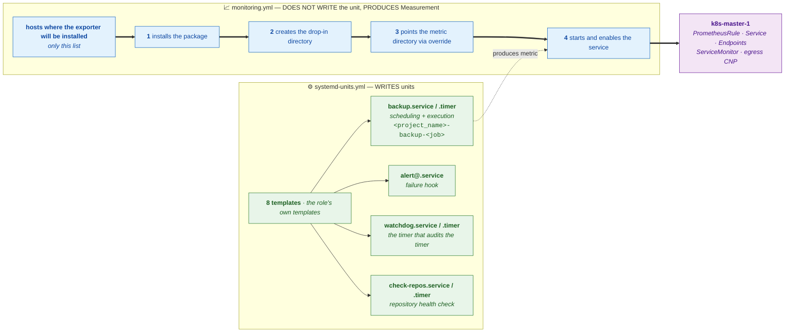
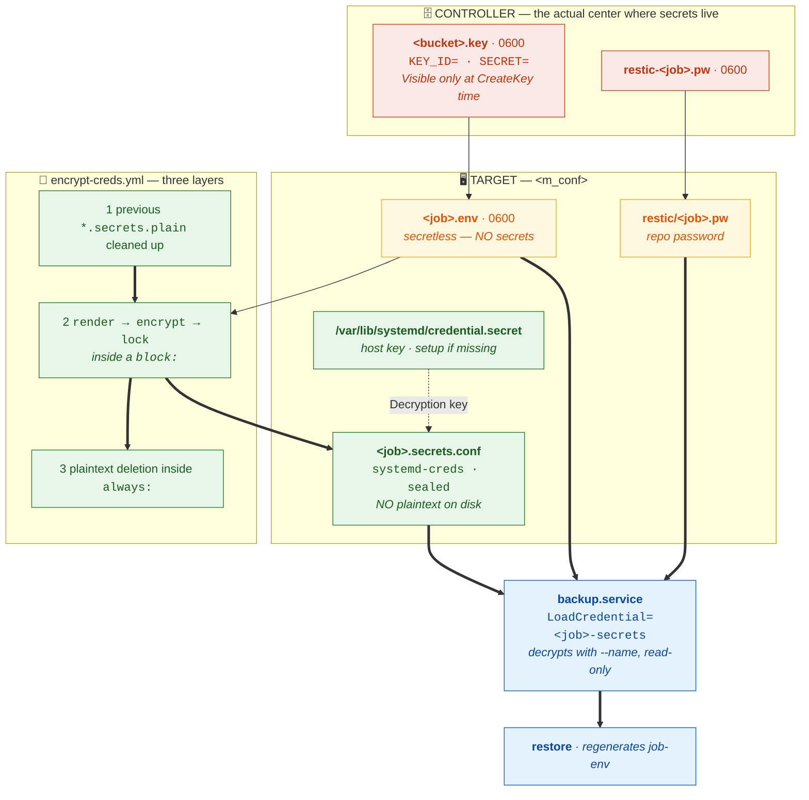
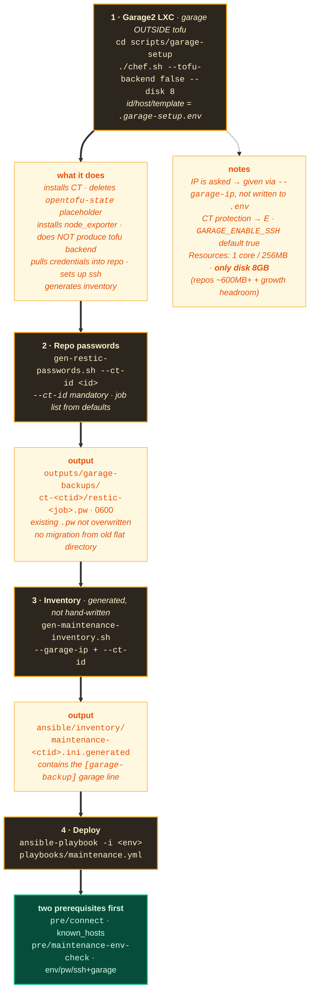
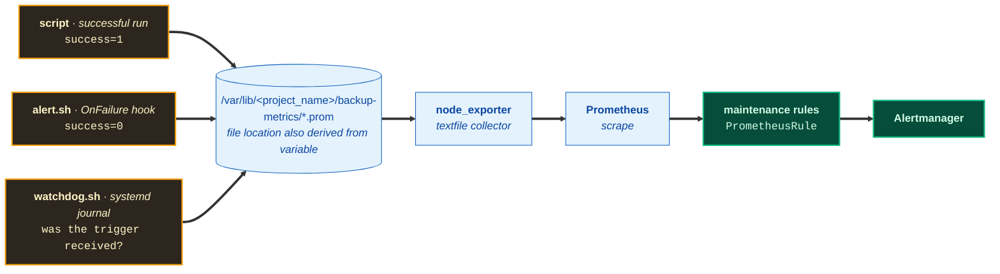
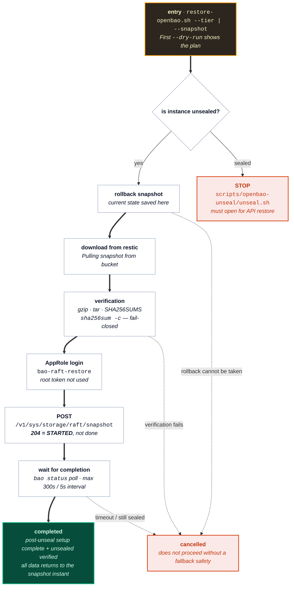

<a id="bas"></a>

# Maintenance — Backup and Recovery Architecture

This document defines the architectural structure and operational procedures designed to
protect the system's data integrity, ensure business continuity in potential disaster
scenarios (disaster recovery), and automate routine maintenance processes.

The backup strategy is built on **two fundamental pillars**, separated by the criticality
level of the data, its change frequency, and infrastructure layers:

1. **Infrastructure and Virtualization Layer (VM/LXC Disk Images):** The layer where full
   disk images (`vzdump`) and ZFS snapshots (`snapshot`) of virtual machines and containers
   running on Proxmox VE (PVE) are managed — executed on-demand or before version
   transitions.
2. **Application and Critical State Data Layer (Application State & Secrets):**
   The layer where Kubernetes cluster state (`etcd`) and the secret/encryption storage
   infrastructure (`OpenBao raft`) are managed. This data is backed up fully encrypted
   (AES-256-GCM) and versioned via Restic and Garage S3 object storage infrastructure,
   using automated timers.

The design rests on three principles: **layered security** (each layer is independently
verified with its own schedule and retention policy), **zero data loss target** (success is
proven not merely by system output but by verification and freshness auditing), and
**encryption standards** (secrets never reside in plaintext on disk; backups are
end-to-end encrypted with AES-256-GCM).

> **Naming note:** The project was initially created under the name "Tofu-lar" and later
> renamed to "Cloud-in-Lab" to match its scope. The technical identifiers in this
> document — `/etc/tofu-lar/`, `/var/lib/tofu-lar/backup-metrics/`, `tofu-lar-backup-*`
> unit names, and the `project_name: "tofu-lar"` variable value — are intentionally
> preserved.

<details>
<summary><strong>Table of Contents</strong></summary>

- [1. Tier Strategy (daily / weekly / monthly)](#1-tier--katman-stratejisi-daily--weekly--monthly)
  - [1.1 Retention Counts](#11-saklama-miktarları)
- [2. Directory Structure](#2-dizin-yapısı)
  - [2.1 Source — `maintenance/` in the Repository](#21-kaynak--depodaki-maintenance)
  - [2.2 Working Root — Copy on the Target](#22-çalışma-kökü--hedefteki-kopya)
  - [2.3 Input/Output Root — `<m_conf>/` and `<m_metrics>/`](#23-girdiçıktı-kökü--m_conf-ve-m_metrics)
  - [2.4 Units](#24-birimler)
  - [2.5 Controller Side — Where Secrets Actually Live](#25-controller-tarafı--sırların-asıl-bulunduğu-yer)
  - [2.6 Ansible Role](#26-ansible-rolü)
  - [2.7 Environment Identifiers](#27-ortam-kimlikleri)
- [3. Health and Freshness Auditing](#3-sağlık-ve-tazelik-denetimi)
  - [3.1 What Are `.state` Files](#31-state-dosyaları-nedir)
  - [3.2 Who Writes](#32-kim-yazar)
  - [3.3 Who Reads](#33-kim-okur)
  - [3.4 Threshold: Rhythm + Tolerance](#34-eşik-ritim--tolerans)
  - [3.5 Scheduling — No Cron Installed, Two Alternatives](#35-zamanlama--cron-kurulmamış-i̇ki-alternatif)
  - [3.6 Watchdog — The Timer That Audits the Timer](#36-watchdog--timerı-denetleyen-timer)
- [4. Restic Architecture (bucket => repo, timer per bucket)](#4-restic-mimarisi-bucketkova--repo-kova-başına-timer)
  - [4.1 Model](#41-model)
  - [4.2 Role Flow — What Gets Installed, How Decisions Are Made](#42-rol-akışı--ne-kurulur-nasıl-karar-verilir)
  - [4.3 Job Map](#43-job-haritası)
  - [4.4 Installation and Operations](#44-kurulum-ve-i̇şletme)
  - [4.5 Monitoring (Prometheus Chain)](#45-i̇zleme-prometheus-zinciri)
  - [4.6 Restic Password Escrow](#46-restic-şifre-emaneti)
- [5. Security Warnings](#5-güvenlik-uyarıları)
- [6. Recovery Flows](#6-kurtarma-akışları)
  - [6.1 Restore (Restic First, Traditional Backup)](#61-restore-restic-önce-geleneksel-yedek)
- [7. Detailed Script Narratives](#7-detaylı-script-anlatımları)
  - [7.1 backup/vm-disk/backup-full.sh](#71-backupvm-diskbackup-fullsh)
  - [7.2 backup/vm-disk/backup-quick.sh](#72-backupvm-diskbackup-quicksh)
  - [7.3 backup/app-data/backup-etcd.sh](#73-backupapp-databackup-etcdsh)
  - [7.4 backup/app-data/backup-openbao.sh](#74-backupapp-databackup-openbaosh)
  - [7.5 backup/app-data/backup-key.sh (REMOVED)](#75-backupapp-databackup-keysh-kaldirildi)
  - [7.6 backup/app-data/prune-s3.sh](#76-backupapp-dataprune-s3sh)
  - [7.7 backup/healthcheck.sh](#77-backuphealthchecksh)
  - [7.8 deploy/deploy-maintenance.sh](#78-deploydeploy-maintenancesh)
  - [7.9 restore.sh](#79-restoresh)
  - [7.10 restore-vm.sh](#710-restore-vmsh)
  - [7.11 restore-etcd.sh](#711-restore-etcdsh)
- [8. Versions](#8-sürümler)

</details>

---

---

## 1. Tier Strategy (daily / weekly / monthly)

| Tier | Scope | Method | Frequency | Retention |
|---|---|---|---|---|
| **Disk image** | Entire VM/LXC | `vzdump` (full) + `ZFS snapshot` (quick) — optional, **not scheduled** | Manual | PVE local storage only (Cloud/S3 not used) |
| **Application data** | etcd, OpenBao raft | `etcdctl`, `bao` → **restic** → Garage2 bucket | Every 4 hours | `keep_last`: etcd 12/3/3 · openbao 3/3/3 |

In this system, backups are **not stored under a uniform retention lifecycle**. Backup
execution runs through **six separate jobs**, and each job writes to **its own bucket**
(= its own restic repository). Schedule, retention, and encryption are independent per
job; there is no *promote*, *copy*, or *schedule* logic between them.

| Concept | Equivalent |
|---|---|
| Tier (daily / weekly / monthly) | The job's **name and schedule**, not a separate folder |
| Bucket | Garage2 bucket, simultaneously a **single restic repository** (`bucket => repo`) |
| Retention | `keep_last` — the N most recent snapshots within the bucket |
| Encryption | AES-256-GCM + zstd inside restic (see Section 4) |

In other words, **prefixed flat folders** like `etcd/daily/etcd-20260929-020000.db` **do
not exist in the current model**; each job writes directly to the root of its own bucket.
On disk, the old prefixes scanned by `restore-etcd.sh` come only from the *legacy* path
(see below).

> **Legacy — `s3tier` / `both` (deprecated):** With `MAINT_STORAGE=s3tier`, a flat
> `Garage S3` tier tree (`etcd/daily|weekly|monthly`) was used. This storage method has
> been deprecated. The production default is
> `group_vars/all/maintenance.yml → maintenance.backup.storage: "restic"` (see Section 4).
> With the Restic infrastructure, data is stored directly with per-bucket AES-256-GCM +
> zstd encryption.

**In the current model, each job independently does the following:** takes its own
snapshot, writes to its own bucket, applies its own `keep_last` limit, and writes its own
state stamp (`.state/<job>.last-success`) and its own metric file.

### 1.1 Retention Counts and Declarative Schedule

| Job | Bucket (restic repo) | Schedule (OnCalendar) | keep_last | Scope |
|---|---|---|---:|---|
| `etcd-daily` | `etcd-daily` | Every 4 hours (`*-*-* 01,05,09,13,17,21:00:00`) | 12 | etcd snapshot |
| `etcd-weekly` | `etcd-weekly` | Sunday 03:00 (`Sun *-*-* 03:00:00`) | 3 | etcd snapshot |
| `etcd-monthly` | `etcd-monthly` | 1st of month 03:30 (`*-*-01 03:30:00`) | 3 | etcd snapshot |
| `openbao-daily` | `openbao-daily` | Every 4 hours (`*-*-* 02,06,10,14,18,22:00:00`) | 3 | raft snapshot |
| `openbao-weekly` | `openbao-weekly` | Sunday 04:00 (`Sun *-*-* 04:00:00`) | 3 | raft snapshot |
| `openbao-monthly` | `openbao-monthly` | 1st of month 04:30 (`*-*-01 04:30:00`) | 3 | raft snapshot |

> **Scheduling Architecture:** Schedules are defined with `OnCalendar` expressions
> explicitly declared in `defaults/main.yml`, rather than dynamic runtime computation. The
> `etcd` and `openbao` time windows are set so they do not overlap (odd/even hours).
>
> **VM/LXC disk backup (`vm-disk`) is not in this table.** `backup-full.sh` and
> `backup-quick.sh` are **not scheduled jobs**; they are kept outside the
> `maintenance_jobs` map and are only run **manually / on demand** (see Section 7).
>
> The numbers are the `keep_last` values inside
> `roles/maintenance/defaults/main.yml → maintenance_jobs`; to change them, edit that same
> dictionary. This table is for reference purposes and does not represent dynamic source
> code.

[⬆ Back to top](#bas)

---

## 2. Directory Structure

The backup system rests on three separate roots, and this separation is intentional: each
root has a **different synchronization and confidentiality behavior**.

| Root | Where | Synchronized | Why separate |
|---|---|---|---|
| **Source** | `maintenance/` in the repo | `tree-sync.yml` copies to every target | We read the version from here |
| **Working root** | `<m_root>/maintenance/` on the target | the copy itself | Scripts run from here |
| **Input/output** | `<m_conf>/`, `<m_metrics>/` | not synchronized | Job-specific, varies per target |

> **None of the paths in this section are hardcoded — all are derived from the
> `maintenance.project_name` variable.** The default value is `tofu-lar`, and all examples
> in the document are written with this default; if you use another name, the paths change
> too.

| Derived path | Source variable | When `project_name: tofu-lar` |
|---|---|---|
| `m_conf` | `maintenance.project_name` | `/etc/tofu-lar/` |
| `m_metrics` | `maintenance.project_name` | `/var/lib/tofu-lar/backup-metrics/` |
| `m_root` | `maintenance.project_name` + `ansible_user` | `/root/tofu-lar/` or `/home/<user>/tofu-lar/` |
| `m_prefix` | `maintenance.project_name` | `tofu-lar-backup` (unit prefix) |

Change the variable via `roles/maintenance/defaults/main.yml → maintenance.project_name`;
you can also override it with `group_vars`. That is the single place it needs to be
written — the paths, unit names, and `Environment=HOME` values in this section are
templated with `{{ project_name }}`.

The third root is left out of synchronization because its content is the target's own
state: copying one host's `.env` file to another host is not an appropriate approach (see
4.2).

### 2.1 Source — `maintenance/` in the Repository

```text
maintenance/
├── _common.sh # SHARED: log, S3, credential, freshness, TIER functions
├── deploy/
│ └── deploy-maintenance.sh # Control menu: PVE disk / Master etcd / OpenBao S3 / All / Status
├── backup/
│ ├── healthcheck.sh # Backup freshness + rhythm/tolerance (nobody reads cron logs)
│ ├── vm-disk/ # VM/LXC disk backups
│ │ ├── backup-full.sh # vzdump + local tier weekly/monthly
│ │ └── backup-quick.sh # ZFS instant snapshot
│ └── app-data/ # Application data backups
│ ├── backup-etcd.sh # etcd snapshot → restic (Garage2)
│ ├── backup-openbao.sh # OpenBao raft snapshot → local copy + restic
│ └── prune-s3.sh # Manual/bulk S3 retention cleanup (legacy flat)
├── restore/
│ ├── _common.sh # restore-specific (VM detection, kubeadm static-pod, tier+flat fallback)
│ ├── restore.sh # Main menu and parameter dispatcher
│ ├── restore-vm.sh # VM/LXC disk image recovery
│ ├── restore-etcd.sh # etcd snapshot recovery (kubelet-aware)
│ └── restore-openbao.sh # OpenBao raft snapshot recovery (runs on CT301)
```

> **Architectural note:** `_common.sh` lives in one place (`maintenance/_common.sh`) —
> both `backup/*` and `restore/*` source it. `restore/_common.sh` only holds
> restore-specific functions. The credential file is not `source`d; only its `S3_*` lines
> are read via `grep`.

`vm-disk/` and `app-data/` are separate because their targets differ: `vm-disk/` runs only
on PVE and writes its output to local disk, while `app-data/` sends to a remote bucket
(restic). If they sat under the same folder, answering "where does this run" would require
looking at the file name.

`deploy/` is separate at the root level because it is a single script and runs from a
different machine than `backup/`: its job is to execute on the target; it does not take
backups itself.

### 2.2 Working Root — Copy on the Target

`tree-sync.yml` carries this tree to every target via rsync and deliberately leaves two
things out: the `.state/` directory and `docs/`. The reason for leaving them out is that
`.state` is host-specific — the same job's last successful run differs across two hosts.

```text
<m_root>/maintenance/ # /root/tofu-lar (root) or /home/<user>/tofu-lar
├── _common.sh
├── backup/
│ ├── healthcheck.sh
│ ├── vm-disk/{backup-full.sh,backup-quick.sh}
│ └── app-data/{backup-etcd.sh,backup-openbao.sh,prune-s3.sh}
├── restore/ # only to hosts capable of restore
│ ├── _common.sh, restore.sh, restore-vm.sh, restore-etcd.sh, restore-openbao.sh
├── .state/ # NOT synchronized — host-specific
│ ├── <job>.last-success
│ └── ...
└── deploy/ # not used on target, neither synced nor executed
```

The `.state/<job>.last-success` file is written by `record_backup_success()` and read by
`healthcheck.sh`. Its content is a single line UTC timestamp. For why it is file-based and
why it is not synchronized, see 3.1.

### 2.3 Input/Output Root — `<m_conf>/` and `<m_metrics>/`

This entire root is **created at runtime**; it has no counterpart in the repository. The
tree below is written with the `project_name: tofu-lar` default:
`<m_conf>` = `/etc/tofu-lar/`, `<m_metrics>` = `/var/lib/tofu-lar/backup-metrics/`.

```text
/etc/tofu-lar/ # tree-sync.yml prepares
├── restic/ # beside the tree, separate sub-root
│ └── <job>.pw # restic.yml distributes (from controller), 0600
└── backup/ # beside the tree, separate sub-root
    ├── <job>.env # job-env.yml creates, 0600 — secretless
    ├── <job>.secrets.conf # encrypt-creds.yml prepares, 0600 — encrypted
    ├── alert.sh # systemd-units.yml prepares, 0750
    ├── check-repos.sh # systemd-units.yml prepares
    ├── watchdog.sh # systemd-units.yml prepares
    └── watchdog.jobs # systemd-units.yml prepares

/var/lib/tofu-lar/backup-metrics/ # tree-sync.yml prepares
├── <job>.prom # TWO writers: write_backup_metric() (success) + alert.sh (OnFailure) — see 4.5
└── watchdog.prom # watchdog.sh writes (systemd trigger record)
```

The `<job>.secrets.plain` file is also created in this directory but is **not persistent**:
`encrypt-creds.yml` clears any leftovers from the previous run, recreates it on each run,
and deletes it in the `always:` block (see 4.2). Normally it does not exist.

The `backup-metrics/` directory can also be recreated by `write_backup_metric()` with
`mkdir -p`; continuity is left to `tree-sync.yml` so that the directory is ready before the
systemd unit starts when the image is reinstalled.

### 2.4 Units

`systemd-units.yml` and `monitoring.yml` prepare the following files. Since the unit prefix
is `<m_prefix>` = `{{ project_name }}-backup`, the names below are also written with the
`tofu-lar` default.

```text
/etc/systemd/system/
├── tofu-lar-backup-<job>.service # for each job
├── tofu-lar-backup-<job>.timer # for each job
├── tofu-lar-backup-alert@.service # OnFailure hook
├── tofu-lar-backup-watchdog.service
├── tofu-lar-backup-watchdog.timer
├── tofu-lar-backup-check.service
├── tofu-lar-backup-check.timer
└── prometheus-node-exporter.service.d/
    └── tofu-lar.conf # monitoring.yml, on hosts in m_exporter_hosts
```

`monitoring.yml` also prepares `/tmp/<project_name>-*.yaml` files for `kubectl apply` and
cleans them up when done; these files are not persistent.

### 2.5 Controller Side — Where Secrets Actually Live

These files are **not committed to the repo** (`.gitignore`: `ansible/outputs/`, `*.key`)
and are **invisible** in the web interface. They are not deleted when pushing to the repo;
the tree is shown here with full addresses because the role reads them and the secrets
live here.

```text
ansible/outputs/garage-backups/ct-<CT_ID>/
├── <bucket>.key # 0600, per-bucket Garage access key
│ └── <bucket> = etcd-daily, etcd-weekly, etcd-monthly,
│ openbao-daily, openbao-weekly, openbao-monthly
└── restic-<job>.pw # 0600, per-job restic password
    └── <job> = etcd-daily, etcd-weekly, etcd-monthly,
                openbao-daily, openbao-weekly, openbao-monthly
```

The `ct-<CT_ID>` subdirectory is derived from the inventory file name
(`maintenance-320.ini.generated` → `ct-320`), so that the secrets of two CTs do not get
mixed. Passwords are generated at `chef.sh` closure by `gen-restic-passwords.sh`, and
`.key` files are written by `garage-provision.yml` (see 4.2). A separate key per bucket is
preferred: key loss is confined to a single bucket and the blast radius shrinks.

**Without a copy of these files, the bucket cannot be recovered.** The Garage key is
visible only once at `CreateKey` time; if the `.key` file is lost, it is not possible to
regenerate a key for that bucket (see 4.2, key matrix).

### 2.6 Ansible Role

The role runs through a single entry point; for details and ordering, see 4.2.

```text
ansible/roles/maintenance/
├── defaults/main.yml # maintenance_jobs, m_conf, m_metrics, m_garage_out_dir, switches
├── tasks/
│ ├── main.yml # two main switches → backup.yml / restore.yml
│ ├── backup.yml # includes nine files in order
│ ├── restore.yml # placeholder: NO tasks WRITTEN, restore called manually via shell
│ ├── tree-sync.yml # prepares the tree + <m_conf> + <m_metrics> directories
│ ├── dependencies.yml # downloads etcdctl, verifies with upstream SHA256SUMS
│ ├── restic.yml # installs binary, distributes <job>.pw
│ ├── garage-provision.yml # bucket, alias, key, R/W permission
│ ├── job-env.yml # generates <job>.env
│ ├── encrypt-creds.yml # prepares <job>.secrets.conf
│ ├── restic-repo.yml # opens/verifies the repository
│ ├── systemd-units.yml # prepares and enables units
│ └── monitoring.yml # exporter, PrometheusRule, external scrape
├── templates/
│ ├── backup.env.j2, backup.secrets.env.j2
│ ├── backup.service.j2, backup.timer.j2
│ ├── alert.sh.j2, alert@.service.j2
│ ├── watchdog.{sh,jobs,service,timer}.j2
│ ├── check-repos.sh.j2, check.{service,timer}.j2
│ ├── node-exporter-override.conf.j2
│ ├── external-exporter-servicemonitor.yaml.j2
│ ├── external-exporters-endpoints.yaml.j2
│ └── external-exporter-egress.yaml.j2
├── templates/alerts/
│ ├── maintenance.yaml.j2 # collects fragments (wrapper)
│ └── backup.yaml.j2 # backup group
└── handlers/
```

There is **no** `restore.yaml.j2` under `templates/alerts/`, and this is deliberate:
`maintenance.restore.enabled` explicitly triggers the render/apply task, the wrapper
cannot find the file via ``, and the playbook breaks (see 4.5). The fragment
will be added on the day restore automation is written — the include in the wrapper is
already waiting (see 4.2 "What Is Not Written", `restore.yml`).

> **The raft backup is two-layered:**
>
> 1. **Local copy** — `/var/lib/bao-raft-snaps/` (7 days). Written by `backup-openbao.sh`.
> The directory is separate from the raft data directory (`openbao_raft_path`): keeping it
> on the same mount would blur the `find -mtime` scope and the "which file is raft?"
> distinction.
> 2. **Remote copy** — restic → Garage2 `openbao-daily|weekly|monthly` buckets.
>
> Identity is via the `bao agent` (auto_auth/AppRole) unix socket; **root token is not
> used.** Snapshot permissions are `docs/tr/openbao/openbao-rbac.md` B10/P5, restore
> permissions B11/P6. Restore: `restore-openbao.sh` (profile `bao-raft-restore`).
>
> Backup depends on a single flag, `openbao_backup_enabled`. Turning this flag off also
> stops the raft backup; `backup-openbao.sh` can also be run manually.

> **Permission note:** The `*.sh` files in the repo sit at mode 644, and since
> `tree-sync.yml` does not preserve modes, they arrive at the target as 644 too. Before
> running manually or via cron, make them executable:
> ```bash
> find maintenance -name '*.sh' -exec chmod +x {} +
> ```
> For scheduled jobs this is normally not needed because they are `systemd timer`s.

> **Example VMIDs:** The `300` / `301` below are examples — run the commands with the
> **actual guest ID** from your own Proxmox installation.

### 2.7 Environment Identifiers

The **machine names and LXC/VM identifiers** mentioned in the document also come from
variables. There are two distinct classes and they must not be confused:

| Class | Source | Value in this installation | Where used |
|---|---|---|---|
| **Inventory host name** | `ansible/inventory/*.ini.generated` (generated file) | `k8s-master-1`, `openbao-1`, `garage2` | `maintenance_jobs.<job>.host`, `m_exporter_hosts` |
| **LXC/VM identifier (CT ID / VMID)** | `chef.sh --ctid <id>`, `.garage-setup.env`, Proxmox | Garage `320`, OpenBao `301`, K8s `300` | path names, `vzdump-*` file names, `restore.sh` |
| **Project name** | `maintenance.project_name` | `tofu-lar` | `<m_conf>`, `<m_metrics>`, unit prefix (see 2.3) |

> **Inventory host names are a permanent contract.** The `host: "k8s-master-1"` /
> `host: "openbao-1"` values in `defaults/main.yml` must match the **host names in the
> `*.ini.generated` file exactly** — matching is by name, not by IP address. If you rename
> a host, `defaults/main.yml`, `group_vars`, and `monitoring.yml` must be updated together.
>
> **CT IDs / VMIDs are specific to this installation only.** The Garage LXC's ID is passed
> via `chef.sh --ctid` (if left blank, `.garage-setup.env` is read) and the inventory file
> is generated as `maintenance-<ctid>.ini.generated`. Therefore the `300` / `301` / `320`
> mentioned in the document are **example** values; your own environment will have
> different ones.
>
> **`restore.sh` Is Fully Flexible:** `restore.sh` and its sub-scripts dynamically scan all
> `vzdump-*.tar.zst` archives on Proxmox, prompt the user for a VMID in an interactive
> menu, and accept any VMID list as a parameter via the CLI
> (`./restore.sh all 100 101`).

[⬆ Back to top](#bas)

---

## 3. Health and Freshness Auditing

A backup merely reporting successful execution means nothing on its own; the real question
is **when it was last successful**. A systemd timer can silently break (timer deleted, unit
`failed`, host rebooted), a script can silently exit with an error, or an upload can be
left half-done when the network drops. In none of these cases does anything reach a human
on its own — and nobody reads what is written to the journal anyway. This section answers
the question "when was the last successful backup, and who will notice": the file side
(`.state`), the metric side (`.prom`), and the timer side (watchdog) — three separate eyes
that do not substitute for each other.

### 3.1 What Are `.state` Files

When the backup script finishes **successfully**, `record_backup_success()` in
`_common.sh` runs and writes a single-line UTC timestamp into the directory sitting beside
the script:

```text
maintenance/.state/<job>.last-success
```

The file name is the job name (`etcd-daily.last-success`, `openbao-daily.last-success`,
`vm-disk-300.last-success`); its content is a single ISO timestamp
(`2026-09-24T16:11:19Z`). If the file is missing, it means that job has **never succeeded**
— the health check treats this as a problem too.

The reason it is file-based is simple: when a process ends, everything in memory is lost,
and a trace that writes to disk remains. When asked when the backup system was last
trusted, the answer is that trace. The directory is not committed to git (it is in
`.gitignore`) and is not copied in any synchronization — because the state is the **local**
record of the machine it ran on.

### 3.2 Who Writes

The writing side is a single function, with three scripts as callers:

| Script | Machine | Stamp |
|---|---|---|
| `backup/app-data/backup-etcd.sh` | K8s Master | `<JOB_NAME>.last-success` (inventory `etcd-daily` / `etcd-weekly` / `etcd-monthly`) |
| `backup/app-data/backup-openbao.sh` | OpenBao CT | `<JOB_NAME>.last-success` (`openbao-daily` / `-weekly` / `-monthly`) |
| `backup/vm-disk/backup-full.sh` | PVE | `vm-disk-<VMID>.last-success` |

Two important rules:

* **Only a successful run writes.** On a failed run the file is not touched; the old stamp
  stays in place and progressively ages into becoming the "problem" itself. In other words,
  the file going stale is the very thing being monitored.
* **`backup-quick.sh` does not write** — the ZFS snapshot is a manual/instant tool, not
  part of a scheduled job, and is not a concern of the health check.

The two writes run **in the same run but at different protection levels**:

* `write_backup_metric()` is **best-effort**: if the file/directory cannot be opened, it
  silently `return 0`s — a metric loss never breaks a run.
* `record_backup_success()` exhibits **Fail-Fast** (strict validation) behavior
  (`mkdir -p` + `date > file`). Even if the backup step succeeds, the failure to write the
  state stamp into the `.state` directory (for example, due to disk full or access
  permission error) causes the process to exit with an error, preventing a false-positive
  declaration of an erroneous/incomplete state.

### 3.3 Who Reads

The **only engine that reads `.state` files is `healthcheck.sh`**. The age of the file is
computed with `backup_age_hours()` and compared against the threshold
`last_success + interval + tolerance` with `is_overdue()`; a job exceeding the threshold is
marked `[PROBLEM]` and the script **exits 1**.

`healthcheck.sh` is a standalone verification tool that can be invoked on demand or by
external automation:

| Caller | When | What happens |
|---|---|---|
| `restore.sh health` | when you type it (menu or `./restore.sh health`) | prints the output to the screen |
| `deploy-maintenance.sh` menu 5 | when you select from the menu | runs via SSH on the target machine (`--only etcd\|vm-disk\|openbao`), returns the combined exit code of the three targets |
| External Monitoring / Script | when triggered periodically | directs output to a log channel (with `--quiet` option) |

The routine and uninterrupted freshness tracking on the system is carried out by the
integrated **Prometheus (BackupOverdue)** and **systemd Watchdog** services.

Additionally, `.state` is **not** read in the following places:

* **Prometheus** — its alert is fed from the `.prom` metric, it does not look at the file.
* **Watchdog** — reads systemd's own journal record (see 3.6), does not touch `.state`.
* **rsync / tree sync** — deliberately excluded with `--exclude='.state/'`.

### 3.4 Threshold: Rhythm + Tolerance

The audit has a single formula:



Example: if etcd is expected to run every 4 hours, its rhythm is 4 hours; a one-time delay
allowance (tolerance) of 2 hours is added → if more than 6 hours have passed since the
last success, it is reported. The tolerance exists so that scheduling delay (e.g.
`RandomizedDelaySec=300`, missed trigger compensation) is not flagged as a false positive
anomaly.

Rhythm and tolerance **live in two separate places** and both require attention:

| | Where | For what |
|---|---|---|
| `healthcheck.sh`'s own dictionary | inside the script (`INTERVAL_H` / `TOLERANCE_H` — **hardcoded in code**) | the threshold of the audit that reads the `.state` file |
| `maintenance_jobs → interval_h / tolerance_h` | `roles/maintenance/defaults/main.yml` → job's `.env` → `BACKUP_MAX_AGE_SECONDS` | the alert threshold written to the `.prom` metric (see 4.5) |

In other words, a value in `maintenance_jobs` **does not change the healthcheck's
threshold** — that threshold is embedded in the script; to change it, you edit the
dictionary inside `healthcheck.sh` itself. The two currently write the same numbers, but
they are two separate sources — if one is updated and the other forgotten, the audits will
give different answers.

The metric-side counterpart of the same formula: `write_backup_metric()` also writes the
`BACKUP_MAX_AGE_SECONDS` it reads from the job env into the `.prom` file, so that the
Prometheus `BackupOverdue` rule checks **all jobs with a single expression**, each against
its own threshold (see 4.5). The file side and the metric side record the same success in
**two separate forms**:



### 3.5 Scheduling — No Cron Installed, Two Alternatives

`healthcheck.sh` does not need scheduling; it is an audit that **anyone can wire into
their own routine**. Here, cron's purpose is to trigger the audit on its own at a specific
time — how its output is directed is still set up by the user.

In the example installation this connection is **not made**: the ansible role does not
install a timer or cron for healthcheck, and no notification is configured. Instead, the
periodic/automatic leg of the audit is fulfilled by two different mechanisms — Prometheus
alerts via metrics (4.5) and the systemd watchdog (3.6). The `.state` side is queried
**on demand** with `restore.sh health` / deploy menu 5.

For those who want to set up their own routine, an example (output is STDOUT; exit code
is 0/1, you route the text to your own log/monitoring channel):

```text
0 8 * * * /<PROJECT_DIR>/maintenance/backup/healthcheck.sh --quiet
```

`--quiet` is for this: it writes nothing when there is no problem (does not produce empty
output), writes and returns 1 when there is a problem — it does not fill the output
channel with blank lines.

### 3.6 Watchdog — The Timer That Audits the Timer

All the checks above say "did it succeed"; the watchdog asks a separate question: **"was
that job ever run?"** The script may not even be able to write a metric (missing binary,
file permissions, disk full) — then the `.prom` side is blind too. The watchdog takes the
answer **independently** from the script's own declaration, from the records systemd
keeps.

The role sets this up with two units: `tofu-lar-backup-watchdog.service` + `.timer`
(`systemd-units.yml`), running daily at `06:00` (`Persistent=true` + 300 sec random
delay), and `watchdog.sh` answers the following three questions via `systemctl show`:



The answers are written to `backup-metrics/watchdog.prom` as two metrics:
`backup_job_systemd_status` (1=good, 0=problem) and the last systemd run time for each
job; plus the last run time of the watchdog **itself**
(`backup_watchdog_last_run_timestamp_seconds`).

The job list and threshold come from the `watchdog.jobs` file (generated by the role from
`maintenance_jobs`; `job|unit|rhythm|tolerance` lines) — that is, a threshold table
**different and separate** from healthcheck's. The watchdog is only installed on hosts
that have a job in `maintenance_jobs` (master, openbao); it is not installed on PVE,
because there is no scheduled job on PVE.

Two alerts are born from these metrics (4.5): `BackupScheduleMissed` (critical — unit
failed / never run / window exceeded) and `BackupWatchdogStale` (warning — the watchdog
itself has not run for 28 hours; in that case this audit is blind too).

[⬆ Back to top](#bas)

---

## 4. Restic Architecture (bucket => repo, timer per bucket)

> **Prerequisite:** Before the role runs, Garage2 CT must be installed with
> `scripts/garage-setup/chef.sh --tofu-backend false --enable-ssh true`, and at closure
> the `maintenance-<ctid>.ini.generated` inventory and `restic-*.pw` passwords must be
> generated. Without the inventory, the role cannot reach the target.

### 4.1 Model

* **Bucket => repo = timer**: each job **takes its own fresh snapshot at its own time**
  and **writes to its own Garage2 bucket**. There is NO promote/copy/schedule logic.
* **Retention = keep-last N**: a serial job **starts with the stamp of the backup from its
  first run**; the bucket never exceeds N (the oldest is dropped when N is exceeded). A
  missed run = a gap, no compensation is invented.
* **Encryption built-in** (restic: AES-256-GCM + zstd) — the currently largest exposure,
  "unencrypted etcd Secrets + plaintext HTTP", is closed.
* **Separation**: a separate Garage key per bucket (only its own bucket, R/W — no Owner
  permission is defined) + a separate password per repo + state (CT300) ⟂ backup (Garage2)
  separate LXCs.
* **Endpoint is not hardcoded**: the restic/S3 target
  (`maintenance.backup.garage2_endpoint`) is derived from the `[garage-backup]` host in the
  inventory — no hardcoded IPs. (The old hardcoded value had died when the CT was
  reinstalled, leaving restic init hanging and failing; a `timeout 60` was also added to
  init.) If the IP changes, the inventory is refreshed + playbook rerun — no manual change
  in templates or the repo is needed.

### 4.2 Role Flow — What Gets Installed, How Decisions Are Made

#### The Separation Principle

The role is built with a two-stage chain: `main.yml` evaluates only the main switches
(`backup.yml` / `restore.yml`), while `backup.yml` splits the installation into nine
responsibility files. This split is preferred because each file carries a single delivery
contract, and voluminous steps like `garage-provision` (271 lines) are read independently
of the others.

The guiding criterion for this architectural split is the question **"which file owns
this resource"**. There is a single owner for each resource; a second owner would break
idempotency by writing to both sides.

| Resource | Owner | Out of scope |
|---|---|---|
| Tree (scripts, `restore/`, `backup-metrics/`) | `tree-sync.yml` | — |
| Job dependencies (download etcdctl + verify SHA256) | `dependencies.yml` | — |
| Restic binary | `restic.yml` | — |
| Bucket + key + bucket permission | `garage-provision.yml` | Password, env |
| Secretless env (`.env`) | `job-env.yml` | Secrets |
| Encrypted credential (`.secrets.conf`) | `encrypt-creds.yml` | — |
| Restic repository | `restic-repo.yml` | Secrets |
| Units (unit) | `systemd-units.yml` | Monitoring |
| Monitoring (exporter, PrometheusRule, external scrape) | `monitoring.yml` | Unit writing |

#### The Chain

The ordering is a delivery contract: a file takes its input **after** the previous one has
**finished**. For example: `restic-repo.yml` reads the encrypted file produced by
`encrypt-creds.yml`, and `monitoring.yml` uses the `backup-metrics/` directory opened by
`tree-sync.yml`.

Each `include_tasks` runs with its own `when` gate; the gate is based on the `m_*` lists
in `defaults/main.yml` (for example `m_restic_jobs_local`). A file falling to an empty list
never enters, and `garage-provision` runs only on the `[garage-backup]` host.



The `==>` sign is the contract "input is taken **after** the previous one has **finished**":
for instance, `restic-repo.yml` reads the encrypted file produced by `encrypt-creds.yml`.

Each step is bound to its own condition, and this condition is derived from the lists in
`defaults/main.yml` — if there is no job on that host for that step, the step never enters:

| File | Condition | Meaning |
|---|---|---|
| `tree-sync` · `systemd-units` | `m_jobs_local` | there is at least one scheduled job on this host |
| `dependencies` | `m_etcdctl_jobs_local` | there is at least one job on this host that wants `etcdctl` |
| `restic` · `job-env` · `encrypt-creds` · `restic-repo` | `m_restic_jobs_local` | at least one of them writes to a restic bucket |
| `garage-provision` | `m_buckets` **+** garage host | there is a job that needs a bucket **and** the host is `[garage-backup]` |
| `monitoring` | three separate conditions | see below |

#### What Is Not Written — sh/Ansible Split

The **backup** leg of the chain is complete: nine files, from `tree-sync` to `monitoring`,
each owning a single resource, and the playbook installs, distributes, and schedules them.

**The restore leg, however, is written only on the shell side.** The five scripts under
`maintenance/restore/` (`_common.sh`, `restore.sh`, `restore-vm.sh`, `restore-etcd.sh`,
`restore-openbao.sh`) are complete and run manually; `tasks/restore.yml`, on the other
hand, is **a placeholder with no tasks**, and `maintenance.restore.enabled` defaults to
`false`.

| | Backup leg | Restore leg |
|---|---|---|
| Shell side | 7 scripts — `backup/` (6) + `_common.sh` | 5 scripts — `restore/` |
| Ansible side | 9 files, complete | **not written** (`restore.yml` empty) |
| How it runs | playbook installs → timer runs | operator invokes manually via SSH |
| Switch | `maintenance.backup.enabled` (true) | `maintenance.restore.enabled` (false) |

`maintenance/deploy/deploy-maintenance.sh` and `backup/app-data/prune-s3.sh` are not part
of these two legs of the deployment chain: the first is a manually installed bootstrap,
the second is the cleanup of legacy flat objects (the rsync include-list excludes both).

This is not a deficiency but a **deliberate boundary**: restore is a destructive operation
(VM/LXC `destroy`, etcd static-pod reinstallation, raft rollback) and the decision is made
by a human. When automation is written, the `restore.yml` tasks, the
`alerts/restore.yaml.j2` fragment, and the `restore.enabled` switch will be brought online
together — all three are waiting as skeletons.

Although `monitoring.yml` is a single file, it runs with three separate conditions: the
node\_exporter block opens via `m_exporter_hosts` (only the hosts where the exporter is to
be installed), the PrometheusRule block via `alerts_enabled`, and the external scrape block
via `m_external_exporter_ips`.

#### Unit–Monitoring Boundary

The tasks that write units and the tasks that monitor them are in separate files, and this
is the preferred boundary: `systemd-units.yml` writes only the units it can produce from
the role's own templates, while `monitoring.yml` takes on the package, drop-in, and
external scrape side. Thus, the answer to "who wrote this unit" is a single file.

This boundary also holds for node\_exporter: package installation, the `ExecStart`
override, and `enable`/`start` are all three defined inside `monitoring.yml`. Since on the
K8s master the exporter arrives via DaemonSet, this block runs only on the hosts in the
`m_exporter_hosts` list.

8 templates are reduced to 4 service families: per-job `backup.service`/`.timer`
(`{{ project_name }}-backup-<job>`), `OnFailure` hook `alert@.service`,
`watchdog.service`/`.timer`, and `check-repos.service`/`.timer`. All three `.timer`
templates have `Persistent=true` and `RandomizedDelaySec=300`. `Nice=10`, on the other
hand, is **not in the timer but in the services**: it is found in `backup.service.j2` and
`check.service.j2`, and is **not** in `watchdog.service`.



The boundary here is this: `systemd-units.yml` writes **only the units it can produce from
its own templates**, and installs no packages. All four stages of node\_exporter (package
→ drop-in directory → `ExecStart` override → enable/start) are collected in a single file,
because these four are the entire lifecycle of a single service; if half were in one place
and half in another, the question "who installed this service" would be scattered across
two files.

Since on the K8s master node\_exporter arrives via DaemonSet, that block does not run
there; in return, the PrometheusRule and external scrape are always `kubectl apply`ed
through the master.

#### Secrets Flow Through Three Channels

The bucket key, the restic password, and the S3 credentials are carried in **three
separate files** at three separate security levels. This separation is preferred because
each channel has a different leakage surface: `.key` is 0600 only on the controller, `.env`
is secretless and 0600 on the target, and `.secrets.conf` never contains plaintext on disk
at any time.

`encrypt-creds.yml` establishes three guarantees together: first, the `*.secrets.plain`
files remaining from the previous failed run are cleaned up; then, `render → encrypt →
lock` runs inside a `block:`; and plaintext deletion is in the `always:` block. Thus, even
if `encrypt` fails, plaintext cannot remain on disk.

The credential is sealed with `--name=<job>-secrets`; the decryption side also explicitly
provides the same name. This contract is mandatory: `systemd-creds(1)` `decrypt` compares
the input file name against the name embedded in the encrypted data and rejects on
mismatch. Providing the name manually eliminates the comparison's dependence on the file
name (`<job>.secrets.conf`). It is re-sealed on each run (nonce rotation + recovery on host
key loss).



This architecture is installed by **Ansible `roles/maintenance`**. The role is single-
sourced: the `defaults/main.yml → maintenance_jobs` dictionary defines the jobs, and
`group_vars/all/maintenance.yml` overrides the environment values. The Chef.sh stage is a
prerequisite — for details, see
[`docs/tr/garagehq/chef-sh-how-it-works.md`](../garagehq/chef-sh-how-it-works.md).

The installation steps run as a single chain inside the playbook:

* **Tree synchronization** `tree-sync.yml`: only each host's own job scripts + `_common.sh`
  are sent to each host, excluding `.state`. To hosts capable of restore, `restore/` and
  `backup/healthcheck.sh` are also added.
* **Restic installation** `restic.yml`: version `0.19.1` is verified with SHA256, and the
  binary is installed atomically. On the controller, the
  `ansible/outputs/garage-backups/ct-<ctid>/restic-<job>.pw` files are generated by
  `gen-restic-passwords.sh` at chef closure; the role distributes them to the target at
  0600. If a password is missing, the role explicitly errors and asks for `chef.sh` to be
  run.
* **Garage2 ensure** `garage-provision.yml`: the role runs on the `[garage-backup]` host.
  The bucket list is created/ensured with the `bucket=repo` model through
  `maintenance_jobs`, a Garage key per bucket is prepared, and stored as
  `ansible/outputs/.../<bucket>.key`. The key is visible only at CreateKey time; without
  the key file, repo access is impossible. No Owner permission is defined for bucket
  access; access is set only with R/W via `AllowBucketKey`. It runs in four stages and each
  stage refreshes its own inventory: bucket inventory and alias verification → key
  inventory and `CreateKey`/`ImportKey` decision → `.key` write and format check → R/W
  permission via `AllowBucketKey`. A bucket whose alias does not arrive is not
  automatically adopted or deleted; mapping would be a guess, deletion would be
  destructive — that is why the role stops the process with a clear error message, and the
  bucket is manually cleaned up by the operator once.

  ```mermaid
  flowchart TD
      %% GARAGE-PROVISION — four stages, each refreshes its own inventory
      %% gate: m_buckets &gt; 0 and inventory_hostname in m_garage_hosts
      A1["<b>1 · Bucket inventory</b><br/><code>garage bucket list</code><br/><i>globalAliases verified</i>"]
      A2["<b>2 · Key inventory</b><br/><code>CreateKey</code> / <code>ImportKey</code><br/><i>the decision is made here</i>"]
      A3["<b>3 · .key write</b> · 0600<br/><code>KEY_ID= · SECRET=</code><br/><i>format check</i>"]
      A4["<b>4 · Bucket permission</b><br/><code>AllowBucketKey</code><br/><b>R/W</b><br/><i>No Owner permission defined</i>"]
      A1 ==> A2 ==> A3 ==> A4

      STOP{{"<b>if alias is missing, STOP</b><br/><i>auto-mapping would be a guess<br/>deletion would be destructive</i><br/>operator cleans up manually"}}
      A1 -.-> STOP

      classDef asama fill:#e8f5e9,stroke:#2e7d32,color:#1b5e20;
      classDef dur fill:#fbe9e7,stroke:#d84315,stroke-width:2px,color:#bf360c;
      class A1,A2,A3,A4 asama;
      class STOP dur;
  ```

  * **Secretless env** `job-env.yml`: the bucket key is read and
    `/etc/<project_name>/backup/<job>.env` (0600) is generated for each job. The key file is
    checked first for existence, then for format (`KEY_ID=`/`SECRET=` each exactly one
    line) — an empty or truncated `.key` file does not fall into an ambiguous error that
    does not say "which bucket is broken".
  * **Secret encryption** `encrypt-creds.yml`: `RESTIC_PASSWORD` + `AWS_ACCESS_KEY_ID` +
    `AWS_SECRET_ACCESS_KEY` are **not written** to the plaintext `.env`. They are sealed
    into a `systemd-creds` encrypted credential with three layers of protection:
    1. the `*.secrets.plain` files remaining from the previous failed run are **cleaned
       up**,
    2. `render → encrypt → lock` runs inside a `block:`,
    3. plaintext deletion is in the `always:` block — even if `encrypt` fails, plaintext
       cannot remain on disk.
  * **Repo open/check** `restic-repo.yml`: if `restic cat config` fails, `restic init` runs
    with `timeout -k 10 60`. Since the endpoint is derived from the inventory, a playbook
    rerun is enough when the CT IP changes. Because restic writes its informational
    messages to **stderr**, `changed_when` searches both streams (`stdout` + `stderr`)
    together. The ordering is mandatory: it comes after `encrypt-creds` (the encrypted file
    is produced here). The `shell` task runs with `executable: /bin/bash` — `/bin/sh` on
    Debian is dash and does not support the here-string (`<<<`) here.
* **Systemd units** `systemd-units.yml`: 8 templates are reduced to 4 service families —
  per-job `backup.service`/`.timer`, `OnFailure` hook `alert@.service`,
  `watchdog.service`/`.timer`, and `check-repos.service`/`.timer`. `Persistent=true`,
  `RandomizedDelaySec=300`, `Nice=10` are applied in the timers.
* **Monitoring and external scrape**:
  - `monitoring.yml` installs `prometheus-node-exporter` on non-K8s hosts and opens the
    textfile directory.
  - The PrometheusRule `maintenance` object is applied via `kubectl apply` on
    `k8s-master-1`. The group is `maintenance.backup`; fragments are programmatically
    selected inside `templates/alerts/maintenance.yaml.j2`. If
    `maintenance.backup.alerts_enabled` is off, render/apply never runs.
    - **External exporter scrape**: targets are collected from the inventory, a Service +
      Endpoints + `ServiceMonitor` (`job="external-node-exporter"`) are produced, and an
      egress `CiliumNetworkPolicy` opens only these `/32` targets on port 9100. For the
      detailed flow, see 4.5.
  - Alerts: `BackupOverdue`, `BackupLastRunFailed`, `BackupScheduleMissed`,
    `BackupWatchdogStale`, `ExternalExporterDown`. If the external exporter dies, `.prom`
    is cut off and the series stay stale; that is why `ExternalExporterDown` announces the
    blind spot.

This flow runs with a single
`ansible-playbook -i maintenance-<ctid>.ini.generated playbooks/maintenance.yml` command
and controls the `maintenance.enable` / `maintenance.backup.enabled` main switches from a
single point. The detailed task contents are examined under
`ansible/roles/maintenance/tasks/`.

### 4.3 Job Map

| Job (unit: `<project_name>-backup-<job>`) | Host | Schedule | keep | Bucket (Garage2) |
|---|---|---|---|---|
| etcd-daily | `k8s-master-1` | Every 4 hours | 12 | etcd-daily |
| etcd-weekly | `k8s-master-1` | Sunday 03:00 | 3 | etcd-weekly |
| etcd-monthly | `k8s-master-1` | 1st of month 03:30 | 3 | etcd-monthly |
| openbao-daily | `openbao-1` | Every 4 hours | 3 | openbao-daily |
| openbao-weekly | `openbao-1` | Sunday 04:00 | 3 | openbao-weekly |
| openbao-monthly | `openbao-1` | 1st of month 04:30 | 3 | openbao-monthly |
| vm-disk-300/301 | — (not scheduled) | on-demand manual | (local tier) | — outside Restic, out of plan (see note) |

> **This table is for reading purposes — it is not the source.** Schedule, `keep_last`,
> bucket, and interval/tolerance values are under
> `roles/maintenance/defaults/main.yml → maintenance_jobs`; that is where changes are made
> (or via `group_vars` override). To add a new job, a line is added to the
> `maintenance_jobs` dictionary — the table itself is merely the readable counterpart of
> that dictionary.
>
> **The `Host` column also comes from a variable:** the target of each job is the
> `maintenance_jobs.<job>.host` field, and this value must match the **inventory host
> name**. The `k8s-master-1` and `openbao-1` in the table are only **example** values; they
> are defined in `defaults/main.yml` with these names. Matching is by name, not by IP
> address. `vm-disk` (vzdump), on the other hand, is not automatically scheduled and is run
> manually on operational demand.

> **vm-disk Architectural Decision:** Disk image backups (`backup-full.sh` /
> `backup-quick.sh`) are designed to run **on-demand based on operational needs** rather
> than routine automatic timers, in order to protect local storage space and keep the
> system's I/O load under control. They are run manually when needed.

Timer best practice: `Persistent=true` (a missed trigger is compensated once on startup) +
`RandomizedDelaySec=300` + `Nice=10` + no native overlap.

### 4.4 Installation and Operations

The installation is a single chain: without the LXC hosting the Garage2 buckets being
ready, repo passwords cannot be produced; without repo passwords, the inventory cannot be
produced; and without the inventory, deployment cannot be produced. The first step is
`chef.sh`'s job, and it invokes the generators in steps two and three at its own closure;
running them manually is only for diagnostics.



For the full list of commands, see `docs/tr/garagehq/chef-sh-how-it-works.md` §3.3 — the
step-by-step flow of `chef.sh` is there; the part of this chain in steps two and three is
merely the output of that flow.

> **Bucket/key management is entirely inside `roles/maintenance`** (variable-driven,
> idempotent): `maintenance_jobs` → bucket list → **on the garage2 host** (ssh — `pct`/CT
> id are NOT in ansible) via `garage json-api` *ensure bucket / ensure key / allow R-W*;
> since the key secret is visible only at `CreateKey` time, it is kept as a key file at
> `ansible/outputs/garage-backups/ct-<ctid>/<bucket>.key` (0600) (per-CT subdirectory —
> `m_garage_out_dir`). A new bucket = a line in `maintenance_jobs` + playbook rerun.

* **Envs management chain**: `roles/maintenance/defaults` →
  `group_vars/all/maintenance.yml (maintenance: → backup:/restore:)` → the role **generates**
  `/etc/tofu-lar/backup/<job>.env` (0600) on the target — it is not edited manually, and it
  is overwritten when the playbook reruns.
* **Project name** single variable: `maintenance.project_name` → unit names, `/etc/...`,
  metric directories are derived. **Exception:** the command examples in alert
  `description`s (`systemctl status 'tofu-lar-backup-*'` etc., 4 places) are **hardcoded**
  in the template — if the project name changes, those texts are not updated (they are for
  display purposes, no runtime effect).
* **Storage mode — IMPLEMENTED**:
  `group_vars maintenance.yml → maintenance.backup.storage: "restic"`.

  > **Legacy note:** `s3tier` / `both` (flat file `backups/` bucket, writing with s3cmd) is
  > **off** in production — the code remains for example/rollback, it does not run in
  > production. The credential file (`garage-<CT_ID>-credentials.txt`) belongs only to this
  > legacy path; there is **no** hardcoded path in `_common.sh`, whoever wants it provides
  > it with `--creds <file>`.

### 4.5 Monitoring (Prometheus Chain)

The first link of the chain is the script itself: a successful run, the `OnFailure`
instant failure, and the watchdog (systemd trigger record) all write to the same place —
where the file lives is derived from the `project_name` variable, not hand-written:



> **Two separate records, two separate readers:** the same successful run is written both
> as `.state/<job>.last-success` (file → `healthcheck.sh`, see Section 3) and as a `.prom`
> metric (→ Prometheus). This section describes only the **`.prom` chain**; Prometheus does
> not read the file side in any way, and correspondingly the `.state` side does not look at
> the metric either. `watchdog.prom` writes to this chain **from a different source** — not
> the script's declaration, but systemd's journal record (see 3.6).

Which machine node_exporter runs on, and how:

| Machine | Exporter source |
|---|---|
| K8s Master | DaemonSet (M1 mount — chart installed) |
| openbao-1 | maintenance role (`monitoring.yml` — hosts in the `m_exporter_hosts` list) |
| garage2 | `chef.sh` 7b (backup garage prerequisite) |
| PVE | none — vm-disk is not scheduled and is not included in the scrape (see Job map note) |

`m_exporter_hosts` is not a list but is computed by **subtracting** the `k8s_master` group
from every machine whose host appears in `maintenance_jobs`
(`defaults/main.yml → m_exporter_hosts`). That is, the criterion is not just "host with a
job": even if the K8s master appears in `maintenance_jobs`, it is removed from the list
because the exporter already arrives there via DaemonSet.

The `openbao-1` and `garage2` in the table are **inventory host names**; they come from
the generated `ansible/inventory/*.ini.generated` files, not a fixed name in the code.
`m_exporter_hosts` derives these names through `maintenance_jobs[].host` — if you rename the
host, the list changes with it. `Garage2` is a **product name** and `garage2` is a **host
name**; the two must not be confused.

**Rules:** the maintenance role applies a single PrometheusRule object (`monitoring.yml`,
via `kubectl apply` on `k8s-master-1` — helm does not run):

* **Object:** `PrometheusRule/maintenance` (the namespace, release label come from
  `maintenance_prom_namespace`/`maintenance_prom_release` variables; they must match the
  chart values, if the two differ the operator does not discover the object).
* **Group:** for now a single group `maintenance.backup`; when restore automation arrives,
  it is added to the same object under the name `maintenance.restore`
  (`alerts/maintenance.yaml.j2` programmatically selects fragments — each fragment carries
  its own group name).

  > **Attention:** the `alerts/restore.yaml.j2` file **does not exist yet**. Because of
  > this, setting `maintenance.restore.enabled` to `true` **breaks** the playbook — the
  > wrapper does ``, Jinja cannot find the file, and the render/apply task
  > errors (`tasks/restore.yml` is only a placeholder at this stage; the restore scripts
  > are run manually).
* **Switch:** `maintenance.backup.alerts_enabled` (`true` in group_vars) — when both flags
  are off, render/apply never runs (an empty `groups` would be an invalid object).

| Alert | Severity | What it catches |
|---|---|---|
| `BackupOverdue` | warning | Freshness threshold: `interval_h + tolerance_h` (per job, from env) exceeded — a single expression covers all jobs |
| `BackupLastRunFailed` | critical | `backup_last_status == 0` — the `0` value is written to `.prom` by **`alert.sh`** (systemd `OnFailure` hook); the script itself writes only `1` on success (see the chain at the start of 4.5) |
| `BackupScheduleMissed` | critical | From the watchdog's eye, systemd: failed / never triggered / window exceeded |
| `BackupWatchdogStale` | warning | Its own watchdog has not run for 28 hours (monitoring is blind) |
| `ExternalExporterDown` | critical | The external exporter (garage2 / openbao-1) is not responding — see below |

> **The blind spot and why it is critical:** when the exporter dies, the `.prom` metrics are
> also cut off; the series remain *stale* (frozen at their old value) and
> `BackupOverdue`/`BackupLastRunFailed` **do not see it**. `ExternalExporterDown` alone
> announces this blind spot. The reverse is also true: if the ServiceMonitor is not
> installed at all (backup completely off), that series does not exist either and the rule
> stays silent — it does not produce a false alarm.

> **Two writers, one file — Metric Continuity:** the `<job>.prom` file has two writers:
> `write_backup_metric` (success) and `alert.sh` (OnFailure failure). Since
> `backup_last_status` is a single-valued field, the *last writer wins* semantics apply.
>
> The rule is this: **a writer does not delete a series it does not own.** When `alert.sh`
> runs on a failure, it reads the `backup_last_success_timestamp_seconds` and
> `backup_max_age_seconds` values from the existing file and preserves them as-is. The
> counterpart of the same rule on the `write_backup_metric` side is that when `status=0` is
> given, it restores the last success stamp from `.state/<job>.last-success`. Thus, when
> the alarm fires, the historical freshness series are not lost.
>
> The alert name (`BackupLastRunFailed`) and the metric names are fields preserved for
> backward compatibility.

  **External exporter scrape** (reading metrics from garage2 + openbao-1's port 9100) is
  this role's job — `monitoring.yml` §11 applies in order:

1. **Targets are derived from the inventory:** the `ansible_host` values of the
   `[garage-backup] + [openbao]` groups (single source inventory — no hand-written IP list,
   no `ini` parse). If the list is empty, the entire step is skipped.
2. **Service + Endpoints** (headless — `clusterIP: None`, no selector → classic Endpoints
   hand-written) →
   **ServiceMonitor** (empty `jobLabel` → on the rule `job="external-node-exporter"`)
     → **egress CiliumNetworkPolicy** — opens only these `/32`s + port.
3. Same channel, same gate: `k8s-master-1` + `kubectl`, `run_once`; the gate is at a single
   point (`backup.enabled`), there is no repeated `enable` query here.

> Endpoint/object names and port (`node_exporter_listen`) are not fixed text: the port comes
> from `maintenance.backup.node_exporter_listen`, the targets from the inventory, the
> namespace and release label from the `maintenance_prom_*` variables. When the env changes
> (CT IP, port, namespace), rerunning the playbook is enough — no manual template edit is
> needed.

The weekly `<project_name>-backup-check.timer` runs `restic check` on repos (encryption
integrity); unit names are derived from `project_name` (in this project
`tofu-lar-backup-check.timer`).

### 4.6 Restic Password Escrow

`ansible/outputs/garage-backups/ct-<ctid>/restic-<job>.pw` (0600, no vault at this stage —
openbao-credentials.yml convention; subdirectory is per-CT, chef generates it). **A copy
MUST be in a password manager** — if the repo password is lost, the backups in that bucket
cannot be recovered (same channel as the unseal-key rule).

[⬆ Back to top](#bas)

---

## 5. Security Warnings

| Component | Where kept | Note |
|---------|---------------|-----|
| `encryption.key` | — | **Not backed up.** The backup job was removed: the key never reached the host via rsync, so it was silently failing on every run. In reality it exists only on the controller as `tofu/secrets/encryption.key` + `backups/encryption.key`, in two copies on the **same disk** (`.gitignore`d). **There is no offsite copy** — `defaults/main.yml` comment block |
| Unseal keys | Password manager | **NEVER** kept in S3 |
| S3 credential | `scripts/garage-setup/garage-<CT_ID>-credentials.txt` | On the Proxmox host, not `source`d, only read via grep. **Legacy only** (`s3tier`/`both`) path; no hardcoded path in `_common.sh` — whoever wants it provides it with `--creds <file>` |
| etcd certs | `/etc/kubernetes/pki/etcd/` | On the K8s Master |

[⬆ Back to top](#bas)

---

## 6. Recovery Flows

Recovery runs in the opposite direction from backup: first `restore.sh` dispatches the job
to the correct script, and that script does the actual work.

In disaster recovery scenarios, since the control plane or network infrastructure may be
unreachable, the restore processes are designed as scripts (`restore-vm.sh`,
`restore-etcd.sh`, `restore-openbao.sh`) that can be run directly on the target nodes
without Ansible dependency. They are distributed to the `maintenance/` tree via
`tree-sync.yml`. However, the distribution is **incomplete**: DR files go only to the
`m_tree_dr_hosts` list, and this list is derived from `m_restic_jobs_local` — that is, only
to hosts running a restic job (`k8s-master-1`, `openbao-1`). **Since the Proxmox host is
not in the inventory, `restore/` never reaches PVE**; `restore-vm.sh` (`pct restore` /
`qmrestore`) and `backup/vm-disk/*.sh` are jobs that need to run on PVE. This makes the
scenario of running `restore-vm.sh` from PVE **operationally unviable today**; without
adding a distribution target, automatic DR is not considered provided for this host. The
`maintenance.restore.enabled` flag on the Ansible role is reserved for future centralized
automation extensions and is kept off by default.

### 6.1 Restore (Restic First, Traditional Backup)

> **This entire section is the shell side.** The commands below invoke the five scripts
> under `maintenance/restore/` manually; `tasks/restore.yml` is an empty placeholder and
> `maintenance.restore.enabled` is `false`, meaning the playbook does **not** run restore.
> For the corporate (Ansible) side's state, see 4.2 "What Is Not Written".

```bash
./restore/restore-etcd.sh --tier weekly --yes # choose bucket: daily|weekly|monthly
# if env is missing, it automatically falls back to the legacy Garage tier+flat path
```

**Raft snapshot restore** is a separate path and runs **only on CT301** (that is where
`openbao-*.env` + restic password + agent socket live):

```bash
./restore/restore-openbao.sh --dry-run # see the plan first
./restore/restore-openbao.sh --tier daily # approved, interactive
./restore/restore-openbao.sh --tier weekly --yes
./restore/restore-openbao.sh --snapshot /var/lib/bao-raft-snaps/raft-snapshot-<date>.snap
```

Flow: unsealed check → **rollback snapshot** (current state is saved) → download from
restic → **content verification** → AppRole `bao-raft-restore` login →
`POST /v1/sys/storage/raft/snapshot` → **completion wait**. If the rollback cannot be
taken, the restore is **cancelled** (it does not proceed without a fallback safety).

**Verification is fail-closed** (`maintenance/restore/_common.sh → verify_raft_snapshot`):
only size/NUL checks are **not** performed. Content is extracted in order and the presence
of each tool is checked first — if `gzip`, `tar`, `sha256sum` are missing, verification
fails:
1. size ≥ 1024 bytes,
2. decompressibility with `gzip -dc`, **≥2 entries** with `tar` (the `NUL` byte coming from
   `gzip` is rejected by tar),
3. `meta.json` **and** `state.bin` present,
4. `SHA256SUMS` present and `sha256sum -c` matches **on all entries**.

This format is OpenBao's own snapshot format: `gzip(tar{meta.json, state.bin, SHA256SUMS,
…})`. If verification fails, no destructive operation is performed.

> **A `POST` response does not mean completion.** OpenBao raft restore runs
> **asynchronously**: the handler delegates the work to a goroutine and returns
> `HTTP 204`, meaning `204` only means "started". On failure, the node **seals itself**.
> That is why the script does not interpret `204` as success; it waits with `bao status`
> for up to `RAFT_VERIFY_TIMEOUT_SEC=300` seconds, at `RAFT_VERIFY_POLL_SEC=5` intervals,
> for the **"post-unseal setup complete" + unsealed** state, and only then reports success.



> **Three constraints:**
> 1. `snapshot restore` runs via the API → the instance **must be unsealed**. If sealed, the
> script stops and directs you to `scripts/openbao-unseal/unseal.sh`.
> 2. Restore rolls back **all** of OpenBao's data to the snapshot instant; everything
> produced after that instant is lost.
> 3. Restore is **asynchronous** and on failure the node **seals itself**. A `204`
> response means "started", not "done". Success is reported only after verification with
> `bao status` — during this time do not run any other OpenBao operation.
>
> The opposite case (raft data so corrupt that the instance does not open at all) cannot be
> solved by raft restore — then the only path is a full CT restore:
> `restore-vm.sh --vmid 301`.

[⬆ Back to top](#bas)

---

## 7. Detailed Script Narratives

> **Note:** etcd / openbao / key operations are installed and scheduled by the ansible side
> `roles/maintenance` as **systemd timer**s (Job map). The cron examples below are only for
> manual/traditional triggering — the timer already does the same job. If installed via
> Ansible, they must not be added to cron.

### 7.1 `backup/vm-disk/backup-full.sh`

Runs on the Proxmox host. Takes a full disk image of the VM/LXC with `vzdump`; copies the
successfully written flat file to `tier/weekly` and `tier/monthly` (not cloud/S3 — PVE
local storage only). A successful run also writes the `vm-disk-<VMID>.last-success` stamp
(see 3.2).

**Storage separation (homelab: thin):**

| Role | Storage | Path / note |
|-----|---------|-----------|
| **Backup archive** (vzdump `.tar.zst`) | `local` (file level) | `/var/lib/vz/dump/` flat + `tier/{weekly,monthly}/` |
| **Guest disk target** (restore) | `local-lvm` (LVM-thin) | The thin pool where all disks live; `restore-vm.sh` default |

> `local-lvm` is block storage; the vzdump archive is **not** written there. A file-based
> storage such as `local` (or NFS) must be used for the archive.

Retention: **flat** via `find` on a day basis (28d, `maxdepth 1` — tier unaffected); **tier**
weekly 3 / monthly 3. `--no-retention` only skips the flat find, tier prune still runs. If
`--prune-backups keep-last=N` is given, it is passed to vzdump and find is not used.

```bash
./backup/vm-disk/backup-full.sh --vmid 300
./backup/vm-disk/backup-full.sh --vmid 301 --retention 14
./backup/vm-disk/backup-full.sh --vmid 300 --no-retention
./backup/vm-disk/backup-full.sh --vmid 300 --prune-backups keep-last=4
./backup/vm-disk/backup-full.sh --vmid 300 --dry-run
```

Cron example (every Sunday 03:00; `300`/`301` are examples — use your actual ID):
```text
0 3 * * 0 /<PROJECT_DIR>/maintenance/backup/vm-disk/backup-full.sh --vmid 300
0 3 * * 0 /<PROJECT_DIR>/maintenance/backup/vm-disk/backup-full.sh --vmid 301
```

### 7.2 `backup/vm-disk/backup-quick.sh`

Runs on the Proxmox host. Takes an instant snapshot with ZFS.
Run manually **before** an upgrade or configuration change.

```bash
./backup/vm-disk/backup-quick.sh --vmid 300
./backup/vm-disk/backup-quick.sh --vmid 301 --list
./backup/vm-disk/backup-quick.sh --vmid 300 --rollback
./backup/vm-disk/backup-quick.sh --vmid 300 --clean
./backup/vm-disk/backup-quick.sh --vmid 300 --retention 5 --clean
```

### 7.3 `backup/app-data/backup-etcd.sh`

**Runs on the K8s Master.** Takes an etcd snapshot, verifies it, and uploads it according
to the `MAINT_STORAGE` value. In production `MAINT_STORAGE=restic`:

* **Current (`restic`)** — the snapshot is written to its own bucket (= its own restic
  repository) via restic, and the `keep_last` limit is applied. The bucket name is given
  via `MAINT_BUCKET` or `--bucket` (see Section 4).
* **Legacy (`s3tier` / `both`, off in production)** — writes to a flat `Garage S3` tier
  tree (`etcd/daily|weekly|monthly`) and applies tier prune (daily 12 / weekly 3 / monthly
  3). The code remains only for example and rollback.

In both paths, at the end the success stamp is written to the `.state/<job>.last-success`
file and the metric file (see 3.2).

```bash
./backup/app-data/backup-etcd.sh
./backup/app-data/backup-etcd.sh --bucket my-backups
./backup/app-data/backup-etcd.sh --dry-run
```

Cron example (every 4 hours):
```text
0 */4 * * * /<PROJECT_DIR>/maintenance/backup/app-data/backup-etcd.sh
```

### 7.4 `backup/app-data/backup-openbao.sh`

**Runs on the OpenBao LXC (CT 301)** and writes the raft snapshot to **two copies**:

| Copy | Location | Retention | Purpose |
|---|---|---|---|
| **Local** | `/var/lib/bao-raft-snaps/raft-snapshot-<date>.snap` | 7 days | Fast restore; survives loss of the `garage2` remote copy |
| **Remote** | restic → Garage2 `openbao-daily` / `-weekly` / `-monthly` | `keep-last 3` (per bucket) | Disaster recovery, encrypted + versioned |

The local directory is created by the `openbao/server` role with `0750 bao:bao`; retention
is done inside the script with `find -mtime +7`. The three jobs (`openbao-daily` every 4
hours, `openbao-weekly` Sunday 04:00, `openbao-monthly` 1st of month 04:30) share the same
directory — the file name has a timestamp, so no collision occurs; cleanup is done
collectively by `find`.

The success stamp is written to `.state/<job>.last-success` and the metric
`<m_metrics>/<job>.prom` (see 3.2). If OpenBao is **sealed**, it explicitly errors and
stops (a raft snapshot cannot be taken on a sealed instance).

**Identity — no root token.** The script carries no token. `bao agent`
(`bao-raft-agent.service`) manages identity with AppRole `auto_auth` and proxies over a
unix socket (`/etc/bao/agent.sock`):

```bash
# to run manually (root):
systemctl status bao-raft-agent # is the socket alive
BAO_ADDR=unix:///etc/bao/agent.sock bao operator raft snapshot save /tmp/t.snap
```

If the script cannot find the socket, it does not fall back to a token, it gives a clear
error and stops. The socket is `0660` and owned by `bao:bao`; the backup service runs as
root, so it can access it.

```bash
./backup/app-data/backup-openbao.sh
./backup/app-data/backup-openbao.sh --dry-run
```

> Scheduling is **systemd timer, not cron**. All three timers are produced by
> `backup.service.j2` and `openbao.yml` enables them at startup:
> ```bash
> systemctl list-timers | grep backup-openbao
> ```
> If you want to run manually/cron, use the command above; normally not needed.

### 7.5 `backup/app-data/backup-key.sh` (REMOVED)

> ⚠️ **This section is a historical record — the script is no longer in the repo and
> cannot be run.** Inside `maintenance/backup/app-data/` there are only `backup-etcd.sh`,
> `backup-openbao.sh`, and `prune-s3.sh`. There is no `key` job in the `maintenance_jobs`
> map (6 jobs) and the `encryption-key.last-success` stamp is not written anywhere.

The key backup job was **removed, not fixed**. Rationale: `encryption.key` was sitting on
the controller (`tofu/secrets/encryption.key` + `backups/encryption.key`, same disk,
`.gitignore`d) and since `rsync` only sends the `maintenance/` tree, this file **never
reached** the host — the job was silently failing with `Key dosyasi bulunamadi` on every
run. Restoring and fixing it would have meant copying the key to the master on every run =
a new attack surface.

**Result: there is no offsite backup of the OpenTofu state encryption key.** This is an
accepted decision at the homelab scale (see Section 5 and the `defaults/main.yml` comment
block). If an offsite copy is wanted, that is a new job design — not bringing back the
existing script.

### 7.6 `backup/app-data/prune-s3.sh`

Manual/bulk cleanup. **Legacy note:** with `MAINT_STORAGE=restic` it is off in production —
it is run only for manual rollback/scenario and its credential is given with
`--creds <file>` (no hardcoded path). Backup scripts manage their own tier prune; this
script is for **traditional flat** objects (pre-tier files) or manual bulk cleanup.

```bash
./backup/app-data/prune-s3.sh
./backup/app-data/prune-s3.sh --dry-run
./backup/app-data/prune-s3.sh --etcd 14
./backup/app-data/prune-s3.sh --openbao 60
./backup/app-data/prune-s3.sh --creds /path/to/garage-<CT_ID>-credentials.txt
```

### 7.7 `backup/healthcheck.sh`

The command side of the health audit — who writes/reads the files, thresholds, and
scheduling are covered in **Section 3**. Usage:

```bash
./backup/healthcheck.sh # Print all status (exit 1 if any job exceeds its threshold)
./backup/healthcheck.sh --quiet # Print only if there is a problem (silent + exit 0 if none)
./backup/healthcheck.sh --only etcd # Only this name/prefix (comma-separated list: --only etcd,openbao)
```

Runs anywhere; its only need is access to the `maintenance/.state/` directory. The
rhythm/tolerance dictionary embedded in the script is **code**, it does not come from
`maintenance_jobs` (see 3.4).

### 7.8 `deploy/deploy-maintenance.sh`

**Remote controller** — triggers backups / shows status with a menu from anywhere (local
workstation or PVE). The job runs on the target where the source/data is:

| # | Job | Natural place | Access |
|---|-----|-----------|--------|
| 1 | PVE disk (vzdump) | PVE (`root@<PVE_IP>`) | local `vzdump` if available, otherwise SSH |
| 2 | etcd snapshot | K8s Master (`ubuntu@<MASTER_IP>`) | SSH |
| 3 | openbao raft | OpenBao node (`root@<OPENBAO_IP>`) | SSH; if a separate deploy was made into the CT, `pct exec` |
| 4 | All | 1→2→3 | dispatch |
| 5 | status | `.state` on each target | remote `healthcheck --only` + combined exit |

**Before** each job (unless `MAINT_NO_SYNC=1` is given), it syncs the tree to the target:
if the target has `rsync`, it uses rsync; otherwise it uses the **tar-over-ssh fallback** —
in both paths, `.state/` is untouched via `--exclude='.state/'`. Sync runs even when the
target has no clone/credential yet (it is the first thing that carries the files), and it
can also be skipped with `MAINT_NO_SYNC=1`.

> Note: The abbreviation of `MAINTENANCE` --> is set as `MAINT_*`.

Env defaults (the following are the script's **defaults**; `MAINT_*` env variables override
them on every run — IPs/IDs can be changed per your environment; envs are aligned with the
inventory / `pve-discovered.txt`):

```text
MAINT_MASTER_SSH="user@<MASTER_IP>" MAINT_MASTER_PATH="/<PROJECT_DIR>"
MAINT_OPENBAO_SSH="root@<OPENBAO_IP>" MAINT_OPENBAO_PATH="/<PROJECT_DIR>"
MAINT_PVE_SSH="root@<PVE_IP>" MAINT_PVE_PATH="/<PROJECT_DIR>"
MAINT_VM_DISK="<VMID>" MAINT_CT_OPENBAO="<CTID>"
```

> IP addresses and guest identifiers change per environment and the values here are
> examples only — they are not hardcoded. The actual values come from the inventory or
> `MAINT_*` environment variables. The live PVE value is read from
> `scripts/proxmox/pve-discovered.txt` and `dev/common.tfvars`; when a CT is reinstalled or
> changed, these defaults are updated too. The `.152` in the docs is a historical endpoint
> example left from a previous installation.

```text
1) PVE disk — backup-full.sh → $MAINT_PVE_SSH
2) Master etcd — backup-etcd.sh → $MAINT_MASTER_SSH
3) OpenBao S3 — backup-openbao.sh → $MAINT_OPENBAO_SSH
4) All — 1→2→3
5) Status — remote healthcheck on 3 targets, combined exit
0) Exit
```

```bash
./maintenance/deploy/deploy-maintenance.sh # menu
./maintenance/deploy/deploy-maintenance.sh --once 5 # only status
```

> **Where does it run?** The sub-scripts (`backup-etcd.sh` etc.) are on the target; deploy
> only dispatches + syncs. The local `maintenance/.state` does **not** mirror the target
> state (see 3.3).

### 7.9 restore.sh

Main menu and dispatcher.

```bash
./restore/restore.sh                              # Interactive menu
./restore/restore.sh vm 300                       # Recover the Garage LXC
./restore/restore.sh vm 301 --yes                 # Recover OpenBao without approval
./restore/restore.sh etcd                         # Recover etcd snapshot
./restore/restore.sh raft                         # Restore OpenBao raft snapshot
./restore/restore.sh raft --dry-run               # raft restore plan (no changes)
./restore/restore.sh all                          # Default VMIDs (300 301) + etcd
./restore/restore.sh all 100 101                  # Custom VMID list (100 101) + etcd
./restore/restore.sh list                         # List existing backups (tier + flat)
./restore/restore.sh health                       # Backup freshness status
```

In the menu, **3)** is the raft snapshot, and it must not be confused with disk recovery:

| Path | When | Effect |
|---|---|---|
| **1)** `vm <VMID>` | When the entire guest is broken | Recovers the LXC or QEMU virtual machine from disk |
| **3)** `raft` | When the LXC/VM is intact but raft data is broken | Rolls back OpenBao data to the snapshot instant without touching the guest |

> **Scope of `all`:** the script runs the determined VMID list (default: `300 301` or CLI
> arguments) and the `restore-etcd.sh` command.
>
> **`all` does NOT include raft** — deliberate: raft restore is an irreversible data
> operation, and a disk restore already returns the data to its former state. When wanted,
> it is run separately: `restore.sh raft --tier <tier> --yes`.

### 7.10 restore-vm.sh

Restores the image taken with `backup/vm-disk/backup-full.sh`. **Source selection — the
newest stamp wins:** all `vzdump-*.tar.zst` candidates under `tier/weekly|monthly` and the
flat `dump/` are collected, and the one with the largest `YYYYMMDD-HHMMSS` stamp in the
file name is chosen.

With `--file` / `--archive`, a specific backup file can be targeted directly. Archive
integrity is verified with `zstd -t` **BEFORE** the live guest (`pct/qm destroy`) is
stopped and deleted (Fail-Closed: if the archive is corrupt, the operation is cancelled
without touching the live environment).

```bash
./restore/restore-vm.sh --vmid 300
./restore/restore-vm.sh --vmid 301 --yes
./restore/restore-vm.sh --vmid 300 --file /var/lib/vz/dump/vzdump-lxc-300-2026_09_24-03_00_00.tar.zst
./restore/restore-vm.sh --vmid 300 --storage local-zfs
```

> **Safety Architecture:** By Proxmox VE's natural restore mechanism, the restore operation
> is executed on the same VMID. To prevent the risk of losing the live system due to a
> corrupt backup, the `verify_zst_archive` step is made mandatory before destructive
> operations. If the tool is missing (`zstd`) or the archive is corrupt, verification runs
> **fail-closed** and the operation is cancelled without touching the live environment at
> all.
>
> ⚠️ **Remaining risk — catastrophic dual-loss of both live system and backup.**
> `verify_zst_archive` only proves that the *archive is not corrupt*; it does not prove that
> the **restore will succeed**. The flow deletes the live guest with `pct destroy` /
> `qm destroy` and **then** runs `pct restore` / `qmrestore`. If the archive is intact but
> the restore still fails (disk/ID collision, storage full, host interruption), the **old
> disk and the backup are lost at the same time.** This is Proxmox's natural behavior and
> cannot be eliminated by the script.
>
> Mitigations are the operator's: verify that there is enough space on the target storage
> before restoring, check that the VMID does not collide, prefer **using a different VMID**
> or deliberately having another backup in hand. If you must use the same VMID, keep a
> separate copy of the `vzdump` outside PVE during the operation.

### 7.11 restore-etcd.sh

**Kubeadm static-pod awareness:** in standard kubeadm installations, control plane
components are not systemd units but static pods managed by kubelet. The script:

1. **Detects** the environment without assumptions (is kubelet active, do manifests
   exist).
2. Stops the manifests by **moving** them to `manifests-disabled/`, and verifies with a
   poll that port 2379 has closed.
3. Does **not** delete `/var/lib/etcd` data before restore; it creates a rollback point.
4. On success, puts the manifests back and polls etcd health.

**Source discovery:** `find_garage_latest etcd` → **all four prefixes** are scanned —
`etcd/daily`, `etcd/weekly`, `etcd/monthly` **and** the legacy flat `etcd/` — and the
candidate with the largest stamp in the file name is selected. That is, "flat if no tier"
is not a step, it is **a dynamic recency competition across all path prefixes** (pre-tier
old files also enter the race and are selected if they are newer).

```bash
./restore/restore-etcd.sh                              # restore from default daily tier
./restore/restore-etcd.sh --tier weekly --yes         # restore from weekly tier
./restore/restore-etcd.sh --snapshot-id 8a3f91b        # restore by specifying Restic snapshot ID
./restore/restore-etcd.sh --snapshot /path/to/etcd.db  # restore from local .db file
```

[⬆ Back to top](#bas)

---

## 8. Versions

The values in this section are the **constants the deployment depends on**; the source
files are indicated.

| Component | Version | Where it comes from | Note |
|---|---|---|---|
| Restic | `0.19.1` | `roles/maintenance/defaults/main.yml → restic_version` | Verified with the SHA256 constant (`restic_sha256`); `restic.yml` downloads and verifies |
| Garage | `2.3` | `apk add garage` (Live version) | The version is **not** embedded in code — it comes from Alpine repositories and may change on update |
| Garage runtime environment | Alpine `3.23` | `scripts/garage-setup/setup-garage-lxc.sh → TEMPLATE_NAME` | Template: `alpine-3.23-default_20260116_amd64.tar.xz` |
| OpenBao | `2.6.2` | `roles/openbao/server/defaults/main.yml → openbao_version` | Raft snapshot is taken in this version (see 7.4, 6.1) |

**The difference between pinned and tracked:** Restic is pinned — if the version changes, a
diff appears and testing is required. Garage and the Alpine template are tracked values;
they come via `apk` and `pveam`, and the version record here is an observation, not a
pinned value.

[⬆ Back to top](#bas)