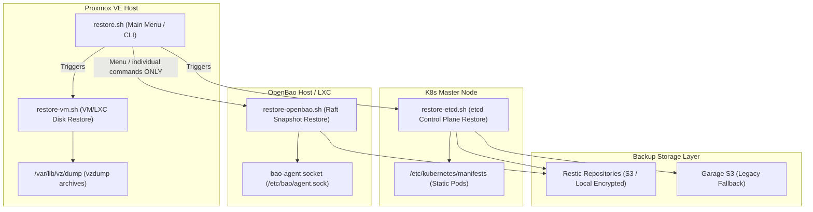
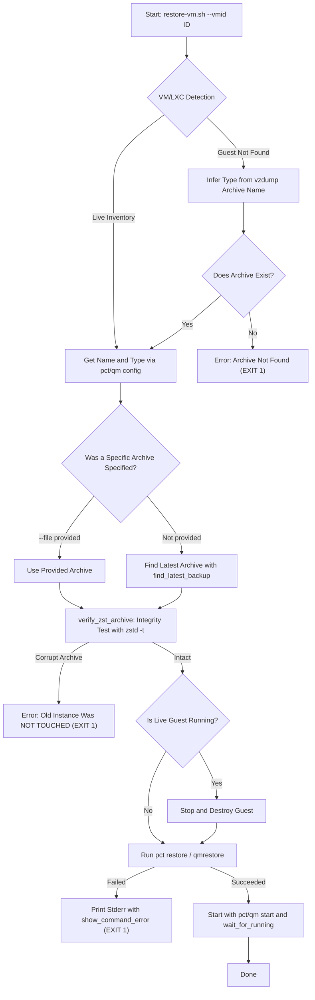
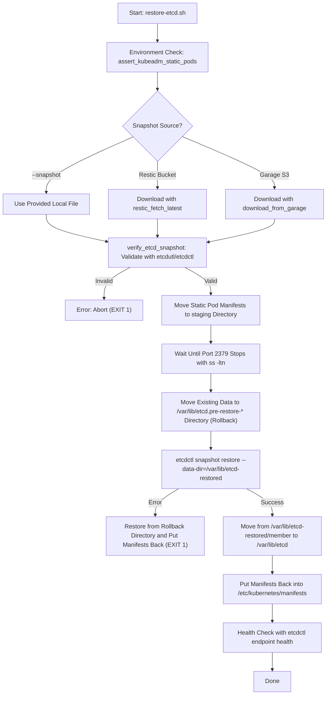
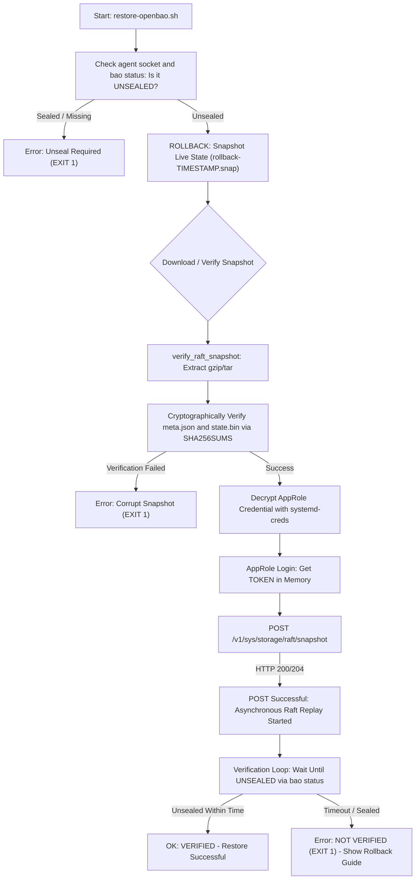

Aşağıda, belirttiğiniz düzeltmeleri uyguladığım güncellenmiş İngilizce sürüm yer alıyor.

---

# `restore.sh` — Recovery Infrastructure: Operational Logic and Architecture Documentation

This document covers the architecture, security principles, workflows, and usage details of the `maintenance/restore/` script group that forms the **Disaster Recovery** infrastructure of the `Cloud-in-Lab` project.

---

## 1. Overview and Architectural Principles

The recovery infrastructure is designed to bring the system back to a running state during a disaster with minimal data loss and zero ambiguity.

### Distribution Across Runtime Environments

Recovery scripts are run on the relevant nodes according to privilege and configuration requirements:



> ⚠️ **`restore.sh all` does NOT include raft.** The arrow `R_MAIN → R_BAO`
> above only indicates that it can be selected **individually from the menu**.
> The `all` command only recovers the VMID list with `restore-vm.sh`, then runs
> `restore-etcd.sh`. This is a deliberate design decision: raft restore is an
> irreversible data operation, and disk restore already rolls the data back to
> an earlier state. Raft restore is **always run as a separate command**
> (`restore.sh raft …`).

### Core Principles

1. **Fail-Closed:** If a validation or dependency check cannot be performed, the operation is not assumed *"successful"* or *"valid"*; it stops immediately (`exit 1`).
2. **Validation Before Destructive Operations:** Before any destructive step deletes or stops old live data, the integrity of the backup file to be restored (zstd, tar, sha256sum) and the suitability of the environment are verified.
3. **Automatic Rollback Point:** For `etcd` and `OpenBao Raft` restores, the current state of the live data is copied to a rollback point immediately before the operation begins.
4. **Credential Security:** Passwords and tokens are not hardcoded and are not stored in plaintext on disk. They are decrypted in memory using `systemd-creds` (AES256-GCM).

---

## 2. Script-by-Script Flow and Operational Details

### 2.1. `restore.sh` (Central Management and Router)

Provides a single point of execution for all recovery operations via an interactive menu or CLI commands.

* **Runs On:** Proxmox VE Host (with root privileges)
* **Usage Patterns:**
  ```bash
  ./restore.sh                              # Starts the interactive menu
  ./restore.sh list                         # Lists available Proxmox local and S3 backups
  ./restore.sh health                       # Checks backup freshness status
  ./restore.sh vm <VMID> [--yes]            # Restores the specified VMID (LXC/VM) disk
  ./restore.sh etcd [--yes]                 # Restores the etcd snapshot
  ./restore.sh raft [--dry-run] [--yes]     # Restores the OpenBao Raft snapshot
  ./restore.sh all [<VMID_1> <VMID_2> ...]  # Restores VM/LXC disks and etcd in order
                                       #     (raft is NOT included — deliberate, see §1)
  ```

#### How It Works:
1. When `list` is called, it lists all `vzdump-*.tar.zst` files under `/var/lib/vz/dump` and shows the latest `etcd` / `openbao` objects on Garage S3.
   > **Ordering note:** The `list` output is generated **not by date but by the lexicographic order of the filename** (`find … | sort`). The only functions that parse the timestamp and choose the newest are `find_latest_backup` and `find_garage_latest` in `restore-vm.sh` / `restore-etcd.sh`; those two parse the `YYYYMMDD-HHMMSS` timestamp.
2. In the `vm` subcommand, it takes the VMID passed in or entered from the menu and calls the `restore-vm.sh` script.
3. In the `all` command, it restores the default or argument-provided VMID list in order with `restore-vm.sh --yes`, then runs `restore-etcd.sh --yes`. **raft restore is not run in this command.**

---

### 2.2. `restore-vm.sh` (VM and LXC Disk Image Recovery)

Recovers an LXC container or QEMU virtual machine on Proxmox using vzdump archives.

* **Runs On:** Proxmox VE Host
* **Usage:**
  ```bash
  ./restore-vm.sh --vmid <ID> [--file <archive_path>] [--archive <archive_path>] [--storage <storage_name>] [--yes]
  ```

#### Flowchart:



> **Weak link in the flow:** In the diagram, the transition between `L`
> (`Stop and Destroy Guest`) and `N` (`pct restore` / `qmrestore`) **is a point
> of no return**. `verify_zst_archive` only verifies archive integrity before
> `N`; if `N` itself fails, the live disk destroyed by `L` does not come back.
> For a detailed explanation and mitigations, see the "Important Safety Step"
> box below.

#### Important Safety Step:
Before the old live guest (`pct destroy` / `qm destroy`) is **deleted**, the `.tar.zst` archive is tested with `zstd -t`. If the archive is corrupt, the live guest is not touched at all and the operation stops. If the tool (`zstd`) is missing, validation still **fails closed**.

> ⚠️ **Residual risk — simultaneous loss of live data and backup (a consciously accepted limitation).**
>
> `verify_zst_archive` only proves that *the archive is not corrupt*; it does
> not prove that the restore **will succeed**. The flow deletes the live guest
> with `pct destroy` / `qm destroy` and **then** runs `pct restore` /
> `qmrestore`. Even if the archive is flawless, if the restore fails (VMID
> conflict, storage full, host interruption, unexpected disk error), **the old
> live disk and the backup are lost at the same time.**
>
> This is Proxmox's natural restore behavior and cannot be remedied within the
> script — `zstd -t` only means "the archive is readable," not "the disk will
> come back." Therefore, Principle 2 of §2.1 ("Validation Before Destructive
> Operations") **is not a complete guarantee for this step.**
>
> **To reduce the risk, the operator should:**
> 1. Verify sufficient free space on the target storage before restore.
> 2. Preferably use a **different VMID** (`--vmid 390`) — in that case, a new
>    guest can be set up alongside the old one without destroying the old guest.
> 3. If you must use the same VMID, keep a **copy of the `vzdump` output outside
>    PVE** immediately before the operation.
> 4. For extremely critical data, first do a trial run with `--dry-run`/`--archive`.

---

### 2.3. `restore-etcd.sh` (Kubernetes Control Plane Recovery)

Restores the Kubernetes cluster's state data from an `etcd` snapshot.

* **Runs On:** K8s Master Node
* **Usage:**
   ```bash
   ./restore-etcd.sh [--tier daily|weekly|monthly] [--bucket <repo_bucket>] [--snapshot <file>] [--snapshot-id <id>] [--creds <garage_creds_file>] [--yes]
   ```

#### Pure Kubeadm Static Pod Management:

Since the project uses a **pure kubeadm** infrastructure, `etcd`, `kube-apiserver`, `kube-controller-manager`, and `kube-scheduler` are not systemd units; they are **static pods** managed by `kubelet`.

> ⚠️ **Hardcoded cluster identity (silent assumption).** `restore-etcd.sh`
> passes the cluster identity as arguments in the `etcdctl snapshot restore`
> call, and these values are fixed in the script:
>
> | Argument | Fixed value |
> |---|---|
> | `--name` | `master` |
> | `--initial-cluster` | `master=https://127.0.0.1:2380` |
> | `--initial-cluster-token` | `etcd-cluster` |
>
> The snapshot being restored **must match this identity.** On a cluster
> installed with a different `--node-name`/`--cluster-name`, the restore
> produces an **unusable** member record even if etcd looks "healthy." These
> values are a kubeadm installation contract (`kubeadm config` /
> cluster-configuration), so if these values do not match the cluster
> configuration, the restore is technically successful but practically broken.
>
> Before restoring, compare against the actual identity of the running cluster:
> ```bash
> grep -h 'name:\|initial-cluster' /etc/kubernetes/manifests/etcd.yaml
> ```
> If they differ, these three values in `restore-etcd.sh` must be updated to match.



---

### 2.4. `restore-openbao.sh` (OpenBao Raft Snapshot Recovery)

Restores the Raft database of the OpenBao (Vault fork) secret store to the snapshot point.

* **Runs On:** OpenBao LXC Container (CT 301)
* **Required files (manual restore in `--snapshot` mode):**
  - `/etc/bao/snap-bao-raft-restore-roleid`
  - `/etc/bao/snap-bao-raft-restore-secretid`
  These AppRole credential files are used by the agent for the `bao-raft-restore`
  role and are loaded into memory throughout the operation.
* **Usage:**
   ```bash
   ./restore-openbao.sh [--tier daily|weekly|monthly] [--snapshot <file>] [--snapshot-id <id>] [--bucket <repo_bucket>] [--creds <garage_creds_file>] [--force] [--yes] [--dry-run]
   ```

#### Cryptographic Verification and Asynchronous Replay Tracking:



---

## 3. Credential and Security Infrastructure

Recovery scripts fully comply with security standards when accessing encrypted backup repositories or performing API logins:

1. **`systemd-creds_decrypt`:**
   - Encrypted credential files (`/etc/tofu-lar/backup/<job>.secrets.conf`) are decrypted in memory using the machine-specific AES256-GCM key via the `systemd-creds decrypt` command.
   - No password is ever written to disk or temporary memory files in plaintext.
2. **Temporary Token Management:**
   - The `client_token` obtained after OpenBao AppRole login is kept only in process memory and is cleared upon completion.

---

## 4. Troubleshooting and Disaster Recovery (Rollback)

If an unexpected error occurs during recovery operations, the following steps are followed to protect live data:

### A. etcd Rollback
If etcd does not start after `restore-etcd.sh` reinstates the manifests:
1. Identify the automatically created rollback directory: `ls -d /var/lib/etcd.pre-restore-*`
2. Delete the corrupted `/var/lib/etcd` and move the pre-restore directory back:
   ```bash
   rm -rf /var/lib/etcd
   mv /var/lib/etcd.pre-restore-<timestamp> /var/lib/etcd
   ```
3. Move control plane manifests back from staging:
   ```bash
   mv /etc/kubernetes/manifests-disabled/* /etc/kubernetes/manifests/
   ```

### B. OpenBao Raft Rollback
If OpenBao remains broken after `restore-openbao.sh` or data reverts to a state older than expected:
1. Find the rollback snapshot file automatically taken by the script (e.g. `/var/lib/bao-raft-snaps/rollback-20260930-142000.snap`).
2. Run the manual restore command:
   ```bash
   BAO_ADDR="unix:///etc/bao/agent.sock" bao operator raft snapshot restore /var/lib/bao-raft-snaps/rollback-<timestamp>.snap
   ```