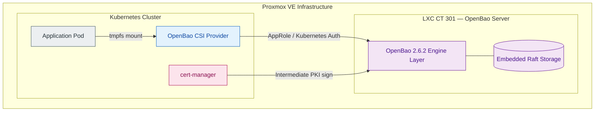
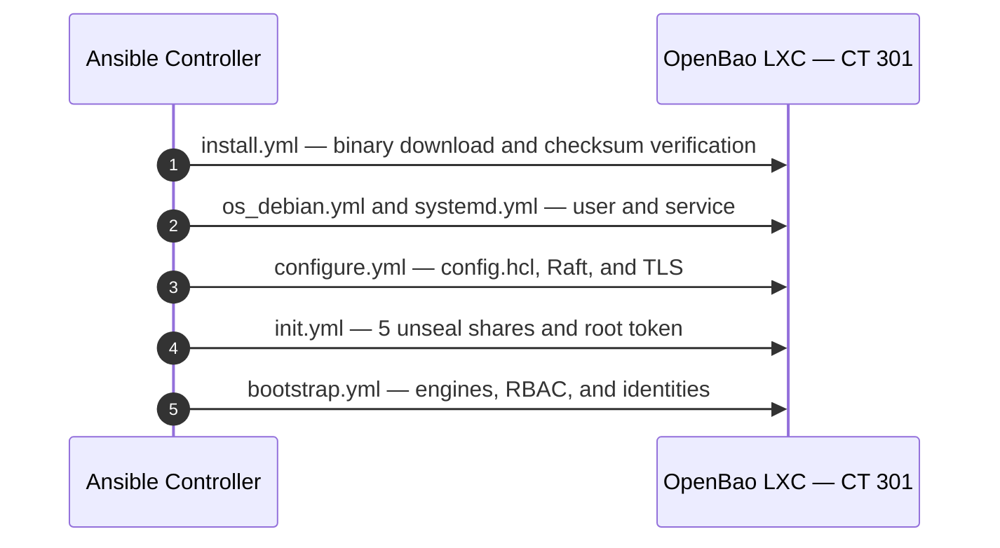
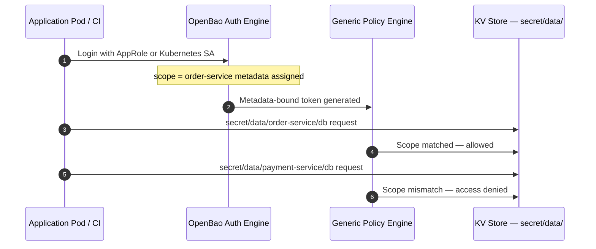
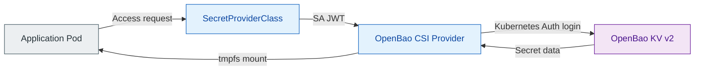
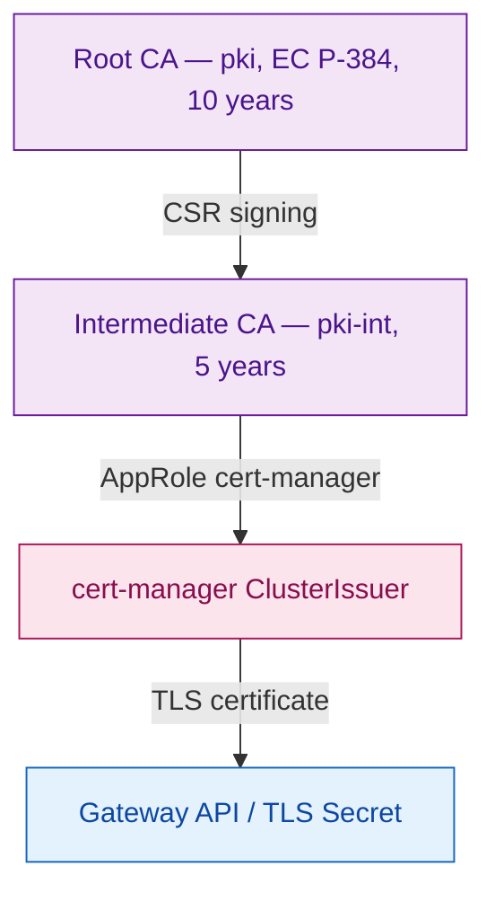
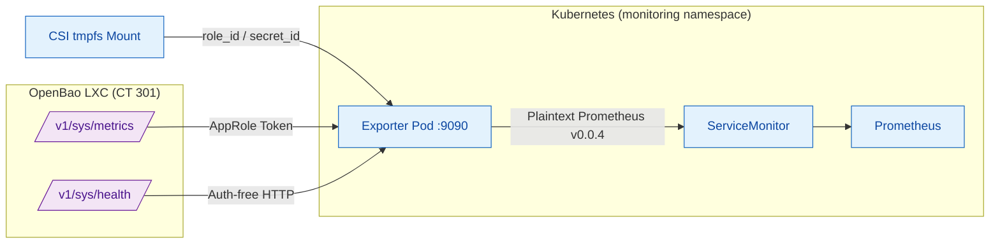

# OpenBao Infrastructure and Security Layer — In-Depth Architecture Guide

> This document presents the OpenBao component's place in the `Cloud-in-Lab` project — infrastructure setup processes, multi-engine architecture, generically templated policy model, service integrations, and Day-2 operations — in a technical framework.

<details>
<summary><strong>Contents</strong></summary>

  - [1. Summary and Architecture Purpose](#1-summary-and-architecture-purpose)
  - [2. OpenBao Engine Ecosystem](#2-openbao-engine-ecosystem)
  - [3. Installation and Infrastructure Automation](#3-installation-and-infrastructure-automation)
  - [4. Generic Templated Policies](#4-generic-templated-policies)
  - [5. Profile and RBAC Management](#5-profile-and-rbac-management)
  - [6. Application and Service Integrations](#6-application-and-service-integrations)
  - [7. Application Lifecycle](#7-application-lifecycle)
  - [8. DevSecOps Threat Model](#8-devsecops-threat-model)
  - [9. Operations and Maintenance](#9-operations-and-maintenance)
  - [10. Telemetry and Custom Exporter Architecture](#10-telemetry-and-custom-exporter-architecture)
  - [11. Versions, Limits, and Architectural Depth](#11-versions-limits-and-architectural-depth)
  - [12. Change Discipline](#12-change-discipline)
</details>

---

## 1. Summary and Architecture Purpose

### 1.1 Project Context and Design Principles

`Cloud-in-Lab` is an open-source platform engineering toolkit that repeatably and modularly delivers modern cloud-native architecture patterns — secret management, PKI, KMS, Kubernetes, Gateway API, and S3-compatible storage — on Proxmox infrastructure. It is designed to offer a cost-effective environment for development and test processes, light enough to run on a single Mini PC (about 15 GB total RAM on a dev install).

| Principle | Meaning | OpenBao integration |
|---|---|---|
| 100% declarative infrastructure | Every component and setting is code; no manual intervention, reproducible at any moment. | OpenBao binary version, mounts, policies, and roles are defined with Ansible roles. |
| Secure by Design | Security is not a patch added later; secrets are never kept in the repo and least privilege applies. | Secrets live centrally in OpenBao; no plaintext credentials in the Kubernetes etcd database. |
| Operations focus | Setup is 10% of the job; backup, verification, and restore procedures sit at the center of the architecture. | Raft snapshot backups, the unseal procedure, and the credential output contract are part of the automation. |
| Independent stack architecture | Each component has its own lifecycle and state file. | OpenBao lives in its own LXC, independent of Kubernetes; it stays up even if the cluster is destroyed. |

### 1.2 Why OpenBao?

OpenBao is preferred as the open-source continuation of the Vault project maintained under the MPL 2.0 license after its BSL license change. The deciding factors are its enterprise-grade PKI engine, dynamic secret management, and PKCS#11 hardware security module support with no licensing concerns and low resource consumption.

- **Resource usage:** Runs on roughly 256 MB RAM; fits homelab and test environments.
- **Cloud service equivalents:** The behavior of managed secret services, KMS, and private certificate authorities is simulated at local scale.
- **Environment-independent identity:** AppRole offers a common authentication pattern not only for Kubernetes pods but also for VMs and physical machines.

| Feature | Vault (BSL/Enterprise) | OpenBao (MPL) |
|---|---|---|
| PKI engine | Limited at the Enterprise tier | Open source, full access |
| Dynamic secrets | Limited engines | All engines open |
| HSM integration | Enterprise | Open source (PKCS#11) |
| AppRole auth | Open | Open |
| Minimum RAM | About 512 MB | About 256 MB |

### 1.3 Architecture Isolation Decision (ADR)

The OpenBao service is placed on Proxmox in a separate Ubuntu LXC container (`CT 301`), outside the Kubernetes cluster.

- Even if the Kubernetes cluster is compromised, the root certificate authority and the main secret store stay out of the attacker's hands; the blast radius shrinks.
- When Kubernetes is rebuilt from scratch, the secret infrastructure stays up; conversely, even if OpenBao is rebuilt, Kubernetes keeps its independent lifecycle.
- Recovery scenarios (unseal or root-token intervention) need no Kubernetes components.
- A single LXC node serves the development environment for resource efficiency. In exchange, the SPOF risk is accepted; automatic snapshots every 4 hours and 7-day retention are in place.



### 1.4 Core Problems Solved

| Problem | Solution with OpenBao | Data flow |
|---|---|---|
| Scattered secrets | Credentials live in a single source; pods mount secrets as tmpfs files, no copies land in etcd. | Pod → CSI Provider → OpenBao KV v2 |
| Manual certificate management | Two-tier internal CA plus cert-manager automation renews `*.tofu.lan` certificates. | cert-manager → Intermediate CA → Signed certificate → Gateway API |
| Scattered identity and encryption | Central AppRole identities, scope-based policies, and Transit KMS. | Application → Transit KMS → Encrypt/Decrypt/Datakey |

### 1.5 Cloud Service Equivalents and Maturity Matrix

This table summarizes the platform's services against their AWS/Azure/GCP counterparts, with active states and architectural limits. Details are in §11.3.

| OpenBao Component | AWS Equivalent | Azure Equivalent | GCP Equivalent | Project State | Architecture Note and Scope |
|---|---|---|---|---|---|
| **KV Engine (v2)** | Secrets Manager | Key Vault Secrets | Secret Manager | ✅ Active | App/NS-scoped isolated areas. With the K8s CSI Provider, data is mounted to pods as `tmpfs` (RAM) without touching the `etcd` database. |
| **PKI Engine (Private CA)** | ACM Private CA | Key Vault Certificates | Private CA | ✅ Active | Root (EC P-384, 10 years) + Intermediate (5 years; leaf certificates 90 days); signing authority on `pki-int/sign/*` paths. |
| **PKI Engine (K8s consumption)** | ACM + cert-manager | Key Vault + akv2k8s | CAS + cert-manager | ✅ Active | cert-manager 1.21.1 + AppRole Issuer: Gateway TLS (shared) and per-app dedicated certificates. Identities: `cert-manager` AppRole — S2 (signing, 1h/24h) + P2 `pki-manager` (role management, 15m/1h, `allow_any_name` forbidden). PEM; P12 not used, can be produced if needed. |
| **AppRole + Identity Engine** | IAM Machine Auth | Entra ID Workload Identity | Workload Identity Federation | ✅ Active | Machine identity verification with `O(1)` maintenance cost via metadata-based dynamic policy templating. |
| **Transit Engine** | KMS | Key Vault Keys | Cloud KMS | ✅ Active | Phase 2 envelope encryption verified live (`aes256-gcm96` plus local AES-GCM encryption on the application side, see §6.2). |
| **Telemetry & Custom Exporter** | CloudWatch | Azure Monitor | Cloud Monitoring | ✅ Active | Python stdlib custom exporter (3 independent loops), served to Prometheus/Alertmanager. The metric-gap blind spot at seal time is resolved with the `/v1/sys/health` HTTP 503 fallback mechanism (see §10). |
| **Audit Devices** | CloudTrail | Monitor Logs | Cloud Audit Logs | 🟡 Partially Active | Local `file` audit device active (SHA-256 HMAC). Central forwarding not done yet. |
| **Database Secrets Engine** | RDS Credential Rotation | Key Vault Auto-rotate | Cloud SQL Auth Proxy | 🟡 Infrastructure Ready | Engine mounted and policy templates ready; connection phase pending for dynamic user generation against a live database. |
| **Namespaces / Scoping** | AWS Organizations | Management Groups | Resource Manager | 🟡 Architecture ready, untested | The `app-`/`ns-` prefix split in policy templates is ready at schema and guard level; but the namespace-shared scenario is untested. Since the `app.name = namespace` practice suffices at project scale, no isolation need arose; the security claim holds only for the tested app scope. |


[↑ Back to top](#openbao-infrastructure-and-security-layer--in-depth-architecture-guide)

## 2. OpenBao Engine Ecosystem

[↑ Back to top](#openbao-infrastructure-and-security-layer--in-depth-architecture-guide)

OpenBao is not just a static password vault in this project; it is the multi-engine central security platform handling privacy, key management, PKI, and authentication processes.

| Engine | Mount path | Function | Integration |
|---|---|---|---|
| KV v2 | `secret/` | Versioned (max 10) static and dynamic secret storage. | CSI Driver → Pod tmpfs |
| Transit KMS | `transit/` | Application-level data encryption/decryption (envelope encryption). | Application SDK / Direct API |
| PKI Root CA | `pki/` | 10-year EC P-384 root certificate authority. | Intermediate CSR signing |
| PKI Intermediate | `pki-int/` | 5-year Intermediate CA; signs 90-day service/Gateway TLS certificates. | cert-manager ClusterIssuer |
| AppRole Auth | `auth/approle` | Role-based authentication for machines and CI/CD processes. | Ansible and deploy workflow |
| Kubernetes Auth | `auth/kubernetes` | Dynamic pod identity via ServiceAccount JWT verification. Verification runs through OpenBao's bridge to the Kubernetes TokenReview API, configured in `openbao-auth-reviewer.conf` (§6.1). | OpenBao CSI Provider |
| Audit Device | `sys/audit/file` | File-based recording of API requests with SHA-256 HMAC. | Audit log file |
| Raft Storage | `sys/storage/raft` | Embedded state and data storage engine. | Rootless snapshot via `bao agent` (§9.5) |

## 3. Installation and Infrastructure Automation

### 3.1 Installation Summary

| Parameter | Value |
|---|---|
| Location | LXC CT 301 (Ubuntu), outside Kubernetes |
| Version | OpenBao 2.6.2; checksum-verified binary |
| Storage | Embedded Raft, single node with snapshots every 4 hours |
| TLS | Self-signed server certificate (RSA 4096, IP SAN, 1 year) |
| Access address | `https://164.102.98.186:8200` |
| Service user | Reduced-privilege `bao` user and systemd service |
| Unseal | Shamir 5 shares / 3 threshold; keys not kept on the LXC, controller-only |

The division of labor is strict: OpenTofu only provisions the LXC container and generates the Ansible inventory file; Ansible performs all configuration. Ansible is never called from inside OpenTofu.

### 3.2 Ansible Installation and Init Flow



`init.yml` runs only on first install. Unseal keys and the root token are written to the `outputs/openbao/` directory on the controller machine with `0700/0600` permissions. If the server is already initialized but the credential file is missing, stale Raft data is cleaned and init is repeated.

### 3.3 Bootstrap Order and Root Token Discipline

1. The KV v2, AppRole, Transit, Database, PKI Root, PKI Intermediate, and Kubernetes auth engines are enabled.
2. The `k8s-app` policy is templated with the Kubernetes auth accessor ID.
3. AppRole policies and roles are created; CSI driver and cert-manager identities are generated.
4. The first static secrets are written to KV.
5. The PKI hierarchy is built: the Root CA is generated, the Intermediate CSR is created, signed by the Root, the certificate is imported into the Intermediate, and the signing role is defined.
6. Platform identities are generated: four platform roles (`ops-admin`, `pki-manager`, `pki-signer`, `monitor`); credential files are written for three of them (ops-admin, pki-manager, monitor) — the S2 `cert-manager` AppRole uses pki-signer's signing authority.
7. For workload RBAC, eight profiles, eight policies, eight roles, and a static `role_id` map are created.
[↑ Back to top](#openbao-infrastructure-and-security-layer--in-depth-architecture-guide)

8. The `openbao-mount.json` connection file is generated.

At the end of bootstrap, the root token is kept for break-glass only. Daily operations run under the `ops-admin` AppRole identity; this profile is granted no permission to enable engines or auth methods.

## 4. Generic Templated Policies

One of the architecture's critical capabilities is the use of identity templating. Even if 100 new applications are added, no new OpenBao policy file is needed; policy maintenance complexity stays flat at roughly `O(1)`.

### 4.1 Dynamic Scope Mapping

Scope is the application's namespace in OpenBao, derived from the application name: `ob_scope = app.name`. Permission fields are never hand-written; `identity.entity.aliases` template variables are used.

`workload-reader-templated.hcl.j2` example:

```hcl
path "auth/token/lookup-self" {
  capabilities = ["read"]
}

path "auth/token/renew-self" {
  capabilities = ["update"]
}

path "secret/data/{{identity.entity.aliases.<accessor>.metadata.scope}}/*" {
  capabilities = ["read"]
}

path "secret/metadata/{{identity.entity.aliases.<accessor>.metadata.scope}}/*" {
  capabilities = ["list", "read"]
}
```

The template value resolves from the token owner's identity metadata. For example, an `order-service` token can reach `secret/data/order-service/db` but not the `payment-service` path. On profiles using Transit, the key path is likewise locked to the `<scope>-*` pattern by the same mechanism.



### 4.2 Bidirectional Scope Binding

- **AppRole path:** `produce-workload-creds.yml` writes the `{"scope": "<app name>"}` metadata when generating a new `secret-id`. The policy template reads this value to constrain the path.
- **Kubernetes Auth path:** The ServiceAccount name of the pod entering via CSI is written to identity metadata. The `k8s-app` policy reads this value to lock the pod to only its own `<sa-name>-approle` path.

```hcl
path "secret/data/{{identity.entity.aliases.<accessor>.metadata.service_account_name}}-approle" {
  capabilities = ["read"]
}
```

Even with `bound_service_account_names` wildcard (`["*"]`) on the Kubernetes auth role, the entry gate is wide but the policy template is scoped. Wildcard binding plus templated policy together provide secure isolation.

### 4.3 OpenBao 2.6.2 Security Fixes
[↑ Back to top](#openbao-infrastructure-and-security-layer--in-depth-architecture-guide)


- Wildcards (`*`, `+`), path separators (`/`), PKI globs, and SSH commas are rejected by default in identity templates. Since project `scope` values derive from `app.name`, they contain none of these characters; the `allow_*_in_identity_templates` flags stay off.
- The LIST permission-bypass fix keeps wildcard grants from skipping deny rules on LIST operations. Critical prohibitions such as `sys/seal` and `sys/generate-root-token` can no longer be circumvented via listing.
- With OpenBao 2.6, `sys/generate-root-token` moved to authenticated endpoints; the unauthenticated variant was deprecated (see `master-design.md` §5).
- Internal operations abusing token generation from authentication flows have been blocked.

## 5. Profile and RBAC Management

The identity model splits into two layers — full catalog and W/P/S codes: [`openbao-rbac.md`](openbao-rbac.md) §3.

| Layer | Scope | Task area | Installation method | Trigger |
|---|---|---|---|---|
| Workload profiles (W1–W8) | 8 | OpenBao access for pods and applications | `rbac-workload.yml` (`ops-admin`) | Self-service on every app deploy |
| Platform and service identities (P1–P6, S1–S2) | 8 | Identities operating the system and consuming K8s infrastructure | `rbac-platform.yml` (root token, once) + `bootstrap.yml` (S) | Infrastructure setup |

### 5.1 Workload Profile Catalog

The `openbao_workload_profiles` list in `ansible/roles/openbao/security/defaults/main.yml` is the single source of truth. Policy templates, role definitions, token lifetimes, and the `role_id` map all derive from it.

| Profile | TTL / maximum | Renewable | Token type | Scope summary |
|---|---|---|---|---|
| `reader` | 1 hour / 24 hours | Yes | service | Reads its own scope. |
| `operator` | 1 hour / 24 hours | Yes | service | Reads, writes, and uses Transit within its own scope. |
| `job-run` | 30 minutes / 1 hour | No | batch | Short-lived jobs; reads and Transit use. |
| `transit-user` | 30 minutes / 1 hour | No | batch | Transit only; no KV access. |
| `deployer` | 15 minutes / 1 hour | No | batch | Write only; no reads, no Transit. |
| `kv-owner` | 1 hour / 8 hours | Yes | service | Full owner of its own prefix. |
| `db-consumer` | 1 hour / 24 hours | Yes | service | Reads dynamic database credentials; no KV access. |
| `metrics-reader` | 1 hour / 24 hours | Yes | service | Reads OpenBao health and metrics endpoints (`sys/health`, `sys/metrics`); no KV access. |

The "duration is part of authority" principle applies: a 15-minute token with write permission is not at the same risk level as a 24-hour token with read permission.

### 5.2 Policy Block Taxonomy

| Block | Permission | Using profiles |
|---|---|---|
| B0 | Looking up and renewing its own token | All profiles |
| B1 | KV read within scope | `reader`, `metrics-reader`, `operator`, `job-run` |
| B2 | KV write within scope | `operator`, `deployer` |
| B3 | KV lifecycle: delete, undelete, destroy | `kv-owner` |
| B4 | Transit: encrypt, decrypt, rewrap, datakey, and keys-read | `operator`, `job-run`, `transit-user` |
| B5 | Signing from PKI Intermediate: `pki-int/sign/*` — used by cert-manager | `pki-signer` |
| B6 | PKI role management: `pki-int/roles/dedicated-*` CRUD + `denied_parameters: allow_any_name` | `pki-manager` |
| B7 | Dynamic database credential read | `db-consumer` |
| B8 | Broad administration: KV/Transit/PKI/Database read-write; explicit deny on `sys/generate-root-token` and `sys/seal` | `ops-admin` |
| B9 | Wrapped secret-id generation: `secret-id → create,update` + mandatory wrapping TTL | `approle-issuer` |

### 5.3 Platform Roles (P)

| Profile | Token lifetime | Task |
|---|---|---|
| `pki-signer` | 1 hour / 24 hours | Signs from the Intermediate CA; holds narrow signing authority. |
| `pki-manager` | 15 minutes / 1 hour | Manages application certificate roles; `allow_any_name: true` is forbidden. |
| `monitor` | 1 hour / 24 hours | Read-only monitoring; KV and health status. |
| `ops-admin` | 4 hours / 8 hours | Day-to-day operations: KV, Transit, PKI, Database, and role management; explicit deny on `sys/seal` and `sys/generate-root-token`. |

[↑ Back to top](#openbao-infrastructure-and-security-layer--in-depth-architecture-guide)

Credentials are kept in 0600 files on the controller and never printed to Ansible output (`no_log`).

> This table summarizes the four main platform roles. Also: P5/P6 raft snapshot identities (see §9.5) and S1/S2 service identities (`cert-manager`, `k8s-csi`) — full catalog: [`openbao-rbac.md`](openbao-rbac.md) §3.

### 5.4 Renewal Discipline

`renew-self` appears only in the policies of renewable identities: `reader`, `metrics-reader`, `operator`, `kv-owner`, and platform profiles. `job-run`, `transit-user`, `deployer`, and `db-consumer` are batch tokens; once expired they cannot be renewed.

## 6. Application and Service Integrations

### 6.1 CSI Driver and etcd Isolation



CSI rules:

- No `secretObjects` sync; no Kubernetes Secret objects are produced and data is never written to etcd.
- Address and TLS settings are not hardcoded in the SecretProviderClass; the address comes from Helm chart config, CA trust from the `openbao-ca-tls` Secret.
- The provider name is fixed as `openbao`; the role name is written explicitly in the SPC.
- Secret rotation is on, sync is off.
- The Helm chart is installed with `server.enabled=false`, `injector.enabled=false`, `csi.enabled=true`. No second OpenBao server is installed inside the cluster.

#### TokenReview bridge (`openbao-auth-reviewer.conf`)

The "Kubernetes Auth login" step above requires OpenBao to call TokenReview on the apiserver, because OpenBao cannot validate the presented SA JWT on its own. In this call, OpenBao exercises authentication authority through a **reviewer ServiceAccount**:

- **What it does:** The `kube-system/openbao-auth-reviewer` SA (`system:auth-delegator`; `cluster_wide=true` is mandatory since `tokenreviews` is cluster-scoped) grants OpenBao only this call; the SA has no other cluster privileges. The reviewer kubeconfig is generated idempotently on every run by the `openbao-ops` role, and the JWT read from it is written to `auth/kubernetes/config` as **`token_reviewer_jwt`** (`no_log`).
- **Why it exists:** Without this bridge, SA-JWT login to the `k8s-csi-provider` role is **impossible**; the entire workload credential flow over CSI stops as a result (SPC mount, AppRole `role_id`/`secret_id` reads, transit-envelope workflow). The corresponding fail task stops the playbook with an explicit message when the conf is missing (never silently); with missing `tokenreviews` RBAC, verification returns 403 and auth may fail silently — hence the conf and the ClusterRoleBinding are read together.
- **File:** `ansible/outputs/k8s/openbao-auth-reviewer.conf` — it contains the SA JWT, so it is secret and `ansible/outputs/` is gitignored. To regenerate manually: `ansible-playbook playbooks/gen-kubeconfig.yml -e cluster_role=system:auth-delegator -e namespace=kube-system -e sa_name=openbao-auth-reviewer -e cluster_wide=true`. The gen-kubeconfig engine's built-in role + openbao-ops auto-include mechanism: [`docs/en/kubernetes/rbac.md`](../kubernetes/rbac.md) §8.2.1.

### 6.2 Transit Engine and Envelope Encryption

The Transit engine serves as the central KMS for applications encrypting data locally.

- Key names follow `<scope>-<openbao_key>`; example: `transit-envelope-demo-app-key`.
- The algorithm is configured as `aes256-gcm96`.
- Keys are not exportable (`exportable: false`).
- The application requests a datakey from Transit, encrypts data locally, and verifies the result by having Transit decrypt the ciphertext. The key is never handed to the application.

#### Live verification (2026-09-16, Job: `transit-envelope-b`)

Phase A proves KMS reachability; phase B proves encryption without exposing data to the KMS:

- **A (server-side round-trip):** login → `encrypt` → `decrypt`, round-trip matched.
- **B (envelope):** fresh DEK fetched via `datakey/plaintext bits:256` → payload encrypted locally with AES-256-GCM → plaintext DEK dropped → locked DEK decrypted by Transit and payload verified locally.

```text
Collecting cryptography==50.0.1
  Downloading cryptography-50.0.1-cp311-abi3-manylinux_2_34_x86_64.whl.metadata (4.3 kB)
Collecting cffi>=2.0.0 (from cryptography==50.0.1)
  Downloading cffi-2.1.1-cp313-cp313-manylinux2014_x86_64.manylinux_2_17_x86_64.whl.metadata (2.5 kB)
Collecting pycparser (from cffi>=2.0.0->cryptography==50.0.1)
  Downloading pycparser-3.0-py3-none-any.whl.metadata (8.2 kB)
Downloading cryptography-50.0.1-cp311-abi3-manylinux_2_34_x86_64.whl (4.7 MB)
   ━━━━━━━━━━━━━━━━━━━━━━━━━━━━━━━━━━━━━━━━ 4.7/4.7 MB 26.6 MB/s  0:00:00
Downloading cffi-2.1.1-cp313-cp313-manylinux2014_x86_64.manylinux_2_17_x86_64.whl (221 kB)
Downloading pycparser-3.0-py3-none-any.whl (48 kB)
Installing collected packages: pycparser, cffi, cryptography

Successfully installed cffi-2.1.1 cryptography-50.0.1 pycparser-3.0
WARNING: Running pip as the 'root' user can result in broken permissions and conflicting behaviour with the system package manager, possibly rendering your system unusable. It is recommended to use a virtual environment instead: https://pip.pypa.io/warnings/venv. Use the --root-user-action option if you know what you are doing and want to suppress this warning.
TLS: verify kapali (demo + self-signed; prod icin CA_BUNDLE_PATH set edin)
A: login OK
A: encrypt OK
A: decrypt OK round-trip eslesti
B: encrypt OK wrapped=vault:v1:48gBs+pTq6yLjIoI8qjaGX667gPGFgIxnod3A8ie5BuW+DtEuAcGVW6pYITdU1A3G9ynZwuTfWMTcriX
B: nonce=487ef9cdaa8acc3b4b07d1c6 ct_sha256=e8df5ce3bbeda290d39070cab1154c170c831de610ba20a608cdfd461edfcd28
B: decrypt OK round-trip eslesti
ENVELOPE PASS
```

Pin: `cryptography==50.0.1`, image `python:3.13-slim@sha256:ed86…`.

**Transit envelope engine and operation tests (2026-09-16, live; full procedure is in Chapter 1 of `docs/en/openbao/openbao-tests.md` — Chapter 2 of the same document covers raft snapshot agent tests):**

| Test | Result |
|---|---|
| Negative 403 (decrypt without token) | ✅ `permission denied`, HTTP 403 |
| No plaintext in audit | ✅ `transit-demo-B-envelope` count is 0; secret fields are HMAC'd (bonus: `scope` + batch TTL match the catalog exactly) |
| Rotate | ✅ HTTP 200, `latest_version: 2`, old wrapped key resolved (44) |
| Second-run idempotency | ⏳ pending |

### 6.3 PKI Hierarchy and cert-manager



- The Root CA (`pki/`) is created with EC P-384 for 10 years; the `pki-int/` mount is signed via CSR.
- The root key is never directly exposed to signing requests.
- cert-manager requests certificates from `pki-int/sign/tofu-lan` with its AppRole identity.
- The Intermediate CA signs the 90-day certificate and cert-manager writes it to the `gateway-tls` Secret.
- The `openbao-ca-tls` Secret validates the OpenBao server's TLS identity; the PKI Root CA is the root of the generated certificate chain. These two CAs are not used for the same purpose.

### 6.4 Network Access: Self-Service Egress Label

```yaml
templateLabels:
  homelab.io/allow-openbao-egress: "true"
```

The cluster-wide Cilium policy selects this label to allow egress only to the OpenBao server's IP (`<openbao_host>/32`, TCP 8200).

### 6.5 Trusting the Root CA

```bash
curl -sk https://164.102.98.186:8200/v1/pki/ca/pem -o tofu-lan-ca.crt
sudo cp tofu-lan-ca.crt /usr/local/share/ca-certificates/
sudo update-ca-certificates
```

Verification:

```bash
curl -s https://164.102.98.186:8200/v1/sys/health
```

[↑ Back to top](#openbao-infrastructure-and-security-layer--in-depth-architecture-guide)

> Note: Since browsers use DoH, they may bypass `/etc/hosts`; running tests with `curl` is recommended.

Adding this line to `/etc/hosts` enables `bao.lan` resolution:

```bash
echo '164.102.98.186 bao.lan' | sudo tee -a /etc/hosts
```

Optionally, the Root CA certificate can also be copied to the local controller machine so tools such as browsers and kubectl trust the OpenBao server; this is not mandatory but simplifies HTTPS testing.

## 7. Application Lifecycle

### 7.1 Bootstrap vs App Deploy

| Parameter | Bootstrap (once) | App deploy (per application) |
|---|---|---|
| Identity used | Root token → `ops-admin` | `ops-admin` token |
| Operation | Engine, policy, and role creation | Credential generation, KV writes, Transit key creation, SPC setup |
| Output | `profile-role-ids.json`, platform credentials, connection file | `<scope>-approle.json`, KV entry, SecretProviderClass |
| Re-run | Idempotent; existing resources are skipped | New scope per application |

### 7.2 Deploy Steps

`openbao-workflow.yml` follows this flow:

1. `ob_scope` is computed as `app.name`.
2. If `<scope>-approle` exists in KV, the deploy stops; overwriting is blocked.
3. `role_id` is read from `profile-role-ids.json` and a new scope-metadata `secret-id` is generated.
4. The credential is written to the controller file and to OpenBao KV (`secret/<scope>-approle`).
5. If needed, a Transit key named `<scope>-<openbao_key>` is created.
[↑ Back to top](#openbao-infrastructure-and-security-layer--in-depth-architecture-guide)

6. The credential is read to generate the SecretProviderClass.

> Note: `scope_level: namespace` is supported. Since `app.name = namespace` is the common usage, this is considered sufficient; it can be applied if desired. For details see [`docs/en/openbao/openbao-rbac.md`](openbao-rbac.md) §4.

### 7.3 Removal Discipline

- Before deletion, the resource is verified with `get`; `--ignore-not-found` is not used.
- Shared resources — profile roles, policies, engine mounts, the Transit mount, and the Gateway certificate — are never deleted.
- When a role is deleted, its `secret-id`s are cleaned; existing tokens expire when their TTL runs out.
- Deletion is guarded if another application shares the same identity.
- The `app-remove` playbook runs the `delete-openbao-approle.yml` task to clean orphaned AppRoles; deletion is guarded (nothing is deleted while another application shares the same identity).

## 8. DevSecOps Threat Model

[↑ Back to top](#openbao-infrastructure-and-security-layer--in-depth-architecture-guide)

| Layer | Threat | Control | If a layer falls |
|---|---|---|---|
| Physical / placement | Kubernetes cluster compromise | OpenBao on a separate LXC | Secret store and root CA stay protected. |
| Identity lifetime | Token theft | Short TTLs and non-renewable batch tokens | Tokens invalidate within minutes. |
| Permission scope | Reading a neighbor app's data | Templated policy and scope metadata | Tokens are valid only under their own prefix. |
| Template injection | Widening permissions by injecting wildcards | Secure defaults and safe character set | Requests are rejected. |
| Excessive privilege | Enabling engines with the daily identity | No create for `ops-admin`; mount creation stays with root | No new trust root can be created. |
| Root token | Root token leak | Break-glass storage and exclusion from daily use | Standalone root generation cannot be triggered. |
| Seal keys | Restart or key leak | Shamir 3-of-5; keys not on the LXC | A single key is not enough. |
| Network | Data exfiltration from pods | Cilium default-deny and label-gated egress | Only a narrow corridor to TCP 8200 exists. |
| Data at rest | etcd or Git leak | Secrets kept out of etcd and the repo | No copy left to leak. |
| Cryptography | Key theft | Transit keys are not exportable | Keys cannot leave the server. |
| Certificates | Intermediate CA compromise | Offline-root logic for the root key | Recovery without harming the root. |
| Observability | Unauthorized monitoring | Read-only `monitor` and audit log | Write path is closed. |

## 9. Operations and Maintenance

### 9.1 Output Contract

| File | Content | Permission | Producing step |
|---|---|---:|---|
| `openbao-credentials.yml` | Root token and unseal keys | `0600` | init |
| `openbao-unseal-keys.txt` | Unseal summary | `0600` | init |
| `openbao-config.json` | Server address and version | `0600` | init |
| `openbao-mount.json` | Mount names and address bridge | `0600` | bootstrap |
| `profile-role-ids.json` | Static `role_id` map of the eight workload profiles | `0644` | workload RBAC |
| `ops-admin.json`, `pki-manager.json`, `monitor.json` | Platform credentials | `0600` | platform RBAC |
| `<scope>-approle.json` | Application credential (`role_id` + `secret_id`) | `0600` | app deploy |

### 9.2 File Map

```text
ansible/roles/openbao/
├── server/
│   ├── tasks/ (main, install, os_debian, systemd, configure, init, bootstrap, backup)
│   └── defaults/main.yml            # Version, Raft path, TLS, unseal, and backup cron
├── security/
│   ├── defaults/main.yml            # Single source: mounts, platform RBAC, workload profiles
│   ├── tasks/rbac-platform.yml      # Platform policies, roles, and credentials
│   ├── tasks/rbac-workload.yml      # Workload policies, roles, and role_id map
│   └── templates/                   # k8s-app and workload policy templates
ansible/roles/k8s/openbao-ops/tasks/main.yml
                                      # openbao-auth-reviewer.conf (TokenReview bridge, §6.1),
                                      # K8s auth config/role, CSI and cert-manager secrets
ansible/roles/k8s/csi/tasks/main.yml
                                      # CSI driver, provider chart, CA pin, and agent override
ansible/roles/k8s/security/templates/cilium-allow-openbao-egress.yaml.j2
                                      # Self-service egress CCNP
ansible/roles/k8s-apps/app-deploy/tasks/
├── openbao-workflow.yml              # Scope, conflict check, and orchestration
├── produce-workload-creds.yml        # secret-id generation and KV writes
├── produce-transit-key.yml           # Check-then-create Transit key
└── read-workload-creds.yml           # Credential reads and SPC generation
ansible/roles/k8s-apps/app-remove/tasks/delete-openbao-approle.yml
                                      # Guarded cleanup
```

### 9.3 Installation, Verification, and Destruction

```bash
# Install
cd tofu && ./deploy.sh dev openbao
cd ../ansible && ansible-playbook -i inventory/openbao.ini.generated playbooks/openbao.yml

# Verify: health and seal status
curl -sk https://164.102.98.186:8200/v1/sys/health | jq .initialized,.sealed

# Destroy: protection flag deliberately requested off
cd tofu/stacks/openbao
tofu destroy -var-file=../../environments/dev/common.tfvars \
  -var-file=../../environments/dev/openbao.tfvars \
  -var="protection=false"
```

### 9.4 Unseal Discipline

OpenBao is sealed with a Shamir 3-of-5 share threshold: `-key-shares=5 -key-threshold=3`. Unseal keys are not kept inside the LXC; they live only in `outputs/openbao/openbao-credentials.yml` and `scripts/openbao-unseal/credentials.txt` on the controller, with `0600` permissions.

- During setup, `init.yml` uses the unseal key as a CLI argument.
- When sealed, `ensure_ready.yml` PUTs a JSON body to `/v1/sys/unseal`; the key stays out of argv.
- `scripts/openbao-unseal/unseal.sh` POSTs a JSON body to the same API.
- When `bao operator unseal` is called without arguments, the key is read secretly from stdin.
- `no_log: true` keeps keys out of Ansible logs.

The detailed setup guide and SoftHSM2 configuration for auto-unseal live in `extra-samples/openbao-auto-unseal/autounseal-setup-guide.md`.

Software auto-unseal (Vault/OpenBao's own mechanism) is planned but not implemented — it only moves where the key is stored without adding real security. Hence manual unseal with the Shamir 3-of-5 threshold.

### 9.5 Backup and Restore

| Layer | Content | Frequency | Retention | Tool |
|---|---|---|---|---|
| VM disk backup | LXC disk image | Weekly (PVE host cron) | PVE local; flat 28 days + weekly 3 / monthly 3 | `maintenance/backup/vm-disk/backup-full.sh --vmid <openbao-vmid>` |
| Raft snapshot (local) | In-OpenBao data | Every 4 hours · weekly Sunday 04:00 · monthly 1st 04:30 | 7 days | `backup-openbao.sh` (systemd timer) |
| Raft snapshot (remote) | Snapshot → Garage2 (S3) | Same three timers | `keep-last 3` per bucket | `restic` → `openbao-{daily,weekly,monthly}` |

> **CT IDs are specific to each installation.** If the OpenBao LXC identity
> is not given in the environment file, Proxmox auto-assigns; the `CT 301`
> in this document is an example. For details see `docs/en/maintenance/maintenance.md` §2.

**Raft snapshots use no root token.** `bao agent` takes the snapshot: the service
(`bao-raft-agent`, `User=bao`) logs in via AppRole `auto_auth`, serves the token
over the `/etc/bao/agent.sock` unix listener, and the script connects to that socket
with `BAO_ADDR=unix://…`. Identity and permission details: `openbao-rbac.md` §3
(B10/B11, P5/P6).

Two-way rule:

- **The agent profile is read-only** (B10 → `sys/storage/raft/snapshot: read`). A service
  exposed 24/7 has no write-back permission on the raft store.
- **Restore runs under a separate profile** (B11 → `snapshot-force: update`), only
  by `restore-openbao.sh`, triggered manually.

`backup-openbao.sh` first writes the snapshot to a separate, persistent directory
(`/var/lib/bao-raft-snaps`) apart from the raft store and keeps a 7-day local copy,
then ships it to three separate buckets on Garage2 via restic. A restic failure never deletes the local copy.

Restore:

```bash
maintenance/restore/restore.sh list          # List available backups
maintenance/restore/restore.sh raft          # Restore raft snapshot (B11)
maintenance/restore/restore.sh vm 301        # Recover the OpenBao LXC
maintenance/restore/restore.sh vm 301 --yes  # Unattended recovery
[↑ Back to top](#openbao-infrastructure-and-security-layer--in-depth-architecture-guide)

maintenance/restore/restore.sh all           # Recover everything — last resort
```

Restore with `raft` is for the "CT healthy, raft broken" scenario; it first snapshots
current raft state as a rollback, then downloads the snapshot from the bucket selected
with `--tier daily|weekly|monthly` and loads it after verification. Without `--tier`,
the newest snapshot is picked.

The `all` flow does not call raft separately: since `restore-vm.sh --vmid 301` restores
the entire OpenBao LXC from disk, `/var/lib/bao/raft` already returns to its old state.
The flow is `300 → 301 → etcd`; an extra raft step would be meaningless
and contradictory.

Unseal keys are not kept on the same channel as backup data: keys live
on the controller, backups on Garage2.

## 10. Telemetry and Custom Exporter Architecture

The OpenBao server's health, performance metrics, and security events are monitored platform-wide with Prometheus and Alertmanager. The architecture opts for a project-specific exporter.

### 10.1 Telemetry Configuration and Pattern Choice

Monitoring data is produced on the OpenBao side via the `openbao.telemetry` stanza. Configuration is managed declaratively through `group_vars/all/all.yml` and conditionally rendered in the `bao-config.hcl.j2` template; when the flag is off, the stanza is never written to HCL (zero resource consumption while off).

```yaml
openbao:
  telemetry:
    enabled: true
    prometheus_retention_time: "30s"
    disable_hostname: true
```

Since OpenBao has no official Kubernetes "operator" component, three paths were evaluated for the monitoring pattern:

1. **Static/rotating token + ServiceMonitor (rejected):** This setup, supported by the official Helm chart, is designed for OpenBao running *inside* Kubernetes. Replicating it on the LXC install is impractical — it would load token renewal, a runtime job, onto Ansible, a deploy-time tool.
2. **Vault Agent + consul-template sidecar (rejected):** A heavy pattern requiring Agent Injector webhook infrastructure; overkill at project scale.
3. **Custom exporter with self-service token management (accepted):** The pattern that puts token renewal on the exporter itself, not on external tools. The exporter script splits into three independent work loops (TokenState / HealthState / MetricsCache) inside `openbao-metrics-exporter.py`; see §10.2.

This choice preserves the "runtime jobs stay at runtime" boundary and reuses the existing self-service credential flow (CSI/tmpfs, `renewable` workload profile) without adding a new mechanism.

### 10.2 Exporter Architecture and Resilience Logic

The exporter is a standalone Deployment written in Python standard library only (`stdlib-only`) to zero out software supply-chain risk; it has no external dependencies and no image-download requirement.



The exporter script splits into three independently running work loops:

* **TokenState loop:** Logs in with the AppRole identity. At 70% of token lifetime the token auto-renews via `auth/token/renew-self`; on renewal failure it re-logs in. This loop never stops even when OpenBao is sealed — it just waits and retries.
* **HealthState loop:** Polls the auth-free `/v1/sys/health` endpoint in a separate loop. Even with the server sealed, it keeps producing `openbao_sealed`, `openbao_up`, `openbao_initialized`, and `openbao_standby` metrics without interruption.
* **MetricsCache loop:** Caches `sys/metrics` content on a best-effort basis; even when no data arrives, the exporter returns HTTP 200 and keeps serving health/custom metrics.

Deriving seal state from the health endpoint is motivated by a flaw observed live:

OpenBao's default `vault_core_unsealed` metric drops from the buffer once `prometheus_retention_time` expires after sealing, so the seal alert never fires. In other words, no alarm is produced even at the moment of sealing — the system is down but monitoring never learns it. The `sys/metrics` endpoint also serves no data while sealed; when OpenBao is sealed, all Prometheus metrics stop.

By contrast, `/v1/sys/health` answers with HTTP 503 without auth, even while sealed. It is one of OpenBao's most resilient endpoints: process down (500), sealed (503) — it always answers. Hence the seal signal is derived from this endpoint — the exporter polls health every 10 seconds, produces the `openbao_sealed=1` metric on a 503, and Prometheus fires the alert. Alternatively `sys/health` could have been read with a static token, but that would have raised the token-renewal problem (a runtime job). The health endpoint is preferred because it needs no auth and answers in every state.

### 10.3 App-Deploy Orchestration and Integration

The exporter is deployed not as a special case, but through the project's standard `k8s_apps.yml` declarative engine:

```yaml
- name: openbao-metrics-exporter
  enable: true
  namespace: monitoring
  image: python:3.11-slim-bookworm
  container_port: 9090
  port: 9090
  expose: false
  openbao:
    enable: true
    profile: metrics-reader
  labels:
    homelab.io/allow-openbao-egress: "true"
  monitoring:
    serviceMonitor:
      enabled: true
      port: 9090
      path: /metrics
      interval: 30s
      scrapeTimeout: 10s
```

From this single input, the orchestration engine auto-derives the Deployment, Service, ServiceMonitor, Cilium egress permission, and SecretProviderClass objects. With `expose: false`, gateway routing stays out; metrics are served only in-cluster via `:9090/metrics`.

The `metrics-reader` profile follows least privilege, and its policy carries only these permissions:

```hcl
path "auth/token/lookup-self" {
  capabilities = ["read"]
}
path "auth/token/renew-self" {
  capabilities = ["update"]
}
path "sys/health" {
  capabilities = ["read"]
}
path "sys/metrics" {
  capabilities = ["read", "list"]
}
```

### 10.4 Verification and Live Environment Tests

The setup is tested live and verified with these steps:

```bash
# Pod status and target discovery
kubectl get pods -n monitoring -l app=openbao-metrics-exporter

# Metric output (auth-free :9090 metrics port)
kubectl exec -n monitoring openbao-metrics-exporter-pod-0 -- curl -s localhost:9090/metrics | grep openbao

# Seal-signal liveness
kubectl exec -n monitoring openbao-metrics-exporter-pod-0 -- curl -s localhost:9090/metrics | grep openbao_sealed
```

Result: the pod is up with AppRole login + self-renewal working; the ServiceMonitor is matched and the Prometheus target is UP (scrape ~25 ms); the health-derived `openbao_sealed` signal surviving the sealed scenario was verified. A deliberate seal firing the alert was observed too. Metrics, target states, and alert expressions were also cross-checked from the Prometheus and Grafana UIs.

### 10.5 Alert Catalog

PrometheusRule rules running on exporter metrics split into two groups: 4 critical, 11 warning (15 rules total).

**Critical:**

| Rule | Condition / expression | Description |
| --- | --- | --- |
| OpenBaoDown | `openbao_up == 0` | OpenBao health endpoint unreachable (process down / network cut). |
| OpenBaoSealed | `openbao_sealed == 1` | Server sealed; PKI/secret/transit operations may be halted, urgent unseal needed. |
| OpenBaoRootTokenCreated | `increase(vault_token_create_root_count[5m]) > 0` | Root token generation detected; suspected security breach. |
| OpenBaoAutopilotUnhealthy | `vault_autopilot_healthy == 0` | Raft cluster marks at least one node unhealthy; data-loss risk. |

**Warning (11 rules):**
[↑ Back to top](#openbao-infrastructure-and-security-layer--in-depth-architecture-guide)


| Rule | Condition / expression (summary) | Description |
| --- | --- | --- |
| OpenBaoHighRequestLatency | p99 `handle_request` > 1s | General request latency is up. |
| OpenBaoHighLoginLatency | p99 login > 1s | Auth/login path slowed down. |
| OpenBaoTokenCreateSpike | token creation rate > 5/min | Abnormal token creation; may signal a leak. |
| OpenBaoHighTokenCount | `vault_token_count` > 10000 | Resource leak or uncontrolled token creation. |
| OpenBaoLeaseExpirationErrors | rising lease errors | Irrevocable leases accumulating. |
| OpenBaoIrrevocableLeases | `> 0` irrevocable leases | Leases that cannot auto-clean. |
| OpenBaoRaftHeartbeatTimeout | rising heartbeat timeouts | Raft nodes lost contact. |
| OpenBaoRaftLeaderSteppedDown | rising leader lease timeouts | Leader stepped down; election in progress. |
| OpenBaoFollowerLagHigh | applied index delta > 100 | Follower lags the leader; disk/network latency likely. |
| OpenBaoHighGoroutines | goroutines > 500 | Suspected memory leak or work pileup. |
| OpenBaoExporterStale | `last_success_ts` > 120s behind | Exporter cannot fetch fresh metrics; token or network issue likely. |

The rule file is applied independently as a `PrometheusRule` into the `monitoring` namespace
(`kubectl apply -f openbao-alerts.yaml -n monitoring`); its deployment does not depend on the app-deploy flow, and it is meaningless without exporter metrics.

## 11. Versions, Limits, and Architectural Depth

### 11.1 Versions and Dependencies

| Component | Version | Note |
|---|---|---|
| OpenBao | 2.6.2 | Single-node Raft with snapshots every 4 hours |
| CSI Driver | 1.6.0 | Rotation on, sync off |
| CSI Provider Chart | Pinned | Server and injector off |
| cert-manager | 1.21.1 | ClusterIssuer and PKI roles |
| Cilium | 1.20.1 | Three-layer policy and Gateway API |
| Kubernetes | 1.36.2 | Control plane and two workers |

### 11.2 Known Limits

| Limit | Rationale | Current solution |
|---|---|---|
| No Root CA rotation | The internal CA root key is fixed at homelab scope. | 90-day certificates and 10-year root TTL. |
| No revocation/CRL | Certificate lifetimes are short; CRL adds overhead. | 90-day certificates and the Intermediate CA revocation scenario. |
| Single-node OpenBao (SPOF) | High availability is out of scope for the demo. | Three-tier raft snapshots (daily/weekly/monthly) + Garage2 backup + unseal runbook. |
| Post-upgrade sealed risk | The seal may close during single-node upgrade. | Automatic/manual unseal discipline and snapshots. |
| Dynamic secrets at mount level only | Database engine is mounted but no real database connection (connection, role) is defined. | Mount ready; credential generation kicks in once a DB connection is added. |
| No cert-manager secret_id rotation | The cert-manager AppRole secret_id is generated once; no automatic cycle exists. | Renewed manually by re-running the Ansible playbook. |
| `scope_level: namespace` untested | Reaching a first working setup came first; with `app.name = namespace` in most apps, secondary testing wasn't needed. | Architecture ready (schema + guard). Must be tested once real namespace sharing is needed. |

### 11.3 Architecture Decisions and Technical Depth

**1. Platform Independence and Breaking Vendor Lock-in.**
Placing OpenBao at the center of the architecture keeps applications from depending on any single cloud provider's proprietary APIs (AWS, Azure, or GCP). Running locally (LXC CT 301), it unifies the KMS, Secrets Manager, and Private CA services of cloud providers under one control plane.
[↑ Back to top](#openbao-infrastructure-and-security-layer--in-depth-architecture-guide)


**2. Envelope Encryption: Balancing Performance and Security.**
The envelope encryption model run through the Transit engine removes the need to haul large data masses over the network to the KMS (live verification is in §6.2):

* **How it works:** The application requests a fresh single-use Data Encryption Key (DEK) from the OpenBao Transit engine. It encrypts data locally with the plaintext DEK using AES-256-GCM via the `cryptography` library.
* **Key safety:** The plaintext DEK is wiped from memory immediately; the locked DEK (`ciphertext`) is stored with the data. At decrypt time the Transit engine unwraps the locked DEK and the data is decrypted locally.
* **Cost and performance:** The operation load on the central KMS stays flat at `O(1)` regardless of data size, and network bandwidth consumption drops to a minimum.

**3. Observability: Custom Exporter and the Sealed Blind-Spot Fix.**
In classic Vault/OpenBao architectures, the `/v1/sys/metrics` endpoint stops serving data or errors out when the server is sealed. On the Prometheus side this drops the `vault_core_unsealed` metric from the buffer and silences alarms (false-negative).

* **Zero dependencies (stdlib-only):** The exporter is written in Python standard library only, to zero out supply-chain attack surface and CVE exposure.
* **Three decoupled work loops:**
  1. `TokenState`: logs in with the AppRole identity and runs `renew-self` at 70% of token lifetime.
  2. `HealthState`: polls the auth-free `/v1/sys/health` endpoint. Even with the server sealed, this endpoint answers HTTP 503. The exporter catches that 503 to produce the `openbao_sealed=1` metric without interruption and fires the Alertmanager alarm.
  3. `MetricsCache`: caches system metrics; even when the main system doesn't answer, the exporter returns HTTP 200 so the monitoring stack never collapses.

**4. Dynamic Policy Templating (`O(1)` Scalability).**
Instead of writing a separate policy file per application or namespace, dynamic paths are templated by reading metadata on the identity object (`identity.entity.aliases.<accessor>.metadata.scope`). The `app-<scope>-<profile>` split prevents collisions while letting hundreds of microservices be managed by a single declarative policy rule (`ns-<namespace>-<profile>` is ready at schema level, but the namespace-shared scenario is untested — see §11.2).

## 12. Change Discipline

[↑ Back to top](#openbao-infrastructure-and-security-layer--in-depth-architecture-guide)

- The root token is never deleted; it is kept as break-glass. Daily work runs as `ops-admin`.
- OpenBao is the single source of credentials; no secrets in etcd or the repo.
- Names derive from `<scope>-<suffix>`; hardcoded addresses or names are blocked.
- Shared resources — engines, policies, profile roles, and the Gateway certificate — are never deleted.
- Verify with `get` before deleting; `--ignore-not-found` is not used.
- The `allow_*_in_identity_templates` template-injection flags stay off.
- Secret-bearing outputs are never logged (`no_log: true`) and are stored with `0600` permissions.
