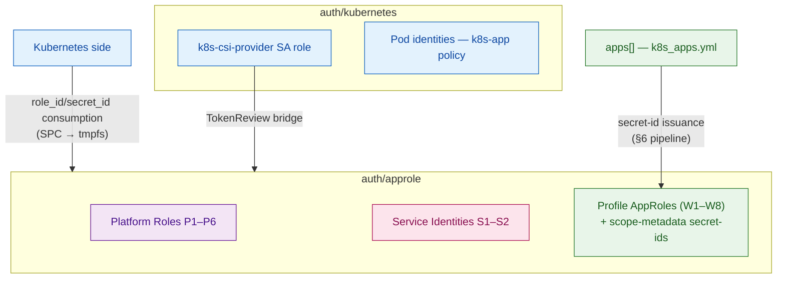
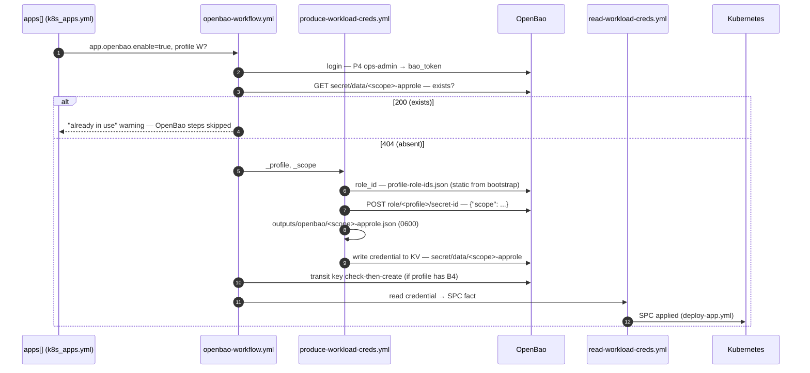

# OpenBao RBAC — Policy Bundles, Profiles, and Identity Model

> This document is the **single in-depth source** for the OpenBao identity and authorization model: policy bundles (B0–B11), identity catalogs (workload profiles **W**, platform roles **P**, service identities **S**), the `apps[]` OpenBao schema, the identity templating architecture, and the self-service credential pipeline. Summary: [`openbao-architecture-guide.md`](openbao-architecture-guide.md) §5. Live verification records: [`openbao-tests.md`](openbao-tests.md).

---

<details>
<summary><strong>Contents</strong></summary>

  - [1. Identity Layers and the Two-Tier Model](#1-identity-layers-and-the-two-tier-model)
  - [2. Policy Bundles (B0–B11)](#2-policy-bundles-b0b11)
  - [3. Identity Catalog](#3-identity-catalog)
  - [4. `apps[]` OpenBao Schema](#4-apps-openbao-schema)
  - [5. Identity Templating Architecture](#5-identity-templating-architecture)
  - [6. Self-Service Credential Pipeline](#6-self-service-credential-pipeline)
  - [7. Cloud Analogy (IAM)](#7-cloud-analogy-iam)
  - [8. Observability](#8-observability)
  - [9. Conformance Test Standard](#9-conformance-test-standard)
  - [10. File Map and Ownership](#10-file-map-and-ownership)
</details>

---

## 1. Identity Layers and the Two-Tier Model

### 1.1 Two identity paths: AppRole and Kubernetes Auth

Machine identity in OpenBao runs over two auth methods:

| Auth path | Mount | How identity is verified | Who uses it |
|---|---|---|---|
| **AppRole** | `auth/approle` | `role_id` + `secret_id` pair | Platform roles (P), service identities (S), per-application derived roles (W → `app-<scope>-<profile>`) |
| **Kubernetes Auth** | `auth/kubernetes` | ServiceAccount JWT — verified via the TokenReview bridge | K8s pod identities: the CSI provider and pods (`k8s-app` templated policy) |

AppRole is an auth method on the OpenBao side; the Kubernetes side **consumes** it — the `role_id`/`secret_id` pair reaches pods as tmpfs via SecretProviderClass; no K8s Secret copy is written to etcd.

### 1.2 Three identity categories under AppRole

Roles under `auth/approle` are defined in three separate lists in the code; this document uses the same three series as code:

| Series | Meaning | Source list | Defined in |
|---|---|---|---|
| **W1–W8** | Workload **profile** — template; a **single AppRole** per profile, each app is issued a new `secret-id` bound with scope metadata against this profile AppRole | `openbao_workload_profiles` | `openbao/security/defaults/main.yml` |
| **P1–P6** | Platform **role** — singular, static AppRole; not derived | `openbao_platform_roles` | `openbao/security/defaults/main.yml` |
| **S1–S2** | Service **identity** — AppRole of the K8s infrastructure services | `openbao_approle_roles` | `openbao/security/defaults/main.yml` |

Kubernetes-auth identities are outside the AppRole catalog (§3.4).

### 1.3 Two tiers: physical separation by change frequency

| Tier | Content | Where defined | Change frequency |
|---|---|---|---|
| **Platform + Service** | P: `pki-signer`, `pki-manager`, `monitor`, `ops-admin`, `bao-raft-agent`, `bao-raft-restore` · S: `cert-manager`, `k8s-csi` | `rbac-platform.yml` (with root, once) + `bootstrap.yml` (S) | Rarely |
| **Workload** | Scope-metadata secret-ids issued against the W1–W8 profile AppRoles | `apps[]` → `app-deploy` self-service | On every new app |

This separation is the RBAC counterpart of the PKI domain automation principle "Gateway one-shot, app-deploy self-service".

### 1.4 Why are P5 (agent) and P6 (restore) separate?

`bao-raft-agent` is an always-on background service that only **reads** snapshots (B10). Had the same authority been granted for restores, there would be a permanently open authority to "write back the raft store" — a compromised agent could roll back all of OpenBao's data. `bao-raft-restore` is used only by `maintenance/restore/restore-openbao.sh`, human-triggered and infrequent.



[↑ Back to top](#openbao-rbac--policy-bundles-profiles-and-identity-model)

---

## 2. Policy Bundles (B0–B11)

Policy authorities are defined as reusable bundles; a profile/role is the union of bundles.

| Bundle | Scope | Content |
|---|---|---|
| **B0** `self-care` | Automatic for every identity | `auth/token/lookup-self`, `renew-self` |
| **B1** `kv-read-own` | Scope-specific | `secret/data/<scope>/* → read`, `secret/metadata/<scope>/* → list,read` |
| **B2** `kv-write-own` | Scope-specific | B1 + `create,update,patch` |
| **B3** `kv-own-lifecycle` | Scope-specific | B2 + delete/undelete/destroy |
| **B4** `transit-use` | Key-specific | `transit/{encrypt,decrypt,rewrap,datakey/plaintext}/<key>`, `transit/keys/<key> → read` |
| **B5** `pki-sign` | — | `pki-int/sign/*` (create, update) |
| **B6** `pki-manage` | — | `pki-int/roles/dedicated-* → CRUD` + `denied_parameters: allow_any_name` |
| **B7** `db-consume` | Role-specific | `database/creds/<role> → read` |
| **B8** `ops-admin-base` | — | Broad administration (KV/Transit/PKI/Database/AppRole/K8s-auth) + `deny: sys/generate-root-token, sys/seal` |
| **B9** `issue-wrapped` | — | `secret-id → create,update` + mandatory wrapping TTL |
| **B10** `raft-snapshot` | platform | `sys/storage/raft/snapshot → read` (**read-only**) |
| **B11** `raft-restore` | platform | B10 + `sys/storage/raft/snapshot → update` + `sys/storage/raft/snapshot-force → update` |

**Why B10/B11 are separate:** B10 is the bundle used by the always-on `bao-raft-agent` background service and is deliberately read-only — the official [`openbao-snapshot-agent`](https://github.com/openbao/openbao-snapshot-agent) policy likewise contains only `capabilities = ["read"]`. Write authority (B11) is granted only on the manual restore path; this separation closes the risk of an always-on service writing back the raft store.

**Scope resolution:** the `<scope>`/`<key>`/`<role>` values in B1/B2/B3/B4/B7 resolve not at render time but at request time from the AppRole identity metadata (§5).

[↑ Back to top](#openbao-rbac--policy-bundles-profiles-and-identity-model)

---

## 3. Identity Catalog

### 3.1 Workload Profiles (W1–W8)

Each profile is bound to a `workload-<name>-templated` policy (§5); applications select one of these profiles via `apps[]` (§4).

| Code | Profile | Bundles | Token (ttl/max/uses/renewable) | Purpose |
|---|---|---|---|---|
| W1 | `reader` | B0+B1 | 1h/24h/0/yes (service) | Read-only consumer |
| W2 | `metrics-reader` | B0 + `sys/health` + `sys/metrics` | 1h/24h/0/yes (service) | Reads the OpenBao health and metrics endpoints (dedicated exporter); **no KV access** |
| W3 | `operator` | B0+B1+B2+B4 | 1h/24h/0/yes (service) | KV RW + transit, long-lived service |
| W4 | `job-run` | B0+B1+B4 | 30m/1h/0/no (batch) | Short-lived Job |
| W5 | `transit-user` | B0+B4 (no KV) | 30m/1h/0/no (batch) | Narrowest Job — when no KV is needed |
| W6 | `deployer` | B0+B2 | 15m/1h/0/no (batch) | CI/writer |
| W7 | `kv-owner` | B0+B3 | 1h/8h/0/yes (service) | Full owner of its own prefix |
| W8 | `db-consumer` | B0+B7 | 1h/24h/0/yes (service) | Reads dynamic database credentials; no KV access |

The "duration is part of authority" principle applies: a 15-minute token with write authority is not at the same risk level as a 24-hour token with read authority. `job-run`, `transit-user`, `deployer`, and W8 cannot be renewed under their batch/service types; once expired, a fresh login is required (`renew-self` appears only in renewable profiles' policies).

### 3.2 Platform Roles (P1–P6)

| Code | Role | Policy (bundles) | Token | Purpose |
|---|---|---|---|---|
| P1 | `pki-signer` | B0+B5 | 1h/24h/0/service | Intermediate CA signing authority. **Defined; has no active consumer** — the signing flow runs via the S2 `cert-manager` AppRole |
| P2 | `pki-manager` | B0+B6 | 15m/1h/0/service | Dedicated certificate role management (`allow_any_name` prohibited) |
| P3 | `monitor` | B0 + global KV read (`secret/*` read/list) + `sys/health` | 1h/24h/0/service | Read-only monitoring |
| P4 | `ops-admin` | B0+B8 | 4h/**8h**/0/service; `token_no_default_policy`, `token_bound_cidrs` | Day-to-day operations; explicit deny on `sys/seal` and `sys/generate-root-token` |
| P5 | `bao-raft-agent` | B0+B10 | 2h/4h/0/service | Raft snapshot **reading** — the always-on background `bao agent` (2h/4h is the official openbao-snapshot-agent value) |
| P6 | `bao-raft-restore` | B0+B10+B11 | 1h/1h/0/service | Raft snapshot **restore** — human-triggered, infrequent |

**Credential issuance:** credential files for the same three fixed roles are generated on every run — `ops-admin`, `pki-manager`, `monitor` (`k8s/openbao-ops/defaults → openbao_platform_credentials`). Extra roles can be added via `all.yml → openbao.credential_produce_list`; the list is merged with the fixed list via `unique`, and only roles defined in `openbao_platform_roles` are accepted (otherwise the role lookup fails with a 404 — `rbac-platform.yml` rule).

P4's network boundary is set via `all.yml → openbao.rbac.ops_admin_cidrs` (default empty = no restriction). Before filling it in: the source IP/network from which the controller reaches OpenBao MUST be inside this CIDR — a wrong value locks out bootstrap.

### 3.3 Service Identities (S1–S2)

AppRoles of the K8s infrastructure services — created once with root inside `bootstrap.yml` (the `openbao_approle_policies` + `openbao_approle_roles` lists).

| Code | AppRole | Policy | Token | Consumer |
|---|---|---|---|---|
| S1 | `k8s-csi` | `k8s-app` (SA-scoped templated, §5.2) | 1h/24h/0/service | CSI provider — **variant path**; the primary path is Kubernetes auth (§3.4) |
| S2 | `cert-manager` | `cert-manager`: B5 + `pki-int/cert/*` read | 1h/24h/0/service | cert-manager controller — **this is the active signing identity**; the ClusterIssuer signs with this AppRole |

### 3.4 Off-catalog identities

- **Kubernetes auth identities:** the `k8s-csi-provider` SA role (the CSI provider's **primary** path; requires the TokenReview bridge — `openbao-auth-reviewer.conf`, narrative: [`openbao-architecture-guide.md`](openbao-architecture-guide.md) §6.1) and application pods (scope derived from the SA name, `k8s-app` policy). These do not enter the AppRole catalog.
- **`none`:** neither a profile nor a role; it is the enum value that fully disables the OpenBao integration in `apps[]`.
- **`approle-issuer`:** an as-yet-undefined placeholder in the codebase for future implementation; planned to be addressed together with B9 wrapped secret-id issuance (§11).

### 3.5 Operational notes and caveats

**P3 `sys/health` note:** `sys/health` is open to everyone by default; the line in the policy is documentary in intent — it is not restricted because restricting it would break LB probes.

**P5/P6 `token_num_uses: 0`:** the counter is deliberately 0. How many API calls `bao agent` will make in the background cannot be known in advance (every request, including `auto_auth` refreshes, decrements the counter); a limit would quietly drop backups to 403. Restriction is enforced at the policy + TTL + unix socket layers. 0 in P6 as well: counter tracking would produce unexpected breakage in `--dry-run` / back-to-back attempt flows.

**Why `token_bound_cidrs` is absent from P5/P6:** the agent connects over a `listener "unix"`; on a unix listener the remote address arrives empty, so no CIDR match can be made and the token is silently rejected. The official snapshot-agent config does not use `token_bound_cidrs` either.

**Is the access restriction on the socket or on the directory?** The restriction comes from the `bao` user and the **directory permission** — not from the socket file's own permission. Live measurement (2026-09-28, OpenBao 2.6.2, `openbao-tests.md` Test 13):

```text
/etc/bao/agent.sock  octal=755  bao:bao     ← config says "0660", not applied
/etc/bao             mode=750   bao:bao     ← protection comes from here
```

`bao agent` does not enforce the `socket_mode` value on a unix listener; the socket opens as `0755` via `0777 & ~umask(0022)`; the `0660` assumption does not hold. Protection comes from `/etc/bao` being `0750 bao:bao`, i.e. only `root` and the `bao` group can reach the socket. **If the `/etc/bao` directory permission is loosened, the agent socket is left unprotected.** The directory permission is set by `roles/openbao/server/tasks/install.yml`; the `0750 bao:bao` value must be preserved.

**Agent unit hardening — do not reintroduce:** `bao-raft-agent.service` does not include `ProtectHome`, `ProtectSystem`, or `ReadWritePaths`; nor does the official `openbao-snapshot-agent` unit. If added, the service fails to start for two separate reasons (regression record: `openbao-tests.md` §"Bilinen hata ve kök neden"):

| Directive | Breakage |
|---|---|
| `ProtectHome=yes` | `/home` becomes unreachable in the mount namespace. While initializing the client, `bao agent` reads the CLI config directory (`$HOME/.bao`) → `open …: permission denied` → `exit 1`. Because `bao server` never touches this directory, the same failure does not appear in the main service. |
| `ProtectSystem=full` | `/etc` becomes read-only; the unix listener cannot write the `/etc/bao/agent.sock` file → `EACCES` → `exit 1`. |

`NoNewPrivileges`, `PrivateTmp`, and `LimitNOFILE` — which do not affect the filesystem — are retained. The only difference between `bao.service` and the agent unit is `CapabilityBoundingSet` (the main server binds port 8200, the agent does not).

[↑ Back to top](#openbao-rbac--policy-bundles-profiles-and-identity-model)

`BAO_SKIP_VERIFY=true` **is mandatory**: the server TLS is generated self-signed via `openssl req -x509` inside `configure.yml`; there is no CA chain, and the same variable is also used in `init.yml`.

---

## 4. `apps[]` OpenBao Schema

```yaml
- name: myapp
  namespace: demo
  openbao:
    enable: true          # if false/absent, the block is ignored
    profile: operator     # one profile from W1–W8 (see below)
    scope: myapp          # optional — defaults to name when omitted
    scope_level: app      # optional — default: app; alternative: namespace
```

**Selectable profiles:** `reader`, `metrics-reader`, `operator`, `job-run`, `transit-user`, `deployer`, `kv-owner`, `db-consumer` (W1–W8) and `none`.

**Deliberate limit — P and S identities cannot be selected in `apps[]`:** `workload-<profile>-templated` policies are generated only for W profiles. There is no enum enforcement on the code side; if a wrong profile is selected, the role-creation step fails in OpenBao with a policy-not-found error — keep declarations within the W range.

### What `scope_level` does

- **`app`** (default): Each app owns its isolated `<scope>`. `secret/data/myapp/*`.
- **`namespace`**: All apps in the same namespace declaring the same `profile` + `scope_level: namespace` share a single AppRole/scope. Scenario: a microservice group (e.g. 5 apps in the `checkout` namespace) sharing a common KV prefix — a single identity instead of opening a separate isolated scope for each.

```yaml
- name: order-service
  namespace: checkout
  openbao: { enable: true, profile: operator, scope_level: namespace }

- name: payment-service
  namespace: checkout
  openbao: { enable: true, profile: operator, scope_level: namespace }
# Both share the same AppRole (ns-checkout-operator) and
# access the secret/data/checkout/* prefix.
```

**Caution — deliberate limit:** `scope_level: namespace` means a shared identity; if one app's `secret-id` leaks, every app's scope in the namespace is at risk. The default must always remain `app` (isolated); `namespace` should only be selected deliberately, when a genuinely shared identity is wanted.

[↑ Back to top](#openbao-rbac--policy-bundles-profiles-and-identity-model)

### Scope name collision

The scope name (`scope`) is the key of the credential record: `secret/data/<scope>-approle` in KV, `<scope>-<key>` in Transit. A second app using the same scope name is skipped with an "already in use" warning at the pipeline's collision check — no overwrite happens. The outcome does not change even if an app name and a namespace name are the same string: first deployment wins; if a deliberate distinction is needed, the `scope` value is differentiated manually. The AppRole/policy count is fixed at the profile count (8) — the app/namespace distinction is carried not in the AppRole name but in the `scope` value and secret-id metadata.

---

## 5. Identity Templating Architecture

### 5.1 Mechanism

Permission paths are not hand-written in policy files; OpenBao's identity templating variables resolve at request time from the token owner's identity metadata. So even if 100 new applications join the system, no new policy file is written — policy maintenance cost stays roughly `O(1)`.

`workload-reader-templated.hcl.j2` example:

```hcl
path "auth/token/lookup-self" {
  capabilities = ["read"]
}
path "auth/token/renew-self" {
  capabilities = ["update"]
}
path "secret/data/{{identity.entity.aliases.<accessor>.metadata.scope}}/*" {
  capabilities = ["read"]
}
path "secret/metadata/{{identity.entity.aliases.<accessor>.metadata.scope}}/*" {
  capabilities = ["list", "read"]
}
```

The template value resolves from the token owner's identity metadata: an `order-service` token can access the `secret/data/order-service/db` path but not the `payment-service` path. For transit-using profiles, the key path is locked to the `<scope>-*` pattern by the same mechanism.

### 5.2 Two-way scope binding

- **AppRole path:** the self-service pipeline writes the `{"scope": "<app name>"}` metadata when issuing a new `secret-id` (§6). The policy template constrains the path by reading this value.
- **Kubernetes auth path:** the ServiceAccount name of a pod logging in via CSI is recorded in the identity metadata; the `k8s-app` policy locks the pod to only its own `<sa-name>-approle` path:

```hcl
path "secret/data/{{identity.entity.aliases.<accessor>.metadata.service_account_name}}-approle" {
  capabilities = ["read"]
}
```

Although `bound_service_account_names` in the Kubernetes auth role is a wildcard (`["*"]`) — the login gate is wide — isolation holds because the policies are templated.

### 5.3 Ansible side: the `approle_accessor` fact

The `<accessor>` inside the template literal is read from `sys/auth` and resolved from a single place across all policy renders:

```yaml
- name: Get the AppRole mount accessor
  ansible.builtin.uri:
    url: "{{ openbao_address }}/v1/sys/auth"
    method: GET
    headers: { X-Vault-Token: "{{ bao_token }}" }
  register: auth_list

- name: Store the accessor as a fact
  ansible.builtin.set_fact:
    approle_accessor: "{{ auth_list.json[openbao_approle_mount ~ '/'].accessor | regex_replace('^auth_approle_', '') }}"
```

### 5.4 Known limitations

- **The `auth_approle_` prefix trap (caught live):** if an extra `auth_approle_` prefix is placed on the HCL key, the key becomes `auth_approle_auth_approle_<id>` and the policy silently returns 403 (positive test included). The correct key is the accessor itself; the fact is reduced to the bare id (`regex_replace('^auth_approle_', '')`).
- **The Jinja2 `raw/endraw` trap:** OpenBao template literals are written with the jinja-string approach (`{{ '{{' }}`), not wrapped in `` (the raw wrapper errors with "Missing end of raw directive").


- **Template injection:** wildcards (`*`, `+`), path separators (`/`), and PKI glob characters are denied by default in identity templates under OpenBao 2.6.2. Because `scope` values derive from `app.name`, they contain none of these characters; the `allow_*_in_identity_templates` flags are kept off. The LIST permission-bypass fix also keeps wildcard grants from skipping deny rules on list operations — the `sys/seal` and `sys/generate-root-token` prohibitions cannot be circumvented via listing.

### 5.5 Verification

The mechanism was confirmed by scope tests: `scope` is visible in the alias metadata; 4/4 checks held between two pilot roles under a single static policy (200 to its own path, 403 on cross access), and full cleanup was performed. Evidence records, negative test outputs, and upstream research (OpenBao Discussion #2212 — distinguishing proven from unproven): [`openbao-tests.md`](openbao-tests.md) **Section 3**.

[↑ Back to top](#openbao-rbac--policy-bundles-profiles-and-identity-model)

---

## 6. Self-Service Credential Pipeline

### 6.1 Four-part flow

Called from within `app-deploy`:

1. `openbao-workflow.yml` — scope computation + **KV collision check** + coordination
2. `produce-workload-creds.yml` — the profile's static `role_id` + new `secret-id` issuance + credential writing (controller `outputs/` + OpenBao KV)
3. `produce-transit-key.yml` — `<scope>-<key>` transit key check-then-create (when the profile includes B4)
4. `read-workload-creds.yml` — credential reading + SecretProviderClass fact (the provider reads the credential from the KV path)



Example — the `produce-workload-creds.yml` core:

```yaml
- name: "Read role_id from static file (fixed, one per profile)"
  ansible.builtin.set_fact:
    _cred_role_id: "{{ (lookup('file', playbook_dir + '/../outputs/openbao/profile-role-ids.json') | from_json)[_profile] }}"

- name: "Generate secret_id — profile: {{ _profile }}, scope: {{ _scope }}"
  ansible.builtin.uri:
    url: "{{ openbao_address }}/v1/auth/{{ openbao_approle_mount }}/role/{{ _profile }}/secret-id"
    method: POST
    headers: { X-Vault-Token: "{{ bao_token }}" }
    body:
      metadata: "{{ {'scope': _scope} | to_json }}"   # API wants a JSON string — not a map
    body_format: json
    validate_certs: false
    status_code: 200
  register: _secret_id_result
  no_log: true   # response contains plaintext secret_id — never logged

- name: "Write credentials to OpenBao KV — {{ _scope }}-approle"
  ansible.builtin.uri:
    url: "{{ openbao_address }}/v1/{{ openbao_kv_mount }}/data/{{ _scope }}-approle"
    method: POST
    headers: { X-Vault-Token: "{{ bao_token }}" }
    body:
      data: { role_id: "{{ _cred_role_id }}", secret_id: "{{ _secret_id_result.json.data.secret_id }}" }
    body_format: json
    validate_certs: false
    status_code: [200, 204]
  no_log: true
```

Profile AppRoles are created once at bootstrap (`rbac-workload.yml`: 8 roles + templated policies + the static `role_id` record `profile-role-ids.json`). As the app count grows, the AppRole and policy counts stay fixed; each app only gets a new `secret-id` for its own scope — scope isolation is provided by the templated policy reading the scope metadata carried in the token (§5).

### 6.2 Token source discipline

`bao_token` is **not** root. Root is used only once, in the `rbac-platform.yml` bootstrap: it creates the P4 `ops-admin` role + secret-id, writes them to `outputs/openbao/ops-admin.json`, and the root token is no longer actively used (but not deleted either) (break-glass). Afterwards all routine work runs under the P4 `ops-admin`:

- On every run, the self-service pipeline reads `role_id`+`secret_id` from `ops-admin.json` and takes a fresh token via `approle/login` (TTL is short, so every run renews).
- Workload policies are likewise written with the P4 token.
- The root file (`openbao-credentials.yml`) is read by no playbook.


### 6.3 Config single source

Profile definitions (TTL/max_ttl/renewable/extra) live in the `openbao/security/defaults → openbao_workload_profiles` (list-of-dicts) structure; `rbac-workload.yml` and `openbao-workflow.yml` read from the same source. `rbac-platform.yml` applies `token_bound_cidrs` and `token_no_default_policy: true` to P4.

### 6.4 Behavior

A second app using the same scope name → the KV collision check returns 200, an "already in use" warning is printed, and the OpenBao steps are skipped — no overwrite happens. New scope → 404, the credential chain is generated right then. Single command: `ansible-playbook playbooks/k8s_apps.yml`.

---

## 7. Cloud Analogy (IAM)


| OpenBao | AWS IAM | Azure (Entra ID) | GCP (Cloud IAM) | Mechanism |
|---|---|---|---|---|
| AppRole | IAM Role (machine identity) | Workload Identity + service principal | Workload Identity Federation | `role_id`+`secret_id` = `AssumeRole` |
| Policy (HCL) | IAM Policy (JSON) | Azure RBAC role definition | IAM Policy (YAML) | Path/capability-based |
| **Identity templating** | **IAM Policy Variables** | **Custom security attributes + Condition** (approximate counterpart) | **IAM Conditions** (`attributes.*`) | `{{identity...}}` ↔ tag/attribute-based policy |
| Entity/Group | IAM Group | Entra ID Group | IAM Group | Bulk policy assignment |
| `secret_id` wrapping | STS `AssumeRole` + external ID | no direct counterpart | no direct counterpart | Single-use, short TTL |
| `token_bound_cidrs` | IAM Condition `aws:SourceIp` | Conditional Access (location restriction) | IAM Condition (IP restriction) | Network-level restriction |
| Control Groups (expected in 2.7) | IAM Permission Boundary + approval flow | PIM approval flow | no direct counterpart | Human-in-the-loop |

[↑ Back to top](#openbao-rbac--policy-bundles-profiles-and-identity-model)
---

## 8. Observability


OpenBao telemetry flows into Prometheus via the project-specific exporter running under the W2 `metrics-reader` profile (architecture: [`openbao-architecture-guide.md`](openbao-architecture-guide.md) §10).

Signals to watch from an RBAC perspective:

- Per-profile token issuance count (`vault_token_create_count`-like).
- Per-policy denied request count (403s) — an unexpected rise can signal a wrongly-scoped attempt or a leaked credential.
- AppRole login failure rate.

This moves the claim from "RBAC exists" to "actual RBAC usage is monitored" — a small version of cloud providers' audit and access-analysis tooling such as CloudTrail, Activity Log, Cloud Audit Logs, and IAM Access Analyzer.

---

## 9. Conformance Test Standard

Standard four steps per profile:

1. **Positive:** A correctly-scoped token can reach its own path.
2. **Negative (scope):** Another scope's token under the same profile cannot reach this path (403).
3. **Negative (capability):** A different profile's token cannot attempt a capability outside this profile's authority (e.g. `write` with a `reader` token) (403).
4. **Idempotency:** `ansible-playbook playbooks/k8s_apps.yml` skips the OpenBao steps on the second run (the scope credential record already exists — "already in use").

**Extra agent-specific checks for P5/P6:**


| # | Identity | Check | Expected |
|---|---|---|---|
| 5 | P5 | `curl -sk --unix-socket /etc/bao/agent.sock localhost/v1/auth/token/lookup-self` | `bao-raft-agent` present in `policies`, **no `root`**. `default` is the empty (deny-by-default) policy OpenBao attaches to every token automatically; `policy read default` returns 403 for this token, i.e. it carries no authority |
| 6 | P5 | with the agent token, `POST /v1/sys/storage/raft/snapshot` | **403** (B10 read-only — confirmation of the design) |
| 7 | P5 | with the agent token, `GET /v1/sys/policies/acl` | **403** |
| 8 | P5 | `test -f /etc/bao/snap-bao-raft-agent-secretid` | **present** (thanks to `remove_secret_id_file_after_reading = false`; had it been `true`, the 2nd run would not log in) |
| 9 | P6 | with the restore token, `GET /v1/sys/health` | 200 (must pass the pre-check) |
| 10 | P6 | with the restore token, `GET /v1/sys/policies/acl` | **403** (authority only on the raft paths) |

Row 6 is a "negative" test but a design requirement: if `update` were accidentally added to P5, the test would silently pass and the actual security separation would be lost.

Live-measured procedure and actual outputs: [`openbao-tests.md`](openbao-tests.md) **Section 2** (Tests 5–13) — the "Expected" column above matches those results exactly. Templating pilot records: same document, **Section 3**.

---

## 10. File Map and Ownership


| File | Role |
|---|---|
| `ansible/roles/openbao/security/defaults/main.yml` | **Single source:** `openbao_approle_policies` (S2 policy), `openbao_approle_roles` (S1/S2), `openbao_platform_policies` (P1–P6), `openbao_platform_roles` (P1–P6), `openbao_workload_profiles` (W1–W8) |
| `ansible/roles/openbao/security/tasks/rbac-platform.yml` | Platform RBAC: policy + role creation, P4 bootstrap (ops-admin.json, root retired from use), credential loop |
| `ansible/roles/openbao/security/tasks/rbac-workload.yml` | Workload RBAC: accessor fetch + 8 templated policies + 8 roles + `profile-role-ids.json` |
| `ansible/roles/openbao/security/templates/` | `k8s-app-templated.hcl.j2` + `workload-<name>-templated.hcl.j2` (W1–W8) |
| `ansible/roles/openbao/server/tasks/bootstrap.yml` | Mounts + S1/S2 creation (`openbao_approle_policies/roles` loops) + rbac-platform/rbac-workload includes + `openbao-mount.json` |
| `ansible/roles/openbao/server/tasks/backup.yml` | P5/P6: snapshot directory + credential files (0640 bao:bao) + agent config/unit + `systemctl start` (fail-fast) |
| `ansible/roles/openbao/server/templates/bao-raft-agent.hcl.j2` | Agent config: `api_proxy` + unix listener + `auto_auth` (AppRole); `remove_secret_id_file_after_reading = false` |
| `ansible/roles/openbao/server/templates/bao-raft-agent.service.j2` | Agent unit: `User=bao`, `BAO_CLIENT_TIMEOUT`, `BAO_SKIP_VERIFY=true`, `After=bao.service`; deliberately no `ProtectHome`/`ProtectSystem` (§3.5) |
| `ansible/roles/k8s/openbao-ops/tasks/main.yml` | P4 login + reviewer conf (TokenReview bridge: `outputs/k8s/openbao-auth-reviewer.conf` → `token_reviewer_jwt`) + kubernetes auth config/role + CSI and cert-manager AppRole Secrets |
| `ansible/roles/k8s-apps/app-deploy/tasks/openbao-workflow.yml` | §6 self-service: scope computation + AppRole check-then-create |
| `ansible/roles/k8s-apps/app-deploy/tasks/produce-workload-creds.yml` | §6 credential issuance: role_id + credential writing (outputs + KV) |
| `ansible/roles/k8s-apps/app-deploy/tasks/produce-transit-key.yml` | §6 transit key check-then-create (when profile includes B4) |
| `ansible/roles/k8s-apps/app-deploy/tasks/read-workload-creds.yml` | §6 K8s-side credential reading + writing to K8s Secret |
| `ansible/roles/k8s-apps/app-remove/tasks/delete-openbao-approle.yml` | Guarded OpenBao cleanup step (actual scope: KV record and secret-id — deliberate limit §11) |
| `maintenance/backup/app-data/backup-openbao.sh` | Takes snapshots (unix socket, tokenless), local copy + restic |
| `maintenance/restore/restore-openbao.sh` | P6's sole consumer: rollback → restic → `POST /snapshot` |
| `ansible/inventory/group_vars/all/k8s_apps.yml` | The `openbao.{enable,profile,scope,scope_level}` schema (application declarations) |
| `ansible/inventory/group_vars/all/all.yml` | `openbao.credential_produce_list`, `openbao.rbac.ops_admin_cidrs` |

**Ownership note (reviewer):** the reviewer SA and conf are produced not in the OpenBao platform RBAC layer but on the K8s side by `k8s/openbao-ops`. Narrative: [`openbao-architecture-guide.md`](openbao-architecture-guide.md) §6.1, [`k8s-design.md`](../architecture/k8s-design.md) §6.8; conf generation mechanism: [`kubernetes/rbac.md`](../kubernetes/rbac.md) §8.2.1.

**Ownership note (raft agent):** P5/P6 **policies and roles** live in the OpenBao platform RBAC layer (`security/`); the process side is deliberately split across three roles:

| Part | Owner | Why |
|---|---|---|
| Policy + AppRole + credential issuance | `roles/openbao/security` (§1, static) | OpenBao side — same place as all other platform identities |
| Agent process, config, unit, `/etc/bao/snap-*-*` | `roles/openbao/server` (`backup.yml`) | `/etc/bao`, the `bao` user, and the units belong to this role |
| Snapshot taking (backup) | `roles/maintenance` (`backup-openbao.sh`) | Must stay alongside the restic/metric/alert chain |
| Snapshot restore | `roles/maintenance` (`restore-openbao.sh`) | The `restore/` tree and DR distribution belong to this role |

"Raft backup" is a single concept but spans three roles; none is incomplete on its own. Operational narrative owner: [`maintenance.md`](../maintenance/maintenance.md) §3.4/§5.6.

[↑ Back to top](#openbao-rbac--policy-bundles-profiles-and-identity-model)

---
