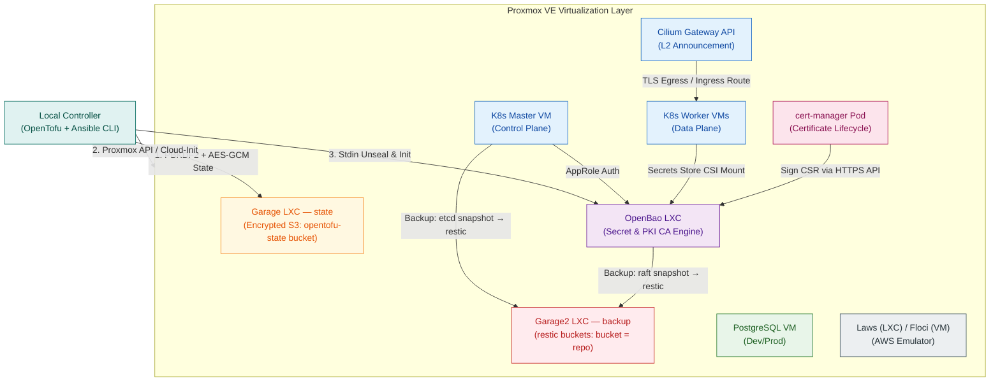
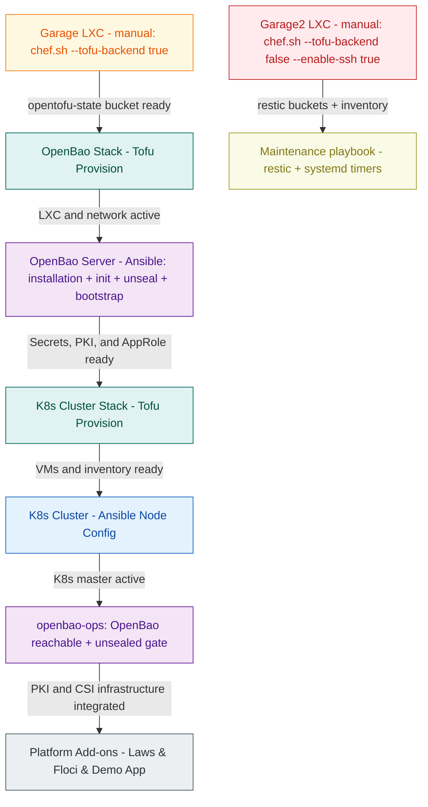
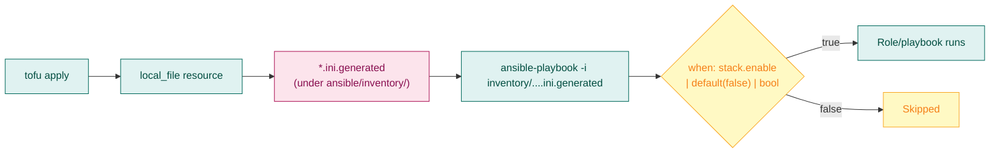
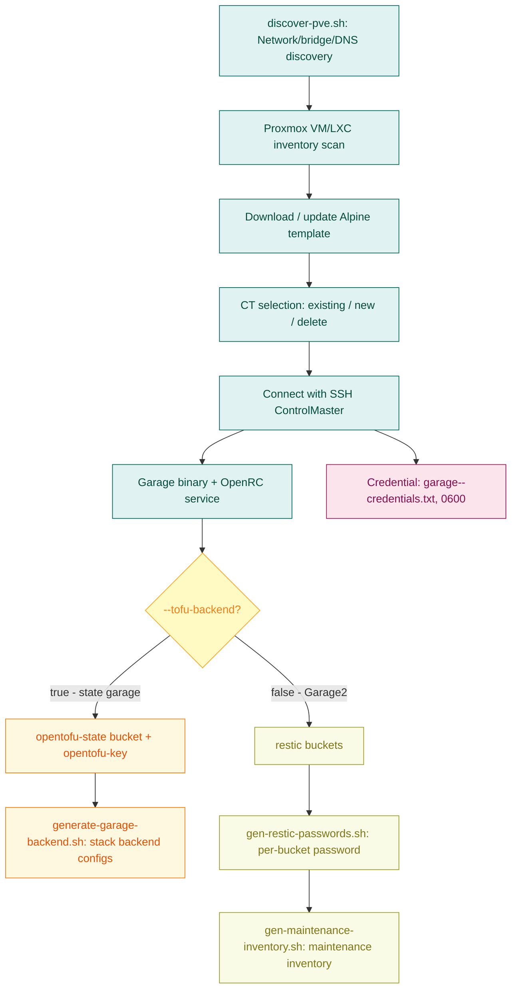
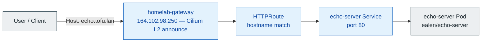

# Cloud-in-Lab

> **Self-Hosted Platform Engineering Toolkit — Reproducible cloud infrastructure with OpenTofu + Ansible on Proxmox**

> **Naming note:** The project was initially created as "Tofu-lar" and later renamed to "Cloud-in-Lab" to match its scope. `tofu` occurrences in paths, variable and unit names (`/etc/tofu-lar`, `tofu-lar-backup-*`) and in the internal network domain (`tofu.lan`) are technical identifiers and are intentionally preserved.

[](https://opentofu.org)
[](https://www.ansible.com)
[](https://kubernetes.io)
[](https://www.proxmox.com)
[](https://openbao.org)

Cloud-in-Lab is a platform engineering toolkit that reproduces modern cloud architecture patterns on **your own infrastructure** in a repeatable way. It offers a realistic environment for development, testing, and validation before moving to a real cloud.

| Problem | Solution with Cloud-in-Lab |
|---------|-------------------|
| Cloud costs are too high | Self-hosted on Proxmox, more cost-effective |
| Manual installation errors | 100% code-defined with OpenTofu + Ansible, zero-click |
| Secret/PKI management is complex | Centralized secrets + certificate infrastructure with OpenBao |
| Infrastructure cannot be reproduced | Can be rebuilt from scratch with a single command |
| Scattered tools | IaC → Configuration → Orchestration → Operations under one roof |

**Platform Lifecycle:**

```text
Developer → Git → OpenTofu → Proxmox → Ansible → Kubernetes → Platform Services → Operations
```

---

<details>
<summary><strong>Table of Contents</strong></summary>

- [Part 1 — Introduction](#part-1--introduction)
  - [1.1 Why This Project?](#11-why-this-project)
  - [1.2 What Does It Offer?](#12-what-does-it-offer)
  - [1.3 Technical Approach](#13-technical-approach)
  - [1.4 Who Is It For?](#14-who-is-it-for)
  - [1.5 Hardware and Resource Matrix](#15-hardware-and-resource-matrix)
  - [1.6 Platform Overview](#16-platform-overview)
- [Part 2 — Architecture](#part-2--architecture)
  - [2.1 Stack Isolation and State Strategy](#21-stack-isolation-and-state-strategy)
  - [2.2 Tofu and Ansible Separation of Duties](#22-tofu-and-ansible-separation-of-duties)
  - [2.3 Why These Technologies?](#23-why-these-technologies)
  - [2.4 Cloud Service Equivalents](#24-cloud-service-equivalents)
  - [2.5 Directory Structure](#25-directory-structure)
- [Part 3 — Platform Components](#part-3--platform-components)
  - [3.1 Proxmox Prep](#31-proxmox-prep)
  - [3.2 Deployment Order](#32-deployment-order)
  - [3.3 Core Technical Flows](#33-core-technical-flows)
  - [3.4 GarageHQ (S3 Storage) — Two Separate LXCs](#34-garagehq-s3-storage--two-separate-lxcs-two-different-jobs)
  - [3.5 deploy.sh](#35-deploysh)
  - [3.6 Ansible](#36-ansible)
  - [3.7 OpenBao (Secret Management)](#37-openbao-secret-management)
  - [3.8 Kubernetes Cluster](#38-kubernetes-cluster)
  - [3.9 Databases (PostgreSQL)](#39-databases-postgresql)
  - [3.10 EFK (Elasticsearch)](#310-efk-elasticsearch)
  - [3.11 Floci (AWS Emulator)](#311-floci-aws-emulator)
  - [3.12 Laws (AWS Emulator)](#312-laws-aws-emulator)
  - [3.13 Ansible Roles](#313-ansible-roles)
- [Part 4 — Operations](#part-4--operations)
  - [4.1 Tested Environments](#41-tested-environments)
  - [4.2 Design Decisions](#42-design-decisions)
  - [4.3 Security Model](#43-security-model)
  - [4.4 Maintenance and Backup](#44-maintenance-and-backup)
  - [4.5 Disaster Recovery](#45-disaster-recovery)
  - [4.6 Project Status](#46-project-status)
  - [4.7 Known Limitations](#47-known-limitations)
  - [4.8 Frequently Asked Questions](#48-frequently-asked-questions)
  - [4.9 License](#49-license)
</details>

---

# Part 1 — Introduction

---

## 1.1 Why This Project?

Modern software teams rarely deploy "just an application".

Development environments usually need:

- Infrastructure as Code
- Kubernetes
- Secret Management
- PKI (certificate management)
- Gateway API
- Object Storage (S3)
- RBAC (role-based access)
- Service Discovery
- Backup & Disaster Recovery

Public cloud providers offer these services, but experimenting on production cloud infrastructure is expensive, slow, and comes with its own challenges.

Cloud-in-Lab offers a **repeatable platform** where the same architectural principles can be tested on your own infrastructure.

> The goal is to reproduce the **operational experience** of modern cloud platforms in a controlled lab environment.

---

## 1.2 What Does It Offer?

After installation, the platform provides a foundation for:

- Kubernetes clusters
- Secret management based on OpenBao
- Cloud-like KMS management
- Internal PKI infrastructure
- Gateway API
- AWS-compatible development services (Laws, Floci)
- Per-environment Infrastructure as Code
- Automated configuration management
- Disaster recovery tools

---

## 1.3 Technical Approach

In this project, infrastructure is approached through four core principles.

### 1.3.1 100% Declarative Infrastructure (Zero Click-Ops)

All virtual machines, network configurations, and operating system settings are code. No manual operation through the Proxmox UI is allowed. The system can be deleted at any time and reproduced from scratch with the same parameters.

### 1.3.2 Secure by Design

Security is not an afterthought. Infrastructure state files are never written to disk in plaintext; secrets are not stored in the repo; components run with minimum privileges (Least Privilege).

### 1.3.3 Operations Matter

Installation is only 10% of the lifecycle. This project puts backup, verification, pruning, and restore operations at the center of the architecture.

### 1.3.4 Independent Stack Architecture

Each platform component is deployed as an independent stack with its own lifecycle and isolated state files. This way, a change in one component does not affect the others.

### 1.3.5 Why These Choices? (Decision Rationale)

| Choice | Cloud/Standard Equivalent | Why This Solution? |
|-------|-------------------------|-----------------|
| **OpenBao LXC (outside K8s)** | Vault (inside K8s), AWS Secrets Manager, Azure Key Vault | Secrets/PKI isolated from K8s — credentials stay safe even if K8s is compromised; AppRole works on every platform |
| **GarageHQ (S3 backend)** | AWS S3, MinIO (archived), SeaweedFS | Rust-based, ~60 MB RAM, geo-distributed, MPL license, native OpenTofu S3 backend support |
| **kubeadm (not Talos/k3s)** | EKS/GKE/AKS managed control plane | Upstream Kubernetes, version control fully owned by the project, fully compatible with Cilium Gateway API |
| **Cilium Gateway API** | ALB/NLB + Route53, Kong, MetalLB | eBPF-based, no kube-proxy, native Gateway API, L2 announcement, 3-tier network policy |
| **3-Tier Cilium Policy** | Security Groups + NACLs + WAF | CC-NP (cluster) → CNP (namespace) → CC-NP (pod) + `ingress-exposed` label gate |
| **chef.sh Bootstrap** | Terraform Cloud, Pulumi | Interactive: discovery → selection → SSH → config → credential copy → backend generation in a single flow |
| **No-Provisioner Rule** | Terraform provisioner (anti-pattern) | Tofu never calls Ansible; the only bridge is `local_file` → inventory file |
| **State Encryption (PBKDF2+AES-GCM)** | Terraform Cloud, S3+DynamoDB locking | Native OpenTofu 1.7+, `enforced=true`, provider-free, independent `encryption.tofu` per stack |

---

## 1.4 Who Is It For?

- Homelab enthusiasts
- Platform Engineers
- DevOps Engineers
- Development teams
- QA teams
- In-house laboratories
- Cloud migration projects
- Anyone aiming to learn infrastructure and Kubernetes

Cloud-in-Lab focuses on **repeatable platform engineering environments**; it does not replace public cloud providers.

---

## 1.5 Hardware and Resource Matrix

This table shows how lightweight and optimized the project is. It can run on a single older NUC or Mini PC.

| Component | Min RAM | Min CPU | Type | Cloud Equivalent |
|---------|---------|---------|-----|---------------|
| **GarageHQ (×2 LXC)** | ~60 MB | 1 Core | Alpine LXC (state + backup) | AWS S3, Azure Blob Storage, GCP Cloud Storage, MinIO |
| **OpenBao** | 256 MB | 1 Core | Ubuntu 26.04 LXC | AWS KMS+Secrets Manager+ACM, Azure Key Vault, GCP Cloud KMS+Secret Manager, Vault |
| **K8s Master** | 2 GB | 2 Core | Debian VM | AWS EKS, Azure AKS, GCP GKE |
| **K8s Worker (x2)** | 4 GB (each) | 2 Core | Debian VM | AWS EKS Node Group, Azure AKS node pool, GCP GKE node pool |
| **Databases** | 2 GB | 2 Core | Debian VM | AWS RDS, Azure SQL, GCP Cloud SQL |
| **EFK Stack** | 4 GB | 2 Core | Debian VM | AWS OpenSearch Service, Azure Monitor, GCP Cloud Logging |
| **TOTAL (Dev)** | **~15 GB** | **~10 vCPU** | Single machine | — |

> Note: These values are minimum requirements. Resources should be increased for production-like tests.

> If not everything is brought up at the same time, it can also be tested on lower-capacity systems.

---

## 1.6 Platform Overview

The architectural components of the platform and the data flow channels between them:



[↑ Back to top](#cloud-in-lab)

---

# Part 2 — Architecture

---

## 2.1 Stack Isolation and State Strategy

Many IaC projects keep all resources in a single `terraform.tfstate` file. In this approach, a single `terraform apply` affects the entire infrastructure, and even a small change puts the whole system at risk.

Cloud-in-Lab instead deploys each platform component as an **independent stack**.

Thanks to stack isolation:

- Destroying one stack does not affect the others
- The `plan` output shows only the relevant resources
- Fixes are isolated
- Recovery is simplified

### 2.1.1 State Strategy

Infrastructure state is as important as production data.

Cloud-in-Lab uses this strategy:

- **Remote state:** stored on GarageHQ S3 , not a local file, to simulate a cloud environment
- **Encryption:** **native OpenTofu encryption** with PBKDF2 + AES-GCM
- **Isolation:** under a single `opentofu-state` bucket, each stack keeps a separate state in its own key (`<stack>/terraform.tfstate`)

---

## 2.2 Tofu and Ansible Separation of Duties

The two tools are deliberately separated:

- **OpenTofu:** answers the question "What infrastructure should exist?"
- **Ansible:** answers the question "How should this infrastructure behave?"

This separation keeps provisioning deterministic (predictable) while letting configuration evolve independently. Ansible is never run from inside Tofu with a `provisioner`.

> **Architecture rule:** triggering Ansible from OpenTofu code — inline or via `local-exec` — is forbidden. To keep processes traceable and deterministic, the bridge between the two layers is built only through static template output (the `local_file` resource).

> **Detailed architecture, data flows, and isolation model:** [`docs/en/architecture/master-design.md`](architecture/master-design.md)

---

## 2.3 Why These Technologies?

The technologies used were chosen because they complement each other, are open-source, and offer high-quality features for free.

| Technology | Purpose | Why Was It Chosen? |
|-----------|------|----------------------|
| **Proxmox VE** | Virtualization platform | Free, KVM/LXC support, API-based management |
| **OpenTofu** | Infrastructure as Code | Terraform fork, Linux Foundation backing, native state encryption support |
| **Ansible** | Configuration management | Agentless, SSH-based, large community, gentle learning curve |
| **Kubernetes** | Container orchestration | Industry standard, wide ecosystem, portable architecture |
| **OpenBao** | Secret management + PKI + KMS | Vault fork, AppRole auth, dynamic credentials, Root CA + Intermediate CA, Kubernetes CSI integration |
| **GarageHQ** | S3-compatible state storage | Active open-source alternative after MinIO was archived (2026); Rust-based, ~60 MB typical working set, geo-distributed design |
| **Cilium** | CNI + Gateway API + Network Policy | eBPF-based, removes kube-proxy, native Gateway API support (removes the need for NGINX Ingress), L2/L3 load balancing, cluster-wide network policy |

### 2.3.1 Why OpenTofu & OpenBao?

**OpenTofu** and **OpenBao** are projects forked from their commercial counterparts (Terraform, Vault) after their license change (BSL — Business Source License) and continued as open source. The main reason they are preferred in this project is that they offer **enterprise-grade features without licensing concerns**.

**OpenTofu — the open-source version of Terraform:**

| Feature | Terraform (BSL) | OpenTofu (MPL) |
|----------|-----------------|----------------|
| State Encryption | only Terraform Cloud/Enterprise | ✅ **Native built-in** (PBKDF2 + AES-GCM, provider-free) |
| Provider Pinning | limited | ✅ `~>` operator, full version constraint |
| Working with the CLI | depends on closed-source Terraform Cloud | ✅ Fully CLI-based |
| Linux Foundation | no | ✅ **Yes** — community-driven |

**OpenBao — the open-source version of Vault:**

| Feature | Vault (BSL) | OpenBao (MPL) |
|----------|-------------|----------------|
| PKI Engine | enterprise tier | ✅ **Open source** (Root CA + Intermediate CA, ACME) |
| Dynamic Secrets | limited | ✅ All engines open (DB, K8s, AWS, ...) |
| HSM Integration | enterprise | ✅ Open source (PKCS#11) |
| AppRole Auth | open | ✅ Open |
| Minimum RAM | ~512 MB | ✅ **~256 MB** — ideal |

This project builds on OpenTofu + OpenBao for teams that want production-grade secret management and IaC infrastructure **without licensing restrictions**. You can use the same features as Terraform Cloud or Vault Enterprise with no license cost.

---

## 2.4 Cloud Service Equivalents

Cloud and open-source counterparts of the Cloud-in-Lab components:

| Cloud-in-Lab Component | AWS | Azure | GCP | Open-Source / Self-Hosted |
|-------------------|-----|-------|-----|---------------------------|
| GarageHQ | S3 | Blob Storage | Cloud Storage | MinIO (archived), SeaweedFS, Ceph RGW |
| OpenBao | KMS + Secrets Manager + ACM | Key Vault | Cloud KMS + Secret Manager | Vault (HashiCorp), CyberArk, Infisical |
| OpenBao PKI | ACM Private CA | Azure CA | Certificate Authority Service | cfssl, step-ca |

> **Note:** Cilium (CNI + Gateway API) and cert-manager (certificate lifecycle) are components running inside K8s; they are not comparable to standalone cloud services. Detailed comparison: [`docs/en/cloud-equivalents.md`](cloud-equivalents.md)

---

## 2.5 Directory Structure

The modular directory layout of the project and its operation centers:

```text
tofu-lar/
├── tofu/                           # Infrastructure (IaC) Layer
│   ├── stacks/                     # Lifecycle-isolated infrastructure layers
│   │   ├── k8s-cluster/            # K8s cluster VMs + inventory
│   │   ├── openbao/                # OpenBao LXC
│   │   ├── databases/              # PostgreSQL VMs
│   │   ├── efk/                    # EFK VMs
│   │   ├── floci/                  # Floci VM (AWS emulator)
│   │   └── laws/                   # Laws LXC (AWS emulator)
│   ├── modules/                    # Proxmox generic VM and LXC submodules
│   │   ├── proxmox-vm/
│   │   └── proxmox-lxc/
│   ├── backends/                   # Garage S3 connection definitions per stack
│   │                               #   generated by chef.sh — contains credentials (.gitignore)
│   ├── environments/               # Environment-based (dev/prod) resource limit matrices
│   │   ├── dev/                    #   common.tfvars contains a token (.gitignore)
│   │   └── prod/
│   ├── secrets/                    # encryption.key (.gitignore — local)
│   └── deploy.sh                   # Single-command deploy
├── ansible/                        # Configuration Management Layer
│   ├── playbook.yml                # Wrapper: openbao + k8s plays (with enable flags)
│   ├── requirements.yml            # Ansible collections
│   ├── inventory/
│   │   ├── group_vars/
│   │   │   └── all/
│   │   │       ├── all.yml         # Main variables (nested dict + enable flags)
│   │   │       ├── k8s_apps.yml    # Application declarations (apps + charted)
│   │   │       └── maintenance.yml # Backup (restic, timer, keep-last) settings
│   │   ├── hosts.ini.generated     # Generated by Tofu (K8s cluster)
│   │   ├── openbao.ini.generated   # Generated by Tofu (OpenBao LXC)
│   │   ├── floci.ini.generated     # Generated by Tofu (Floci VM)
│   │   └── laws.ini.generated      # Generated by Tofu (Laws LXC)
│   ├── playbooks/                  # Standalone orchestration playbooks
│   │   ├── k8s.yml                 # K8s installation (all roles)
│   │   ├── openbao.yml             # OpenBao installation
│   │   ├── k8s_apps.yml            # Application deploy (templated + charted)
│   │   ├── k8s_apps_remove.yml     # Application removal (app-remove)
│   │   ├── maintenance.yml         # Backup infrastructure (restic + systemd timers)
│   │   ├── floci.yml               # Floci installation
│   │   ├── laws.yml                # Laws installation
│   │   ├── gen-kubeconfig.yml      # On-demand kubeconfig
│   │   └── pre/
│   │       ├── connect.yml         #   Host-key management
│   │       ├── env-check.yml       #   Environment validation
│   │       ├── openbao-env-check.yml      # OpenBao play pre-check
│   │       └── maintenance-env-check.yml  # Maintenance play pre-check
│   ├── outputs/                    # Auto-generated outputs (.gitignore)
│   │   ├── openbao/                # OpenBao credentials, unseal keys, output contract
│   │   ├── k8s/                    # admin, developer, deployer, monitoring, viewer kubeconfig
│   │   └── garage-backups/         # Garage2 restic password files (ct-<id>/)
│   └── roles/
│       ├── k8s/                    # K8s infrastructure roles
│       │   ├── common/             # containerd, kubeadm, sysctl (Debian+RedHat)
│       │   ├── master/             # kubeadm init, Cilium, Gateway API
│       │   ├── worker/             # kubeadm join
│       │   ├── core/               # Sync point: waits until Cilium is fully ready
│       │   ├── cni_crs/            # Cilium CRs: IP pool, L2 announcement, shared Gateway
│       │   ├── addons/             # metrics-server, cert-manager (Helm)
│       │   ├── csi/                # Secrets Store CSI + OpenBao provider
│       │   ├── security/           # RBAC, kubeconfig, Cilium default-deny + allow policies
│       │   ├── infra/              # ClusterIssuer, Gateway TLS, demo app, egress policy
│       │   └── openbao-ops/        # OpenBao gate for the K8s play: reachable + unsealed
│       ├── k8s-apps/               # K8s application roles
│       │   ├── app-deploy/         # Templated generic app deploy (apps[])
│       │   ├── app-remove/         # Removes applications by reading the cluster
│       │   ├── chart-deploy/       # Charted (Helm) dispatcher
│       │   ├── templated/          # templated/<app>/ escape hatch (files, vars)
│       │   ├── charted/            # Chart declaration helpers (e.g. prom_stack)
│       │   └── common/             # Shared templates/variables (deployment, service, ...)
│       ├── openbao/
│       │   ├── server/             # Installation + init + unseal + bootstrap (engines, PKI, AppRole)
│       │   └── security/            # Workload HCL policy templates (k8s-app, workload-*)
│       ├── maintenance/            # restic + systemd backup timers
│       ├── docker/                 # Docker CE (Debian+RedHat)
│       ├── floci/                  # Floci (LocalStack)
│       └── laws/                   # Laws (Rust binary)
├── maintenance/                    # Operations and Disaster Recovery Center
│   ├── _common.sh                  # Shared functions
│   ├── backup/
│   │   ├── vm-disk/                # vzdump full disk + ZFS snapshots
│   │   │   ├── backup-full.sh      # Weekly vzdump (PVE host cron, PVE local)
│   │   │   └── backup-quick.sh    # ZFS snapshot (manual, before upgrades)
│   │   ├── app-data/               # etcd / OpenBao raft → restic (Garage2)
│   │   │   ├── backup-etcd.sh
│   │   │   ├── backup-openbao.sh
│   │   │   └── prune-s3.sh         # Retention cleanup (restic / legacy S3)
│   │   └── healthcheck.sh          # Checks the last success stamps
│   ├── deploy/
│   │   └── deploy-maintenance.sh   # Dispatches backup jobs to targets
│   ├── restore/
│   │   ├── _common.sh
│   │   ├── restore.sh              # Main menu (interactive / parameters / --yes)
│   │   ├── restore-vm.sh           # VM/LXC disk recovery (local vzdump)
│   │   ├── restore-etcd.sh         # etcd snapshot recovery (restic first, S3 fallback)
│   │   └── restore-openbao.sh      # OpenBao raft snapshot recovery
│   └── .state/                     # Runtime stamps (.gitignore)
├── scripts/
│   ├── garage-setup/               # Garage LXC installation orchestration
│   │   ├── chef.sh                 # Interactive bootstrap: discovery → CT → installation → credentials → backend
│   │   ├── _common.sh
│   │   ├── setup-garage-lxc.sh     # LXC base installation (Alpine)
│   │   ├── generate-garage-backend.sh  # Tofu backend config generation
│   │   ├── gen-maintenance-inventory.sh # Maintenance inventory (Garage2 chain)
│   │   ├── gen-restic-passwords.sh # Per-bucket restic passwords
│   │   ├── get-credentials.sh      # Credential reading
│   │   ├── garage-setup.env.example # Template → copy to .garage-setup.env
│   │   └── garage-<CTID>-credentials.txt # Generated credentials (.gitignore)
│   ├── proxmox/                    # Proxmox preparation scripts
│   │   ├── discover-pve.sh         #   Network info discovery
│   │   ├── setup-proxmox-token.sh  #   API token creation
│   │   └── create-vm-template.sh   #   VM template creation
│   ├── openbao-unseal/             # OpenBao unseal
│   │   ├── unseal.sh               #   Unseal script via API
│   │   └── credentials.txt         #   IP + unseal keys (.gitignore)
│   └── tofu-keys/                  # Encryption key management
│       └── init-encryption.sh      #   Encryption key creation
├── docs/                           # Documentation (per-language: tr/en)
│   ├── tr/                         # Turkish documentation (canonical)
│   │   ├── platform-handbook.md    # Platform handbook (main docs file)
│   │   ├── quick-start.md          # Quick install from scratch
│   │   ├── cloud-equivalents.md    # Cloud service counterparts
│   │   ├── architecture/
│   │   │   ├── master-design.md            # System architecture: flows, isolation, design decisions
│   │   │   ├── k8s-design.md               # K8s infrastructure installation design (L0–L2)
│   │   │   ├── k8s-apps-design.md          # K8s application layer design (L3+)
│   │   │   ├── openbao-output-contract.md   # OpenBao output file contract
│   │   │   └── project-constraints-and-solutions.md # Constraints and solutions (9 constraints)
│   │   ├── kubernetes/
│   │   │   └── rbac.md                     # RBAC roles, kubeconfig management
│   │   ├── openbao/
│   │   │   ├── openbao-architecture-guide.md   # OpenBao architecture guide
│   │   │   ├── openbao-rbac.md             # OpenBao policy/identity model
│   │   │   └── openbao-tests.md            # OpenBao test scenarios
│   │   ├── maintenance/
│   │   │   ├── maintenance.md              # Backup and recovery architecture
│   │   │   ├── disaster-recovery.md        # Scenario-based recovery guide
│   │   │   └── restore-sh-how-it-works.md # restore.sh behavior guide
│   │   ├── garagehq/
│   │   │   └── chef-sh-how-it-works.md    # chef.sh flow and combination guide
│   │   ├── emulators/
│   │   │   ├── laws-vs-floci.md           # Laws vs Floci comparison
│   │   │   ├── laws-test-commands.md     # Laws test guide
│   │   │   └── floci-test-commands.md    # Floci test guide (68 services, all AWS APIs)
│   │   └── proxmox/
│   │       ├── proxmox-preps.md            # Proxmox preparation guide
│   │       └── how-to-create-vm-template.md # VM template creation guide
│   └── en/                         # English documentation (gradual translation)
├── extra-samples/                  # Reference code samples (not docs, excluded from translation)
│   ├── policy-examples/            # Cilium policy templates
│   └── openbao-auto-unseal/        # Auto-unseal sample ansible + installation guides
├── backups/
│   └── encryption.key              # Controller copy of encryption.key (local, .gitignore; never sent to backup channels)
└── README.md
```

### 2.5.1 Why Is `group_vars` Under Inventory?

When `group_vars/` sits under the inventory directory, Ansible finds it automatically from any playbook. Since the project uses wrapper playbooks (import_playbook), this is done so sub-playbooks can find and use this file when they run — no sub-playbook needs `vars_files`.

- Variables are found automatically, both with the wrapper playbook (`playbook.yml`) and directly with `playbooks/k8s.yml`
- Files encrypted with Ansible Vault are managed from a single place

[↑ Back to top](#cloud-in-lab)

---

# Part 3 — Platform Components

---

## 3.1 Proxmox Prep

Three preparation steps are needed so OpenTofu can connect to the pre-installed Proxmox environment and other operations can run smoothly:

1. **Network discovery** — Network info (gateway, bridge, DNS) is collected
2. **API token** — A token is created for OpenTofu to connect to Proxmox
3. **VM template** — A template is prepared for cloning from the cloud image

For detailed instructions, see: [`docs/en/proxmox/proxmox-preps.md`](proxmox/proxmox-preps.md) — VM template step by step: [`docs/en/proxmox/how-to-create-vm-template.md`](proxmox/how-to-create-vm-template.md)

```bash
cd scripts/proxmox

./discover-pve.sh 164.102.98.152         # → pve-discovered.txt
./setup-proxmox-token.sh 164.102.98.152  # → pve-token.txt
./create-vm-template.sh 164.102.98.152   # → template is created in Proxmox
```

---

## 3.2 Deployment Order

To avoid circular dependencies between infrastructure components — the chicken-and-egg problem — the deploy order must follow exactly this scheme:



> **Critical:** OpenBao must be installed first. The `k8s/openbao-ops` role inside the K8s playbook performs a health check — it reports an error message if OpenBao is unreachable or sealed. Engines, AppRole, and PKI installation completes in the bootstrap step of the `openbao/server` role. The backup infrastructure (Garage2 + maintenance playbook) is outside this order; it can be installed at any point.

---

## 3.3 Core Technical Flows

Technical details worth understanding before deploying.

### 3.3.1 IP Calculation (`cidrhost`)

All stacks calculate their IPs automatically with the **`for_each + cidrhost`** pattern. No IP addresses are manually assigned.

**Variables:**

| Variable | Defined In | Description |
|----------|-------------------|----------|
| `base_ip` | `environments/dev/common.tfvars` | Base address of the network (e.g. `164.102.98.0`) |
| `ip_mask` | `environments/dev/common.tfvars` | Subnet mask (e.g. `24`) |
| `ip_start_index` | `environments/dev/<stack>.tfvars` | Starting IP index in node-pool stacks (k8s-cluster, databases, efk) |
| `ip_offset` | `environments/dev/<stack>.tfvars` | Direct IP index in single-instance stacks (openbao, floci, laws) |

**Flow:**

```text
common.tfvars (base_ip, ip_mask)
  └─→ stack.tfvars (ip_start_index)
        └─→ module/main.tf: cidrhost("${base_ip}/${ip_mask}", ip_start_index + count.index)
              └─→ 164.102.98.174, 164.102.98.184, ...
```

**Example:** in `k8s-cluster.tfvars`, `masters.ip_start_index = 174` is set. Tofu calculates `.174` with `cidrhost("164.102.98.0/24", 174 + 0)`. If a worker is added and `ip_start_index` is given as `184` on the worker side, `count` assigns them automatically as `184`, `185` for both. In single-instance stacks (openbao, floci, laws), the same calculation is done with `ip_offset` (e.g. `ip_offset = 186` → `.186`).

### 3.3.2 Enable Flag Logic (Ansible)

Ansible roles are controlled with the nested boolean flag in `group_vars/all.yml`:

```yaml
# ansible/inventory/group_vars/all.yml
k8s_cluster:
  enable: true
openbao:
  enable: true
floci:
  enable: false
laws:
  enable: true
```

> The values above are examples; the current definitions of the flags are in `ansible/inventory/group_vars/all/all.yml`.

Each playbook/role checks the flag before running:

```yaml
when: k8s_cluster.enable | default(false) | bool
```

This way:

- Each stack can be enabled/disabled independently
- The wrapper playbook (`playbook.yml`) loads all stacks; only those with enable=true run
- `| default(false)` — safe default when the variable is undefined
- Combined conditions (e.g. `k8s_cluster.enable + openbao.enable`) work with `and` logic over a list

### 3.3.3 Tofu → Ansible Bridge (Inventory)

There is a **file-based** bridge between the two tools — Tofu generates the Ansible inventory with the `local_file` resource:

```hcl
resource "local_file" "inventory" {
  content = templatefile("templates/inventory.ini.tftpl", {
    hostname = module.stack.hostnames[0]
    ip       = module.stack.ip_addresses[0]
    ssh_key  = trimsuffix(var.ssh_pub_key_path, ".pub")
  })
  filename = "${path.module}/../../../ansible/inventory/openbao.ini.generated"
}
```

Flow:



- Each stack generates its own `.ini.generated` file.
- With `ssh_key = trimsuffix(var.ssh_pub_key_path, ".pub")`, `.pub` is trimmed from the public key path so the private key is found automatically.

### 3.3.4 State Encryption

With OpenTofu's native support, the `encryption.tofu` file structure is used for stacks to encrypt their own `state`. This requires an `encryption.key` (Floci and Laws are excluded since they are emulator-only):

```hcl
terraform {
  encryption {
    key_provider "pbkdf2" "homelab" {
      passphrase = file("${path.module}/../../secrets/encryption.key")
    }
    method "aes_gcm" "enc" {
      keys = key_provider.pbkdf2.homelab
    }
    state {
      method   = method.aes_gcm.enc
      enforced = true    # ← encryption is mandatory, unencrypted state is rejected
    }
    plan {
      method = method.aes_gcm.enc
    }
  }
}
```

| Item | Value |
|-----|-------|
| Key provider | `pbkdf2` (OpenTofu built-in), key name `"homelab"` |
| Passphrase | `tofu/secrets/encryption.key` (in `.gitignore`, only on the controller) |
| Backup | `backups/encryption.key` |
| Algorithm | `aes_gcm` |
| State | `enforced = true` — unencrypted state is rejected |

> ⚠️ **If this file is lost, the states cannot be recovered.** Backup is mandatory. With `chmod 600`, only the owner can read it.

### 3.3.5 Creating the Encryption Key

The `Encryption key` that Tofu will use for state encryption is created beforehand with the `scripts/tofu-keys/init-encryption.sh` script:

```bash
chmod +x scripts/tofu-keys/init-encryption.sh 

./scripts/tofu-keys/init-encryption.sh
```

The script generates the `tofu/secrets/encryption.key` file with `openssl rand -base64 32`, sets permissions to `600`, and since it is added to `.gitignore`, it is not included in the repo. At creation time the key must also be copied to `backups/encryption.key`.

* Recreating with `--force` makes old states unreadable — it should be used carefully.
* Initial setup order: Garage bootstrap → `init-encryption.sh` → `tofu init -backend-config=...`
* Backup: `encryption.key` is **not sent** to backup channels (Garage/restic); it exists only as two copies on the controller: `tofu/secrets/encryption.key` (original) + `backups/encryption.key` (copy). If lost, it is restored from the copy (see `docs/en/maintenance/disaster-recovery.md`, Scenario G). It must not be kept on the same channel as the unseal keys.

---

## 3.4 GarageHQ (S3 Storage) — Two Separate LXCs, Two Different Jobs

The platform runs **two separate Garage LXCs** (both Alpine + single Rust binary, fully compatible with the AWS S3 API):

| LXC | Role | chef.sh Call | Content |
|-----|-------|-----------------|--------|
| **Garage (state)** | Remote OpenTofu state store | `--tofu-backend true` | Single bucket: `opentofu-state` — separate key per stack (`<stack>/terraform.tfstate`) |
| **Garage2 (backup)** | Single store for application backups | `--tofu-backend false --enable-ssh true` | Bucket = restic repo: `etcd-{daily,weekly,monthly}`, `openbao-{daily,weekly,monthly}` |

**Why GarageHQ?** Lightweight (Alpine + Rust binary, ~60 MB RAM), full control, combined with state encryption. Consumes very few resources, fully compatible with the AWS S3 API.

Installation is **fully manual** (no Tofu/Ansible) — because the state store cannot be built with Tofu yet (chicken-and-egg problem).

### 3.4.1 chef.sh — Interactive Bootstrap Orchestration

`chef.sh` orchestrates the installation of both Garage LXCs end to end. Usage is **flag-based**; the CT identity comes from `--ctid`, or from `.garage-setup.env` if empty, or is auto-assigned by Proxmox if that is missing too:

```bash
cd scripts/garage-setup

# 1) State garage — opentofu-state bucket + tofu backend configs are generated
./chef.sh --host 164.102.98.152 --tofu-backend true

# 2) Garage2 (backup garage) — restic buckets + passwords + maintenance inventory
./chef.sh --host 164.102.98.152 --tofu-backend false --enable-ssh true --disk 8
```

Main flags: `--host <PVE_IP>`, `--ctid <ID>`, `--env dev|prod`, `--encrypt`, `--tofu-backend true|false`, `--enable-ssh true|false`, `--cores`, `--memory`, `--disk`, `--storage`, `--template`.



> Scripts under `scripts/` use SSH ControlMaster; they ask for the password `once` (for a limited time).

**Verification:**

```bash
# Garage health (IP is set during installation — example)
curl http://<garage-ip>:3900/

# Cluster status
ssh root@<garage-ip> "garage status"
```

> **Garage2 chain:** the `--tofu-backend false` branch generates the restic buckets, per-bucket passwords, and the maintenance inventory (`maintenance-<ctid>.ini.generated`); then `ansible-playbook -i inventory/maintenance-<ctid>.ini.generated playbooks/maintenance.yml` distributes restic + systemd timers to the targets (see §4.4).
>
> **Detailed flow, combinations, and flag behaviors:** [`docs/en/garagehq/chef-sh-how-it-works.md`](garagehq/chef-sh-how-it-works.md)

---

## 3.5 deploy.sh

Helper script in the `tofu/` directory. It runs `tofu init + apply` in order with a single command.

**Usage:**

```bash
./deploy.sh <env> <stack>
```

| Parameter | Values | Description |
|-----------|----------|----------|
| `env` | `dev`, `prod` | Environment name. Selects the tfvars files under `environments/<env>/` |
| `stack` | `openbao`, `k8s-cluster`, `databases`, `efk`, `floci`, `laws` | Stack to deploy |

**Examples:**

```bash
cd tofu
./deploy.sh dev openbao        # Dev environment, OpenBao LXC
./deploy.sh dev k8s-cluster    # Dev environment, K8s stack
./deploy.sh prod databases     # Prod environment, Databases stack
./deploy.sh dev floci          # Dev environment, Floci
./deploy.sh dev laws           # Dev environment, Laws
```

**What Does It Do?**

1. Checks whether the backend file exists → `backends/<stack>.backend.tfbackend`
2. Checks whether the tfvars files exist → `environments/<env>/common.tfvars` + `<env>/<stack>.tfvars`
3. Goes to `stacks/<stack>/` and runs `tofu init -backend-config=...`
4. Deploys with `tofu apply -var-file=... -var-file=...`

**Error Cases:**

- If the backend file is missing → it prints `"HATA: Backend config bulunamadi"`
- If the tfvars file is missing → it prints `"HATA: Stack tfvars bulunamadi"`
- With `set -e`, the script stops on any error

**Important note:** no central, **simple script** for `tofu destroy` has been added on purpose. However, ready-made `destroy` commands are provided in the relevant sections below.

---

## 3.6 Ansible

### Installing the Collections

You can install the required collections before running the Ansible playbooks:

```bash
ansible-galaxy collection install -r ansible/requirements.yml
```

Tofu generates a `*.ini.generated` inventory file for each stack. Ansible uses these files to decide which server to connect to and what to do.

**There are two ways to use it:**

### A) With the Wrapper (recommended)

`ansible/playbook.yml` only loads `openbao.yml` and `k8s.yml` via `import_playbook`. The `when:` conditions (enable flags) decide which one runs. Floci and Laws are not part of the wrapper; they run separately:

```bash
cd ansible

# K8s cluster installation — only playbooks with k8s_cluster.enable=true run
ansible-playbook playbook.yml -i inventory/hosts.ini.generated

# OpenBao installation — only playbooks with openbao.enable=true run
ansible-playbook playbook.yml -i inventory/openbao.ini.generated
```

> **Why a wrapper?** It loads all inventory files at once, and thanks to the enable flags only the relevant roles run. This way, different stacks can be deployed with the same playbook structure.

### B) Direct Sub-Playbook (optional)

A single stack can be run without needing the wrapper:

```bash
cd ansible

# K8s cluster (OpenBao address is read from the output contract — no second inventory needed)
ansible-playbook -i inventory/hosts.ini.generated playbooks/k8s.yml

# OpenBao
ansible-playbook -i inventory/openbao.ini.generated playbooks/openbao.yml

# Floci (not in the wrapper)
ansible-playbook -i inventory/floci.ini.generated playbooks/floci.yml

# Laws (not in the wrapper)
ansible-playbook -i inventory/laws.ini.generated playbooks/laws.yml

# Backup infrastructure (restic + systemd timers)
# chef.sh generates the inventory (gen-maintenance-inventory.sh, never written by hand) — example: maintenance-320
ansible-playbook -i inventory/maintenance-<ctid>.ini.generated playbooks/maintenance.yml

# On-demand kubeconfig
ansible-playbook playbooks/gen-kubeconfig.yml -e role=developer -e namespace=redis
```

> **Note:** Floci and Laws are not in the wrapper and run separately; still, the `floci.enable` / `laws.enable` flags in `group_vars/all/all.yml` must be `true` — the playbooks are conditioned on these flags.

[↑ Back to top](#cloud-in-lab)

---

## 3.7 OpenBao (Secret Management)

It centrally manages the secrets, certificates, and KMS operations of all applications on the platform, and is set up as an LXC for resource efficiency.

> In depth: [`docs/en/openbao/openbao-architecture-guide.md`](openbao/openbao-architecture-guide.md) · [`docs/en/openbao/openbao-rbac.md`](openbao/openbao-rbac.md) · [`docs/en/openbao/openbao-tests.md`](openbao/openbao-tests.md) · [`docs/en/architecture/openbao-output-contract.md`](architecture/openbao-output-contract.md)

**Deploy:** `./deploy.sh dev openbao`

**Manual Tofu:**

```bash
cd tofu/stacks/openbao
tofu init -backend-config=../../backends/openbao.backend.tfbackend
tofu validate
tofu plan -var-file=../../environments/dev/common.tfvars \
          -var-file=../../environments/dev/openbao.tfvars \
          -out=openbao.plan
tofu apply openbao.plan
```

**Ansible (installation + unseal):**

```bash
cd ansible
ansible-playbook -i inventory/openbao.ini.generated playbooks/openbao.yml
```

**Verification:**

```bash
curl -sk https://164.102.98.186:8200/v1/sys/health | jq .initialized,.sealed
ssh root@164.102.98.186 "bao status"
```

**Destroy:**

```bash
cd tofu/stacks/openbao
tofu destroy -var-file=../../environments/dev/common.tfvars \
             -var-file=../../environments/dev/openbao.tfvars \
             -var="protection=false"
```

> ⚠️ OpenBao defines `protection = true`. `-var="protection=false"` is required before destroy.

### 3.7.1 OpenBao Data Flows (3 Core Flows)

OpenBao's architecture has three critical data flows — all documented with mermaid diagrams in [`docs/en/architecture/master-design.md`](architecture/master-design.md) §3:

| Flow | Description | Diagram |
|------|----------|----------|
| **Certificate Chain** | cert-manager CSR → OpenBao PKI (Root CA → Intermediate CA) → signed certificate → Gateway TLS | [master-design §3.1](architecture/master-design.md#31-sertifika-zinciri-ve-otomasyonu-tls-mimarisi) |
| **Secret Flow** | Pod → SPC → CSI Driver → OpenBao CSI Provider → OpenBao KV v2 (AppRole) → file mount | [master-design §3.2](architecture/master-design.md#32-secret-yönetim-akışı-secrets-store-csi-driver--openbao) |
| **State & IaC Flow** | OpenTofu → encryption.key (PBKDF2+AES-GCM) → Garage S3 (`opentofu-state`) | [master-design §3.3](architecture/master-design.md#33-state-ve-iac-güvenlik-akışı-opentofu-backend) |

> In-depth guide to the OpenBao side: [`docs/en/openbao/openbao-architecture-guide.md`](openbao/openbao-architecture-guide.md) — engine ecosystem (§2), installation/bootstrap (§3), CSI integration (§6.1), PKI hierarchy and cert-manager (§6.3).

### 3.7.2 OpenBao Capabilities

| Capability | Description | Cloud Equivalent |
|---------|----------|---------------|
| **KV v2** | Versioned key-value secret storage | AWS Secrets Manager, Azure Key Vault |
| **PKI Engine** | Root CA + Intermediate CA generation, certificate signing | ACM Private CA, Azure CA, step-ca |
| **AppRole Auth** | Machine identity (service-account-like) | IAM Roles, Azure Managed Identity |
| **Database Secrets Engine** | Dynamic credential generation (with TTL) | RDS IAM Authentication, Azure AD Auth |
| **Static Secrets** | Persistent secret records | Secrets Manager, Key Vault |
| **Audit Log** | Log of all API calls | CloudTrail, Azure Activity Log |
| **Unseal Mechanism** | Threshold-based unseal (3/5 keys) | HSM-backed KMS |
| **CSI Provider** | Connecting K8s pods to OpenBao | Secrets Store CSI Driver |

### 3.7.3 Unseal Key Management

Unseal keys are **never stored inside the LXC** — only on the controller:

| Item | Location | Description |
|-----|-------|----------|
| `outputs/openbao/openbao-credentials.yml` | Controller | Created by Ansible during init |
| `outputs/openbao/openbao-unseal-keys.txt` | Controller | Human-readable format |
| `scripts/openbao-unseal/credentials.txt` | Controller | For the standalone script |

Unsealing is done via **stdin** — keys never land in the process list or bash_history:

```bash
# Ansible (over SSH):
echo '<key>' | bao operator unseal -

# Standalone script — via API:
curl -sk -X POST https://164.102.98.186:8200/v1/sys/unseal -d '{"key":"<key>"}'
```

> **Auto-unseal (optional):** The current setup uses **Shamir seal** — OpenBao stays sealed after every restart/upgrade, and 3/5 unseal keys must be sent manually (see §4.7, constraint #5). Auto-unseal automates this step: the **plugin-based PKCS#11 (SoftHSM2)** solution is applied with the `plugin "kms" "pkcs11"` approach compatible with OpenBao 2.7 (built-in `seal "pkcs11"` is being removed in 2.7.0). Honest note: since the SoftHSM2 key is kept in the same LXC as OpenBao, this setup **adds no extra security layer** — all it provides is the convenience of "no manual unseal on every restart". Installation guide: [`autounseal-setup-guide.md`](../../extra-samples/openbao-auto-unseal/autounseal-setup-guide.md) · migrating from the current setup: [`openbao-autounseal-migration.md`](../../extra-samples/openbao-auto-unseal/openbao-autounseal-migration.md)

### 3.7.4 PKI Engine (Root CA + Intermediate CA)

The bootstrap step of the `openbao/server` role sets up a two-tier PKI:

| Mount | Role | Description |
|-------|-------|----------|
| `pki` | Root CA | `tofu.lan Root CA` — the top trust root |
| `pki-int` | Intermediate CA | Signed by the Root CA; actual signing is done with this one |
| `pki-int/roles/tofu-lan` | Sign role | Signs certificates for `*.tofu.lan` |

Signing flow: cert-manager generates a CSR → `POST /v1/pki-int/sign/tofu-lan` → the Intermediate CA signs → the certificate returns to cert-manager.

> **Note:** ClusterIssuer uses OpenBao's **own TLS CA** (the `openbao-ca-tls` secret), not the PKI Root CA.


#### *PKI and other terms in brief:*
- *`PKI`* stands for `Public Key Infrastructure`, known in Turkish as *Açık Anahtar Altyapısı*.
- `PKI Engine` (Root CA + Intermediate CA hierarchy) is a hierarchical digital security infrastructure that enables digital certificates (SSL/TLS etc.) to be generated, distributed, and managed securely.

##### Core Components

* `Root CA`: the most trusted point at the top of the trust chain. It is self-signed. For security, it is usually kept fully isolated from the internet (offline) in tightly protected physical/hardware environments (HSM).
* `Intermediate CA`: the middle layer authorized by the Root CA that handles daily operations. It issues the actual digital certificates (leaf/end-entity certificates) for servers or services.

##### Why Use This Hierarchy?

* Security (damage containment): if the Intermediate CA doing daily work is compromised, only that intermediate unit is revoked and recovery happens without harming the root key. Since the Root CA is kept offline, risk is minimal.
* Scalability: a single Root CA can create multiple Intermediate CAs for different purposes or departments.


### 3.7.5 cert-manager Integration

The `infra` role (`cluster-issuer.yml`) builds the TLS signing chain end to end:

1. **Fail-loud front gate:** if the `openbao-ca-tls` Secret (kube-system) is missing or empty, the role stops — no signing chain is built without a CA certificate.
2. **AppRole credentials:** the `cert-manager-approle` Secret (cert-manager namespace) is written by `k8s/openbao-ops` — the root token is never used; the `infra` role reads values from this Secret.
3. **ClusterIssuer `openbao-pki`** — `path: pki-int/sign/tofu-lan`, auth `appRole` + `secretRef`; the AppRole policy carries only signing permission.

**Cilium egress permission (under deny-all)** is provided by two mechanisms:

- **CIDR egress policy** (`cilium-allow-cidr-egress`, on by default): allows cert-manager and CSI driver pods to reach the OpenBao LXC (8200).
- **Label-based self-service policy** (`allow-openbao-egress-by-label`): grants the same permission to every pod labeled `homelab.io/allow-openbao-egress: "true"` — `app-deploy` templates (deployment/job) add this label automatically.

**Verification:**

```bash
kubectl -n cert-manager get secret cert-manager-approle   # must exist and be non-empty
kubectl get clusterissuer openbao-pki                     # READY=True
```

> Full signing chain: [`docs/en/architecture/master-design.md` §3.1](architecture/master-design.md#31-sertifika-zinciri-ve-otomasyonu-tls-mimarisi) · OpenBao side: [`docs/en/openbao/openbao-architecture-guide.md`](openbao/openbao-architecture-guide.md) §6.3

### 3.7.6 Gateway TLS (443)

The `gateway-tls` Certificate requests a certificate for `*.tofu.lan`; cert-manager gets it signed by OpenBao and writes it to the `gateway-tls` Secret.

```bash
# Verification
kubectl get clusterissuer openbao-pki        # must be READY=True
kubectl get certificate -n kube-system gateway-tls   # READY=True
curl -k https://echo.tofu.lan
```

### 3.7.7 Root CA Trust

You can add the Root CA generated by OpenBao to your local machine and perform real TLS verification without `curl -k`:

```bash
# Download the OpenBao Root CA
curl -sk https://164.102.98.186:8200/v1/pki/ca/pem -o tofu-lan-ca.crt

# Debian/Ubuntu
sudo cp tofu-lan-ca.crt /usr/local/share/ca-certificates/tofu-lan-ca.crt
sudo update-ca-certificates

# Now works without -k:
curl https://echo.tofu.lan
```

> **Resolving hosts by adding them to the `/etc/hosts` file is the lab's designed solution and a practical choice:** since `*.tofu.lan` names are not in public DNS, they are entered into `/etc/hosts` on the client machine — all system-level tools including `curl` use this record. Since wildcards are not supported, each hostname is added as a separate line (all point to the same Gateway IP):
>
> ```text
> 164.102.98.250  echo.tofu.lan
> 164.102.98.250  prometheus.tofu.lan
> 164.102.98.250  grafana.tofu.lan
> ```
>

[↑ Back to top](#cloud-in-lab)

---

## 3.8 Kubernetes Cluster

1 master + 2 worker VMs (dev). Instantiated with Cilium CNI, Gateway API, and cert-manager. You can adjust its variables on the Tofu side — for the dev environment, for example — in the relevant section of [`tofu/environments/dev/k8s-cluster.tfvars`](../../tofu/environments/dev/k8s-cluster.tfvars), and on the Ansible side in [`ansible/inventory/group_vars/all/all.yml`](../../ansible/inventory/group_vars/all/all.yml). Infrastructure installation details: [`docs/en/architecture/k8s-design.md`](architecture/k8s-design.md)

**Deploy:** `./deploy.sh dev k8s-cluster`

**Manual Tofu:**

```bash
cd tofu/stacks/k8s-cluster
tofu init -backend-config=../../backends/k8s-cluster.backend.tfbackend
tofu validate
tofu plan -var-file=../../environments/dev/common.tfvars \
          -var-file=../../environments/dev/k8s-cluster.tfvars \
          -out=k8s.plan
tofu apply k8s.plan
```

**Ansible (K8s installation):**

```bash
cd ansible
ansible-playbook -i inventory/hosts.ini.generated playbooks/k8s.yml
```

> No second inventory provides the OpenBao address: `pre/openbao-env-check.yml` derives `openbao_host/address` from `outputs/openbao/openbao-config.json` (the output contract — see [`docs/en/architecture/openbao-output-contract.md`](architecture/openbao-output-contract.md)) and fails with an error if the file is missing.

**Verification:**

```bash
kubectl --kubeconfig=ansible/outputs/k8s/admin.conf get nodes
curl -sk https://164.102.98.174:6443/healthz
```

**Destroy:**

```bash
cd tofu/stacks/k8s-cluster
tofu destroy -var-file=../../environments/dev/common.tfvars \
             -var-file=../../environments/dev/k8s-cluster.tfvars
```

### 3.8.1 Cilium L2 Announcement and Gateway API

In the K8s cluster, Cilium announces LoadBalancer IPs to the Proxmox network with **L2 announcement**:

```yaml
# IP Pool (CiliumLoadBalancerIPPool)
spec:
  blocks:
    - start: "164.102.98.250"
      stop: "164.102.98.254"
```

```yaml
# L2 Announcement (CiliumL2AnnouncementPolicy)
spec:
  interfaces: ["eth0"]
  externalIPs: true
  loadBalancerIPs: true
```

The gateway announces the `164.102.98.250` IP via L2. While in a real cloud this IP would be auto-assigned by AWS NLB/ALB, in the homelab Cilium performs the L2 announcement.

### 3.8.2 3-Tier Cilium Network Policy Architecture

Cilium policies are organized in 3 tiers — each tier uses a different scope and selector:

| Tier | Resource | Scope | Selector | Example |
|------|----------|-------|--------|-------|
| **1. Global** | `CiliumClusterwideNetworkPolicy` | Cluster-wide | `endpointSelector: {}` (all pods) | `global-default-deny-all`, `global-allow-essential-dns`, `global-allow-gateway-ingress/egress` |
| **2. Namespace** | `CiliumNetworkPolicy` | Namespace | `endpointSelector` + namespace label | `cilium-ns-isolation` |
| **3. Pod** | `CiliumClusterwideNetworkPolicy` | Pod-level | `endpointSelector: matchLabels` | `cilium-allow-openbao-egress` (→ `allow-openbao-egress-by-label`), `cilium-allow-cidr-egress`, `cilium-allow-fqdn-egress` |

**`ingress-exposed` Label Gate Mechanism:**

To allow traffic from the Gateway, pods get the `ingress-exposed: "true"` label. The global `global-allow-gateway-ingress` policy uses this label as a selector — so only pods meant to be exposed receive Gateway traffic.

```yaml
# Pod metadata
labels:
  ingress-exposed: "true"
```

**Policy inventory (installation):** the `k8s/security` role holds 20 CCNP (`CiliumClusterwideNetworkPolicy`) templates; 19 are active with default flags (`ns-isolation` off). 2 CNP templates (`cidr-egress`, `fqdn-egress`) are enabled by flag; 1 KCNP (`admin-deny-cloud-metadata`) protects the cloud metadata (169.254.169.254). Template examples: `cilium-default-deny`, `cilium-allow-dns`, `cilium-allow-gateway-ingress/egress`, `cilium-allow-openbao-egress`, `cilium-allow-metrics-server`, `cilium-allow-health-checks`, `cilium-allow-hubble`, `cilium-allow-webhook`.

**Application layer (apps):** `app-deploy` generates a gateway-egress (+optional FQDN egress) CNP per application; `charted/prom_stack` adds 4 CNPs to the monitoring namespace.

> **Detailed inventory and tested distribution:** [`docs/en/architecture/master-design.md` §8.5](architecture/master-design.md#85-aktif-güvenlik-politikası-dağılımı)
> **Policy templates:** [`extra-samples/policy-examples/`](../../extra-samples/policy-examples/)

### 3.8.3 Generating Kubeconfigs

By default, the K8s playbook generates 5 kubeconfigs for human roles; in addition, the `k8s/openbao-ops` role automatically generates a sixth file for system purposes on every run (`openbao-auth-reviewer.conf` — the TokenReview bridge, [rbac.md §8.2.1](kubernetes/rbac.md#821-openbao-reviewer-confi-otomatik-yol)). A suitable structure is templated for new and different roles; details: [`docs/en/kubernetes/rbac.md`](kubernetes/rbac.md)

```bash
cd ansible

# Default kubeconfigs (auto-generated):
ls outputs/k8s/
# admin.conf  developer.conf  deployer.conf  monitoring.conf  viewer.conf
# openbao-auth-reviewer.conf  (system — TokenReview bridge, generated by openbao-ops)

# On-demand
ansible-playbook playbooks/gen-kubeconfig.yml -e role=developer -e namespace=redis
```

### 3.8.4 Gateway API and TLS Demo (echo.tofu.lan)

This section is a live demo showing how the Gateway API works.

**Where Does the IP Come From?**

Cilium picks an IP from the range set by `CiliumLoadBalancerIPPool` and announces it to the Proxmox network via L2 announcement:

```yaml
# ansible/inventory/group_vars/all/all.yml → k8s_cluster
lb_ip_pool: "164.102.98.250-164.102.98.254"
gateway_hostname: "homelab-gateway"
l2_interface: "eth0"
```

The IPPool, L2Announcement, and Gateway CRs are rendered by the `k8s/cni_crs` role.

The Gateway is automatically assigned an IP from this pool (e.g. `164.102.98.250`). In a real cloud, for example AWS, NLB/ALB does this job; in this project, Cilium L2 announcement does it.

**Chain (Flow):**



| Component | Namespace | Role |
|---------|-----------|--------|
| `homelab-gateway` | kube-system | HTTP (80) and HTTPS (443) listeners, TLS termination |
| `echo-server` HTTPRoute | demo | Routes traffic for the `echo.tofu.lan` hostname |
| `echo-server` Service | demo | Routes traffic to the pod (port 80) |
| `echo-server` Deployment | demo | Test server echoing incoming requests |

**/etc/hosts (Client Side):**

The Gateway IP is announced on the network via L2, but `echo.tofu.lan` is not in DNS. It must be added to `/etc/hosts` on the client device:

```text
164.102.98.250  echo.tofu.lan
```

**TLS Certificate:**

The wildcard certificate for `*.tofu.lan` is generated from the OpenBao PKI:

```yaml
# ansible/roles/k8s/infra/defaults/main.yml
gateway_cert:
  duration: "2160h"       # 90 days
  renew_before: "360h"    # renew 15 days before expiry
  key_algorithm: "ECDSA"
  key_size: 384
  domains:
    - "*.tofu.lan"
```

cert-manager sends a CSR to OpenBao → the Intermediate CA signs → the certificate is written to the `gateway-tls` Secret → the Gateway uses it on the HTTPS listener.

**Test:**

```bash
curl http://echo.tofu.lan          # HTTP (80)
curl -k https://echo.tofu.lan      # HTTPS (443) — -k is needed unless the Root CA is trusted
```

**Verification:**

```bash
kubectl get clusterissuer openbao-pki                    # must be READY=True
kubectl get certificate -n kube-system gateway-tls      # must be READY=True
kubectl get gateway -n kube-system homelab-gateway       # must be PROGRAMMED=True
kubectl get httproute -n demo echo-server               # must be Accepted=True
kubectl get svc -n demo echo-server                     # must have an EXTERNAL-IP assigned
```

> **Note:** the installation of echo-server (with the generic `app-deploy` role) and Cilium communication details are covered in the **§3.8.5 Kubernetes Applications** section below.

---

### 3.8.5 Kubernetes Applications (k8s-apps) — Templated + Charted Architecture

Kubernetes applications are managed with a two-track model:

- **Templated (`app-deploy`):** applications defined in the `apps:` list, deployed with Deployment/StatefulSet/Job/CronJob + Service + HTTPRoute. Special cases go to the `templated/<app>/` escape hatch.
- **Charted (`chart-deploy`):** complex ecosystems installed with a Helm chart (e.g. kube-prometheus-stack) — via the `charted:` declaration with a dispatcher pattern.
- **Removal (`app-remove` + `k8s_apps_remove.yml`):** cleanup is based on live state read from the cluster, not the inventory.

#### App Definition (Generic)

```yaml
apps:
  - name: myapp
    enable: true
    image: myapp:latest
    kind: deployment                    # deployment | statefulset | job | cronjob
    hostnames: "myapp"                  # string or list, completed with base_domain
    env:
      DB_URL: "postgres://..."
    resources:
      requests: { memory: "128Mi", cpu: "100m" }
```

**All K8s Deployment/StatefulSet/Job/CronJob API fields** are supported pass-through — `replicas`, `probes`, `volumes`, `affinity`, `strategy`, `schedule` (cronjob), `serviceName` (statefulset), `backoffLimit` (job), and all other fields are optional via ``.

#### Pass-Through Template Pattern

Each template renders the fields specific to its kind; shared fields come from `_helpers.j2` macros:

```jinja2


          livenessProbe:
{{ probes.liveness | to_nice_yaml(indent=2) | indent(12) }}


          readinessProbe:
{{ probes.readiness | to_nice_yaml(indent=2) | indent(12) }}


```

#### Dual Variable Set (HTTPRoute Template)

`httproute.yaml.j2` supports both generic and specific calls:

```jinja2


```

#### Multiple Kind Mechanism

The `kind` variable selects the template file:

```yaml
apps:
  - name: user-api
    kind: deployment
    image: myreg/user-api:1.0
  - name: redis
    kind: statefulset
    image: redis:7-alpine
  - name: db-migrate
    kind: job
    command: ["node", "migrate.js"]
  - name: token-cleanup
    kind: cronjob
    schedule: "0 2 * * *"
```

#### Helm-Independent Architecture

| Situation | Method | Example |
|-------|--------|-------|
| Complex ecosystem (CRD, multi-service) | **Helm** (specific role) | Prometheus, Longhorn, cert-manager, Cilium |
| Simple / our own app | **apps[]** (direct template) | .NET Web API, Redis, migration job, cronjob |

Both models run side by side in the same `playbooks/k8s_apps.yml` playbook.

#### .NET Web API Example

```yaml
apps:
  - name: user-api
    image: myreg/user-api:1.0
    kind: deployment
    port: 8080
    env:
      ASPNETCORE_ENVIRONMENT: Production
      ASPNETCORE_URLS: http://+:8080
    probes:
      liveness:
        httpGet:
          path: /healthz
          port: 8080
      readiness:
        httpGet:
          path: /ready
          port: 8080
    volumes:
      - name: config
        configMap:
          name: user-api-config
    volumeMounts:
      - name: config
        mountPath: /app/appsettings.Production.json
        subPath: appsettings.Production.json
    resources:
      requests:
        memory: 256Mi
        cpu: 250m
      limits:
        memory: 512Mi
        cpu: 500m
```

> **Detailed architecture, variable flow, helpers, dispatcher pattern, all steps:** [`docs/en/architecture/k8s-apps-design.md`](architecture/k8s-apps-design.md)

#### Generic Example: echo (Gateway Demo)

echo-server is defined as a generic application in the `apps:` list and deployed by the `app-deploy` role:

```yaml
# ansible/inventory/group_vars/all/k8s_apps.yml
apps:
  - name: echo-server
    enable: true
    image: ealen/echo-server:latest
    hostnames: ["echo"]
    namespace: demo
    port: 80
    templateLabels:
      ingress-exposed: "true"
```

`app-deploy` renders these resources: namespace, workload (Deployment/StatefulSet/Job/CronJob), service, httproute, optional certificate, secretproviderclass, and per-application Cilium policies (gateway-egress, optional FQDN egress). Templates live under `k8s-apps/common/templates/`; application-specific files under `templated/<app>/`.

**Cilium communication:** the `cilium-allow-gateway-egress.yaml.j2` template allows **ingress traffic coming from the Gateway** to pods labeled `app: echo-server` (`fromEntities: ingress`). This way, Cilium does not block the Gateway → echo-server pod flow.

#### Charted Example: prometheus (kube-prometheus-stack)

The `chart-deploy` role installs the `kube-prometheus-stack` Helm chart; each component automatically gets an HTTPRoute via `enabled` + `subdomain`:

```yaml
# ansible/inventory/group_vars/all/k8s_apps.yml
charted:
  prom_stack:
    enable: true
    release_name: kube-prom-stack
    namespace: monitoring
    prometheus:
      subdomain: prometheus
      port: 9090
    grafana:
      enabled: true
      subdomain: grafana
      port: 80
    alertmanager:
      enabled: true
      subdomain: alertmanager
      port: 9093
```

**Cilium communication:** the `charted/prom_stack` component applies the `cilium-monitoring-full-policy.yaml.j2` template; this policy grants pods in the monitoring namespace apiserver/host/dns access and egress to scrape targets.

#### Installation and Removal (all k8s-apps)

Declarations go in `group_vars/all/k8s_apps.yml`; setting `enable: true` is enough to enable an application:

```bash
# Collections (once)
ansible-galaxy collection install -r requirements.yml

# Deploy all applications (templated + charted)
ansible-playbook -i inventory/hosts.ini.generated playbooks/k8s_apps.yml
```

Removal follows one of three paths depending on the application model:

```bash
# Templated generic application: the namespace is deleted together with its CRs
kubectl delete namespace demo

# Remove one by one by reading the cluster
ansible-playbook -i inventory/hosts.ini.generated playbooks/k8s_apps_remove.yml

# Charted (Helm) application
helm uninstall kube-prom-stack -n monitoring
```

[↑ Back to top](#cloud-in-lab)

---

## 3.9 Databases (PostgreSQL)

> ⚠️ **Warning:** this stack is still **under development**. A single primary VM is defined in the dev environment (2048 MB RAM, 20 GB system disk + 50 GB data disk — see `tofu/environments/dev/databases.tfvars`); however, PostgreSQL installation/configuration with Ansible is not implemented yet. The replication strategy (Patroni, pg_basebackup, or another mechanism) is not defined yet. It is planned as `1 primary + 2 replicas` in the prod environment.

**Deploy:** `./deploy.sh dev databases`

**Manual Tofu:**

```bash
cd tofu/stacks/databases
tofu init -backend-config=../../backends/databases.backend.tfbackend
tofu validate
tofu plan -var-file=../../environments/dev/common.tfvars \
          -var-file=../../environments/dev/databases.tfvars \
          -out=db.plan
tofu apply db.plan
```

**Destroy:**

```bash
cd tofu/stacks/databases
tofu destroy -var-file=../../environments/dev/common.tfvars \
             -var-file=../../environments/dev/databases.tfvars
```

---

## 3.10 EFK (Elasticsearch)

> ⚠️ **Warning:** this stack is still **under development**. A single Elasticsearch VM is defined in the dev environment (`vm_count=1`, 8192 MB — see `tofu/environments/dev/efk.tfvars`); Elasticsearch/Kibana installation with Ansible is not implemented yet. It is planned as `3 masters + 2 data nodes` in the prod environment.

> **Critical note:** Elasticsearch requires `vm.max_map_count=262144` (default 65530). This setting must be added to the Ansible `sysctl_settings` list, otherwise Elasticsearch cannot start.

**Deploy:** `./deploy.sh dev efk`

**Manual Tofu:**

```bash
cd tofu/stacks/efk
tofu init -backend-config=../../backends/efk.backend.tfbackend
tofu validate
tofu plan -var-file=../../environments/dev/common.tfvars \
          -var-file=../../environments/dev/efk.tfvars \
          -out=efk.plan
tofu apply efk.plan
```

**Destroy:**

```bash
cd tofu/stacks/efk
tofu destroy -var-file=../../environments/dev/common.tfvars \
             -var-file=../../environments/dev/efk.tfvars
```

---

## 3.11 Floci (AWS Emulator)

LocalStack-compatible AWS emulator for testing S3, Lambda, DynamoDB, IAM, and more without a real AWS account. It runs on a VM with Docker Compose and offers 68 services.

**Deploy:** `./deploy.sh dev floci`

**Manual Tofu:**

```bash
cd tofu/stacks/floci
tofu init -backend-config=../../backends/floci.backend.tfbackend
tofu validate
tofu plan -var-file=../../environments/dev/common.tfvars \
          -var-file=../../environments/dev/floci.tfvars \
          -out=floci.plan
tofu apply floci.plan
```

**Ansible (Docker + Floci installation):**

```bash
cd ansible
# floci.enable must be true in group_vars/all/all.yml (or -e floci.enable=true)
ansible-playbook -i inventory/floci.ini.generated playbooks/floci.yml
```

**Verification:**

```bash
ENDPOINT="http://164.102.98.200:4566"
curl -s $ENDPOINT/_localstack/health | jq .
aws --endpoint-url $ENDPOINT sts get-caller-identity
aws --endpoint-url $ENDPOINT s3 mb s3://test
```

**Test guide:** sample commands and explanations for all AWS services are in [`docs/en/emulators/floci-test-commands.md`](emulators/floci-test-commands.md).

**Destroy:**

```bash
cd tofu/stacks/floci
tofu destroy -var-file=../../environments/dev/common.tfvars \
             -var-file=../../environments/dev/floci.tfvars
```

---

## 3.12 Laws (AWS Emulator)

A lightweight emulator written in Rust for testing AWS services. It uses the [huseyinbabal/laws](https://github.com/huseyinbabal/laws) repo. It needs no Docker; it runs as a single binary (systemd service inside the LXC). It is only for the `dev` environment.

**Installation — A) With deploy.sh:**

```bash
cd tofu && ./deploy.sh dev laws
```

**Installation — B) Manual Tofu:**

```bash
cd tofu/stacks/laws
tofu init -backend-config=../../backends/laws.backend.tfbackend
tofu validate
tofu plan -var-file=../../environments/dev/common.tfvars \
          -var-file=../../environments/dev/laws.tfvars \
          -out=laws.plan
tofu apply laws.plan
tofu output laws_ip
```

**Installation — C) Ansible:**

```bash
cd ansible
# laws.enable must be true in group_vars/all.yml
ansible-playbook -i inventory/laws.ini.generated playbooks/laws.yml
```

**Verification:**

> The Laws LXC IP (`164.102.98.201`) is directly reachable from your local machine. No SSH needed.

**Destroy:**

```bash
cd tofu/stacks/laws
tofu destroy  -var-file=../../environments/dev/common.tfvars \
          -var-file=../../environments/dev/laws.tfvars
```

> **Test guide:** [`docs/en/emulators/laws-test-commands.md`](emulators/laws-test-commands.md)

---

## 3.13 Ansible Roles

Capability and operating system matrix of the roles used in the inventory architecture:

| Role Path | What It Does | OS Support |
|----------|----------|-----------|
| `k8s/common` | containerd, kubeadm, sysctl | Debian + RedHat |
| `k8s/master` | kubeadm init, Cilium, Gateway API | Debian + RedHat |
| `k8s/worker` | kubeadm join | Debian + RedHat |
| `k8s/core` | Sync point: waits until Cilium is fully ready | — |
| `k8s/cni_crs` | Cilium CRs: IP pool, L2 announcement, shared Gateway | — |
| `k8s/addons` | metrics-server, cert-manager (Helm) | — |
| `k8s/csi` | Secrets Store CSI Driver + OpenBao provider | Debian + RedHat |
| `k8s/security` | RBAC ClusterRole, kubeconfig, Cilium default-deny + allow policies | Debian + RedHat |
| `k8s/infra` | ClusterIssuer, Gateway TLS, demo app, Cilium egress network policy | Debian + RedHat |
| `k8s/openbao-ops` | OpenBao gate for the K8s play: reachable + unsealed verification | — |
| `k8s-apps/app-deploy` | Templated app deploy: Namespace, workload, Service, HTTPRoute, optional Certificate | — |
| `k8s-apps/app-remove` | Removes applications by reading the cluster (`k8s_apps_remove.yml`) | — |
| `k8s-apps/chart-deploy` | Charted (Helm) dispatcher — e.g. kube-prometheus-stack | — |
| `openbao/server` | OpenBao binary installation, configuration, systemd, init + unseal + bootstrap (KV v2, AppRole, PKI Root+Intermediate) | Debian + RedHat |
| `openbao/security` | Workload HCL policy templates (`k8s-app`, `workload-*`) | — |
| `maintenance` | restic installation + systemd backup timers | — |
| `docker` | Docker CE installation, repo, service, group management | Debian + RedHat |
| `floci` | Floci (LocalStack) Docker Compose | Debian + RedHat |
| `laws` | Laws (Rust binary, systemd) | Debian + RedHat |

For RBAC roles, permission levels, and kubeconfig management: [`docs/en/kubernetes/rbac.md`](kubernetes/rbac.md)

[↑ Back to top](#cloud-in-lab)

---

# Part 4 — Operations

---

## 4.1 Tested Environments

This table shows the versions the project was tested and verified with. All components are used with pinned versions:

| Component | Version |
|---------|----------|
| Proxmox VE | 9.x |
| OpenTofu | 1.9.x |
| Ansible (ansible-core) | 2.21.x |
| Kubernetes | 1.36.2 |
| Cilium | 1.20.1 |
| Cilium CLI | 0.19.7 |
| OpenBao | 2.6.2 |
| GarageHQ | 2.3 (`apk` — not pinned) |
| Restic | 0.19.1 (pinned + SHA256) |
| Ubuntu Template (LXC/VM) | 26.04 |
| Debian Template (LXC/VM) | 12, 13 |
| Alpine Template (Garage LXC) | 3.23 |
| cert-manager | 1.21.1 |
| metrics-server | Helm chart 3.14.0 |
| CSI Secrets Store Driver | 1.6.0 |
| OpenBao CSI Provider (chart) | 0.29.4 |

> Version constants are defined in the `defaults/main.yml` files of the Ansible roles; updates are made from a single point. Garage and Alpine template versions come via `apk`/`pveam` (not pinned) — details: [`docs/en/maintenance/maintenance.md` §8](maintenance/maintenance.md#8-sürümler).

---

## 4.2 Design Decisions

Core architecture decisions and their rationale are documented in detail in [`docs/en/architecture/master-design.md`](architecture/master-design.md) §5. Summary:

| Decision | Problem | Why This Solution |
|-------|---------|----------------|
| **IP calculation with cidrhost** | Manually assigning an IP to each VM is error-prone | Only `ip_offset` (single-instance stacks) or `ip_start_index` (node-pool stacks) is written in tfvars; the IP is calculated automatically with `cidrhost()` |
| **BPG provider (not Telmate)** | Telmate is old, Proxmox 9+ support is limited | BPG is current, with native disk/initialization blocks, fully compatible with Proxmox 9 |
| **AppRole auth** | OpenBao is outside K8s → K8s ServiceAccount cannot be used | AppRole works on every platform (K8s, VM, bare metal) |
| **Cilium Gateway API** | Old Ingress add-ons are scattered and limited | Gateway API is modern; TLS + LB pool + L2 announcement in a single CRD |
| **cert-manager + PKI** | Self-signed certificates warn in the browser | Central CA, automatic renewal, distributable Root CA |
| **Each stack has its own providers.tofu** | DRY violation | Stacks are versioned independently; updating one does not affect the others |
| **No unseal keys in the LXC** | Reboot → sealed, must open automatically | Keys on the controller, sent over SSH via stdin (never in ps aux) |
| **Manual Garage installation** | State is needed before Tofu | Set up manually with scripts; it cannot be provisioned with Tofu since Tofu needs the state |

---

## 4.3 Security Model

Security is integrated into every deploy layer.

### 4.3.1 Infrastructure Layer

- Isolated environments
- Encrypted state files (PBKDF2 + AES-GCM)
- Controlled backends
- Provider pinning (breaking-change protection)

### 4.3.2 Platform Layer

- Kubernetes RBAC (9 custom ClusterRoles + 5 aggregated roles)
- Namespace isolation
- Cilium ClusterWideNetworkPolicy (deny-all default)

### 4.3.3 Secrets Layer

- OpenBao (secrets not kept in state; pods pull at runtime)
- Dynamic credentials (with TTL, temporary)
- PKI (Root CA + Intermediate CA)
- AppRole auth (service identity)

### 4.3.4 Operations Layer

- Backup validation
- Disaster recovery procedures
- Key protection (not stored inside the LXC, sent via stdin)

| Feature | Description |
|---------|----------|
| **Proxmox API Token** | Token authentication |
| **SSH Key** | Password auth disabled |
| **State Encryption** | PBKDF2 + AES-GCM (OpenTofu native) |
| **Provider Pinning** | Breaking-change protection with `~>` |
| **OpenBao** | Credentials live in OpenBao, not in K8s |
| **Unseal Keys** | Not stored inside the LXC (on the controller, sent via stdin) |
| **TLS** | OpenBao self-signed (1 year), K8s TLS |
| **Network Policies** | Cluster-wide deny-all with Cilium |

> **Isolation model details:** [`docs/en/architecture/master-design.md`](architecture/master-design.md) §4

[↑ Back to top](#cloud-in-lab)

---

## 4.4 Maintenance and Backup

Project-wide **2-layer backup strategy**:

| Layer | Scope | Method | Frequency | Retention |
|--------|--------|--------|--------|-----------|
| **Disk image** | Entire VM/LXC | `vzdump` (full) + `ZFS snapshot` (quick) | Weekly cron / manual before upgrades | 28 days flat + 3 weekly / 3 monthly · quick: last 3 snapshots |
| **Application data** | etcd, OpenBao raft | `etcdctl`, `bao` → **restic** → Garage2 bucket | Every 4 hours + weekly + monthly (systemd timers) | `keep_last`: etcd 12/3/3 · openbao 3/3/3 |

> **Restic model:** in Garage2, bucket = restic repo (`bucket => repo`); each job writes to its own bucket. Passwords are distributed per job under `/etc/tofu-lar/backup/restic-<job>.pw` (0600). The OpenBao raft snapshot additionally keeps a 7-day local copy on the LXC. `encryption.key` is never sent to backup channels — it exists only as two copies on the controller (`tofu/secrets/` + `backups/`).

### Automation: Ansible Maintenance Role + systemd Timers

Application data backups are distributed to targets with the `maintenance` role — a separate timer per job (`tofu-lar-backup-<job>.timer`), plus watchdog and health-check timers:

```bash
# Distribute the backup infrastructure (restic + timers)
# chef.sh generates the inventory (gen-maintenance-inventory.sh) — example: maintenance-320.ini.generated
ansible-playbook -i inventory/maintenance-<ctid>.ini.generated playbooks/maintenance.yml

# or the distribution menu
./maintenance/deploy/deploy-maintenance.sh

# Check backup health (last success stamps)
./maintenance/backup/healthcheck.sh
```

Schedules (`OnCalendar`): `etcd-daily` every 4 hours (01,05,09,13,17,21:00), `openbao-daily` every 4 hours (02,06,10,14,18,22:00 — non-overlapping window); weekly Sunday 03:00/04:00, monthly on the 1st at 03:30/04:30.

### Scripts (Summary)

```text
maintenance/
├── _common.sh                   # Shared functions
├── backup/
│   ├── vm-disk/
│   │   ├── backup-full.sh       # vzdump full disk image (PVE local, weekly cron)
│   │   └── backup-quick.sh      # ZFS instant snapshot (manual, before upgrades)
│   ├── app-data/
│   │   ├── backup-etcd.sh       # etcd snapshot → restic (Garage2)
│   │   ├── backup-openbao.sh    # OpenBao raft snapshot → local copy + restic
│   │   └── prune-s3.sh          # Retention cleanup (restic / legacy S3)
│   └── healthcheck.sh           # Checks the last success stamps
├── deploy/
│   └── deploy-maintenance.sh    # Dispatches backup jobs to targets
├── restore/
│   ├── _common.sh
│   ├── restore.sh               # Main menu (interactive / parameters / --yes)
│   ├── restore-vm.sh            # VM/LXC disk image recovery (local vzdump)
│   ├── restore-etcd.sh          # etcd snapshot recovery (restic first, S3 fallback)
│   └── restore-openbao.sh       # OpenBao raft snapshot recovery
└── .state/                      # Runtime stamps (.gitignore)
```

### Example Usage

> The VMIDs below are **examples**: CT/VM identities are given via tfvars `ct_id`, `chef.sh --ctid`, or env; if not given, Proxmox auto-assigns (see `docs/en/maintenance/maintenance.md` §2).

```bash
# Back up CT 300 (example: Garage)
./maintenance/backup/vm-disk/backup-full.sh --vmid 300

# Back up CT 301 (example: OpenBao), 14-day flat retention
./maintenance/backup/vm-disk/backup-full.sh --vmid 301 --retention 14

# Back up the etcd snapshot to Garage2 (restic)
./maintenance/backup/app-data/backup-etcd.sh

# Back up the OpenBao raft snapshot (local copy + restic)
./maintenance/backup/app-data/backup-openbao.sh

# Check backup health
./maintenance/backup/healthcheck.sh

# Recover via the main menu
./maintenance/restore/restore.sh
```

> **Detailed restic architecture, timer schedules, script parameters, security warnings:** [`docs/en/maintenance/maintenance.md`](maintenance/maintenance.md) — recovery behavior: [`docs/en/maintenance/restore-sh-how-it-works.md`](maintenance/restore-sh-how-it-works.md)

[↑ Back to top](#cloud-in-lab)

---

## 4.5 Disaster Recovery

Detailed recovery procedures: [`docs/en/maintenance/disaster-recovery.md`](maintenance/disaster-recovery.md) — `restore.sh` behavior guide: [`docs/en/maintenance/restore-sh-how-it-works.md`](maintenance/restore-sh-how-it-works.md)

### 4.5.1 Quick Decision Table

> CT/VM identities in the table are **symbolic**; learn the real VMIDs on the Proxmox host with `pct list` / `qm list` (PVE auto-assigns unless pinned via tfvars `ct_id`, `chef.sh --ctid`, or env). Example values used in the test setup: Garage **300**, OpenBao **301**, Laws **302**, Garage2 **320**.

| Scenario | What Happens | Recovery | Command |
|---------|---------|----------|-------|
| **etcd database corrupted** | K8s API does not respond | Load etcd snapshot from restic (first) / S3 (fallback path) | `restore.sh etcd` |
| **K8s master VM gone** | Entire cluster unreachable | Restore the VM from image | `restore.sh vm <K8S_MASTER_VMID>` |
| **OpenBao LXC crashed** | Secret/PKI service stops | LXC restore + unseal | `restore.sh vm <OPENBAO_VMID>` + `unseal.sh` |
| **OpenBao raft data corrupted** | Secrets unreadable | If the LXC is up, load a raft snapshot | `restore.sh` → restore-openbao |
| **OpenBao sealed (after reboot)** | Service down | Unseal from the controller via stdin | `scripts/openbao-unseal/unseal.sh` |
| **Garage (state) LXC crashed** | Tofu states unreachable | Restore the LXC from image | `restore.sh vm <GARAGE_VMID>` |
| **Garage2 (backup) LXC crashed** | No new backup can be written | LXC restore + restic repo recovery (DR Scenario D) | `restore.sh vm <GARAGE2_VMID>` |
| **K8s worker node gone** | Only pods on that node are affected | **No backup needed** — recreate with Tofu | `tofu apply` |
| **Entire Proxmox host gone** | Everything is gone | Garage first, then the rest in order | `restore.sh all` |
| **encryption.key lost** | Tofu states unreadable | Restore from the copy on the controller (DR Scenario G) | `cp backups/encryption.key tofu/secrets/` |
| **Unseal keys lost** | OpenBao cannot be opened | Get from the password manager | (manual) |
| **Backups silently stopped** | Freshness threshold exceeded | Inspect the healthcheck output | `./maintenance/backup/healthcheck.sh` |

### Critical Security Notes

- **Unseal keys must never be kept in backup channels** — they belong in the password manager
- **encryption.key is outside the backup chain** — it exists only as two copies on the controller (`tofu/secrets/` + `backups/`); on a separate channel from the unseal keys
- **Worker nodes need no backup** — they are recreated with Tofu + Ansible
- **`restore.sh all`** is only for when everything is completely gone. Restoring one by one is safer
- Before restoring, verify the freshest backup: `restore.sh list`

[↑ Back to top](#cloud-in-lab)

---

## 4.6 Project Status

> **Active Development**

| Component | Status |
|---------|-------|
| OpenTofu Infrastructure | ✅ Available |
| Proxmox Provisioning | ✅ Available |
| Ansible Automation | ✅ Available |
| Kubernetes | ✅ Available |
| OpenBao | ✅ Available |
| Security & RBAC | ✅ Available |
| Backup & Restore | ✅ Available |
| Laws | ✅ Available |
| Floci | ✅ Available |
| K8s Apps (app-deploy) | ✅ Available |
| EFK Stack | 🚧 Under Development |
| Database Stack | 🚧 Under Development |

**Planned next steps:**
- Corresponding reset/removal counterparts for the installation scripts (e.g. chef.sh ↔ teardown.sh)
- Per-component Factory Reset & Complete Removal procedures

As new platform capabilities mature, they will be added as **independent stacks** instead of adding complexity to existing deploys.

---

## 4.7 Known Limitations

Cloud-in-Lab deliberately focuses on a specific problem area.

### Not Suitable For:

- Replacing enterprise cloud platforms
- Being a general-purpose virtualization platform
- Abstracting every infrastructure technology
- Hiding Kubernetes complexity
- Replacing production operations

### Current Limitations (9 Constraints + Workarounds):

| # | Constraint | Practical Workaround |
|---|-------|--------------|
| 1 | No Root CA rotation runbook | Root **10y** + Intermediate **5y**; leaf **90d** auto-renew — a reminder is enough |
| 2 | No CRL/OCSP installed; no revoke task | Short-lived leafs; on leak, manually `bao .../revoke serial=...` |
| 3 | Credential lifecycle: no `secret_id_ttl` | Token TTL **15min–24h**; narrow policy; `app-remove` cleans up dangling CRs/Secrets |
| 4 | Single OpenBao LXC (SPOF) | `backup-openbao.sh` raft snapshot (restic, three series, every 4 hours) + 7-day local copy + `restore.sh` + DR runbook |
| 5 | Sealed risk after upgrade | Pre-upgrade snapshot + `unseal.sh`; DR-like steps (auto-unseal optional) |
| 6 | No separate export backup of the intermediate key | Raft + disk backup covers it; the internal key never leaves |
| 7 | Shared wildcard surface | `*.tofu.lan` on the internal network; dedicated `Certificate` when needed (architecture ready) |
| 8 | No cert-manager `secret_id` rotation | Method applied (AppRole + `secretRef`); refresh = re-running the `openbao-ops` playbook |
| 9 | Backup RPO is an environment decision; no `encryption.key` backup | Scheduling/`keep-last` defined in the role; unseal keys and encryption.key are **outside** the backup chain |

> **Detailed analysis, backup strategy, solution steps:** [`docs/en/architecture/project-constraints-and-solutions.md`](architecture/project-constraints-and-solutions.md)

[↑ Back to top](#cloud-in-lab)

---

## 4.8 Frequently Asked Questions

### Is this a Kubernetes distribution?

No. Kubernetes is only one component of the overall platform.

### Is this a Proxmox automation project?

Partly. Infrastructure installation is only the first phase. The project continues with configuration, security, and operational workflows.

### Can individual stacks be deployed independently?

Yes. The repository is designed with isolated stacks and independent state.

### Does this project replace public cloud providers?

No. The goal is to offer a suitable cloud-like engineering environment for development, experimentation, and internal platform validation.

### Why OpenTofu Instead of Manual Setup?

Infrastructure defined as code is repeatable, reviewable, versionable, and automatable compared to manually managed environments.

### Why Isn't GitOps (ArgoCD/Flux) Used?

This is a deliberate choice. Cloud-in-Lab stays on the Tofu + Ansible track — this approach is simpler, needs fewer dependencies, and is enough for homelab/dev-test environments. GitOps integration for Kubernetes applications may be planned later.

---

## 4.9 License

This project is protected under the MIT License. It can be freely modified and distributed in training and homelab environments.

---

**For detailed docs,** see the [`docs/`](../) directory. For architecture decisions, see [`docs/en/architecture/master-design.md`](architecture/master-design.md); for operational processes, see [`docs/en/maintenance/maintenance.md`](maintenance/maintenance.md) and [`docs/en/maintenance/disaster-recovery.md`](maintenance/disaster-recovery.md).
