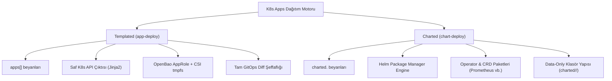
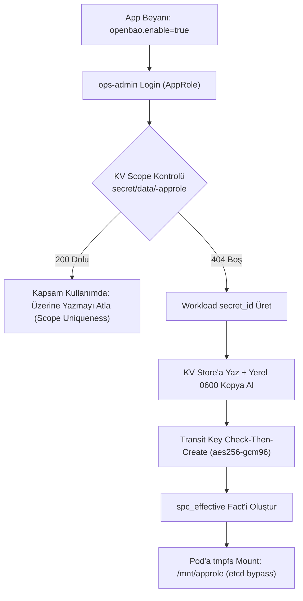
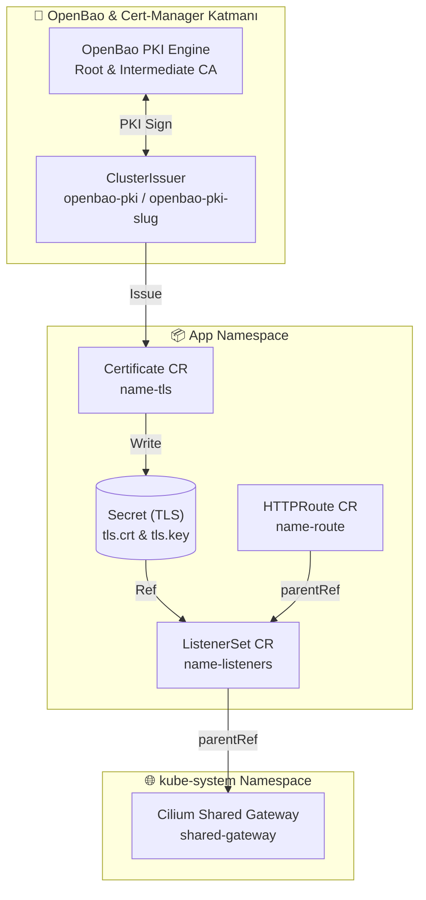
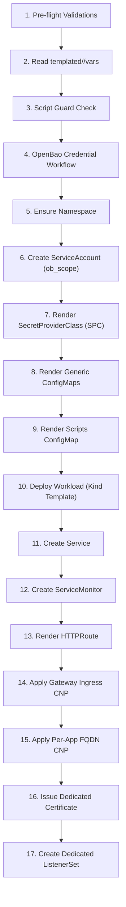
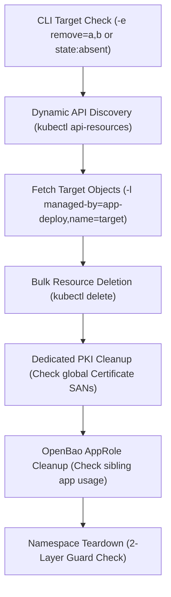
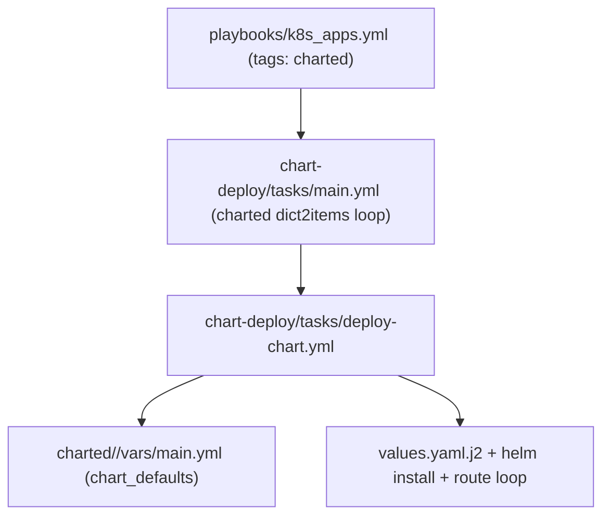

# K8s Apps Mimarisi ve Yaşam Döngüsü Rehberi (Internal Developer Platform & App Engine)

> **Kapsam ve Bağlayıcılık:** Bu doküman, `Cloud-in-Lab` platformu bünyesindeki Kubernetes kümesine uygulama beyanını, dağıtımını (`app-deploy`), kaldırılmasını (`app-remove`), Helm tabanlı harici ekosistem yönetimini (`chart-deploy`), güvenlik entegrasyonlarını (OpenBao, Cilium CNI, cert-manager, Gateway API) ve şablonlama mimarisini içeren uygulama katmanının (L3+) **tek teknik ve mimari referans belgesidir**. Altyapı kurulum süreçleri (L0–L2) `docs/tr/architecture/k8s-design.md` dokümanındadır.

---

<details>
<summary><strong>İçindekiler</strong></summary>

- [1. Mimari Bakış ve Mühendislik Prensipleri](#1-mimari-bakış-ve-mühendislik-prensipleri)
  - [1.1 Mimari Amaç ve Platform Kapsamı](#11-mimari-amaç-ve-platform-kapsamı)
  - [1.2 Temel Mühendislik Prensipleri ve Trade-Off Analizi](#12-temel-mühendislik-prensipleri-ve-trade-off-analizi)
  - [1.3 Dağıtım Stratejisi: Templated (`app-deploy`) vs Charted (`chart-deploy`)](#13-dağıtım-stratejisi-templated-app-deploy-vs-charted-chart-deploy)
- [2. Değişken Şeması, Yapılandırma Hiyerarşisi ve App Sözleşmesi](#2-değişken-şeması-yapılandırma-hiyerarşisi-ve-app-sözleşmesi)
  - [2.1 Konfigürasyon Hiyerarşisi ve Sorumluluk Ayrımı](#21-konfigürasyon-hiyerarşisi-ve-sorumluluk-ayrımı)
  - [2.2 Çekirdek Alanlar ve Default Değerler](#22-çekirdek-alanlar-ve-default-değerler)
  - [2.3 OpenBao ve İsteğe Bağlı Alanlar Şeması](#23-openbao-ve-isteğe-bağlı-alanlar-şeması)
  - [2.4 Templated Klasör Yapısı (`templated/<app>/`)](#24-templated-klasör-yapısı-templatedapp)
  - [2.5 Pass-Through Template Pattern](#25-pass-through-template-pattern)
- [3. Alt Sistem ve Güvenlik Mimarisi (Deep-Dive Engineering)](#3-alt-sistem-ve-güvenlik-mimarisi-deep-dive-engineering)
  - [3.1 Zero-Trust Ephemeral Identity: OpenBao Self-Service Credential Akışı](#31-zero-trust-ephemeral-identity-openbao-self-service-credential-akışı)
  - [3.2 TLS, Domain Mimarisi & Gateway API Entegrasyonu](#32-tls-domain-mimarisi--gateway-api-entegrasyonu)
  - [3.3 Ağ Güvenlik Modeli & Cilium CNI Entegrasyonu](#33-ağ-güvenlik-modeli--cilium-cni-entegrasyonu)
- [4. İş Yükü Yaşam Döngüsü (Lifecycle Engine)](#4-iş-yükü-yaşam-döngüsü-lifecycle-engine)
  - [4.1 Deploy Çalışma Akışı (17 Sıralı Adım)](#41-deploy-çalışma-akışı-17-sıralı-adım)
  - [4.2 Workload Kind Matrisi](#42-workload-kind-matrisi)
  - [4.3 Remove Akışı ve Temiz Yıkım (Teardown)](#43-remove-akışı-ve-temiz-yıkım-teardown)
- [5. Kod Mimarisi, Helper'lar ve Şablonlama Tekniği](#5-kod-mimarisi-helperlar-ve-şablonlama-tekniği)
  - [5.1 Pre-flight Validasyon Katmanları](#51-pre-flight-validasyon-katmanları)
  - [5.2 Helper Sistemi ve Python Filter Plugin](#52-helper-sistemi-ve-python-filter-plugin)
  - [5.3 Template Çift Değişken Seti (`httproute.yaml.j2`)](#53-template-çift-değişken-seti-httprouteyamlj2)
- [6. Charted (Helm) Mimarisinde Dispatcher Pattern](#6-charted-helm-mimarisinde-dispatcher-pattern)
  - [6.1 Veri Birleştirme ve Values Seçimi](#61-veri-birleştirme-ve-values-seçimi)
- [7. Referans Uygulamalar, Dosya Haritası ve Operasyonel Rehber](#7-referans-uygulamalar-dosya-haritası-ve-operasyonel-rehber)
  - [7.1 Referans Uygulama Beyanları (`group_vars/all/k8s_apps.yml`)](#71-referans-uygulama-beyanları-group_varsallk8s_appsyml)
  - [7.2 Proje Dosya Haritası](#72-proje-dosya-haritası)
  - [7.3 Operasyonel CLI Çalıştırma Rehberi](#73-operasyonel-cli-çalıştırma-rehberi)

</details>

## 1. Mimari Bakış ve Mühendislik Prensipleri

### 1.1 Mimari Amaç ve Platform Kapsamı

Uygulama katmanının temel amacı, geliştiricilere ve sistem yöneticilerine karmaşık Kubernetes manifestleri yazmadan, yalnızca **deklaratif beyanlar (SSOT)** üzerinden güvenli, standartlaştırılmış ve tam ölçeklenebilir iş yükleri yayınlama imkânı sunmaktır. `ansible/inventory/group_vars/all/k8s_apps.yml` dosyası sistemin tek hakikat kaynağıdır (Single Source of Truth - SSOT).

```
+---------------------------------------------------------------------------------+
|                       group_vars/all/k8s_apps.yml (SSOT)                        |
+---------------------------------------+-----------------------------------------+
                                        |
                   +--------------------+--------------------+
                   |                                         |
                   v                                         v
     +---------------------------+             +---------------------------+
     |     apps[] (Templated)    |             |     charted (Charted)     |
     |   - Jinja2 + Saf K8s API  |             |   - Helm Package Manager  |
     |   - Ephemeral CSI & AppRole|             |   - Operator / CRD Stacks |
     +--------------+------------+             +--------------+------------+
                    |                                         |
                    v                                         v
         roles/k8s-apps/app-deploy                 roles/k8s-apps/chart-deploy
```

### 1.2 Temel Mühendislik Prensipleri ve Trade-Off Analizi

Platform altı temel mimari ilke üzerine inşa edilmiştir:

| Mühendislik İlkesi | Teknik Anlamı ve Mühendislik Gerekçesi (Why) | Sistemdeki Somut Karşılığı |
|---|---|---|
| **Convention over Configuration** | Standart bir uygulama birkaç satır beyanla kurulur. Özel durumlar merkezi yapıyı bozmadan `templated/<app>/` alanına çıkar. Geliştirici bilişsel yükünü (cognitive load) en aza indirir. | Minimal `apps[]` tanımı; otomatik adlandırma, varsayılan port ve etiket türetimi. |
| **Fail-Loud** | Bozuk veya uyumsuz girdi `kubectl apply` komutundan önce Ansible `assert` görevleriyle tespit edilir ve süreç durdurulur. Kümede yarım/yetim (orphan) nesne bırakılmaz. | Pre-flight girdi doğrulamaları (`assert`). |
| **Zero-Trust Ephemeral Identity** | Kubernetes Secret'ları `etcd` veri tabanına düz metin olarak yazılmaz. Pod kimlikleri OpenBao AppRole + Secrets Store CSI Driver üzerinden `tmpfs` RAM disk mount'u ile sağlanır. | `secretObjects` sync kapalı OpenBao CSI entegrasyonu. |
| **Non-Breaking Schema Extension** | Şablonlar Kubernetes API'sini kısıtlamaz. Tanımsız alanlar atlanır, tanımlı alanlar ham (raw) olarak render edilir. Platform güncellemeleri uygulamaları kilitlenmez. | Pass-Through Template Pattern (`to_nice_yaml`). |
| **Default-Deny Network** | Varsayılan ağ erişimi giriş ve çıkış yönünde kapalıdır. Trafik yalnızca açıkça bildirilmiş `expose` veya `egress_fqdn` beyanlarıyla açılır. | Cilium CNI Default-Deny ve dinamik FQDN politikaları. |
| **Deploy / Remove Ayrımı** | Kurulum (`app-deploy`) ve kaldırma (`app-remove`) bağımsız iki dünya olarak çalışır. Canlı durum yalnızca kümeden okunur (`kubectl get`). | `enable: true` ve `state: absent` bayraklarının çelişki üretmeden bağımsız play'lerde çalışması. |

> **Bilinçli Mimari Sınır (Kritik Nuans):** `state: absent` veya `enable: false` değerleri canlı küme durumunu göstermez. Sistem hiçbir zaman konfigürasyon dosyasına bakarak "Bu uygulama şu an kurulu mu?" varsayımında bulunmaz; canlı durum her zaman Kubernetes API server üzerinden dinamik sorgulanır. Bir uygulama hem `enable: true` hem `state: absent` olabilir; bu bir çelişki değildir, çalıştığı play'in sorusuna yanıt verir.

### 1.3 Dağıtım Stratejisi: Templated (`app-deploy`) vs Charted (`chart-deploy`)

Uygulama katmanı iş yükünün doğasına göre iki farklı dağıtım deseni sunar:



1. **Templated (`app-deploy`):** Şirket içi geliştirilen mikroservisler (.NET Web API, Python iş parçacıkları, Redis vb.) için tercih edilir. Helm state takibinin bu ölçekte getirdiği ek karmaşıklık bertaraf edilerek Jinja2 ile saf Kubernetes manifestleri üretilir. GitOps `diff` üretilen her nesneyi tek YAML dosyasında şeffaf bir şekilde gösterir.
2. **Charted (`chart-deploy`):** CRD ve Operator içeren harici ve karmaşık ekosistemler (ör. `kube-prometheus-stack`) için kullanılır. Helm burada bir mimari kural değil, upstream paket güncelliğini izole eden bir paket yöneticisidir. `charted/<key>/` klasörleri yalnız veri/şablon taşır (`data-only`), task içermez.

---

[↑ Başa dön](#k8s-apps-mimarisi-ve-yaşam-döngüsü-rehberi-internal-developer-platform--app-engine)

## 2. Değişken Şeması, Yapılandırma Hiyerarşisi ve App Sözleşmesi

### 2.1 Konfigürasyon Hiyerarşisi ve Sorumluluk Ayrımı

Sistemdeki konfigürasyon üç farklı katmandan beslenir ve kural nettir: **"vars işaret eder, app beyan eder"**.

1. **App Beyanı (`group_vars/all/k8s_apps.yml` -> `apps[]`):** Uygulamanın ne olduğu ve motor girdileri (`command`, `port`, `image`, `egress_fqdn`) buradadır.
2. **Templated Vars (`templated/<app>/vars/main.yml`):** İçerik işaretçileri (`openbao_script_file`, `openbao_mount`, `openbao_key`) buradadır.
3. **Charted Override (`group_vars/all/k8s_apps.yml` -> `charted.<key>`):** Chart varsayılanlarını (`charted/<key>/vars/main.yml`) `combine(recursive=true)` yöntemiyle ezen kullanıcı konfigürasyonudur.

### 2.2 Çekirdek Alanlar ve Default Değerler

`app-deploy/tasks/main.yml` her uygulama girdisini düz (flat) task değişkenlerine dönüştürür; şablonlar bu düz değişkenleri okur:

| Alan | Tip | Default | Görevi | Kullanan Adımlar |
|---|---|---|---|---|
| `name` | String | *Zorunlu* | Uygulama adı; tüm K8s nesne adları ve isim sözleşmeleri buradan türer. | Her şablon ve görev |
| `image` | String | *Zorunlu* | Container imajı ve etiketi. | Workload şablonları |
| `enable` | Boolean | `false` | Deploy döngü filtresi (`selectattr enable equalto true`). | `main.yml` |
| `state` | String | `present` | Remove hedefi belirleyici (`present` / `absent`). | `app-remove/main.yml` |
| `kind` | String | `deployment` | Workload türü (`deployment`, `statefulset`, `job`, `cronjob`). | `deploy-app.yml` |
| `namespace` | String | `app.name` | Nesnelerin yerleşeceği izole namespace. | Her şablon |
| `port` | Integer | `80` | Service dış portu. | `service.yaml.j2`, `httproute.yaml.j2` |
| `container_port` | Integer | `app.port \| 80` | Pod içi dinlenen port (Service targetPort). | Workload şablonları, `service.yaml.j2` |
| `replicas` | Integer | `1` | Deployment veya StatefulSet replika sayısı. | Workload şablonları |
| `hostnames` | String/List | `app.name` | HTTPRoute ve Certificate için hostname listesi; virgüllü string ise split edilir. | `httproute.yaml.j2`, `certificate.yaml.j2` |
| `use_base_domain` | Boolean | `true` | Hostname sonuna `base_domain` eklensin mi? | HTTPRoute, Certificate |
| `expose` | Boolean | `true` | HTTPRoute + Gateway CNP üretimi (dedicated TLS ise ListenerSet de). | `deploy-app.yml` |
| `schedule` | String | `''` | CronJob için CRON zamanlama ifadesi (*CronJob'da zorunlu*). | `cronjob.yaml.j2` |

### 2.3 OpenBao ve İsteğe Bağlı Alanlar Şeması

```yaml
# OpenBao Konfigürasyon Bloğu
openbao:
  enable: true                 # OpenBao credential üretimi aktif edilir
  profile: transit-user        # Çalışma profili (reader, job-run, transit-user, operator vb.); profil başına tek rol, izolasyon identity-template ile; TTL'ler katalogda sabit (`openbao_workload_profiles`: `token_ttl`/`token_max_ttl` + `renewable` → service/batch token)
  scope: myapp                 # KV ve Transit key adlandırma kapsamı (deploy'da kapsam her zaman `app.name`; `scope` yalnız remove AppRole guard'ında okunur)
  scope_level: app             # Kapsam seviyesi (app / namespace - test edilmedi)

# İsteğe Bağlı Özelleştirmeler
spc: {}                        # Elle verilen SecretProviderClass (boşsa spc_effective kullanılır)
configmaps:                    # Generic ConfigMap listesi
  - name: custom-config
    data:
      app.json: '{"env": "prod"}'
monitoring:
  serviceMonitor:
    enabled: true              # Prometheus ServiceMonitor üretir
    path: /metrics
    interval: 30s
    scrapeTimeout: 10s
egress_fqdn:                   # Per-app Dış Ağ Erişim İzinleri
  - match: "api.stripe.com"
  - pattern: "*.pypi.org"
    ports: [443]
allow_script_mismatch: false   # Script guard kaçış kapısı
tls:
  mode: dedicated              # TLS modu: shared (default) veya dedicated
  duration: 2160h              # Sertifika geçerlilik süresi (90 gün)
  renewBefore: 360h            # Yenileme penceresi (15 gün)
  keyAlgorithm: ECDSA          # Dedicated anahtar algoritması (ECDSA / RSA)
  keySize: 384                 # Anahtar boyutu
  issuerName: ""               # Otomatik issuer seçimini ezen isteğe bağlı alan
  domains: []                  # Certificate'ın kullanacağı özel domain listesi (`tls_domains` flat değişkeni; default: hostnames)
```

### 2.4 Templated Klasör Yapısı (`templated/<app>/`)

Her uygulama için isteğe bağlı olarak özel bir klasör oluşturulabilir; `deploy-app.yml` `include_vars` ile yükler, klasör yoksa sessizce atlanır:

* `vars/main.yml`: Uygulamaya özgü özel işaretçi değişkenleri barındırır (`openbao_` öneki zorunlu değildir).
* `files/<script>`: İş yükünün çalıştıracağı Python veya Bash scriptlerini tutar; `lookup('file')` ile ConfigMap'e konur.
* `alerts/`: İsteğe bağlı olarak kayıt amaçlı `PrometheusRule` manifestlerini saklar (elle `kubectl apply -f openbao-alerts.yaml -n monitoring` ile uygulanır).

`transit-envelope-b` referans uygulaması değişken dosyası (`templated/transit-envelope-b/vars/main.yml`):

```yaml
openbao_spc_role: k8s-csi-provider
openbao_scripts_cm: transit-envelope-b-scripts
openbao_script_file: envelope.py
openbao_mount: transit
openbao_key: app-key            # Türetilen transit key: transit-envelope-b-app-key
openbao_approle_role_id_path: /mnt/approle/role_id
openbao_approle_secret_id_path: /mnt/approle/secret_id
```

### 2.5 Pass-Through Template Pattern

Workload şablonları, Kubernetes API'sinde karşılığı olan alanları **verilirse render eder, verilmezse atlar**. Şablon motoru tüm alanları `` bloğu ve `to_nice_yaml` filtresi ile sarmalar. Böylece platform şablonu güncellenmeden K8s API'sine gelen yeni bir alan ham injection ile kullanılabilir.

```jinja2
{# Pass-Through Örneği: Probes & Resources #}


          livenessProbe:
{{ probes.liveness | to_nice_yaml(indent=2) | indent(12) }}


          readinessProbe:
{{ probes.readiness | to_nice_yaml(indent=2) | indent(12) }}


```

---

[↑ Başa dön](#k8s-apps-mimarisi-ve-yaşam-döngüsü-rehberi-internal-developer-platform--app-engine)

## 3. Alt Sistem ve Güvenlik Mimarisi (Deep-Dive Engineering)

### 3.1 Zero-Trust Ephemeral Identity: OpenBao Self-Service Credential Akışı

Uygulama katmanı, `etcd` veri tabanına statik şifre yazılmasını engellemek amacıyla OpenBao AppRole entegrasyonu ve Secrets Store CSI Driver kullanır. Kök token asla kullanılmaz; tüm işlemler `ops-admin` AppRole token'ı üzerinden yürütülür.



#### Credential Üretim Akış Adımları (`openbao-workflow.yml`)

1. **Mount Config Yükleme:** `outputs/openbao/openbao-mount.json` okunarak KV ve AppRole mount yolları belirlenir.
2. **ops-admin Oturumu:** `outputs/openbao/ops-admin.json` kimlik bilgisiyle OpenBao üzerinde oturum açılır (`bao_token`).
3. **Scope Çakışma Kontrolü:** `secret/data/<scope>-approle` adresi sorgulanır. `200` dönerse çakışmayı önlemek için adımlar atlanır. `404` dönerse yeni kimlik üretimi başlar.
4. **Workload Secret-ID Üretimi (`produce-workload-creds`):** Profil tanımına göre yeni bir `secret_id` üretilir, yerel `outputs/openbao/<scope>-approle.json` dosyasına (`0600` izni, `no_log`) ve OpenBao KV mağazasına yazılır.
5. **Transit Key Kurulumu (`produce-transit-key`):** `openbao_mount` tanımlıysa `<scope>-<openbao_key>` adıyla `aes256-gcm96` tipinde, `exportable: false` olarak Check-Then-Create deseniyle oluşturulur.
6. **CSI SPC Kurulumu (`read-workload-creds`):** `<scope>-approle.json` okunur ve `spc_effective` nesnesi oluşturularak Pod'a `/mnt/approle` adresi altına `tmpfs` (RAM disk) olarak mount edilir.

```yaml
# Üretilen SecretProviderClass (SPC) Manifesti
apiVersion: secrets-store.csi.x-k8s.io/v1
kind: SecretProviderClass
metadata:
  name: myapp-approle
  namespace: myapp
spec:
  provider: openbao
  parameters:
    roleName: "k8s-csi-provider"
    audience: "openbao"                # OpenBao JWT doğrulama için ZORUNLUDUR (aksi halde 403)
    objects: |
      - objectName: "role_id"
        secretPath: "secret/data/myapp-approle"
        secretKey: "role_id"
      - objectName: "secret_id"
        secretPath: "secret/data/myapp-approle"
        secretKey: "secret_id"
```

> **Kritik Güvenlik Kararı:** `SecretProviderClass` nesnesinde `secretObjects` (Kubernetes Secret Sync) bloğu bilinçli olarak **tanımlanmamıştır**. Böylece kimlik bilgileri hiçbir zaman etcd üzerinde kalıcı hale gelmez; CSI driver OpenBao KV path'inden okuyup doğrudan pod'un RAM belleğindeki `tmpfs` alanına yazar.

### 3.2 TLS, Domain Mimarisi & Gateway API Entegrasyonu

Gateway'de iki listener daima aktiftir: `http` (80) ve `https` (443). HTTP->HTTPS yönlendirmesi `tls_mode` (`allow-http` dev, `redirect` prod) ile küme genelinde yönetilir. TLS yönetimi Gateway API v1.3+ ve cert-manager mimarisi üzerinden iki ayrı modda yürütülür:

| Özellik | Shared TLS Modu (Default) | Dedicated TLS Modu |
|---|---|---|
| **Sertifika Kapsamı** | Wildcard `*.tofu.lan` | Uygulamaya özel dedicated sertifika |
| **Sertifika Konumu** | `kube-system/gateway-tls` | Uygulamanın kendi namespace'inde `{name}-tls` |
| **Yönlendirme Nesnesi** | HTTPRoute -> `shared-gateway` | HTTPRoute -> `{name}-listeners` ListenerSet |
| **Cross-Namespace Secret** | İhtiyaç yok | Yok (ListenerSet sayesinde `ReferenceGrant` gerekmez) |
| **Kullanım Senaryosu** | Standart iç servisler (`base_domain` altı) | Dış domainler, özel ECDSA anahtarlar |



#### Dedicated Dış Domain Ön-Hazırlığı (`dedicated-pki-domains.yml`)

Uygulama `use_base_domain: false` ve `tls.mode: dedicated` olarak tanımlandığında (örneğin `echo3.lab.internal`), sistem `pki-manager` AppRole kimliği ile ön-adım çalıştıp otomatik olarak özel PKI rolü ve `ClusterIssuer` kurar:

1. Hostname üzerindeki ilk label atılıp benzersiz domain listesi türetilir (`echo3.lab.internal` -> `lab.internal`).
2. OpenBao üzerinde `pki-int/roles/dedicated-lab-internal` rolü kurulur (`max_ttl 2160h`, `key_type ec`, `key_bits 384`).
3. Küme genelinde `openbao-pki-lab-internal` adıyla yeni bir `ClusterIssuer` yayınlanır.

#### Mimari Karar: Gateway Certificate CR vs Annotation Tercih Sebebi

Gateway üzerinde cert-manager annotation'ları (`cert-manager.io/*`) yerine **ayrı Certificate CR ve ListenerSet** mimarisi seçilmiştir. Kararın gerekçeleri:

| Açı | Annotation Yaklaşımı | Ayrı Certificate CR + ListenerSet (Mevcut Mimari) |
|---|---|---|
| **Sertifika Kontrolü** | Annotation ile sınırlı parametre yönetimi. | `duration/renewBefore/privateKey` tam kontrol. |
| **Çoklu Sertifika** | Gateway annotation'ı tek bir Secret üretir. | Shared wildcard sertifikaya ek olarak uygulamalar kendi ListenerSet'i ile self-service sertifika ekler. |
| **Hot-Reload & Cilium** | Gateway reconcile olur, opak durumlara sebep olabilir. | Sertifika Secret'ı güncellendiğinde Cilium Envoy proxy'si TLS Secret değişimini dynamic hot-reload ile anında yükler. |
| **GitOps Diff** | Otomatik oluşan kaynaklar diff'i gizler. | Her CR kendi GitOps diff'inde şeffaf görünür. |

> **Statik Gateway referansı:** Gateway `certificateRefs` listesi yalnız wildcard `gateway-tls` Secret'ına bakar; dinamik sertifika listesi üreten değişken yoktur. Wildcard dışı ihtiyaç Gateway'de değil, dedicated app'in kendi Certificate + ListenerSet'inde karşılanır — shared Gateway sabit kalır.

> **İzleme notu:** Sertifika bitişlerini izlemek için `certmanager_certificate_expiration_timestamp_seconds` metriğiyle son 7 güne giren sertifikalara uyarı kurulabilir; TLS el sıkışma ve SNI eşleşmeleri Hubble L7 akış izlemede görülür.

### 3.3 Ağ Güvenlik Modeli & Cilium CNI Entegrasyonu

Sistemde varsayılan ağ erişimi **Global Default-Deny** politikası ile kapalıdır (`global-default-deny-all`). DNS bu yasağın dışındadır ve küme genelinde açıktır (`global-allow-essential-dns`, TCP/UDP 53); Envoy'dan pod'a giriş bu ara kurallara dayanır. Uygulamalar ihtiyaç duydukları erişimleri beyan ederek ağ politikalarını (CNP) otomatik ürettirirler.

```
                  +-----------------------------------+
                  |   Global Default-Deny Policy      |
                  +-----------------+-----------------+
                                    |
            +-----------------------+-----------------------+
            |                       |                       |
            v                       v                       v
+-----------------------+ +-----------------------+ +-----------------------+
|  OpenBao Egress Label | | Gateway Envoy         | | Per-App FQDN Egress   |
|  homelab.io/allow...  | | Ingress Policy        | | egress_fqdn[]       |
|  -> TCP 8200          | | -> reserved:ingress  | | -> pypi.org (TCP 443) |
+-----------------------+ +-----------------------+ +-----------------------+
```

#### Cilium 1.20 Deny-All Sözleşmesi ve Dummy Endpoint Tekniği

Cilium 1.20+ CRD doğrulayıcıları boş `ingress: []` veya `egress: []` dizilerini geçersiz (`Valid: False`) kabul eder. Geçerli bir varsayılan kapatma kuralı oluşturmak için sistem **dummy endpoint** etiketi kullanır:

```yaml
# security/templates/cilium-default-deny.yaml.j2
apiVersion: "cilium.io/v2"
kind: CiliumNetworkPolicy
metadata:
  name: "app-default-deny"
spec:
  endpointSelector: {}
  ingress:
    - fromEndpoints:
        - matchLabels:
            k8s:non-existent: "true"   # Hiçbir pod ile eşleşmez, kuralı Valid True yapar
  egress:
    - toEndpoints:
        - matchLabels:
            k8s:non-existent: "true"
```

Gateway Envoy kaynağının (`reserved:ingress`) web uygulamalarına ulaşabilmesi için `allow-gateway-egress-<name>` CNP'si üretilir; aksi takdirde Cilium Envoy L7 katmanında `403 server: envoy Access denied` hatası döner.

---

[↑ Başa dön](#k8s-apps-mimarisi-ve-yaşam-döngüsü-rehberi-internal-developer-platform--app-engine)

## 4. İş Yükü Yaşam Döngüsü (Lifecycle Engine)

### 4.1 Deploy Çalışma Akışı (17 Sıralı Adım)

Uygulama yayına alınırken bağımlılık sıralaması kritik önem taşır. İş yükü (Pod), ihtiyaç duyduğu Namespace, ServiceAccount, SPC ve ConfigMap nesnelerini **ilk denemesinde** yerinde bulmalıdır. Render edilen tüm YAML dosyaları `/tmp/app-<name>-<obje>.yaml` konumuna yazılır ve `kubectl apply -f` ile uygulanır (`kubectl apply` idempotent olduğundan tekrar koşu güvenlidir; `changed_when: false` raporlamayı sessizleştirir).



#### Adım Adım Üretim Matrisi (`deploy-app.yml`)

| Adım | İşlem / Nesne | Çalışma Koşulu | Üretim Amacı |
|---|---|---|---|
| **1** | Pre-flight Assertions | Her zaman | Eksik/hatalı girdileri K8s'e gitmeden durdurur (`name`+`image` zorunlu, `kind` geçerli, cronjob'da `schedule` zorunlu, hostname boş değil, `egress_fqdn` girdisinde `match`/`pattern` zorunlu). |
| **2** | Vars Yükleme | Klasör varsa | `templated/<app>/vars/main.yml` dosyasını okur. |
| **3** | Script Guard | `command`/`args` doluysa + `openbao_script_file` tanımlıysa (`allow_script_mismatch: false` iken) | `openbao_script_file` eşleşmesini doğrular. |
| **4** | OpenBao Workflow | `openbao.enable: true` + `profile != none` | Credential ve `spc_effective` üretir. |
| **5** | Namespace | Her zaman | İzole çalışma alanı oluşturur. |
| **6** | ServiceAccount | `openbao.enable: true` | CSI provider için pod kimliği (`ob_scope`). |
| **7** | SecretProviderClass | SPC veya `spc_effective` doluysa | RAM disk secret aktarım tanımı. |
| **8** | Generic ConfigMaps | `configmaps[]` doluysa | Uygulama konfigürasyon dosyaları. |
| **9** | Scripts ConfigMap | Script dosyası varsa | Script gövdesini `/scripts` dizinine bağlar. |
| **10** | Workload Manifest | Her zaman | Deployment, StatefulSet, Job veya CronJob (şablon dosyası `common/templates/{{ kind }}.yaml.j2` ile seçilir). |
| **11** | Service | Deployment/StatefulSet | Küme içi kararlı IP:port adresi. |
| **12** | ServiceMonitor | Deployment/Sts + `serviceMonitor.enabled` | Prometheus scrape tanımı. |
| **13** | HTTPRoute | Deployment/Sts + `expose` | Gateway API trafik yönlendirmesi. |
| **14** | Gateway Ingress CNP | Deployment/Sts + `expose` | Envoy proxy'den pod'a giriş izni. |
| **15** | FQDN Egress CNP | `egress_fqdn[]` doluysa | Pod'dan dış dünyaya çıkış izni (kind bağımsız). |
| **16** | Certificate | Deployment/Sts + `tls.mode: dedicated` + `expose` | Dedicated sertifika talebi. |
| **17** | ListenerSet | Deployment/Sts + `tls.mode: dedicated` + `expose` | Dedicated HTTPS portu ve TLS sonlandırma. |

#### Motor Tarafından Otomatik Yapılan Enjeksiyonlar

* **Etiketleme:** Üretilen tüm nesneler `app.kubernetes.io/managed-by: app-deploy` ve `app.kubernetes.io/name: <name>` taşır. Tek istisna Namespace'tir: etiketsiz üretilir, remove onu guard'lı özel akışla siler.
* **OpenBao Egress Label:** `openbao.enable: true` ise Pod'a `homelab.io/allow-openbao-egress: "true"` etiketi basılır (CCNP üzerinden 8200 portu açılır).
* **OpenBao Ortam Değişkenleri:** Job ve Deployment kaplarına `OPENBAO_ADDR`, `APPROLE_ROLE_ID_PATH` (`/mnt/approle/role_id`), `APPROLE_SECRET_ID_PATH` (`/mnt/approle/secret_id`) enjekte edilir; Job'lara ek olarak `TRANSIT_MOUNT` ve `TRANSIT_KEY` eklenir.
* **Scripts Varsayılan Komutu:** Scripts-CM tanımlıysa `/scripts` mount edilir; app `command` vermediyse default `["python", "/scripts/<openbao_script_file>"]` koşar.

#### Üretilen Nesnelerin Görev Özeti

| Nesne | Görevi | Bağlandığı yer |
|---|---|---|
| **Namespace** | App'e izole çalışma alanı açar | — |
| **ServiceAccount** | CSI provider için pod kimliği (`ob_scope`) | OpenBao `auth/kubernetes` |
| **SecretProviderClass** | Pod→OpenBao tmpfs secret akışının tanımı (`secretObjects` sync yok) | OpenBao CSI |
| **ConfigMap (generic/scripts)** | Ayar dosyaları; script gövdesini `/scripts` altına bağlar | Workload |
| **Deployment/StatefulSet** | Kalıcı servis | Service → HTTPRoute → Gateway |
| **Job/CronJob** | Tek seferlik / zamanlı iş | — |
| **Service** | Kararlı IP:port (`port`/`container_port`) | HTTPRoute backend |
| **ServiceMonitor** | Prometheus scrape tanımı | kube-prometheus-stack |
| **HTTPRoute** | Hostname→servis rotası | Gateway veya `<name>-listeners` |
| **Gateway-CNP** | Envoy'dan pod'a giriş izni | Cilium |
| **FQDN-CNP** | Beyan edilen dış hedeflere çıkış izni | Cilium |
| **Certificate (`<name>-tls`)** | App'e özel sertifika talebi | Issuer → ListenerSet |
| **ListenerSet** | Dedicated TLS sonlandırma | Gateway (`kube-system`) |
| **ClusterIssuer (`openbao-pki-<slug>`)** | Dış domain imzalayıcısı | cert-manager |

### 4.2 Workload Kind Matrisi

Farklı Kubernetes iş yüklerinin desteklediği yetenekler:

| Yetenek | Deployment | StatefulSet | Job | CronJob |
|---|---|---|---|---|
| **Namespace** | ✅ | ✅ | ✅ | ✅ |
| **ServiceAccount** | ✅ (`openbao_enabled` ise) | ❌ | ✅ (`openbao_enabled` ise) | ❌ |
| **Service & HTTPRoute** | ✅ (expose ise) | ✅ (expose ise) | ❌ | ❌ |
| **ServiceMonitor** | ✅ | ✅ | ❌ | ❌ |
| **OpenBao Kablolaması** | ✅ (otomatik env/vol) | ❌ (*Desteklenmez*) | ✅ (otomatik env/vol) | ❌ (*Desteklenmez*) |
| **Scripts CM Otomasyonu** | ✅ | ❌ | ✅ | ❌ |
| **Per-App FQDN Egress** | ✅ | ✅ | ✅ | ✅ |

> **Bilinçli Mimari Sınır:** `statefulset` ve `cronjob` şablonları OpenBao otomatik env/volume kablolaması içermez. `statefulset`/`cronjob` + `openbao.enable: true` kombinasyonu şablonlar genişletilmeden desteklenmez.

### 4.3 Remove Akışı ve Temiz Yıkım (Teardown)

Silme işlemi envanter dosyasına değil, **doğrudan kümedeki etikete (`app.kubernetes.io/managed-by=app-deploy, app.kubernetes.io/name=<hedef>`)** dayanır. CLI üzerinden `-e remove="a,b"` verildiyse envanterdeki `state: absent` listesi yerine CLI kazanır.



#### Silme Güvenlik Guard'ları (`app-remove`)

1. **Dinamik Kaynak Keşfi (`delete-k8s-objects.yml`):** Silinecek nesne türleri elle yazılmaz; `kubectl api-resources --verbs=delete --namespaced -o name` komutuyla o anki kümeden dinamik çekilir (`events`, `endpoints`, `endpointslices`, `pods` hariç). Yeni bir CRD eklense dahi silme motoru onu otomatik kapsar. Listelenen tüm kaynaklar tek bir `kubectl delete` komutuyla toplu silinir. Etiketsiz kalıntı istisnası: eski sürümlerde üretilmiş `<hedef>-tls` Secret'ı (dedicated TLS koşulunda) isimden `--ignore-not-found` ile silinir; yeni sertifikalar `secretTemplate.labels` sayesinde etiketi taşıdığından label keşfine düşer.
2. **Dedicated PKI Temizliği (`delete-dedicated-pki.yml`):** Bir dış domain sertifikası silinmeden önce, kümedeki **tüm Certificate nesnelerinin (CR) SAN bilgileri** taranır. Eğer aynı domain'i kullanan başka bir aktif uygulama varsa PKI rolü ve ClusterIssuer **silinmez (Fail-Loud / Fail-Safe)**.
3. **AppRole Guard Temizliği (`delete-openbao-approle.yml`):** `apps[]` içinde aynı OpenBao AppRole adını paylaşan başka bir aktif uygulama (`state: present`) varsa AppRole silinmez. Kodda `target_app` hariç tutan özel bir filtre yoktur; hedef de sayıma girer — CLI ile silinip envanterde `present` kalmış bir hedef kendini sayar ve rol konservatif olarak korunur.

> **Açık nokta (kod-doğrulanmış):** Produce tarafı profil-adlı rol (`transit-user`) üzerinden secret-id üretirken remove tarafı `app-<scope>-<profile>` adlı rolü silmeye çalışır. Katalogda bu adla rol üretilmediğinden DELETE 404 döner (sessiz no-op) — profil rolünün paylaşımda silinmemesi doğrudur. Fakat KV girdisinin (`<scope>-approle`) ve controller çıktısının (`outputs/openbao/<scope>-approle.json`) remove'da temizlenip temizlenmediği canlı teyit edilmemiştir.
4. **İki Katmanlı Namespace Temizliği:**
   * *1. Katman (Envanter Guard'ı):* `apps[]` içinde o namespace'i kullanan ve hâlâ `enable: true` olan başka uygulama var mı?
   * *2. Katman (Küme Guard'ı):* Namespace içinde sistem varsayılanları (`kube-root-ca.crt`, `serviceaccount/default`, `default-token-*`) dışında yabancı bir Kubernetes kaynağı kalmış mı?
   * İki guard da geçilirse namespace `timeout 150 kubectl delete namespace <ns> --wait=true` ile silinir. Silinmezse sırasıyla kontrol edilir: finalizers/conditions, `v1beta1.metrics.k8s.io` apiservice bozukluğu, metrics-server pod durumu (bilinen kök neden adayı: bozuk metrics-apiservice termination'ı engeller); ardından `finalizers: null` patch + `--wait=false` ile tekrar denenir, hâlâ olmazsa manuel müdahale gerekir.

---

[↑ Başa dön](#k8s-apps-mimarisi-ve-yaşam-döngüsü-rehberi-internal-developer-platform--app-engine)

## 5. Kod Mimarisi, Helper'lar ve Şablonlama Tekniği

### 5.1 Pre-flight Validasyon Katmanları

Girdi güvenliğini sağlayan 3 katmanlı mekanizma:

| Katman | Konum | Yöntem | Sorumluluk |
|---|---|---|---|
| **1. Primary (Birincil)** | `deploy-app.yml` | `ansible.builtin.assert` (boş-kontrol; regex yok) | Girdileri apply öncesi durdurur (boş hostname, eksik image vb.). |
| **2. Defensive (Savunmacı)** | `httproute.yaml.j2` | Jinja string→list normalizasyonu (template içinde `` yok) | Render sırasında hatalı değişken biçimini tolere eder. |
| **3. Reusable (Tekrar Kullanılabilir)** | `filter_plugins/k8s_helpers.py` | Python `validate_hostname()` | Tanımlı ama template'lerde kullanılmıyor; referans custom Python filtresi. |

```yaml
# deploy-app.yml - Primary Assertion Örneği (gerçek)
- name: Validate hostname format
  ansible.builtin.assert:
    that:
      - item | length > 0
    fail_msg: "{{ name }}: hostname formatini dogrulayin: {{ item }}"
  loop: "{{ hostnames.split(',') if hostnames is string else hostnames }}"
  when: hostnames is defined and hostnames | length > 0
```

> **Not:** `use_base_domain: false` için regex doğrulaması kodda mevcut değildir; hostname kontrolü boş-olmama denetimiyle sınırlıdır. `use_base_domain` bayrağı FQDN üretimi (`httproute.yaml.j2`), issuer seçimi (`certificate.yaml.j2`), `dedicated_hostname` türetme ve dış-domain filtrelemede (`dedicated-pki-domains.yml`) kullanılır.

### 5.2 Helper Sistemi ve Python Filter Plugin

Hesaplama mantığını Jinja2 şablonlarından çıkartıp Python koduna taşımak amacıyla role-local filtreler kullanılır (`roles/k8s-apps/app-deploy/filter_plugins/k8s_helpers.py`):

```python
# filter_plugins/k8s_helpers.py (gerçek kod)
import re
import unicodedata


class FilterModule:
    def filters(self):
        return {
            'validate_hostname': self.validate_hostname,
            'to_kubernetes_name': self.to_kubernetes_name,
            'arch_image': self.arch_image,
        }

    @staticmethod
    def validate_hostname(value):
        # bool döner, raise etmez
        if not isinstance(value, str):
            return False
        pattern = r'^[a-zA-Z0-9]([a-zA-Z0-9-]{0,61}[a-zA-Z0-9])?(\.[a-zA-Z0-9]([a-zA-Z0-9-]{0,61}[a-zA-Z0-9])?)*$'
        return bool(re.match(pattern, value))

    @staticmethod
    def to_kubernetes_name(value):
        value = unicodedata.normalize('NFKD', str(value)).encode('ASCII', 'ignore').decode('ascii')
        value = re.sub(r'[^a-zA-Z0-9-]', '-', value.lower())
        value = re.sub(r'-+', '-', value).strip('-')
        if len(value) > 253:
            value = value[:253].rstrip('-')
        if not value:
            value = 'default'
        return value

    @staticmethod
    def arch_image(repo, tag=None, arch=None):
        if arch:
            tag = f'{tag}-{arch}' if tag else arch
        return f'{repo}:{tag}' if tag else repo
```

### 5.3 Template Çift Değişken Seti (`httproute.yaml.j2`)

`httproute.yaml.j2` şablonu hem generic `app-deploy` çağrılarını hem de `chart-deploy` gibi spesifik çağrıları destekleyecek çift değişken mimarisine sahiptir (basitleştirilmiş özet; gerçek şablon `default('')` korumaları, `_use_bd`/`_fqdn_list` çözümlemesi ve dedicated parentRef dalı içerir):

```jinja2
{# Değişken Çözümleme Hiyerarşisi #}





```

---

[↑ Başa dön](#k8s-apps-mimarisi-ve-yaşam-döngüsü-rehberi-internal-developer-platform--app-engine)

## 6. Charted (Helm) Mimarisinde Dispatcher Pattern

Charted yol, `chart-deploy` dispatcher rolü ile `charted/<key>/` data-only klasörlerinin birleşiminden oluşur. Playbook içinde chart ismi bulunmaz; döngü rol içindedir.



### 6.1 Veri Birleştirme ve Values Seçimi

1. `charted/<key>/vars/main.yml` yüklenir (`chart_defaults`).
2. `chart_defaults | combine(charted[chart_key], recursive=true)` ile `chart_cfg` üretilir.
3. `release_name`, `chart`, `namespace` zorunlu alanları `assert` edilir.
4. Values seçimi: `charted/<key>/templates/values.yaml.j2` varsa o kullanılır; yoksa ve `chart_cfg.helm_values` doluysa `common/templates/helm-values.yaml.j2` iskeletine düşülür.
5. `helm_values` altına yazılan her şey values dosyasına birebir passthrough olarak basılır. Yanlış key Helm tarafından sessizce yutulur — `helm show values` ile doğrulayın.

```yaml
# Charted Konfigürasyon Örneği (group_vars/all/k8s_apps.yml)
charted:
  prom_stack:
    enable: true
    release_name: kube-prom-stack
    namespace: monitoring
    prometheus:
      subdomain: prometheus
      port: 9090
    grafana:
      enabled: true
      subdomain: grafana
      port: 80
      admin_password: "ChangeMe-2026"  # Boş bırakılırsa Helm randAlphaNum ile üretir
    alertmanager:
      enabled: true
      subdomain: alertmanager
      port: 9093
```

---

[↑ Başa dön](#k8s-apps-mimarisi-ve-yaşam-döngüsü-rehberi-internal-developer-platform--app-engine)

## 7. Referans Uygulamalar, Dosya Haritası ve Operasyonel Rehber

### 7.1 Referans Uygulama Beyanları (`group_vars/all/k8s_apps.yml`)

Platformun tüm yeteneklerini kanıtlayan referans konfigürasyon seti:

```yaml
apps:
  # 1. Standard Web App (Shared TLS)
  - name: echo-server
    enable: false
    state: absent
    image: ealen/echo-server:latest
    hostnames: ["echo"]                # -> echo.tofu.lan
    namespace: demo
    port: 80
    templateLabels:
      ingress-exposed: "true"

  # 2. Dedicated TLS Web App
  - name: echo2-server
    enable: false
    state: absent
    image: ealen/echo-server:latest
    hostnames: ["echo2"]               # -> echo2.tofu.lan için dedicated cert
    namespace: demo
    port: 80
    templateLabels:
      ingress-exposed: "true"
    tls:
      mode: dedicated

  # 3. Dedicated External Domain (Dış Domain + PKI Pre-check)
  - name: echo3-server
    enable: false
    state: absent
    image: ealen/echo-server:latest
    hostnames: ["echo3.lab.internal"] # Dış domain
    namespace: demo
    port: 80
    use_base_domain: false
    templateLabels:
      ingress-exposed: "true"
    tls:
      mode: dedicated
      keyAlgorithm: ECDSA
      keySize: 384

  # 4. OpenBao Bağlantı Kanıtı Job (CONNECTIVITY PASS)
  - name: transit-envelope-demo
    enable: false
    state: absent
    kind: job
    image: python:3.11-slim-bookworm
    namespace: transit-demo
    openbao:
      enable: true
      profile: transit-user

  # 5. Production Envelope Cryptography Job (OpenBao + FQDN Egress)
  - name: transit-envelope-b
    enable: false
    state: absent
    kind: job
    image: python:3.11-slim-bookworm
    namespace: transit-demo
    command: ["python", "/scripts/envelope.py"]
    openbao:
      enable: true
      profile: transit-user
    egress_fqdn:                       # PyPI erişim izni
      - match: "pypi.org"
      - pattern: "*.pythonhosted.org"
        ports: [443]
    backoffLimit: 2
    ttlSecondsAfterFinished: 300
    activeDeadlineSeconds: 120

  # 6. Internal Metrics Exporter (ServiceMonitor)
  - name: openbao-metrics-exporter
    enable: false
    state: absent
    image: python:3.11-slim-bookworm
    namespace: monitoring
    container_port: 9090
    port: 9090
    expose: false                      # Dışarıya kapalı, yalnız iç scrape
    openbao:
      enable: true
      profile: metrics-reader
    labels:
      homelab.io/allow-openbao-egress: "true"
    monitoring:
      serviceMonitor:
        enabled: true
        port: 9090
        path: /metrics
        interval: 30s
        scrapeTimeout: 10s
```

> **Not — `kind` yazılmayan app ne olur? (`openbao-metrics-exporter` örneği):** Bu örnekte `kind` alanı yoktur; motor `app.kind | default('deployment')` kuralıyla (`main.yml`) onu **deployment** sayar (§2.2 çekirdek alanlar tablosu). `expose: false` olduğundan web-path'in dışa dönük kısmı üretilmez, iç servis iskeleti tam kurulur. Üretilen nesneler: Namespace (`monitoring`), ServiceAccount + SPC (`openbao.enable: true` olduğundan OpenBao kablolaması), Deployment (OpenBao env/volume ve pod egress etiketi otomatik enjekte edilir), Service (`port`/`container_port: 9090`), ServiceMonitor (`monitoring.serviceMonitor.enabled` ile). Üretilmeyenler: HTTPRoute ve gateway-CNP (`expose: false`), Certificate/ListenerSet (aynı koşul; ayrıca shared modda app sertifikası gerekmez) ve FQDN-CNP (`egress_fqdn` beyan edilmedi). Hangi bloğun hangi kind'de üretildiği §4.2 kind matrisinde özetlidir.

#### Playbook Çalışma Zinciri

Deploy (`k8s_apps.yml`): connect → env-check → `openbao-env-check` → ded-PKI pre-check → charted → app-deploy. Remove (`k8s_apps_remove.yml`): connect → env-check → `openbao-env-check` → app-remove. `openbao-env-check` play'i, openbao etkin app'lerin credential akışı için zorunlu `openbao_address` fact'ini garantiler; fact yoksa openbao-workflow fail eder.

### 7.2 Proje Dosya Haritası

```text
ansible/
├── playbooks/
│   ├── k8s_apps.yml                   # Deploy ana orkestrasyon playbook'u
│   └── k8s_apps_remove.yml            # Remove ana orkestrasyon playbook'u
├── inventory/
│   └── group_vars/all/k8s_apps.yml    # TEK HAKİKAT KAYNAĞI (SSOT)
└── roles/k8s-apps/
    ├── app-deploy/                    # Generic Templated Deploy Rolü
    │   ├── defaults/main.yml          # base_domain, gateway_hostname, gateway_namespace, openbao_key, expose
    │   ├── filter_plugins/
    │   │   └── k8s_helpers.py         # Role-local custom Python filtreleri
    │   └── tasks/
    │       ├── main.yml               # Flat değişken türetimi ve döngü
    │       ├── deploy-app.yml         # 17 adımlı üretim görevleri
    │       ├── openbao-workflow.yml   # Credential orkestrasyonu
    │       ├── produce-workload-creds.yml # secret-id üretimi
    │       ├── produce-transit-key.yml # Transit key üretimi
    │       ├── read-workload-creds.yml # Credential okuma ve spc_effective
    │       └── dedicated-pki-domains.yml # Dış domain PKI ön-hazırlığı
    ├── app-remove/                    # Dinamik Temizlik Rolü
    │   └── tasks/
    │       ├── main.yml               # Hedef tespiti ve orkestrasyon
    │       ├── delete-k8s-objects.yml # Label tabanlı dinamik silme
    │       ├── delete-dedicated-pki.yml # Guard'lı PKI silme
    │       └── delete-openbao-approle.yml # Guard'lı AppRole silme
    ├── chart-deploy/                  # Charted Helm Dispatcher Rolü
    │   └── tasks/
    │       ├── main.yml               # Chart döngü filtresi
    │       └── deploy-chart.yml       # Helm install ve route bağlama
    ├── common/templates/              # Paylaşımlı Jinja2 Şablonları
    │   ├── namespace.yaml.j2, serviceaccount.yaml.j2, secretproviderclass.yaml.j2, configmap.yaml.j2
    │   ├── deployment.yaml.j2, statefulset.yaml.j2, job.yaml.j2, cronjob.yaml.j2
    │   ├── service.yaml.j2, servicemonitor.yaml.j2, httproute.yaml.j2
    │   ├── certificate.yaml.j2, listenerset.yaml.j2, cluster-issuer-dedicated.yaml.j2
    │   ├── cilium-allow-gateway-egress.yaml.j2, cilium-allow-egress-fqdn.yaml.j2
    │   ├── helm-values.yaml.j2        # Charted passthrough iskeleti
    │   └── helpers/_helpers.j2        # Jinja2 Makroları
    ├── templated/<app>/               # Özel uygulama vars/files klasörleri
    └── charted/<key>/                 # DATA-ONLY: Chart default'ları ve values şablonları
```

### 7.3 Operasyonel CLI Çalıştırma Rehberi

Komutlar `ansible/` dizini altından çalıştırılır:

```bash
# 1. Tüm Aktif Templated Uygulamaları Deploy Etme
ansible-playbook -i inventory/hosts.ini.generated playbooks/k8s_apps.yml --tags apps

# 2. Yalnızca Tek Bir Uygulamayı Deploy Etme (Filtreli)
ansible-playbook -i inventory/hosts.ini.generated playbooks/k8s_apps.yml --tags apps -e app_filter=transit-envelope-b

# 3. Charted (Helm) Ekosistemlerini Kurma
ansible-playbook -i inventory/hosts.ini.generated playbooks/k8s_apps.yml --tags charted

# 4. Yalnızca Tek Bir Chart Kurma
ansible-playbook -i inventory/hosts.ini.generated playbooks/k8s_apps.yml --tags charted -e chart_filter=prom_stack

# 5. Uygulama Kaldırma (state: absent olanları siler)
ansible-playbook -i inventory/hosts.ini.generated playbooks/k8s_apps_remove.yml

# 6. CLI Üzerinden Doğrudan Uygulama Silme (Envanterden bağımsız CLI hedefi)
ansible-playbook -i inventory/hosts.ini.generated playbooks/k8s_apps_remove.yml -e remove="echo-server,echo2-server"
```

[↑ Başa dön](#k8s-apps-mimarisi-ve-yaşam-döngüsü-rehberi-internal-developer-platform--app-engine)
