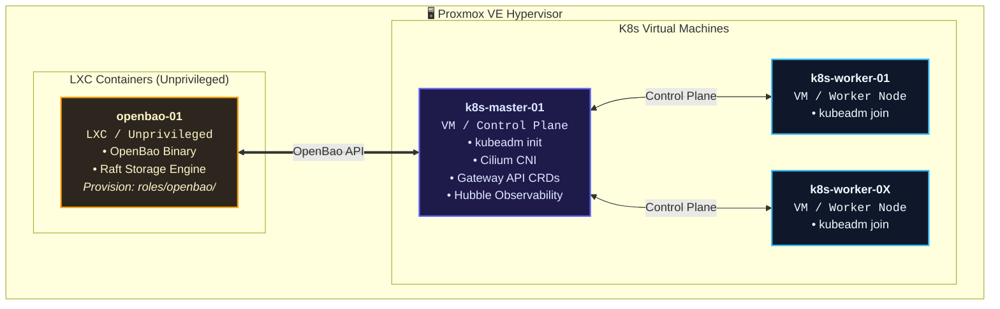
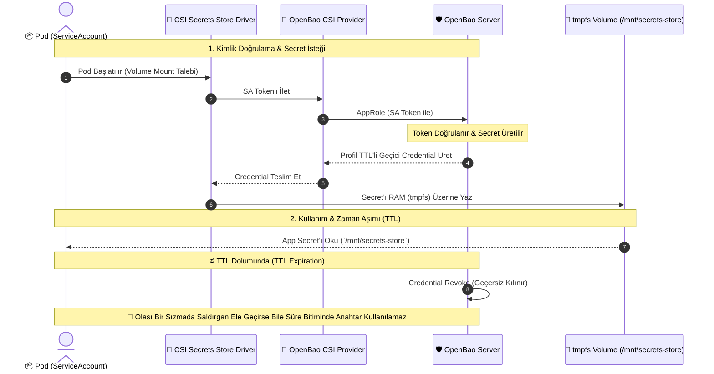
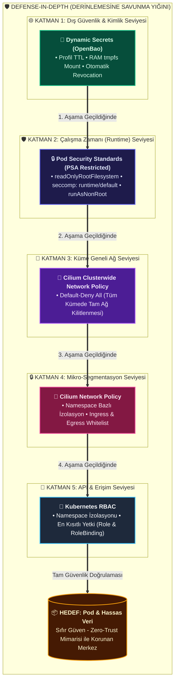

# K8s Tasarım — Ansible Rol Katmanı

---

<details>
<summary><strong>İçindekiler</strong></summary>

- [1. Mimari Kararları](#1-mimari-kararları)
- [2. Mimari Diyagram](#2-mimari-diyagram)
  - [2.1. Proxmox & Sanallaştırma Mimarisi](#21-proxmox--sanallaştırma-mimarisi)
  - [2.2. Dinamik Secret Yaşam Döngüsü (Secret Flow)](#22-dinamik-secret-yaşam-döngüsü-secret-flow)
- [3. Gateway API × Cilium (Genel Ağ Yapısı)](#3-gateway-api--cilium-genel-ağ-yapısı)
  - [3.1 Neden Gateway API?](#31-neden-gateway-api)
  - [3.2 Gateway API’nin rol modeli](#32-gateway-apinin-rol-modeli)
  - [3.3 Cilium neden en uygun implementasyon?](#33-cilium-neden-en-uygun-implementasyon)
  - [3.4 Trafiğin yolu (default-deny altında)](#34-trafiğin-yolu-default-deny-altında)
  - [3.5 Standard vs experimental kanal (neden yalnız `standard-install`)](#35-standard-vs-experimental-kanal-neden-yalnız-standard-install)
  - [3.6 Policy taxonomisi: HTTPRoute | CNP | CCNP | KCNP](#36-policy-taxonomisi-httproute--cnp--ccnp--kcnp)
  - [3.7 Kurulumda nerede? (kod haritası)](#37-kurulumda-nerede-kod-haritası)
- [4. Güvenlik](#4-güvenlik)
  - [4.1 Güvenlik Katmanları Özeti ve Red Team Perspektifi](#41-güvenlik-katmanları-özeti-ve-red-team-perspektifi)
  - [4.2 Derinlemesine Savunma Katmanları (Defense-in-Depth)](#42-derinlemesine-savunma-katmanları-defense-in-depth)
- [5. Multi-OS Pattern (Tüm Roller İçin Ortak)](#5-multi-os-pattern-tüm-roller-için-ortak)
- [6. Ansible Rolleri ve Kurulum Detayları](#6-ansible-rolleri-ve-kurulum-detayları)
  - [6.0 `openbao` — OpenBao Sunucusu (K8s DIŞINDA, ayrı LXC)](#60-openbao--openbao-sunucusu-k8s-dişinda-ayrı-lxc)
  - [6.1 `k8s/common` — Tüm Node'lar](#61-k8scommon--tüm-nodelar)
  - [6.2 `k8s/master` — Control Plane](#62-k8smaster--control-plane)
  - [6.3 `k8s/worker` — Worker Node](#63-k8sworker--worker-node)
  - [6.4 `k8s/core` — CoreDNS Doğrulama](#64-k8score--coredns-doğrulama)
  - [6.5 `k8s/cni_crs` — CNI CR'leri](#65-k8scni_crs--cni-crleri)
  - [6.6 `k8s/csi` — Secrets Store CSI (K8s içi, OpenBao'ya bağlanır)](#66-k8scsi--secrets-store-csi-k8s-içi-openbaoya-bağlanır)
  - [6.7 `k8s/addons` — Cluster Bileşenleri](#67-k8saddons--cluster-bileşenleri)
  - [6.8 `k8s/openbao-ops` — OpenBao Operasyonları (K8s içi)](#68-k8sopenbao-ops--openbao-operasyonları-k8s-içi)
  - [6.9 `k8s/infra` — Platform Servisleri](#69-k8sinfra--platform-servisleri)
  - [6.10 `k8s/security` — Security Katmanı](#610-k8ssecurity--security-katmanı)
- [7. Çalışma Sırası](#7-çalışma-sırası)
  - [7.1 Tofu Backend (Garage S3 — Tüm Stack’ler)](#71-tofu-backend-garage-s3--tüm-stackler)
  - [7.2 Inventory Yapısı (Tofu Tarafından Üretilir)](#72-inventory-yapısı-tofu-tarafından-üretilir)
  - [7.3 Detaylı Çalışma Akışı](#73-detaylı-çalışma-akışı)
- [8. Kod Tarafı Pratikleri](#8-kod-tarafı-pratikleri)
  - [8.1 Tedarik Zinciri ve Sürüm Pinleme](#81-tedarik-zinciri-ve-sürüm-pinleme)
  - [8.2 Dayanıklılık ve Idempotentlik Desenleri](#82-dayanıklılık-ve-idempotentlik-desenleri)
  - [8.3 Hata Kültürü: Diagnose-Before-Fail](#83-hata-kültürü-diagnose-before-fail)
  - [8.4 Helm Operasyonel Sertleştirme](#84-helm-operasyonel-sertleştirme)
  - [8.5 Sır Yaşam Döngüsü ve Kimlik Mimarisi](#85-sır-yaşam-döngüsü-ve-kimlik-mimarisi)
  - [8.6 Ağ Güvenliği Katman Sırası](#86-ağ-güvenliği-katman-sırası)
  - [8.7 RBAC ve Kimlik Kademeleri](#87-rbac-ve-kimlik-kademeleri)

</details>

## 1. Mimari Kararları

| Karar | Seçim | Gerekçe |
|-------|-------|---------|
| **Secret yönetimi** | OpenBao + CSI Secrets Store Driver | Secret etcd'ye yazılmaz; pod'a tmpfs mount (etcd yedeği uygulama sırrı içermez) |
| **OpenBao yeri** | K8s dışında, **ayrı unprivileged LXC** | K8s resetten etkilenmez, bootstrap chicken-egg yok |
| **Secret türü** | **Dynamic secret engine** (baştan) | Geçici credential, TTL'li, T=0'da güvenlik |
| **HA / kurtarma** | Tek LXC Raft + günlük snapshot (yerel + S3/Garage) | Basit işletme; snapshot ile geri dönüş (§6.0) |
| **OpenBao'nun rolü** | Tüm ekosistemin **tek secret kaynağı** | K8s, EFK, DB, diğer LXC'ler |
| **RBAC yönetimi** | 9 custom ClusterRole + 5 aggregated rol | Detay: [`docs/tr/kubernetes/rbac.md`](../kubernetes/rbac.md) |
| **K8s ağ** | Cilium (CNI + Gateway implementasyonu) + Gateway API (standard channel) | Tek yığında eBPF CNI + genel ağ + CNP/CCNP; ayrı ingress controller yok. Ayrıntı: **§3** |
| **OS desteği** | Multi-OS (Debian + RedHat) | `ansible_os_family` ile ayrışım |
| **Ansible playbook** | `playbooks/k8s.yml` (--tags ile) | Aşamalı çalışma + tek komut seçeneği |
| **Tofu backend** | Garage backend template, stack başına ayrı state | `templates/garage-backend.tfbackend.template` – her stack kendi `.backend.tfbackend` ve S3 prefix’i ile yönetilir; yönetim ve güvenlik için izolasyon sağlar |

[↑ Başa dön](#k8s-tasarım--ansible-rol-katmanı)

## 2. Mimari Diyagram

```
Proxmox
 ├── LXC: openbao-01 (unprivileged, OpenBao binary + Raft storage)
 │     └── Ansible: roles/openbao/ ile kurulum
 │
 ├── VM: k8s-master-01
 │     └── kubeadm init → Cilium → Gateway API CRDs → Hubble
 │
 └── VM: k8s-worker-0X
       └── kubeadm join

Secret akışı (dynamic):
  Pod (SA ile auth olur)
    ↓ CSI Secrets Store Driver
      ↓ OpenBao CSI Provider
        ↓ OpenBao'dan profil TTL'li credential alır
          ↓ Pod'a tmpfs volume mount (app akışında `/mnt/approle`)
            ↓ TTL dolumunda OpenBao revoke eder, süre biten anahtar işe yaramaz

Güvenlik katmanları:
  1. Dynamic secret (TTL'li, geçici)
  2. PSA restricted (readOnlyRootFilesystem, seccomp, runAsNonRoot)
  3. CiliumClusterwideNetworkPolicy (deny-all default)
  4. CiliumNetworkPolicy (namespace bazlı izinler)
  5. RBAC (ClusterRole + ihtiyaç anında kubeconfig/SA)
```
---
Detaylı gösterimler:
---

### 2.1. Proxmox & Sanallaştırma Mimarisi



---

### 2.2. Dinamik Secret Yaşam Döngüsü (Secret Flow)

Pod'ların OpenBao üzerinden profil TTL'li geçici kimlik bilgilerini edinme ve süre bitiminde geçersizleşme akışı:



---

[↑ Başa dön](#k8s-tasarım--ansible-rol-katmanı)

## 3. Gateway API × Cilium (Genel Ağ Yapısı)

### 3.1 Neden Gateway API?

Nisan 2026 itibariyle Kubernetes 1.36 (~22 Nisan) — topluluk ağ standardı olarak Gateway API’yi öne çıkarması ile modern controller yolu budur, bu nedenle Gateway API (standard channel) + Cilium Gateway implementasyonu kullanılmıştır.

### 3.2 Gateway API’nin rol modeli

Gateway API, tek bir monolik `Ingress` objesi yerine **rolü ayrılmış** tip CRD’ler kullanır:

| Rol | CRD | Kim yazar? | Ne yapar |
|-----|-----|------------|----------|
| Altyapı / implementasyon | **GatewayClass** | Controller (burada Cilium) | “Hangi data plane?” — `gatewayClassName: cilium` |
| Operasyon / platform | **Gateway** | Bu repo (`cni_crs`, shared) | Dinleyiciler (80/443), TLS terminate, hostname, hangi ns’den route kabul edileceği |
| Uygulama sahibi | **HTTPRoute** | app-deploy | “Hostname → Service, path, header” rotaları; `parentRef` ile Gateway’e bağlanır |
| (Opsiyonel) Uygulamaya özel TLS | **ListenerSet** + **Certificate** | app-deploy (dedicated) | Kendi ns’indeki Secret ile ek listener; cross-namespace Secret / ReferenceGrant yok |

**Neden annotation’lı model kullanılmıyor:** ingress’te özellikler `nginx.ingress.kubernetes.io/*` gibi controller’a özel annotation string’leriyle taşınıyordu — API dışı, doğrulanması kolay olmayan, başka controller’a taşınması zor bir yüzey. Gateway API bu işi **tipli alanlarla** yapar (`requestRedirect`, `headerMatches`, `timeouts`, `allowedRoutes` / `allowedListeners` vb.); davranış spec’te tanımlıdır, annotation’a sığdırılmaz. Controller’a özel annotation’a bağımlı olmak standard’ın dışına çıkmak demektir; bu repoda yalnızca standart kanalda garanti olan alanlar kullanılır. Yetki sınırları da API’ye gömülüdür — route yazanın Gateway’i kendi ns’ine açması annotation’a değil `allowedRoutes`/`allowedListeners`’a bağlıdır.

### 3.3 Cilium neden en uygun implementasyon?

Bu ortamda Gateway API bir **spesifikasyondur**; onu çalıştıran **implementasyon** seçilmelidir. Alternatifler (NGINX Gateway Fabric, Envoy Gateway, Istio, kgateway…) ayrı data plane / ayrı controller / mesh bağımlılığı getirir. **Cilium**, mevcut CNI zorunluluğu ile **aynı yığında** şunları tekleştirir:

| Yetenek | Ne çözer | Ayrı bileşen gerekir mi? |
|---------|----------|---------------------------|
| **CNI + `kubeProxyReplacement`** | eBPF veri yolu; kube-proxy yok | Hayır — DaemonSet yeterli |
| **Gateway API implementasyonu** | `gatewayClassName: cilium`; Envoy Cilium içinde | Hayır — ayrı nginx/ingress pod’u yok |
| **CNP + CCNP (+ KCNP flag’i)** | Routing ile filtre **aynı motor**; default-deny altında gateway deliği bilinçli açılır | Hayır — policy controller Cilium’da |
| **L2Announcement + IPPool** | Bare metal’da cloud LoadBalancer yok → Gateway’in dış IP’si ARP ile duyurulur | Hayır — `cni_crs` CR’leri yeterli |
| **Hubble** | East-west **ve** gateway trafiği için akış gözlemi | Hayır — ek APM agent’ı şart değil |
| **kube-proxy yok + tek policy plane** | Service routing, L7 gateway, network policy aynı datapath’te | — |

**Karşılaştırma özeti (neden Cilium):**

| Kriter | Cilium + Gateway | Ayrı Gateway controller (nginx/Envoy/Istio) |
|--------|------------------|-----------------------------------------------|
| Pod sayısı / bakım | Mevcut Cilium DaemonSet + CRD | Ek Deployment/DaemonSet + release kanalı |
| Policy ↔ route uyumu | Tek motor; `reserved:ingress` → pod policy | Genelde iki ayrı policy dili |
| Observability | Hubble aynı datada | Ayrı collector veya scope |
| Homelab kaynak maliyeti | Düşük (eBPF, az ek süreç) | Yüksek (ek proxy replica’ları) |

Sonuç: **Cilium hem CNI hem Gateway API implementasyonudur**; Gateway API’yi seçmek bu repoda otomatik olarak Cilium’u GatewayClass yapar.

### 3.4 Trafiğin yolu (default-deny altında)

Kümede **varsayılan kapalıdır** (CCNP `default-deny-all`, §4). Dışarıdan gelen istek yalnız aşağıdaki halkalar sırayla geçerse uygulamaya ulaşır:

```
İstemci
  → Dış IP (CiliumLoadBalancerIPPool + L2Announcement — bare metal ARP)
    → Cilium data plane / Envoy (Gateway listener 80|443, TLS terminate)
      → Gateway API: HTTPRoute (hostname/path → Service)     [routing — policy değil]
        → CCNP: allow-gateway-world-ingress  (dünyadan → gateway)
        → CCNP: allow-gateway-ingress        (gateway → seçili namespace/pod)
        → CCNP: allow-gateway-egress         (reserved:ingress → ingress-exposed pod)
          → App pod (label: ingress-exposed=true; yoksa 403)
            → (isteğe bağlı) egress: FQDN-CNP / OpenBao etiket CCNP’leri
```

**Ayrım:** `HTTPRoute` “nereye gider”; **CNP/CCNP** “gitmeye izin var mı”. Route mevcut ama policy yoksa trafik **403 ile düşer** — apps katmanında `allow-gateway-egress-<name>` bunun için üretilir ([§3.3 ve §4.1](k8s-apps-design.md)).

Paylaşılan **Shared Gateway** (`cni_crs`): bir kez kurulur, `allowedListeners.namespaces.from: All` ile tüm ns’lerden ListenerSet kabul eder; app eklemek Gateway’i değiştirmez (self-service). HTTP 80 → HTTPS redirect davranışı `tls_mode` ile cluster geneldir (apps §3.2).

### 3.5 Standard vs experimental kanal (neden yalnız `standard-install`)

| Kanal | Ne içerir | Bu repo |
|-------|-----------|---------|
| **Standard** | Production-ready çekirdek: `Gateway`, `GatewayClass`, `HTTPRoute`, `GRPCRoute`, `ReferenceGrant`, **`ListenerSet` (v1.5+’ten beri standard)** | **Kurulan bu** — `cni_prereqs.yml` → `standard-install.yaml` (pin: **v1.6.1**, §8.1) |
| **Experimental** | Deneysel API’ler; **v1.6’dan itibaren ayrı API group** (`gateway.networking.x-k8s.io`, `X` prefix) — standard ile sınır netleşir | **Kurulmaz** — ek CRD yüzeyi, sürüm kırılması ve “bu production mu?” belirsizliği bilinçli olarak göze alınmaz |

Kodda da aynı karar yazılıdır: ListenerSet için “v1.5.0’dan beri standard kanalda; ayrı experimental kuruluma gerek yok” (`cni_prereqs.yml`). CRD’ler `bundle-version` annotation’ı ile sürümü kontrol edilir; drift varsa yalnız o zaman yeniden apply edilir.

**KCNP / upstream ClusterNetworkPolicy** ayrı bir API’dir (`policy.networking.k8s.io`, Gateway kanalına girmez); §3.6’da.

### 3.6 Policy taxonomisi: HTTPRoute | CNP | CCNP | KCNP

Aynı kümede dört farklı “kural” tipi vardır; **karıştırılmamaları** gerekir:

| Tip | API / grup | Kapsam | Ne yapar | Kim uygular / statü |
|-----|------------|--------|----------|---------------------|
| **HTTPRoute** (+ Gateway, ListenerSet) | `gateway.networking.k8s.io/v1` | Routing / TLS | Hostname, path, header → Service; TLS listener bağlama | Gateway controller (Cilium); **standard channel** |
| **CNP** | Cilium CRD `CiliumNetworkPolicy` | **Namespace** | Pod seçiciyle L3/L4/L7 izin: gateway-CNP, FQDN-CNP, ns içi mikro-segmentasyon | Cilium datapath; uygulayan: app / platform |
| **CCNP** | Cilium CRD `CiliumClusterwideNetworkPolicy` | **Cluster** | Küme geneli: **default-deny-all**, allow seti (dns, health, world-ingress, openbao-egress…) | Cilium; `cilium-values.yaml.j2` → allow’lar önce, deny en son (§8.6) |
| **KCNP** | **Upstream** `policy.networking.k8s.io` **v1alpha2** `ClusterNetworkPolicy` | Cluster + **tier/priority** | **Admin tier** ikinci çıta: `admin-deny-cloud-metadata` (`169.254.169.254/32` egress deny, `priority: 10`) | Cilium’da **`k8sClusterNetworkPolicy.enabled: true`** ile beslenir; NP-API **deneysel/v1alpha2** — bilinçli, dar kullanım |

**Neden hem CCNP hem KCNP?**

1. **CCNP** = platformun günlük güvenlik yüzeyi (deny-all + ~15 allow). Namespace’inde policy yazabilen herkesin mantığı Cilium CRD’siyle ifade edilir.
2. **KCNP (Admin tier)** = tenant’ın kendi ns’inde yazdığı allow’ların **eğemeyeceği** üst kural. Cloud instance metadata endpoint’i gibi “asla açık kalmamalı” hedefler Admin tier’a konur; daha yüksek priority ile ns içi allow’lar ezilir.
3. Bu iki katman **farklı API’ler**: CCNP Cilium’a özgüdür; KCNP upstream Network Policy API denemesidir — o yüzden **v1alpha2 / deneysel** etiketi taşır ve kapsamı bilerek dar tutulur (tek policy: metadata-deny). Production’a yayılan K8s sürümü olgunlaştıkça KCNP yüzeyi genişletilebilir; genişletilmeden önce §8.1’deki CRD pin’i ile birlikte değerlendirilir.

**Özet sıra:** `HTTPRoute` yol tarifesi → `CCNP` kapıyı açar/kapar → `KCNP` Admin tier’la asla açılmaması gerekeni kilitler → app pod’u PSA + dynamic secret ile korunur (§4).

### 3.7 Kurulumda nerede? (kod haritası)

| Adım | Rol / dosya | Ne kurar |
|------|-------------|----------|
| Gateway API CRD | `master/tasks/cni_prereqs.yml` | `standard-install.yaml` v1.6.1 + Established bekleme (Gateway **ve** ListenerSet) |
| Cilium values | `master/templates/cilium-values.yaml.j2` | `gatewayAPI.enabled: true`, `k8sClusterNetworkPolicy.enabled: true`, `l2announcements`, `externalIPs` |
| Shared Gateway + IPPool + L2 | `cni_crs` (`shared-gateway.yaml.j2`, CR’ler) | `gatewayClassName: cilium`, 80/443, `allowedListeners: All` |
| Gateway allow zinciri | `security/templates/cilium-allow-gateway-*.j2` | world-ingress → gateway-ingress → gateway-egress (`reserved:ingress` → `ingress-exposed`) |
| KCNP metadata-deny | `security/templates/kcnp-admin-metadata-deny.yaml.j2` | Admin tier cloud-metadata deny |
| App route + per-app CNP | `app-deploy` (apps docs) | HTTPRoute, gateway-CNP, FQDN-CNP, (dedicated) Certificate/ListenerSet |

Uygulama geliştiricinin Gateway API bilmesi zorunlu değildir: `expose: true` beyanı yeterli; altyapı §3’teki sözleşmeyi sağlar (apps [§2.2](k8s-apps-design.md)).

---

[↑ Başa dön](#k8s-tasarım--ansible-rol-katmanı)

## 4. Güvenlik

### 4.1 Güvenlik Katmanları Özeti ve Red Team Perspektifi

| Katman | Güvenlik Mekanizması | Etki Alanı | Sağladığı Avantaj |
| --- | --- | --- | --- |
| **L1** | **Dynamic Secret (TTL)** | Uygulama / Secret Katmanı | Credential süreleri profil kataloğunda tanımlıdır (`token_ttl`/`token_max_ttl`; mevcut katalogda 15dk–4sa TTL aralığı); disk yerine RAM'de (`tmpfs`) tutulur ve sızıntı riskini azaltır. |
| **L2** | **PSA Restricted** | Pod / Çalışma Zamanı | Root erişimini engeller, dosya sistemini salt okunur yapar ve zararlı binary çalıştırılmasını önler. |
| **L3** | **Cilium Clusterwide Policy** | Ağ Katmanı (L3/L4 - Küme Geneli) | Tam kilitlenme (*default-deny*); izinsiz hiçbir Pod dışarıya veya başka bir Pod'a paket gönderemez. |
| **L4** | **Cilium Network Policy** | Ağ Katmanı (L7 - Namespace) | Servislerin sadece ihtiyaç duyduğu API ve portlar üzerinden haberleşmesine izin verir (Micro-segmentation). |
| **L5** | **K8s RBAC** | Yönetim / API Katmanı | Her namespace kendi içine izole edilir; yetkisiz ServiceAccount'ların K8s API'ye erişimini engeller. |
| **L6** | **ToFu State İzolasyonu / Backend Şifreleme** | IaC / State Katmanı | Her stack kendi `.backend.tfbackend` ve S3 state prefix’i ile yönetilir. Stack başına izolasyon, kazara overwrite ve state sızması riskini sınırlar. Backend dosyaları `secure_chmod 600` ve opsiyonel `--encrypt` ile korunur. Detay: `7.1 Tofu Backend`. |

**Red Team Perspektifi**

| Katman | Ne korur? | Aşılma senaryosu | Sonraki katman |
|--------|----------|-----------------|----------------|
| **Dynamic secret (profil TTL)** | Çalınan credential | Attacker TTL dolmadan kullanmalı | TTL bitince geçersiz |
| **PSA restricted** | RCE sonrası tool çalıştırma | Attacker RCE buldu ama shell yok | Dosya yazamaz, syscall kısıtlı |
| **readOnlyRootFilesystem** | Secret exfiltrate | Salt-okunur taban (şablonlarda opsiyonel `securityContext` ile açılır) yazmayı kısıtlar | Ağ dışına çıkamaz |
| **CiliumNetworkPolicy** | Ağ üzerinden sızma | Attacker pod'da ama dışarı çıkamaz | Sadece DNS + kendi DB'si |
| **RBAC** | API yetkisi yükseltme | Attacker pod'da ama `kubectl` yetkisi yok | `kubectl get secret` çalışmaz |

### 4.2 Derinlemesine Savunma Katmanları (Defense-in-Depth)

Sistemi dış ve iç tehditlere karşı koruyan 6 katmanlı güvenlik mimarisi. Katmanlar lineer bir sıra değil, birbirini destekleyen konsantrik güvenlik halkalarıdır; dış katmanlar içeri sızmayı zorlaştırır, iç katmanlar ise son savunma hattını oluşturur.



[↑ Başa dön](#k8s-tasarım--ansible-rol-katmanı)

## 5. Multi-OS Pattern (Tüm Roller İçin Ortak)

```yaml
# defaults/main.yml
packages_common:
  debian:
    - curl, wget, vim, htop, net-tools
    - apt-transport-https, ca-certificates, gnupg
    - python3-pip, unzip, git, lsb-release
  redhat:
    - curl, wget, vim, htop, net-tools
    - ca-certificates, gnupg2
    - python3-pip, unzip, git

# tasks/main.yml
- name: Install packages (Debian)
  ansible.builtin.apt:
    name: "{{ packages_common.debian }}"
    state: present
    update_cache: yes
  when: ansible_os_family == "Debian"

- name: Install packages (RedHat)
  ansible.builtin.dnf:
    name: "{{ packages_common.redhat }}"
    state: present
  when: ansible_os_family == "RedHat"
```


[↑ Başa dön](#k8s-tasarım--ansible-rol-katmanı)

## 6. Ansible Rolleri ve Kurulum Detayları

### 6.0 `openbao` — OpenBao Sunucusu (K8s DIŞINDA, ayrı LXC)

| Task | Detay | Güvenlik notu |
|------|-------|--------------|
| Binary kur | `bao` binary'si /usr/local/bin'e | SHA256 checksum doğrulaması |
| Systemd unit | `bao.service` | User: bao, restrict network |
| TLS sertifika | Self-signed veya internal CA | Dinleme: 8200 |
| Raft storage | `/var/lib/bao/raft` (snapshot: `/var/lib/bao/backups`) | Günlük snapshot (7 gün) + S3/Garage (30 gün) |
| Config | `config.hcl` | storage=raft, listener=tcp, api_addr, cluster_addr |
| Root token | Bootstrap sonrası generate | Plaintext çıktı (0600) + unseal-keys.txt; checklist Ansible vault şifrelemesi talep ediyor (henüz karşılanmadı), PRE_COMMIT_CHECKLIST.md |
| Unseal keys | 5 parça, 3 threshold | Ayrı güvenli lokasyon |
| Backup cron | Günlük Raft snapshot + S3/Garage | Script: `maintenance/backup/app-data/backup-openbao.sh` |
| Monitoring | Exporter (opsiyonel) | /metrics endpoint |

```hcl
# config.hcl
storage "raft" {
  path = "/var/lib/bao/raft"
  node_id = "openbao-01"   # gerçek şablonda inventory_hostname
}

listener "tcp" {
  address     = "0.0.0.0:8200"
  tls_disable = false
  tls_cert_file = "/etc/bao/certs/cert.pem"
  tls_key_file  = "/etc/bao/certs/key.pem"
}

api_addr     = "https://164.102.98.xxx:8200"
cluster_addr = "https://164.102.98.xxx:8201"
```

### 6.1 `k8s/common` — Tüm Node'lar

| Task | Debian (apt) | RedHat (dnf) |
|------|-------------|--------------|
| swap disable | `swapoff -a` + /etc/fstab | Aynı |
| kernel modülleri | overlay, br_netfilter | Aynı |
| sysctl | 8 anahtar: `ip_forward`, `bridge-nf-call-iptables/ip6tables`, `fs.inotify.*` limitleri, `kernel.panic(+on_oops)`, `vm.overcommit_memory` | Aynı |
| containerd kur | `apt install containerd` | `dnf install containerd` |
| containerd config | SystemdCgroup = true (template) | Aynı |
| repo ekle | pkgs.k8s.io repo | pkgs.k8s.io repo |
| kubeadm/kubelet/kubectl kur | `apt install` + hold | `dnf install` + hold |
| kubelet enable | systemd enable+start | Aynı |
| firewall (ufw/firewalld) | Tamamen durdurulur (`state: stopped, enabled: false`) | Aynı (port açılmıyor, servis disable) |

> **Firewall kararı:** Host firewall'u port açarak değil **tamamen durdurarak** devre dışı bırakılır (`os_debian.yml`/`os_redhat.yml`); ağ güvenliği Cilium CNP katmanına (default-deny + allow seti) ve Proxmox sınırına devredilmiştir.

### 6.2 `k8s/master` — Control Plane

| Task | Bağımlılık | Güvenlik notu |
|------|-----------|--------------|
| kubeadm init | `--config /tmp/kubeadm-config.yaml` + `--skip-phases=addon/kube-proxy`; CIDR'ler `kubeadm-config.yaml.j2`'den | CLI flag yerine config dosyası; JoinConfiguration YAML kullanılmaz |
| admin kubeconfig (master) | `/etc/kubernetes/admin.conf`, mode 0644 | Homelab pragmatizmi |
| user kubeconfig (master) | `/home/{{ ansible_user }}/.kube/config`, mode 0600 | Owner: ansible_user |
| Cilium CLI kur | `curl` ile binary | SHA256 doğrulama |
| Cilium Helm kur | `cilium-values.yaml.j2` ile (aşağıda) | Helm values template |
| Gateway API CRDs | `kubectl apply -f` (**standard-install**, §3.5) | Neden standard + Cilium implementasyonu: **§3** |
| Join discovery | discovery-file tabanlı `/tmp/discovery.kubeconfig` (embedded token, 0600) | Token TTL 48h (`kubeadm token create --ttl 48h`); geçici artifact'lar koşu sonunda silinir |

**Cilium Helm değerleri** (`roles/k8s/master/templates/cilium-values.yaml.j2` — tek kaynak):
```yaml
kubeProxyReplacement: true
k8sServiceHost: <master IP>   # ansible_facts["default_ipv4"]["address"]
k8sServicePort: "6443"
gatewayAPI:
  enabled: true
k8sClusterNetworkPolicy:
  enabled: true
hubble:
  enabled: true
  relay:
    enabled: true
  ui:
    enabled: true
ipam:
  mode: kubernetes
l2announcements:
  enabled: true
  leaseDuration: 120s
  leaseRenewDeadline: 60s
  leaseRetryPeriod: 5s
externalIPs:
  enabled: true
cni:
  binPath: /usr/lib/cni
  confPath: /etc/cni/net.d
  chainingMode: none
```

**etcd şifrelemesi:** kullanılmaz. Credential'lar etcd'de tutulmadığı için
(OpenBao tek kaynak, pod'lara CSI tmpfs mount) `EncryptionConfiguration`
gereksizdir ve kodda yoktur.

**Kubelet ve API hardening:** `kubeadm-config.yaml.j2` içinde `protectKernelDefaults: true`, `seccompDefault: true`, `makeIPTablesUtilChains: true`; anonim API erişimi yalnız `/livez`, `/readyz`, `/healthz` path'lerine açılır (AuthenticationConfiguration); join anonim cluster-info keşfi kullanmaz. Detay: §8.6.

### 6.3 `k8s/worker` — Worker Node

| Task | Detay | Güvenlik notu |
|------|-------|--------------|
| kubeadm join | Master'daki `/tmp/discovery.kubeconfig` dosyası slurp edilir | 48h token TTL; kubelet.conf varsa atlanır |
| creates kontrol | `/etc/kubernetes/kubelet.conf` varsa atla | Idempotent |

### 6.4 `k8s/core` — CoreDNS Doğrulama

Core rol, `k8s.yml` içinde `--tags=core` ile çalışır ve control plane ayağa kalktıktan sonra cluster DNS’in sağlıklı olduğunu doğrular. `hosts: k8s_master[0]` üzerinde çalışır, kubeconfig ile `kubectl` komutları kullanır. DNS çalışmıyorsa servis keşfi ve pod-to-pod iletişimi bozulur, bu yüzden worker join sonrası hemen kontrol edilir.

| Task | Detay | Not |
|------|-------|-----|
| CoreDNS çalışır durumda kontrol | `kubectl get pods -n kube-system` | Master[0] üzerinde çalışır |
| Pod DNS çözüm testi | `nslookup kubernetes.default.svc` | Cluster DNS fonksiyonel |

### 6.5 `k8s/cni_crs` — CNI CR'leri

Bu rol Cilium tabanlı ağın küme genelinde LoadBalancer IP havuzu, L2 duyuruları ve Gateway API paylaşılan gateway CR’lerini uygular. Kararın gerekçesi, 2026 bağlamı, channel seçimi ve policy taxonomisi: **§3**. Shared Gateway `spec.allowedListeners.namespaces.from: All` ile ListenerSet kabulüne açıktır. Böylece Gateway bir kez kurulur ve sonraki app eklemeleri Gateway’i etkilemez. Bu kaynaklar CNI’nin doğru çalışması için gereklidir ve master[0] üzerinde kubeconfig ile uygulanır.

| CR | Detay | Amaç |
|----|-------|------|
| CiliumLoadBalancerIPPool | IP havuzu tanımı | Bare metal LoadBalancer IP'leri |
| CiliumL2AnnouncementPolicy | L2 duyuru politikası | ARP duyurusu |
| Shared Gateway | Gateway API paylaşılan gateway | HTTP/HTTPS trafik |

### 6.6 `k8s/csi` — Secrets Store CSI (K8s içi, OpenBao'ya bağlanır)

`--tags=csi` ile çalışan bu rol, Secrets Store CSI Driver ve OpenBao CSI Provider’ı Helm ile kurar. Driver her node’da çalışır, provider OpenBao ile AppRole üzerinden kimlik doğrular. Bu rol, openbao-ops tarafından K8s'e yazılan AppRole kimlik bilgilerini kullanacak şekilde tasarlanmıştır.

| Bileşen | Kurulum | Güvenlik notu |
|---------|---------|--------------|
| **CSI Secrets Store Driver** | Helm chart | DaemonSet, her node'da |
| **OpenBao CSI Provider** | Helm veya manifest | OpenBao ile AppRole auth |
| **SecretProviderClass** | Şablon bu rolde yok; SPC'leri app-deploy üretiyor (CSI rolü yalnız agent-override ConfigMap uyguluyor) | app-deploy |

**SecretProviderClass örneği (şema — app-deploy üretimi, örnek değerlerle):**
```yaml
apiVersion: secrets-store.csi.x-k8s.io/v1
kind: SecretProviderClass
metadata:
  name: myapp-approle
  namespace: myapp
spec:
  provider: openbao
  parameters:
    roleName: "k8s-csi-provider"
    audience: "openbao"
    objects: |
      - objectName: "role_id"
        secretPath: "secret/data/myapp-approle"
        secretKey: "role_id"
      - objectName: "secret_id"
        secretPath: "secret/data/myapp-approle"
        secretKey: "secret_id"
```

### 6.7 `k8s/addons` — Cluster Bileşenleri

`--tags=addons` ile çalışan bu rol, control plane ve CNI hazır olduktan sonra kümeye gözlemlenebilirlik ve temel ağ/gateway bileşenlerini ekler. Master[0] üzerinde kubeconfig ile uygulanır.

| Bileşen | Kurulum | Amaç |
|---------|---------|------|
| **cert-manager** | Manifest (`kubectl apply -f`, toleration patch + webhook bekleme) | OpenBao PKI issuer altyapısı (Vault issuer) |
| **metrics-server** | Helm chart 3.14.0 (`metrics-server-values.yaml.j2` ile) | `kubectl top` |

IP havuzu, L2 duyurusu ve Shared Gateway bu rolde değil, `cni_crs` rolündedir (§6.5); Hubble master kurulumunda Cilium helm değerleriyle açılır.

### 6.8 `k8s/openbao-ops` — OpenBao Operasyonları (K8s içi)

Rol `ansible/roles/k8s/openbao-ops` altındadır; çalıştırma bağlamı K8s cluster’ıdır. Mount’ların açılması ve engine içeriği (AppRole policy/rol, KV/Database/PKI/transit, kubernetes auth mount) root token ile tek sefer `openbao.yml` → server rolü → `bootstrap.yml` içinde yapılır (`rbac-platform.yml` de burada include edilir). `openbao-ops` rolü ise yalnızca K8s içinden OpenBao API’sine **ops-admin AppRole token'ıyla** (P4, `outputs/openbao/ops-admin.json`) erişir: kubernetes auth config/role ve `kube-system/openbao-csi-driver` / `cert-manager` AppRole Secret'larını K8s'e yazar. Root token `openbao-ops` içinde asla kullanılmaz. Bu nedenle playbook `ansible/playbooks/k8s.yml` içinde, `hosts: k8s_master[0]`, `environment: "{{ kubeconfig_env }}"` ile çalışır. OpenBao’ya erişim için `ensure_ready.yml` ile önce `openbao_address` ulaşılabilir ve unsealed durumda mı kontrol edilir. Bu nedenle bu ve önceki k8s rol/tasklarından önce OpenBao ayakta ve ulaşılabilir olmalıdır, aksi halde akış durdurulur.

Bu rolün kubernetes auth config yazabilmesi için **TokenReview köprüsü** gerekir: OpenBao, SA JWT doğrulamasını apiserver'a `TokenReview` çağrısı ile yaptırır; yetki `kube-system/openbao-auth-reviewer` SA'sından (`system:auth-delegator`, `tokenreviews` cluster-scope olduğu için `cluster_wide=true` zorunlu) gelir. Rol bu SA'nın kubeconfig'ini (`outputs/k8s/openbao-auth-reviewer.conf`) idempotent üretir, conf'dan JWT'yi okur ve `auth/kubernetes/config`'e `token_reviewer_jwt` olarak yazar. Köprü yoksa `k8s-csi-provider` SA-JWT login'i yapılamaz → CSI üzerinden tüm workload credential akışı durur; conf eksikse fail task, 403 olursa auth sessiz düşebilir (ayrıntı: rehber §6.1).

Yapılandırma, Ansible `uri` modülüyle OpenBao HTTP API üzerinden yapılır
(`bao` CLI ile değil):

| Task | Detay | Güvenlik notu |
|------|-------|--------------|
| Reviewer kubeconfig (TokenReview köprüsü) | `gen-kubeconfig.yml` include'u ile idempotent: SA `openbao-auth-reviewer` + `system:auth-delegator` + `cluster_wide=true` → `outputs/k8s/openbao-auth-reviewer.conf`; conf JWT'si `token_reviewer_jwt` olarak `auth/kubernetes/config`'e yazılır | SA JWT içerir; conf yoksa fail-loud; yoksa CSI SA-JWT login ve credential akışı kopar; dosya `no_log` + outputs gitignore'lu |
| K8s auth (AppRole) | k8s-csi / cert-manager role_id + secret_id ops-admin ile üretilir; rol tanımı bootstrap'te root ile bir kez | Tek `k8s-csi-provider` rolü; wildcard SA + `audience: openbao` + identity-template izolasyonu |
| CSI credential | role_id/secret_id `kube-system/openbao-csi-driver` Secret'ına yazılır | `no_log: true` |
| K8s auth config/role | kubernetes auth mount bootstrap'te açılır; config/role (reviewer JWT dahil) ops-admin ile yazılır | token_reviewer_jwt `no_log: true` |
| Root token | Yalnızca server bootstrap (init bir kez) ve break-glass | openbao-ops içinde root kullanılmaz |

### 6.9 `k8s/infra` — Platform Servisleri

Bu rol küme stabil hale geldikten sonra platform genelinde kullanılan yardımcı servisleri ve operatörleri kurar. Çalışma bağlamı `k8s_master[0]` ve kubeconfig üzerinden yapılır; güvenlik ve temel ağ katmanları tamamlandıktan sonra devreye alınır.

| Bileşen | Detay |
|---------|-------|
| `openbao-pki` ClusterIssuer | `cluster-issuer.yml`: `kube-system/openbao-ca-tls` Secret'ındaki CA + `cert-manager-approle` kimliğiyle kurulum; dedicated dış domain issuer'larına taban |
| HTTP→HTTPS redirect | `tls_mode == redirect` ise `http-to-https-redirect.yaml.j2` uygulanır (varsayılan `allow-http` değerinde üretilmez) |

### 6.10 `k8s/security` — Security Katmanı

| Başlık | Detay | Kaynak |
|--------|-------|--------|
| **Namespace yaşamı** | Namespace'ler kodda toplu açılmıyor; `gen-kubeconfig` ihtiyaç anında (`--dry-run=client -o yaml \| kubectl apply -f`) oluşturuyor | `gen-kubeconfig.yml` |
| **PSA (Pod Security Admission)** | Ortam bazlı PSA etiketi üreten adım kodda yok; enforcement küme varsayılanına bırakılmış | — |
| **Varsayılan deny-all** | Tüm namespace'ler arası trafik allow'lar sonrası enforce edilen `default-deny-all` ile kapalı | CiliumClusterwideNetworkPolicy (§3.6) |
| **KCNP metadata-deny** | Upstream ClusterNetworkPolicy (**v1alpha2**, Admin tier) `admin-deny-cloud-metadata` — deneysel API, dar kapsam; CCNP’yi ezer | `security/tasks/main.yml` (§3.6) |
| **Allow policy seti** | webhook, apiserver-egress, prometheus-scrape, metrics-server, health, dns, **gateway world/ingress/egress**, hubble; koşullu cidr/FQDN/ns-isolation/openbao-egress; ayrıca KCNP `admin-deny-cloud-metadata` | `security/templates/*.j2` (§3.4, §3.6) |
| **9 Custom ClusterRole** | pod-reader, pod-log-reader, workload-viewer, full-viewer, pod-operator, workload-operator, config-editor, deployer, monitoring-reader | `templates/cluster-roles.yaml.j2` |
| **5 Aggregated Rol** | aggregated-viewer, aggregated-developer, aggregated-deployer, aggregated-admin, aggregated-monitoring | Etiket bazlı otomatik birleşir |
| **Custom rol ekleme** | `custom_cluster_roles` değişkeni ile template'e dokunmadan yeni rol | `inventory/group_vars/all/all.yml` |
| **Kubeconfig üretme** | Varsayılan: `outputs/k8s/` altında 5 kullanıcı kubeconfig'i (admin, deployer, developer, monitoring, viewer) + 1 sistem conf'i (`openbao-auth-reviewer` TokenReview köprüsü, §6.8) = 6 dosya. İhtiyaca özel: `playbooks/gen-kubeconfig.yml` | Detay: [`docs/tr/kubernetes/rbac.md`](../kubernetes/rbac.md) |
| **Pod Security Standards** | restricted: readOnlyRootFilesystem, seccomp, runAsNonRoot | PSA |


[↑ Başa dön](#k8s-tasarım--ansible-rol-katmanı)

## 7. Çalışma Sırası

### 7.1 Tofu Backend (Garage S3 — Tüm Stack’ler)

Garage S3 instance’ı `scripts/garage-setup/chef.sh` ile otomatik kurulur. Bu, ToFu kurulumlarından önce zaten hazırlanmış olmalıdır. Chef, çalışma sırasında credential dosyasını çeker ve `generate-garage-backend.sh` ile `tofu/stacks/*` altındaki her bir stack için tek tek klasör adına göre, `tofu/backends/` altında `.backend.tfbackend` dosyalarını önceden varsa backup’larını alır, yenilerini üretir, gerekirse ya da parametresi verilmişse şifreler.

Backend hazır olduktan sonra tüm ToFu stack’leri `tofu init` ile remote state kullanabilir. Bu ayrı oluşturma nedeni, ToFu tarafında her stack’in kendi state’ini tutacak şekilde bir güvenlik önlemi olarak ayarlanması kaynaklıdır.

Detay için [`docs/tr/garagehq/chef-sh-how-it-works.md`](../garagehq/chef-sh-how-it-works.md) ve `scripts/garage-setup/generate-garage-backend.sh` referans verilir.

```
templates/garage-backend.tfbackend.template
scripts/garage-setup/generate-garage-backend.sh
tofu/backends/<stack>.backend.tfbackend (generated, .gitignore'da)
```

Tek script tüm stack’lerin backend’ini üretir (openbao dahil).

### 7.2 Inventory Yapısı (Tofu Tarafından Üretilir)

Tofu `k8s-cluster` stack’i `tofu/apply` sonrası `ansible/inventory/hosts.ini.generated` dosyasını üretir:

```ini
# Auto-generated by tofu — DO NOT EDIT
[k8s_master]
k8s-master-1 ansible_host=164.102.98.174 ansible_user=ubuntu ansible_ssh_private_key_file=~/.ssh/id_ed25519

[k8s_worker]
k8s-worker-1 ansible_host=164.102.98.184 ansible_user=ubuntu ansible_ssh_private_key_file=~/.ssh/id_ed25519
k8s-worker-2 ansible_host=164.102.98.185 ansible_user=ubuntu ansible_ssh_private_key_file=~/.ssh/id_ed25519

[k8s_cluster:children]
k8s_master
k8s_worker
```

> **Not**: `ansible_ssh_private_key_file` public key (.pub) değil, private key yolunu gösterir. `trimsuffix` ile `.pub` otomatik kırpılır.

### 7.3 Detaylı Çalışma Akışı

```mermaid
flowchart TD
    %% 
    %% PHASE 1: OPENTOFU / ALTYAPI & ENVANTER
    %% 
    TOFU_ENV["OpenTofu Kurulu Ortam"]
    
    subgraph P1 [" 🏗️ PHASE 1: OpenTofu ile Altyapı & Envanter Hazırlığı "]
        S1["<b>1. OpenBao Stack Apply</b><br/><code>tofu/stacks/openbao</code>"]
        S2["<b>2. K8s Cluster ToFu Apply</b><br/><i>LXC + K8s VM'leri</i> <code>tofu/stacks/k8s-cluster</code>"]
        
        ART1[("📁 <b>inventory/hosts.ini.generated</b><br/><i>K8s sunucuları</i>")]
        ART1_2[("📁 <b>inventory/openbao.ini.generated</b>")]
    end

    %% --------------------------------------------------
    %% ANSIBLE PHASE 1: OPENBAO BOOTSTRAPPING
    %% --------------------------------------------------
    subgraph P2 [" 🔐 PHASE 2: Ansible - OpenBao Bootstrapping "]
        S3["<b>3. Ansible OpenBao Playbook</b><br/><code>playbooks/openbao.yml</code><br/><i>Raft init, root token, backup</i>"]
        ART2[("📁 <b>outputs/openbao/</b><br/><i>Credentials & Unseal keys</i>")]
    end

    %% --------------------------------------------------
    %% ANSIBLE PHASE 2: KUBERNETES CLUSTER SETUP
    %% --------------------------------------------------
    subgraph P3 [" ☸️ PHASE 3: Ansible - K8s Cluster Kurulumu "]
        S4["<b>4. K8s Common Node Prep</b><br/><code>--tags=common</code><br/><i>containerd + kubeadm/kubelet</i>"]
        S5["<b>5. K8s Master Node Setup</b><br/><code>--tags=master</code><br/><i>kubeadm init, Cilium, Gateway API, Hubble</i>"]
        ART3[("📁 <b>outputs/k8s/admin.conf</b>")]
        S6["<b>6. K8s Worker Nodes Join</b><br/><code>--tags=worker</code>"]
        S7["<b>7. K8s Core</b><br/><code>--tags=core</code><br/><i>CoreDNS verification</i>"]
        S8["<b>8. K8s CNI CRs</b><br/><code>--tags=cni_crs</code><br/><i>LoadBalancer IPPool, L2 Announcement</i>"]
    end

    %% --------------------------------------------------
    %% ANSIBLE PHASE 3: ADDONS, SECURITY & POST-INIT
    %% --------------------------------------------------
    subgraph P4 [" 🛡️ PHASE 4: Ansible - K8s Eklentileri, Güvenlik & Entegrasyon "]
        S9["<b>9. K8s Addons</b><br/><code>--tags=addons</code><br/><i>cert-manager, metrics-server</i>"]
        S10["<b>10. CSI Driver Setup</b><br/><code>--tags=csi</code><br/><i>Secrets Store Driver + OpenBao Provider</i>"]
        S11["<b>11. OpenBao Ops</b><br/><code>--tags=openbao-ops</code><br/><i>AppRole, KV, DB Engine, Policy</i>"]
        S12["<b>12. K8s Infra</b><br/><code>--tags=infra</code><br/><i>Platform servisleri</i>"]
        S13["<b>13. K8s Security & RBAC</b><br/><code>--tags=security</code><br/><i>ClusterRoles, CiliumNetworkPolicy</i>"]
        ART4[("📁 <b>outputs/k8s/</b><br/><i>developer, deployer, monitoring confs</i>")]
    end

    %% --------------------------------------------------
    %% PHASE 5: İSTEĞE BAĞLI İŞLEMLER
    %% --------------------------------------------------
    subgraph P5 [" ⚙️ PHASE 5: İsteğe Bağlı İşlemler "]
        S14["<b>14. Custom Kubeconfig Generator</b><br/><code>playbooks/gen-kubeconfig.yml</code><br/><i>Örn: role=developer, namespace=redis</i>"]
        ART5[("📁 <b>outputs/k8s/redis-developer.conf</b>")]
    end

    %% --------------------------------------------------
    %% FLOW CONNECTIONS
    %% --------------------------------------------------
    
    TOFU_ENV --> S1
    TOFU_ENV --> S2
    
    %% Phase 1 internal
    S1 -->|OpenBao Envanteri| ART1_2
    S2 -->|K8s Envanteri| ART1

    %% OpenTofu -> Ansible Transition (OpenBao)
    ART1_2 --> S3
    S1 --> S3
    S3 --> ART2

    %% Ansible Flow: OpenBao Completed -> K8s Starts
    S3 ==>|OpenBao Hazır & Aktif| S4
    ART1 --> S4

    %% K8s Internal Flow
    S4 --> S5
    S5 --> ART3
    S5 --> S6
    
    %% Integration & Addons
    S6 --> S7
    S7 --> S8
    S8 --> S9
    S9 --> S10
    S10 --> S11
    S11 --> S12
    S12 --> S13
    S13 --> ART4

    %% On-demand flow
    ART4 -.->|Özel Yetki İhtiyacı| S14
    S14 --> ART5

    %% --------------------------------------------------
    %% STYLES & COLOR SCHEME
    %% --------------------------------------------------
    classDef tofu fill:#1e293b,stroke:#38bdf8,stroke-width:2px,color:#f8fafc;
    classDef bao fill:#2d261e,stroke:#f59e0b,stroke-width:2px,color:#fef3c7;
    classDef k8s fill:#1e1b4b,stroke:#6366f1,stroke-width:2px,color:#e0e7ff;
    classDef artifact fill:#064e3b,stroke:#10b981,stroke-width:2px,color:#d1fae5;
    classDef optional fill:#3b0764,stroke:#a855f7,stroke-width:2px,color:#f3e8ff;

    class S1,S2 tofu;
    class S3,S11 bao;
    class S4,S5,S6,S7,S8,S9,S10,S12,S13 k8s;
    class ART1,ART1_2,ART2,ART3,ART4,ART5 artifact;
    class S14 optional;
```



Tek komut (tümü birden):
(ilgili enable/enabled flagleri true ise )
```bash
cd ansible
ansible-playbook -i inventory/hosts.ini.generated playbooks/k8s.yml
```

---

[↑ Başa dön](#k8s-tasarım--ansible-rol-katmanı)

## 8. Kod Tarafı Pratikleri

Kod referansları (`dosya:satır`)yla rol pratikleri:

### 8.1 Tedarik Zinciri ve Sürüm Pinleme

| Bileşen | Sürüm | Bütünlük | Yer |
|---|---|---|---|
| Helm | 4.2.4 | SHA256 checksum | `master/tasks/cni_prereqs.yml` + defaults |
| Cilium CLI | 0.19.7 | SHA256 checksum | aynı |
| crictl | 1.36.0 | SHA256 checksum | `common/tasks/containerd.yml` |
| Kubernetes paketleri | 1.36.2 | Tam sürüm pinli + `dpkg hold`/`yum versionlock` | `common/tasks/kubeadm.yml` |
| Cilium chart | 1.20.1 | `--version` pinli | `master/tasks/cni.yml` |
| Gateway API CRD | 1.6.1 | URL pinli + bundle-version karşılaştırması; **yalnız standard-install** (§3.5) | `cni_prereqs.yml` |
| CSI chart | 0.29.4 | Koşullu `--version` (boşsa pin yok) | `csi/tasks/main.yml` |
| metrics-server chart | 3.14.0 | `--version` pinli | `addons/tasks/main.yml` |
| Sandbox imajı | pause:3.9 | Pinli | `common/templates/config.toml.j2` |

apt tarafında modern `signed-by` keyring deseni, RedHat'ta `gpgcheck=1`. Repo genelinde "latest" etiketi yok. Bilinen borç: yalnız `linux-amd64` haritalanmış (`common/defaults`).

### 8.2 Dayanıklılık ve Idempotentlik Desenleri

* **Sentinel-dosya idempotentliği:** `admin.conf` varlığı init zincirini gate'ler (`pre_checks.yml` → `init.yml`); worker'da `kubelet.conf`; helm/cilium binary'leri `creates:` ile atlanır.
* **Otomatik kurtarma:** init fail → "tekrar koş, kubeadm reset otomatik çalışacak" mesajı → sonraki koşuda `kubeadm reset --force` + yeniden init (`init.yml`). `force_reset: false` safe-by-default yıkıcı bayraktır.
* **Drift düzeltme:** Cilium her koşuda `helm upgrade --install` ile yeniden uygulanır; CRD kurulumu yalnız `bundle-version` annotation'ı değiştiyse çalışır.
* **Readiness kapı zinciri:** healthz poll → Cilium öncesi ikinci healthz (shell timeout'lu) → cilium rollout (180s) → CRD Established → node Ready → healthz+readyz+openapi → `cilium status --wait` → CoreDNS Available+Ready → busybox nslookup uçtan uca test (koşulsuz temizlik, rc taşıma) → cert-manager webhook Available (600s).
* **CRD kurulum reçetesi:** check → koşullu `--server-side --force-conflicts` apply (retry'lı) → Established bekleme; Gateway API ve KCNP'de aynı desen.

### 8.3 Hata Kültürü: Diagnose-Before-Fail

* Rescue bloklarında önce kanıt topla sonra fail: pod/describe/log dump'ları `|| true` ile (`init.yml`, `core`, `cert-manager.yml`).
* Fail mesajları **Neden / Çözüm / Kontrol** formatındadır (`cluster-issuer.yml`); cert-manager rescue mesajı karar ağacı içerir (ImagePullBackOff / TLS / timeout / Pending).
* Çıktı-içeriği doğrulama: node Ready taraması `grep -qv '^Ready$'` ile tek not-ready node'u yakalar; gateway-tls Secret'ı bayt sayısıyla doğrulanır.
* `ensure_ready.yml`: OpenBao health semantiği (200/429/472/473 başarılı, `503 = sealed`) doğru yorumlanır; gerekirse controller'dan otomatik unseal (30×2sn).

### 8.4 Helm Operasyonel Sertleştirme

* **Tercih edilen reçete:** `helm repo add` idempotent (`already exists` + `failed_when: false`) → `repo update` yalnız repo yeni eklendiyse → önceden `pending-install` secret/job temizliği → `helm upgrade --install` → hata olursa `rescue`: stderr’de `another operation` kontrolü, lock temizliği, hedefli retry.
* **Nerede uygulanıyor:** Bu reçete **tüm helm install noktalarında** tekrarlanır — Cilium (`cni_prereqs.yml` repo + `cni.yml` upgrade), metrics-server (`addons`), CSI ve openbao-csi (`csi`).

### 8.5 Sır Yaşam Döngüsü ve Kimlik Mimarisi

* **Pipe-Secret:** CA ve AppRole secret'ları hiç diske dokunmadan `create --dry-run=client -o yaml | kubectl apply` ile yazılır; ardından `set_fact: null` ile bellek temizliği (`csi/tasks/main.yml`).
* **Root token aktif olarak kullanılmaz:** root yalnız bootstrap'ta; `sys/generate-root-token` ve `sys/seal` ops-admin'den bile `deny`; ops-admin'e `token_bound_cidrs` + `token_no_default_policy` uygulanır.
* **Süre = yetki:** profiller TTL'ye göre service/batch token'a ayrışır (`rbac-workload.yml`):

| Profil | Policy | TTL / Max | Renewable | Token |
|---|---|---|---|---|
| reader | workload-reader | 1h / 24h | ✓ | service |
| metrics-reader | workload-metrics-reader | 1h / 24h | ✓ | service |
| operator | workload-operator | 1h / 24h | ✓ | service |
| job-run | workload-job-run | 30m / 1h | ✗ | batch |
| transit-user | workload-transit-user | 30m / 1h | ✗ | batch |
| deployer | workload-deployer | 15m / 1h | ✗ | batch |
| kv-owner | workload-kv-owner | 1h / 8h | ✓ | service |
| db-consumer | workload-db-consumer | 1h / 24h | ✓ | service |

* **Identity-template izolasyonu:** jenerik policy path'leri AppRole metadata `scope`'una (k8s auth'ta SA adına) OpenBao template literal'iyle bağlanır — sızan kimlik yalnız kendi prefix'ini görür.
* **`audience: "openbao"` pinning:** k8s API için üretilmiş JWT OpenBao'da replay edilemez (TokenReview audience uyuşmaz).
* **`denied_parameters` deseni:** pki-manager'da `allow_any_name` parametre düzeyinde yasaklanır.
* **TokenReview delegasyonu:** OpenBao, SA JWT'lerini apiserver'da `TokenReview` ile doğrulamak için `system:auth-delegator`'a sahip reviewer SA (`openbao-auth-reviewer`) kullanır; SA'nın cluster üzerinde başka yetkisi yoktur. Reviewer kubeconfig `outputs/k8s/openbao-auth-reviewer.conf` içinde durur (`openbao-ops` üretir, §6.8); conf veya `tokenreviews` RBAC'i eksikse kubernetes auth login'i 403 alır veya doğrulama **sessiz düşer** — bu da CSI SA-JWT login'iyle tüm workload credential akışını durdurur.
* **systemd sertleştirmesi (`bao.service.j2`):** User/Group=bao, `NoNewPrivileges`, `PrivateTmp`, `ProtectHome`, `ProtectSystem=full`, `ReadWritePaths`, tek kapasite (`CAP_NET_BIND_SERVICE`), `Restart=on-failure`.

### 8.6 Ağ Güvenliği Katman Sırası

* **Allow → deny en son:** ~15 allow politikası önce, `global-default-deny-all` en son uygulanır — additive policy birleşiminde greenfield kilitleme riski önlenir (`security/tasks/main.yml`).
* **Gateway allow zinciri:** world-ingress → gateway-ingress → gateway-egress (`reserved:ingress` → `ingress-exposed`) — routing HTTPRoute ile, kapıyı CCNP açar (§3.4, §3.6).
* **Admin tier ikinci çıta:** upstream NP-API KCNP `admin-deny-cloud-metadata` (`tier: Admin, priority: 10`) ile `169.254.169.254/32` egress deny — tenant'ın kendi namespace'inde yazdığı izin geçersiz kılınır; KCNP **v1alpha2/deneysel**, kapsam bilerek dar (§3.6).
* **Self-service etiketler:** `homelab.io/allow-openbao-egress` / `allow-apiserver-egress` / `ingress-exposed` — tenant YAML'a dokunmadan ağ kapısı alır; etiketsizken no-op.
* **Kubelet hardening:** `protectKernelDefaults`, `seccompDefault`, `makeIPTablesUtilChains` (`kubeadm-config.yaml.j2`).
* **Anonim erişim:** yalnız `/livez`, `/readyz`, `/healthz` path'lerine açılır (AuthenticationConfiguration).
* **sysctl seti:** 8 anahtar (`ip_forward`, `bridge-nf-call-*`, inotify limitleri, `kernel.panic(+on_oops)`, `vm.overcommit_memory`) — `/etc/sysctl.d/99-k8s.conf`.

### 8.7 RBAC ve Kimlik Kademeleri

* **9 ClusterRole + 5 aggregated:** aggregationRule etiket birleşimi (`rbac.aggregate/<isim>`); `full-viewer` yalnız admin'e (secrets okuma), `deployer` secret'a create/update ama delete yok.
* **Uzatma noktası:** `custom_cluster_roles` envanteriyle template'e dokunmadan yeni rol → aggregated rollere otomatik katılım.
* **Kubeconfig kademeleri:** SA + manuel token secret (k8s ≥1.24 bilinci); `cluster_wide: false → RoleBinding (ns), true → ClusterRoleBinding`; 0600 kubeconfig, 0700 dizin. Varsayılan 4 profil: viewer/developer/deployer (ns-scoped) + monitoring (cluster-wide).
* **Pre-flight üçlüsü:** connect (known_hosts mismatch'te interaktif onay), env-check (localhost'ta cross-host sürüm drift analizi), openbao-env-check (dependency gate).
* **Privilege separation:** kurulum `become: true`, tüm işletme play'leri `become: false` + `kubeconfig_env`.

---

[↑ Başa dön](#k8s-tasarım--ansible-rol-katmanı)
