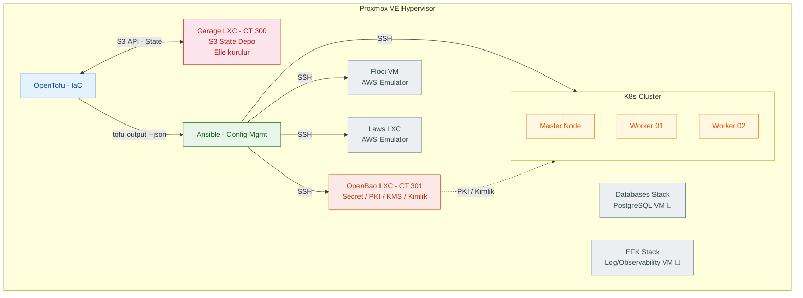
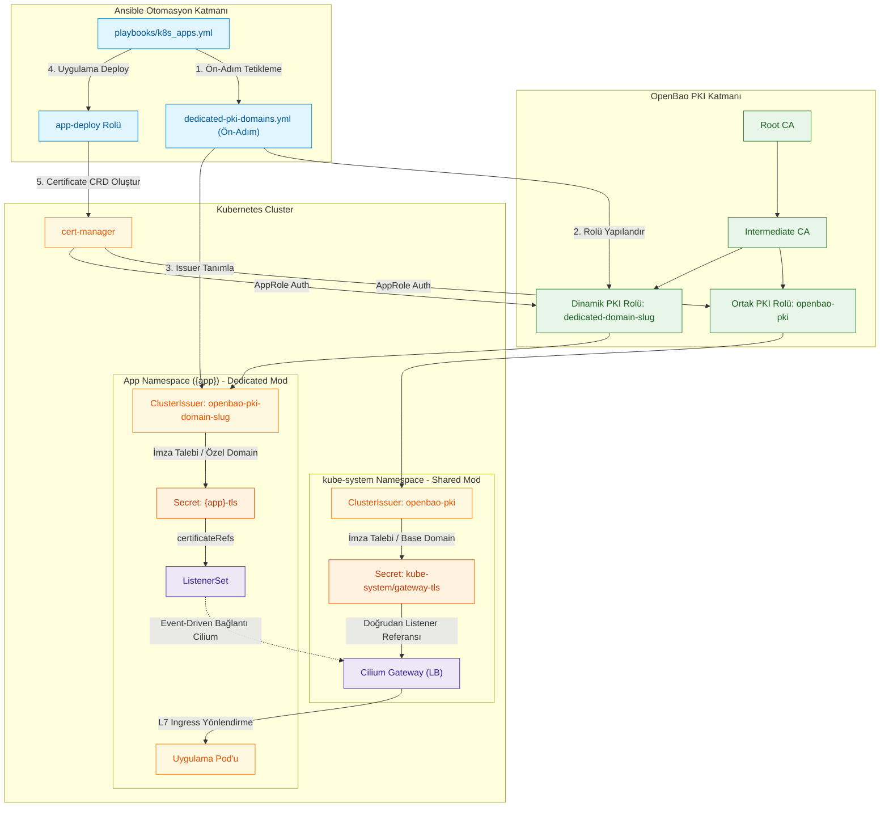
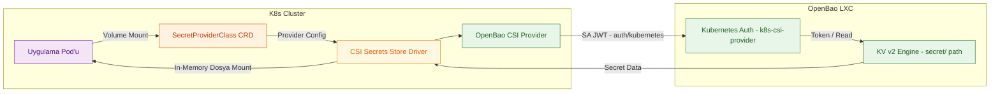
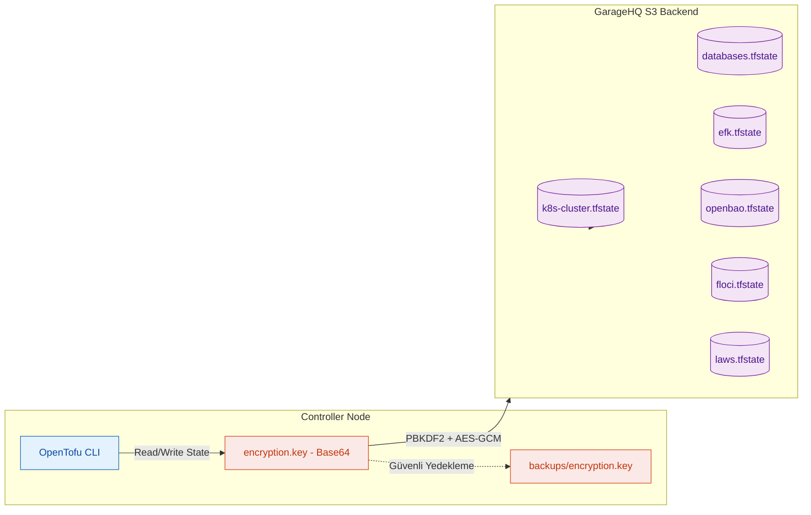
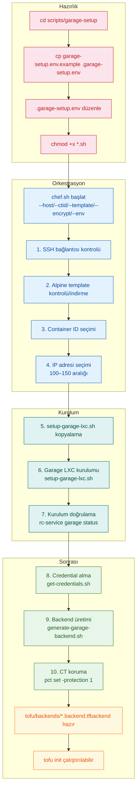
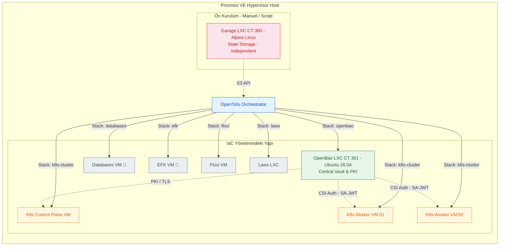
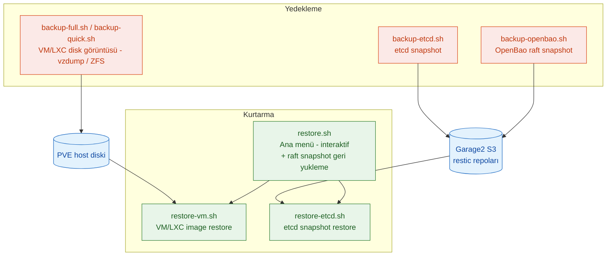

# Cloud-in-Lab — Sistem Mimarisi

Cloud-in-Lab projesinin local ortamda cloud-native servislerin nasıl modellendiğini, hangi bileşenin hangi cloud hizmetine karşılık geldiğini ve tüm sistemin nasıl işlediğini anlatan detaylı mimari ve altyapı dokümanı.

> **tofu-lan nedir?** Projenin iç ağ domain'idir. `tofu` = OpenTofu, `lan` = local area network. Tüm iç servisler `*.tofu.lan` altında çalışır (ör: `echo.tofu.lan`). Harici DNS'de kaydı yoktur, sadece homelab içinde `/etc/hosts` dosyasına eklenir veya iç DNS ile çözümlenir.
> **Projede kullanılan bileşenlerin güncel versiyonları:** K8s 1.36.2 · Cilium 1.20.1 · Gateway API 1.6.1 · OpenBao 2.6.2 · cert-manager 1.21.1 · Helm 4.2.4 · kube-prometheus-stack 88.6.1 · Proxmox BPG Provider ~> 0.78 · GarageHQ 2.1.0

---

<details>
<summary><strong>İçindekiler</strong></summary>

- [1. Sistem Genel Bakışı](#1-sistem-genel-bakışı)
- [2. Cloud Karşılıkları](#2-cloud-karşılıkları)
- [3. Veri Akışları ve Mimarisi](#3-veri-akışları-ve-mimarisi)
  - [3.1. Sertifika Zinciri ve Otomasyonu (TLS Mimarisi)](#31-sertifika-zinciri-ve-otomasyonu-tls-mimarisi)
  - [3.2. Secret Yönetim Akışı (Secrets Store CSI Driver + OpenBao)](#32-secret-yönetim-akışı-secrets-store-csi-driver--openbao)
  - [3.3. State ve IaC Güvenlik Akışı (OpenTofu Backend)](#33-state-ve-iac-güvenlik-akışı-opentofu-backend)
- [4. İzolasyon Modeli ve Hipervizör Yerleşimi](#4-izolasyon-modeli-ve-hipervizör-yerleşimi)
  - [4.1. Ağ ve IP Planlama](#41-ağ-ve-ip-planlama)
- [5. Mimari Tasarım Kararları ve Gerekçeleri](#5-mimari-tasarım-kararları-ve-gerekçeleri)
- [6. Sistem Genişletme Yolları](#6-sistem-genişletme-yolları)
  - [6.1. Yeni Tofu Stack (VM / LXC)](#61-yeni-tofu-stack-vm--lxc)
  - [6.2. Küme Ölçekleme](#62-küme-ölçekleme)
  - [6.3. Stack Açma/Kapama (Ansible Enable Flag)](#63-stack-açmakapama-ansible-enable-flag)
- [7. Kubernetes Uygulama Mimarisi (`k8s-apps`)](#7-kubernetes-uygulama-mimarisi-k8s-apps)
  - [7.1. Jenerik Uygulama Rolü — `app-deploy`](#71-jenerik-uygulama-rolü--app-deploy)
  - [7.2. Karmaşık Uygulama Rolü — `chart-deploy` (Helm)](#72-karmaşık-uygulama-rolü--chart-deploy-helm)
  - [7.3. Altyapı (Infra) Rolleri ve Fail-Fast Prensipleri](#73-altyapı-infra-rolleri-ve-fail-fast-prensipleri)
- [8. Ağ & Güvenlik Politikaları (Cilium CNI & eBPF)](#8-ağ--güvenlik-politikaları-cilium-cni--ebpf)
  - [8.1. Cilium 3-Tier Policy Mimarisi](#81-cilium-3-tier-policy-mimarisi)
  - [8.2. Default-Deny Implementasyonu (Cilium 1.20)](#82-default-deny-implementasyonu-cilium-120)
  - [8.3. Gateway World Ingress Yapılandırması](#83-gateway-world-ingress-yapılandırması)
  - [8.4. Cilium Etiket Ön Eki (`k8s:`) Standardı](#84-cilium-etiket-ön-eki-k8s-standardı)
  - [8.5. Aktif Güvenlik Politikası Dağılımı](#85-aktif-güvenlik-politikası-dağılımı)
- [9. İzleme ve Gözlemlenebilirlik (Monitoring)](#9-izleme-ve-gözlemlenebilirlik-monitoring)
- [10. Felaket Kurtarma ve Yedekleme Akışı](#10-felaket-kurtarma-ve-yedekleme-akışı)
- [11. İlgili Dokümanlar](#11-ilgili-dokümanlar)

</details>

## 1. Sistem Genel Bakışı



**Katman Sorumlulukları ve Detayları:**

| Katman | Görevi | Araç / Sürüm | Yapılandırma Yöntemi |
| --- | --- | --- | --- |
| **Hypervisor** | VM/LXC çalıştırma ve sanallaştırma | Proxmox VE 9.x | API Token tabanlı erişim |
| **IaC** | Altyapıyı deklaratif kodla tanımlama | OpenTofu v1.8+ | Modüler Stack Mimarisi |
| **Config Mgmt** | İşletim sistemi, paket ve servis kurulumları | Ansible 2.16+ | SSH + Dynamic Inventory |
| **State Storage** | OpenTofu state dosyalarını S3 üzerinde şifreli saklama | GarageHQ (Alpine LXC) | S3 API + PBKDF2 Encryption |
| **Secret Store** | Hassas verileri, sertifikaları ve kimlikleri yönetme | OpenBao 2.6.2 (Ubuntu LXC) | KV v2 + PKI + Transit + AppRole / Kubernetes auth |
| **Orchestration** | Konteynerize iş yüklerini orkestre etme | Kubernetes 1.36.2 | kubeadm + Cilium CNI |
| **AWS Emulation** | Yerel geliştirme için AWS API uyumlu servisler | Floci (VM) / Laws (LXC) | Bağımsız stack, enable flag ile kontrol |

> **Kritik Kurulum Sırası:** Garage LXC (CT 300) Tofu ile oluşturulmaz. State altyapısı Tofu'dan önce hazır olmalıdır (Tofu `init` adımı dahi remote state bağımlılığı taşır). Bu sebeple `scripts/garage-setup/` altındaki otomasyon script'leriyle bağımsız kurulur. OpenBao LXC (CT 301) ise Tofu'nun `openbao` stack'i ile orkestre edilir.

[↑ Başa dön](#cloud-in-lab--sistem-mimarisi)

---

## 2. Cloud Karşılıkları

Homelab / On-prem ortamda kurulan cloud-native mimarinin majör bulut sağlayıcıları (AWS, GCP, Azure) ile olan doğrudan işlevsel eşleşmeleri aşağıdaki gibidir. Bu tablo bir özet niteliğindedir; daha ayrıntılı bulut/open-source karşılaştırması `docs/tr/cloud-equivalents.md`, OpenBao motor bazlı karşılıklar ve olgunluk matrisi `docs/tr/openbao/openbao-architecture-guide.md` §1.5 içindedir (bkz. §11).

| İhtiyaç | Cloud'daki Karşılığı (AWS / GCP / Azure) | Bu Projedeki Karşılığı | Mimari Detay / Avantaj |
| --- | --- | --- | --- |
| **Object Storage** | S3 / GCS / Azure Blob Storage | GarageHQ (Alpine LXC) | Hafif, dağıtık, S3-compatible blok/nesne deposu. |
| **Secret Manager** | AWS Secrets Manager / GCP Secret Manager / Azure Key Vault | OpenBao KV v2 | Dinamik secret, versiyonlama, sıkı erişim kontrolü. |
| **Certificate Authority** | AWS ACM / GCP Certificate Authority Service / Azure Key Vault | OpenBao PKI + cert-manager 1.21.1 | Otomatik sertifika üretimi, rotasyon ve yerel Trust Anchor. |
| **Load Balancer + TLS** | AWS ALB / GCP HTTPS LB / Azure Application Gateway | Gateway API 1.6.1 + Cilium Envoy | eBPF tabanlı L4/L7 yönlendirme; external IP `lb_ip_pool` (L2 announcement). |
| **Container Orchestration** | EKS / GKE / AKS | Kubernetes (kubeadm) | Standart upstream Kubernetes mimarisi. |
| **IaC (Infrastructure as Code)** | Terraform Cloud / Pulumi / AWS CloudFormation | OpenTofu | Açık kaynaklı, state-locking destekli deklaratif IaC. |
| **Config Management** | AWS Systems Manager / GCP OS Config / Ansible Automation Platform | Ansible | Agentless SSH tabanlı konfigürasyon yönetimi. |
| **Container Registry** | ECR / GCR / ACR | Docker Hub / Harbor (Opsiyonel) | Cluster içine Helm chart ile deploy edilebilir yapı. |
| **Identity & Access** | Cloud IAM / Workload Identity / Service Accounts | Kubernetes auth (SA-JWT) + AppRole + Kubernetes RBAC | Pod: SA-JWT (`auth/kubernetes`); makine/CI/ops: AppRole. |
| **KMS / Envelope Encryption** | AWS KMS / Azure Key Vault Keys / GCP Cloud KMS | OpenBao Transit Engine | Uygulama düzeyinde encrypt/decrypt/datakey; K8sEncryptionConfiguration ile envelope encryption. |
| **AWS API Emulation** | — (yerel geliştirme için gerçek AWS gerekir) | Floci (VM) / Laws (LXC) | AWS API uyumlu servisler ile bulut bağımlılığı olmadan geliştirme/test. |
| **Network Observability (VPC Flow Logs / NSG Flow Logs)** | AWS VPC Flow Logs / Azure NSG Flow Logs / GCP VPC Flow Logs | Cilium Hubble (relay + UI) | eBPF flow/service map; policy allow-deny izi (k8s-design §3.3). |

[↑ Başa dön](#cloud-in-lab--sistem-mimarisi)

---

## 3. Veri Akışları ve Mimarisi

### 3.1. Sertifika Zinciri ve Otomasyonu (TLS Mimarisi)

**Problem:** Cloud ortamlarında (ACM vb.) TLS sertifikaları otomatik yenilenir ve bilinen CA'ler tarafından imzalandığı için istemci tarayıcılarında güven sorunu oluşturmaz. On-prem yapılarda self-signed sertifikalar güvenlik uyarılarına yol açar ve her düğüme elle CA yüklemek sürdürülemez bir yüktür.

**Çözüm:** OpenBao üzerinde iki kademeli bir PKI (Root CA ve Intermediate CA) yapılandırılır. Sertifika tedarik süreci mimari ihtiyaca göre iki farklı koldan (Shared ve Dedicated) otomatize edilir:

1. **Shared Mod (`*.tofu.lan`):** Ortak `openbao-pki` ClusterIssuer kaynağı kullanılır. Üretilen sertifika `kube-system/gateway-tls` Secret'ı olarak saklanır ve doğrudan Gateway listener'ı tarafından kullanılır.
2. **Dedicated Mod (Özel Domainler):** `tls.mode: dedicated` ve `use_base_domain: false` durumunda (ör: `echo3.lab.internal`), `playbooks/k8s_apps.yml` içerisindeki `dedicated-pki-domains.yml` ön-adımı çalışır. Bu adım OpenBao'da `dedicated-<domain-slug>` rolünü, K8s tarafında ise `openbao-pki-<domain-slug>` ClusterIssuer nesnesini dinamik üretir. Sertifika uygulamanın kendi namespace'inde `{app}-tls` olarak oluşur ve `ListenerSet` üzerinden Cilium tarafından event-driven olarak Gateway'e bağlanır.


**Kazanımlar:**

* Sertifika yaşam döngüsü otomatize edilir; yenileme işlemleri süresi dolmadan `cert-manager` tarafından arka planda gerçekleştirilir.
* Root CA istemcilere bir kez dağıtıldığında tüm `*.tofu.lan` alt alan adları güvenilir kabul edilir.

**Dedicated çok-domain (base_domain dışı) akışı:**

Uygulama, kendi özel domain'iyle çalışacaksa girdiye `tls.mode: dedicated` ve `use_base_domain: false` verilir; hostname FQDN olarak yazılır ve `base_domain` eklenmez (`echo3-server` → `echo3.lab.internal`, bkz. `ansible/inventory/group_vars/all/k8s_apps.yml`). Shared akıştaki tek `openbao-pki` ClusterIssuer'i bu domain için imzalama yetkisine sahip değildir; her base_domain dışı domain'e ayrı PKI rolü ve ClusterIssuer gerekir.

`playbooks/k8s_apps.yml`, `app-deploy`'tan **önce** `dedicated-pki-domains.yml` ön-adımını oynatır (aynı playbook, `apps` tags; bkz. `ansible/playbooks/k8s_apps.yml`). Ön-adım `enable: true` + `tls.mode: dedicated` + `use_base_domain: false` olan uygulamaların `hostnames` listesinden ilk label'ı atarak unique domain listesini çıkarır (`echo3.lab.internal` → `lab.internal`) ve her domain için şunları oluşturur:

* **PKI role:** OpenBao intermediate mount'unda `dedicated-<domain-slug>` (`allowed_domains` domain, `allow_subdomains: true`); mevcutsa key_type/require_cn farkında güncellenir.
* **ClusterIssuer:** `openbao-pki-<domain-slug>` (`cluster-issuer-dedicated.yaml.j2`); `lab.internal` için adı `openbao-pki-lab-internal` olur. cert-manager AppRole (`cert-manager-approle`) + `openbao-ca-tls` caBundle ile OpenBao `sign/dedicated-…` endpoint'ine bağlanır.

Certificate şablonu `issuerRef`'i bu akışta otomatik seçer: `tls.mode: dedicated` **ve** `use_base_domain: false` ise `openbao-pki-<domain-slug>`, aksi halde ortak `openbao-pki` (`common/templates/certificate.yaml.j2`). Sertifika `{app}-tls` adıyla app namespace'ine yazılır; ListenerSet aynı namespace'teki Secret'ı Gateway'e bağlar (yukarıdaki shared akışla aynı devam).

Ön-adım `k8s.yml` içindeki `cluster-issuer.yml`'in parçası değildir; yalnız `k8s_apps.yml` içinde, chart/app deploy'undan önce koşar. Ön-adımın ihtiyacı olan `outputs/openbao/openbao-mount.json` ve `outputs/openbao/pki-manager.json` yoksa fail eder — önce `playbooks/openbao.yml` çalıştırılmış olmalıdır.

---

### 3.2. Secret Yönetim Akışı (Secrets Store CSI Driver + OpenBao)

**Problem:** Pod'lara düz metin (plain text) K8s Secret nesneleri veya ConfigMap üzerinden şifre aktarmak güvenlik zafiyetine sebep olur (etcd veya git repo'ya sızma riski). Cloud'daki Pod Identity / Workload Identity mantığını on-prem ortama taşımak gerekir.

**Çözüm:** CSI Secrets Store Driver ve OpenBao CSI Provider kullanılır. Provider, pod'un ServiceAccount JWT'si ile Kubernetes auth üzerinden (`auth/kubernetes`, SA-bound `k8s-csi-provider` rolü) login olur; KV v2 motorundan ilgili path'teki secret'ı okur ve pod'un bellek tabanlı (tmpfs) dosya sistemine mount eder. AppRole, operasyonel ve K8s dışı kimlikler içindir (ops-admin, cert-manager, workload login'i); CSI provider yolunda SA-JWT kullanılır.



**Kazanımlar:**

* Hassas veriler Kubernetes etcd veritabanında kalıcı düz metin olarak saklanmaz.
* Pod kapandığında tmpfs bellek alanı temizlenir, iz kalmaz.

---

### 3.3. State ve IaC Güvenlik Akışı (OpenTofu Backend)

**Problem:** OpenTofu state dosyası, altyapıdaki tüm IP'leri, sanal makine ID'lerini ve hatta bazen geçici parolaları barındıran en kritik dosyadır. State dosyasının çalınması veya bozulması altyapının tamamını riske atar.

**Çözüm:** State verisi GarageHQ S3 nesne deposunda saklanır. Ancak S3'e yazılmadan önce yerel istemci tarafında PBKDF2 anahtar türetme ve AES-GCM 256-bit simetrik şifreleme ile korumaya alınır. Stack ayrışması da yapıldığından bir stack'in state'i bozulursa diğerleri etkilenmez.



> `encryption.key` dosyası ilk kez `scripts/tofu-keys/init-encryption.sh` ile `openssl rand -base64 32` kullanılarak oluşturulur ve `tofu/secrets/encryption.key` konumunda saklanır.

**Garage Bootstrap Sırası (chicken-egg çözümü):**

Tofu için State'i saklayacak Garage LXC'nin kendisi Tofu ile oluşturul*mama*lıdır (Tofu `init` state backend'ine bağımlıdır). Bu yüzden `scripts/garage-setup/` altındaki script'ler Tofu çalıştırmadan önce, `chef.sh` tarafından orkestre edilen bağımsız ve sabit bir sırayla çalıştırılır. **Hazırlık aşamasından sonraki tüm adımlar tek komutla `chef.sh` ile yürütülür; manuel tek tek çalıştırma gerekmez.**



> Detaylı script akışı, kullanım örnekleri ve güvenlik önlemleri için bkz. `docs/tr/garagehq/chef-sh-how-it-works.md`. Tüm adımlar tek komutla `chef.sh` tarafından orkestre edilir.

[↑ Başa dön](#cloud-in-lab--sistem-mimarisi)

---

## 4. İzolasyon Modeli ve Hipervizör Yerleşimi

Tüm bileşenler Proxmox VE üzerinde mantıksal ve fiziksel olarak izole edilmiş katmanlarda tutulur. Katmanlar arası yetki sınırlamaları ağ seviyesinde ve kimlik katmanında uygulanır.



**Katman İzolasyon Tablosu:**

| Katman | Yapı / Ortam | İzolasyon Yöntemi | Güvenlik / Sınır Nedeni |
| --- | --- | --- | --- |
| **State Katmanı** | GarageHQ LXC (CT 300) | Bağımsız Alpine LXC + Özel S3 Bucket | Tofu `init` bağımlılığını çözmek ve state'i izole etmek. |
| **Secret Katmanı** | OpenBao LXC (CT 301) | Ayrı LXC Container, K8s Dışında | K8s cluster'ı ele geçirilse dahi ana Vault/PKI anahtarlarını korumak. |
| **Compute Katmanı** | K8s Master & Worker VM'leri | Proxmox QEMU Sanal Makineleri | K8s iş yüklerinin hipervizör seviyesinde izolasyonu. |
| **Ağ Katmanı** | Cilium CNI + eBPF | 3-Tier Policy + Default-Deny | Doğu-Batı ve Kuzey-Güney trafiğini sıfır güven ilkesiyle yönetmek. |
| **Erişim Katmanı** | K8s RBAC (kubeconfig'ler) | Rol bazlı 5 ayrı kubeconfig: `admin`, `deployer`, `developer`, `monitoring`, `viewer` | En az yetki ilkesiyle cluster erişimini rol bazında sınırlamak. Detay: `docs/tr/kubernetes/rbac.md`. |

### 4.1. Ağ ve IP Planlama

Tüm stack'lerin IP adresleri elle yazılmaz; iki katmanlı `for_each` + `count` + `cidrhost()` deseniyle matematiksel olarak türetilir:

```
common.tfvars (base_ip, ip_mask)
  └─→ <stack>.tfvars → node_pools.<pool> (for_each; ör. masters, workers)
        └─→ ip_start_index + modül içi count.index
              └─→ cidrhost("${base_ip}/${ip_mask}", ip_start_index + count.index)
```

* **Stack katmanı:** `k8s-cluster` gibi çok havuzlu stack'lerde `node_pools` map'i `for_each` ile döner; her pool kendi `ip_start_index` değerini taşır.
* **Modül katmanı:** `proxmox-vm` içinde `count = vm_count` vardır; IP `ip_start_index + count.index` ile hesaplanır (tek VM'li LXC stack'lerinde `ip_start_index` doğrudan modüle gider).

Her stack kendi başlangıç index'ini `environments/<env>/<stack>.tfvars` içinde tanımlar; yeni stack veya yeni pool eklerken komşu aralıklarla çakışma kontrol edilir. Böylece stack'ler arası IP çakışması IaC seviyesinde önlenir. Pod ve Service CIDR'leri (`pod_cidr`, `service_cidr`) bu mekanizmanın dışındadır; Gateway dış IP havuzu ayrı bir `lb_ip_pool` tanımıdır. Somut sayısal örnek için bkz. README §3.3.1.

[↑ Başa dön](#cloud-in-lab--sistem-mimarisi)

---

## 5. Mimari Tasarım Kararları ve Gerekçeleri

| Karar | Karşılaşılan Problem / İhtiyaç | Seçilen Çözüm ve Teknik Gerekçe |
| --- | --- | --- |
| **`for_each` + `cidrhost()`** | Statik IP'lerin kod içerisinde elle verilmesi karmaşaya ve çakışmalara yol açıyordu. | `common.tfvars` içinde `base_ip`/`ip_mask`, stack tfvars içinde `ip_start_index`; havuzlar `for_each`, modül içi adetler `count` ile `cidrhost("${base_ip}/${ip_mask}", ip_start_index + count.index)` hesaplanır. |
| **Proxmox BPG Provider** | Eski Telmate provider'ı güncelliğini yitirmişti ve Proxmox VE 8/9 API değişikliklerini tam desteklemiyordu. | BPG provider (`bpg/proxmox`) seçilerek Cloud-init, native NVMe/disk yapılandırmaları ve Proxmox VE 9+ tam uyumluluğu sağlandı. |
| **Kimlik doğrulama ayrımı (SA-JWT + AppRole)** | Pod ve K8s dışı makinelerin (CI, operasyon playbook'u, cert-manager) aynı mekanizmayla yetkilendirilemeyeceği net değildi. | CSI provider yolu: pod SA JWT ile `auth/kubernetes` (SA-bound `k8s-csi-provider`). Bu yolda OpenBao, JWT'yi Kubernetes `TokenReview` API'sine sorar; köprüyü `openbao-auth-reviewer.conf` (reviewer SA, `system:auth-delegator`) taşır — köprü yoksa CSI SA-JWT login'i ve tüm workload credential akışı durur (ayrıntı: [`k8s-design.md`](k8s-design.md) §6.8). Operasyonel / K8s dışı yol: AppRole `role_id`/`secret_id` (ops-admin, cert-manager, workload login). |
| **Gateway API v1.6.1** | Geleneksel Kubernetes Ingress kaynakları L7 yönlendirme ve TLS sonlandırma yeteneklerinde kısıtlıydı. | Gateway API standardına geçildi. Cilium Envoy proxy altyapısı ile TLS Termination, Path Routing ve L2 Announcement tek çatı altında birleştirildi. |
| **cert-manager + PKI Entegrasyonu** | Self-signed sertifikalar istemci tarafında SSL hatalarına sebep oluyordu. | OpenBao PKI secrets engine `cert-manager` AppRole'u ile bağlandı. Yerel ortama dağıtılan Root CA ile internal HTTPS güvenilir hale getirildi. |
| **Transit (KMS) Envelope Encryption** | Uygulama anahtarları düz metin dururken K8s etcd şifrelemesi tek katmanlı kalıyordu. | OpenBao Transit (`aes256-gcm96`) + yerel AES-GCM ile envelope encryption; anahtar veriden ayrı tutulur. |
| **Bağımsız `providers.tofu` Yapısı** | Monolitik provider konfigürasyonu stack'lerin bağımsız çalışmasını engelliyordu. | Her OpenTofu stack'i (`k8s-cluster`, `openbao`, `databases`, `efk`, `floci`, `laws`) kendi `providers.tofu` dosyasına kavuşturuldu. Modüler sürümlendirme sağlandı. |
| **SoftHSM Auto-Unseal Hazırlığı** | Proxmox/LXC reboot edildiğinde OpenBao'nun sealed (mühürlü) duruma geçmesi servisleri kesiyordu. | Unseal anahtarlarının diskte tutulması riski yerine SSH pipe / stdin yöntemi uygulandı; OpenBao 2.6.2 mimarisinde SoftHSM2 PKCS#11 auto-unseal `kms` plugin tipiyle planlandı. 2.7.0'da built-in PKCS#11 kaldırılacak, plugin tabanlı yapı ile uyumluluk sağlanacak. |
| **Garage Manuel Bootstrap** | Tofu'nun kendi state deposunu Tofu ile açması imkansız bir kısır döngü (chicken-egg problem) oluşturuyordu. | GarageHQ S3 deposu `scripts/garage-setup/` altındaki bash otomasyonu ile Tofu çalıştırmadan önce bağımsız kuruldu. |
| **Cilium 1.20 Default-Deny Kukla Etiketi** | Cilium varsayılan olarak boş bırakılan ingress/egress kurallarını syntax hatası veya geçersiz kural sayabiliyordu. | `enableDefaultDeny: true` ile birlikte `matchLabels: k8s:non-existent: "true"` etiketi eklenerek sentetik default-deny sağlandı. |
| **Gateway World Ingress İzni** | Cilium Gateway Pod'ları dışarıdan gelen istekleri `reserved:ingress` etiketiyle engelliyordu (HTTP 403). | `global-allow-gateway-world-ingress` CCNP politikası yazılarak `world`, `remote-node` ve `host` varlıklarından 80/443 geçişine izin verildi. |
| **k8s-apps Modüler Mimarisi** | Jenerik K8s manifestleri ile karmaşık Helm chart'larının aynı Ansible rolünde yönetilmesi kargaşaya sebep oluyordu. | Standardize uygulamalar için `app-deploy` (Pass-through + Dual-variable), karmaşık yapılar için `chart-deploy` (Helm Deep Merge) rolleri ayrıştırıldı. |
| **kube-prometheus-stack (v88.6.1)** | Cluster gözlemlenebilirlik ve metrik toplama ihtiyacı. | `kube-prometheus-stack` kuruldu. Cilium Option A mimarisiyle pod scrape yeteneği aktifleştirildi (canlı hedef 25/25; bkz. §9). |
| **Rol Bazlı Kubeconfig Ayrımı** | Tek bir `admin.conf` ile herkesin cluster'a tam yetkiyle erişmesi en az yetki ilkesini ihlal ediyordu. | `gen-kubeconfig.yml` playbook'u ile `admin`, `deployer`, `developer`, `monitoring`, `viewer` rolleri için ayrı, sınırlı yetkili kubeconfig'ler üretildi. Ayrıca isteğe göre yeni kombinasyonları da ürettirebilecek şekilde bir play olarak ayarlandı. |
| **OpenBao 2.6 Güvenlik Sertifikası** | `sys/generate-root-token` unauthenticated endpoint riski | OpenBao 2.6 ile `sys/generate-root-token` için authenticated endpoint'ler getirildi, unauthenticated endpoint'ler deprecated edildi. |

[↑ Başa dön](#cloud-in-lab--sistem-mimarisi)

---

## 6. Sistem Genişletme Yolları
Host (VM veya LXC) ekleme işlemleri OpenTofu ile, bu host'lar üzerindeki uygulama ve stack kurulumları ise Ansible katmanında yönetilir. Örnek:

| Ne ekleniyor | Katman | Giriş noktası |
| --- | --- | --- |
| Yeni stack hostu (VM / LXC) | Tofu | `tofu/stacks/<name>/` → §6.1 |
| Kubernetes'e uygulama veya Helm chart | Ansible | `k8s_apps.yml` → §7 |
| Worker node | Tofu + Ansible | `node_pools` → join → §6.2 |
| Yeni Stack açma / kapama | Ansible | `all.yml` enable flag → §6.3 |

### 6.1. Yeni Tofu Stack (VM / LXC)

Yeni bir altyapı bileşeni (VM veya LXC) açmak içindir.

1. **Stack dosyası:** `tofu/stacks/<stack_name>/main.tf` içinde VM veya LXC kaynağı tanımlanır (`proxmox-vm` / `proxmox-lxc` modülleri). Stack klasöründe `common.tofu` ve `providers.tofu` bulunur; state şifreleyen stack'lerde (`k8s-cluster`, `openbao`, `databases`, `efk`) ayrıca `encryption.tofu` vardır.
2. **IP ve ortak değerler:** Ortak ağ değerleri (`base_ip`, `ip_mask`, `gateway`) `environments/<env>/common.tfvars` içindedir; stack'e özel başlangıç index'i `environments/<env>/<stack>.tfvars` içinde tanımlanır (bkz. §4.1). Yeni stack, komşu stack'lerin `ip_start_index` aralıklarıyla çakışmamalıdır. Stack klasöründeki `common.tofu` ile tfvars dosyası aynı şey değildir: biri kod, biri değerdir.
3. **Backend ve uygula:** Backend dosyası `tofu/backends/<stack>.backend.tfbackend`'dir; ilk kez `scripts/garage-setup/generate-garage-backend.sh` ile üretilir. Apply, `environments/<env>/common.tfvars` + stack tfvars verilerek yapılır; state diğer stack'lerden bağımsızdır (§3.3).
4. **Envanter üretimi:** Projede envanter elle yazılmaz. Tofu apply sırasında `local_file` + `templates/inventory.ini.tftpl` şablonu ile `ansible/inventory/<çıkış>.ini.generated` dosyası yazılır; Ansible playbook'lar bu dosyayla çalışır (`-i inventory/….generated`). Örnek Inventory üretilmiş ve test edilmiş stack'ler: `k8s-cluster` → `hosts.ini.generated` (`outputs.tf` içinde), `openbao`, `floci`, `laws`.
5. **Konfigürasyon (yalnız Ansible tarafı olan stack'ler):** `ansible/roles/` altına rol + playbook eklenir ve `ansible/inventory/group_vars/all/all.yml` içine `enable` bayrağı yazılır.

### 6.2. Küme Ölçekleme

Worker sayısını `k8s-cluster` stack'i belirler. Her havuz `node_pools` map'inde tanımlıdır: `vm_count` kaç makine açılacağını, `ip_start_index` ilk IP'nin hangi index'ten başlayacağını söyler. Bu değerler `environments/<env>/k8s-cluster.tfvars` içindedir.

| Senaryo | Değişiklik | Ne olur |
| --- | --- | --- |
| **Mevcut pool'u büyüt** | `node_pools.workers.vm_count` artırılır (ör. 2 → 3) | Yeni VM, aynı havuzun index uzantısını alır (184, 185, 186…). Mevcut VM'lerin IP'leri değişmez. |
| **Yeni havuz ekle** | `node_pools`'a yeni havuz adı + ayrı `ip_start_index` | Yeni aralık, komşu havuzlarla ve diğer stack'lerle çakışmamalıdır. |
| **Pool küçült** | `vm_count` azaltılır | Tofu ilgili VM'yi kaldırır. Node leave ve kube tarafı temizliği elle yapılır. |

**Sıra:**

1. `environments/<env>/k8s-cluster.tfvars` içinde `vm_count` değiştirilir.
2. Tofu apply → VM'ler açılır; IP'ler `cidrhost` ile otomatik hesaplanır (§4.1). Apply, `ansible/inventory/hosts.ini.generated` envanterini de yazar (§6.1 madde 4).
3. Join → `ansible-playbook -i inventory/hosts.ini.generated playbooks/k8s.yml --tags worker`.

Tofu yalnız makineyi açar ve inventory yazar; join Ansible'ın işidir.

### 6.3. Stack Açma/Kapama (Ansible Enable Flag)

Bu bayraklar yalnız `ansible/inventory/group_vars/all/all.yml` altındaki Ansible stack'leri içindir; uygulama/Helm chart enable'ları §7'deki `k8s_apps.yml` envanterinde (`apps[].enable`, `charted.*.enable`).

Yeni eklenen her Ansible stack, `all.yml` içindeki `enable: true/false` bayrağıyla işaretlenir. Wrapper playbook (`ansible/playbook.yml`) yalnız `openbao` ve `k8s` playbook'larını import eder; `floci` ve `laws` bayrakları vardır ancak wrapper dışındadır. Bir stack'in devre dışı bırakılması diğerlerini etkilemez (bkz. §4 stack izolasyonu).

[↑ Başa dön](#cloud-in-lab--sistem-mimarisi)

---

## 7. Kubernetes Uygulama Mimarisi (`k8s-apps`)

Kubernetes cluster üzerindeki iş yükleri, karmaşıklık seviyelerine göre iki temel mimari desene ayrılmıştır. Uygulama deploy ve kaldırma süreçleri `playbooks/k8s_apps.yml` ve `playbooks/k8s_apps_remove.yml` üzerinden orkestre edilir; `k8s.yml` (altyapı kurulum playbook'u) ile kesin sınırlarla ayrılmıştır.

```
playbooks/
├── k8s.yml             ──> Cluster Bootstrap, Cilium CNI, cert-manager, Secrets Store CSI (Altyapı)
├── k8s_apps.yml        ──> chart-deploy (Helm) + app-deploy (Jenerik) (Uygulama Katmanı)
└── k8s_apps_remove.yml ──> app-remove (Uygulama Kaldırma)
```

Bu kapsamda eklenecek uygulamaların konfigürasyon ve niteliklerine dair işlemler `ansible/inventory/group_vars/all/k8s_apps.yml` dosyası ile yapılır. Girdinin hangi anahtar altında sunulduğu bu işlemleri belirler:

* Uygulama `apps:` **altında** sunuluyorsa → `app-deploy` rolü ile deploy edilir (§7.1). Generic ve templated uygulamaların ikisi de `apps:` altındadır; templated, uygulamanın ek script/vars dosyalarının `roles/k8s-apps/templated/<name>/{vars,files}` altında durduğu durumdur ve bu klasörü `app-deploy` otomatik okur — beyan yine `apps:` altındadır. Hostname/TLS alanları (`tls.mode`, `use_base_domain: false` → `dedicated-pki-domains.yml` ön-adımı) bu girdiye aittir.
* `charted:` **altında** sunuluyorsa → Helm chartların yeri burasıdır `chart-deploy` rolü ile deploy edilir (§7.2, deep-merge). Chart'ın vars şablonları `roles/k8s-apps/charted/<key>/` altındadır.

* `apps` ve `charted` girdisi iki bağımsız anahtarlardır. **Detay için bkz. `docs/tr/architecture/k8s-apps-design.md`.** ancak HTTPRoute gibi bileşenlerde ortak şablonları (common/templates) kullanırlar

* `playbooks/k8s_apps.yml` çalıştırıldığında önce `chart-deploy` (`tags: charted`), sonra `app-deploy` (`tags: apps`) oynar — sıralama playbook'ta sabittir. İstenirse komut satırı ile tek tek de yüklenebilir: uygulama `-e app_filter=<ad>`, Helm chart `-e chart_filter=<ad>` ile. **Detay için bkz. `docs/tr/architecture/k8s-apps-design.md`.**

* Uygulama kaldırma `k8s_apps_remove.yml` playi ile yapılır. Girdilerde `state: absent` verilmiş ise bu uygulama kaldırma play'inin hedefidir (`enable`'a bakmaz); play yalnız `state` bayrağına bakar (canlı durum bu bayraklardan okunmaz, kümeden okunur). Veya yine komut satırı ile `-e remove="uygulama adı"` verilerek de kaldırılabilir. **Detay için bkz. `docs/tr/architecture/k8s-apps-design.md`.**

---

### 7.1. Jenerik Uygulama Rolü — `app-deploy`

`app-deploy` rolü, tek bir namespace içerisinde soyutlanabilen jenerik mikroservislerin (örneğin `echo-server`, stateless API'ler) dağıtımı için tasarlanmıştır.

#### 1. Otomatik Oluşturulan Kubernetes Kaynakları:

* **Namespace:** İzolasyon alanı.
* **ServiceAccount:** Pod kimliği.
* **SecretProviderClass:** OpenBao CSI secret mount tanımı.
* **ConfigMap:** Harici yapılandırma verisi.
* **Workload:** Deployment, StatefulSet, Job veya CronJob.
* **Service:** Cluster-internal ClusterIP/NodePort servisi.
* **ServiceMonitor:** Prometheus scrape hedefi (`prometheus-scrape: true`).
* **HTTPRoute:** Gateway API L7 yönlendirme kuralı.
* **Certificate:** cert-manager otomatik TLS sertifikası talebi.
* **ListenerSet:** Dedicated TLS modunda app Secret'ını Gateway'e bağlar.
* **CiliumNetworkPolicy (CNP):** Pod seviyesinde mikro-segmentasyon (gateway egress + opsiyonel FQDN egress; uygulama başına 1-2 adet).

#### 2. Pass-Through Yapılandırma Deseni:

Ansible Jinja2 şablonlarında katı (rijit) parametre tanımları yapılmaz. Kubernetes API tarafından desteklenen tüm alanlar (`replicas`, `resources`, `env`, `affinity`, `tolerations`, `volumeMounts`) Ansible `apps[]` veri dizisinden doğrudan K8s manifestine paslanır (pass-through).

#### 3. Dual-Variable Resolution Mekanizması:

`httproute.yaml.j2`, tanımlanmamış alanlarda `default()` ile geri düşer:

```jinja2
name: {{ httproute_name | default(name ~ '-route') }}
hostnames: {{ httproute_hostnames | default(hostnames) }}
```

Jenerik `app-deploy` ve Helm rollerinden gelen HTTPRoute tanımları aynı şablonu çakışma olmadan kullanır.

#### 4. Çok Katmanlı Erken Hata Yakalama (Fail-Fast Validation):

* **Ansible Assert Task (`deploy-app.yml`):** Çalışma zamanının başında URL formatını, zorunlu alanları denetler.
* **Template Render Validation:** Jinja2 şablonlama aşamasında eksik parametre durumunda işlemi durdurur.
* **Custom Python Filter Plugin:** Karmaşık domain ve regex kurallarını doğrular.

---

### 7.2. Karmaşık Uygulama Rolü — `chart-deploy` (Helm)

Prometheus, Grafana, Alertmanager ve `kube-state-metrics` gibi çok bileşenli mimariler jenerik şablonlar yerine `kube-prometheus-stack` Helm chart'ı ile yönetilir. Chart kurulumları `k8s-apps/chart-deploy` rolü üzerinden yürür.

#### Değişken Birleştirme (Deep Merge) Mantığı:

Her chart'ın varsayılanları kendi `vars/main.yml` dosyasında `chart_defaults` anahtarında tutulur (ör. `charted/prom_stack/vars/main.yml`). Kullanıcı özelleştirmeleri envanterde `charted.<chart_key>` altında tanımlanır (ör. `ansible/inventory/group_vars/all/k8s_apps.yml` içinde `charted.prom_stack`). `chart-deploy`, bu iki yapıyı `combine(recursive=true)` ile birleştirir:

```yaml
# chart-deploy — Deep Merge örneği
- name: Helm değerlerini birleştir
  ansible.builtin.set_fact:
    chart_merged: "{{ chart_defaults | combine(charted[chart_key] | default({}), recursive=true) }}"
```

#### Dinamik Servis Adı Türetme:

Servis isimlerinin kod içerisinde sabitlenmesini (hardcoding) önlemek amacıyla şu standart izlenir:

$$\text{Servis Adı} = \text{release\_name} + \text{"-"} + \text{bileşen\_adı}$$

*(Örnek: `kube-prom-stack-prometheus`, `kube-prom-stack-grafana`)*

---

### 7.3. Altyapı (Infra) Rolleri ve Fail-Fast Prensipleri

Altyapı rolleri, uygulama katmanı ayağa kalkmadan önce bağımlılıkların hazır olduğunu garanti eder.

* **ClusterIssuer Verification:** `ClusterIssuer` hazır değilse sertifika oluşturma adımı başlatılmaz.
* **Gateway Readiness Check:** Cilium Gateway pod'larının `Programmed: True` durumu doğrulanmadan HTTPRoute kuralları uygulanmaz.

[↑ Başa dön](#cloud-in-lab--sistem-mimarisi)

---

## 8. Ağ & Güvenlik Politikaları (Cilium CNI & eBPF)

Cilium CNI, eBPF altyapısı üzerinde IP veya port tabanlı klasik firewall anlayışı yerine eBPF Identity tabanlı mikro-segmentasyon sağlar. Güvenlik modeli **Sıfır Güven (Zero-Trust)** esasına dayanır.

---

### 8.1. Cilium 3-Tier Policy Mimarisi

```
┌──────────────────────────────────────────────────────────┐
│ 1. CCNP (Cluster-wide Network Policy) — Global Kapsam    │
├──────────────────────────────────────────────────────────┤
│ 2. CNP  (Namespace Network Policy)    — Namespace Kapsam │
├──────────────────────────────────────────────────────────┤
│ 3. Pod-Seviyesi CNP / Selector        — İş Yükü Kapsamı  │
└──────────────────────────────────────────────────────────┘
```

1. **CCNP (Clusterwide Network Policy):** Cluster geneli geçerli global kurallar (ör: Küresel DNS izni, Default-Deny).
2. **CNP (Cilium Network Policy):** Belirli bir namespace içindeki pod grupları arası kurallar.
3. **Pod-Seviyesi Seçiciler:** Doğrudan `matchLabels` üzerinden spesifik pod-pod erişim yetkileri.

> **KCNP (Admin Tier):** `clusternetworkpolicies.policy.networking.k8s.io` API'siyle Admin öncelikli cluster-wide politikalar da uygulanır (ör. `admin-deny-cloud-metadata`). Bu kurallar standart politikaların üstünde öncelikle çalışır. Ayrıntılar: `docs/tr/architecture/k8s-design.md`.

---

### 8.2. Default-Deny Implementasyonu (Cilium 1.20)

Cilium 1.20 sürümünde bir pod veya namespace için tüm trafiği varsayılan olarak kapatmak amacıyla `enableDefaultDeny: true` kullanılır. Sözdizimsel doğruluğun sağlanması için hiçbir varlıkla eşleşmeyen sentetik bir etiket kuralı enjekte edilir:

```yaml
apiVersion: "cilium.io/v2"
kind: CiliumClusterwideNetworkPolicy
metadata:
  name: "global-default-deny"
spec:
  endpointSelector: {}
  enableDefaultDeny:
    ingress: true
    egress: true
  ingress:
    - fromEndpoints:
        - matchLabels:
            k8s:non-existent: "true"
  egress:
    - toEndpoints:
        - matchLabels:
            k8s:non-existent: "true"
```

`k8s:non-existent: "true"` etiketi hiçbir pod üzerinde yer almadığından kural hiçbir trafiğe izin vermez ancak Cilium engine tarafından `Valid: True` olarak derlenir (şekil kuralı geçerli anlamındadır, istenen davranış yerine getirilmiş olur). Aksi belirtilmedikçe tüm trafik engellenmiş olur.

---

### 8.3. Gateway World Ingress Yapılandırması

Cilium Gateway pod'ları varsayılan güvenlik kalkanı sebebiyle dış dünyadan gelen isteklere HTTP 403 yanıtı verir. Dış ağ trafiğinin Envoy proxy'ye ulaşmasını sağlayan CCNP kuralı:

```yaml
apiVersion: "cilium.io/v2"
kind: CiliumClusterwideNetworkPolicy
metadata:
  name: "global-allow-gateway-world-ingress"
spec:
  endpointSelector:
    matchLabels:
      reserved:ingress: Exists
  ingress:
    - fromEntities:
        - world
        - remote-node
        - host
        - cluster
      toPorts:
        - ports:
            - port: "80"
              protocol: TCP
            - port: "443"
              protocol: TCP
```

---

### 8.4. Cilium Etiket Ön Eki (`k8s:`) Standardı

Cilium 1.20 engine, Kubernetes etiketlerini eBPF haritalarına işlerken `k8s:` ön ekini şart koşar.

* **Doğru Syntax:** `k8s:io.kubernetes.pod.namespace`, `k8s:app.kubernetes.io/name`
* **Hatalı Syntax:** `k8s.io.kubernetes.pod.namespace` (İki nokta `:` yerine nokta `.` kullanımı)

> **Kritik İkaz:** `k8s:` ön eki hatalı yazıldığında Cilium sözdizim hatası vermez ancak seçici (selector) hiçbir pod ile eşleşmeyeceği için güvenlik kuralı **sessizce devre dışı kalır (silent bypass/block)**.

---

### 8.5. Aktif Güvenlik Politikası Dağılımı

Politikalar iki katmanda üretilir: cluster kurulumu (install) ve uygulama deploy'ları (apps). Envanterdeki `state: absent` yalnızca `app-remove` hedefidir; canlı durum envanterden değil, kümeden okunur.

#### Install (kod tabanlı)

`ansible/roles/k8s/security` şablonları (ClusterRole/RBAC hariç):

| Politika Tipi | Şablon | Varsayılan Bayrak ile Aktif |
| --- | --- | --- |
| **CCNP** | 20 | 19 (`ns_isolation` bayrağı `false`) |
| **CNP** | 2 | 0 (`fqdn` bayrağı `false`) |
| **KCNP** | 1 | 1 (`admin-deny-cloud-metadata`) |

Ek olarak 15 ClusterRole tanımlanır (RBAC; ağ politikası değildir).

#### Uygulama Katmanı (apps)

| Kaynak | Ürettiği Politika |
| --- | --- |
| `charted/prom_stack` (cilium-monitoring-full-policy) | 4 CNP (monitoring namespace) |
| `app-deploy` — gateway egress | 1 CNP / uygulama |
| `app-deploy` — FQDN egress (`egress_fqdn`) | 1 CNP / uygulama (opsiyonel) |

#### Repoda test edilmiş oluşturulmuş politikalar

| Politika Tipi | Adet | Durum |
| --- | --- | --- |
| **CCNP** | 20 | Tümü `Valid: True` |
| **CNP** | 8 | 3 demo + 4 monitoring + 1 transit |
| **KCNP** | 1 | `admin-deny-cloud-metadata` (`Tier: Admin`) |

Install CCNP şablonu (20) ile varsayılan bayraklı aktiflik (19) arasındaki fark `ns_isolation` politikasının kümede de var olmasından kaynaklanır. KCNP için kısa ad (`kcnp`) tanımlı değildir; tam API adı `clusternetworkpolicies.policy.networking.k8s.io`.

[↑ Başa dön](#cloud-in-lab--sistem-mimarisi)

---

## 9. İzleme ve Gözlemlenebilirlik (Monitoring)

Cluster ve altyapı metrikleri, `kube-prometheus-stack` (v88.6.1) üzerinden takip edilir.

```
┌────────────────────────────────────────────────────────────────────────┐
│                        kube-prometheus-stack                           │
│                                                                        │
│  ┌────────────────┐  ┌────────────────┐  ┌──────────────────────────┐  │
│  │ Prometheus Svr │  │   Grafana      │  │      Alertmanager        │  │
│  └───────▲────────┘  └────────────────┘  └──────────────────────────┘  │
│          │ (eBPF Scrape)                                               │
│  ┌───────┴──────────────────────────────────────────────────────────┐  │
│  │ kube-state-metrics + Node Exporters                              │  │
│  └──────────────────────────────────────────────────────────────────┘  │
└────────────────────────────────────────────────────────────────────────┘
```

#### 1. Hedef Toplama Durumu (Target Scraping)

Sistemdeki tüm metrik hedefleri **25/25 UP** olarak canlıda doğrulanmıştır. Metrik toplama işlemlerinde Cilium Option A mimarisi uygulanmıştır. Sabit port yetkilendirmesi yerine namespace seçicileri ve `prometheus-scrape: true` etiketleri üzerinden eBPF seviyesinde dinamik izinler tanımlanmıştır.

#### 2. etcd Metrik Yapılandırması

`kubeadm` ile kurulan etcd bileşeni dışarıya varsayılan olarak metrik export etmediğinden, etcd scraping adımı Prometheus konfigürasyonunda explicit olarak pasife alınmıştır.

[↑ Başa dön](#cloud-in-lab--sistem-mimarisi)

---

## 10. Felaket Kurtarma ve Yedekleme Akışı

**Problem:** Kurulum otomasyonu (Tofu + Ansible) altyapının *nasıl inşa edildiğini* garanti eder, ama bir bileşen çöktüğünde (LXC kaybı, etcd bozulması, OpenBao raft hasarı) sistemin *nasıl geri getirileceği* ayrı bir disiplindir. Bu proje, iki katmanlı bir yedekleme stratejisiyle bu boşluğu kapatır.



**Kritik notlar:**

* **Unseal key'ler asla Garage S3'te tutulmaz** — ayrı bir kanal olarak password manager'da saklanır; `encryption.key` ile aynı yedekleme kanalını paylaşmaz.
* **Worker node'ların disk yedeği gerekmez** — stateless oldukları için Tofu + Ansible ile sıfırdan yeniden kurulabilirler.
* **Master etcd yalnız haftalık disk yedeğine güvenmez** — etcd sık değişir; `etcd snapshot` (`backup-etcd.sh`) restic üzerinden 4 saatte bir, haftalık ve aylık serilerle ayrıca alınır (bkz. `docs/tr/maintenance/maintenance.md`).
* **OpenBao tek nokta arıza (SPOF) riski** kabul edilmiştir; raft snapshot + değişiklik öncesi manuel snapshot ile azaltılır. Snapshot üç kademeli olarak Garage2'ye gider (`openbao-daily` 4 saatte bir · `openbao-weekly` Pazar 04:00 · `openbao-monthly` ayın 1'i 04:30, kova başına `keep-last 3`) ve OpenBao'nun kendi diskinde 7 günlük kalıcı kopya tutulur. Snapshot alma **root token kullanmaz**; `bao agent` servisinin AppRole profili üzerinden alınır (bkz. `docs/tr/openbao/openbao-rbac.md` §4).
* **PVE host'un kendisi de tek noktadır** — Garage2 (yedek kovaları) state deposundan ayrı bir LXC'de çalışır ve kova=repo + kova başına anahtar modeliyle mantıksal izolasyon sağlar; her iki LXC'nin kimliği de kurulumda belirlenir, sabit bir numara değildir (belgede geçen değerler örnektir — bkz. `docs/tr/maintenance/maintenance.md` §2). Aynı fiziksel hostta olduklarından yine de **off-site kopya değildir**. Host-dışı yedek (`restic copy`) ileride planlanan ayrı bir adımdır.
* **Backup tetiklemesi systemd timer'lardır** (cron değil): `Persistent=true` + `RandomizedDelaySec` + `OnFailure` → `.prom` metrikleri → Prometheus/Alertmanager zinciri. Kurulum ve env yönetimi tek kaynaktan yapılır: `roles/maintenance` (bkz. `docs/tr/maintenance/maintenance.md`).

> Senaryo bazlı, adım adım kurtarma prosedürleri için bkz. `docs/tr/maintenance/disaster-recovery.md`.

[↑ Başa dön](#cloud-in-lab--sistem-mimarisi)

---

## 11. İlgili Dokümanlar

| Konu | Dosya |
| --- | --- |
| Bulut/open-source servis karşılaştırması (detaylı) | `docs/tr/cloud-equivalents.md` |
| OpenBao mimari rehberi (motorlar, cloud karşılıkları, olgunluk matrisi) | `docs/tr/openbao/openbao-architecture-guide.md` |
| OpenBao RBAC ve IAM analojisi (AppRole ↔ AssumeRole vb.) | `docs/tr/openbao/openbao-rbac.md` |
| OpenBao çıktı sözleşmesi (`outputs/openbao/*.json`) | `docs/tr/architecture/openbao-output-contract.md` |
| Kubernetes RBAC ve rol bazlı kubeconfig'ler | `docs/tr/kubernetes/rbac.md` |
| Garage bootstrap script akışı | `docs/tr/garagehq/chef-sh-how-it-works.md` |
| Yedekleme mimarisi, script ve timer | `docs/tr/maintenance/maintenance.md` |
| Felaket kurtarma prosedürleri | `docs/tr/maintenance/disaster-recovery.md` |
| Proxmox hazırlık adımları | `docs/tr/proxmox/proxmox-preps.md` |
| Kubernetes cluster tasarımı, Cilium politikaları ve RBAC | `docs/tr/architecture/k8s-design.md` |
| Kubernetes uygulama (apps) mimarisi ve deploy akışı | `docs/tr/architecture/k8s-apps-design.md` |

[↑ Başa dön](#cloud-in-lab--sistem-mimarisi)
