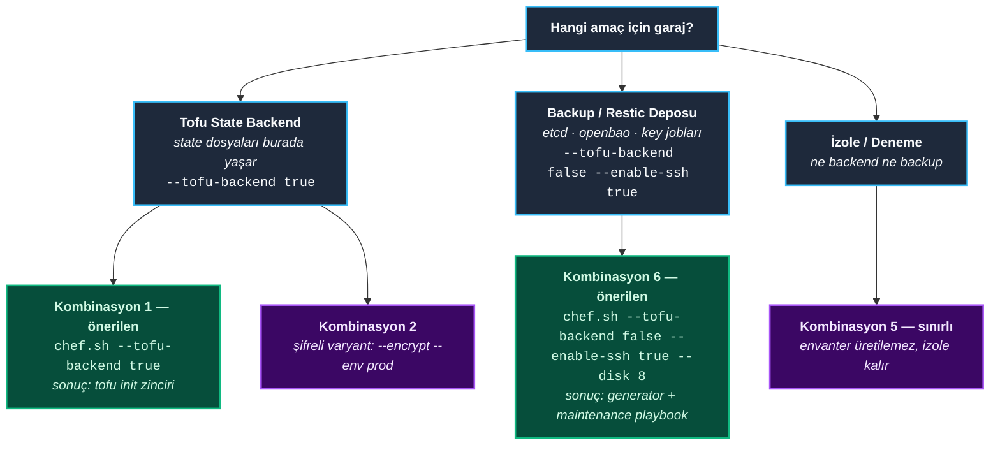
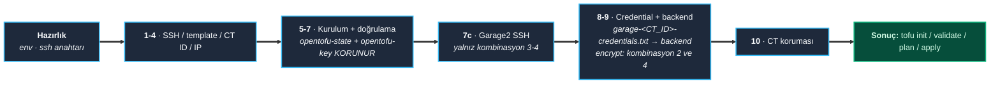

# chef.sh Nasıl Çalışır

---

<details>
<summary><strong>İçindekiler</strong></summary>

- [1. Özet](#1-özet)
- [2. Bu Projede İki Garaj Var](#2-bu-projede-iki-garaj-var)
  - [2.1 Amaç Ayrımı](#21-amaç-ayrımı)
  - [2.2 Amaç Seçimi](#22-amaç-seçimi)
- [3. Akış Diyagramları](#3-akış-diyagramları)
  - [3.1 Ana Akış (tüm adımlar ve ayrışma noktaları)](#31-ana-akış-tüm-adımlar-ve-ayrışma-noktaları)
  - [3.2 Tofu State Akışı (Kombinasyon 1–4)](#32-tofu-state-akışı-kombinasyon-14)
  - [3.3 Backup Akışı (Kombinasyon 6)](#33-backup-akışı-kombinasyon-6)
- [4. Hızlı Başlangıç](#4-hızlı-başlangıç)
- [5. Ortam Dosyası: `.garage-setup.env`](#5-ortam-dosyası-garage-setupenv)
  - [5.1 Değişken Sorumlulukları](#51-değişken-sorumlulukları)
- [6. SSH Anahtarının Proxmox'a Eklenmesi (İsteğe Bağlı)](#6-ssh-anahtarının-proxmoxa-eklenmesi-isteğe-bağlı)
  - [6.1 Anahtar Çifti Oluştur (varsa atlanır)](#61-anahtar-çifti-oluştur-varsa-atlanır)
  - [6.2 Public Key'i Proxmox'a Kopyala](#62-public-keyi-proxmoxa-kopyala)
  - [6.3 `ssh-copy-id` Yoksa (manuel)](#63-ssh-copy-id-yoksa-manuel)
  - [6.4 Test](#64-test)
- [7. Kurulum Adımları](#7-kurulum-adımları)
  - [Adım 1: SSH bağlantısı kontrolü](#adım-1-ssh-bağlantısı-kontrolü)
  - [Adım 2: Alpine template kontrolü](#adım-2-alpine-template-kontrolü)
  - [Adım 3: Container ID seçimi](#adım-3-container-id-seçimi)
  - [Adım 4: IP adresi seçimi](#adım-4-ip-adresi-seçimi)
  - [Adım 5: Kurulum scriptini kopyalama](#adım-5-kurulum-scriptini-kopyalama)
  - [Adım 6: Garage LXC kurulumu](#adım-6-garage-lxc-kurulumu)
  - [Adım 7: Kurulum doğrulama](#adım-7-kurulum-doğrulama)
  - [Adım 7b: `tofu-backend=false` dalı (yeni CT)](#adım-7b-tofu-backendfalse-dalı-yeni-ct)
  - [Adım 7c: Garage2'ye SSH kurulumu (`GARAGE_ENABLE_SSH=true`)](#adım-7c-garage2ye-ssh-kurulumu-garage_enable_sshtrue)
  - [Adım 8: Credential dosyasını alma](#adım-8-credential-dosyasını-alma)
  - [Adım 9: OpenTofu backend dosyalarını oluşturma](#adım-9-opentofu-backend-dosyalarını-oluşturma)
  - [Adım 10: CT silinmeye karşı koruma](#adım-10-ct-silinmeye-karşı-koruma)
- [8. Sonuç Ekranı ve Dal Davranışı](#8-sonuç-ekranı-ve-dal-davranışı)
  - [8.1 `--tofu-backend true` (Kombinasyon 1–4) → tofu zinciri](#81---tofu-backend-true-kombinasyon-14--tofu-zinciri)
  - [8.2 `--tofu-backend false --enable-ssh true` (Kombinasyon 6) → maintenance zinciri](#82---tofu-backend-false---enable-ssh-true-kombinasyon-6--maintenance-zinciri)
  - [8.3 `--tofu-backend false --enable-ssh false` (Kombinasyon 5)](#83---tofu-backend-false---enable-ssh-false-kombinasyon-5)
  - [8.4 Generator Sözleşmesi](#84-generator-sözleşmesi)
- [9. Bayrak Kombinasyonları (6)](#9-bayrak-kombinasyonları-6)
- [10. Doğrudan Kullanım ve Bayrak Referansı](#10-doğrudan-kullanım-ve-bayrak-referansı)
  - [10.1 Bayraklar](#101-bayraklar)
- [11. İlgili Dokümanlar](#11-ilgili-dokümanlar)

</details>

## 1. Özet

`scripts/garage-setup/chef.sh`, Proxmox Sunucu'ya (Proxmox VE — kısaca **PVE**; bir
sunucuda sanal makine ve konteyner çalıştıran açık kaynak sanallaştırma platformu — bu
projedeki ana makine, `.garage-setup.env` içindeki `GARAGE_PVE_IP` ile tanımlıdır) SSH
ile bağlanan ve tek bir Garaj konteynerini baştan sona kuran interaktif kurulum
orkestratörüdür. Adımları sırayla betiğin kendisi yürütür; siz yalnızca sorduğu soruları
yanıtlarsınız.

Belgede sık geçen terimlerin ilk karşılığı:

* **LXC** — işletim sistemini host ile paylaşan, sanal makineden çok daha hafif konteyner
  teknolojisinin adı. **CT** (container) ise bu teknolojiyle kurulan tekil bir konteynerdir;
  Proxmox her birine bir numara verir (bu projede 300 ve 310), o yüzden belgelerde
  "CT300" gibi ifadeler görürsünüz.
* **Garaj** — S3 uyumlu nesne deposu yazılımı GarageHQ'nun kurulduğu CT'dir. İçinde
  **kova** (bucket) açılır, **anahtar** (key) ile erişim tanımlanır; OpenTofu'nun state
  dosyaları ile restic'in yedek repoları bu kovalarda yaşar.
* **state backend** — OpenTofu'nun, altyapı kodunu çalıştırdığında oluşan güncel durumu
  (state dosyası) sakladığı uzak depo. `--tofu-backend true` dediğinizde garaj tam bu iş
  için hazırlanır.

Tek script, iki farklı amaç için kullanılır:

```bash
# Tofu STATE garajı — state backend (kombinasyon 1)
./chef.sh --tofu-backend true

# BACKUP garajı — restic repoları (kombinasyon 6, maintenance zinciri)
./chef.sh --tofu-backend false --enable-ssh true --disk 8
```

Bu doküman sırayla şunları anlatır: iki garajın amaç ayrımı (§2), akış diyagramları (§3),
hızlı başlangıç (§4), ortam dosyası (§5), SSH anahtarı hazırlığı (§6), adım adım kurulum
(§7), kurulumun sonunda ekrana ne basılacağı (§8), altı bayrak kombinasyonu (§9) ve
bayrak referansı (§10). Komut satırındaki bayrakların tam listesi [§10](#10-doğrudan-kullanım-ve-bayrak-referansı)
bölümünde toplanmıştır; hızlı başlamak için oraya bakılabilir.

---

[↑ Başa dön](#chefsh-nasıl-çalışır)

## 2. Bu Projede İki Garaj Var

Altı kombinasyonun hepsi teknik olarak çalışabilir; ama hangisinin *neye yaradığı ayrı bir
sorudur*. Örneğin kombinasyon 5'te (`--tofu-backend false --enable-ssh false`) sorunsuz
kurulur — ama ne OpenTofu state'i tutar ne de maintenance playbook ona bağlanabilir: çalışır, bu
projenin amaçlarını karşılamaz. Aşağıdaki tablo teknik olasılıkları değil, projenin niyetini tanımlar.

### 2.1 Amaç Ayrımı

Tabloda geçen iki erişim yolunu baştan tanıyalım: **`pct exec`**, Proxmox'un LXC komut
satırı aracı `pct` ile konteynerin *içinde* komut çalıştırmaktır — şifre ve SSH sunucusu
gerektirmez, Proxmox root'u her konteynerde zaten yetkilidir. **SSH** ise konteynerin
içinde ayrı bir SSH sunucusunun (sshd) kurulmasını ve anahtarla bağlanmayı gerektirir.
Garajda hangisi kullanılacağını amacın kendisi belirler; azami yetki ilkesi gereği state
garajı gereksiz yere SSH açmaz, backup garajı ise SSH'sız hiç kurulamaz.

| | **Tofu State Garajı** | **Backup Garajı** |
|---|---|---|
| Canlı örnek | CT300 (`.env` → `GARAGE_CT_ID`) | CT310 (envanter `[garage-backup]` = `garage2`) |
| Amaç | OpenTofu **state** backend'i | **restic repoları** (etcd / openbao / key jobları) |
| Kova + anahtar | tek kova `opentofu-state` + `opentofu-key` | kova = job (`etcd-daily` … `key`); her kovaya **Ansible** ayrı anahtar üretir (maintenance §5) |
| Erişim | `pct exec`; SSH önerilmez (least privilege) | SSH zorunlu — Ansible `[garage-backup]` host'u SSH ile bağlanır |
| Standart kombinasyon | **#1**: `--tofu-backend true` | **#6**: `--tofu-backend false --enable-ssh true` |
| Kurulum sonrası zincir | `tofu init` → `tofu/backends/*.backend.tfbackend` | `gen-restic-passwords.sh` + `gen-maintenance-inventory.sh` → `playbooks/maintenance.yml` |
| Anahtar saklama (key dosyası) | `garage-<id>-credentials.txt` (0600, repoda) | `restic-*.pw` saklanır; `<kova>.key` sıfır garaj kurulumunda silinir¹ |

> ¹ Anahtar saklama (key dosyası) kuralları ve restic detayı: [`maintenance/maintenance.md`](../maintenance/maintenance.md).

### 2.2 Amaç Seçimi

Amacınız belliyse komutunuz da bellidir; etkileşimli kurulumdaki soru-cevap bu sırayla
ilerler:



---

[↑ Başa dön](#chefsh-nasıl-çalışır)

## 3. Akış Diyagramları

Diyagram numaraları chef.sh'in kendi log çıktılarıyla birebir aynıdır — ekranda `7b/10`
görüyorsanız burada da 7b'dir, fazı kolayca eşleştirebilirsiniz. Önce hepsini kapsayan
ana akış (3.1), ardından iki senaryonun sadeleştirilmiş görünümü: tofu state (3.2) ile
backup (3.3).

### 3.1 Ana Akış (tüm adımlar ve ayrışma noktaları)

Ana akış şu dört noktada ikiye bölünür ve chef'in sonraki davranışı tam burada belirlenir:
**7b** (yalnız `tofu-backend=false` + yeni CT), **7c** (yalnız
`enable-ssh=true`), **9. adım** (backend var/yok) ve **sonuç ekranı** (iki farklı zincir).

```mermaid
flowchart TD
    %% ==================================================
    %% ANA AKIS: tum adimlar ve ayrism noktalari
    %% ==================================================
    Start["<b>chef.sh başlat</b><br/><i>Garaj LXC kurulumunu orkestre eder — interaktif</i><br/><code>--tofu-backend --enable-ssh --disk --encrypt --env</code>"]

    subgraph ORK [" 🎛️ ADIM 1-4: ORKESTRASYON "]
        S1["<b>1. SSH Bağlantı Kontrolü</b><br/><code>ssh root@PVE · BatchMode · ConnectTimeout=10</code><br/><i>başarısızsa die — IP / SSH key / root erişimi listelenir</i>"]
        S2["<b>2. Alpine Template Kontrolü</b><br/><code>pveam list local | grep template</code><br/><i>yoksa pveam update + download — önceden hazır olmak şart değil</i>"]
        S3["<b>3. Container ID Seçimi</b><br/><i>mevcut CT: kullan · yeni ID üret · sil + yeniden kur</i><br/><i>korumalı CT silinemez · silme onaylı, boş Enter iptal</i>"]
        S4["<b>4. IP Adresi Seçimi</b><br/><i>pct + qm konfigürasyonlarından kullanılan IP'ler toplanır</i><br/><i>100-150 aralığından boş seç — eval yok, güvenli parse</i>"]
        S1 --> S2 --> S3 --> S4
    end

    subgraph INST [" 🔧 ADIM 5-7: KURULUM "]
        S5["<b>5. Kurulum Scriptini Kopyala</b><br/><code>scp setup-garage-lxc.sh → /root/ · chmod +x</code>"]
        S6["<b>6. Garage LXC Kurulumu</b><br/><code>GARAGE_CT_CORES/RAM/DISK + ID storage IP/CIDR</code><br/><i>GarageHQ v2.1.0 · apk garage + openssl · OpenRC servis</i><br/><i>opentofu-state kovası + opentofu-key üretilir</i><br/><i>credential: garage-&lt;CT_ID&gt;-credentials.txt — 0600</i>"]
        S7["<b>7. Durum Doğrulama</b><br/><code>pct exec -- rc-service garage status</code><br/><i>started değilse die — manuel kontrol komutu basılır</i>"]
        S5 --> S6 --> S7
    end

    subgraph COND [" ⚙️ 7b / 7c: ŞARTLI ADIMLAR "]
        D1{"<b>--tofu-backend false mu?</b><br/>state garajı mı, backup garajı mı?"}
        B7B["<b>7b. Placeholder temizliği + ön koşular</b><br/><code>garage bucket delete opentofu-state</code><br/><code>garage key delete opentofu-key</code><br/><i>bu garaj tofu state backend değildir — silinir</i><br/><i>node_exporter: 2 deneme, olmazsa [y/N] sorusu</i><br/><i>python3: zorunlu — yoksa die, ansible hedefte çalışamaz</i>"]
        D2{"<b>LXC'ye SSH kurulsun mu?</b><br/><code>--enable-ssh true|false</code><br/>"}
        B7C["<b>7c. Garage2 SSH Kurulumu</b><br/><code>apk add openssh · rc-update sshd · authorized_keys</code><br/><i>GARAGE_SSH_PUB_KEY — default ~/.ssh/id_ed25519.pub</i><br/><i>stale host key: 6 probe + [Y/n] → ssh-keygen -R</i><br/><i>son kontrol accept-new — olmazsa warn, env-check tekrar dener</i>"]
        D1 -->|evet — state değil| B7B
        D1 -->|hayır — state garajı| D2
        B7B --> D2
        D2 -->|evet — SSH açık| B7C
        D2 -->|hayır — yalnız pct exec| S8
        B7C ==> S8
    end

    subgraph POST [" 📦 ADIM 8-10: TAMAMLAMA "]
        S8["<b>8. Credential Alma</b><br/><code>get-credentials.sh → garage-&lt;CT_ID>-credentials.txt</code><br/><i>scp + boş dosya kontrolü + chmod 600 · source edilmez</i><br/><i>DHCP + mevcut CT ise atlanır</i>"]
        S9A["<b>9. Backend Üretimi</b><br/><code>generate-garage-backend.sh</code><br/><i>credential'dan tofu/backends/*.backend.tfbackend üretir</i><br/><i>eski dosyalar .backup/ altına zaman damgalı yedeklenir</i><br/><i>--encrypt → tofu/secrets/encryption.key · --env etiketi</i>"]
        S9B["<b>9. ATLANDI — backend yok</b><br/><code>tofu/backends/ dokunulmaz</code><br/><i>--encrypt / --env verilmişse yok sayılır uyarısı</i>"]
        S10["<b>10. CT Koruması</b><br/><i>etkileşimli E/h — varsayılan E → pct set -protection 1</i>"]
        %% 9. adim AYNI --tofu-backend bayragina bakar — soru tekrarlanmaz,
        %% ayristirma 7b'de sorulmustu (oradaki soru hukmeder)
        S8 ==>|tofu-backend = true — state backend| S9A
        S8 ==>|tofu-backend = false — state yok, backup| S9B
        S9A --> S10
        S9B --> S10
    end

    subgraph RES [" 🎯 SONUÇ ZİNCİRLERİ "]
        R1["<b>Sonuç A — Tofu Zinciri</b><br/><code>tofu init · validate · plan · apply</code><br/><i>backend dosyaları hazır — Kombinasyon 1-4</i>"]
        R6["<b>Sonuç B — Maintenance Zinciri</b><br/><code>gen-restic-passwords</code> — repo şifreleri, üzerine yazmaz<br/><code>gen-maintenance-inventory</code> — [garage-backup] satırı<br/><code>ansible-playbook playbooks/maintenance.yml</code><br/><i>Kombinasyon 6 — restic dağıtımı başlar</i>"]
    end

    %% FLOW CONNECTIONS
    Start ==> S1
    S4 ==> S5
    S7 ==> D1
    S10 ==> R1
    S10 ==> R6

    %% STYLES
    classDef ork fill:#1e293b,stroke:#38bdf8,stroke-width:2px,color:#f8fafc;
    classDef inst fill:#064e3b,stroke:#10b981,stroke-width:2px,color:#d1fae5;
    classDef cond fill:#2d261e,stroke:#f59e0b,stroke-width:2px,color:#fef3c7;
    classDef post fill:#1e1b4b,stroke:#6366f1,stroke-width:2px,color:#e0e7ff;
    classDef res fill:#3b0764,stroke:#a855f7,stroke-width:2px,color:#f3e8ff;
    class Start,S1,S2,S3,S4 ork;
    class S5,S6,S7 inst;
    class D1,B7B,D2,B7C cond;
    class S8,S9A,S9B,S10 post;
    class R1,R6 res;
```



Notlar:

* `SKIP_SETUP` (mevcut CT kullanımı) ve `SKIP_CREDENTIALS` (DHCP) dalları şemada
  sadeleştirilmiştir; davranışları §7 Adım 3 ve §8'de tanımlıdır.
* **7b** yalnız yeni CT kurulumunda çalışır; mevcut CT + `tofu-backend false`
  kombinasyonunda temizlik için elle komut uyarısı basılır (§7 Adım 7b).
* **Sonuç A** yalnız `tofu-backend=true`, **Sonuç B** yalnız
  `tofu-backend=false + enable-ssh=true` durumunda basılır.

### 3.2 Tofu State Akışı (Kombinasyon 1–4)

OpenTofu state'ini tutacak garajın akışı — bu senaryoda 7b çalışmaz, 7c yalnız kombinasyon
3/4'te çalışır:



* Bu akışta `opentofu-state` kovası ve `opentofu-key` **korunur** — bu garaj zaten
  OpenTofu state'ini tutmak için kuruluyor; o kova ve anahtar bunun kendisidir, silmek
  anlamsız olurdu.
* 7b çalışmaz; 7c yalnız kombinasyon 3/4'te çalışır.

### 3.3 Backup Akışı (Kombinasyon 6)

Amaç yedek tutmak olduğunda akış 7b ve 7c ile uzar — asıl farklar bu iki adımdadır:

```mermaid
flowchart LR
    %% BACKUP AKISI — kombinasyon 6
    H2["<b>Hazırlık</b><br/><i>env · ssh anahtarı</i>"]
    C1["<b>1-4</b> · SSH / template / CT ID / IP"]
    C2["<b>5-7</b> · Kurulum + doğrulama"]
    C3["<b>7b</b> · Placeholder sil<br/><i>node_exporter · python3 zorunlu</i>"]
    C4["<b>7c</b> · openssh + key<br/><i>stale host key onayı</i>"]
    C6["<b>8-9</b> · Credential · backend ATLANDI<br/><code>tofu/backends/ dokunulmaz</code><br/><i>encrypt/env yok sayılır</i>"]
    C7["<b>10</b> · CT koruması"]
    C8["<b>Generatorler</b><br/><code>gen-restic-passwords</code><br/><code>gen-maintenance-inventory --garage-ip</code>"]
    C9["<b>Sonuç:</b> playbooks/maintenance.yml"]

    H2 ==> C1 ==> C2 ==> C3 ==> C4 ==> C6 ==> C7 ==> C8 ==> C9

    %% STYLES
    classDef bak fill:#2d261e,stroke:#f59e0b,stroke-width:2px,color:#fef3c7;
    classDef fin fill:#064e3b,stroke:#10b981,stroke-width:2px,color:#d1fae5;
    class H2,C1,C2,C3,C4,C6,C7 bak;
    class C8,C9 fin;
```



* Bu akışta `opentofu-state` kovası + `opentofu-key` **silinir**: bu garaj state backend'i
  olmayacağı için ilk kurulumdan (Adım 6) kalan o iki öğe gereksizdir; 7b temizler.
* 9. adım `tofu-backend=false` nedeniyle atlanır; `tofu/backends/` dokunulmaz.

---

[↑ Başa dön](#chefsh-nasıl-çalışır)

## 4. Hızlı Başlangıç

```bash
cd scripts/garage-setup
cp garage-setup.env.example .garage-setup.env   # hedef nokta (.) ile başlar dikkat!
nano .garage-setup.env                          # GARAGE_PVE_IP ayarla
echo '.garage-setup.env' >> ../../.gitignore
chmod +x *.sh

./chef.sh --help                                # tam bayrak listesi
```

Adımların mantığı: ayar dosyası `.garage-setup.env` adıyla script'lerin yanında tutulur ve
gitignore'a eklenir — içinde sizin ortamınıza ait IP gibi bilgiler var, repoda kalmamalıdır.
`chmod +x` ilk çalıştırmada izin hatası almamak içindir. Tüm script'ler
`set -euo pipefail` ile çalışır (ilk ciddi hatada dururlar); log, renk ve SSH bağlantı
seçenekleri ortak `_common.sh` dosyasından gelir.

`GARAGE_PVE_IP`, `GARAGE_CT_ID`, `GARAGE_ALPINE_TEMPLATE`, `GARAGE_ENABLE_SSH`,
`GARAGE_SSH_PUB_KEY` hardcoded (koda gömülü) değildir: tek kaynak `.garage-setup.env`'dir,
komut satırındaki bayraklar ise koşu bazında bu değerleri ezer — yani bayrak vermezseniz
env'deki değer, verirseniz bayraktaki değer geçerlidir.

Generatorlar (§8.2'deki, dosya *üreten* betikler) çalıştıkları makinede `python3 + pyyaml`
ister; kurulu değilse chef kurulumu yine bitirir, ama kapanışta bu betikleri çalıştıramaz
ve nedenini uyarı olarak basar.

---

[↑ Başa dön](#chefsh-nasıl-çalışır)

## 5. Ortam Dosyası: `.garage-setup.env`

`.garage-setup.env`, kurulum boyunca geçerli tek ayar dosyanızdır: script'ler
default'larını buradan okur; komut satırı bayrakları bu dosyayı değiştirmez, yalnızca o
koşu için geçersiz kılar. Dosyaya geriye yazım (write-back) yoktur — dosya saf girdidir.
Dosyanın birebir kopyası aşağıdadır (kaynak: `scripts/garage-setup/garage-setup.env.example`):

```ini
# garage-setup.env.example
#
# Bu dosyayi kopyala:  cp garage-setup.env.example .garage-setup.env
# Sonra .garage-setup.env icindeki degerleri kendi ortamina gore duzenle.
#
# .garage-setup.env GIT'E COMMIT EDILMEMELI (repo'nun .gitignore'unda olmali) -
# proxmox IP'si ozellikle icerdeyse hassas bilgi sayilabilir, ayrica ekip
# arkadaslarinin kendi lab IP'lerini kullanabilmesi icin bu ayrim gerekli.

# Proxmox host adresi (zorunlu - script'ler bu deger olmadan --host istenir)
GARAGE_PVE_IP=164.102.98.152

# Varsayilan Garage LXC container ID'si
GARAGE_CT_ID=300

# Garage icine SSH (default: false - kosu bazinda CLI --enable-ssh ile ezilir):
#   true  -> chef.sh openssh + public key kurar (backup garagelari;
#            maintenance [garage-backup] host'una ssh ile baglanir, bunu GEREKTIRIR)
#   false -> SSH yok; erisim yalniz pve uzerinden pct exec
#            (tofu state garagelari)
GARAGE_ENABLE_SSH=false

# Alpine LXC template adi - guncel surumu gormek icin Proxmox'ta:
#   pveam available | grep alpine
GARAGE_ALPINE_TEMPLATE=alpine-3.23-default_20260116_amd64.tar.xz
```

### 5.1 Değişken Sorumlulukları

| Değişken | Kim yazar | Kim okur |
|---|---|---|
| `GARAGE_PVE_IP`, `GARAGE_CT_ID`, `GARAGE_ALPINE_TEMPLATE` | kullanıcı | tüm script'ler (`_common.sh` default'ları ile) |
| `GARAGE_ENABLE_SSH` | kullanıcı veya `--enable-ssh` (koşu bazında ezilir) | chef (7c), `gen-maintenance-inventory.sh` (die kontrolü) |
| `GARAGE_SSH_PUB_KEY` | kullanıcı (opsiyonel; default `~/.ssh/id_ed25519.pub`) | chef 7c; maintenance.ini garage2 satırı aynı anahtarı kullanır |

> **Püf noktası — `--enable-ssh` `.env`'e yazılmaz.** Bayrak yalnız o koşunun bellek
> içindeki `GARAGE_ENABLE_SSH` değerini değiştirir; `.env` dosyası güncellenmez.
> Oysa `gen-maintenance-inventory.sh` bu bayrağı **dosyadan** okur (garaj IP'sini ise
> chef'ten `--garage-ip` argümanıyla alır). Sonuç: `--enable-ssh true` ile kurup
> `.env`'de `false` bırakırsanız **aynı koşunun sonunda bile** envanter üretimi `die`
> eder ve chef "Envanter uretilemedi" uyarısı basar. SSH'ı kalıcı kılmak için
> `.env`'de `GARAGE_ENABLE_SSH=true` tanımlı olmalıdır.

---

[↑ Başa dön](#chefsh-nasıl-çalışır)

## 6. SSH Anahtarının Proxmox'a Eklenmesi (İsteğe Bağlı)

SSH anahtarı kimlik doğrulaması, parola yerine özel anahtarla giriş demektir: Proxmox'ta
izin verilen public key'ler `authorized_keys` dosyasında durur, karşısındaki private key
sadece sizin makinenizde olur. Bu bölüm tam bu hazırlığı yapar.

Hangi kombinasyonda gerekli: Tofu state garajı (kombinasyon 1) için **gerekmez** — oraya
erişim zaten `pct exec` ile olur, SSH kurulmaz. Backup garajı (kombinasyon 6) için ise
public key'in yerel makinede bulunması **şarttır**, çünkü chef 7c'de bu anahtarı CT'nin
içine yazar ve maintenance playbook garaja SSH ile onunla bağlanır. Yerel makinede anahtar yoksa
7c orada `die` eder.

### 6.1 Anahtar Çifti Oluştur (varsa atlanır)

```bash
ssh-keygen -t ed25519 -f ~/.ssh/id_ed25519 -N "" -C "tofu-lar@proxmox"
```

### 6.2 Public Key'i Proxmox'a Kopyala

```bash
ssh-copy-id -i ~/.ssh/id_ed25519.pub root@<PROXMOX_IP>
```

### 6.3 `ssh-copy-id` Yoksa (manuel)

```bash
scp ~/.ssh/id_ed25519.pub root@<PROXMOX_IP>:/root/.ssh/authorized_keys
ssh root@<PROXMOX_IP> "chmod 600 /root/.ssh/authorized_keys && chmod 700 /root/.ssh"
```

### 6.4 Test

```bash
ssh root@<PROXMOX_IP>
```

Şifre sorulmadan giriş yapılabilmelidir.

---

[↑ Başa dön](#chefsh-nasıl-çalışır)

## 7. Kurulum Adımları

Adımlar, chef.sh'in ekranda gördüğü sırayla ilerler ve numaralar log'larla birebir aynıdır.
Burada geçen **`die`** (hata: kurulum durur) ve **`warn`** (uyarı: kuruluma devam edilir)
script'in kendi çıktı fonksiyonlarıdır. Bir adımda hata alırsanız chef'i aynı yerden tekrar
çalıştırabilirsiniz — adımlar idempotenttir, yani ikinci kez çalışmak zarar vermez.

### Adım 1: SSH bağlantısı kontrolü

* Her şeyden önce Proxmox'a SSH bağlantısı denenir: betiğin geri kalanı uzakta çalışacağı
  için bu yoksa hiçbir adım atılamaz, o yüzden en baştan `die` ile durur. Bağlantı
  `_common.sh` içindeki ortak `SSH_OPTS` ile kurulur: `ControlMaster=auto`
  (`ControlPersist=300` — betik boyunca onlarca `ssh` çağrısı tek bir bağlantıyı paylaşır,
  her seferinde yeniden el sıkışma olmaz), `BatchMode=yes` (parola sorma; anahtarla
  bağlanıyorsanız sessizce çalışır, yoksa beklemek yerine hemen başarısız olur),
  `ConnectTimeout=10`.
* Başarısızsa IP / SSH key / root erişimi kontrol listesi basılır — hata zincirinde
  bakılacak ilk yer burasıdır.
* `trap` ile `ssh_close_master` EXIT'ta çağrılır, askıda süreç kalmaz.

### Adım 2: Alpine template kontrolü

CT, Proxmox'un indirebildiği hazır bir **template**'ten (kalıp) kurulur; template,
konteynerin ilk disk görüntüsü olan `.tar.xz` dosyasıdır — bu projede Alpine Linux kullanılır.
Kalıbın elle indirilmiş olması **şart değildir**; chef durumu kendisi doğrular, gerekiyorsa
kendisi indirir (`pveam`, Proxmox'un bu template'leri indirmeye yarayan aracıdır):
  1. `pveam list local | grep -c <template>` ile yerelde olup olmadığı sayılır.
  2. Yoksa `pveam update && pveam download local <template>` çalıştırılır.
  3. Varsa bir sonraki adıma geçilir (indirme yapılmaz).
* `.garage-setup.env` içindeki `GARAGE_ALPINE_TEMPLATE` yalnız doğru şablon adını verir.
  Güncel sürümü `pveam available | grep alpine` ile listeleyip env değerini güncelleyebilirsiniz.

### Adım 3: Container ID seçimi

Her CT'nin bir numarası vardır (ör. 300); `pct list` ile Proxmox'taki mevcut numaralar
okunur ve chef bunlara göre seçenekleri sunar:

  1. Mevcut CT'yi kullan (sadece credential/backend güncelle)
  2. Yeni ID ile oluştur (eskiyi silmeden; ilk boş ID'ye otomatik)
  3. Eski CT'yi silip yeniden oluştur
* Korumalı CT silinemez; hata mesajı `pct set <ID> -protection 0` komutunu önerir.
* Silme onayı: `Devam etmek istiyor musun? (hayir/E)` — boş Enter ile iptal olur.
* ID seçimi dinamiktir, sabit varsayım yoktur.
* Mevcut CT seçildiğinde statik IP (elle tanımlanmış, sabit IP) varsa yeniden kullanılır;
  **DHCP** ise (sunucunun otomatik atadığı, yeniden başlayınca değişebilen IP) IP'sini
  önceden bilemeyiz, o yüzden `SKIP_CREDENTIALS` ile credential/backend adımları atlanır.

### Adım 4: IP adresi seçimi

* Ağ bilgileri Proxmox'tan alınır. `eval` **kullanılmaz** — uzak çıktıyı betik dili
  olarak yorumlamak, çıktının içinde zararlı bir şey varsa onu çalıştırma riski taşır;
  bunun yerine çıktı satır satır `key=value` olarak güvenli parse edilir
  (GATEWAY / BRIDGE / CIDR / PREFIX — CIDR, IP + maske biçimidir, ör. `164.102.98.101/24`).
* Kullanılmış IP'ler `pct` ve `qm` konfigürasyonlarından toplanır, benzersizleştirilir.
* `$PREFIX.100-150` aralığında müsait IP'ler listelenir (en fazla 30 tanesi gösterilir);
  kullanıcı son octet'i seçer. 100–150 dışı girişte uyarı, kullanılan IP'de uyarı verilir.
* Aralıkta müsait IP yoksa manuel giriş sorulur.
* Seçilen IP/CIDR `SELECTED_IP` değişkenine atanır. `SKIP_SETUP` (mevcut CT) durumunda
  IP seçimi atlanır.

### Adım 5: Kurulum scriptini kopyalama

Gerçek kurulumu yapan betik (`setup-garage-lxc.sh`) Proxmox üzerinde çalıştığı için,
`scp` ile oraya kopyalanır ve uzakta `chmod +x` uygulanır.

### Adım 6: Garage LXC kurulumu

**chef.sh'in gerçekte çağırdığı biçim:**

```bash
GARAGE_CT_CORES=<n> GARAGE_CT_RAM=<mb> GARAGE_CT_DISK=<gb> \
  /root/setup-garage-lxc.sh <CT_ID> <storage> <IP/CIDR> "<TEMPLATE>"
# template 4. parametre olarak GONDERILIR — chef'in $TEMPLATE'i
# (env GARAGE_ALPINE_TEMPLATE veya --template bayragi)
```

**setup-garage-lxc.sh kullanımı** (Proxmox host'unda çalışır):

```bash
# Kullanim:
#   ./setup-garage-lxc.sh <container_id> [storage] [ip_cidr] [template]
#
# Ornek:
#   ./setup-garage-lxc.sh 300 local-lvm 164.102.98.101/24
```

Parametreler (`storage`, root disk'in yazılacağı havuz demektir — `pvesm status` ile
listelenir, bu projede tipik değeri `local-lvm`):

| Parametre | Anlamı | Varsayılan |
|---|---|---|
| `<CT_ID>` | Oluşturulacak LXC container ID'si | `200` |
| `[storage]` | root disk'in storage pool'u (`pvesm status` ile listelenir) | `local-lvm` |
| `[ip_cidr]` | statik IP + mask; `dhcp` ile dinamik | `dhcp` |
| `[template]` | Alpine template adı — chef geçirir (`$TEMPLATE`: env veya `--template`) | — (chef her zaman verir) |

Kaynaklar (env ile geçirilir; chef bayrakları bunları eşler):

| Env | Chef bayrağı | Varsayılan | Not |
|---|---|---|---|
| `GARAGE_CT_CORES` | `--cores` | 1 | LXC host CPU'sunu paylaşır |
| `GARAGE_CT_RAM` | `--memory` | 256 | aynı iş 256MB'da doğrulanmıştır |
| `GARAGE_CT_DISK` | `--disk` | 2 | backup garajı için `--disk 8` önerilir |
| `GARAGE_CT_SWAP` | — | 0 | chef'ten geçilmez |
| — | `--storage` | `local-lvm` | 3. argüman |

Script'in Proxmox host'unda yürüttüğü adımlar:

1. Alpine LXC container oluşturulur, `storage` pool üzerinde disk ayrılır
   (template `local:vztmpl/…` üzerinden; indirme Adım 2'dedir).
2. Container başlatılır; `apk update/upgrade` (Alpine'in paket yöneticisi `apk`'tır —
   Debian'daki `apt` gibi düşünün) ve `garage`, `openssl` paketleri kurulur
   (GarageHQ **v2.1.0**, Alpine 3.23).
3. Garage binary, OpenRC (Alpine'in servis yöneticisi — systemd yerine kullanılır)
   servisi olarak düzenlenir ve başlatılır.
4. Garage yapılandırması oluşturulur; `garage node id` 5 denemelik ready-poll yapılır
   (hemen hazır olmayabilir, kısa süre tekrar denenir).
5. Cluster layout: `layout assign -z dc1 -c 10G` + `layout apply --version 1` —
   verinin nasıl dağıtılacağı tanımlanıp uygulanır.
6. `opentofu-state` kovası + `opentofu-key` anahtarı üretilir,
   `allow --read --write --owner` verilir (bu ikisi tofu state içindir; backup garajında
   Adım 7b'de silinir).
7. Credential dosyası `/root/garage-<CT_ID>-credentials.txt` olarak kaydedilir —
   credential, garajın S3 API'sine girmeye yarayan Key ID + Secret key çiftidir;
   `Key ID` / `Secret key` parse edilemezse `PLACEHOLDER_*` kalması açıkça hata verir
   (sessiz devam yok — hata es geçilmez).
8. `secure_chmod` ile 600; `/tmp` üzerindeki gizli dosyalar `shred -u` ile silinir.

### Adım 7: Kurulum doğrulama

Kurulumun doğru yapıldığının tek göstergesi servisin çalışır durumda olmasıdır; bu yüzden:

* 3 saniye beklenir.
* `pct exec` (konteynerin içinde komut çalıştırma — §2.1) ile `rc-service garage status`
  çalıştırılır.
* Durum `started` değilse `die` ile durur (manuel kontrol: `pct exec <ID> -- garage status`).

### Adım 7b: `tofu-backend=false` dalı (yeni CT)

**Koşul:** `--tofu-backend false` ve yeni CT kurulmuşsa (Adım 6 sonrası).

Adım 6'daki kurulum betiği her seferinde `opentofu-state` kovası ile
`opentofu-key` anahtarını hazırlar — bunlar ilk kurulumun standart çıktısıdır; bu garaj
state backend'i *olmayacaksa* artık gerekleri kalmıyor demektir. 7b tam bunu yapar:
placeholder (yer tutucu) öğeleri siler, ardından backup garajının olmazsa olmaz
iki ön koşulunu (node_exporter ve python3) kurar.

1. Placeholder temizliği (`|| true` — yoksa sessiz geçer):
   ```bash
   pct exec <CT_ID> -- sh -c 'garage bucket delete opentofu-state --yes; garage key delete opentofu-key --yes'
   ```
2. **node_exporter** (opsiyonel, scrape için gerekli — Prometheus'un, yani metrik toplama
   sisteminin bu makineden metrik toplamasına yarayan küçük servis):
   * Paket adı `prometheus-node-exporter` — `apk add node_exporter` "no such package"
     verir (Alpine 3.23).
   * Servis adı tahmin edilmez: `/etc/init.d` içinden `grep -i exporter` ile tespit edilir,
     ardından `rc-update add` + `rc-service restart/start`.
   * 2 deneme; başarısızsa uzak çıktı basılır ve `Continue without node_exporter? [y/N]`
     sorulur (varsayılan `N`; `N` → `die`, `Y` → elle kurulum komutu basılıp devam edilir).
3. **python3 — zorunlu:** `apk add python3`, 2 deneme; başarısızsa uzak çıktı + `die`.
   Gerekçe: maintenance rolü hedefte tüm Ansible modüllerini python ile çalıştırır.
4. **Mevcut CT + `tofu-backend false`:** kurulum atlandığı için temizlik yapılmaz; chef
   elle komut uyarısı basar:
   ```bash
   pct exec <CT_ID> -- garage bucket delete opentofu-state --yes
   ```

### Adım 7c: Garage2'ye SSH kurulumu (`GARAGE_ENABLE_SSH=true`)

**Koşul:** env `GARAGE_ENABLE_SSH=true` veya `--enable-ssh true` (default `false`).
Yeni ve mevcut CT'de çalışır, idempotenttir (ikinci kez çalıştırmak zarar vermez).

1. Public key dosyası: `GARAGE_SSH_PUB_KEY` (default `~/.ssh/id_ed25519.pub`);
   dosya yoksa `die` + `ssh-keygen` önerisi.
2. Uzakta (hepsi idempotent):
   ```bash
   apk add openssh; rc-update add sshd default; rc-service sshd start|restart
   mkdir -p /root/.ssh && chmod 700
   touch authorized_keys && chmod 600
   grep -qxF '<key>' authorized_keys || echo '<key>' >> authorized_keys
   ```
3. **Stale host key akışı** — SSH ilk bağlanıldığında sunucunun parmak izini yerel
   `known_hosts` dosyasına kaydeder ve sonraki bağlantılarda aynı parmak izini bekler.
   Aynı IP ile içinde sshd olmayan tertemiz bir CT yeniden kurulduğunda eski parmak izi
   dosyada kalır; SSH bunu "sunucu değiştirilmiş" sayıp bağlantıyı reddeder. chef bunu
   şöyle çözer:
   * Probe: `StrictHostKeyChecking=yes` ile 6 deneme — `Connection refused` ise bekleyip
     tekrarlanır (sshd yeni açılıyor olabilir); changed-key imzası bulunursa betik hemen durur.
   * İmza bulunursa uyarı + `[Y/n]` sorusu (varsayılan `Y`) → `ssh-keygen -R <IP>`.
     "Hayır" derseniz eski anahtar kalır (env-check sonra tekrar dener).
    * Son adım: `StrictHostKeyChecking=accept-new` ile doğrulama; başarısızsa `die` değil
      `warn` — `pre/maintenance-env-check` yeniden dener.

### Adım 8: Credential dosyasını alma

Adım 6'da CT'nin içinde üretilen credential (Key ID + Secret key çifti) orada durur;
bu adım onu Proxmox üzerinden yerel repoya çeker, çünkü sonraki adımda backend dosyaları
bunlardan üretilecektir.

**get-credentials.sh kullanımı:**

```bash
# Kullanim:
#   ./get-credentials.sh --host <PVE_IP> --ctid <CT_ID>
#
# Ornekler:
./get-credentials.sh                              # .garage-setup.env varsayilanlari
./get-credentials.sh --host 164.102.98.152 --ctid 310
```

* `scp` ile `root@<PVE_IP>:/root/garage-<CT_ID>-credentials.txt` yerel
  `scripts/garage-setup/garage-<CT_ID>-credentials.txt` konumuna çekilir
  (repodaki örnekler: `garage-300-credentials.txt`, `garage-310-credentials.txt`).
* `set -euo pipefail` sayesinde `scp` başarısızsa `die` edilir; boş dosya silinip hata verilir.
* Dosya `secure_chmod` ile 600 yapılır.
* Bu adım `SKIP_CREDENTIALS=true` (mevcut CT + DHCP) iken atlanır.

Credential dosyası `source` edilmez; `generate-garage-backend.sh` içinde yalnız
`^[A-Z_][A-Z0-9_]*=` satırları güvenli parse edilir (kod enjeksiyonu engellenir).

### Adım 9: OpenTofu backend dosyalarını oluşturma

OpenTofu state'i nerede saklayacağını `.tfbackend` uzantılı küçük dosyalardan okur; bu
adım o dosyaları credential'dan üretir — `tofu init` sırasında verilecek olan
`-backend-config=...` hedefi tam bunlardır.

**generate-garage-backend.sh kullanımı:**

```bash
# Kullanim:
#   ./generate-garage-backend.sh <credential_dosyasi> [secenekler]
#
# Secenekler:
#   --dry-run    Sadece goster, degistirme
#   --encrypt    Backend dosyalarini sifrele
#   --env        Ortam adi (dev/prod)
#
# Ornekler:
./generate-garage-backend.sh garage-300-credentials.txt
./generate-garage-backend.sh garage-300-credentials.txt --encrypt --env prod
```

* Proje kökü `find_project_root` ile dinamik bulunur; script her derinlikten çalışır.
* Credential dosyası güvenli parse edilir; `PLACEHOLDER_*` değer varsa `die` edilir.
* Mevcut `tofu/backends/*.backend.tfbackend` dosyaları `tofu/backends/.backup/` altına
  zaman damgalı yedeklenir.
* Template `templates/garage-backend.tfbackend.template` üzerinden doldurulur;
  her çıktı `secure_chmod` ile 600.
* `--encrypt` → `openssl enc -aes-256-cbc -pbkdf2` + `tofu/secrets/encryption.key`.
* **`--tofu-backend false` ise bu adım atlanır:** `tofu/backends/` dokunulmaz;
  `--encrypt` / `--env` verilmişse `warn ... yok sayildi` basılır (anlamları yalnız
  backend üretimindedir).

### Adım 10: CT silinmeye karşı koruma

`-protection`, Proxmox'un o CT'nin `pct destroy` ile silinmesini engelleyen bayrağıdır —
bayrağı ayarlamak bu adımın işidir:

* 8-9. adımlardan sonra sorulur (atlandıysa da sorulur):
  `CT <ID> silinmeye karşı korunsun mu? (E/h)` — varsayılan `E`.
* Evet ise `pct set <ID> -protection 1` uygulanır.
* Adım 3'te korumalı CT silinmeye kalkılırsa engellenir; kaldırmak için
  `pct set <ID> -protection 0`.

Tüm adımlarda log fonksiyonları `_common.sh`'den gelir; hata durumları açık `die`
mesajlarıyla durur; geçici secret'ler temizlenir. Hata sonrası `chef.sh` yeniden
çalıştırılabilir — tamamlanan adımlar idempotenttir.

---

[↑ Başa dön](#chefsh-nasıl-çalışır)

## 8. Sonuç Ekranı ve Dal Davranışı

Chef bittikten sonra ekrana gelen son zincir, 9. adımda hangi dala girdiğinize bağlıdır:
`--tofu-backend true` ile kapatırsanız tofu zinciri (8.1), `false` ile kapatırsanız ve
SSH da açıksa maintenance zinciri (8.2) çalışır.

### 8.1 `--tofu-backend true` (Kombinasyon 1–4) → tofu zinciri

Aşağıdaki sırayla çalıştırılır: `init` backend dosyasını okuyup state bağlantısını kurar,
`validate` yapıyı doğrular, `plan` ne değişeceğini gösterir, `apply` uygular.

```bash
cd tofu/stacks/k8s-cluster
tofu init -backend-config=../../backends/k8s-cluster.backend.tfbackend
tofu validate
tofu plan
tofu apply
```

* Bu dalda **generator çağrılmaz** — `gen-restic-passwords` /
  `gen-maintenance-inventory` yalnız `tofu-backend=false` sonucunda çalışır
  (§8.2). `enable-ssh true` bile olsa (kombinasyon 3/4) bakım zinciri tetiklenmez.

### 8.2 `--tofu-backend false --enable-ssh true` (Kombinasyon 6) → maintenance zinciri

Chef kapanışta iki **generator**'ı (durumu okuyup yeni dosya *üreten* betikler) best-effort
çağırır — yani mevcut ve çalıştırılabilirse çalışır, değilse kurulumu bozmaz, nedenini ve
elle çalıştırabilir komutu basar:

```bash
# 1) restic repo şifreleri — ct-<ctid> altına, mevcut .pw ASLA üzerine yazılmaz
#    (yalnız chef üretir; atlandıysa chef tekrar koşulur)
# 2) maintenance envanteri — maintenance-<ctid>.ini.generated (yalnız chef üretir;
#    --garage-ip + --ct-id ile çağırır, atlandıysa chef tekrar koşulur)
# 3) dağıtım
ansible-playbook -i ansible/inventory/maintenance-<ctid>.ini.generated ansible/playbooks/maintenance.yml
```

* `gen-restic-passwords` başarısızsa neden (python3/pyyaml eksik olabilir) + manuel komut basılır.
* `gen-maintenance-inventory` başarısızsa neden (tofu envanterleri eksik olabilir) +
  chef'i tekrar koşma önerisi basılır.
* Script yoksa da chef tekrar koşma önerisi basılır.

### 8.3 `--tofu-backend false --enable-ssh false` (Kombinasyon 5)

```
GARAGE_ENABLE_SSH=false — maintenance envanteri uretilmedi (ssh'siz CT).
```

Envanter üretilmez (chef bu kombinasyonda generator'ı hiç çağırmaz — kapanıştaki
`enable-ssh false` dalı); garaj yalnız `pct exec` ile erişilebilir durumda kalır.

### 8.4 Generator Sözleşmesi

| Script | Kaynak | Çıktı | Idempotent kuralı |
|---|---|---|---|
| `gen-restic-passwords.sh` | `roles/maintenance/defaults/main.yml` → `maintenance_jobs` (yalnız `restic: true`) + `--ct-id` (chef verir) | `ansible/outputs/garage-backups/ct-<ctid>/restic-<job>.pw` (0600) | Mevcut `.pw` ezilmez — repo şifresi kaybı = o kovadaki yedeklerin kaybı |
| `gen-maintenance-inventory.sh` | `hosts.ini.generated` + `openbao.ini.generated` + `--garage-ip`/`--ct-id` (chef verir; yalnız chef'ten çalışır) | `ansible/inventory/maintenance-<ctid>.ini.generated` (0600, DO NOT EDIT) | `--garage-ip`/`--ct-id` verilmediyse veya tofu envanterleri yoksa die; `GARAGE_ENABLE_SSH` denetimi yok (çağıran chef akışı `enable-ssh true` ile garanti eder) |

> Anahtar saklama (key dosyası) ayrımı: `restic-*.pw` = repo şifresi (saklanır, password manager'a kopyalanır);
> `<kova>.key` = Garaj instance anahtarı (sıfır kurulumda silinir, yeniden üretilebilir).
> Detay: [`maintenance/maintenance.md`](../maintenance/maintenance.md).

---

[↑ Başa dön](#chefsh-nasıl-çalışır)

## 9. Bayrak Kombinasyonları (6)

Bu projede hazır bir "profil" dosyası yoktur; davranışınızı komut satırında verdiğiniz
bayraklar belirler. İkili seçenekleri çarpıttığınızda altı anlamlı **kombinasyon** çıkar:
`--tofu-backend` (T/F) × `--enable-ssh` (T/F) × `--encrypt` (yalnız `backend=true`'da
anlamlı). `--env dev|prod` kombinasyon boyutu değildir, yalnız backend dosyalarına vurulan
bir etikettir.

| # | backend | ssh | encrypt | Amaç | Bu projede |
|---|---|---|---|---|---|
| 1 | true | false | false | Tofu state garajı | standart (CT300) |
| 2 | true | false | true | State + şifreli backend (`encryption.key`) | kullanılabilir, opsiyonel |
| 3 | true | true | false | State + SSH açık | kullanılabilir; state için SSH gerekmez |
| 4 | true | true | true | State + SSH + şifreli backend | kullanılabilir, opsiyonel |
| 5 | false | false | — | İzole garaj (ne backend ne backup) | teknik çalışır; envanter üretilemez, işlevi sınırlı |
| 6 | false | true | — | Backup garajı (restic + maintenance) | standart (CT310) |

* `encrypt` / `env` yalnız `backend=true`'da anlamlıdır; `false`'da chef "yok sayıldı"
  uyarısı basar.
* Projede canlı iki örnek: **kombinasyon 1** (CT300, state) ve **kombinasyon 6** (CT310, backup).

---

[↑ Başa dön](#chefsh-nasıl-çalışır)

## 10. Doğrudan Kullanım ve Bayrak Referansı

Tek sayfalık referans — kullanım şablonu ve örnekler:

```bash
# Kullanim:
#   ./chef.sh [--host IP] [--ctid ID] [--template AD]
#             [--tofu-backend true|false] [--enable-ssh true|false]
#             [--cores N] [--memory MB] [--disk GB] [--storage AD]
#             [--encrypt] [--env dev|prod] [-h|--help]
#
# Ornekler:
./chef.sh                                             # env varsayılanları (kombinasyon 1)
./chef.sh --tofu-backend true --encrypt --env prod    # kombinasyon 2
./chef.sh --tofu-backend false --enable-ssh true --disk 8
                                                      # kombinasyon 6 - backup garajları
./chef.sh --host 164.102.98.152 --ctid 350            # özel host / CT
./chef.sh --template alpine-3.23-default_20260116_amd64.tar.xz
```

### 10.1 Bayraklar

| Bayrak | Etki |
|---|---|
| `--host`, `--ctid`, `--template` | env varsayılanlarını koşu bazında ezeler |
| `--tofu-backend false` | backend üretilmez, `tofu/backends/` dokunulmaz, 7b çalışır, sonuç maintenance zinciri olur |
| `--enable-ssh true` | 7c (openssh + key + stale-key onayı); maintenance `[garage-backup]` için zorunlu — **kalıcı olması için `.env`'de de `true` olmalı** (§5.1 püf noktası) |
| `--cores`, `--memory`, `--disk`, `--storage` | CT kaynakları (env `GARAGE_CT_*`'e aktarılır) — **yalnız yeni CT kurulumunda uygulanır**; mevcut CT (`SKIP_SETUP`) seçildiğinde bu bayrakların etkisi yoktur, disk dahil değişiklik yapılmaz |
| `--encrypt`, `--env` | yalnız `--tofu-backend true`'da anlamlı; false'da "yok sayıldı" uyarısı |
| `-h`, `--help` | tam yardım metni |

---

[↑ Başa dön](#chefsh-nasıl-çalışır)

## 11. İlgili Dokümanlar

* Backup/restic jobları, kova/key ensure, alertler, env zinciri:
  [`maintenance/maintenance.md`](../maintenance/maintenance.md)


[↑ Başa dön](#chefsh-nasıl-çalışır)
