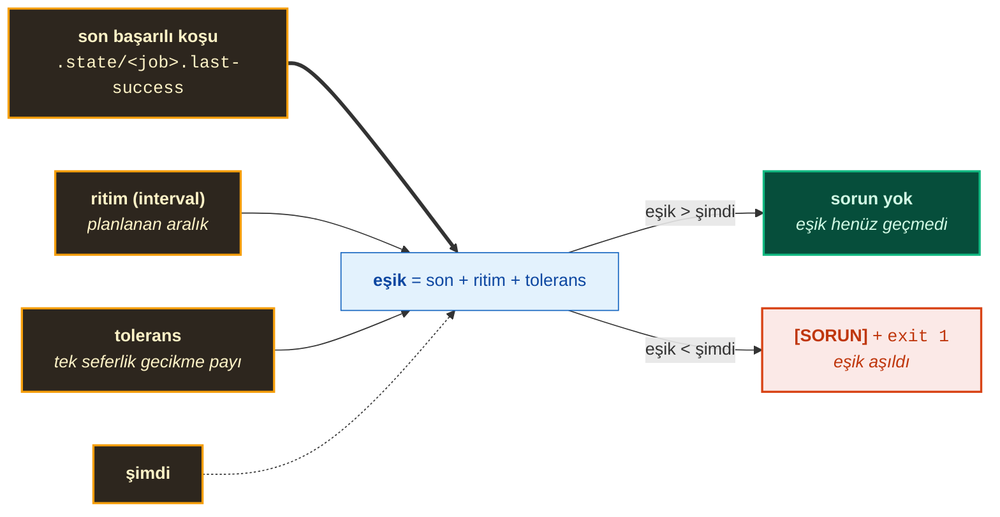
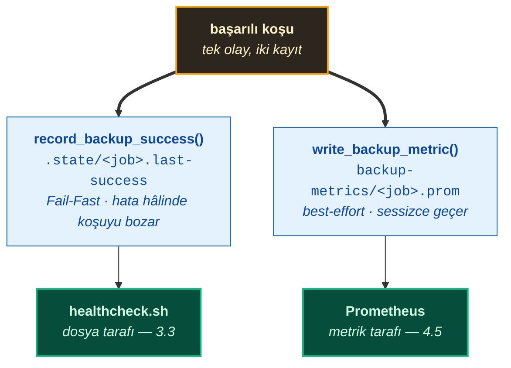
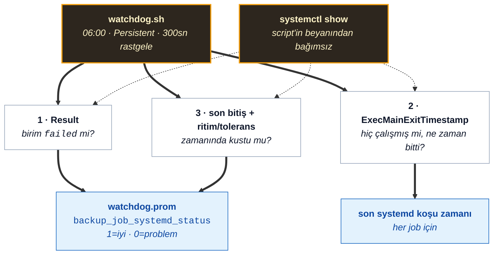
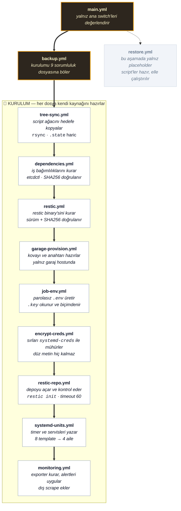
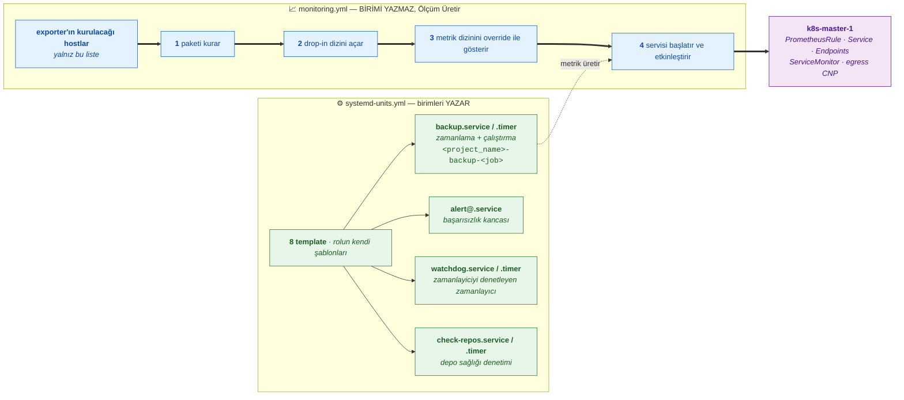
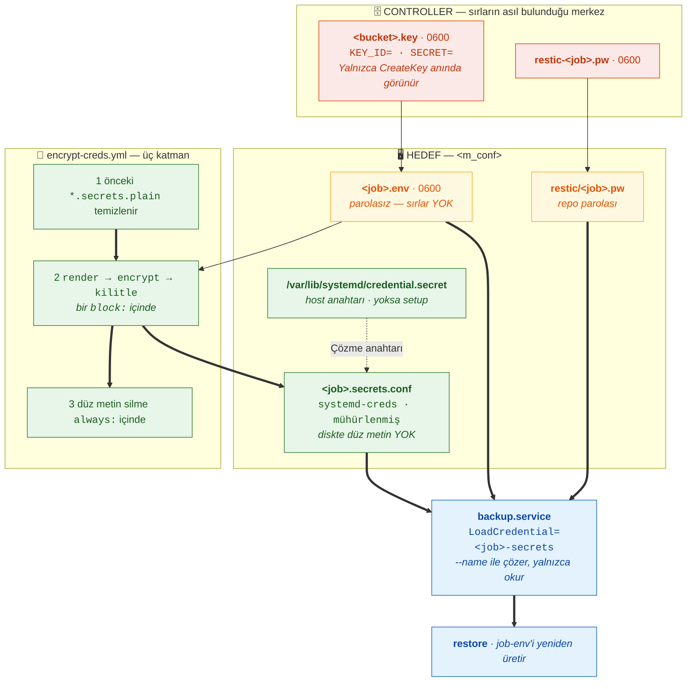
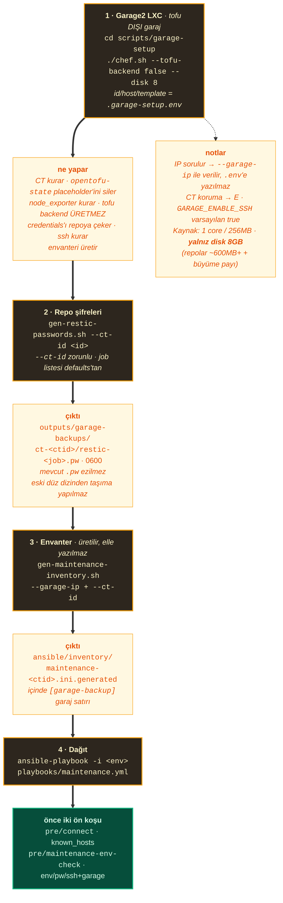
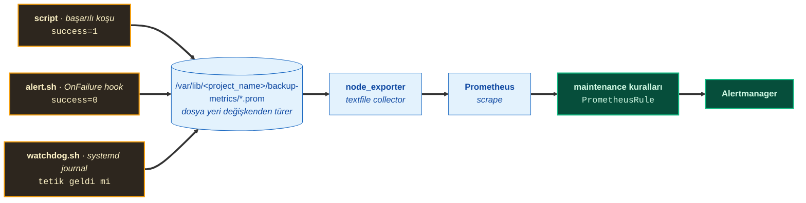
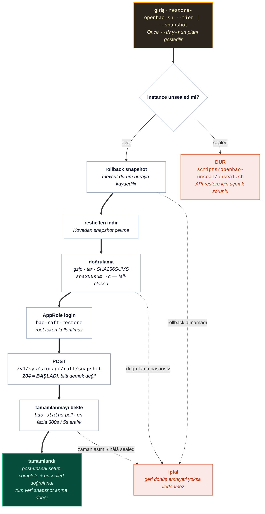

<a id="bas"></a>

# Maintenance — Yedekleme ve Kurtarma Mimarisi

Bu doküman, sistemin veri bütünlüğünü korumak, olası felaket durumlarında (disaster
recovery) iş sürekliliğini sağlamak ve rutin bakım süreçlerini otomatize etmek amacıyla
tasarlanan mimari yapıyı ve işletim prosedürlerini tanımlar.

Yedekleme stratejisi, verinin kritiklik seviyesine, değişim sıklığına ve altyapı
katmanlarına göre ayrılmış **iki temel sütun** üzerine kurgulanmıştır:

1. **Altyapı ve Sanallaştırma Katmanı (VM/LXC Disk Images):** Proxmox VE (PVE)
   üzerinde çalışan sanal makine ve konteynerlerin tam disk görüntülerinin
   (`vzdump`) ve ZFS anlık görüntülerinin (`snapshot`) yönetildiği, anlık ihtiyaç
   durumlarında veya sürümlere geçiş öncesinde çalıştırılan katmandır.
2. **Uygulama ve Kritik Durum Verisi Katmanı (Application State & Secrets):**
   Kubernetes küme durumu (`etcd`) ve secret/şifreleme depolama altyapısının
   (`OpenBao raft`) yönetildiği katmandır. Bu veriler Restic ve Garage S3 nesne
   depolama altyapısı üzerinden uçtan uca şifreli (AES-256-GCM) ve sürümlendirilmiş
   olarak otomatik zamanlayıcılar ile yedeklenir.

Tasarımın dayandığı üç ilke: **katmanlı güvenlik** (her katman kendi zamanlaması ve
saklama politikasıyla bağımsız doğrulanır), **sıfır veri kaybı hedefi** (başarı yalnız
sistem çıktısına bakılarak değil, doğrulama ve tazelik denetimiyle kanıtlanır) ve
**şifreleme standartları** (sırlar diskte açık metin barındırmaz; yedekler
AES-256-GCM ile uçtan uca şifrelenir).

> **İsim notu:** Proje başlangıçta "Tofu-lar" adıyla oluşturulmuş, kapsamına uygun şekilde "Cloud-in-Lab" olarak yeniden adlandırılmıştır. Bu belgedeki `/etc/tofu-lar/`, `/var/lib/tofu-lar/backup-metrics/`, `tofu-lar-backup-*` birim adları ile `project_name: "tofu-lar"` değişken değeri teknik identifier olup bilerek korunmuştur.

<details>
<summary><strong>İçindekiler</strong></summary>

- [1. Tier / Katman Stratejisi (daily / weekly / monthly)](#1-tier--katman-stratejisi-daily--weekly--monthly)
  - [1.1 Saklama Miktarları](#11-saklama-miktarları)
- [2. Dizin Yapısı](#2-dizin-yapısı)
  - [2.1 Kaynak — Depodaki maintenance/](#21-kaynak--depodaki-maintenance)
  - [2.2 Çalışma Kökü — Hedefteki Kopya](#22-çalışma-kökü--hedefteki-kopya)
  - [2.3 Girdi/Çıktı Kökü — <m_conf>/ ve <m_metrics>/](#23-girdiçıktı-kökü--m_conf-ve-m_metrics)
  - [2.4 Birimler](#24-birimler)
  - [2.5 Controller Tarafı — Sırların Asıl Bulunduğu Yer](#25-controller-tarafı--sırların-asıl-bulunduğu-yer)
  - [2.6 Ansible Rolü](#26-ansible-rolü)
  - [2.7 Ortam Kimlikleri](#27-ortam-kimlikleri)
- [3. Sağlık ve Tazelik Denetimi](#3-sağlık-ve-tazelik-denetimi)
  - [3.1 .state Dosyaları Nedir](#31-state-dosyaları-nedir)
  - [3.2 Kim Yazar](#32-kim-yazar)
  - [3.3 Kim Okur](#33-kim-okur)
  - [3.4 Eşik: Ritim + Tolerans](#34-eşik-ritim--tolerans)
  - [3.5 Zamanlama — Cron Kurulmamış, İki Alternatif](#35-zamanlama--cron-kurulmamış-i̇ki-alternatif)
  - [3.6 Watchdog — Timer'ı Denetleyen Timer](#36-watchdog--timerı-denetleyen-timer)
- [4. Restic Mimarisi (bucket/kova => repo, kova başına timer)](#4-restic-mimarisi-bucketkova--repo-kova-başına-timer)
  - [4.1 Model](#41-model)
  - [4.2 Rol Akışı — Ne Kurulur, Nasıl Karar Verilir](#42-rol-akışı--ne-kurulur-nasıl-karar-verilir)
  - [4.3 Job Haritası](#43-job-haritası)
  - [4.4 Kurulum ve İşletme](#44-kurulum-ve-i̇şletme)
  - [4.5 İzleme (Prometheus Zinciri)](#45-i̇zleme-prometheus-zinciri)
  - [4.6 Restic Şifre Emaneti](#46-restic-şifre-emaneti)
- [5. Güvenlik Uyarıları](#5-güvenlik-uyarıları)
- [6. Kurtarma Akışları](#6-kurtarma-akışları)
  - [6.1 Restore (Restic Önce, Geleneksel Yedek)](#61-restore-restic-önce-geleneksel-yedek)
- [7. Detaylı Script Anlatımları](#7-detaylı-script-anlatımları)
  - [7.1 backup/vm-disk/backup-full.sh](#71-backupvm-diskbackup-fullsh)
  - [7.2 backup/vm-disk/backup-quick.sh](#72-backupvm-diskbackup-quicksh)
  - [7.3 backup/app-data/backup-etcd.sh](#73-backupapp-databackup-etcdsh)
  - [7.4 backup/app-data/backup-openbao.sh](#74-backupapp-databackup-openbaosh)
  - [7.5 backup/app-data/backup-key.sh (KALDIRILDI)](#75-backupapp-databackup-keysh-kaldirildi)
  - [7.6 backup/app-data/prune-s3.sh](#76-backupapp-dataprune-s3sh)
  - [7.7 backup/healthcheck.sh](#77-backuphealthchecksh)
  - [7.8 deploy/deploy-maintenance.sh](#78-deploydeploy-maintenancesh)
  - [7.9 restore.sh](#79-restoresh)
  - [7.10 restore-vm.sh](#710-restore-vmsh)
  - [7.11 restore-etcd.sh](#711-restore-etcdsh)
- [8. Sürümler](#8-sürümler)

</details>

---

---

## 1. Tier / Katman Stratejisi (daily / weekly / monthly)

| Katman | Kapsam | Yöntem | Sıklık | Saklama |
|---|---|---|---|---|
| **Disk görüntüsü** | VM/LXC'nin tamamı | `vzdump` (full) + `ZFS snapshot` (quick) — isteğe bağlı, **zamanlanmaz** | Manuel | Yalnız PVE yerel depolaması (Cloud/S3 kullanılmaz) |
| **Uygulama verisi** | etcd, OpenBao raft | `etcdctl`, `bao` → **restic** → Garage2 kovası | 4 saatte bir | `keep_last`: etcd 12/3/3 · openbao 3/3/3 |

Bu sistemde yedekler **tek bir ömürle** saklanmaz. Yedekleme **altı ayrı job**
üzerinden yürür ve her job **kendi kovasına** (= kendi restic deposuna) yazar.
Takvim, saklama ve şifreleme job başına bağımsızdır; aralarında *promote*,
*kopyalama* veya *takvim* mantığı yoktur.

| Kavram | Karşılığı |
|---|---|
| Tier (daily / weekly / monthly) | Job'un **adı ve takvimi**, ayrı bir klasör değil |
| Kova | Garage2 kovası, aynı zamanda **tek restic deposu** (`bucket => repo`) |
| Saklama | `keep_last` — kova içindeki en güncel N snapshot |
| Şifreleme | restic içinde AES-256-GCM + zstd (bkz. Bölüm 4) |

Yani `etcd/daily/etcd-20260929-020000.db` gibi **önekli düz klasörler güncel
modelde yoktur**; her job doğrudan kendi kovasının köküne yazar. Diskte
`restore-etcd.sh` tarafından taranan eski önekler yalnızca *legacy* yoldan
gelir (aşağıya bakınız).

> **Legacy — `s3tier` / `both` (depreise edilmiş):** `MAINT_STORAGE=s3tier` ile
> düz `Garage S3` tier ağacı (`etcd/daily|weekly|monthly`) kullanılırdı. Bu
> depolama yöntemi kullanımdan kaldırılmıştır (deprecated). Üretim ortamı
> varsayılanı `group_vars/all/maintenance.yml → maintenance.backup.storage: "restic"`
> değeridir (bkz. Bölüm 4). Restic altyapısı ile veriler kova bazlı AES-256-GCM + zstd
> şifreleme ile doğrudan depolanır.

**Güncel modelde her job şunları bağımsız yapar:** kendi snapshot'ını alır,
kendi kovasına yazar, `keep_last` sınırını kendi uygular, kendi durum damgasını
(`.state/<job>.last-success`) ve kendi metrik dosyasını yazar.

### 1.1 Saklama Miktarları ve Bildirimsel (Declarative) Takvim

| Job | Kova (restic deposu) | Takvim (OnCalendar) | keep_last | Kapsam |
|---|---|---|---:|---|
| `etcd-daily` | `etcd-daily` | 4 saatte bir (`*-*-* 01,05,09,13,17,21:00:00`) | 12 | etcd snapshot |
| `etcd-weekly` | `etcd-weekly` | Pazar 03:00 (`Sun *-*-* 03:00:00`) | 3 | etcd snapshot |
| `etcd-monthly` | `etcd-monthly` | Ayın 1'i 03:30 (`*-*-01 03:30:00`) | 3 | etcd snapshot |
| `openbao-daily` | `openbao-daily` | 4 saatte bir (`*-*-* 02,06,10,14,18,22:00:00`) | 3 | raft snapshot |
| `openbao-weekly` | `openbao-weekly` | Pazar 04:00 (`Sun *-*-* 04:00:00`) | 3 | raft snapshot |
| `openbao-monthly` | `openbao-monthly` | Ayın 1'i 04:30 (`*-*-01 04:30:00`) | 3 | raft snapshot |

> **Zamanlama Mimarisi:** Takvimler dinamik çalıştırma zamanı hesabı yerine `defaults/main.yml`
> üzerinde açıkça beyan edilen `OnCalendar` ifadeleriyle tanımlanmıştır. `etcd` ve `openbao`
> saat pencereleri çakışmayacak şekilde (tek/çift saatler) ayarlanmıştır.
>
> **VM/LXC disk yedeği (`vm-disk`) bu tabloda yoktur.** `backup-full.sh` ve
> `backup-quick.sh` **zamanlanmış job değildir**; `maintenance_jobs` haritasının
> dışında tutulur ve yalnız **elle / ihtiyaç anında** çalıştırılır (bkz. Bölüm 7).
>
> Sayılar `roles/maintenance/defaults/main.yml → maintenance_jobs` içindeki
> `keep_last` değerleridir; değiştirmek için aynı sözlük düzenlenir. Bu tablo
> referans amaçlıdır, dinamik kaynak kodu temsil etmez.

[⬆ Başa dön](#bas)

---

## 2. Dizin Yapısı

Yedek sistemi üç ayrı kök üzerinde durur ve bu ayrım kasıtlıdır: her kökün
**senkronizasyon ve gizlilik davranışı** farklıdır.

| Kök | Nerede | Senkronize | Neden ayrı |
|---|---|---|---|
| **Kaynak** | Depoda `maintenance/` | `tree-sync.yml` her hedefe kopyalar | Sürümü buradan okuruz |
| **Çalışma kökü** | Hedefte `<m_root>/maintenance/` | kopyanın kendisi | Scriptler buradan çalışır |
| **Girdi/çıktı** | `<m_conf>/`, `<m_metrics>/` | senkronize edilmez | Job'a özeldir, hedefe göre değişir |

> **Bu bölümdeki yolların hiçbiri sabit yazılmaz — hepsi `maintenance.project_name`
> değişkeninden türetilir.** Varsayılan değer `tofu-lar`'dır ve belgedeki tüm
> örnekler bu varsayılanla yazılmıştır; başka bir ad kullanırsanız yol da değişir.

| Türetilmiş yol | Kaynak değişken | `project_name: tofu-lar` iken |
|---|---|---|
| `m_conf` | `maintenance.project_name` | `/etc/tofu-lar/` |
| `m_metrics` | `maintenance.project_name` | `/var/lib/tofu-lar/backup-metrics/` |
| `m_root` | `maintenance.project_name` + `ansible_user` | `/root/tofu-lar/` veya `/home/<user>/tofu-lar/` |
| `m_prefix` | `maintenance.project_name` | `tofu-lar-backup` (birim ön eki) |

Değişkeni `roles/maintenance/defaults/main.yml → maintenance.project_name`
üzerinden değiştirin; `group_vars` ile de ezebilirsiniz. Tek yazılması gereken
yer orasıdır — bu bölümdeki yol, birim adı ve `Environment=HOME` değeri
`{{ project_name }}` ile şablonlanır.

Üçüncü kök senkronizasyon dışında bırakılır çünkü içeriği hedefin kendi
durumudur: bir hostun `.env` dosyasını başka hosta kopyalamak uygun bir yaklaşım
değildir (bkz. 4.2).

### 2.1 Kaynak — Depodaki `maintenance/`

```text
maintenance/
├── _common.sh # PAYLAŞILAN: log, S3, credential, freshness, TIER fonksiyonları
├── deploy/
│ └── deploy-maintenance.sh # Kontrol menüsü: PVE disk / Master etcd / OpenBao S3 / Tümü / Durum
├── backup/
│ ├── healthcheck.sh # Backup freshness + ritim/tolerans (cron log'ları kimse okumuyor)
│ ├── vm-disk/ # VM/LXC disk yedekleri
│ │ ├── backup-full.sh # vzdump + local tier weekly/monthly
│ │ └── backup-quick.sh # ZFS anlık snapshot
│ └── app-data/ # Uygulama verisi yedekleri
│ ├── backup-etcd.sh # etcd snapshot → restic (Garage2)
│ ├── backup-openbao.sh # OpenBao raft snapshot → yerel kopya + restic
│ └── prune-s3.sh # Manuel/toplu S3 retention temizlik (legacy flat)
├── restore/
│ ├── _common.sh # restore'a özel (VM tespiti, kubeadm static-pod, tier+flat fallback)
│ ├── restore.sh # Ana menü ve parametre yönlendirici
│ ├── restore-vm.sh # VM/LXC disk görüntüsü kurtarma
│ ├── restore-etcd.sh # etcd snapshot kurtarma (kubelet-aware)
│ └── restore-openbao.sh # OpenBao raft snapshot kurtarma (CT301'de çalışır)
```

> **Mimari not:** `_common.sh` tek yerde (`maintenance/_common.sh`) — hem `backup/*` hem `restore/*` bunu source eder. `restore/_common.sh` sadece restore'a özel fonksiyonları tutar. Credential dosyası `source` edilmez, sadece `S3_*` satırları `grep` ile okunur.

`vm-disk/` ile `app-data/` ayrıdır çünkü hedefleri farklıdır: `vm-disk/` yalnız PVE
üzerinde çalışır ve çıktısı yerel diske yazılır, `app-data/` ise uzak kovaya
(restic) gönderir. Aynı klasör altında dursalardı "nerede çalışır" sorusunun
cevabı dosya adına bakmayı gerektirirdi.

`deploy/` kök seviyede ayrıdır çünkü tek script'tir ve `backup/`-dan farklı bir
makineden çalışır: işi hedefte yürütür, kendisi yedek almaz.

### 2.2 Çalışma Kökü — Hedefteki Kopya

`tree-sync.yml` bu ağacı her hedefe rsync ile taşır ve iki şeyi bilerek dışarıda
bırakır: `.state/` dizini ve `docs/`. Dışarıda bırakmanın nedeni `.state`'in
host'a özgü olmasıdır — aynı job'un iki hosttaki son başarılı koşusu farklıdır.

```text
<m_root>/maintenance/ # /root/tofu-lar (root) veya /home/<user>/tofu-lar
├── _common.sh
├── backup/
│ ├── healthcheck.sh
│ ├── vm-disk/{backup-full.sh,backup-quick.sh}
│ └── app-data/{backup-etcd.sh,backup-openbao.sh,prune-s3.sh}
├── restore/ # yalnız restore yapabilen hostlara
│ ├── _common.sh, restore.sh, restore-vm.sh, restore-etcd.sh, restore-openbao.sh
├── .state/ # senkronize EDİLMEZ — host'a özgü
│ ├── <job>.last-success
│ └── ...
└── deploy/ # hedefte kullanılmaz, senkronize edilir de çalıştırılmaz
```

`.state/<job>.last-success` dosyasını `record_backup_success()` yapar, `healthcheck.sh`
okur. İçeriği tek satır UTC damgasıdır. Neden dosya tabanlı olduğu ve neden
senkronize edilmediği bkz. 3.1.

### 2.3 Girdi/Çıktı Kökü — `<m_conf>/` ve `<m_metrics>/`

Bu kökün tamamı **çalışma sırasında oluşturulur**; depoda karşılığı yoktur.
Aşağıdaki ağaç `project_name: tofu-lar` varsayılanıyla yazılmıştır:
`<m_conf>` = `/etc/tofu-lar/`, `<m_metrics>` = `/var/lib/tofu-lar/backup-metrics/`.

```text
/etc/tofu-lar/ # tree-sync.yml hazırlar
├── restic/ # ağacın yanında, ayrı alt kök
│ └── <job>.pw # restic.yml dağıtır (controller'dan), 0600
└── backup/ # ağacın yanında, ayrı alt kök
    ├── <job>.env # job-env.yml oluşturur, 0600 — sırsız
    ├── <job>.secrets.conf # encrypt-creds.yml hazırlar, 0600 — şifreli
    ├── alert.sh # systemd-units.yml hazırlar, 0750
    ├── check-repos.sh # systemd-units.yml hazırlar
    ├── watchdog.sh # systemd-units.yml hazırlar
    └── watchdog.jobs # systemd-units.yml hazırlar

/var/lib/tofu-lar/backup-metrics/ # tree-sync.yml hazırlar
├── <job>.prom # İKİ yazar: write_backup_metric() (başarı) + alert.sh (OnFailure) — bkz. 4.5
└── watchdog.prom # watchdog.sh yazar (systemd tetik kaydı)
```

`<job>.secrets.plain` dosyası da bu dizinde oluşur ama **kalıcı değildir**:
`encrypt-creds.yml` önceki koşudan kalanları temizler, her koşuda yeniden oluşturur
ve `always:` bloğunda siler (bkz. 4.2). Normalde bulunmaz.

`backup-metrics/` dizinini `write_backup_metric()` de `mkdir -p` ile yeniden
oluşturabilir; devamlılık `tree-sync.yml`'ye bırakılır ki image yeniden kurulduğunda
dizin systemd birimi başlamadan hazır olsun.

### 2.4 Birimler

`systemd-units.yml` ve `monitoring.yml` şu dosyaları hazırlar. Birim ön eki
`<m_prefix>` = `{{ project_name }}-backup` olduğu için aşağıdaki adlar da
`tofu-lar` varsayılanıyla yazılmıştır.

```text
/etc/systemd/system/
├── tofu-lar-backup-<job>.service # her job için
├── tofu-lar-backup-<job>.timer # her job için
├── tofu-lar-backup-alert@.service # OnFailure kancası
├── tofu-lar-backup-watchdog.service
├── tofu-lar-backup-watchdog.timer
├── tofu-lar-backup-check.service
├── tofu-lar-backup-check.timer
└── prometheus-node-exporter.service.d/
    └── tofu-lar.conf # monitoring.yml, m_exporter_hosts'taki hostlarda
```

`monitoring.yml` ayrıca `/tmp/<project_name>-*.yaml` dosyalarını `kubectl apply` için
hazırlar ve iş bitince temizler; bu dosyalar kalıcı değildir.

### 2.5 Controller Tarafı — Sırların Asıl Bulunduğu Yer

Bu dosyalar **repoya gönderilmez** (`.gitignore`: `ansible/outputs/`, `*.key`) ve
web arayüzünde **görünmez**. Depoda pushlarken silinmezler; ağaç burada tam adresleriyle
gösterilir çünkü rol bunları okur ve sırlar burada durur.

```text
ansible/outputs/garage-backups/ct-<CT_ID>/
├── <bucket>.key # 0600, kova başına Garage erişim anahtarı
│ └── <bucket> = etcd-daily, etcd-weekly, etcd-monthly,
│ openbao-daily, openbao-weekly, openbao-monthly
└── restic-<job>.pw # 0600, job başına restic parolası
    └── <job> = etcd-daily, etcd-weekly, etcd-monthly,
                openbao-daily, openbao-weekly, openbao-monthly
```

`ct-<CT_ID>` alt dizini envanter dosya adından türetilir
(`maintenance-320.ini.generated` → `ct-320`), böylece iki CT'nin sırları
birbirine karışmaz. Parolalar `chef.sh` kapanışında `gen-restic-passwords.sh`
ile üretilir, `.key` dosyaları ise `garage-provision.yml` tarafından yazılır
(bkz. 4.2). Kova başına ayrı anahtar tercih edilir: anahtar kaybı tek bir kovayla
sınırlı kalır ve blast radius küçülür.

**Bu dosyaların kopyası olmadan kova kurtarılamaz.** Garage anahtarı yalnız
`CreateKey` anında bir kez görünür; `.key` dosyası kaybolursa o kova için
yeniden anahtar üretmek mümkün değildir (bkz. 4.2, anahtar matrisi).

### 2.6 Ansible Rolü

Rol tek giriş noktasıyla çalışır; ayrıntı ve sıralama bkz. 4.2.

```text
ansible/roles/maintenance/
├── defaults/main.yml # maintenance_jobs, m_conf, m_metrics, m_garage_out_dir, şalterler
├── tasks/
│ ├── main.yml # iki ana şalter → backup.yml / restore.yml
│ ├── backup.yml # dokuz dosyayı sırayla include eder
│ ├── restore.yml # yer tutucu: görev YAZILMADI, restore she'li elle çağrılır
│ ├── tree-sync.yml # ağacı + <m_conf> + <m_metrics> dizinlerini hazırlar
│ ├── dependencies.yml # etcdctl indirir, upstream SHA256SUMS ile doğrular
│ ├── restic.yml # binary kurar, <job>.pw dağıtır
│ ├── garage-provision.yml # kova, alias, anahtar, R/W yetkisi
│ ├── job-env.yml # <job>.env üretir
│ ├── encrypt-creds.yml # <job>.secrets.conf hazırlar
│ ├── restic-repo.yml # depoyu açar/kontrol eder
│ ├── systemd-units.yml # birimleri hazırlar ve etkinleştirir
│ └── monitoring.yml # exporter, PrometheusRule, dış scrape
├── templates/
│ ├── backup.env.j2, backup.secrets.env.j2
│ ├── backup.service.j2, backup.timer.j2
│ ├── alert.sh.j2, alert@.service.j2
│ ├── watchdog.{sh,jobs,service,timer}.j2
│ ├── check-repos.sh.j2, check.{service,timer}.j2
│ ├── node-exporter-override.conf.j2
│ ├── external-exporter-servicemonitor.yaml.j2
│ ├── external-exporters-endpoints.yaml.j2
│ └── external-exporter-egress.yaml.j2
├── templates/alerts/
│ ├── maintenance.yaml.j2 # fragment'leri toplar (wrapper)
│ └── backup.yaml.j2 # backup grubu
└── handlers/
```

`templates/alerts/` altında `restore.yaml.j2` **yoktur** ve bu bilinçlidir:
`maintenance.restore.enabled` açıkça render/apply görevini çalıştırır, wrapper
`` ile dosyayı bulamaz ve playbook kırılır (bkz. 4.5). Fragment,
restore otomasyonu yazıldığı gün eklenir — wrapper'daki include zaten hazır
bekliyor (bkz. 4.2 "Yazılmamış olan", `restore.yml`).

> **Raft yedeği iki katmanlıdır:**
>
> 1. **Yerel kopya** — `/var/lib/bao-raft-snaps/` (7 gün). `backup-openbao.sh` yazar.
> Dizin raft veri dizininden (`openbao_raft_path`) ayrıdır: aynı mount'ta tutmak
> `find -mtime` kapsamını ve "hangi dosya raft?" ayrımını bulanıklaştırır.
> 2. **Uzak kopya** — restic → Garage2 `openbao-daily|weekly|monthly` kovaları.
>
> Kimlik `bao agent` (auto_auth/AppRole) unix socket'i üzerindendir; **root token
> kullanılmaz.** Snapshot yetkileri `docs/tr/openbao/openbao-rbac.md` B10/P5,
> geri yükleme yetkileri B11/P6'dır. Geri yükleme: `restore-openbao.sh`
> (profil `bao-raft-restore`).
>
> Yedekleme `openbao_backup_enabled` tek bayrağına bağlıdır. Bu bayrağın
> kapatılması raft yedeğini de durdurur; `backup-openbao.sh` elle de
> çalıştırılabilir.

> **İzin notu:** Depodaki `*.sh` dosyaları 644 olarak durur ve `tree-sync.yml`
> modu korumadığı için hedefe de 644 gider. Elle ya da cron ile çalıştırmadan
> önce çalıştırılabilir yapılır:
> ```bash
> find maintenance -name '*.sh' -exec chmod +x {} +
> ```
> Zamanlanmış işler `systemd timer` olduğu için bu iş normalde gerekmez.

> **Örnek VMID'ler:** Aşağıdaki `300` / `301` örneklerdir — komutları kendi Proxmox kurulumunuzdaki **gerçek guest ID** ile çalıştırın.

### 2.7 Ortam Kimlikleri

Belgede geçen **makine adları ve LXC/VM kimlikleri de değişkenden gelir.** İki farklı
sınıf vardır ve karıştırılmamalıdır:

| Sınıf | Kaynak | Bu kurulumdaki değer | Nerede kullanılır |
|---|---|---|---|
| **Envarter host adı** | `ansible/inventory/*.ini.generated` (üretilen dosya) | `k8s-master-1`, `openbao-1`, `garage2` | `maintenance_jobs.<job>.host`, `m_exporter_hosts` |
| **LXC/VM kimliği (CT ID / VMID)** | `chef.sh --ctid <id>`, `.garage-setup.env`, Proxmox | Garage `320`, OpenBao `301`, K8s `300` | yol adları, `vzdump-*` dosya adları, `restore.sh` |
| **Proje adı** | `maintenance.project_name` | `tofu-lar` | `<m_conf>`, `<m_metrics>`, birim ön eki (bkz. 2.3) |

> **Envarter host adları kalıcı sözleşmedir.** `defaults/main.yml` içindeki
> `host: "k8s-master-1"` / `host: "openbao-1"` değerleri, `*.ini.generated`
> dosyasındaki **host adıyla birebir eşleşmelidir** — IP adresiyle değil, ada
> göre eşleşme yapılır. Host'u yeniden adlandırırsanız `defaults/main.yml`,
> `group_vars` ve `monitoring.yml` birlikte güncellenmelidir.
>
> **CT ID / VMID'ler yalnızca bu kuruluma özgüdür.** Garage LXC'nin ID'si
> `chef.sh --ctid` ile geçer (boş bırakılırsa `.garage-setup.env` okunur) ve
> envanter dosyası `maintenance-<ctid>.ini.generated` adıyla üretilir. Bu
> yüzden belgede geçen `300` / `301` / `320` **örnek** değerlerdir; kendi
> ortamınızda başka değerler olacaktır.
>
> **`restore.sh` Tam Esnektir:** `restore.sh` ve alt script'leri Proxmox üzerindeki
> tüm `vzdump-*.tar.zst` arşivlerini dinamik tarar, interaktif menüde kullanıcıya VMID
> sorar ve CLI üzerinden istenen herhangi bir VMID listesini (`./restore.sh all 100 101`)
> parametre olarak kabul eder.

[⬆ Başa dön](#bas)

---

## 3. Sağlık ve Tazelik Denetimi

Bir backup'ın "aldım" demesi tek başına bir şey ifade etmez; asıl soru **ne zaman
son başarılı olduğudur**. systemd timer sessizce kırılabilir (timer silinmiş,
birim `failed`, host yeniden başlamış), script sessizce hata ile çıkabilir,
ağ koptuğunda yükleme yarım kalabilir. Bu durumların hiçbirinde insana kendiliğinden
bir şey ulaşmaz — journal'a yazılanı zaten kimse okumaz. Bu bölüm, "son başarılı
yedek ne zamandı, bunu kim fark edecek" sorusunun cevabını verir: dosya tarafı
(`.state`), metrik tarafı (`.prom`) ve timer tarafı (watchdog) — üçü ayrı
gözlerdir, birbirinin yerine geçmez.

### 3.1 `.state` Dosyaları Nedir

Backup script'i **başarıyla** bitince `_common.sh` içindeki `record_backup_success()`
çalışır ve script'in yanında duran dizine tek satırlık UTC zaman damgası yazar:

```text
maintenance/.state/<job>.last-success
```

Dosya adı job adıdır (`etcd-daily.last-success`, `openbao-daily.last-success`,
`vm-disk-300.last-success`); içeriği tek bir ISO damgadır
(`2026-09-24T16:11:19Z`). Dosya yoksa demek ki o iş **hiçbir zaman başarılı
olmamıştır** — sağlık denetimi bunu da sorun sayar.

Dosya tabanlı olmasının sebebi basittir: süreç bittiğinde hafızadaki her şey
kaybolur, geriye yazan bir iz kalır. Yedek sistemine en son ne zaman güvenildiğini
sorulduğunda cevap, o izdir. Dizin git'e girmez (`.gitignore` içinde) ve hiçbir
senkronizasyonda kopyalanmaz — çünkü durum **koştuğu makinenin yerel** kaydıdır.

### 3.2 Kim Yazar

Yazan taraf tek fonksiyondur, çağıranlar üç script:

| Script | Makine | Damga |
|---|---|---|
| `backup/app-data/backup-etcd.sh` | K8s Master | `<JOB_NAME>.last-success` (envanter `etcd-daily` / `etcd-weekly` / `etcd-monthly`) |
| `backup/app-data/backup-openbao.sh` | OpenBao CT | `<JOB_NAME>.last-success` (`openbao-daily` / `-weekly` / `-monthly`) |
| `backup/vm-disk/backup-full.sh` | PVE | `vm-disk-<VMID>.last-success` |

İki önemli kural:

* **Yalnızca başarılı koşu yazar.** Başarısız koşuda dosyaya dokunulmaz; eski damga
  yerinde kalır ve giderek eskiyerek "sorun"un kendisine dönüşür. Yani dosyanın
  bayatlaması, izlenen şeyin ta kendisidir.
* **`backup-quick.sh` yazmaz** — ZFS snapshot'ı manuel/anlık bir araçtır, planlı
  bir işin parçası değildir ve sağlık denetiminin konusu değildir.

İki yazma **aynı koşuda fakat farklı koruma düzeyinde** çalışır:

* `write_backup_metric()` **best-effort**'tur: dosya/klasör açılamazsa sessizce
  `return 0` eder — metrik kaybı hiçbir koşuyu bozmaz.
* `record_backup_success()` **Fail-Fast** (katı doğrulama) davranışı gösterir
  (`mkdir -p` + `date > dosya`). Yedekleme adımı başarılı olsa dahi durum damgasının
  `.state` dizinine yazılamaması (örneğin disk doluluğu veya erişim izni hatası) durumunda
  süreç hata ile sonlandırılarak hatalı/eksik bir durum beyanının (false-positive)
  önüne geçilir.

### 3.3 Kim Okur

`.state` dosyalarını okuyan **tek motor `healthcheck.sh`**'dir. `backup_age_hours()`
ile dosyanın yaşı hesaplanır, `is_overdue()` ile `son_success + interval + tolerance`
eşiğiyle karşılaştırılır; eşiği aşan işe `[SORUN]` yazılır ve betik **exit 1** ile
çıkar. 

`healthcheck.sh`, ihtiyaç anında veya harici otomasyonlar tarafından çağrılabilen
bağımsız bir doğrulama aracıdır:

| Çağırıcı | Ne zaman | Ne olur |
|---|---|---|
| `restore.sh health` | sen yazdığında (menü veya `./restore.sh health`) | çıktıyı ekrana basar |
| `deploy-maintenance.sh` menü 5 | sen menüden seçtiğinde | SSH ile hedef makinede koşar (`--only etcd\|vm-disk\|openbao`), üç hedefin birleşik exit kodunu döndürür |
| Harici İzleme / Script | Periyodik tetiklendiğinde | Çıktıyı log kanalına aktarır (`--quiet` seçeneğiyle) |

Sistem üzerindeki rutin ve kesintisiz tazelik takibi ise entegre **Prometheus (BackupOverdue)**
ve **systemd Watchdog** servisleri tarafından yürütülür.

Ayrıca `.state` şuralarda **okunmaz**:

* **Prometheus** — alert'i `.prom` metriğinden beslenir, dosyaya bakmaz.
* **Watchdog** — systemd'in kendi journal kaydını okur (bkz. 3.6), `.state`'e dokunmaz.
* **rsync / tree sync** — `--exclude='.state/'` ile bilinçli olarak hariç tutulur.

### 3.4 Eşik: Ritim + Tolerans

Denetimin tek formülü vardır:



Örnek: etcd 4 saatte bir koşması beklenen bir işse, ritmi 4 saattir; tek seferlik
gecikme payı (tolerans) 2 saat eklenir → son başarılıdan 6 saatten fazla zaman
geçtiyse raporlanır. Tolerans, planlama gecikmesini (ör. `RandomizedDelaySec=300`,
missed tetik telafisi) suçlu saymamak içindir.

Ritim ve tolerans **iki ayrı yerde** durur ve ikisi de dikkat ister:

| | Nerede | Ne için |
|---|---|---|
| `healthcheck.sh` kendi sözlüğü | betiğin içi (`INTERVAL_H` / `TOLERANCE_H` — **kodda sabit**) | `.state` dosyasını okuyan denetimin eşiği |
| `maintenance_jobs → interval_h / tolerance_h` | `roles/maintenance/defaults/main.yml` → job'un `.env`'i → `BACKUP_MAX_AGE_SECONDS` | `.prom` metriğine yazılan alert eşiği (bkz. 4.5) |

Yani `maintenance_jobs`'taki bir değer **healthcheck'in eşiğini değiştirmez** —
o eşik betiğin içine gömüdür, değiştirmek için `healthcheck.sh` içindeki sözlüğün
kendisi düzenlenir. İkisi şu an aynı rakamları yazıyor, ama ayrı iki kaynaktır —
biri güncellenip öbürü unutulursa denetimler farklı cevap verir.

Aynı formülün metrik tarafı: `write_backup_metric()` job env'inden okuduğu
`BACKUP_MAX_AGE_SECONDS`'ı da `.prom` dosyasına yazar, böylece Prometheus
`BackupOverdue` kuralı **tek ifadeyle** tüm job'ları kendi eşiğiyle kontrol eder
(bkz. 4.5). Dosya tarafı ile metrik tarafı, aynı başarıyı **iki ayrı biçimde**
kayıt altına alır:



### 3.5 Zamanlama — Cron Kurulmamış, İki Alternatif

`healthcheck.sh` zamanlamaya ihtiyaç duymaz; **isteyenin kendi düzenine
bağlayabileceği** bir denetimdir. Burada cron'un amacı, denetimi belirli bir
zamanda kendiliğinden tetiklemektir — çıktısının nereye gideceğini kuran yine
kullanıcıdır.

Örnek kurulumda bu bağlantı **yapılmamıştır**: ansible rolü healthcheck için timer veya
cron kurmaz, bildirim ayarlanmamıştır. Bunun yerine denetimin periyodik/otomatik
ayağı iki farklı mekanizma tarafından karşılanır — metrik üzerinden Prometheus
alert'leri (4.5) ve systemd üzerinden watchdog (3.6). `.state` tarafı ise
`restore.sh health` / deploy menü 5 ile **istek anında** sorgulanır.

Kendi düzenini kurmak isteyen için örnek (çıktısı STDOUT'tur; exit kodu 0/1'dir,
yazıyı kendi log/monitoring kanalına yönlendirirsiniz):

```text
0 8 * * * /<PROJECT_DIR>/maintenance/backup/healthcheck.sh --quiet
```

`--quiet` bu içindir: sorun yokken hiç yazmaz (boş çıktı üretmez), sorun varsa
yazar ve 1 döner — çıktı kanalını boş satırlarla doldurmaz.

### 3.6 Watchdog — Timer'ı Denetleyen Timer

Yukarıdaki tüm denetimler "başarılı oldu mu" der; watchdog ayrı bir soru sorar:
**"o iş hiç koşuldu mu?"** Script metrik bile yazamayabilir (binary eksik, dosya
izinleri, disk dolu) — o zaman `.prom` tarafı da kör kalır. Watchdog, cevabı
script'in kendi beyanından **bağımsız** olarak, systemd'in tuttuğu kayıtlardan alır.

Rol bunu iki birimle kurar: `tofu-lar-backup-watchdog.service` +
`.timer` (`systemd-units.yml`), günlük `06:00`'da (`Persistent=true` + 300 sn rastgele
gecikme) çalışır ve `watchdog.sh` şu üç soruyu `systemctl show` üzerinden cevaplar:



Cevaplar `backup-metrics/watchdog.prom` dosyasına iki metrik olarak yazılır:
`backup_job_systemd_status` (1=iyi, 0=problem) ve her job için son systemd koşu
zamanı; ayrıca watchdog'un **kendisinin** son çalışma zamanı
(`backup_watchdog_last_run_timestamp_seconds`).

Job listesi ve eşiği `watchdog.jobs` dosyasından gelir (rol tarafından
`maintenance_jobs`'tan üretilir; `job|unit|ritim|tolerans` satırları) — yani
healthcheck'inkinden **farklı ve ayrı bir** eşik tablosudur. Watchdog yalnızca
`maintenance_jobs`'ta job'u olan hostlarda kurulur (master, openbao); PVE'de
kurulmaz, çünkü PVE'de zamanlanan bir job yoktur.

İki alert bu metriklerden doğar (4.5): `BackupScheduleMissed` (critical — birim
failed / hiç koşulmamış / pencere aşılmış) ve `BackupWatchdogStale` (warning —
watchdog'un kendisi 28 saattir koşmamış; o zaman bu denetim de kör demektir).

[⬆ Başa dön](#bas)

---

## 4. Restic Mimarisi (bucket/kova => repo, kova başına timer)

> **Ön koşul:** Rol çalışmadan önce Garage2 CT `scripts/garage-setup/chef.sh --tofu-backend false --enable-ssh true` ile kurulmalı, kapanışta `maintenance-<ctid>.ini.generated` envanteri ve `restic-*.pw` şifreleri üretilmelidir. Envanter olmadan rol hedefe ulaşamaz.

### 4.1 Model

* **Kova => repo = timer**: her job **kendi zamanında kendi taze snapshot'ını** alır ve
  **kendi Garage2 kovasına** yazar. Promote/kopyalama/takvim mantığı YOK.
* **Saklama = keep-last N**: seri job'un **ilk koşusundaki yedeğin damgasıyla** başlar;
  kova asla N'i geçmez (N aşılınca en eski düşer). Atanan koşu = boşluk, telafi uydurulmaz.
* **Şifreleme dahili** (restic: AES-256-GCM + zstd) — mevcut en büyük açık olan
  "şifresiz etcd Secret'leri + plaintext HTTP" kapanır.
* **Ayrışma**: kova başına ayrı Garage anahtarı (yalnız kendi kovası, R/W — Owner (Sahip) yetkisi tanımlanmaz) +
  repo başına ayrı şifre + state (CT300) ⟂ backup (Garage2) ayrı LXC.
* **Endpoint sabit değil**: restic/S3 hedefi (`maintenance.backup.garage2_endpoint`)
  envanterdeki `[garage-backup]` host'undan türer — hardcoded IP yok. (Eski sabit
  değer CT yeniden kurulunca ölü kalmış, restic init'i asılı bırakıp fail ediyordu;
  init'e ayrıca `timeout 60` eklendi.) IP değişirse envanter tazelenir +
  playbook rerun — şablonda/repoda elle değişiklik gerekmez.

### 4.2 Rol Akışı — Ne Kurulur, Nasıl Karar Verilir

#### Bölünme İlkesi

Rol, iki kademeli bir zincirle kurulur: `main.yml` yalnız ana şalterleri değerlendirir
(`backup.yml` / `restore.yml`), `backup.yml` ise kurulumu dokuz sorumluluk dosyasına böler.
Bu bölünme tercih edilir çünkü her dosya tek bir teslim sözleşmesi taşır ve
`garage-provision` (271 satır) gibi hacimli adımlar diğerlerinden bağımsız okunur.

Bölünmenin ölçüsü **"hangi dosya bu kaynağın sahibidir"** sorusudur. Her kaynak için
tek sahip vardır; ikinci bir sahip, idempotency'yi iki tarafa da yazarak bozar.

| Kaynak | Sahibi | Kapsam dışı |
|---|---|---|
| Ağaç (script'ler, `restore/`, `backup-metrics/`) | `tree-sync.yml` | — |
| İş bağımlılıkları (etcdctl indir + SHA256 doğrula) | `dependencies.yml` | — |
| Restic binary | `restic.yml` | — |
| Kova + anahtar + bucket yetkisi | `garage-provision.yml` | Parola, env |
| Parolasız env (`.env`) | `job-env.yml` | Sırlar |
| Şifreli credential (`.secrets.conf`) | `encrypt-creds.yml` | — |
| Restic deposu | `restic-repo.yml` | Sırlar |
| Birimler (unit) | `systemd-units.yml` | İzleme |
| İzleme (exporter, PrometheusRule, dış scrape) | `monitoring.yml` | Birim yazımı |

#### Zincir

Sıralama bir teslim sözleşmesidir: bir dosya, girdisini bir öncekinin **bitirdiğinden**
sonra alır. Örnek: `restic-repo.yml` `encrypt-creds.yml`'in ürettiği şifreli dosyayı okur,
`monitoring.yml` `tree-sync.yml`'in açtığı `backup-metrics/` dizinini kullanır.

Her `include_tasks` kendi `when` kapısıyla çalışır; kapı, `defaults/main.yml` içindeki
`m_*` listelerine dayanır (örneğin `m_restic_jobs_local`). Boş listeye düşen dosya hiç
girmez, `garage-provision` yalnız `[garage-backup]` hostunda çalışır.



`==>` işareti "girdi, bir öncekinin **bitirdiğinden** sonra alınır" sözleşmesidir: örneğin
`restic-repo.yml`, `encrypt-creds.yml`'in ürettiği şifreli dosyayı okur.

Her adım kendi şartına bağlıdır ve bu şart `defaults/main.yml` içindeki listelerden
türetilir — o host'ta işi olan job yoksa o adım hiç girmez:

| Dosya | Şartı | Yani |
|---|---|---|
| `tree-sync` · `systemd-units` | `m_jobs_local` | bu host'ta en az bir zamanlanmış iş var |
| `dependencies` | `m_etcdctl_jobs_local` | bu host'ta `etcdctl` isteyen en az bir iş var |
| `restic` · `job-env` · `encrypt-creds` · `restic-repo` | `m_restic_jobs_local` | bunlardan en az biri restic kovasına yazıyor |
| `garage-provision` | `m_buckets` **+** garaj hostu | kova gereken iş var **ve** host `[garage-backup]` |
| `monitoring` | üç ayrı şart | aşağıda |

#### Yazılmamış olan — sh/Ansible ayrımı

Zincirin **backup** bacağı tamdır: dokuz dosya, `tree-sync`'ten `monitoring`'e kadar her
biri tek bir kaynağın sahibidir ve playbook bunları kurar, dağıtır, zamanlar.

**Restore bacağı ise yalnızca shell tarafında yazılmıştır.** `maintenance/restore/`
altındaki beş script (`_common.sh`, `restore.sh`, `restore-vm.sh`, `restore-etcd.sh`,
`restore-openbao.sh`) eksiksizdir ve elle çalıştırılır; `tasks/restore.yml` ise **task
içermeyen bir yer tutucudur**, `maintenance.restore.enabled` varsayılan `false`'dır.

| | Backup bacağı | Restore bacağı |
|---|---|---|
| Shell tarafı | 7 script — `backup/` (6) + `_common.sh` | 5 script — `restore/` |
| Ansible tarafı | 9 dosya, tam | **yazılmadı** (`restore.yml` boş) |
| Nasıl çalışır | playbook kurar → timer çalıştırır | operatör SSH ile elle çağırır |
| Anahtar | `maintenance.backup.enabled` (true) | `maintenance.restore.enabled` (false) |

`maintenance/deploy/deploy-maintenance.sh` ve `backup/app-data/prune-s3.sh` bu iki
bacak dağıtım zincirinin parçası değildir: ilki elle kurulan bootstrap, ikincisi
legacy flat nesnelerin temizliğidir (rsync include-list ikisini de dışarıda bırakır).

Bu bir eksik değil, **bilinçli bir sınır**: restore yıkıcı bir işlemdir (VM/LXC
`destroy`, etcd static-pod yeniden kurulumu, raft rollback) ve kararı insan verir.
Otomasyon yazıldığında `restore.yml` görevleri, `alerts/restore.yaml.j2` fragment'i
ve `restore.enabled` şalteri birlikte devreye alınır — üçü de iskelet olarak hazır
bekliyor.

`monitoring.yml` tek dosya olmakla birlikte üç ayrı şartla çalışır: node\_exporter bloğu
`m_exporter_hosts` (yalnız exporter'ın kurulacağı hostlar), PrometheusRule bloğu
`alerts_enabled`, dış scrape bloğu `m_external_exporter_ips` üzerinden açılır.

#### Birim–İzleme Sınırı

Birim yazan görevler ile izleyen görevler ayrı dosyalardadır ve bu, tercih edilen
sınırdır: `systemd-units.yml` yalnız role'ün kendi şablonlarından üretebildiği birimleri
yazar, `monitoring.yml` ise paket, drop-in ve dış scrape tarafını üstlenir. Böylece
"bu birimi kim yazdı" sorusunun cevabı tek dosyadır.

Bu sınır node\_exporter için de geçerlidir: paket kurulumu, `ExecStart` override'ı ve
`enable`/`start` üçü birlikte `monitoring.yml` içinde tanımlıdır. K8s master'da exporter
DaemonSet ile geldiği için bu blok yalnız `m_exporter_hosts` listesindeki hostlarda çalışır.

8 template 4 servis ailesine indirgenir: job başına `backup.service`/`.timer`
(`{{ project_name }}-backup-<job>`), `OnFailure` kancası `alert@.service`,
`watchdog.service`/`.timer` ve `check-repos.service`/`.timer`. Üç `.timer`
şablonunun üçünde de `Persistent=true` ve `RandomizedDelaySec=300` vardır.
`Nice=10` ise **timer'da değil servislerdedir**: `backup.service.j2` ve
`check.service.j2` içinde bulunur, `watchdog.service`'de **yoktur**.



Buradaki sınır şudur: `systemd-units.yml` **yalnız kendi şablonlarından** üretebildiği
birimleri yazar, hiçbir paket kurmaz. Node\_exporter'ın dört aşaması da (paket → drop-in
dizini → `ExecStart` override → enable/start) tek dosyada toplanmıştır, çünkü bu dördü
tek bir servisin bütün yaşam döngüsüdür; yarısı bir yerde, yarısı başka yerde olsaydı
"bu servisi kim kurdu" sorusu iki dosyaya dağılırdı.

K8s master'da node\_exporter DaemonSet ile geldiği için o blok orada çalışmaz; buna
karşılık PrometheusRule ve dış scrape her zaman master üzerinden `kubectl apply` edilir.

#### Sır Üç Kanaldan Akar

Kova anahtarı, restic parolası ve S3 gizlilikleri **üç ayrı dosyada** üç ayrı güvenlik
seviyesiyle taşınır. Bu ayrım tercih edilir çünkü her kanalın sızıntı yüzeyi farklıdır:
`.key` yalnız controller'da 0600, `.env` sırsız ve hedefte 0600, `.secrets.conf`
ise diskte hiçbir zaman düz metin bulundurmaz.

`encrypt-creds.yml` üç güvenceyi birlikte kurar: önceki başarısız koşudan kalan
`*.secrets.plain` dosyaları temizlenir, `render → encrypt → kilitle` bir `block:`
içinde çalışır, düz metin silme `always:` bloğundadır. Böylece `encrypt` hata verse bile
düz metin diskte kalamaz.

Credential adı `--name=<job>-secrets` ile mühürlenir; çözme tarafı da aynı adı açıkça
verir. Bu sözleşme zorunludur: `systemd-creds(1)` `decrypt` girdi dosyasının adını şifreli
veriye gömülü adla karşılaştırır ve uyuşmazsa reddeder. Adı elle vermek, karşılaştırmanın
dosya adına (`<job>.secrets.conf`) bağlı olmasını ortadan kaldırır.
Her koşuda yeniden mühürlenir (nonce rotasyonu + host key kaybında kurtarma).



Bu mimari **Ansible `roles/maintenance`** tarafından kurulur. Rol tek kaynaklıdır:
`defaults/main.yml → maintenance_jobs` sözlüğü job'ları tanımlar, `group_vars/all/maintenance.yml`
ortam değerlerini override eder. Chef.sh aşaması ön koşuldur — detay için
[`docs/tr/garagehq/chef-sh-how-it-works.md`](../garagehq/chef-sh-how-it-works.md).

Kurulum adımları playbook içinde tek zincir olarak çalışır:

* **Ağaç senkronizasyonu** `tree-sync.yml`: her host'a yalnızca kendi job script'leri + `_common.sh`
  gönderilir, `.state` hariç tutulur. Restore yapabilen hostlara `restore/` ve
  `backup/healthcheck.sh` de eklenir.
* **Restic kurulumu** `restic.yml`: sürüm `0.19.1` SHA256 ile doğrulanır, binary atomik
  kurulur. Controller'da `ansible/outputs/garage-backups/ct-<ctid>/restic-<job>.pw`
  dosyaları `gen-restic-passwords.sh` ile chef kapanışında üretilir; rol bunları 0600
  ile hedefe dağıtır. Şifre yoksa rol açıkça hata verip `chef.sh` çalıştırılmasını ister.
* **Garage2 ensure** `garage-provision.yml`: rol `[garage-backup]` host'unda çalışır. `maintenance_jobs`
  üzerinden kova listesi `bucket=repo` modeliyle oluşturulur/ensüre edilir, kova başına
   bir Garage anahtarı hazırlanır ve `ansible/outputs/.../<bucket>.key` olarak key dosyası olarak tutulur.
  Anahtar sadece CreateKey anında görünür; key dosyası olmadan repo erişimi imkânsız.
  Kova erişiminde Owner (Sahip) yetkisi tanımlanmaz; erişim yalnızca R/W olarak
  `AllowBucketKey` ile ayarlanır.
  Dört aşama hâlinde yürür ve her aşama kendi envanterini tazeler:
  kova envanteri ve alias doğrulaması → anahtar envanteri ve `CreateKey`/`ImportKey`
  kararı → `.key` yazımı ve biçim denetimi → `AllowBucketKey` ile R/W yetkisi.
  Alias'ı gelmeyen kova otomatik olarak sahiplenilmez veya silinmez; eşleme tahmin
  olurdu, silme yıkıcı olurdu — bu yüzden rol açık bir hata mesajı vererek süreci
  durdurur ve kova operatör tarafından bir kez elle temizlenir.

  ```mermaid
  flowchart TD
      %% GARAGE-PROVISION — dört aşama, her biri kendi envanterini tazeler
      %% kapı: m_buckets &gt; 0 and inventory_hostname in m_garage_hosts
      A1["<b>1 · Kova envanteri</b><br/><code>garage bucket list</code><br/><i>globalAliases doğrulanır</i>"]
      A2["<b>2 · Anahtar envanteri</b><br/><code>CreateKey</code> / <code>ImportKey</code><br/><i>karar burada verilir</i>"]
      A3["<b>3 · .key yazımı</b> · 0600<br/><code>KEY_ID= · SECRET=</code><br/><i>biçim denetimi</i>"]
      A4["<b>4 · Bucket yetkisi</b><br/><code>AllowBucketKey</code><br/><b>R/W</b><br/><i>Owner (Sahip) yetkisi tanımlanmaz</i>"]
      A1 ==> A2 ==> A3 ==> A4

      STOP{{"<b>alias yoksa DUR</b><br/><i>otomatik eşleme tahmin olurdu<br/>silme yıkıcı olurdu</i><br/>operator elle temizler"}}
      A1 -.-> STOP

      classDef asama fill:#e8f5e9,stroke:#2e7d32,color:#1b5e20;
      classDef dur fill:#fbe9e7,stroke:#d84315,stroke-width:2px,color:#bf360c;
      class A1,A2,A3,A4 asama;
      class STOP dur;
  ```

  * **Sırsız env** `job-env.yml`: kova anahtarı okunup her job için
    `/etc/<project_name>/backup/<job>.env` (0600) üretilir. Anahtar dosyası önce varoluğu,
    sonra biçimi (`KEY_ID=`/`SECRET=` tam birer satır) denetlenir — boş veya kırpılmış bir
    `.key` dosyası "hangi bucket bozuk" bilgisi vermeyen belirsiz bir hataya düşmez.
  * **Sır şifreleme** `encrypt-creds.yml`: `RESTIC_PASSWORD` + `AWS_ACCESS_KEY_ID` +
    `AWS_SECRET_ACCESS_KEY` düz metin `.env`'ye **yazılmaz**. Üç katmanlı koruma ile
    `systemd-creds` şifreli credential'ına mühürlenir:
    1. önceki başarısız koşudan kalan `*.secrets.plain` dosyaları **temizlenir**,
    2. `render → encrypt → kilitle` bir `block:` içinde çalışır,
    3. düz metin silme `always:` bloğundadır — `encrypt` hata verse bile düz metin
       diskte kalamaz.
  * **Repo açma/kontrol** `restic-repo.yml`: `restic cat config` başarısızsa
    `timeout -k 10 60` ile `restic init` çalışır. Endpoint envanterden türediği için
    CT IP değişiminde playbook rerun yeterlidir. Restic bilgilendirme mesajlarını
    **stderr**'e yazdığı için `changed_when` iki akışı (`stdout` + `stderr`) birlikte arar.
    Sıralama zorunludur: `encrypt-creds`'ten sonra gelir (şifreli dosya burada üretilir).
    `shell` görevi `executable: /bin/bash` ile çalışır — `/bin/sh` Debian'da dash'tır ve
    buradaki here-string'i (`<<<`) desteklemez.
* **Systemd birimleri** `systemd-units.yml`: 8 template 4 servis ailesine indirgenir —
  job başına `backup.service`/`.timer`, `OnFailure` kancası `alert@.service`,
  `watchdog.service`/`.timer` ve `check-repos.service`/`.timer`. Timer'larda
  `Persistent=true`, `RandomizedDelaySec=300`, `Nice=10` uygulanır.
* **İzleme ve dış scrape**:
  - `monitoring.yml` non-K8s hostlara `prometheus-node-exporter` kurar, textfile dizini açar.
  - PrometheusRule `maintenance` objesi `k8s-master-1` üzerinden `kubectl apply` ile uygulanır.
    Grup `maintenance.backup`; fragmanlar `templates/alerts/maintenance.yaml.j2` içinde
    programatik seçilir. `maintenance.backup.alerts_enabled` kapalıysa render/apply hiç koşmaz.
    - **Dış exporter scrape**: hedefler envanterden toplanır, Service + Endpoints +
      `ServiceMonitor` (`job="external-node-exporter"`) üretilir ve egress
      `CiliumNetworkPolicy` yalnız bu `/32` hedefler ile port 9100'u açar.
      Ayrıntılı akış bkz. 4.5.
  - Alerts: `BackupOverdue`, `BackupLastRunFailed`, `BackupScheduleMissed`,
    `BackupWatchdogStale`, `ExternalExporterDown`. Dış exporter ölürse `.prom` kesilir ve
    seriler stale kalır; bu yüzden `ExternalExporterDown` kör noktayı haber verir.

Bu akış tek `ansible-playbook -i maintenance-<ctid>.ini.generated playbooks/maintenance.yml`
komutuyla çalışır ve `maintenance.enable` / `maintenance.backup.enabled` ana şalterlerini
tek noktadan kontrol eder. Detaylı task içerikleri `ansible/roles/maintenance/tasks/` altında
incelenmiştir.

### 4.3 Job Haritası

| Job (unit: `<project_name>-backup-<job>`) | Host | Takvim | keep | Kova (Garage2) |
|---|---|---|---|---|
| etcd-daily | `k8s-master-1` | 4 saatte bir | 12 | etcd-daily |
| etcd-weekly | `k8s-master-1` | Pazar 03:00 | 3 | etcd-weekly |
| etcd-monthly | `k8s-master-1` | ayın 1'i 03:30 | 3 | etcd-monthly |
| openbao-daily | `openbao-1` | 4 saatte bir | 3 | openbao-daily |
| openbao-weekly | `openbao-1` | Pazar 04:00 | 3 | openbao-weekly |
| openbao-monthly | `openbao-1` | ayın 1'i 04:30 | 3 | openbao-monthly |
| vm-disk-300/301 | — (zamanlanmaz) | istek anında manuel | (local tier) | — Restic dışı, plan dışı (bkz. not) |

> **Bu tablo okuma amaçlıdır — kaynak değildir.** Takvim, `keep_last`, bucket ve
> interval/tolerans değerleri `roles/maintenance/defaults/main.yml → maintenance_jobs`
> altındadır; değiştirilecek yer orasıdır (veya `group_vars` override'ı). Yeni bir iş
> eklemek için `maintenance_jobs` sözlüğüne satır eklenir — tablo kendisi yalnız o
> sözlüğün okunabilir karşılığıdır.
>
> **`Host` sütunu da değişkenden gelir:** her job'ın hedefi `maintenance_jobs.<job>.host`
> alanıdır ve bu değer **envanter host adıyla** eşleşmelidir. Tablodaki
> `k8s-master-1` ve `openbao-1` yalnızca **örnek** değerlerdir; `defaults/main.yml`
> içinde bu adlarla tanımlıdır. IP adresi eşleşmez, ada göre eşleşme yapılır.
> `vm-disk` (vzdump) ise otomatik zamanlanmaz, operasyonel ihtiyaç anında manuel çalıştırılır.

> **vm-disk Mimari Kararı:** Disk görüntüsü yedekleri (`backup-full.sh` / `backup-quick.sh`),
> yerel depolama alanını korumak ve sistem üzerindeki G/Ç (I/O) yükünü kontrol altında
> tutmak amacıyla rutin otomatik zamanlayıcılar yerine **operasyonel ihtiyaçlara bağlı (on-demand)**
> çalışacak şekilde kurgulanmıştır. İhtiyaç anında manuel çalıştırılır.

Timer best practice: `Persistent=true` (kaçan tetik açılışta bir kez telafi) +
`RandomizedDelaySec=300` + `Nice=10` + native üst-üste-binme yok.

### 4.4 Kurulum ve İşletme

Kurulum tek bir zincirdir: Garage2 kovalarının barındığı LXC hazır olmadan repo
şifreleri, repo şifreleri olmadan envanter, envanter olmadan dağıtım üretilemez. İlk adım
`chef.sh`'in işidir ve iki ile üçteki generator'ları kendi kapanışında çağırır; elle
çalıştırmak yalnız teşhis içindir.



Komutların tam listesi için `docs/tr/garagehq/chef-sh-how-it-works.md` §3.3'e bakılır —
orada `chef.sh`'nin adım adım akışı vardır; bu zincirin iki ile üçteki kısmı yalnız
o akışın çıktısıdır.

> **Kova/anahtar yönetimi tamamen `roles/maintenance` içindedir** (değişken
> kaynaklı, idempotent): `maintenance_jobs` → kova listesi → **garage2 host'unda**
> (ssh — `pct`/CT id ansible'da YOK) `garage json-api` ile *ensure bucket /
> ensure key / allow R-W*; anahtar secret'ı yalnız `CreateKey` anında göründüğü
> için key dosyası olarak `ansible/outputs/garage-backups/ct-<ctid>/<kova>.key` (0600)
> tutulur (per-CT alt dizin — `m_garage_out_dir`).
> Yeni bir kova = `maintenance_jobs`'a satır + playbook rerun.

* **Env'ler yönetim zinciri**: `roles/maintenance/defaults` → `group_vars/all/maintenance.yml (maintenance: → backup:/restore:)` → rol hedefte `/etc/tofu-lar/backup/<job>.env` (0600) **üretir** —
  elle düzenlenmez, playbook yeniden koşunca ezilir.
* **Proje adı** tek değişken: `maintenance.project_name` → unit adları, `/etc/...`,
  metric dizinleri türetilir. **İstisna:** alert `description`'larındaki komut
  örnekleri (`systemctl status 'tofu-lar-backup-*'` vb., 4 yer) şablonda **sabit
  yazılıdır** — proje adı değişirse o metinler güncellenmez (gösterim amaçlıdır,
  çalışma etkisi yoktur).
* **Depolama modu — UYGULANDI**: `group_vars maintenance.yml → maintenance.backup.storage: "restic"`.

  > **Legacy not:** `s3tier` / `both` (düz dosya `backups/` kovası, s3cmd ile
  > yazım) üretime **kapalıdır** — kod örnek/geri dönüş için duruyor, üretimde
  > çalışmaz. Credential dosyası (`garage-<CT_ID>-credentials.txt`) yalnız bu
  > legacy yolunundur; `_common.sh`'de sabit yol **yoktur**, isteyen
  > `--creds <dosya>` ile verir.

### 4.5 İzleme (Prometheus Zinciri)

Zincirin ilk halkası script'in kendisidir: başarılı koşu, `OnFailure` anlık hatası ve
watchdog (systemd tetik kaydı) aynı yere yazar — dosyanın nerede olduğu
`project_name` değişkeninden türetilir, elle yazılmaz:



> **İki ayrı kayıt, iki ayrı okuyucu:** aynı başarılı koşu hem `.state/<job>.last-success`
> (dosya → `healthcheck.sh`, bkz. Bölüm 3) hem `.prom` metriği (→ Prometheus) olarak
> yazılır. Bu bölüm yalnızca **`.prom` zincirini** anlatır; dosya tarafını hiçbir
> şekilde Prometheus okumaz, karşılığında `.state` tarafı da metriğe bakmaz.
> `watchdog.prom` bu zincire **farklı bir kaynaktan** yazar — script'in beyanı değil,
> systemd'in journal kaydı (bkz. 3.6).

node_exporter hangi makinede nasıl durur:

| Makine | Exporter kaynağı |
|---|---|
| K8s Master | DaemonSet (M1 mount — chart kurulu) |
| openbao-1 | maintenance rolü (`monitoring.yml` — `m_exporter_hosts` listesindeki hostlar) |
| garage2 | `chef.sh` 7b (backup garajı ön koşulu) |
| PVE | yok — vm-disk zamanlanmaz ve scrape'e dahil değildir (bkz. Job haritası notu) |

`m_exporter_hosts` bir liste değil, `maintenance_jobs`'ta host'u geçen her makineden
`k8s_master` grubunun **çıkarılmasıyla** hesaplanır
(`defaults/main.yml → m_exporter_hosts`). Yani ölçüt yalnız "job'u olan host" değildir:
K8s master `maintenance_jobs`'ta geçse bile listeden çıkarılır, çünkü exporter orada
zaten DaemonSet ile gelir.

Tablodaki `openbao-1` ve `garage2` **envanter host adlarıdır**; üretilen
`ansible/inventory/*.ini.generated` dosyalarından gelirler, kodda sabit bir ad değildirler.
`m_exporter_hosts` bu adları `maintenance_jobs[].host` üzerinden türetir — host'u
yeniden adlandırırsanız liste de birlikte değişir. `Garage2` **ürün adıdır** ve
`garage2` **host adıdır**; ikisi karıştırılmamalıdır.

**Kurallar:** bakım rolü tek bir PrometheusRule objesi uygular (`monitoring.yml`,
`k8s-master-1` üzerinden `kubectl apply` — helm koşmaz):

* **Obje:** `PrometheusRule/maintenance` (namespace, release etiketi
  `maintenance_prom_namespace`/`maintenance_prom_release` değişkenlerinden gelir;
  chart değerleriyle aynı olmalıdır, ikisi farklı olursa operatör objeyi keşfetmez).
* **Grup:** şimdilik tek grup `maintenance.backup`; restore otomasyonu geldiğinde
  `maintenance.restore` adıyla aynı objeye eklenir (`alerts/maintenance.yaml.j2`
  fragmanları programatik seçer — her fragment kendi grup adını taşır).

  > **Dikkat:** `alerts/restore.yaml.j2` dosyası **henüz yok**. Bu yüzden
  > `maintenance.restore.enabled`'ı `true` yapmak playbook'u **kırır** — wrapper
  > `` yaptığı için Jinja dosyayı bulamaz ve render/apply task'ı hata
  > verir (`tasks/restore.yml` bu aşamada yalnız placeholder'dır, restore script'leri
  > elle çalıştırılır).
* **Şalter:** `maintenance.backup.alerts_enabled` (group_vars'ta `true`) — iki flag
  de kapalıyken render/apply hiç koşmaz (boş `groups` geçersiz obje olurdu).

| Alert | Severity | Neyi yakalar |
|---|---|---|
| `BackupOverdue` | warning | Freshness eşiği: `interval_h + tolerance_h` (job bazlı, env'den) aşılmış — tek ifade tüm job'ları kapsar |
| `BackupLastRunFailed` | critical | `backup_last_status == 0` — `0` değerini **`alert.sh`** (systemd `OnFailure` hook'u) `.prom`'a yazdı; script'in kendisi yalnızca başarıda `1` yazar (bkz. 4.5'in başındaki zincir) |
| `BackupScheduleMissed` | critical | Watchdog gözünden systemd: failed / hiç tetiklenmemiş / pencere aşılmış |
| `BackupWatchdogStale` | warning | Kendi watchdog'u 28 saattir koşmamış (monitoring kör demektir) |
| `ExternalExporterDown` | critical | Dış exporter (garage2 / openbao-1) cevap vermiyor — aşağıda bkz. |

> **Kör nokta ve neden critical:** exporter ölünce `.prom` metrikleri de kesilir;
> seriler *stale* (eski değerde donmuş) kalır ve `BackupOverdue`/`BackupLastRunFailed`
> **görmez**. `ExternalExporterDown` tek başına bu kör noktayı haber verir. Tersi de
> doğru: ServiceMonitor hiç kurulu değilse (backup tamamen kapalı) o seri de yoktur ve
> kural sessiz kalır — yanlış alarm üretmez.

> **İki yazar, tek dosya — Metrik Devamlılığı:** `<job>.prom` dosyasının iki yazarı vardır:
> `write_backup_metric` (başarı) ve `alert.sh` (OnFailure hatası).
> `backup_last_status` tek değerli bir alan olduğu için *son yazan kazanır*
> semantiği geçerlidir.
>
> Kural şu: **yazar, sahibi olmadığı seriyi silmez.** `alert.sh` bir başarısızlık
> anında çalıştığında `backup_last_success_timestamp_seconds` ve `backup_max_age_seconds`
> değerlerini mevcut dosyadan okuyup olduğu gibi korur. Aynı kuralın
> `write_backup_metric` tarafındaki karşılığı, `status=0` verildiğinde son başarı
> damgasını `.state/<job>.last-success`'ten geri yüklemesidir. Böylece alarm
> tetiklendiğinde tarihsel tazelik serileri kaybolmaz.
>
> Alarm adı (`BackupLastRunFailed`) ve metrik adları geriye dönük uyumluluk için korunan alanlardır.

  **Dış exporter scrape'i** (garage2 + openbao-1'in 9100 portundan metrik okuma)
  bu rolün işidir — `monitoring.yml` §11 sırayla uygular:

1. **Hedefler envanterden türer:** `[garage-backup] + [openbao]` gruplarının
   `ansible_host` değerleri (tek kaynak envanter — elle IP listesi, `ini` parse yok).
   Liste boşsa tüm adım atlanır.
2. **Service + Endpoints** (headless — `clusterIP: None`, selector yok → klasik
   Endpoints elle yazılır) →
   **ServiceMonitor** (`jobLabel` boş → kural üstünde `job="external-node-exporter"`)
     → **egress CiliumNetworkPolicy** — yalnız bu `/32`'ler + port açar.
3. Aynı kanal, aynı kapı: `k8s-master-1` + `kubectl`, `run_once`;
   gate tek noktada (`backup.enabled`), burada tekrar `enable` sorgusu yok.

> Endpoint/obje adları ve port (`node_exporter_listen`) sabit metin değildir:
> port `maintenance.backup.node_exporter_listen`, hedefler envanter, namespace ve
> release etiketi `maintenance_prom_*` değişkenlerinden gelir. Env değişince
> (CT IP'si, port, namespace) playbook'u yeniden çalıştırmak yeterlidir —
> şablonda elle düzenleme gerekmez.

Haftalık `<project_name>-backup-check.timer` repolarda `restic check`
(şifreleme bütünlüğü); unit adları `project_name`'den türetilir (bu projede
`tofu-lar-backup-check.timer`).

### 4.6 Restic Şifre Emaneti

`ansible/outputs/garage-backups/ct-<ctid>/restic-<job>.pw` (0600, vault bu aşamada YOK —
openbao-credentials.yml konvansiyonu; alt dizin per-CT'dir, chef üretir).
**Kopyası password manager'da OLMALI** —
repo şifresi kaybolursa o kovadaki yedekler kurtarılamaz (unseal-key kuralıyla aynı kanal).

[⬆ Başa dön](#bas)

---

## 5. Güvenlik Uyarıları

| Bileşen | Nerede tutulur | Not |
|---------|---------------|-----|
| `encryption.key` | — | **Yedeklenmez.** Yedekleme job'ı kaldırıldı: anahtar rsync ile host'a hiç gitmiyordu, dolayısıyla her koşuda sessizce başarısız oluyordu. Gerçekte yalnız controller'da `tofu/secrets/encryption.key` + `backups/encryption.key` olarak iki kopyada, **aynı diskte** durur (`.gitignore'lu). **Offsite kopyası yoktur** — `defaults/main.yml` yorum bloğu |
| Unseal key'ler | Password manager | **ASLA** S3'te tutulmaz |
| S3 credential | `scripts/garage-setup/garage-<CT_ID>-credentials.txt` | Proxmox host'ta, `source` edilmez sadece grep ile okunur. **Yalnız legacy** (`s3tier`/`both`) yolu içindir; `_common.sh`'de sabit yol yok — vermek isteyen `--creds <dosya>` ile verir |
| etcd cert'leri | `/etc/kubernetes/pki/etcd/` | K8s Master'da |

[⬆ Başa dön](#bas)

---

## 6. Kurtarma Akışları

Kurtarma, yedeklemenin tersi yönünde çalışır: önce `restore.sh` işi doğru
script'e yönlendirir, asıl işi o script yapar.

Felaket kurtarma (Disaster Recovery) senaryolarında, kontrol düzlemi veya ağ altyapısı
erişilemez olabileceği için geri yükleme süreçleri Ansible bağımlılığı olmaksızın doğrudan
hedef düğümlerde çalıştırılabilir script'ler (`restore-vm.sh`, `restore-etcd.sh`, `restore-openbao.sh`)
olarak tasarlanmıştır. `maintenance/` ağacına `tree-sync.yml` ile dağıtılırlar.
Ancak dağıtım **eksiktir**: DR dosyaları yalnız `m_tree_dr_hosts` listesine
gider ve bu liste `m_restic_jobs_local`'dan türetilir — yani yalnız restic job'ı
çalışan host'lara (`k8s-master-1`, `openbao-1`). **Proxmox host envanterde
olmadığı için `restore/` PVE'ye hiç ulaşmaz**; `restore-vm.sh`
(`pct restore` / `qmrestore`) ve `backup/vm-disk/*.sh` PVE'de çalışması
gereken işlerdir. Bu, `restore-vm.sh`'i PVE üzerinden çalıştırma senaryosunu
bugün **gerçekleştirilemez** kılar; dağıtım hedefi eklenmeden otomatik DR bu
host için sağlanmış sayılmaz.
Ansible rolü üzerindeki `maintenance.restore.enabled` bayrağı ise gelecekteki merkezi otomasyon
genişletmeleri için ayrılmış olup varsayılan olarak kapalı tutulmaktadır.

### 6.1 Restore (Restic Önce, Geleneksel Yedek)

> **Bu bölümün tamamı shell tarafıdır.** Aşağıdaki komutlar `maintenance/restore/`
> altındaki beş script'i elle çağırır; `tasks/restore.yml` boş bir yer tutucudur ve
> `maintenance.restore.enabled` `false`'dır, yani playbook restore'u **çalıştırmaz**.
> Kurumsal (Ansible) tarafın durumu için bkz. 4.2 "Yazılmamış olan".

```bash
./restore/restore-etcd.sh --tier weekly --yes # kova seç: daily|weekly|monthly
# env yoksa otomatik legacy Garage tier+flat yoluna düşer
```

**Raft snapshot geri yükleme** ayrı bir yoldur ve **yalnız CT301'de** çalışır
(orada `openbao-*.env` + restic parolası + agent socket vardır):

```bash
./restore/restore-openbao.sh --dry-run # önce planı gör
./restore/restore-openbao.sh --tier daily # onaylı, interaktif
./restore/restore-openbao.sh --tier weekly --yes
./restore/restore-openbao.sh --snapshot /var/lib/bao-raft-snaps/raft-snapshot-<tarih>.snap
```

Akış: unsealed kontrolü → **rollback snapshot** (mevcut durum kaydedilir) →
restic'ten indir → **içerik doğrulaması** → AppRole `bao-raft-restore` login →
`POST /v1/sys/storage/raft/snapshot` → **tamamlanma beklemesi**. Rollback
alınamazsa geri yükleme **iptal edilir** (geri dönüş emniyeti olmadan
ilerlenmez).

**Doğrulama fail-closed'dır** (`maintenance/restore/_common.sh` →
`verify_raft_snapshot`): yalnız boyut/NUL kontrolü **yapılmaz**. Sırayla
içerik dışarı çıkarılır ve her araç önce varlığına bakılır — `gzip`, `tar`,
`sha256sum` yoksa doğrulama başarısız olur:
1. boyut ≥ 1024 bayt,
2. `gzip -dc` ile açılabilirlik, `tar` ile **≥2 girdi** (`gzip`'ten gelen `NUL` baytı tar tarafından reddedilir),
3. `meta.json` **ve** `state.bin` mevcut,
4. `SHA256SUMS` mevcut ve `sha256sum -c` **tüm girdilerde** eşleşir.

Bu biçim OpenBao'nun kendi snapshot formatıdır: `gzip(tar{meta.json,
state.bin, SHA256SUMS, …})`. Doğrulama başarısızsa hiçbir yıkıcı işlem
yapılmaz.

> **`POST` yanıtı tamamlanma demek değildir.** OpenBao raft restore'u
> **asenkron** çalıştırır: handler işi bir goroutine'e devredip `HTTP 204`
> döner, yani `204` yalnızca "başladı" demektir. Hata halinde node **kendini
> seal eder**. Bu yüzden script `204`'ü başarı diye yorumlamaz; `bao status`
> ile en fazla `RAFT_VERIFY_TIMEOUT_SEC=300` saniye, `RAFT_VERIFY_POLL_SEC=5`
> aralıkla **"post-unseal setup complete" + unsealed** durumunu bekler ve
> ancak sonra başarı bildirir.



> **Üç kısıt:**
> 1. `snapshot restore` API üzerinden çalışır → instance **unsealed** olmak
> zorunludur. Sealed ise script durur ve `scripts/openbao-unseal/unseal.sh`'ye
> yönlendirir.
> 2. Geri yükleme OpenBao'nun **tüm verisini** snapshot anına döndürür; o
> andan sonra üretilen her şey kaybolur.
> 3. Geri yükleme **asenkron**dur ve hata halinde node **kendini seal eder**.
> `204` dönmesi "başladı" demektir, "bitti" değil. Başarı bildirimi ancak
> `bao status` ile doğrulandıktan sonra verilir — bu sırada başka bir OpenBao
> operasyonu çalıştırmayın.
>
> Tam tersi durum (raft verisi o kadar bozuk ki instance hiç açılmıyor)
> raft restore ile çözülemez — o zaman tek yol tam CT geri yüklemesidir:
> `restore-vm.sh --vmid 301`.

[⬆ Başa dön](#bas)

---

## 7. Detaylı Script Anlatımları

> **Not:** etcd / openbao / key işlemleri ansible tarafı `roles/maintenance` tarafından
> **systemd timer** olarak kurulur ve zamanlanır (Job haritası).
> Aşağıdaki cron örnekleri yalnız elle/geleneksel tetikleme içindir — timer zaten aynı işi yapmaktadır. Ansible ile kurulduysa cron'a eklenmemelidir.

### 7.1 `backup/vm-disk/backup-full.sh`

Proxmox host'ta çalışır. VM/LXC'nin tam disk görüntüsünü `vzdump` ile alır;
başarıyla yazılan düz dosyayı `tier/weekly` ve `tier/monthly` altına kopyalar
(cloud/S3 değil — yalnız PVE yerel depolama). Başarılı koşu
`vm-disk-<VMID>.last-success` damgasını da yazar (bkz. 3.2).

**Storage ayrımı (homelab: thin):**

| Rol | Storage | Yol / not |
|-----|---------|-----------|
| **Yedek arşivi** (vzdump `.tar.zst`) | `local` (dosya seviyesi) | `/var/lib/vz/dump/` flat + `tier/{weekly,monthly}/` |
| **Misafir disk hedefi** (restore) | `local-lvm` (LVM-thin) | Tüm disklerin yaşadığı thin pool; `restore-vm.sh` varsayılanı |

> `local-lvm` blok storage'tir; vzdump arşivi oraya **yazılmaz**. Arşiv için `local` (veya NFS gibi dosya tabanlı) storage kullanılmalıdır.

Saklama: **flat** `find` ile gün bazlı (28g, `maxdepth 1` — tier etkilenmez); **tier** weekly 3 / monthly 3 tanedir. `--no-retention` sadece flat find'i atlar, tier prune yine çalışır. `--prune-backups keep-last=N` verilirse vzdump'a iletilir ve find kullanılmaz.

```bash
./backup/vm-disk/backup-full.sh --vmid 300
./backup/vm-disk/backup-full.sh --vmid 301 --retention 14
./backup/vm-disk/backup-full.sh --vmid 300 --no-retention
./backup/vm-disk/backup-full.sh --vmid 300 --prune-backups keep-last=4
./backup/vm-disk/backup-full.sh --vmid 300 --dry-run
```

Cron örneği (her Pazar 03:00; `300`/`301` örnek — gerçek ID'nizi kullanın):
```text
0 3 * * 0 /<PROJECT_DIR>/maintenance/backup/vm-disk/backup-full.sh --vmid 300
0 3 * * 0 /<PROJECT_DIR>/maintenance/backup/vm-disk/backup-full.sh --vmid 301
```

### 7.2 `backup/vm-disk/backup-quick.sh`

Proxmox host'ta çalışır. ZFS ile anlık snapshot alır.
Upgrade veya konfigürasyon değişikliği **öncesinde** manuel çalıştırılır.

```bash
./backup/vm-disk/backup-quick.sh --vmid 300
./backup/vm-disk/backup-quick.sh --vmid 301 --list
./backup/vm-disk/backup-quick.sh --vmid 300 --rollback
./backup/vm-disk/backup-quick.sh --vmid 300 --clean
./backup/vm-disk/backup-quick.sh --vmid 300 --retention 5 --clean
```

### 7.3 `backup/app-data/backup-etcd.sh`

**K8s Master üzerinde** çalışır. etcd snapshot alır, doğrular ve `MAINT_STORAGE` değerine göre yükler. Üretimde `MAINT_STORAGE=restic`:

* **Güncel (`restic`)** — snapshot kendi kovasına (= kendi restic deposuna) restic ile yazılır, `keep_last` sınırı uygulanır. Kova adı `MAINT_BUCKET` veya `--bucket` ile verilir (bkz. Bölüm 4).
* **Legacy (`s3tier` / `both`, üretime kapalı)** — düz `Garage S3` tier ağacına yazar (`etcd/daily|weekly|monthly`) ve tier prune (daily 12 / weekly 3 / monthly 3) uygular. Kod yalnızca örnek ve geri dönüş için duruyor.

Her iki yolda da sonunda başarı damgası `.state/<job>.last-success` dosyasına ve metrik dosyasına yazılır (bkz. 3.2).

```bash
./backup/app-data/backup-etcd.sh
./backup/app-data/backup-etcd.sh --bucket my-backups
./backup/app-data/backup-etcd.sh --dry-run
```

Cron örneği (her 4 saat):
```text
0 */4 * * * /<PROJECT_DIR>/maintenance/backup/app-data/backup-etcd.sh
```

### 7.4 `backup/app-data/backup-openbao.sh`

**OpenBao LXC (CT 301) üzerinde** çalışır ve raft snapshot'ı **iki kopyaya**
yazar:

| Kopya | Konum | Saklama | Amaç |
|---|---|---|---|
| **Yerel** | `/var/lib/bao-raft-snaps/raft-snapshot-<tarih>.snap` | 7 gün | Hızlı restore; `garage2` uzak kopyasının kaybında hayatta kalır |
| **Uzak** | restic → Garage2 `openbao-daily` / `-weekly` / `-monthly` | `keep-last 3` (kova başına) | Felaket kurtarma, şifreli + versiyonlu |

Yerel dizin `openbao/server` rolü tarafından `0750 bao:bao` ile oluşturulur;
retention `find -mtime +7` ile script içinde yapılır. Üç job (`openbao-daily`
4 saatte bir, `openbao-weekly` Pazar 04:00, `openbao-monthly` ayın 1'i 04:30) aynı
dizini paylaşır — dosya adında zaman damgası var, çakışma olmaz; temizlik
`find` tarafından topluca yapılır.

Başarı damgası `.state/<job>.last-success`'e ve metrik
`<m_metrics>/<job>.prom`'a yazılır (bkz. 3.2). OpenBao
**sealed** durumdaysa açıkça hata verip durur (sealed instance'ta raft
snapshot alınamaz).

**Kimlik — root token yok.** Script hiçbir token taşımaz. `bao agent`
(`bao-raft-agent.service`) AppRole `auto_auth` ile kimlik yönetir ve unix socket
(`/etc/bao/agent.sock`) üzerinden proxy yapar:

```bash
# elle çalıştırmak için (root):
systemctl status bao-raft-agent # socket canlı mı
BAO_ADDR=unix:///etc/bao/agent.sock bao operator raft snapshot save /tmp/t.snap
```

Script socket'i bulamazsa token'a düşmez, net bir hata verip durur. Socket
`0660` ve `bao:bao` sahibidir; backup servisi root çalıştığı için erişebilir.

```bash
./backup/app-data/backup-openbao.sh
./backup/app-data/backup-openbao.sh --dry-run
```

> Zamanlama **cron değil systemd timer**'dır. Üç timer da `backup.service.j2`
> ile üretilir ve `openbao.yml` açılışta etkinleştirir:
> ```bash
> systemctl list-timers | grep backup-openbao
> ```
> Elle/cron çalıştırmak isterseniz yukarıdaki komut; normalde gerekmez.

### 7.5 `backup/app-data/backup-key.sh` (KALDIRILDI)

> ⚠️ **Bu bölüm bir geçmiş kaydıdır — script artık repoda yoktur ve
> çalıştırılamaz.** `maintenance/backup/app-data/` içinde yalnız
> `backup-etcd.sh`, `backup-openbao.sh` ve `prune-s3.sh` vardır.
> `maintenance_jobs` haritasında `key` job'u yoktur (6 job) ve
> `encryption-key.last-success` damgası hiçbir yerde yazılmaz.

Anahtar yedekleme işi **kaldırıldı, düzeltilmedi**. Gerekçe: `encryption.key`
controller'da (`tofu/secrets/encryption.key` + `backups/encryption.key`, aynı
disk, `.gitignore'lu`) duruyordu ve `rsync` yalnız `maintenance/` ağacını
gönderdiği için bu dosya host'a **hiç ulaşmıyordu** — job her koşuda
`Key dosyasi bulunamadi` ile sessizce başarısız oluyordu. Geri alıp düzeltmek,
anahtarı her koşuda master'a kopyalamak = yeni saldırı yüzeyi demekti.

**Sonuç: OpenTofu state şifreleme anahtarının offsite yedeği yoktur.** Homelab
ölçeğinde kabul edilmiş bir karardır (bkz. Bölüm 5 ve `defaults/main.yml`
yorum bloğu). Offsite kopya istenirse bu, yeni bir iş tasarımıdır — mevcut
script'i geri getirmek değil.

### 7.6 `backup/app-data/prune-s3.sh`

Manuel/toplu temizlik. **Legacy not:** `MAINT_STORAGE=restic` ile üretime
kapalıdır — yalnız elle geri dönüş/senaryo için çalıştırılır ve credential'ı
`--creds <dosya>` ile verilir (sabit yol yok). Backup script'leri kendi tier
prune'unu yönetir; bu script **geleneksel düz** nesneler (tier öncesi dosyalar)
veya elle toplu temizlik içindir.

```bash
./backup/app-data/prune-s3.sh
./backup/app-data/prune-s3.sh --dry-run
./backup/app-data/prune-s3.sh --etcd 14
./backup/app-data/prune-s3.sh --openbao 60
./backup/app-data/prune-s3.sh --creds /path/to/garage-<CT_ID>-credentials.txt
```

### 7.7 `backup/healthcheck.sh`

Sağlık denetiminin komut tarafı — dosyaları kimin yazdığı/okuduğu, eşikler ve
zamanlama **Bölüm 3**'te anlatılır. Kullanım:

```bash
./backup/healthcheck.sh # Tüm durumu yazdır (bir job eşiği aştıysa exit 1)
./backup/healthcheck.sh --quiet # Sadece sorun varsa yazdır (sorun yoksa sessiz + exit 0)
./backup/healthcheck.sh --only etcd # Sadece bu isim/ön ek (virgülle liste: --only etcd,openbao)
```

Herhangi bir yerde çalışır, tek ihtiyacı `maintenance/.state/` dizinine
ereşimdir. Betiğin içine gömülü ritim/tolerans sözlüğü **koddur**, `maintenance_jobs`'tan
gelmez (bkz. 3.4).

### 7.8 `deploy/deploy-maintenance.sh`

**Remote controller** — herhangi bir yerden (local workstation veya PVE) menü ile
yedek tetikler / durum gösterir. İş, kaynağın/verinin olduğu hedefte koşar:

| # | İş | Doğal yer | Ulaşım |
|---|-----|-----------|--------|
| 1 | PVE disk (vzdump) | PVE (`root@<PVE_IP>`) | yerel `vzdump` varsa yerel, yoksa SSH |
| 2 | etcd snapshot | K8s Master (`ubuntu@<MASTER_IP>`) | SSH |
| 3 | openbao raft | OpenBao düğümü (`root@<OPENBAO_IP>`) | SSH; CT içine ayrı deploy yapılmışsa `pct exec` |
| 4 | Tümü | 1→2→3 | dispatch |
| 5 | durum | her hedefte `.state` | remote `healthcheck --only` + birleşik exit |

Her işten **önce** (`MAINT_NO_SYNC=1` verilmedikçe) hedefe ağaç sync'i koşar:
hedefte `rsync` varsa rsync, yoksa **tar-over-ssh fallback** kullanılır — her iki
yolda da `--exclude='.state/'` ile hedef freshness state'ine dokunulmaz. Sync
hedefte klon/credential yokken de koşar (dosyaları ilk kez o taşır), ayrıca
`MAINT_NO_SYNC=1` ile atlanabilir.

> Not: `MAINTENANCE` 'in kısaltması --> `MAINT_*` olarak ayarlanmıştır.

Env varsayılanları (aşağıdakiler script'in **varsayılanıdır**; `MAINT_*` env
değişkenleri her koşuda bunları ezer — IP'ler/ID'ler ortamınıza göre
değiştirilebilir; env'ler inventory / `pve-discovered.txt` ile hizalı):

```text
MAINT_MASTER_SSH="user@<MASTER_IP>" MAINT_MASTER_PATH="/<PROJECT_DIR>"
MAINT_OPENBAO_SSH="root@<OPENBAO_IP>" MAINT_OPENBAO_PATH="/<PROJECT_DIR>"
MAINT_PVE_SSH="root@<PVE_IP>" MAINT_PVE_PATH="/<PROJECT_DIR>"
MAINT_VM_DISK="<VMID>" MAINT_CT_OPENBAO="<CTID>"
```

> IP adresleri ve misafir kimlikleri ortama göre değişir ve buradaki değerler yalnızca
> örnektir — sabit değildir. Gerçek değerler envanter veya `MAINT_*` çevre değişkenleri
> üzerinden gelir. Canlı PVE değeri `scripts/proxmox/pve-discovered.txt` ve
> `dev/common.tfvars` içinden okunur; CT yeniden kurulunca ya da değişince bu
> varsayılanlar da güncellenir. Docs'taki `.152` ise önceki kurulumdan kalan
> tarihsel bir endpoint örneğidir.

```text
1) PVE disk — backup-full.sh → $MAINT_PVE_SSH
2) Master etcd — backup-etcd.sh → $MAINT_MASTER_SSH
3) OpenBao S3 — backup-openbao.sh → $MAINT_OPENBAO_SSH
4) Tümü — 1→2→3
5) Durum — 3 hedefte remote healthcheck, birleşik exit
0) Çıkış
```

```bash
./maintenance/deploy/deploy-maintenance.sh # menü
./maintenance/deploy/deploy-maintenance.sh --once 5 # sadece durum
```

> **Nerede çalışır?** Alt script'ler (`backup-etcd.sh` vs.) hedefte;
> deploy sadece dispatch + sync yapar. Local `maintenance/.state` hedef state'i **yansıtmaz**
> (bkz. 3.3).

### 7.9 restore.sh

Ana menü ve yönlendirici.

```bash
./restore/restore.sh                              # İnteraktif menü
./restore/restore.sh vm 300                       # Garage LXC'yi kurtar
./restore/restore.sh vm 301 --yes                 # OpenBao'yu onaysız kurtar
./restore/restore.sh etcd                         # etcd snapshot kurtar
./restore/restore.sh raft                         # OpenBao raft snapshot geri yükle
./restore/restore.sh raft --dry-run               # raft geri yükleme planı (değişiklik yok)
./restore/restore.sh all                          # Varsayılan VMID'ler (300 301) + etcd
./restore/restore.sh all 100 101                  # Özel VMID listesi (100 101) + etcd
./restore/restore.sh list                         # Mevcut yedekleri listele (tier + flat)
./restore/restore.sh health                       # Backup freshness durumu
```

Menüde **3)** raft snapshot'tır ve disk kurtarma ile karıştırılmamalı:

| Yol | Ne zaman | Etki |
|---|---|---|
| **1)** `vm <VMID>` | Guest'in tamamı bozuksa | LXC veya QEMU sanal makinesini diskten geri alır |
| **3)** `raft` | LXC/VM sağlam, raft verisi bozuksa | Guest'e dokunmadan OpenBao verisini snapshot anına döndürür |

> **`all` kapsamı:** script belirlenen VMID listesini (varsayılan: `300 301` veya CLI argümanları)
> ve `restore-etcd.sh` komutunu çalıştırır.
>
> **`all` raft'ı İÇERMEZ** — bilinçli: raft geri yükleme geri dönüşsüz bir veri
> işlemidir ve disk geri yüklemesi zaten veriyi eski haline döndürür. İstendiğinde ayrı
> çalıştırılır: `restore.sh raft --tier <tier> --yes`.

### 7.10 restore-vm.sh

`backup/vm-disk/backup-full.sh` ile alınmış image'i geri yükler.
**Kaynak seçimi — en yeni damga kazanır:** `tier/weekly|monthly` ve düz `dump/`
altındaki **tüm** `vzdump-*.tar.zst` adayları toplanır, dosya adındaki
`YYYYMMDD-HHMMSS` damgası en büyük olan seçilir.

--file / --archive parametresi ile belirli bir yedek dosyası doğrudan hedeflenebilir.
Arşiv bütünlüğü, canlı guest (`pct/qm destroy`) durdurulup silinmeden **ÖNCE** `zstd -t` ile
doğrulanır (Fail-Closed: arşiv bozuksa canlı ortama dokunulmadan işlem iptal edilir).

```bash
./restore/restore-vm.sh --vmid 300
./restore/restore-vm.sh --vmid 301 --yes
./restore/restore-vm.sh --vmid 300 --file /var/lib/vz/dump/vzdump-lxc-300-2026_09_24-03_00_00.tar.zst
./restore/restore-vm.sh --vmid 300 --storage local-zfs
```

> **Güvenlik Mimarisi:** Proxmox VE'nin doğal restore mekanizması gereği restore işlemi
> aynı VMID üzerinde yürütülür. Canlı sistemin bozuk yedek nedeniyle kaybolması riskini önlemek
> için `verify_zst_archive` adımı yıkıcı işlemlerden önce zorunlu kılınmıştır.
> Araç yoksa (`zstd`) ya da arşiv bozuksa doğrulama **fail-closed** çalışır ve
> canlı ortama hiç dokunulmadan işlem iptal edilir.
>
> ⚠️ **Kalan risk — iki taraflı kayıp.** `verify_zst_archive` yalnız
> *arşivin bozuk olmadığını* kanıtlar; geri yüklemenin **başarılı olacağını**
> kanıtlamaz. Akış `pct destroy` / `qm destroy` ile canlı guest'i sildikten
> **sonra** `pct restore` / `qmrestore` çalışır. Arşiv sağlamdır ama geri
> yükleme yine de başarısız olursa (disk/ID çakışması, storage dolu, host
> kesintisi) **eski disk ve yedek aynı anda kaybolur.** Bu, Proxmox'un doğal
> davranışıdır ve script ile giderilemez.
>
> Azaltıcı önlemler operatöründür: geri yüklemeden önce hedef storageda yeterli
> yer olduğunu doğrula, VMID'in çakışmadığını kontrol et, **farklı bir VMID**
> kullanmayı ya da bilinçli olarak elinizde başka bir yedek bulunmasını tercih
> et. Aynı VMID'i kullanmak zorundaysanız işlem sırasında `vzdump`'un ayrı bir
> kopyasını PVE dışında saklayın.

### 7.11 restore-etcd.sh

**Kubeadm static-pod farkındalığı:** standart kubeadm kurulumlarında kontrol düzlemi
bileşenleri systemd unit'i değil, kubelet'in yönettiği static pod'lardır. Script:

1. Ortamı **varsaymadan tespit eder** (kubelet aktif mi, manifestler var mı).
2. Manifestleri `manifests-disabled/`e **taşıyarak** durdurur, port 2379'un
   kapandığını poll ile doğrular.
3. Restore'dan **önce** `/var/lib/etcd` verisini silmez, rollback noktası oluşturur.
4. Başarılıysa manifestleri geri koyar, etcd health poll eder.

**Kaynak bulma:** `find_garage_latest etcd` → `etcd/daily`, `etcd/weekly`,
`etcd/monthly` **ve** legacy düz `etcd/` olmak üzere **dört önekin hepsi taranır**,
dosya adındaki damgası en büyük olan aday seçilir. Yani "tier yoksa flat" bir
kademe değil, **çapraz en-yeni yarışıdır** (tier öncesi eski dosyalar da
yarışa girer ve daha yeniyseler onlar seçilir).

```bash
./restore/restore-etcd.sh                              # varsayılan daily tier'dan kurtar
./restore/restore-etcd.sh --tier weekly --yes         # haftalık tier'dan kurtar
./restore/restore-etcd.sh --snapshot-id 8a3f91b        # Restic snapshot ID belirterek kurtar
./restore/restore-etcd.sh --snapshot /path/to/etcd.db  # Yerel .db dosyasından kurtar
```

[⬆ Başa dön](#bas)

---

## 8. Sürümler

Bu bölümdeki değerler **dağıtımın dayandığı sabitlerdir**; kaynak dosyaları belirtilmiştir.

| Bileşen | Sürüm | Nereden gelir | Not |
|---|---|---|---|
| Restic | `0.19.1` | `roles/maintenance/defaults/main.yml → restic_version` | SHA256 sabitiyle (`restic_sha256`) doğrulanır; `restic.yml` indirip doğrular |
| Garage | `2.3` | `apk add garage` (Canlı sürüm) | Sürüm koda gömülü **değildir** — Alpine depolarından gelir, güncellemede değişebilir |
| Garage çalışma ortamı | Alpine `3.23` | `scripts/garage-setup/setup-garage-lxc.sh → TEMPLATE_NAME` | Şablon: `alpine-3.23-default_20260116_amd64.tar.xz` |
| OpenBao | `2.6.2` | `roles/openbao/server/defaults/main.yml → openbao_version` | Raft snapshot bu sürümde alınır (bkz. 7.4, 6.1) |

**Sabitlenen ile izlenen arasındaki fark:** Restic pinned'dır — sürüm değişirse diff
görünür ve test gerekir. Garage ve Alpine şablonu izlenen değerlerdir; `apk` ve `pveam`
üzerinden gelir, sürüm kaydı burada gözlemdir, pinned değildir.

[⬆ Başa dön](#bas)
