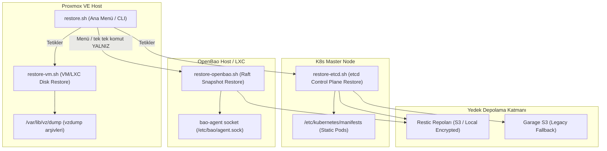
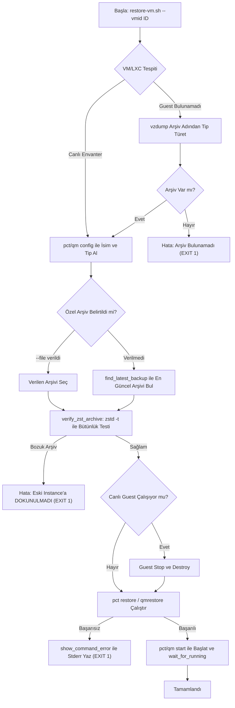
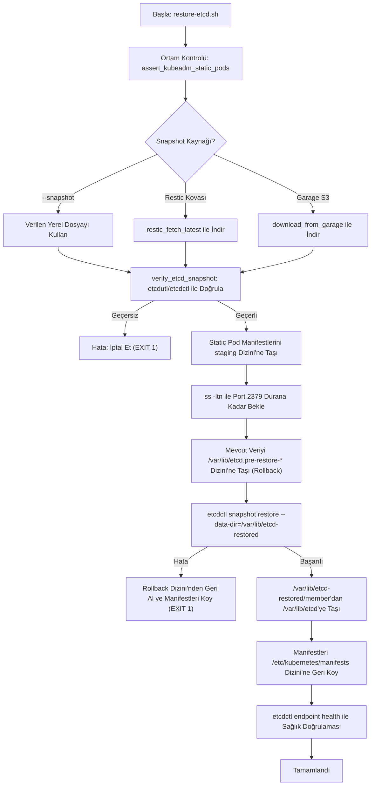
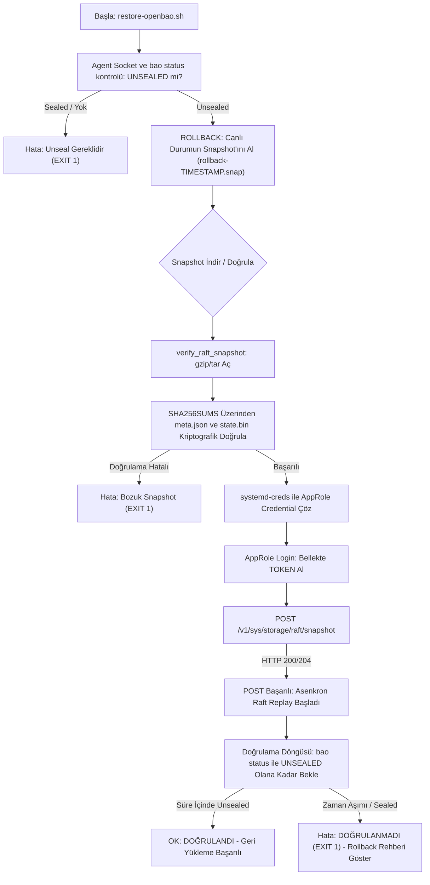

# `restore.sh` — Kurtarma Altyapısı Çalışma Mantığı ve Mimari Dokümantasyonu

Bu doküman, `Cloud-in-Lab` projesinin **Afet Kurtarma (Disaster Recovery)** altyapısını oluşturan `maintenance/restore/` script grubunun mimarisini, güvenlik ilkelerini, çalışma akışlarını ve kullanım detaylarını kapsar.

---

## 1. Genel Bakış ve Mimarî Prensipler

Kurtarma altyapısı, felaket anında sistemi en az veri kaybı ve sıfır belirsizlik ile çalışan duruma getirmek üzere tasarlanmıştır.

### Çalışma Ortamları Dağılımı

Kurtarma script'leri yetki ve konfigürasyon gereksinimlerine göre ilgili düğümlerde çalıştırılır:



> ⚠️ **`restore.sh all` raft'ı İÇERMEZ.** Yukarıdaki ok `R_MAIN → R_BAO`
> yalnızca **menüden tek tek** seçilebilirliği gösterir. `all` komutu sadece
> VMID listesini `restore-vm.sh` ile kurtarır, ardından `restore-etcd.sh`
> çalıştırır. Bu bilinçli bir tasarım kararıdır: raft geri yükleme geri
> dönüşsüz bir veri işlemidir ve disk geri yüklemesi zaten veriyi eski haline
> döndürür. Raft restore **her zaman ayrı komutla** çalıştırılır
> (`restore.sh raft …`).

### Temel Prensipler

1. **Fail-Closed (Güvenli Başarısızlık):** Bir doğrulama veya bağımlılık testi yapılamıyorsa işlem *"başarılı"* veya *"geçerli"* varsayılmaz, derhal durdurulur (`exit 1`).
2. **Yıkıcı İşlem Öncesi Doğrulama:** Eski canlı veriyi silmeden veya durdurmadan **ÖNCE** geri yüklenecek yedek dosyasının bütünlüğü (zstd, tar, sha256sum) ve ortamın uygunluğu doğrulanır.
3. **Otomatik Rollback Noktası:** `etcd` ve `OpenBao Raft` geri yüklemelerinde, işlem başlamadan hemen önce canlı verinin o anki durumu bir rollback noktasına kopyalanır.
4. **Sır (Credential) Güvenliği:** Parola ve token'lar koda gömülmez ve diskte açık metin olarak saklanmaz. `systemd-creds` (AES256-GCM) ile bellekte çözülür.

---

## 2. Script Bazlı Akış ve Çalışma Detayları

### 2.1. `restore.sh` (Merkezi Yönetim ve Yönlendirici)

Tüm kurtarma işlemlerinin tek noktadan interaktif menü veya CLI komutlarıyla yürütülmesini sağlar.

* **Çalıştığı Yer:** Proxmox VE Host (Root yetkisiyle)
* **Kullanım Biçimleri:**
  ```bash
  ./restore.sh                              # İnteraktif menüyü başlatır
  ./restore.sh list                         # Mevcut Proxmox local ve S3 yedeklerini listeler
  ./restore.sh health                       # Yedeklerin tazelik (freshness) durumunu denetler
  ./restore.sh vm <VMID> [--yes]            # Belirtilen VMID (LXC/VM) diskini kurtarır
  ./restore.sh etcd [--yes]                 # etcd snapshot'ını geri yükler
  ./restore.sh raft [--dry-run] [--yes]     # OpenBao Raft snapshot'ını geri yükler
  ./restore.sh all [<VMID_1> <VMID_2> ...]  # VM/LXC disklerini ve etcd'yi sırayla kurtarır
                                       #     (raft dahil DEĞİLDİR — bilinçli, bkz. §1)
  ```

#### Çalışma Mantığı:
1. `list` çağrıldığında `/var/lib/vz/dump` altındaki tüm `vzdump-*.tar.zst` dosyalarını listeler ve Garage S3 üzerindeki en son `etcd` / `openbao` nesnelerini gösterir.
   > **Sıralama notu:** `list` çıktısı **tarihe göre değil, dosya adının
   > lexicographic sırasına** göre üretilir (`find … | sort`). Tarih damgası
   > ayrıştırarak en yeniyi seçen fonksiyon yalnız `restore-vm.sh` /
   > `restore-etcd.sh` içindeki `find_latest_backup` ve `find_garage_latest`
   > fonksiyonlarıdır; bu ikisi `YYYYMMDD-HHMMSS` damgasını ayrıştırır.
2. `vm` alt komutunda verilen VMID'yi veya menüden girilen ID'yi alarak `restore-vm.sh` script'ini çağırır.
3. `all` komutunda varsayılan veya argüman olarak verilen VMID listesini sırayla `restore-vm.sh --yes` ile kurtarır, ardından `restore-etcd.sh --yes` çalıştırır. **raft restore bu komutta çalıştırılmaz.**

---

### 2.2. `restore-vm.sh` (VM ve LXC Disk Görüntüsü Kurtarma)

Proxmox üzerindeki vzdump arşivlerini kullanarak bir LXC konteynerini veya QEMU sanal makinesini kurtarır.

* **Çalıştığı Yer:** Proxmox VE Host
* **Kullanım:**
  ```bash
  ./restore-vm.sh --vmid <ID> [--file <arsiv_yolu>] [--archive <arsiv_yolu>] [--storage <storage_isiml>] [--yes]
  ```

#### Akış Şeması:



> **Akışın zayıf halkası:** Şemada `L` (`Guest Stop ve Destroy`) ve `N`
> (`pct restore` / `qmrestore`) arasındaki geçişte **geri dönüş yoktur**.
> `verify_zst_archive` yalnız `N`'den önce arşiv bütünlüğünü doğrular;
> `N` kendisi başarısız olursa `L` ile silinen canlı disk geri gelmez.
> Ayrıntılı açıklama ve azaltıcı önlemler için aşağıdaki "Önemli Güvenlik
> Adımı" kutusuna bakınız.

#### Önemli Güvenlik Adımı:
Eski canlı guest (`pct destroy` / `qm destroy`) **silinmeden önce** `zstd -t` ile `.tar.zst` arşivi test edilir. Eğer arşiv bozuksa canlı guest'e hiç dokunulmaz ve işlem durdurulur. Araç (`zstd`) yoksa da doğrulama **fail-closed** çalışır.

> ⚠️ **Kalan risk — iki taraflı kayıp (bilinçli karşılanan bir kısıt).**
>
> `verify_zst_archive` yalnız *arşivin bozuk olmadığını* kanıtlar;
> geri yüklemenin **başarılı olacağını** kanıtlamaz. Akış, canlı guest'i
> `pct destroy` / `qm destroy` ile **sildikten sonra** `pct restore` /
> `qmrestore` çalıştırır. Arşiv kusursuz olsa bile geri yükleme başarısız
> olursa (VMID çakışması, storage dolu, host kesintisi, beklenmeyen diski
> hatası) **eski canlı disk ile yedek aynı anda kaybolur.**
>
> Bu, Proxmox'un doğal restore davranışıdır ve script içinde giderilemez —
> `zstd -t` yalnız "arşiv okunabilir" demektir, "disk geri gelir" demek
> değildir. Bu nedenle §2.1'in 2. Temel Prensibi ("Yıkıcı İşlem Öncesi
> Doğrulama") **bu adım için tam bir garanti değildir.**
>
> **Riski azaltmak için operatör:**
> 1. Geri yükleme öncesi hedef storageda yeterli boş alanı doğrulayın.
> 2. Tercihen **farklı bir VMID** kullanın (`--vmid 390`) — bu durumda eski
>    guest `destroy` edilmeden yan yana yeni guest kurulabilir.
> 3. Aynı VMID'i kullanmak zorundaysanız, işlemden hemen önce `vzdump`
>    çıktısının **PVE dışında bir kopyasını** saklayın.
> 4. Son derece kritik veri için önce `--dry-run`/`--archive` ile deneme yapın.

---

### 2.3. `restore-etcd.sh` (Kubernetes Control Plane Kurtarma)

Kubernetes kümesinin durum verisini `etcd` snapshot'ından geri yükler.

* **Çalıştığı Yer:** K8s Master Düğümü
* **Kullanım:**
   ```bash
   ./restore-etcd.sh [--tier daily|weekly|monthly] [--bucket <repo_bucket>] [--snapshot <dosya>] [--snapshot-id <id>] [--creds <garage_creds_dosyasi>] [--yes]
   ```

#### Pure Kubeadm Static Pod Yönetimi:

Proje **pure kubeadm** altyapısı kullandığı için `etcd`, `kube-apiserver`, `kube-controller-manager` ve `kube-scheduler` servisleri birer systemd unit'i değil, `kubelet` tarafından yönetilen **static pod**'lardır.

> ⚠️ **Sert kodlanmış küme kimliği (sessiz varsayım).** `restore-etcd.sh`,
> `etcdctl snapshot restore` çağrısında küme kimliğini argüman olarak geçirir
> ve bu değerler script içinde sabittir:
>
> | Argüman | Sabit değer |
> |---|---|
> | `--name` | `master` |
> | `--initial-cluster` | `master=https://127.0.0.1:2380` |
> | `--initial-cluster-token` | `etcd-cluster` |
>
> Geri yüklenen snapshot'ın **bu kimliğe uyması gerekir.** Farklı bir
> `--node-name`/`--cluster-name` ile kurulmuş bir kümede restore, etcd
> "sağlıklı" görünse bile **kullanılamaz** bir üye kaydı üretir. Bu değerler
> bir kubeadm kurulum sözleşmesidir (`kubeadm config` / cluster-configuration),
> yani script eşleşmezse geri yükleme teknik olarak başarılı, pratikte
> bozuk olur.
>
> Geri yükleme öncesi çalışan kümenin gerçek kimliğiyle karşılaştırın:
> ```bash
> grep -h 'name:\|initial-cluster' /etc/kubernetes/manifests/etcd.yaml
> ```
> Farklıysa `restore-etcd.sh` içindeki bu üç değer eşleştirilmelidir.



---

### 2.4. `restore-openbao.sh` (OpenBao Raft Snapshot Kurtarma)

OpenBao (Vault çatalı) gizli anahtar deposunun Raft veritabanını snapshot anına döndürür.

* **Çalıştığı Yer:** OpenBao LXC Konteynırı (CT 301)
* **Gereken dosyalar (`--snapshot` modunda manuel restore):**
  - `/etc/bao/snap-bao-raft-restore-roleid`
  - `/etc/bao/snap-bao-raft-restore-secretid`
  Bu AppRole kimlik dosyaları agent tarafından `bao-raft-restore` rolü için
  kullanılır ve işlem boyunca bellekte okunup kullanılır.
* **Kullanım:**
   ```bash
   ./restore-openbao.sh [--tier daily|weekly|monthly] [--snapshot <dosya>] [--snapshot-id <id>] [--bucket <repo_bucket>] [--creds <garage_creds_dosyasi>] [--force] [--yes] [--dry-run]
   ```

#### Kriptografik Doğrulama ve Asenkron Replay Takibi:



---

## 3. Sır (Credential) ve Güvenlik Altyapısı

Kurtarma script'leri şifreli yedek depolarına erişirken veya API login işlemlerinde güvenlik standartlarına tam uyum sağlar:

1. **`systemd-creds_decrypt`:**
   - Şifreli credential dosyaları (`/etc/tofu-lar/backup/<job>.secrets.conf`), `systemd-creds decrypt` komutu kullanılarak makineye özel AES256-GCM anahtarı ile bellekte çözülür.
   - Hiçbir şifre diske veya geçici bellek dosyalarına düz metin olarak yazılmaz.
2. **Geçici Token Yönetimi:**
   - OpenBao AppRole girişi yapıldıktan sonra elde edilen `client_token` yalnızca süreç belleğinde tutulur, işlem bitiminde `unset` edilir.

---

## 4. Sorun Giderme ve Felaket Anı Kurtarma (Rollback)

Kurtarma işlemleri sırasında beklenmeyen bir hata yaşanırsa canlı veriyi korumak için aşağıdaki adımlar izlenir:

### A. etcd Rollback
Eğer `restore-etcd.sh` manifestleri geri koyduktan sonra etcd ayağa kalkmazsa:
1. Otomatik oluşturulan rollback dizini tespit edilir: `ls -d /var/lib/etcd.pre-restore-*`
2. Bozulan `/var/lib/etcd` silinir ve pre-restore dizini geri taşınır:
   ```bash
   rm -rf /var/lib/etcd
   mv /var/lib/etcd.pre-restore-<timestamp> /var/lib/etcd
   ```
3. Control plane manifestleri staging'den geri taşınır:
   ```bash
   mv /etc/kubernetes/manifests-disabled/* /etc/kubernetes/manifests/
   ```

### B. OpenBao Raft Rollback
Eğer `restore-openbao.sh` işlemi sonrası OpenBao bozuk kalırsa veya veriler beklenenden eski bir duruma dönerse:
1. Script tarafından otomatik alınan rollback snapshot dosyası bulunur (örn. `/var/lib/bao-raft-snaps/rollback-20260930-142000.snap`).
2. Manuel geri yükleme komutu çalıştırılır:
   ```bash
   BAO_ADDR="unix:///etc/bao/agent.sock" bao operator raft snapshot restore /var/lib/bao-raft-snaps/rollback-<timestamp>.snap
   ```
