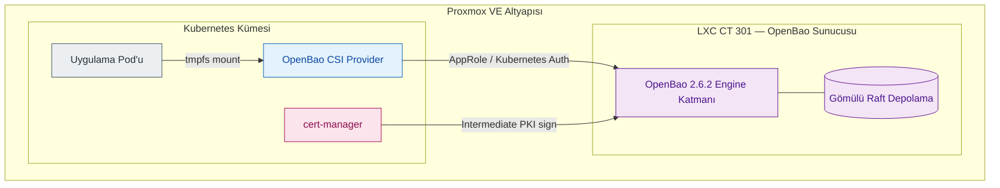
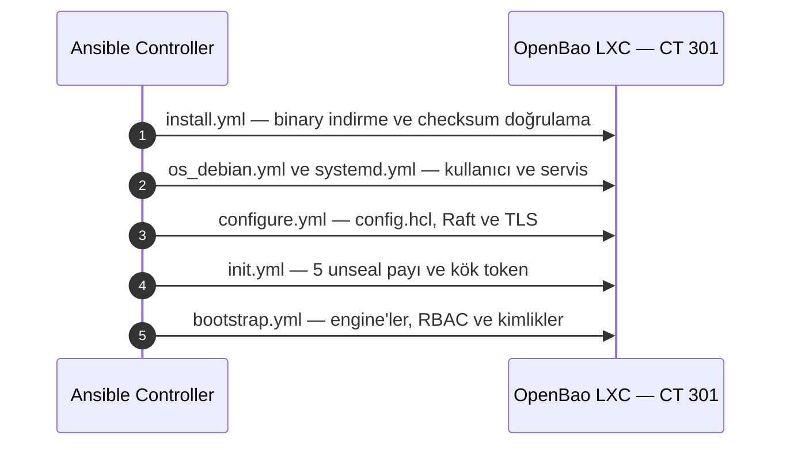
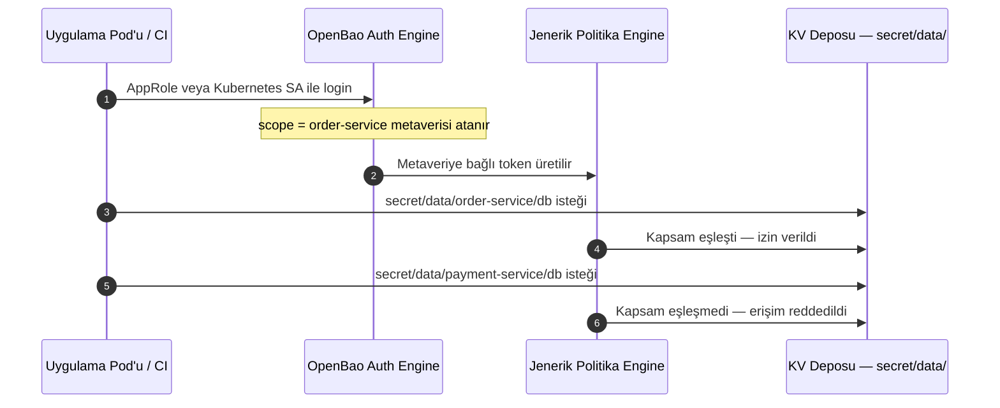
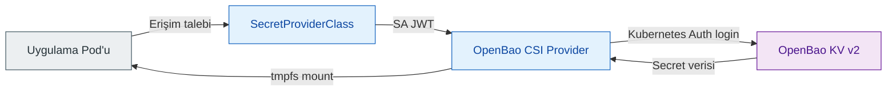
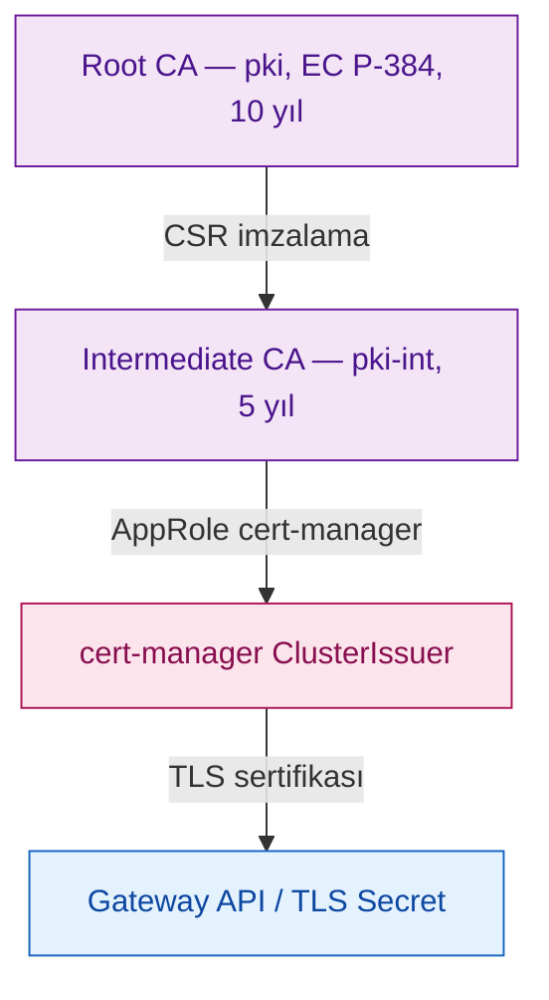
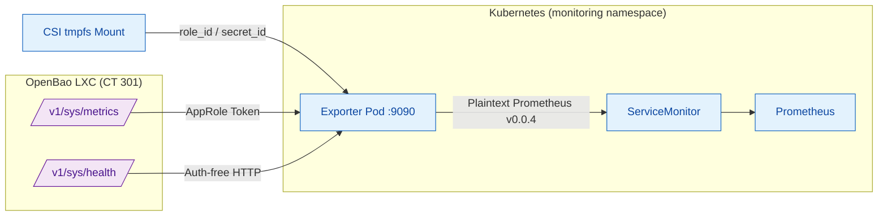

# OpenBao Altyapı ve Güvenlik Katmanı — Derinlemesine Mimari Rehberi

> Bu doküman, `Cloud-in-Lab` projesinde OpenBao bileşeninin konumunu, altyapı kurulum süreçlerini, multi-engine mimarisini, jenerik şablonlu politika modelini, servis entegrasyonlarını ve Day-2 operasyonlarını teknik bir çerçevede sunar.

<details>
<summary><strong>İçindekiler</strong></summary>

  - [1. Özet ve Mimari Amaç](#1-özet-ve-mimari-amaç)
  - [2. OpenBao Motor Ekosistemi](#2-openbao-motor-ekosistemi)
  - [3. Kurulum ve Altyapı Otomasyonu](#3-kurulum-ve-altyapı-otomasyonu)
  - [4. Jenerik Şablonlu Politikalar](#4-jenerik-şablonlu-politikalar)
  - [5. Profil ve RBAC Yönetimi](#5-profil-ve-rbac-yönetimi)
  - [6. Uygulama ve Servis Entegrasyonları](#6-uygulama-ve-servis-entegrasyonları)
  - [7. Uygulama Yaşam Döngüsü](#7-uygulama-yaşam-döngüsü)
  - [8. DevSecOps Tehdit Modeli](#8-devsecops-tehdit-modeli)
  - [9. Operasyon ve Bakım](#9-operasyon-ve-bakım)
  - [10. Telemetry ve Özel Exporter Mimarisi](#10-telemetry-ve-özel-exporter-mimarisi)
  - [11. Sürümler, Sınırlar ve Mimari Derinlik](#11-sürümler-sınırlar-ve-mimari-derinlik)
  - [12. Değişiklik Disiplini](#12-değişiklik-disiplini)
</details>

---

## 1. Özet ve Mimari Amaç

### 1.1 Proje Bağlamı ve Tasarım İlkeleri

`Cloud-in-Lab`, modern bulut-yerel mimari kalıplarını — secret yönetimi, PKI, KMS, Kubernetes, Gateway API ve S3-uyumlu depolama — Proxmox altyapısı üzerinde tekrarlanabilir ve modüler biçimde sunan açık kaynaklı bir platform mühendisliği araç takımıdır. Geliştirme ve test süreçleri için maliyet-etkin bir ortam sunmak üzere tasarlanmıştır ve tek bir Mini PC üzerinde çalışabilecek kadar hafiftir (dev kurulumunda toplam yaklaşık 15 GB RAM).

| İlke | Anlamı | OpenBao entegrasyonu |
|---|---|---|
| %100 deklaratif altyapı | Tüm bileşenler ve ayarlar koddur; manuel müdahale yapılmaz, her an yeniden üretilebilir. | OpenBao binary sürümü, mount'lar, politikalar ve roller Ansible rolleriyle tanımlanır. |
| Secure by Design | Güvenlik sonradan eklenen bir yama değildir; secret'lar repoda tutulmaz ve en az yetki uygulanır. | Secret'lar merkezi olarak OpenBao'dadır; Kubernetes etcd veritabanında düz metin credential bulunmaz. |
| Operasyon odaklılık | Kurulum işin %10'udur; yedekleme, doğrulama ve geri yükleme prosedürleri mimarinin merkezindedir. | Raft snapshot yedeği, unseal prosedürü ve credential çıktı sözleşmesi otomasyonun parçasıdır. |
| Bağımsız stack mimarisi | Her bileşen kendi yaşam döngüsüne ve state dosyasına sahiptir. | OpenBao kendi LXC'sinde, Kubernetes'ten bağımsız yaşar; cluster yıkılsa bile ayakta kalır. |

### 1.2 Neden OpenBao?

Vault projesinin BSL lisans değişikliği sonrasında MPL 2.0 lisansı ile sürdürülen açık kaynaklı devamı olan OpenBao tercih edilmiştir. Kurumsal düzeyde PKI motoru, dinamik secret yönetimi ve PKCS#11 donanım güvenlik modülü desteğini lisans endişesi olmadan, düşük kaynak tüketimiyle sunması tercih sebebidir.

- **Kaynak kullanımı:** Yaklaşık 256 MB RAM ile çalışır; homelab ve test ortamları için uygundur.
- **Bulut servisi karşılıkları:** Yönetilen gizli-dizi servisleri, KMS ve özel sertifika otoritelerinin davranışları yerel ölçekte simüle edilir.
- **Ortam bağımsız kimlik:** AppRole, yalnızca Kubernetes pod'larına değil VM ve fiziksel makinelere de ortak kimlik doğrulama deseni sunar.

| Özellik | Vault (BSL/Enterprise) | OpenBao (MPL) |
|---|---|---|
| PKI engine | Enterprise katmanında sınırlı | Açık kaynak, tam erişim |
| Dynamic secrets | Sınırlı motor | Tüm engine'ler açık |
| HSM entegrasyonu | Enterprise | Açık kaynak (PKCS#11) |
| AppRole auth | Açık | Açık |
| Minimum RAM | Yaklaşık 512 MB | Yaklaşık 256 MB |

### 1.3 Mimari İzolasyon Kararı (ADR)

OpenBao servisi, Proxmox üzerinde ayrı bir Ubuntu LXC konteynerinde (`CT 301`), Kubernetes kümesinin dışında konumlandırılmıştır.

- Kubernetes kümesi ele geçirilse bile kök sertifika otoritesi ve ana secret deposu saldırganın eline geçmez; patlama yarıçapı küçülür.
- Kubernetes sıfırdan yeniden kurulduğunda secret altyapısı ayakta kalır; tersine, OpenBao yeniden kurulsa bile Kubernetes bağımsız yaşam döngüsünü korur.
- Kurtarma senaryolarında (unseal veya kök token ile müdahale) Kubernetes bileşenlerine ihtiyaç duyulmaz.
- Geliştirme ortamında kaynak verimliliği için tek LXC düğümü kullanılır. Bunun karşılığında SPOF riski kabul edilmiş; 4 saatte bir otomatik snapshot ve 7 günlük saklama uygulanmıştır.



### 1.4 Çözülen Temel Problemler

| Sorun | OpenBao ile çözüm | Veri akışı |
|---|---|---|
| Secret dağınıklığı | Credential'lar tek kaynakta tutulur; pod'lar secret'ları tmpfs dosyaları olarak mount eder, etcd'de kopya oluşmaz. | Pod → CSI Provider → OpenBao KV v2 |
| Manuel sertifika yönetimi | İki kademeli kurum içi CA ve cert-manager otomasyonu ile `*.tofu.lan` sertifikaları yenilenir. | cert-manager → Ara CA → İmzalı sertifika → Gateway API |
| Dağınık kimlik ve şifreleme | Merkezi AppRole kimlikleri, kapsam tabanlı politikalar ve Transit KMS kullanılır. | Uygulama → Transit KMS → Encrypt/Decrypt/Datakey |

### 1.5 Bulut Servis Karşılıkları ve Olgunluk Matrisi

Bu tablo, platformun sağladığı servislerin AWS/Azure/GCP mimarilerindeki karşılıklarını, aktiflik durumlarını ve mimari sınırlarını özetler. Derinlik `§11.3`'tedir.

| OpenBao Bileşeni | AWS Karşılığı | Azure Karşılığı | GCP Karşılığı | Projede Durum | Mimari Not ve Kapsam |
|---|---|---|---|---|---|
| **KV Engine (v2)** | Secrets Manager | Key Vault Secrets | Secret Manager | ✅ Aktif | App/NS bazlı izole alanlar. K8s CSI Provider ile veriler `etcd` veritabanına uğramadan pod'lara `tmpfs` (RAM) olarak mount edilir. |
| **PKI Engine (Private CA)** | ACM Private CA | Key Vault Certificates | Private CA | ✅ Aktif | Kök (EC P-384, 10 yıl) + Intermediate (5 yıl; leaf sertifikalar 90 gün); imza yetkisi `pki-int/sign/*` yollarında. |
| **PKI Engine (K8s tüketimi)** | ACM + cert-manager | Key Vault + akv2k8s | CAS + cert-manager | ✅ Aktif | cert-manager 1.21.1 + AppRole Issuer: Gateway TLS (paylaşılan) ve per-app dedicated sertifikalar. Kimlikler: `cert-manager` AppRole — S2 (imza, 1sa/24sa) + P2 `pki-manager` (rol yönetimi, 15dk/1sa, `allow_any_name` yasaklı). PEM; P12 kullanılmadı, ihtiyaç halinde üretilebilir. |
| **AppRole + Identity Engine** | IAM Machine Auth | Entra ID Workload Identity | Workload Identity Federation | ✅ Aktif | Metadata tabanlı dinamik politika şablonlaması ile `O(1)` bakım maliyetli makine kimliği doğrulaması. |
| **Transit Engine** | KMS | Key Vault Keys | Cloud KMS | ✅ Aktif | Faz 2 Zarf Şifreleme (Envelope Encryption) canlıda doğrulandı (`aes256-gcm96` ve uygulama tarafında yerel AES-GCM şifrelemesi, bkz. §6.2). |
| **Telemetry & Custom Exporter** | CloudWatch | Azure Monitor | Cloud Monitoring | ✅ Aktif | Python stdlib custom exporter (3 bağımsız döngü), Prometheus/Alertmanager'e servis edilir. Mühürlenme (sealed) anındaki metrik kesintisi kör noktası `/v1/sys/health` HTTP 503 fallback mekanizması ile çözüldü (bkz. §10). |
| **Audit Devices** | CloudTrail | Monitor Logs | Cloud Audit Logs | 🟡 Kısmen Aktif | Yerel `file` audit device aktif (SHA-256 HMAC). Merkezi aktarım henüz yapılmadı. |
| **Database Secrets Engine** | RDS Credential Rotation | Key Vault Auto-rotate | Cloud SQL Auth Proxy | 🟡 Altyapı Hazır | Engine mount ve politika şablonları hazır; canlı veritabanına dinamik kullanıcı üretimi için bağlantı aşaması bekleniyor. |
| **Namespaces / Scoping** | AWS Organizations | Management Groups | Resource Manager | 🟡 Mimari hazır, test edilmedi | Politika şablonlarında `app-`/`ns-` önek ayrımı şema ve guard seviyesinde hazır; ancak namespace-paylaşımlı senaryo test edilmedi. Proje ölçeğinde `app.name = namespace` pratiği yeterli görüldüğünden izolasyon ihtiyacı doğmadı; güvenlik iddiası yalnızca test edilen app-kapsamı için geçerlidir. |


[↑ Başa dön](#openbao-altyapı-ve-güvenlik-katmanı--derinlemesine-mimari-rehberi)

## 2. OpenBao Motor Ekosistemi

[↑ Başa dön](#openbao-altyapı-ve-güvenlik-katmanı--derinlemesine-mimari-rehberi)

OpenBao, projede yalnızca statik bir şifre kasası değil; gizlilik, anahtar yönetimi, PKI ve kimlik doğrulama süreçlerini üstlenen çok motorlu merkezi güvenlik platformudur.

| Motor | Mount yolu | İşlevi | Entegrasyon |
|---|---|---|---|
| KV v2 | `secret/` | Sürümlü (maksimum 10) statik ve dinamik secret depolama. | CSI Driver → Pod tmpfs |
| Transit KMS | `transit/` | Uygulama düzeyinde veri şifreleme/çözme (envelope encryption). | Uygulama SDK / Direct API |
| PKI Root CA | `pki/` | 10 yıllık EC P-384 kök sertifika otoritesi. | Intermediate CSR imzalama |
| PKI Intermediate | `pki-int/` | 5 yıllık Ara CA; 90 günlük servis/Gateway TLS sertifikalarını imzalar. | cert-manager ClusterIssuer |
| AppRole Auth | `auth/approle` | Makine ve CI/CD süreçleri için rol tabanlı kimlik doğrulama. | Ansible ve deploy workflow |
| Kubernetes Auth | `auth/kubernetes` | ServiceAccount JWT doğrulamasıyla dinamik pod kimliği. Doğrulama, OpenBao'nun Kubernetes TokenReview API'sine yaptığı köprü ile yürür; köprü `openbao-auth-reviewer.conf` (§6.1) taşır. | OpenBao CSI Provider |
| Audit Device | `sys/audit/file` | API isteklerinin SHA-256 HMAC ile dosya tabanlı kaydı. | Audit log dosyası |
| Raft Storage | `sys/storage/raft` | Gömülü durum ve veri depolama motoru. | `bao agent` üzerinden root token'sız snapshot (§9.5) |

## 3. Kurulum ve Altyapı Otomasyonu

### 3.1 Kurulum Özeti

| Parametre | Değer |
|---|---|
| Konum | LXC CT 301 (Ubuntu), Kubernetes dışında |
| Sürüm | OpenBao 2.6.2; checksum doğrulamalı binary |
| Depolama | Gömülü Raft, tek düğüm ve 4 saatte bir snapshot |
| TLS | Self-signed sunucu sertifikası (RSA 4096, IP SAN, 1 yıl) |
| Erişim adresi | `https://164.102.98.186:8200` |
| Servis kullanıcısı | Ayrıcalıkları azaltılmış `bao` kullanıcısı ve systemd servisi |
| Unseal | Shamir 5 pay / 3 eşik; anahtarlar LXC'de tutulmaz, yalnızca controller'dadır |

İş bölümü kesindir: OpenTofu yalnızca LXC konteynerini açar ve Ansible inventory dosyasını üretir; yapılandırmanın tamamını Ansible yapar. OpenTofu içinden Ansible çağrılmaz.

### 3.2 Ansible Kurulum ve Başlatma Akışı



`init.yml` yalnızca ilk kurulumda çalışır. Unseal anahtarları ve kök token, controller makinesindeki `outputs/openbao/` dizinine `0700/0600` izinleriyle yazılır. Sunucu zaten initialize edilmişse ancak credential dosyası yoksa bayat Raft verisi temizlenip yeniden init yapılır.

### 3.3 Bootstrap Sıralaması ve Kök Token Disiplini

1. KV v2, AppRole, Transit, Database, PKI Root, PKI Intermediate ve Kubernetes auth engine'leri açılır.
2. `k8s-app` politikası Kubernetes auth accessor ID'siyle şablonlanır.
3. AppRole politikaları ve rolleri oluşturulur; CSI sürücüsü ve cert-manager kimlikleri üretilir.
4. İlk statik secret'lar KV'ye yazılır.
5. PKI hiyerarşisi kurulur: Root CA üretilir, Intermediate CSR oluşturulur, Root ile imzalanır, sertifika Intermediate'a import edilir ve imza rolü tanımlanır.
6. Platform kimlikleri üretilir: dört platform rolü (`ops-admin`, `pki-manager`, `pki-signer`, `monitor`); credential dosyaları üçüne yazılır (ops-admin, pki-manager, monitor) — pki-signer'ın imza yetkisini S2 `cert-manager` AppRole'ü kullanır.
7. Workload RBAC için sekiz profil, sekiz politika, sekiz rol ve statik `role_id` haritası oluşturulur.
[↑ Başa dön](#openbao-altyapı-ve-güvenlik-katmanı--derinlemesine-mimari-rehberi)

8. `openbao-mount.json` bağlantı dosyası üretilir.

Bootstrap sonunda kök token yalnızca break-glass amacıyla saklanır. Günlük operasyonlar `ops-admin` AppRole kimliğiyle yürütülür; bu profile engine veya auth açma yetkisi verilmez.

## 4. Jenerik Şablonlu Politikalar

Mimarinin kritik yeteneklerinden biri identity templating kullanımıdır. Sisteme 100 yeni uygulama eklense bile yeni bir OpenBao politika dosyası yazılması gerekmez; politika bakım karmaşıklığı yaklaşık `O(1)` seviyesinde sabit kalır.

### 4.1 Dinamik Kapsam Eşleme

Kapsam, uygulamanın OpenBao'daki ad alanıdır ve uygulama adından türetilir: `ob_scope = app.name`. Yetki alanları politika tanımlarına elle yazılmaz; `identity.entity.aliases` şablon değişkenleri kullanılır.

`workload-reader-templated.hcl.j2` örneği:

```hcl
path "auth/token/lookup-self" {
  capabilities = ["read"]
}

path "auth/token/renew-self" {
  capabilities = ["update"]
}

path "secret/data/{{identity.entity.aliases.<accessor>.metadata.scope}}/*" {
  capabilities = ["read"]
}

path "secret/metadata/{{identity.entity.aliases.<accessor>.metadata.scope}}/*" {
  capabilities = ["list", "read"]
}
```

Şablon değeri token sahibinin kimlik metaverisinden çözülür. Örneğin `order-service` token'ı `secret/data/order-service/db` yoluna erişebilirken `payment-service` yoluna erişemez. Transit kullanan profillerde anahtar yolu da aynı mekanizmayla `<scope>-*` desenine kilitlenir.



### 4.2 İki Yönlü Kapsam Bağlama

- **AppRole yolu:** `produce-workload-creds.yml`, yeni `secret-id` üretirken `{"scope": "<app adı>"}` metaverisini yazar. Politika şablonu bu değeri okuyarak yolu kısıtlar.
- **Kubernetes Auth yolu:** CSI üzerinden giriş yapan pod'un ServiceAccount adı kimlik metaverisine yazılır. `k8s-app` politikası bu değeri okuyarak pod'u yalnızca kendi `<sa-adı>-approle` yoluna kilitler.

```hcl
path "secret/data/{{identity.entity.aliases.<accessor>.metadata.service_account_name}}-approle" {
  capabilities = ["read"]
}
```

Kubernetes auth rolündeki `bound_service_account_names` wildcard (`["*"]`) olsa da giriş kapısı geniş, politika şablonu kapsamlıdır. Böylece wildcard bağlama ile şablonlu politika birlikte güvenli izolasyon sağlar.

### 4.3 OpenBao 2.6.2 Güvenlik Düzeltmeleri
[↑ Başa dön](#openbao-altyapı-ve-güvenlik-katmanı--derinlemesine-mimari-rehberi)


- Kimlik şablonlarında wildcard (`*`, `+`), yol ayraçları (`/`), PKI glob ve SSH virgülleri varsayılan olarak reddedilir. Projedeki `scope` değerleri `app.name`'den türetildiği için bu karakterleri içermez; `allow_*_in_identity_templates` bayrakları kapalı tutulur.
- LIST yetki atlama düzeltmesi, wildcard izinlerinin deny kurallarını LIST operasyonlarında atlamasını engeller. Böylece `sys/seal` ve `sys/generate-root-token` gibi kritik yasaklar listeleme yoluyla delinemez.
- OpenBao 2.6 ile `sys/generate-root-token` authenticated endpoint'lere taşındı; unauthenticated varyant deprecated edildi (bkz. `master-design.md` §5).
- Kimlik doğrulama akışlarından token üretimini kötüye kullanmaya yönelik dahili operasyonlar engellenmiştir.

## 5. Profil ve RBAC Yönetimi

Kimlik modeli iki katmana ayrılır — tam katalog ve W/P/S kodları: [`openbao-rbac.md`](openbao-rbac.md) §3.

| Katman | Kapsam | Görev alanı | Kurulum yöntemi | Tetikleyici |
|---|---|---|---|---|
| Workload profilleri (W1–W8) | 8 | Pod ve uygulamaların OpenBao erişimi | `rbac-workload.yml` (`ops-admin`) | Her app deploy'unda self-service |
| Platform ve servis kimlikleri (P1–P6, S1–S2) | 8 | Sistemi işleten ve K8s altyapısını tüketen kimlikler | `rbac-platform.yml` (kök token, bir kez) + `bootstrap.yml` (S) | Altyapı kurulumu |

### 5.1 Workload Profil Kataloğu

`ansible/roles/openbao/security/defaults/main.yml` içindeki `openbao_workload_profiles` listesi tek kaynak görevi görür. Politika şablonu, rol tanımı, token süreleri ve `role_id` haritası bu listeden türetilir.

| Profil | TTL / maksimum | Yenilenir | Token tipi | Yetki özeti |
|---|---|---|---|---|
| `reader` | 1 saat / 24 saat | Evet | service | Kendi kapsamını okur. |
| `operator` | 1 saat / 24 saat | Evet | service | Kendi kapsamında okur, yazar ve Transit kullanır. |
| `job-run` | 30 dakika / 1 saat | Hayır | batch | Kısa ömürlü iş; okuma ve Transit kullanımı. |
| `transit-user` | 30 dakika / 1 saat | Hayır | batch | Yalnızca Transit; KV erişimi kapalı. |
| `deployer` | 15 dakika / 1 saat | Hayır | batch | Yalnızca yazma; okuma ve Transit yok. |
| `kv-owner` | 1 saat / 8 saat | Evet | service | Kendi prefix'inin tam sahibi. |
| `db-consumer` | 1 saat / 24 saat | Evet | service | Dinamik veritabanı kimliği okur; KV erişimi yok. |
| `metrics-reader` | 1 saat / 24 saat | Evet | service | OpenBao sağlık ve metrik uçlarını okur (`sys/health`, `sys/metrics`); KV erişimi yok. |

“Süre de yetkinin parçasıdır” ilkesi uygulanır: Yazma yetkisine sahip 15 dakikalık token, okuma yetkisine sahip 24 saatlik token ile aynı risk seviyesinde değildir.

### 5.2 Politika Blok Taksonomisi

| Blok | Yetki | Kullanan profiller |
|---|---|---|
| B0 | Kendi token'ını sorgulama ve yenileme | Tüm profiller |
| B1 | Kapsam dahilinde KV okuma | `reader`, `metrics-reader`, `operator`, `job-run` |
| B2 | Kapsam dahilinde KV yazma | `operator`, `deployer` |
| B3 | KV yaşam döngüsü: silme, geri alma, yok etme | `kv-owner` |
| B4 | Transit: encrypt, decrypt, rewrap, datakey ve keys-read | `operator`, `job-run`, `transit-user` |
| B5 | PKI Intermediate'dan imza: `pki-int/sign/*` — cert-manager tarafından kullanılır | `pki-signer` |
| B6 | PKI role yönetimi: `pki-int/roles/dedicated-*` CRUD + `denied_parameters: allow_any_name` | `pki-manager` |
| B7 | Dinamik veritabanı kimliği okuma | `db-consumer` |
| B8 | Geniş yönetim: KV/Transit/PKI/Database okuma-yazma; `sys/generate-root-token` ve `sys/seal` açıkça deny | `ops-admin` |
| B9 | Wrapped secret-id üretimi: `secret-id → create,update` + zorunlu wrapping TTL | `approle-issuer` |

### 5.3 Platform Rolleri (P)

| Profil | Token ömrü | Görev |
|---|---|---|
| `pki-signer` | 1 saat / 24 saat | Ara CA'dan imza atar; dar imza yetkisi vardır. |
| `pki-manager` | 15 dakika / 1 saat | Uygulama sertifikası rollerini yönetir; `allow_any_name: true` yasaktır. |
| `monitor` | 1 saat / 24 saat | Salt okunur izleme; KV ve sağlık durumu. |
| `ops-admin` | 4 saat / 8 saat | Günlük işletim: KV, Transit, PKI, Database ve rol yönetimi; `sys/seal` ve `sys/generate-root-token` açıkça deny edilir. |

[↑ Başa dön](#openbao-altyapı-ve-güvenlik-katmanı--derinlemesine-mimari-rehberi)

Credential'lar controller'da 0600 izinli dosyalarda tutulur ve Ansible çıktısına basılmaz (`no_log`).

> Bu tablo ana dört platform rolünü özetler. Ayrıca: P5/P6 raft snapshot kimlikleri (bkz. §9.5) ve S1/S2 servis kimlikleri (`cert-manager`, `k8s-csi`) — tam katalog: [`openbao-rbac.md`](openbao-rbac.md) §3.

### 5.4 Yenileme Disiplini

`renew-self` yalnızca yenilenebilir kimliklerin politikasında bulunur: `reader`, `metrics-reader`, `operator`, `kv-owner` ve platform profilleri. `job-run`, `transit-user`, `deployer` ve `db-consumer` batch token'larıdır; süresi dolunca yenilenemez.

## 6. Uygulama ve Servis Entegrasyonları

### 6.1 CSI Driver ve etcd İzolasyonu



CSI kuralları:

- `secretObjects` senkronizasyonu yoktur; Kubernetes Secret objesi üretilmez ve veriler etcd'ye yazılmaz.
- Adres ve TLS ayarları `SecretProviderClass` içinde sabitlenmez; adres Helm chart konfigürasyonundan, CA güveni `openbao-ca-tls` Secret'ından gelir.
- Provider adı `openbao` olarak sabittir; rol adı SPC'de açıkça yazılır.
- Secret rotasyonu açıktır, senkronizasyon kapalıdır.
- Helm chart `server.enabled=false`, `injector.enabled=false`, `csi.enabled=true` değerleriyle kurulur. Cluster içine ikinci bir OpenBao sunucusu kurulmaz.

#### TokenReview köprüsü (`openbao-auth-reviewer.conf`)

Yukarıdaki "Kubernetes Auth login" adımı, OpenBao'nun gönderilen SA JWT'sinin geçerli olup **kendi başına doğrulayamadığı** için apiserver'a `TokenReview` çağrısı yapmasını gerektirir. Bu çağrıda OpenBao, kimlik doğrulama yetkisini bir **reviewer ServiceAccount** üzerinden kullanır:

- **Ne iş yapar:** `kube-system/openbao-auth-reviewer` SA'sı (`system:auth-delegator`, `tokenreviews` **cluster-scope** olduğu için `cluster_wide=true` **zorunlu**) OpenBao'ya yalnız bu çağrıyı yapma yetkisi verir; SA'nın cluster üzerinde başka bir yetkisi yoktur. Reviewer kubeconfig, `openbao-ops` rolü tarafından her koşuda idempotent üretilir ve içinden okunan JWT, `auth/kubernetes/config`'e **`token_reviewer_jwt`** olarak yazılır (`no_log`).
- **Neden var:** Bu köprü olmadan `k8s-csi-provider` rolüne SA-JWT login'i **yapılamaz**; sonuçta CSI üzerinden tüm workload credential akışı (SPC mount, AppRole `role_id`/`secret_id` okuma, transit-envelope iş akışı) durur. İlgili fail task'ı conf yoksa playbook'u açık mesajla durdurur (sessiz geçilmez); `tokenreviews` RBAC'i eksikse doğrulama 403 verir ve auth **sessiz düşebilir** — bu nedenle conf ve ClusterRoleBinding birlikte okunur.
- **Dosya:** `ansible/outputs/k8s/openbao-auth-reviewer.conf` — SA JWT içerdiği için **secret**'tır ve `ansible/outputs/` gitignore'ludur. Elle yeniden üretmek için: `ansible-playbook playbooks/gen-kubeconfig.yml -e cluster_role=system:auth-delegator -e namespace=kube-system -e sa_name=openbao-auth-reviewer -e cluster_wide=true`. Gen-kubeconfig motorunun built-in rol + openbao-ops otomatik include mekanizması: [`docs/tr/kubernetes/rbac.md`](../kubernetes/rbac.md) §8.2.1.

### 6.2 Transit Engine ve Envelope Encryption

Transit motoru, uygulamaların veriyi yerelde şifrelemesi için merkezi KMS servisi sunar.

- Anahtar adı `<scope>-<openbao_key>` biçimindedir; örnek: `transit-envelope-demo-app-key`.
- Algoritma `aes256-gcm96` olarak yapılandırılır.
- Anahtarlar dışa aktarılamaz (`exportable: false`).
- Uygulama Transit'ten datakey ister, veriyi yerelde şifreler ve şifreli veriyi Transit ile çözdürerek sonucu doğrular. Anahtar uygulamaya teslim edilmez.

#### Canlı doğrulama (2026-09-16, Job: `transit-envelope-b`)

A-fazı “KMS’ye erişiyorum”u, B-fazı “veriyi KMS’ye göstermeden şifreliyorum”u kanıtlar:

- **A (server-side tur):** login → `encrypt` → `decrypt`, tur eşleşti.
- **B (envelope):** `datakey/plaintext bits:256` ile taze DEK alındı → yük yerelde AES-256-GCM ile şifrelendi → açık DEK bırakıldı → kilitli DEK Transit’e çözdürülüp yük yerelde doğrulandı.

```text
Collecting cryptography==50.0.1
  Downloading cryptography-50.0.1-cp311-abi3-manylinux_2_34_x86_64.whl.metadata (4.3 kB)
Collecting cffi>=2.0.0 (from cryptography==50.0.1)
  Downloading cffi-2.1.1-cp313-cp313-manylinux2014_x86_64.manylinux_2_17_x86_64.whl.metadata (2.5 kB)
Collecting pycparser (from cffi>=2.0.0->cryptography==50.0.1)
  Downloading pycparser-3.0-py3-none-any.whl.metadata (8.2 kB)
Downloading cryptography-50.0.1-cp311-abi3-manylinux_2_34_x86_64.whl (4.7 MB)
   ━━━━━━━━━━━━━━━━━━━━━━━━━━━━━━━━━━━━━━━━ 4.7/4.7 MB 26.6 MB/s  0:00:00
Downloading cffi-2.1.1-cp313-cp313-manylinux2014_x86_64.manylinux_2_17_x86_64.whl (221 kB)
Downloading pycparser-3.0-py3-none-any.whl (48 kB)
Installing collected packages: pycparser, cffi, cryptography

Successfully installed cffi-2.1.1 cryptography-50.0.1 pycparser-3.0
WARNING: Running pip as the 'root' user can result in broken permissions and conflicting behaviour with the system package manager, possibly rendering your system unusable. It is recommended to use a virtual environment instead: https://pip.pypa.io/warnings/venv. Use the --root-user-action option if you know what you are doing and want to suppress this warning.
TLS: verify kapali (demo + self-signed; prod icin CA_BUNDLE_PATH set edin)
A: login OK
A: encrypt OK
A: decrypt OK round-trip eslesti
B: encrypt OK wrapped=vault:v1:48gBs+pTq6yLjIoI8qjaGX667gPGFgIxnod3A8ie5BuW+DtEuAcGVW6pYITdU1A3G9ynZwuTfWMTcriX
B: nonce=487ef9cdaa8acc3b4b07d1c6 ct_sha256=e8df5ce3bbeda290d39070cab1154c170c831de610ba20a608cdfd461edfcd28
B: decrypt OK round-trip eslesti
ENVELOPE PASS
```

Pin: `cryptography==50.0.1`, imaj `python:3.13-slim@sha256:ed86…`.

**Transit Envelope motor ve işlem testleri (2026-09-16, canlı; tam prosedür `docs/tr/openbao/openbao-tests.md` Bölüm 1'dedir — aynı belgede Bölüm 2 raft snapshot agent testlerini de içerir):**

| Test | Sonuç |
|---|---|
| Negatif 403 (tokensiz decrypt) | ✅ `permission denied`, HTTP 403 |
| Audit’te plaintext yok | ✅ `transit-demo-B-envelope` sayısı 0; secret alanları HMAC’lı (bonus: `scope` + batch TTL katalogla birebir) |
| Rotate | ✅ HTTP 200, `latest_version: 2`, eski wrapped çözüldü (44) |
| İkinci koşu idempotency | ⏳ bekleniyor |

### 6.3 PKI Hiyerarşisi ve cert-manager



- Root CA (`pki/`) EC P-384 ile 10 yıllık oluşturulur; `pki-int/` mount'u CSR ile imzalanır.
- Kök anahtar doğrudan imza isteklerine açılmaz.
- cert-manager, AppRole kimliğiyle `pki-int/sign/tofu-lan` yolundan sertifika ister.
- Intermediate CA 90 günlük sertifikayı imzalar ve cert-manager bunu `gateway-tls` Secret'ına yazar.
- `openbao-ca-tls` Secret'ı OpenBao sunucusunun TLS kimliğini doğrular; PKI Root CA ise üretilen sertifika zincirinin köküdür. Bu iki CA aynı amaçla kullanılmaz.

### 6.4 Ağ İzni: Self-Service Egress Etiketi

```yaml
templateLabels:
  homelab.io/allow-openbao-egress: "true"
```

Cluster genelindeki Cilium politikası bu etiketi seçerek yalnızca OpenBao sunucusunun IP adresine (`<openbao_host>/32`, TCP 8200) çıkışa izin verir.

### 6.5 Root CA Güvenilirliği

```bash
curl -sk https://164.102.98.186:8200/v1/pki/ca/pem -o tofu-lan-ca.crt
sudo cp tofu-lan-ca.crt /usr/local/share/ca-certificates/
sudo update-ca-certificates
```

Doğrulama:

```bash
curl -s https://164.102.98.186:8200/v1/sys/health
```

[↑ Başa dön](#openbao-altyapı-ve-güvenlik-katmanı--derinlemesine-mimari-rehberi)

> Not: Tarayıcılar DoH kullandığından `/etc/hosts` dosyasını bypass edebilir; testlerin `curl` ile yapılması önerilir.

`/etc/hosts` dosyasına şu satır eklenerek `bao.lan` çözümlemesi sağlanır:

```bash
echo '164.102.98.186 bao.lan' | sudo tee -a /etc/hosts
```

Root CA sertifikası istenirse yerel controller cihaza da kopyalanarak tarayıcı ve kubectl gibi araçların OpenBao sunucusuna güvenmesi sağlanabilir; bu zorunlu değildir ancak HTTPS testlerini kolaylaştırır.

## 7. Uygulama Yaşam Döngüsü

### 7.1 Bootstrap ve App Deploy Ayrımı

| Parametre | Bootstrap (bir kez) | App deploy (her uygulamada) |
|---|---|---|
| Kullanılan kimlik | Kök token → `ops-admin` | `ops-admin` token |
| İşlem | Engine, politika ve rol oluşturma | Credential üretme, KV yazma, Transit anahtarı açma, SPC kurma |
| Çıktı | `profile-role-ids.json`, platform credential'ları, bağlantı dosyası | `<scope>-approle.json`, KV girdisi, SecretProviderClass |
| Tekrar çalıştırma | Idempotent; mevcut kaynaklar atlanır | Her uygulama için yeni kapsam |

### 7.2 Deploy Adımları

`openbao-workflow.yml` şu akışı izler:

1. `ob_scope = app.name` olarak hesaplanır.
2. KV'de `<scope>-approle` varsa deploy durdurulur; üzerine yazma engellenir.
3. `profile-role-ids.json` içinden `role_id` okunur ve kapsam metaverili yeni `secret-id` üretilir.
4. Credential controller dosyasına ve OpenBao KV'ye (`secret/<scope>-approle`) yazılır.
5. Gerekliyse `<scope>-<openbao_key>` adında Transit anahtarı oluşturulur.
[↑ Başa dön](#openbao-altyapı-ve-güvenlik-katmanı--derinlemesine-mimari-rehberi)

6. Credential okunarak SecretProviderClass üretilir.

> Not: `scope_level: namespace` desteklenmektedir. Genelde `app.name = namespace` şeklinde kullanıldığından bu özellik yeterli görülmüştür; istenilirse uygulanabilir. Detaylar için [`docs/tr/openbao/openbao-rbac.md`](openbao-rbac.md) §4'e bakınız.

### 7.3 Kaldırma Disiplini

- Silmeden önce kaynak `get` ile doğrulanır; `--ignore-not-found` kullanılmaz.
- Paylaşımlı kaynaklar — profil rolleri, politikalar, engine mount'ları, Transit mount'u ve Gateway sertifikası — silinmez.
- Rol silindiğinde o role ait `secret-id`'ler temizlenir; mevcut token'lar TTL dolunca sona erer.
- Aynı kimliği paylaşan başka bir uygulama varsa silme işlemi korunur.
- `app-remove` playbook'u `delete-openbao-approle.yml` task'ını çalıştırarak yetim AppRole'leri temizler; silme işlemi korumalıdır (aynı kimliği paylaşan başka uygulama varsa silinmez).

## 8. DevSecOps Tehdit Modeli

[↑ Başa dön](#openbao-altyapı-ve-güvenlik-katmanı--derinlemesine-mimari-rehberi)

| Katman | Tehdit | Kontrol | Bir katman geçilirse |
|---|---|---|---|
| Fiziksel / yerleşim | Kubernetes kümesinin ele geçirilmesi | OpenBao ayrı LXC'de | Secret deposu ve kök CA korunur. |
| Kimlik ömrü | Token çalınması | Kısa TTL ve yenilenemez batch token'ları | Token dakikalar içinde geçersizleşir. |
| Yetki kapsamı | Komşu uygulamanın verisini okuma | Şablonlu politika ve kapsam metaverisi | Token yalnızca kendi prefix'inde geçerlidir. |
| Şablon enjeksiyonu | Wildcard enjekte ederek yetki genişletme | Güvenli varsayılanlar ve güvenli karakter kümesi | İstek reddedilir. |
| Aşırı yetki | Günlük kimlikle engine açma | `ops-admin` için create yok; mount açma kökte | Yeni güven kökü oluşturulamaz. |
| Kök token | Kök token sızması | Break-glass saklama ve günlük kullanım dışı bırakma | Tek başına kök üretimi tetiklenemez. |
| Mühür anahtarı | Yeniden başlatma veya anahtar sızması | Shamir 3/5; anahtarlar LXC'de yok | Tek anahtar yeterli olmaz. |
| Ağ | Pod'dan veri sızması | Cilium default-deny ve etiket kapılı egress | Yalnızca TCP 8200'e dar koridor vardır. |
| Veri duruşu | etcd veya Git sızıntısı | Secret etcd'de ve repoda tutulmaz | Sızacak kopya bulunmaz. |
| Kriptografi | Anahtar hırsızlığı | Transit anahtarları export edilemez | Anahtar sunucudan çıkarılamaz. |
| Sertifika | Intermediate CA ele geçirilmesi | Kök anahtarın çevrimdışı mantığı | Kök zarar görmeden kurtarma yapılır. |
| Gözlem | Yetkisiz izleme | Salt okunur `monitor` ve audit log | Yazma yolu kapalıdır. |

## 9. Operasyon ve Bakım

### 9.1 Çıktı Sözleşmesi

| Dosya | İçerik | İzin | Üreten adım |
|---|---|---:|---|
| `openbao-credentials.yml` | Kök token ve unseal anahtarları | `0600` | init |
| `openbao-unseal-keys.txt` | Unseal özeti | `0600` | init |
| `openbao-config.json` | Sunucu adresi ve sürüm | `0600` | init |
| `openbao-mount.json` | Mount isimleri ve adres köprüsü | `0600` | bootstrap |
| `profile-role-ids.json` | Sekiz workload profilinin statik `role_id` haritası | `0644` | workload RBAC |
| `ops-admin.json`, `pki-manager.json`, `monitor.json` | Platform credential'ları | `0600` | platform RBAC |
| `<scope>-approle.json` | Uygulama credential'ı (`role_id` + `secret_id`) | `0600` | app deploy |

### 9.2 Dosya Haritası

```text
ansible/roles/openbao/
├── server/
│   ├── tasks/ (main, install, os_debian, systemd, configure, init, bootstrap, backup)
│   └── defaults/main.yml            # Sürüm, Raft yolu, TLS, unseal ve yedek cron'u
├── security/
│   ├── defaults/main.yml            # Tek kaynak: mount'lar, platform RBAC, workload profilleri
│   ├── tasks/rbac-platform.yml      # Platform politika, rol ve credential'ları
│   ├── tasks/rbac-workload.yml      # Workload politika, rol ve role_id haritası
│   └── templates/                   # k8s-app ve workload politika şablonları
ansible/roles/k8s/openbao-ops/tasks/main.yml
                                      # openbao-auth-reviewer.conf (TokenReview köprüsü, §6.1),
                                      # K8s auth config/role, CSI ve cert-manager secret'ları
ansible/roles/k8s/csi/tasks/main.yml
                                      # CSI driver, provider chart, CA pin ve agent override
ansible/roles/k8s/security/templates/cilium-allow-openbao-egress.yaml.j2
                                      # Self-service egress CCNP
ansible/roles/k8s-apps/app-deploy/tasks/
├── openbao-workflow.yml              # Kapsam, çakışma kontrolü ve orkestrasyon
├── produce-workload-creds.yml        # secret-id üretme ve KV yazma
├── produce-transit-key.yml           # Check-then-create Transit anahtarı
└── read-workload-creds.yml           # Credential okuma ve SPC üretme
ansible/roles/k8s-apps/app-remove/tasks/delete-openbao-approle.yml
                                      # Guard'lı temizlik
```

### 9.3 Kurulum, Doğrulama ve Yıkım

```bash
# Kurulum
cd tofu && ./deploy.sh dev openbao
cd ../ansible && ansible-playbook -i inventory/openbao.ini.generated playbooks/openbao.yml

# Doğrulama: sağlık ve mühür durumu
curl -sk https://164.102.98.186:8200/v1/sys/health | jq .initialized,.sealed

# Yıkım: koruma bayrağı bilerek kapalı istenir
cd tofu/stacks/openbao
tofu destroy -var-file=../../environments/dev/common.tfvars \
  -var-file=../../environments/dev/openbao.tfvars \
  -var="protection=false"
```

### 9.4 Unseal Disiplini

OpenBao, Shamir 3/5 pay-eşiğiyle mühürlenir: `-key-shares=5 -key-threshold=3`. Unseal anahtarları LXC içinde tutulmaz; yalnızca controller üzerindeki `outputs/openbao/openbao-credentials.yml` ve `scripts/openbao-unseal/credentials.txt` dosyalarında `0600` izinleriyle saklanır.

- `init.yml`, kurulumda unseal anahtarını CLI argümanıyla kullanır.
- `ensure_ready.yml`, mühürlü durumda `/v1/sys/unseal` uç noktasına JSON body ile PUT gönderir; anahtar argv dışında kalır.
- `scripts/openbao-unseal/unseal.sh`, aynı API'ye JSON body ile POST yapar.
- `bao operator unseal` argümansız çağrıldığında anahtar stdin'den gizli okunur.
- `no_log: true` sayesinde anahtarların Ansible loglarına düşmesi engellenir.

Auto-unseal ile ilgili detaylı kurulum kılavuzu ve SoftHSM2 yapılandırması `extra-samples/openbao-auto-unseal/autounseal-setup-guide.md` dosyasında bulunabilir.

Yazılımsal auto-unseal (Vault/OpenBao'nun kendi mekanizması) planlanmış ancak uygulanmamıştır; çünkü bu yaklaşım yalnızca anahtarın saklanma yerini değiştirir, gerçek bir güvenlik kazancı sağlamaz. Bu nedenle Shamir 3/5 pay-eşiği ile manuel unseal tercih edilmiştir.

### 9.5 Yedekleme ve Geri Yükleme

| Katman | İçerik | Sıklık | Saklama | Araç |
|---|---|---|---|---|
| VM disk backup | LXC disk imajı | Haftalık (PVE host cron) | PVE local; flat 28 gün + weekly 3 / monthly 3 | `maintenance/backup/vm-disk/backup-full.sh --vmid <openbao-vmid>` |
| Raft snapshot (yerel) | OpenBao içi veri | 4 saatte bir · weekly **Pazar** 04:00 · monthly ayın 1'i 04:30 | 7 gün | `backup-openbao.sh` (systemd timer) |
| Raft snapshot (uzak) | Snapshot → Garage2 (S3) | Aynı üç timer | Kova başına `keep-last 3` | `restic` → `openbao-{daily,weekly,monthly}` |

> **CT ID'ler kuruluma özgüdür.** OpenBao LXC'nin kimliği ortam dosyasında
> verilmezse Proxmox otomatik atar; belgede geçen `CT 301` değeri örnektir.
> Ayrıntı için bkz. `docs/tr/maintenance/maintenance.md` §2.

**Raft snapshot root token kullanmaz.** Snapshot'ı `bao agent` alır: servis
(`bao-raft-agent`, `User=bao`) AppRole `auto_auth` ile giriş yapar, token'ı
`/etc/bao/agent.sock` unix listener'ı üzerinden sunar ve script bu sokete
`BAO_ADDR=unix://…` ile bağlanır. Kimlik ve yetki ayrıntısı `openbao-rbac.md` §3
(B10/B11, P5/P6).

İki yönlü kural:

- **Agent profili salt okumadır** (B10 → `sys/storage/raft/snapshot: read`). 7/24
  açık servisin raft deposunu geri yazma yetkisi yoktur.
- **Geri yükleme ayrı profille yapılır** (B11 → `snapshot-force: update`), yalnız
  `restore-openbao.sh` tarafından, manuel tetiklemeyle.

`backup-openbao.sh` önce snapshot'ı raft deposundan ayrı, kalıcı bir dizine
(`/var/lib/bao-raft-snaps`) yazar ve 7 günlük yerel kopya tutar, ardından restic
ile Garage2'ye üç ayrı kovaya gönderir. Restic hatası yerel kopyayı **silmez**.

Geri yükleme:

```bash
maintenance/restore/restore.sh list          # Mevcut yedekleri listele
maintenance/restore/restore.sh raft          # Raft snapshot geri yükle (B11)
maintenance/restore/restore.sh vm 301        # OpenBao LXC'yi kurtar
maintenance/restore/restore.sh vm 301 --yes  # Onaysız kurtarma
[↑ Başa dön](#openbao-altyapı-ve-güvenlik-katmanı--derinlemesine-mimari-rehberi)

maintenance/restore/restore.sh all           # Tümünü kurtar — son çare
```

`raft` ile geri yükleme **CT sağlam, raft bozuk** senaryosu içindir; önce mevcut
raft durumunu rollback snapshot'a alır, sonra `--tier daily|weekly|monthly` ile
seçilen kovadan snapshot indirir ve doğruladıktan sonra yükler. `--tier` verilmezse
en yeni snapshot seçilir.

`all` akışı raft'ı **ayrıca çağırmaz**: `restore-vm.sh --vmid 301` OpenBao
LXC'sinin tamamını diskten geri kurduğu için `/var/lib/bao/raft` zaten eski
haline döner. Akış `300 → 301 → etcd`'dir; raft için ek adım çağırmak
anlamsız ve çelişkili olurdu.

Unseal anahtarları yedek verisiyle aynı kanalda tutulmaz: anahtarlar
controller'da, yedek Garage2'de saklanır.

## 10. Telemetry ve Özel Exporter Mimarisi

OpenBao sunucusunun sağlık durumu, performans metrikleri ve güvenlik olayları platform genelinde Prometheus ve Alertmanager ile izlenir. Mimaride projeye özel bir exporter geliştirilmesi tercih edilmiştir.

### 10.1 Telemetry Yapılandırması ve Desen Seçimi

İzleme verisi OpenBao tarafında `openbao.telemetry` stanza'sı ile üretilir. Yapılandırma `group_vars/all/all.yml` üzerinden deklaratif yönetilir ve `bao-config.hcl.j2` şablonunda koşullu render edilir; bayrak kapalıyken stanza HCL'ye hiç yazılmaz (kapalıyken sıfır kaynak tüketimi).

```yaml
openbao:
  telemetry:
    enabled: true
    prometheus_retention_time: "30s"
    disable_hostname: true
```

OpenBao resmî bir Kubernetes "operator" bileşenine sahip olmadığından izleme deseni seçimi için üç yol değerlendirilmiştir:

1. **Statik/dönen token + ServiceMonitor (reddedildi):** Resmî Helm chart'ının desteklediği bu yapı, OpenBao'nun Kubernetes *içinde* çalıştığı senaryo için tasarlanmıştır. LXC'deki kurulumda bunu taklit etmek, runtime bir görev olan token yenilemeyi deploy-time bir araç olan Ansible'a yüklemek pratik değildir.
2. **Vault Agent + consul-template sidecar (reddedildi):** Agent Injector webhook altyapısı gerektiren ağır bir desendir; proje ölçeği için aşırı karmaşıktır.
3. **Self-service token yönetimli özel exporter (kabul edildi):** Token yenileme sorumluluğunu dış araçlara değil, exporter'ın kendisine yükleyen desendir. Exporter betiği `openbao-metrics-exporter.py` içinde birbirinden bağımsız üç iş döngüsüne (TokenState / HealthState / MetricsCache) ayrılmıştır; bkz. §10.2.

Bu tercih, "çalışma-zamanı görevi çalışma-zamanında kalır" sınırını korur ve mevcut self-service credential akışını (CSI/tmpfs, `renewable` workload profili) yeni bir mekanizma eklemeden tekrar kullanır.

### 10.2 Exporter Mimarisi ve Dayanıklılık Mantığı

Exporter, yazılım tedarik zinciri riskini sıfırlamak adına yalnızca Python standart kütüphanesi (`stdlib-only`) ile yazılmış bağımsız bir Deployment'tır; dış bağımlılığı ve imaj indirme gereksinimi yoktur.



Exporter betiği birbirinden bağımsız çalışan üç iş döngüsüne ayrılmıştır:

* **TokenState döngüsü:** AppRole kimliğiyle giriş yapar. Token ömrünün %70'ine ulaşıldığında `auth/token/renew-self` çağrısıyla token otomatik tazelenir; yenileme başarısız olursa yeniden login yapılır. OpenBao sealed olsa bile bu döngü durmaz, sadece bekleyip tekrar dener.
* **HealthState döngüsü:** Auth gerektirmeyen `/v1/sys/health` uç noktasını ayrı bir döngüde dinler. Sunucu mühürlü olsa dahi `openbao_sealed`, `openbao_up`, `openbao_initialized` ve `openbao_standby` metriklerini kesintisiz üretir.
* **MetricsCache döngüsü:** `sys/metrics` içeriğini best-effort mantığıyla önbelleğe alır; veri alınamasa bile exporter HTTP 200 döner ve sağlık/öz metriklerini sunmaya devam eder.

Mühür durumunun health uç noktasından türetilmesinin gerekçesi canlı ortamda gözlenen bir kusurdur:

OpenBao varsayılanı olan `vault_core_unsealed` metriği, sunucu mühürlendiğinde `prometheus_retention_time` dolunca tampondan düşer ve mühür uyarısının hiç tetiklenmemesine yol açar. Yani mühürlendiği anda bile alarm üretilmez — system çöker ama Monitoring bunu bilemez. `sys/metrics` uç noktası da mühürlü durumda veri sunmaz; OpenBao mühürlendiğinde tüm Prometheus metrikleri kesilir.

Oysa `/v1/sys/health`, auth gerektirmeden ve mühürlüyken bile HTTP 503 ile yanıt verir. Bu uç, OpenBao'nun en dayanıklı uç noktalarından biridir: Process dursa bile (500), mühürlü olsa bile (503), her zaman yanıt verir. Bu yüzden mühür sinyali bu uçtan üretilir — exporter her 10 saniyede bir health ucunu sorgular, 503 geldiğinde `openbao_sealed=1` metriğini üretir ve Prometheus>alert tetikler. Alternatif olarak statik bir token ile `sys/health` okunabilirdi ama bu sefer token yenileme sorunu ortaya çıkardı (runtime bir görev). Health ucunun tercih edilmesinin nedeni, auth gerektirmemesi ve her durumda yanıt vermesidir.

### 10.3 App-Deploy Orkestrasyonu ve Entegrasyon

Exporter, özel bir durum olarak değil; projenin standart `k8s_apps.yml` deklaratif motoru üzerinden dağıtılır:

```yaml
- name: openbao-metrics-exporter
  enable: true
  namespace: monitoring
  image: python:3.11-slim-bookworm
  container_port: 9090
  port: 9090
  expose: false
  openbao:
    enable: true
    profile: metrics-reader
  labels:
    homelab.io/allow-openbao-egress: "true"
  monitoring:
    serviceMonitor:
      enabled: true
      port: 9090
      path: /metrics
      interval: 30s
      scrapeTimeout: 10s
```

Bu tek girdi sayesinde orkestrasyon motoru; Deployment, Service, ServiceMonitor, Cilium egress izni ve SecretProviderClass nesnelerini otomatik türetir. `expose: false` ile gateway yönlendirmesi dışarıda bırakılır; metrikler yalnızca `:9090/metrics` üzerinden cluster içinde sunulur.

`metrics-reader` profili en az yetki (least-privilege) ilkesine dayanır ve politikasında yalnızca aşağıdaki izinler yer alır:

```hcl
path "auth/token/lookup-self" {
  capabilities = ["read"]
}
path "auth/token/renew-self" {
  capabilities = ["update"]
}
path "sys/health" {
  capabilities = ["read"]
}
path "sys/metrics" {
  capabilities = ["read", "list"]
}
```

### 10.4 Doğrulama ve Canlı Ortam Testleri

Yapı canlı ortamda sınanmış ve aşağıdaki adımlarla doğrulanmıştır:

```bash
# Pod durumu ve hedef keşfi
kubectl get pods -n monitoring -l app=openbao-metrics-exporter

# Metrik çıktısı (auth'suz :9090 metrik portu)
kubectl exec -n monitoring openbao-metrics-exporter-pod-0 -- curl -s localhost:9090/metrics | grep openbao

# Mühür durumu sinyalinin canlılığı
kubectl exec -n monitoring openbao-metrics-exporter-pod-0 -- curl -s localhost:9090/metrics | grep openbao_sealed
```

Sonuç: pod ayakta ve AppRole girişi + öz-yenileme çalışıyor; ServiceMonitor eşleşmiş ve Prometheus hedefi UP durumunda (scrape ~25 ms); mühürlü senaryoda health-üretimli `openbao_sealed` sinyalinin korunduğu sınanmıştır. Kasten seal edilip ilgili alert'in tetiklendiği de görülmüştür. Ayrıca Prometheus ve Grafana arayüzlerinden de metrikler, hedef durumları ve alert ifadeleri gözlemlenerek kontrol edilmiştir.

### 10.5 Alert Kataloğu

Exporter metrikleri üzerinden çalışan PrometheusRule kuralları iki gruba ayrılır: 4 critical, 11 warning (toplam 15 kural).

**Critical:**

| Kural | Koşul / ifade | Açıklama |
| --- | --- | --- |
| OpenBaoDown | `openbao_up == 0` | OpenBao sağlık uç noktası erişilemez (process durdu / ağ kesildi). |
| OpenBaoSealed | `openbao_sealed == 1` | Sunucu mühürlendi; PKI/secret/transit işlemleri durmuş olabilir, acil unseal gerekir. |
| OpenBaoRootTokenCreated | `increase(vault_token_create_root_count[5m]) > 0` | Kök token üretimi tespit edildi; güvenlik ihlali şüphesi. |
| OpenBaoAutopilotUnhealthy | `vault_autopilot_healthy == 0` | Raft cluster en az bir node'u sağlıksız işaretliyor; veri kaybı riski. |

**Warning (11 kural):**
[↑ Başa dön](#openbao-altyapı-ve-güvenlik-katmanı--derinlemesine-mimari-rehberi)


| Kural | Koşul / ifade (özet) | Açıklama |
| --- | --- | --- |
| OpenBaoHighRequestLatency | p99 `handle_request` > 1sn | Genel istek gecikmesi yükseldi. |
| OpenBaoHighLoginLatency | p99 login > 1sn | Auth/login yolu yavaşladı. |
| OpenBaoTokenCreateSpike | token üretim hızı > 5/dk | Anormal token üretimi; sızıntı sinyali olabilir. |
| OpenBaoHighTokenCount | `vault_token_count` > 10000 | Kaynak sızıntısı veya kontrolsüz token üretimi. |
| OpenBaoLeaseExpirationErrors | lease hatası artışı | Geri alınamaz lease'ler birikiyor. |
| OpenBaoIrrevocableLeases | `> 0` irrevocable lease | Otomatik temizlenemeyen lease'ler. |
| OpenBaoRaftHeartbeatTimeout | heartbeat timeout artışı | Raft node'ları arasında iletişim koptu. |
| OpenBaoRaftLeaderSteppedDown | lider lease timeout artışı | Lider düştü; seçim devam ediyor. |
| OpenBaoFollowerLagHigh | applied index delta > 100 | Follower liderin gerisinde; disk/ağ gecikmesi olabilir. |
| OpenBaoHighGoroutines | goroutine > 500 | Bellek sızıntısı veya işlem birikintisi şüphesi. |
| OpenBaoExporterStale | `last_success_ts` > 120sn geride | Exporter taze metrik getiremiyor; token veya ağ sorunu olabilir. |

Kural dosyası `PrometheusRule` olarak `monitoring` namespace'ine bağımsız uygulanır
(`kubectl apply -f openbao-alerts.yaml -n monitoring`); dağıtımı app-deploy akışına bağlı değildir, exporter metrikleri olmadan anlamlı değildir.

## 11. Sürümler, Sınırlar ve Mimari Derinlik

### 11.1 Sürüm ve Bağımlılıklar

| Bileşen | Sürüm | Not |
|---|---|---|
| OpenBao | 2.6.2 | Tek düğümlü Raft ve 4 saatte bir snapshot |
| CSI Driver | 1.6.0 | Rotasyon açık, senkronizasyon kapalı |
| CSI Provider Chart | Pinli | Sunucu ve injector kapalı |
| cert-manager | 1.21.1 | ClusterIssuer ve PKI rolleri |
| Cilium | 1.20.1 | Üç katmanlı politika ve Gateway API |
| Kubernetes | 1.36.2 | Control plane ve iki worker |

### 11.2 Bilinen Sınırlar

| Sınır | Gerekçe | Mevcut çözüm |
|---|---|---|
| Root CA rotasyonu kapalı | İç CA kök anahtarı homelab kapsamında sabittir. | 90 günlük sertifika ve 10 yıllık kök TTL. |
| Revocation/CRL kullanılmıyor | Sertifika ömürleri kısa; CRL ek yük getirir. | 90 günlük sertifika ve Intermediate CA iptal senaryosu. |
| OpenBao tek düğüm (SPOF) | Örnek kapsamında yüksek erişilebilirlik dışarıda tutulmuştur. | Üç kademeli Raft snapshot (daily/weekly/monthly) + Garage2 yedeği + unseal runbook'u. |
| Upgrade sonrası sealed riski | Tek düğümlü upgrade sırasında mühür kapanabilir. | Otomatik/manuel unseal disiplini ve snapshot. |
| Dynamic secret yalnızca mount düzeyinde | Database engine mount edilmiş ancak gerçek veritabanı bağlantısı (connection, role) tanımlı değil. | Mount hazır; DB connection eklendiğinde credential üretimi devreye girer. |
| cert-manager secret_id rotasyonu yok | cert-manager AppRole secret_id bir kez üretiliyor; otomatik döngü mekanizması bulunmuyor. | Ansible playbook'u tekrar çalıştırılarak manuel yenilenir. |
| `scope_level: namespace` test edilmemiş | İlk çalışan yapıya ulaşmak öncelikliydi; çoğu uygulamada app.name = namespace olduğundan ikincil test gerekmedi. | Mimari hazır (schema + guard). Gerçek namespace paylaşımı gerektiğinde test edilmeli. |

### 11.3 Mimari Kararlar ve Teknik Derinlik

**1. Platform Bağımsızlığı ve Bulut Kilidinin (Vendor Lock-in) Kırılması.**
OpenBao'nun mimarinin merkezine konumlandırılması, uygulamanın AWS, Azure veya GCP gibi belirli bir bulut sağlayıcısının özel API'lerine bağımlı kalmasını engeller. Yerel ortamda (LXC CT 301) çalışan bu yapı, bulut sağlayıcılarının sunduğu KMS, Secrets Manager ve Private CA servislerinin tamamını tek bir kontrol düzleminde (control plane) birleştirir.
[↑ Başa dön](#openbao-altyapı-ve-güvenlik-katmanı--derinlemesine-mimari-rehberi)


**2. Zarf Şifreleme (Envelope Encryption) ile Performans ve Güvenlik Dengesi.**
Transit motoru üzerinden yürütülen Zarf Şifreleme modeli, büyük veri kütlelerinin ağ üzerinden KMS'e taşınması gereksinimini ortadan kaldırır (canlı doğrulama §6.2'dedir):

* **Çalışma Mantığı:** Uygulama, OpenBao Transit motorundan tek kullanımlık taze bir Veri Şifreleme Anahtarı (DEK - Data Encryption Key) ister. Açık DEK (`plaintext`) ile verisini yerelde `cryptography` kütüphanesini kullanarak AES-256-GCM algoritmasıyla şifreler.
* **Anahtar Güvenliği:** Açık DEK hafızadan derhal silinir; kilitli DEK (`ciphertext`) veriyle birlikte saklanır. Şifre çözme anında kilitli DEK Transit motoruna çözdürülür ve veri yine yerelde açılır.
* **Maliyet ve Performans Etkisi:** Merkezi KMS üzerindeki işlem yükü verinin boyutundan bağımsız olarak `O(1)` seviyesinde sabitlenir ve ağ bant genişliği tüketimi minimuma indirilir.

**3. Gözlemlenebilirlik: Özel Exporter ve Mühürlenme (Sealed) Kör Noktası Çözümü.**
Klasik Vault/OpenBao mimarilerinde sunucu mühürlendiğinde (sealed) `/v1/sys/metrics` uç noktası veri sunmayı keser veya hata döner. Bu durum Prometheus tarafında `vault_core_unsealed` metriğinin tampondan düşmesine ve alarmların sessize kalmasına (false-negative) yol açar.

* **Sıfır Bağımlılık (Stdlib-only):** Tedarik zinciri saldırı yüzeyini ve CVE risklerini sıfırlamak adına exporter yalnızca Python standart kütüphanesi ile yazılmıştır.
* **Ayrıştırılmış Üçlü İş Döngüsü:**
  1. `TokenState`: AppRole kimliğiyle girip token ömrünün %70'inde `renew-self` çalıştırır.
  2. `HealthState`: Kimlik doğrulama gerektirmeyen `/v1/sys/health` ucunu sorgular. Sunucu mühürlü olsa bile bu uç HTTP 503 yanıtı döner. Exporter bu 503 yanıtını yakalayarak kesintisiz bir biçimde `openbao_sealed=1` metriği üretir ve Alertmanager alarmını tetikler.
  3. `MetricsCache`: Sistem metriklerini önbelleğe alır; ana sistem yanıt vermese dahi exporter HTTP 200 dönerek izleme altyapısının çökmesini engeller.

**4. Dinamik Politika Şablonlaması (`O(1)` Ölçeklenebilirlik).**
Her yeni uygulama veya namespace için ayrı bir politika dosyası yazmak yerine, kimlik nesnesi üzerindeki metadata (`identity.entity.aliases.<accessor>.metadata.scope`) okunarak dinamik yollar şablonlanır. `app-<scope>-<profile>` ayrımı, çakışmaları önlerken yüzlerce mikroservisin tek bir deklaratif politika kuralı ile yönetilmesine olanak tanır (`ns-<namespace>-<profile>` ayrımı şema seviyesinde hazırdır ancak namespace-paylaşımlı senaryo test edilmedi — bkz. §11.2).

## 12. Değişiklik Disiplini

[↑ Başa dön](#openbao-altyapı-ve-güvenlik-katmanı--derinlemesine-mimari-rehberi)

- Kök token silinmez; break-glass olarak saklanır. Günlük işler `ops-admin` ile yürütülür.
- Credential'ların tek kaynağı OpenBao'dur; etcd'de ve repoda secret bulunmaz.
- İsimler `<scope>-<suffix>` biçiminde türetilir; hardcoded adres veya isim kullanımı engellenir.
- Paylaşımlı kaynaklar — engine, politika, profil rolü ve Gateway sertifikası — silinmez.
- Silme öncesi `get` ile doğrulama yapılır; `--ignore-not-found` kullanılmaz.
- `allow_*_in_identity_templates` şablon enjeksiyon bayrakları kapalı tutulur.
- Secret taşıyan çıktılar loglanmaz (`no_log: true`) ve `0600` izinleriyle saklanır.
