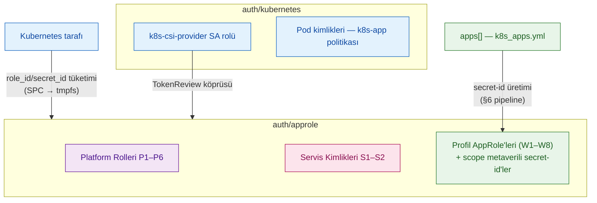
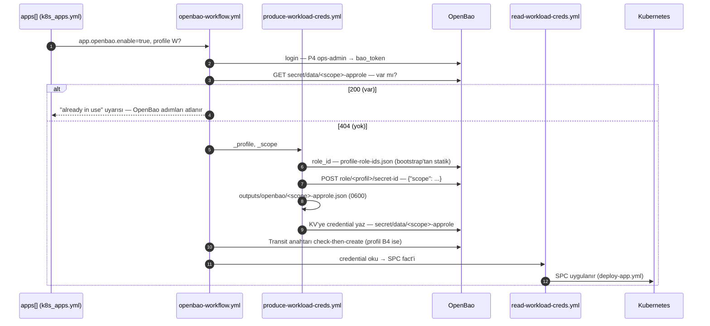

# OpenBao RBAC — Politika Demetleri, Profiller ve Kimlik Modeli

> Bu belge, OpenBao kimlik ve yetki modelinin **tek derinlemesine kaynağıdır**: politika demetleri (B0–B11), kimlik katalogları (workload profilleri **W**, platform rolleri **P**, servis kimlikleri **S**), `apps[]` OpenBao şeması, identity templating mimarisi ve self-service credential pipeline. Özet anlatım: [`openbao-architecture-guide.md`](openbao-architecture-guide.md) §5. Canlı doğrulama kayıtları: [`openbao-tests.md`](openbao-tests.md).

---

<details>
<summary><strong>İçindekiler</strong></summary>

  - [1. Kimlik Katmanları ve İki Katman Modeli](#1-kimlik-katmanları-ve-i̇ki-katman-modeli)
  - [2. Politika Demetleri (B0–B11)](#2-politika-demetleri-b0b11)
  - [3. Kimlik Kataloğu](#3-kimlik-kataloğu)
  - [4. `apps[]` OpenBao Şeması](#4-apps-openbao-şeması)
  - [5. Identity Templating Mimarisi](#5-identity-templating-mimarisi)
  - [6. Self-Service Credential Pipeline](#6-self-service-credential-pipeline)
  - [7. Cloud Analojisi (IAM)](#7-cloud-analojisi-iam)
  - [8. Gözlemlenebilirlik](#8-gözlemlenebilirlik)
  - [9. Conformance Test Standardı](#9-conformance-test-standardı)
  - [10. Dosya Haritası ve Sahiplik](#10-dosya-haritası-ve-sahiplik)
  - [11. Bilinçli Sınırlar](#11-bilinçli-sınırlar)
</details>

---

## 1. Kimlik Katmanları ve İki Katman Modeli

### 1.1 İki kimlik yolu: AppRole ve Kubernetes Auth

OpenBao'da makine kimliği iki auth method üzerinden yürür:

| Auth yolu | Mount | Kim nasıl doğrulanır | Kim kullanır |
|---|---|---|---|
| **AppRole** | `auth/approle` | `role_id` + `secret_id` çifti | Platform rolleri (P), servis kimlikleri (S), uygulamaya türetilen roller (W → `app-<scope>-<profile>`) |
| **Kubernetes Auth** | `auth/kubernetes` | ServiceAccount JWT — TokenReview köprüsü ile doğrulanır | K8s pod kimlikleri: CSI sağlayıcı ve pod'lar (`k8s-app` şablonlu politikası) |

AppRole, OpenBao tarafındaki bir auth method'udur; Kubernetes tarafı onu **tüketir** — `role_id`/`secret_id` çifti SecretProviderClass aracılığıyla pod'lara tmpfs olarak iletilir, etcd'ye K8s Secret kopyası yazılmaz.

### 1.2 AppRole altında üç kimlik kategorisi

`auth/approle` altındaki roller kodda üç ayrı listede tanımlanır; bu belge aynı üç seriyi kod olarak kullanır:

| Seri | Anlam | Kaynak liste | Tanımlandığı yer |
|---|---|---|---|
| **W1–W8** | Workload **profili** — şablon; profil başına **tek AppRole**, her app bu role scope metaverili yeni bir `secret-id` alır | `openbao_workload_profiles` | `openbao/security/defaults/main.yml` |
| **P1–P6** | Platform **rolü** — tekil, statik AppRole; türetilmez | `openbao_platform_roles` | `openbao/security/defaults/main.yml` |
| **S1–S2** | Servis **kimliği** — K8s altyapı servislerinin AppRole'ü | `openbao_approle_roles` | `openbao/security/defaults/main.yml` |

Kubernetes-auth kimlikleri AppRole kataloğunun dışındadır (§3.4).

### 1.3 İki katman: değişim sıklığına göre fiziksel ayrım

| Katman | İçerik | Nerede tanımlı | Değişim sıklığı |
|---|---|---|---|
| **Platform + Servis** | P: `pki-signer`, `pki-manager`, `monitor`, `ops-admin`, `bao-raft-agent`, `bao-raft-restore` · S: `cert-manager`, `k8s-csi` | `rbac-platform.yml` (root'la, bir kez) + `bootstrap.yml` (S) | Nadiren |
| **Workload** | W1–W8 profil AppRole'lerine üretilen scope metaverili secret-id'ler | `apps[]` → `app-deploy` self-service | Her yeni app'te |

Bu ayrım, PKI domain otomasyonundaki "Gateway tek seferlik, app-deploy self-service" ilkesinin RBAC karşılığıdır.

### 1.4 Neden P5 (agent) ve P6 (restore) ayrı?

`bao-raft-agent` 7/24 açık bir servistir ve yalnız snapshot **okur** (B10). Aynı yetki restore'a da verilseydi, sürekli açık bir yetki "raft deposunu geri yaz" olurdu — ele geçirilen bir agent ile OpenBao'nun tüm verisi geri alınabilir hale gelirdi. `bao-raft-restore` yalnız `maintenance/restore/restore-openbao.sh` tarafından, insan tetikli ve seyrek kullanılır.



[↑ Başa dön](#openbao-rbac--politika-demetleri-profiller-ve-kimlik-modeli)

---

## 2. Politika Demetleri (B0–B11)

Politika yetkileri yeniden kullanılabilir demetler halinde tanımlanır; bir profil/rol, demetlerin birleşimidir.

| Demet | Kapsam | İçerik |
|---|---|---|
| **B0** `self-care` | Her kimliğe otomatik | `auth/token/lookup-self`, `renew-self` |
| **B1** `kv-read-own` | scope'a özel | `secret/data/<scope>/* → read`, `secret/metadata/<scope>/* → list,read` |
| **B2** `kv-write-own` | scope'a özel | B1 + `create,update,patch` |
| **B3** `kv-own-lifecycle` | scope'a özel | B2 + delete/undelete/destroy |
| **B4** `transit-use` | key'e özel | `transit/{encrypt,decrypt,rewrap,datakey/plaintext}/<key>`, `transit/keys/<key> → read` |
| **B5** `pki-sign` | — | `pki-int/sign/*` (create, update) |
| **B6** `pki-manage` | — | `pki-int/roles/dedicated-* → CRUD` + `denied_parameters: allow_any_name` |
| **B7** `db-consume` | rol'e özel | `database/creds/<rol> → read` |
| **B8** `ops-admin-base` | — | Geniş yönetim (KV/Transit/PKI/Database/AppRole/K8s-auth) + `deny: sys/generate-root-token, sys/seal` |
| **B9** `issue-wrapped` | — | `secret-id → create,update` + zorunlu wrapping TTL |
| **B10** `raft-snapshot` | platform | `sys/storage/raft/snapshot → read` (yalnız **okuma**) |
| **B11** `raft-restore` | platform | B10 + `sys/storage/raft/snapshot → update` + `sys/storage/raft/snapshot-force → update` |

**B10/B11 neden ayrı:** B10, 7/24 açık olan `bao-raft-agent` servisinin kullandığı demettir ve **bilinçli olarak read-only'dir** — resmi [`openbao-snapshot-agent`](https://github.com/openbao/openbao-snapshot-agent) policy'si de yalnız `capabilities = ["read"]` içerir. Yazma yetkisi (B11) yalnız manuel restore yolunda verilir; bu ayrım "7/24 açık servisin raft deposunu geri yazabilmesi" riskini kapatır.

**Kapsam çözümlemesi:** B1/B2/B3/B4/B7'deki `<scope>`/`<key>`/`<rol>` değerleri render zamanında değil, **istek anında** AppRole identity metadata'sından çözülür (§5).

[↑ Başa dön](#openbao-rbac--politika-demetleri-profiller-ve-kimlik-modeli)

---

## 3. Kimlik Kataloğu

### 3.1 Workload Profilleri (W1–W8)

Her profil bir `workload-<adı>-templated` politikasına bağlıdır (§5); uygulamalar `apps[]` üzerinden bu profillerden birini seçer (§4).

| Kod | Profil | Demetler | Token (ttl/max/uses/yenilenir) | İş |
|---|---|---|---|---|
| W1 | `reader` | B0+B1 | 1h/24h/0/evet (service) | Salt-okur consumer |
| W2 | `metrics-reader` | B0 + `sys/health` + `sys/metrics` | 1h/24h/0/evet (service) | OpenBao sağlık ve metrik uçlarını okur (özel exporter); **KV erişimi yok** |
| W3 | `operator` | B0+B1+B2+B4 | 1h/24h/0/evet (service) | KV RW + transit, uzun yaşayan servis |
| W4 | `job-run` | B0+B1+B4 | 30m/1h/0/hayır (batch) | Kısa ömürlü Job |
| W5 | `transit-user` | B0+B4 (KV yok) | 30m/1h/0/hayır (batch) | En dar Job — KV ihtiyacı yoksa |
| W6 | `deployer` | B0+B2 | 15m/1h/0/hayır (batch) | CI/yazıcı |
| W7 | `kv-owner` | B0+B3 | 1h/8h/0/evet (service) | Kendi prefix'inin tam sahibi |
| W8 | `db-consumer` | B0+B7 | 1h/24h/0/evet (service) | Dinamik veritabanı kimliği okur; KV erişimi yok |

"Süre de yetkinin parçasıdır" ilkesi uygulanır: yazma yetkili 15 dakikalık token, okuma yetkili 24 saatlik token ile aynı risk seviyesinde değildir. `job-run`, `transit-user`, `deployer` ve W8 batch/service tiplerinde yenilenemez; süresi dolunca yeni login gerekir (`renew-self` yalnız yenilenebilir profillerin politikasında bulunur).

### 3.2 Platform Rolleri (P1–P6)

| Kod | Rol | Politika (demetler) | Token | İş |
|---|---|---|---|---|
| P1 | `pki-signer` | B0+B5 | 1h/24h/0/service | Ara CA imza yetkisi. **Tanımlı; aktif tüketicisi yok** — imza akışı S2 `cert-manager` AppRole'ü üzerinden yürür |
| P2 | `pki-manager` | B0+B6 | 15m/1h/0/service | Dedicated sertifika rolü yönetimi (`allow_any_name` yasak) |
| P3 | `monitor` | B0 + KV global okuma (`secret/*` read/list) + `sys/health` | 1h/24h/0/service | Salt-okunur izleme |
| P4 | `ops-admin` | B0+B8 | 4h/**8h**/0/service; `token_no_default_policy`, `token_bound_cidrs` | Günlük işletim; `sys/seal` ve `sys/generate-root-token` açıkça deny |
| P5 | `bao-raft-agent` | B0+B10 | 2h/4h/0/service | Raft snapshot **okuma** — 7/24 açık `bao agent` (2h/4h resmi openbao-snapshot-agent değeridir) |
| P6 | `bao-raft-restore` | B0+B10+B11 | 1h/1h/0/service | Raft snapshot **geri yükleme** — insan tetikli, seyrek |

**Credential üretimi:** her koşuda sabit üç rolün credential dosyası üretilir — `ops-admin`, `pki-manager`, `monitor` (`k8s/openbao-ops/defaults → openbao_platform_credentials`). `all.yml → openbao.credential_produce_list` ile ek roller eklenebilir; liste sabit listeyle unique şekilde birleştirilir ve **yalnız `openbao_platform_roles`'ta tanımlı roller** kabul edilir (aksi halde rol lookup'u 404 ile fail eder — `rbac-platform.yml` kuralı).

P4'ün ağ sınırı `all.yml → openbao.rbac.ops_admin_cidrs` ile verilir (varsayılan boş = kısıt yok). Doldurulmadan önce: controller'ın OpenBao'ya eriştiği kaynak IP/ağ bu CIDR içinde OLMALI — yanlış değer bootstrap'i kilitler.

### 3.3 Servis Kimlikleri (S1–S2)

K8s altyapı servislerinin AppRole'leri — `bootstrap.yml` içinde root'la bir kez oluşturulur (`openbao_approle_policies` + `openbao_approle_roles` listeleri).

| Kod | AppRole | Politika | Token | Tüketici |
|---|---|---|---|---|
| S1 | `k8s-csi` | `k8s-app` (SA-scope şablonlu, §5.2) | 1h/24h/0/service | CSI sağlayıcı — **varyant yol**; birincil yol Kubernetes auth (§3.4) |
| S2 | `cert-manager` | `cert-manager`: B5 + `pki-int/cert/*` read | 1h/24h/0/service | cert-manager denetleyici — **aktif imza kimliği budur**; ClusterIssuer bu AppRole ile imzalar |

### 3.4 Katalog dışı kimlikler

- **Kubernetes auth kimlikleri:** `k8s-csi-provider` SA rolü (CSI sağlayıcının **birincil** yolu; TokenReview köprüsü gerektirir — `openbao-auth-reviewer.conf`, anlatım: [`openbao-architecture-guide.md`](openbao-architecture-guide.md) §6.1) ve uygulama pod'ları (SA adından türeyen kapsam, `k8s-app` politikası). Bunlar AppRole kataloğuna girmez.
- **`none`:** profil/rol değildir; `apps[]`'te OpenBao entegrasyonunu tamamen kapatan enum değeridir.
- **`approle-issuer`:** kodda tanımsız gelecek slot'tur; B9 wrapped secret-id üretimi ile birlikte ele alınması öngörülür (§11).

### 3.5 Operasyonel notlar ve dikkat noktaları

**P3 `sys/health` notu:** `sys/health` varsayılan herkese açıktır; politikadaki satır dokümantasyon niyetlidir — kısıtlamak LB problarını kıracağı için yapılmaz.

**P5/P6 `token_num_uses: 0`:** sayaç bilerek 0'dır. `bao agent` arkada kaç API çağrısı yapacağı önceden bilinemez (`auto_auth` yenileme dahil her istek sayacı azaltır); sınır, backup'ı sessizce 403'e düşürürdü. Kısıtlama policy + TTL + unix socket katmanında yapılır. P6'da da 0: `--dry-run`/peş-peşe deneme akışlarında sayaç takibi beklenmedik kırılma üretir.

**`token_bound_cidrs` neden P5/P6'da yok:** agent `listener "unix"` üzerinden bağlanır; unix listener'da uzak adres boş geldiği için CIDR eşleşmesi yapılamaz ve token sessizce reddedilir. Resmi snapshot-agent config'i de `token_bound_cidrs` kullanmaz.

**Erişim kısıtı socket'te mi, dizinde mi?** Kısıt `bao` kullanıcısı ve **dizin izni** ile sağlanır — socket dosyasının kendi izniyle değil. Canlı ölçüm (2026-09-28, OpenBao 2.6.2, `openbao-tests.md` Test 13):

```text
/etc/bao/agent.sock  octal=755  bao:bao     ← config "0660" diyor, uygulanmıyor
/etc/bao             mode=750   bao:bao     ← koruma buradan
```

`bao agent` unix listener'da `socket_mode` değerini **uygulamıyor**; socket `0777 & ~umask(0022)` ile `0755` olarak açılır; `0660` varsayımı geçerli değildir. Koruma `/etc/bao` dizininin `0750 bao:bao` olmasından gelir, yani socket'a yalnız `root` ve `bao` grubu erişebilir. **`/etc/bao` dizin izni gevşetilirse agent soketi korumasız kalır.** Dizin iznini `roles/openbao/server/tasks/install.yml` belirler; `0750 bao:bao` değeri korunmalıdır.

**Agent unit sertleştirmesi — geri eklemeyin:** `bao-raft-agent.service` `ProtectHome` / `ProtectSystem` / `ReadWritePaths` **içermez** ve resmi `openbao-snapshot-agent` unit'i de içermez. Eklenirse iki ayrı nedenden servis başlamaz (regresyon kaydı: `openbao-tests.md` §"Bilinen hata ve kök neden"):

| Directive | Kırılma |
|---|---|
| `ProtectHome=yes` | `/home` mount namespace'de erişilemez olur. `bao agent` client kurarken CLI config dizinini (`$HOME/.bao`) okur → `open …: permission denied` → `exit 1`. `bao server` bu dizine hiç dokunmadığı için aynı blokaj ana serviste görünmez. |
| `ProtectSystem=full` | `/etc` salt-okunur olur; unix listener `/etc/bao/agent.sock` dosyasını **yazamaz** → `EACCES` → `exit 1`. |

Dosya sistemini etkilemeyen `NoNewPrivileges`, `PrivateTmp` ve `LimitNOFILE` korunmuştur. `bao.service` ile agent unit'i arasındaki tek fark `CapabilityBoundingSet`'tir (ana sunucu 8200 portunu bağlar, agent bağlamaz).

[↑ Başa dön](#openbao-rbac--politika-demetleri-profiller-ve-kimlik-modeli)

`BAO_SKIP_VERIFY=true` **zorunludur**: sunucu TLS'i `configure.yml` içinde `openssl req -x509` ile kendinden imzalı üretilir, CA zinciri yoktur; aynı değişken `init.yml`'de de kullanılır.

---

## 4. `apps[]` OpenBao Şeması

```yaml
- name: myapp
  namespace: demo
  openbao:
    enable: true          # false/yoksa blok yok sayılır
    profile: operator     # W1–W8 arasından bir profil (aşağıya bakın)
    scope: myapp          # opsiyonel — verilmezse name alınır
    scope_level: app      # opsiyonel — varsayılan: app; alternatif: namespace
```

**Seçilebilir profiller:** `reader`, `metrics-reader`, `operator`, `job-run`, `transit-user`, `deployer`, `kv-owner`, `db-consumer` (W1–W8) ve `none`.

**Bilinçli sınır — P ve S kimlikleri `apps[]`'te seçilemez:** `workload-<profil>-templated` politikaları yalnız W profilleri için üretilir. Kod tarafında enum zorlaması yoktur; yanlış profil seçilirse rol oluşturma adımı OpenBao'da policy-bulunamadı hatasıyla düşer — beyanları W aralığında tutun.

### `scope_level` ne işe yarar

- **`app`** (varsayılan): Her app kendi izole `<scope>`'una sahiptir. `secret/data/myapp/*`.
- **`namespace`**: Aynı namespace'te, aynı `profile` + `scope_level: namespace` deklare eden **tüm app'ler tek bir AppRole/scope paylaşır**. Senaryo: bir mikroservis grubunun (ör. `checkout` namespace'indeki 5 app) ortak KV prefix'i paylaşması — her birine ayrı izole scope açmak yerine tek kimlik.

```yaml
- name: order-service
  namespace: checkout
  openbao: { enable: true, profile: operator, scope_level: namespace }

- name: payment-service
  namespace: checkout
  openbao: { enable: true, profile: operator, scope_level: namespace }
# İkisi de aynı AppRole'ü (ns-checkout-operator) paylaşır ve
# secret/data/checkout/* prefix'ine erişir.
```

**Dikkat — bilinçli sınır:** `scope_level: namespace` paylaşımlı kimlik demektir; bir app'in `secret_id`'si sızarsa namespace'teki tüm app'lerin scope'u risk altındadır. Varsayılan her zaman `app` (izole) kalmalı; `namespace` yalnız kasıtlı, gerçekten paylaşılan kimlik istendiğinde seçilmeli.

[↑ Başa dön](#openbao-rbac--politika-demetleri-profiller-ve-kimlik-modeli)

### Scope ad çakışması

Kapsam adı (`scope`), credential kaydının anahtarıdır: KV'de `secret/data/<scope>-approle`, Transit'te `<scope>-<key>`. Aynı scope adını kullanan ikinci bir app, pipeline'ın çakışma kontrolünde "already in use" uyarısıyla atlanır — üzerine yazma yapılmaz. Bir app adı ile bir namespace adı aynı string olsa bile durum değişmez: ilk dağıtım kazanır; bilinçli ayrım gerekiyorsa `scope` değeri elle farklılaştırılır. AppRole/policy sayısı profil sayısıyla sabittir (8) — app/namespace ayrımı AppRole adında değil, `scope` değeri ve secret-id metaverisinde taşınır.

---

## 5. Identity Templating Mimarisi

### 5.1 Mekanizma

Yetki alanları politika dosyalarına elle yazılmaz; OpenBao'nun identity templating değişkenleri istek anında token sahibinin kimlik metaverisinden çözülür. Böylece sisteme 100 yeni uygulama eklense bile yeni politika dosyası yazılmaz — politika bakım maliyeti yaklaşık `O(1)`'dir.

`workload-reader-templated.hcl.j2` örneği:

```hcl
path "auth/token/lookup-self" {
  capabilities = ["read"]
}
path "auth/token/renew-self" {
  capabilities = ["update"]
}
path "secret/data/{{identity.entity.aliases.<accessor>.metadata.scope}}/*" {
  capabilities = ["read"]
}
path "secret/metadata/{{identity.entity.aliases.<accessor>.metadata.scope}}/*" {
  capabilities = ["list", "read"]
}
```

Şablon değeri token sahibinin kimlik metaverisinden çözülür: `order-service` token'ı `secret/data/order-service/db` yoluna erişebilirken `payment-service` yoluna erişemez. Transit kullanan profillerde anahtar yolu aynı mekanizmayla `<scope>-*` desenine kilitlenir.

### 5.2 İki yönlü kapsam bağlama

- **AppRole yolu:** self-service pipeline, yeni `secret-id` üretirken `{"scope": "<app adı>"}` metaverisini yazar (§6). Politika şablonu bu değeri okuyarak yolu kısıtlar.
- **Kubernetes auth yolu:** CSI üzerinden giriş yapan pod'un ServiceAccount adı kimlik metaverisine yazılır; `k8s-app` politikası pod'u yalnızca kendi `<sa-adı>-approle` yoluna kilitler:

```hcl
path "secret/data/{{identity.entity.aliases.<accessor>.metadata.service_account_name}}-approle" {
  capabilities = ["read"]
}
```

Kubernetes auth rolündeki `bound_service_account_names` wildcard (`["*"]`) olsa da giriş kapısı geniştir; politikalar şablonlu olduğundan izolasyon korunur.

### 5.3 Ansible tarafı: `approle_accessor` fact'i

Template literali içindeki `<accessor>`, `sys/auth`'ten okunur ve tüm policy render'larında tek yerden çözülür:

```yaml
- name: AppRole mount accessor'ını al
  ansible.builtin.uri:
    url: "{{ openbao_address }}/v1/sys/auth"
    method: GET
    headers: { X-Vault-Token: "{{ bao_token }}" }
  register: auth_list

- name: accessor'ı fact olarak sakla
  ansible.builtin.set_fact:
    approle_accessor: "{{ auth_list.json[openbao_approle_mount ~ '/'].accessor | regex_replace('^auth_approle_', '') }}"
```

### 5.4 Bilinen sınırlamalar

- **`auth_approle_` öneki tuzağı (canlı yakalandı):** HCL anahtarına ek `auth_approle_` öneki konursa anahtar `auth_approle_auth_approle_<id>` olur ve policy **sessizce 403** verir (pozitif test dahil). Doğru anahtar = accessor'ın kendisi; fact yalın id'ye indirilir (`regex_replace('^auth_approle_', '')`).
- **Jinja2 `raw/endraw` tuzağı:** OpenBao template literalleri `` sarmalıyla değil `{{ '{{' }}` jinja-string yaklaşımıyla yazılır (raw sarmalı "Missing end of raw directive" hatası verir).


- **Şablon enjeksiyonu:** wildcard (`*`, `+`), yol ayraçları (`/`) ve PKI glob karakterleri identity şablonlarında OpenBao 2.6.2 ile varsayılan reddedilir. `scope` değerleri `app.name`'den türetildiği için bu karakterleri içermez; `allow_*_in_identity_templates` bayrakları kapalı tutulur. LIST yetki atlama düzeltmesi de wildcard izinlerinin deny kurallarını listeleme operasyonlarında atlamasını engeller — `sys/seal` ve `sys/generate-root-token` yasakları listeleme yoluyla delinemez.

### 5.5 Doğrulama

Mekanizma kapsam testleriyle teyit edildi: alias metadata'sında `scope` görünür; tek statik policy ile iki pilot rol arasında 4/4 kontrol tuttu (kendi yoluna 200, çapraz erişimler 403), tam temizlik yapıldı. Kanıt kayıtları, negatif test çıktıları ve yukarı akış araştırması (OpenBao Discussion #2212 — kanıtlanan/kanıtlanmayan ayrımıyla): [`openbao-tests.md`](openbao-tests.md) **Bölüm 3**.

[↑ Başa dön](#openbao-rbac--politika-demetleri-profiller-ve-kimlik-modeli)

---

## 6. Self-Service Credential Pipeline

### 6.1 Dört parçalı akış

`app-deploy` içinden çağrılır:

1. `openbao-workflow.yml` — kapsam hesabı + **KV çakışma kontrolü** + koordinasyon
2. `produce-workload-creds.yml` — profilin statik `role_id`'si + yeni `secret-id` üretimi + credential yazımı (controller `outputs/` + OpenBao KV)
3. `produce-transit-key.yml` — `<scope>-<key>` Transit anahtarı check-then-create (profil B4 içeriyorsa)
4. `read-workload-creds.yml` — credential okuma + SecretProviderClass fact'i (provider credential'ı KV yolundan okur)



Örnek — `produce-workload-creds.yml` çekirdeği:

```yaml
- name: "Read role_id from static file (fixed, one per profile)"
  ansible.builtin.set_fact:
    _cred_role_id: "{{ (lookup('file', playbook_dir + '/../outputs/openbao/profile-role-ids.json') | from_json)[_profile] }}"

- name: "Generate secret_id — profile: {{ _profile }}, scope: {{ _scope }}"
  ansible.builtin.uri:
    url: "{{ openbao_address }}/v1/auth/{{ openbao_approle_mount }}/role/{{ _profile }}/secret-id"
    method: POST
    headers: { X-Vault-Token: "{{ bao_token }}" }
    body:
      metadata: "{{ {'scope': _scope} | to_json }}"   # API JSON-string ister — map değil
    body_format: json
    validate_certs: false
    status_code: 200
  register: _secret_id_result
  no_log: true   # yanıt plaintext secret_id içerir — log'a düşmez

- name: "Write credentials to OpenBao KV — {{ _scope }}-approle"
  ansible.builtin.uri:
    url: "{{ openbao_address }}/v1/{{ openbao_kv_mount }}/data/{{ _scope }}-approle"
    method: POST
    headers: { X-Vault-Token: "{{ bao_token }}" }
    body:
      data: { role_id: "{{ _cred_role_id }}", secret_id: "{{ _secret_id_result.json.data.secret_id }}" }
    body_format: json
    validate_certs: false
    status_code: [200, 204]
  no_log: true
```

Profil AppRole'leri bootstrap'ta bir kez açılır (`rbac-workload.yml`: 8 rol + templated policy'ler + statik `role_id` kaydı `profile-role-ids.json`). App sayısı arttıkça AppRole ve policy sayısı değişmez; her app yalnız kendi scope'una ait yeni bir `secret-id` alır — kapsam izolasyonunu, token'da taşınan scope metaverisini okuyan templated policy sağlar (§5).

### 6.2 Token kaynağı disiplini

`bao_token` root **değildir**. Root yalnız bir kez, `rbac-platform.yml` bootstrap'ında kullanılır: P4 `ops-admin` rolünü + secret-id'yi üretir, `outputs/openbao/ops-admin.json`'a yazar ve `root token` aktif olarak kullanılmaz(ama silinmez de) (break-glass). Sonrasında tüm rutin işler **P4** `ops-admin`'ıyla yürür:

- Self-service pipeline her koşuda `ops-admin.json`'dan `role_id`+`secret_id` okur, `approle/login` ile taze token alır (TTL kısa olduğundan her koşu yeniler).
- Workload politikaları da P4 token'ıyla yazılır.
- Root dosyası (`openbao-credentials.yml`) hiçbir playbook tarafından okunmaz.


### 6.3 Config tek kaynak

Profil tanımları (TTL/max_ttl/renewable/extra) `openbao/security/defaults → openbao_workload_profiles` (list-of-dicts) yapısındadır; `rbac-workload.yml` ve `openbao-workflow.yml` aynı kaynaktan okur. `rbac-platform.yml` P4'e `token_bound_cidrs` ve `token_no_default_policy: true` uygular.

### 6.4 Davranış

Aynı scope adını kullanan ikinci bir app → KV çakışma kontrolü 200 döner, "already in use" uyarısı basılır ve OpenBao adımları atlanır — üzerine yazma yapılmaz. Yeni scope → 404, credential zinciri o anda üretilir. Tek komut: `ansible-playbook playbooks/k8s_apps.yml`.

---

## 7. Cloud Analojisi (IAM)


| OpenBao | AWS IAM | Azure (Entra ID) | GCP (Cloud IAM) | Mekanizma |
|---|---|---|---|---|
| AppRole | IAM Role (machine identity) | Workload Identity + service principal | Workload Identity Federation | `role_id`+`secret_id` = `AssumeRole` |
| Policy (HCL) | IAM Policy (JSON) | Azure RBAC role definition | IAM Policy (YAML) | Path/capability tabanlı |
| **Identity templating** | **IAM Policy Variables** | **Custom security attributes + Condition** (yaklaşık karşılık) | **IAM Conditions** (`attributes.*`) | `{{identity...}}` ↔ tag/attribute bazlı politika |
| Entity/Group | IAM Group | Entra ID Group | IAM Group | Politika toplu atama |
| `secret_id` wrapping | STS `AssumeRole` + external ID | doğrudan karşılık yok | doğrudan karşılık yok | Tek kullanımlık, kısa TTL |
| `token_bound_cidrs` | IAM Condition `aws:SourceIp` | Conditional Access (konum kısıtı) | IAM Condition (IP kısıtı) | Ağ seviyesi kısıt |
| Control Groups (2.7'de beklenen) | IAM Permission Boundary + onay akışı | PIM onay akışı | doğrudan karşılık yok | İnsan-in-the-loop |

[↑ Başa dön](#openbao-rbac--politika-demetleri-profiller-ve-kimlik-modeli)
---

## 8. Gözlemlenebilirlik


OpenBao telemetrisi, W2 `metrics-reader` profiliyle çalışan projeye özel exporter üzerinden Prometheus'a akar (mimari: [`openbao-architecture-guide.md`](openbao-architecture-guide.md) §10).

RBAC açısından izlenecek sinyaller:

- Profil başına token issuance sayısı (`vault_token_create_count` benzeri).
- Policy başına reddedilen istek sayısı (403'ler) — beklenmedik artış, yanlış kapsamlı bir denemeyi veya sızmış bir credential'ı işaret edebilir.
- AppRole login başarısızlık oranı.

Bu, "RBAC var" iddiasını "RBAC'ın gerçek kullanımı izleniyor" iddiasına taşır — bulut sağlayıcılarındaki denetim ve erişim-analizi araçlarının (CloudTrail / Activity Log / Cloud Audit Logs ve IAM Access Analyzer benzeri) küçük bir versiyonudur.

---

## 9. Conformance Test Standardı

Her profil için standart dört adım:

1. **Pozitif:** Doğru scope'lu token, kendi path'ine erişebiliyor.
2. **Negatif (kapsam):** Aynı profildeki **başka bir scope'un** token'ı, bu path'e erişemiyor (403).
3. **Negatif (yetki):** Farklı bir profilin token'ı, bu profilin yetkisi dışındaki bir capability'yi (ör. `reader` token'ıyla `write`) deneyemiyor (403).
4. **Idempotency:** `ansible-playbook playbooks/k8s_apps.yml` ikinci koşuda OpenBao adımlarını atlar (scope credential kaydı zaten var — "already in use").

**P5/P6 için araca özel ek kontroller:**


| # | Kimlik | Kontrol | Beklenen |
|---|---|---|---|
| 5 | P5 | `curl -sk --unix-socket /etc/bao/agent.sock localhost/v1/auth/token/lookup-self` | `policies` içinde `bao-raft-agent` var, **`root` yok**. `default` OpenBao'nun her token'a otomatik eklediği **boş (deny-by-default)** politikadır; `policy read default` bu token'a 403 döner, yani yetki taşımaz |
| 6 | P5 | agent token'ıyla `POST /v1/sys/storage/raft/snapshot` | **403** (B10 read-only — tasarımın doğrulaması) |
| 7 | P5 | agent token'ıyla `GET /v1/sys/policies/acl` | **403** |
| 8 | P5 | `test -f /etc/bao/snap-bao-raft-agent-secretid` | **var** (`remove_secret_id_file_after_reading = false` sayesinde; `true` olsaydı 2. koşuda login olmazdı) |
| 9 | P6 | restore token'ıyla `GET /v1/sys/health` | 200 (ön kontrolden geçebilmeli) |
| 10 | P6 | restore token'ıyla `GET /v1/sys/policies/acl` | **403** (yetki yalnız raft yollarında) |

6. satır "negatif" testtir ama tasarımın **gereğidir**: P5'e yanlışlıkla `update` eklendiğinde sessizce geçer ve asıl güvenlik ayrımı kaybolur.

Canlı ölçülmüş prosedür ve gerçek çıktılar: [`openbao-tests.md`](openbao-tests.md) **Bölüm 2** (Test 5–13) — yukarıdaki "Beklenen" sütunu o sonuçlarla birebir örtüşür. Templating pilotu kayıtları: aynı belge **Bölüm 3**.

---

## 10. Dosya Haritası ve Sahiplik


| Dosya | Rol |
|---|---|
| `ansible/roles/openbao/security/defaults/main.yml` | **Tek kaynak:** `openbao_approle_policies` (S2 politikası), `openbao_approle_roles` (S1/S2), `openbao_platform_policies` (P1–P6), `openbao_platform_roles` (P1–P6), `openbao_workload_profiles` (W1–W8) |
| `ansible/roles/openbao/security/tasks/rbac-platform.yml` | Platform RBAC: politika + rol oluşturma, P4 bootstrap (ops-admin.json, root kullanım dışı), credential loop |
| `ansible/roles/openbao/security/tasks/rbac-workload.yml` | Workload RBAC: accessor alma + 8 templated policy + 8 rol + `profile-role-ids.json` |
| `ansible/roles/openbao/security/templates/` | `k8s-app-templated.hcl.j2` + `workload-<adı>-templated.hcl.j2` (W1–W8) |
| `ansible/roles/openbao/server/tasks/bootstrap.yml` | Mount'lar + S1/S2 oluşturma (`openbao_approle_policies/roles` loop'ları) + rbac-platform/rbac-workload include + `openbao-mount.json` |
| `ansible/roles/openbao/server/tasks/backup.yml` | P5/P6: snapshot dizini + credential dosyaları (0640 bao:bao) + agent config/unit + `systemctl start` (fail-fast) |
| `ansible/roles/openbao/server/templates/bao-raft-agent.hcl.j2` | Agent config: `api_proxy` + unix listener + `auto_auth` (AppRole); `remove_secret_id_file_after_reading = false` |
| `ansible/roles/openbao/server/templates/bao-raft-agent.service.j2` | Agent unit: `User=bao`, `BAO_CLIENT_TIMEOUT`, `BAO_SKIP_VERIFY=true`, `After=bao.service`; `ProtectHome`/`ProtectSystem` kasıtlı olarak yok (§3.5) |
| `ansible/roles/k8s/openbao-ops/tasks/main.yml` | P4 login + reviewer conf (TokenReview köprüsü: `outputs/k8s/openbao-auth-reviewer.conf` → `token_reviewer_jwt`) + kubernetes auth config/role + CSI ve cert-manager AppRole Secret'ları |
| `ansible/roles/k8s-apps/app-deploy/tasks/openbao-workflow.yml` | §6 self-service: kapsam hesabı + AppRole check-then-create |
| `ansible/roles/k8s-apps/app-deploy/tasks/produce-workload-creds.yml` | §6 credential üretimi: role_id + credential yazımı (outputs + KV) |
| `ansible/roles/k8s-apps/app-deploy/tasks/produce-transit-key.yml` | §6 Transit anahtarı check-then-create (profil B4 içeriyorsa) |
| `ansible/roles/k8s-apps/app-deploy/tasks/read-workload-creds.yml` | §6 K8s tarafı credential okuma + K8s Secret'a yazma |
| `ansible/roles/k8s-apps/app-remove/tasks/delete-openbao-approle.yml` | Guard'lı OpenBao temizlik adımı (asıl kapsam: KV kaydı ve secret-id — bilinçli sınır §11) |
| `maintenance/backup/app-data/backup-openbao.sh` | Snapshot alır (unix socket, **token'sız**), yerel kopya + restic |
| `maintenance/restore/restore-openbao.sh` | P6'nın tek tüketicisi: rollback → restic → `POST /snapshot` |
| `ansible/inventory/group_vars/all/k8s_apps.yml` | `openbao.{enable,profile,scope,scope_level}` şeması (uygulama beyanları) |
| `ansible/inventory/group_vars/all/all.yml` | `openbao.credential_produce_list`, `openbao.rbac.ops_admin_cidrs` |

**Sahiplik notu (reviewer):** reviewer SA ve conf'i OpenBao platform RBAC katmanında değil, **K8s tarafında** `k8s/openbao-ops` üretir. Anlatım: [`openbao-architecture-guide.md`](openbao-architecture-guide.md) §6.1, [`k8s-design.md`](../architecture/k8s-design.md) §6.8; conf üretim mekanizması: [`kubernetes/rbac.md`](../kubernetes/rbac.md) §8.2.1.

**Sahiplik notu (raft agent):** P5/P6'nın **politika ve rolleri** OpenBao platform RBAC katmanında (`security/`), süreç tarafı ise bilinçli olarak üç role bölünmüştür:

| Parça | Sahibi | Neden |
|---|---|---|
| Policy + AppRole + credential üretimi | `roles/openbao/security` (§1, statik) | OpenBao tarafı — diğer tüm platform kimlikleriyle aynı yer |
| Agent process, config, unit, `/etc/bao/snap-*-*` | `roles/openbao/server` (`backup.yml`) | `/etc/bao`, `bao` kullanıcısı ve unit'ler bu rolün malı |
| Snapshot alma (backup) | `roles/maintenance` (`backup-openbao.sh`) | restic/metrik/alert zinciriyle aynı yerde kalmalı |
| Snapshot geri yükleme (restore) | `roles/maintenance` (`restore-openbao.sh`) | `restore/` ağacı ve DR dağıtımı bu role ait |

"Raft yedekleme" tek bir konsepttir ama üç role yayılır; hiçbiri tek başına eksik değildir. Operasyonel anlatımın sahibi: [`maintenance.md`](../maintenance/maintenance.md) §3.4/§5.6.

[↑ Başa dön](#openbao-rbac--politika-demetleri-profiller-ve-kimlik-modeli)

---
