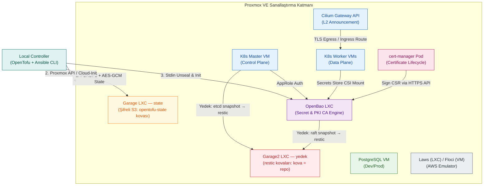
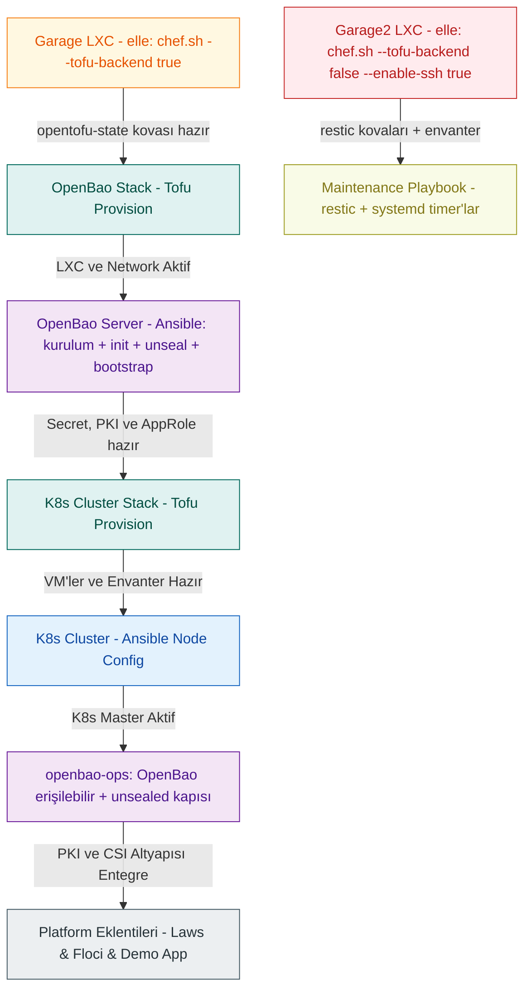
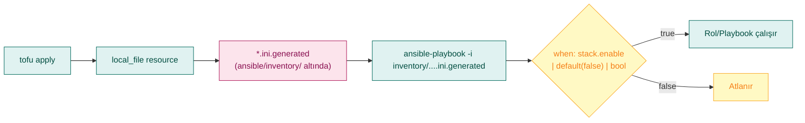
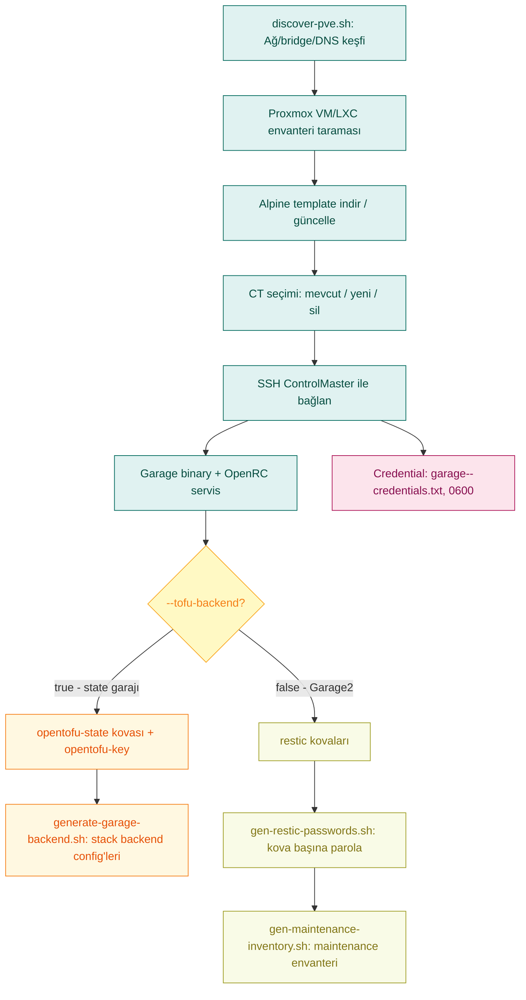
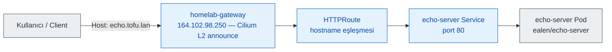

# Cloud-in-Lab

> **Self-hosted Platform Engineering Toolkit — Proxmox üzerinde OpenTofu + Ansible ile tekrarlanabilir cloud altyapısı**

> **İsim notu:** Proje başlangıçta "Tofu-lar" adıyla oluşturulmuş, kapsamına uygun şekilde "Cloud-in-Lab" olarak yeniden adlandırılmıştır. Yol, değişken ve birim adlarındaki (`/etc/tofu-lar`, `tofu-lar-backup-*`) ile iç ağ domainindeki (`tofu.lan`) `tofu` ifadeleri teknik identifier olup bilerek korunmuştur.

[](https://opentofu.org)
[](https://www.ansible.com)
[](https://kubernetes.io)
[](https://www.proxmox.com)
[](https://openbao.org)

Cloud-in-Lab, modern cloud mimari kalıplarını **kendi altyapınızda** tekrarlanabilir şekilde üreten bir platform mühendisliği araç takımıdır. Gerçek buluta geçmeden önce geliştirme, test ve validasyon için gerçekçi bir ortam sunar.

| Problem | Cloud-in-Lab ile Çözüm |
|---------|-------------------|
| Cloud maliyetleri çok yüksek | Proxmox üzerinde self-hosted, daha uygun maliyetli |
| Manuel kurulum hataları | OpenTofu + Ansible ile %100 kod tanımlı, zero-click |
| Secret/PKI yönetimi karmaşık | OpenBao ile merkezi secret + sertifika altyapısı |
| Altyapı tekrarlanamıyor | Tek komutla sıfırdan yeniden kurulabilir |
| Dağınık araçlar | IaC → Konfigürasyon → Orkestrasyon → Operasyonlar tek çatıda |

**Platform Lifecycle:**

```text
Geliştirici → Git → OpenTofu → Proxmox → Ansible → Kubernetes → Platform Servisleri → Operasyonlar
```

---

<details>
<summary><strong>İçindekiler</strong></summary>

- [1. Bölüm — Giriş](#1-bölüm--giriş)
  - [1.1 Neden Bu Proje?](#11-neden-bu-proje)
  - [1.2 Neler Sunuluyor?](#12-neler-sunuluyor)
  - [1.3 Teknik Yaklaşım](#13-teknik-yaklaşım)
  - [1.4 Kimin İçin?](#14-kimin-i̇çin)
  - [1.5 Donanım ve Kaynak Matrisi](#15-donanım-ve-kaynak-matrisi)
  - [1.6 Platform Genel Bakışı](#16-platform-genel-bakışı)
- [2. Bölüm — Mimari](#2-bölüm--mimari)
  - [2.1 Stack İzolasyonu ve State Stratejisi](#21-stack-i̇zolasyonu-ve-state-stratejisi)
  - [2.2 Tofu ve Ansible Görev Ayrımı](#22-tofu-ve-ansible-görev-ayrımı)
  - [2.3 Neden Bu Teknolojiler?](#23-neden-bu-teknolojiler)
  - [2.4 Bulut Servis Benzerleri](#24-bulut-servis-benzerleri)
  - [2.5 Dizin Yapısı](#25-dizin-yapısı)
- [3. Bölüm — Platform Bileşenleri](#3-bölüm--platform-bileşenleri)
  - [3.1 Proxmox Prep](#31-proxmox-prep)
  - [3.2 Deploy Sırası](#32-deploy-sırası)
  - [3.3 Temel Teknik Akışlar](#33-temel-teknik-akışlar)
  - [3.4 GarageHQ (S3 Depolama) — İki Ayrı LXC](#34-garagehq-s3-depolama--i̇ki-ayrı-lxc)
  - [3.5 deploy.sh](#35-deploysh)
  - [3.6 Ansible](#36-ansible)
  - [3.7 OpenBao (Secret Management)](#37-openbao-secret-management)
  - [3.8 Kubernetes Cluster](#38-kubernetes-cluster)
  - [3.9 Databases (PostgreSQL)](#39-databases-postgresql)
  - [3.10 EFK (Elasticsearch)](#310-efk-elasticsearch)
  - [3.11 Floci (AWS Emulator)](#311-floci-aws-emulator)
  - [3.12 Laws (AWS Emulator)](#312-laws-aws-emulator)
  - [3.13 Ansible Rolleri](#313-ansible-rolleri)
- [4. Bölüm — Operasyonlar](#4-bölüm--operasyonlar)
  - [4.1 Test Edilen Ortamlar (Tested Environment)](#41-test-edilen-ortamlar-tested-environment)
  - [4.2 Tasarım Kararları (Design Decisions)](#42-tasarım-kararları-design-decisions)
  - [4.3 Güvenlik Modeli](#43-güvenlik-modeli)
  - [4.4 Bakım ve Yedekleme](#44-bakım-ve-yedekleme)
  - [4.5 Felaket Kurtarma](#45-felaket-kurtarma)
  - [4.6 Proje Durumu](#46-proje-durumu)
  - [4.7 Bilinen Kısıtlar](#47-bilinen-kısıtlar)
  - [4.8 Sıkça Sorulan Sorular](#48-sıkça-sorulan-sorular)
  - [4.9 Lisans](#49-lisans)
</details>

---

# 1. Bölüm — Giriş

---

## 1.1 Neden Bu Proje?

Modern yazılım ekipleri nadiren "sadece bir uygulama" deploy eder.

Geliştirme ortamlarında genellikle şunlar gerekir:

- Infrastructure as Code
- Kubernetes
- Secret Management
- PKI (sertifika yönetimi)
- Gateway API
- Object Storage (S3)
- RBAC (rol tabanlı erişim)
- Service Discovery
- Backup & Disaster Recovery

Herkese açık bulut sağlayıcıları bu hizmetleri sunar, ancak üretim bulut altyapısında deney yapmak maliyetli, yavaş ve farklı zorluklar içermektedir.

Cloud-in-Lab, aynı mimari ilkelerin kendi altyapınızda test edilebildiği **tekrarlanabilir bir platform** sunar.

> Amaç, modern bulut platformlarının **operasyonel deneyimini** kontrollü bir laboratuvar ortamında yeniden üretmektir.

---

## 1.2 Neler Sunuluyor?

Kurulumdan sonra platform şunlar için bir temel sağlar:

- Kubernetes cluster'ları
- OpenBao tabanlı secret yönetimi
- Bulut benzeri KMS yönetimi
- İç PKI altyapısı
- Gateway API
- AWS-uyumlu geliştirme servisleri (Laws, Floci)
- Ortama (Env) özel Infrastructure as Code
- Otomatik konfigürasyon yönetimi
- Disaster recovery araçları

---

## 1.3 Teknik Yaklaşım

Bu projede altyapıya dört temel ilke çerçevesinde yaklaşıyoruz.

### 1.3.1 %100 Deklaratif Altyapı (Zero Click-Ops)

Tüm sanal makineler, ağ konfigürasyonları ve işletim sistemi ayarları koddur. Proxmox arayüzünden manuel hiçbir işleme izin verilmez. Sistem her an silinip aynı parametrelerle sıfırdan üretilebilir.

### 1.3.2 Güvenli Tasarım (Secure by Design)

Güvenlik sonradan eklenen bir yama değildir. Altyapı durum dosyaları diske asla açıkça yazılmaz; secret'lar repoda barındırılmaz; bileşenler minimum yetki (Least Privilege) ilkesiyle çalışır.

### 1.3.3 Operasyon Odaklılık (Operations Matter)

Kurulum yaşam döngüsünün yalnızca %10'udur. Bu proje; yedekleme, doğrulama, budama (pruning) ve geri yükleme (restore) operasyonlarını ana mimarinin merkezine konumlandırır.

### 1.3.4 Bağımsız Stack Mimarisi

Her platform bileşeni kendi yaşam döngüsüne ve yalıtılmış state dosyalarına sahip bağımsız bir stack olarak deploy edilir. Bu sayede bir bileşendeki değişiklik diğerlerini etkilemez.

### 1.3.5 Neden Bu Seçimler? (Karar Gerekçeleri)

| Seçim | Cloud/Standart Karşılığı | Neden Bu Çözüm? |
|-------|-------------------------|-----------------|
| **OpenBao LXC (K8s dışı)** | Vault (K8s içi), AWS Secrets Manager, Azure Key Vault | Secret/PKI K8s'ten izole — K8s ele geçirilse bile credential'lar güvende; AppRole her platformda çalışır |
| **GarageHQ (S3 backend)** | AWS S3, MinIO (arşivlendi), SeaweedFS | Rust tabanlı, ~60 MB RAM, geo-distributed, MPL lisans, OpenTofu native S3 backend desteği |
| **kubeadm (Talos/k3s değil)** | EKS/GKE/AKS managed control plane | Upstream Kubernetes, sürüm kontrolü tam projeye ait, Cilium Gateway API ile tam uyumlu |
| **Cilium Gateway API** | ALB/NLB + Route53, Kong, MetalLB | eBPF tabanlı, kube-proxy yok, native Gateway API, L2 announcement, 3-tier network policy |
| **3-Tier Cilium Policy** | Security Groups + NACLs + WAF | CC-NP (cluster) → CNP (namespace) → CC-NP (pod) + `ingress-exposed` label gate |
| **chef.sh Bootstrap** | Terraform Cloud, Pulumi | Interactive: discovery → selection → SSH → config → credential copy → backend gen tek akışta |
| **No-Provisioner Rule** | Terraform provisioner (anti-pattern) | Tofu asla Ansible çağırmaz; köprü sadece `local_file` → inventory dosyası |
| **State Encryption (PBKDF2+AES-GCM)** | Terraform Cloud, S3+DynamoDB locking | OpenTofu 1.7+ native, `enforced=true`, provider-free, her stack'te bağımsız `encryption.tofu` |

---

## 1.4 Kimin İçin?

- Homelab meraklıları
- Platform Mühendisleri
- DevOps Mühendisleri
- Geliştirme ekipleri
- QA ekipleri
- Şirket içi laboratuvarlar
- Bulut geçiş projeleri
- Altyapı ve Kubernetes öğrenme hedefi olanlar için

Cloud-in-Lab, **tekrarlanabilir platform mühendisliği ortamlarına** odaklanır, kamu bulut sağlayıcılarının yerini almaz.

---

## 1.5 Donanım ve Kaynak Matrisi

Bu tablo, projenin ne kadar hafif ve optimize olduğunu gösterir. Tek bir eski NUC veya Mini PC'de çalışabilir.

| Bileşen | Min RAM | Min CPU | Tip | Bulut Karşılığı |
|---------|---------|---------|-----|---------------|
| **GarageHQ (×2 LXC)** | ~60 MB | 1 Core | Alpine LXC (state + yedek) | AWS S3, Azure Blob Storage, GCP Cloud Storage, MinIO |
| **OpenBao** | 256 MB | 1 Core | Ubuntu 26.04 LXC | AWS KMS+Secrets Manager+ACM, Azure Key Vault, GCP Cloud KMS+Secret Manager, Vault |
| **K8s Master** | 2 GB | 2 Core | Debian VM | AWS EKS, Azure AKS, GCP GKE |
| **K8s Worker (x2)** | 4 GB (her biri) | 2 Core | Debian VM | AWS EKS Node Group, Azure AKS node pool, GCP GKE node pool |
| **Databases** | 2 GB | 2 Core | Debian VM | AWS RDS, Azure SQL, GCP Cloud SQL |
| **EFK Stack** | 4 GB | 2 Core | Debian VM | AWS OpenSearch Service, Azure Monitor, GCP Cloud Logging |
| **TOPLAM (Dev)** | **~15 GB** | **~10 vCPU** | Tek bir makine | — |

> Not: Bu değerler minimum gereksinimlerdir. Üretim benzeri testler için kaynaklar artırılmalıdır.

> Eğer hepsi aynı anda ayağa kaldırılmazsa daha düşük kapasitedeki sistemlerde de test edilebilir.

---

## 1.6 Platform Genel Bakışı

Platformun mimari bileşenleri ve aralarındaki veri akış kanalları:



[↑ Başa dön](#cloud-in-lab)

---

# 2. Bölüm — Mimari

---

## 2.1 Stack İzolasyonu ve State Stratejisi

Birçok IaC projesi tüm kaynakları tek bir `terraform.tfstate` dosyasında tutar. Bu yaklaşımda tek bir `terraform apply` tüm altyapıyı etkiler, küçük bir değişiklik bile tüm sistemi riske atar.

Cloud-in-Lab bunun yerine her platform bileşenini **bağımsız bir stack** olarak deploy eder.

Stack izolasyonu sayesinde:

- Bir stack'in destroy'u diğerini etkilemez
- `plan` çıktısı sadece ilgili kaynakları gösterir
- Hata düzeltmeleri izole edilir
- Kurtarma işlemi basitleşir

### 2.1.1 State Stratejisi

Altyapı durumu (state) üretim verisi kadar önemlidir.

Cloud-in-Lab şu stratejiyi kullanır:

- **Uzak state:** GarageHQ S3'te saklanır (lokal dosya değil) (bulut simule amaçlı)
- **Şifreleme:** PBKDF2 + AES-GCM ile **OpenTofu native encryption**
- **İzolasyon:** Tek `opentofu-state` kovası altında her stack kendi key'inde (`<stack>/terraform.tfstate`) ayrı state tutar

---

## 2.2 Tofu ve Ansible Görev Ayrımı

İki araç kasıtlı olarak ayrılmıştır:

- **OpenTofu:** "Var olması gereken altyapı nedir?" sorusunu cevaplar
- **Ansible:** "Bu altyapı nasıl davranmalıdır?" sorusunu cevaplar

Bu ayrım, provisyonun deterministik (tahmin edilebilir) kalmasını sağlarken konfigürasyonun bağımsız olarak gelişmesine olanak tanır. Tofu içinde `provisioner` ile Ansible çalıştırılmaz.

> **Mimari Kural:** OpenTofu kodu içerisinden inline veya `local-exec` ile Ansible tetiklenmesi kesinlikle yasaktır. Süreçlerin takibi ve deterministik kalması için iki katman arasındaki köprü yalnızca statik şablon çıktısı (`local_file` resource) üzerinden kurulur.

> **Detaylı mimari, veri akışları ve izolasyon modeli:** [`docs/tr/architecture/master-design.md`](architecture/master-design.md)

---

## 2.3 Neden Bu Teknolojiler?

Kullanılan teknolojiler, birbirini tamamladıkları, open-source olup sundukları ücretsiz ve yüksek kaliteli özellikler için tercih edilmiştir.

| Teknoloji | Amaç | Neden Tercih Edildi? |
|-----------|------|----------------------|
| **Proxmox VE** | Sanallaştırma platformu | Ücretsiz, KVM/LXC desteği, API tabanlı yönetim |
| **OpenTofu** | Infrastructure as Code | Terraform fork'u, Linux Foundation güvencesi, state encryption native desteği |
| **Ansible** | Konfigürasyon yönetimi | Agentless, SSH tabanlı, büyük topluluk, kolay öğrenme eğrisi |
| **Kubernetes** | Konteyner orkestrasyon | Endüstri standardı, geniş ekosistem, portatif mimari |
| **OpenBao** | Secret yönetimi + PKI + KMS | Vault fork'u, AppRole auth, dynamic credentials, Root CA + Intermediate CA, Kubernetes CSI entegrasyonu |
| **GarageHQ** | S3-compatible state depolama | MinIO'nun arşivlenmesinden sonra (2026) aktif open-source alternatifi; Rust tabanlı, ~60 MB tipik çalışma seti, geo-distributed tasarım |
| **Cilium** | CNI + Gateway API + Network Policy | eBPF tabanlı, kube-proxy'yi kaldırır, native Gateway API desteği (NGINX Ingress ihtiyacını ortadan kaldırır), L2/L3 load balancing, cluster-wide network policy |

### 2.3.1 Neden OpenTofu & OpenBao?

**OpenTofu** ve **OpenBao**, ticari muadillerinin (Terraform, Vault) lisans değişikliği sonrası (BSL — Business Source License) fork edilerek opensource olarak devam ettirilen projelerdir. Bu projede tercih edilmelerinin temel nedeni, **enterprise düzeyindeki özellikleri lisans endişesi olmadan** sunmalarıdır.

**OpenTofu — Terraform'un OpenSource versiyonu:**

| Özellik | Terraform (BSL) | OpenTofu (MPL) |
|----------|-----------------|----------------|
| State Encryption | sadece Terraform Cloud/Enterprise | ✅ **Native built-in** (PBKDF2 + AES-GCM, provider-free) |
| Provider Pinning | sınırlı | ✅ `~>` operator, tam versiyon constraint |
| CLI ile çalışma | kapalı kaynaklı Terraform Cloud bağımlı | ✅ Tamamen CLI tabanlı |
| Linux Foundation | hayır | ✅ **Evet** — topluluk yönetimli |

**OpenBao — Vault'un OpenSource versiyonu:**

| Özellik | Vault (BSL) | OpenBao (MPL) |
|----------|-------------|----------------|
| PKI Engine | enterprise katmanında | ✅ **Açık kaynak** (Root CA + Intermediate CA, ACME) |
| Dynamic Secrets | sınırlı | ✅ Tüm engine'ler açık (DB, K8s, AWS, ...) |
| HSM Integration | enterprise | ✅ Açık kaynak (PKCS#11) |
| AppRole Auth | açık | ✅ Açık |
| Minimum RAM | ~512 MB | ✅ **~256 MB** — ideal |

Bu proje, **lisans kısıtlaması olmadan** production-grade secret yönetimi ve IaC altyapısı kurmak isteyen ekipler için OpenTofu + OpenBao'yu temel alır. Aynı özellikleri Terraform Cloud veya Vault Enterprise'a kıyasla lisans maliyeti olmadan, neredeyse maliyetsiz kullanabilirsiniz.

---

## 2.4 Bulut Servis Benzerleri

Cloud-in-Lab bileşenlerinin bulut ve open-source karşılıkları:

| Cloud-in-Lab Bileşeni | AWS | Azure | GCP | Open-Source / Self-Hosted |
|-------------------|-----|-------|-----|---------------------------|
| GarageHQ | S3 | Blob Storage | Cloud Storage | MinIO (arşivlendi), SeaweedFS, Ceph RGW |
| OpenBao | KMS + Secrets Manager + ACM | Key Vault | Cloud KMS + Secret Manager | Vault (HashiCorp), CyberArk, Infisical |
| OpenBao PKI | ACM Private CA | Azure CA | Certificate Authority Service | cfssl, step-ca |

> **Not:** Cilium (CNI + Gateway API) ve cert-manager (sertifika yaşam döngüsü) K8s içinde çalışan bileşenlerdir, bağımsız bulut servisleriyle karşılaştırılmaz. Detaylı karşılaştırma: [`docs/tr/cloud-equivalents.md`](cloud-equivalents.md)

---

## 2.5 Dizin Yapısı

Projenin modüler dizin tasarımı ve operasyon merkezleri:

```text
tofu-lar/
├── tofu/                           # Altyapı Yaşam (IaC) Katmanı
│   ├── stacks/                     # Yaşam döngüsü yalıtılmış altyapı katmanları
│   │   ├── k8s-cluster/            # K8s cluster VM'leri + inventory
│   │   ├── openbao/                # OpenBao LXC
│   │   ├── databases/              # PostgreSQL VM'leri
│   │   ├── efk/                    # EFK VM'leri
│   │   ├── floci/                  # Floci VM (AWS emulator)
│   │   └── laws/                   # Laws LXC (AWS emulator)
│   ├── modules/                    # Proxmox Generic VM ve LXC alt modülleri
│   │   ├── proxmox-vm/
│   │   └── proxmox-lxc/
│   ├── backends/                   # Her stack için Garage S3 bağlantı tanımları
│   │                               #   chef.sh üretir — credential içerir (.gitignore)
│   ├── environments/               # Ortam bazlı (dev/prod) kaynak limit matrisleri
│   │   ├── dev/                    #   common.tfvars token içerir (.gitignore)
│   │   └── prod/
│   ├── secrets/                    # encryption.key (.gitignore — yerel)
│   └── deploy.sh                   # Tek komut deploy
├── ansible/                        # Konfigürasyon Yönetimi Katmanı
│   ├── playbook.yml                # Wrapper: openbao + k8s play'leri (enable flag'li)
│   ├── requirements.yml            # Ansible koleksiyonları
│   ├── inventory/
│   │   ├── group_vars/
│   │   │   └── all/
│   │   │       ├── all.yml         # Ana değişkenler (nested dict + enable flag)
│   │   │       ├── k8s_apps.yml    # Uygulama beyanları (apps + charted)
│   │   │       └── maintenance.yml # Yedekleme (restic, timer, keep-last) ayarları
│   │   ├── hosts.ini.generated     # Tofu ile üretilir (K8s cluster)
│   │   ├── openbao.ini.generated   # Tofu ile üretilir (OpenBao LXC)
│   │   ├── floci.ini.generated     # Tofu ile üretilir (Floci VM)
│   │   └── laws.ini.generated      # Tofu ile üretilir (Laws LXC)
│   ├── playbooks/                  # Bağımsız orkestrasyon playbook'ları
│   │   ├── k8s.yml                 # K8s kurulumu (tüm roller)
│   │   ├── openbao.yml             # OpenBao kurulumu
│   │   ├── k8s_apps.yml            # Uygulama deploy (templated + charted)
│   │   ├── k8s_apps_remove.yml     # Uygulama kaldırma (app-remove)
│   │   ├── maintenance.yml         # Yedekleme altyapısı (restic + systemd timer)
│   │   ├── floci.yml               # Floci kurulumu
│   │   ├── laws.yml                # Laws kurulumu
│   │   ├── gen-kubeconfig.yml      # İhtiyaca özel kubeconfig
│   │   └── pre/
│   │       ├── connect.yml         #   Host-key management
│   │       ├── env-check.yml       #   Ortam doğrulama
│   │       ├── openbao-env-check.yml      # OpenBao play ön kontrolü
│   │       └── maintenance-env-check.yml  # Maintenance play ön kontrolü
│   ├── outputs/                    # Otomatik üretilen çıktılar (.gitignore)
│   │   ├── openbao/                # OpenBao credentials, unseal keys, output sözleşmesi
│   │   ├── k8s/                    # admin, developer, deployer, monitoring, viewer kubeconfig
│   │   └── garage-backups/         # Garage2 restic parola dosyaları (ct-<id>/)
│   └── roles/
│       ├── k8s/                    # K8s altyapı rolleri
│       │   ├── common/             # containerd, kubeadm, sysctl (Debian+RedHat)
│       │   ├── master/             # kubeadm init, Cilium, Gateway API
│       │   ├── worker/             # kubeadm join
│       │   ├── core/               # Senkron: Cilium tam hazır olana dek bekler
│       │   ├── cni_crs/            # Cilium CR'leri: IP pool, L2 Announcement, shared Gateway
│       │   ├── addons/             # metrics-server, cert-manager (Helm)
│       │   ├── csi/                # Secrets Store CSI + OpenBao provider
│       │   ├── security/           # RBAC, kubeconfig, Cilium default-deny + allow policy'leri
│       │   ├── infra/              # ClusterIssuer, Gateway TLS, demo app, egress policy
│       │   └── openbao-ops/        # K8s play'i için OpenBao kapısı: reachable + unsealed
│       ├── k8s-apps/               # K8s uygulama rolleri
│       │   ├── app-deploy/         # Templated generic app deploy (apps[])
│       │   ├── app-remove/         # Uygulamaları kümeyi okuyarak kaldırır
│       │   ├── chart-deploy/       # Charted (Helm) dispatcher
│       │   ├── templated/          # templated/<app>/ escape alanı (files, vars)
│       │   ├── charted/            # Chart beyan yardımcıları (ör. prom_stack)
│       │   └── common/             # Ortak şablonlar/değişkenler (deployment, service, ...)
│       ├── openbao/
│       │   ├── server/             # Kurulum + init + unseal + bootstrap (engines, PKI, AppRole)
│       │   └── security/            # Workload HCL policy şablonları (k8s-app, workload-*)
│       ├── maintenance/            # restic + systemd yedekleme timer'ları
│       ├── docker/                 # Docker CE (Debian+RedHat)
│       ├── floci/                  # Floci (LocalStack)
│       └── laws/                   # Laws (Rust binary)
├── maintenance/                    # Operasyon ve Felaket Kurtarma Merkezi
│   ├── _common.sh                  # Ortak fonksiyonlar
│   ├── backup/
│   │   ├── vm-disk/                # vzdump tam disk + ZFS anlık görüntü
│   │   │   ├── backup-full.sh      # Haftalık vzdump (PVE host cron, PVE local)
│   │   │   └── backup-quick.sh    # ZFS snapshot (upgrade öncesi manuel)
│   │   ├── app-data/               # etcd / OpenBao raft → restic (Garage2)
│   │   │   ├── backup-etcd.sh
│   │   │   ├── backup-openbao.sh
│   │   │   └── prune-s3.sh         # Retention temizlik (restic / legacy S3)
│   │   └── healthcheck.sh          # Son başarı damgalarını denetler
│   ├── deploy/
│   │   └── deploy-maintenance.sh   # Yedekleme işlerini hedeflere dispatch eder
│   ├── restore/
│   │   ├── _common.sh
│   │   ├── restore.sh              # Ana menü (interaktif / parametre / --yes)
│   │   ├── restore-vm.sh           # VM/LXC disk kurtarma (yerel vzdump)
│   │   ├── restore-etcd.sh         # etcd snapshot kurtarma (restic önce, S3 yedek)
│   │   └── restore-openbao.sh      # OpenBao raft snapshot kurtarma
│   └── .state/                     # Çalışma zamanı damgaları (.gitignore)
├── scripts/
│   ├── garage-setup/               # Garage LXC kurulum orkestrasyonu
│   │   ├── chef.sh                 # Interaktif bootstrap: keşif → CT → kurulum → credential → backend
│   │   ├── _common.sh
│   │   ├── setup-garage-lxc.sh     # LXC base kurulum (Alpine)
│   │   ├── generate-garage-backend.sh  # Tofu backend config üretimi
│   │   ├── gen-maintenance-inventory.sh # Maintenance envanteri (Garage2 zinciri)
│   │   ├── gen-restic-passwords.sh # Kova başına restic parolaları
│   │   ├── get-credentials.sh      # Credential okuma
│   │   ├── garage-setup.env.example # Şablon → kopyala: .garage-setup.env
│   │   └── garage-<CTID>-credentials.txt # Üretilen credential'lar (.gitignore)
│   ├── proxmox/                    # Proxmox hazırlık script'leri
│   │   ├── discover-pve.sh         #   Ağ bilgileri keşfi
│   │   ├── setup-proxmox-token.sh  #   API token oluşturma
│   │   └── create-vm-template.sh   #   VM template oluşturma
│   ├── openbao-unseal/             # OpenBao unseal
│   │   ├── unseal.sh               #   API ile unseal scripti
│   │   └── credentials.txt         #   IP + unseal key'ler (.gitignore)
│   └── tofu-keys/                  # Encryption key yönetimi
│       └── init-encryption.sh      #   Encryption key oluşturma
├── docs/                           # Dokümantasyon (dil-bazlı: tr/en)
│   ├── tr/                         # Türkçe dokümantasyon (kanonik)
│   │   ├── platform-handbook.md    # Platform el kitabı (docs ana dosyası)
│   │   ├── quick-start.md          # Sıfırdan hızlı kurulum
│   │   ├── cloud-equivalents.md    # Bulut servis karşılıkları
│   │   ├── architecture/
│   │   │   ├── master-design.md            # Sistem mimarisi: akışlar, izolasyon, tasarım kararları
│   │   │   ├── k8s-design.md               # K8s altyapı kurulum tasarımı (L0–L2)
│   │   │   ├── k8s-apps-design.md          # K8s uygulama katmanı tasarımı (L3+)
│   │   │   ├── openbao-output-contract.md   # OpenBao output dosya sözleşmesi
│   │   │   └── project-constraints-and-solutions.md # Kısıtlar ve çözümler (9 kısıt)
│   │   ├── kubernetes/
│   │   │   └── rbac.md                     # RBAC roller, kubeconfig yönetimi
│   │   ├── openbao/
│   │   │   ├── openbao-architecture-guide.md   # OpenBao mimari rehberi
│   │   │   ├── openbao-rbac.md             # OpenBao policy/kimlik modeli
│   │   │   └── openbao-tests.md            # OpenBao test senaryoları
│   │   ├── maintenance/
│   │   │   ├── maintenance.md              # Yedekleme ve kurtarma mimarisi
│   │   │   ├── disaster-recovery.md        # Senaryo bazlı kurtarma rehberi
│   │   │   └── restore-sh-how-it-works.md # restore.sh davranış anlatımı
│   │   ├── garagehq/
│   │   │   └── chef-sh-how-it-works.md    # chef.sh akış ve kombinasyon rehberi
│   │   ├── emulators/
│   │   │   ├── laws-vs-floci.md           # Laws ile Floci karşılaştırması
│   │   │   ├── laws-test-commands.md     # Laws test kılavuzu
│   │   │   └── floci-test-commands.md    # Floci test kılavuzu (68 servis, tüm AWS API'leri)
│   │   └── proxmox/
│   │       ├── proxmox-preps.md            # Proxmox hazırlık rehberi
│   │       └── how-to-create-vm-template.md # VM template oluşturma rehberi
│   └── en/                         # İngilizce dokümantasyon (çeviri kademeli)
├── extra-samples/                  # Referans kod örnekleri (belge değil, çeviri dışı)
│   ├── policy-examples/            # Cilium policy şablonları
│   └── openbao-auto-unseal/        # Auto-unseal örnek ansible + kurulum rehberleri
├── backups/
│   └── encryption.key              # encryption.key'in controller kopyası (yerel, .gitignore; yedek kanallarına gönderilmez)
└── README.md
```

### 2.5.1 `group_vars` Neden Inventory Altında?

`group_vars/` inventory dizininin altında olduğunda Ansible her playbook'tan otomatik olarak bulur. Projede wrapper playbooklar kullanıldığından (import_playbook) alt playbook lar çalıştırılırken bu dosyayı rahatça bulup kullanabilmesi adına yapılmıştır, bu nedenle hiçbir alt playbook'a `vars_files` eklemeye gerek kalmaz.

- Wrapper playbook (`playbook.yml`) ile de, doğrudan `playbooks/k8s.yml` ile de değişkenler otomatik bulunur
- Ansible Vault ile şifreli dosyalar tek merkezden yönetilir

[↑ Başa dön](#cloud-in-lab)

---

# 3. Bölüm — Platform Bileşenleri

---

## 3.1 Proxmox Prep

Önceden kurulu olan proxmox ortamına OpenTofu'nun bağlanabilmesi ve diğer işlemlerin sağlıklı yürüyebilmesi için üç hazırlık adımının yapılması gerekir:

1. **Network keşif** — Ağ bilgileri (gateway, bridge, DNS) toplanır
2. **API token** — OpenTofu'nun Proxmox'a bağlanması için token oluşturulur
3. **VM template** — Cloud-image'den klonlama yapılacak template hazırlanır

Detaylı talimatlar için bakınız: [`docs/tr/proxmox/proxmox-preps.md`](proxmox/proxmox-preps.md) — VM template adım adım: [`docs/tr/proxmox/how-to-create-vm-template.md`](proxmox/how-to-create-vm-template.md)

```bash
cd scripts/proxmox

./discover-pve.sh 164.102.98.152         # → pve-discovered.txt
./setup-proxmox-token.sh 164.102.98.152  # → pve-token.txt
./create-vm-template.sh 164.102.98.152   # → Proxmox'ta template oluşur
```

---

## 3.2 Deploy Sırası

Altyapı bileşenleri arasında dairesel bağımlılıkları yumurta-tavuk (chicken-egg) problemini engellemek adına deploy sırası tam olarak şu şemaya göre yürütülmelidir:



> **Kritik:** OpenBao önce kurulmalıdır. K8s playbook'u içindeki `k8s/openbao-ops` rolü health check yapar — OpenBao erişilemez veya sealed ise hata mesajıyla bildirir. Engines, AppRole ve PKI kurulumu `openbao/server` rolünün bootstrap adımında tamamlanır. Yedekleme altyapısı (Garage2 + maintenance playbook) bu sıranın dışındadır; herhangi bir noktada kurulabilir.

---

## 3.3 Temel Teknik Akışlar

Deploy öncesi anlaşılmasında faydalı olan teknik detaylar.

### 3.3.1 IP Hesaplama (`cidrhost`)

Tüm stack'ler IP'lerini **`for_each + cidrhost`** pattern'i ile otomatik hesaplar. El ile IP yazılmaz.

**Değişkenler:**

| Değişken | Tanımlandığı Yer | Açıklama |
|----------|-------------------|----------|
| `base_ip` | `environments/dev/common.tfvars` | Ağın base adresi (örn. `164.102.98.0`) |
| `ip_mask` | `environments/dev/common.tfvars` | Subnet mask (örn. `24`) |
| `ip_start_index` | `environments/dev/<stack>.tfvars` | Node-pool stack'lerinde (k8s-cluster, databases, efk) başlangıç IP index'i |
| `ip_offset` | `environments/dev/<stack>.tfvars` | Tek örnekli stack'lerde (openbao, floci, laws) doğrudan IP index'i |

**Akış:**

```text
common.tfvars (base_ip, ip_mask)
  └─→ stack.tfvars (ip_start_index)
        └─→ module/main.tf: cidrhost("${base_ip}/${ip_mask}", ip_start_index + count.index)
              └─→ 164.102.98.174, 164.102.98.184, ...
```

**Örnek:** `k8s-cluster.tfvars`'da `masters.ip_start_index = 174` yazılır. Tofu `cidrhost("164.102.98.0/24", 174 + 0)` ile `.174`'ü hesaplar. Worker eklenirse worker tarafı değişkende ip_start_index `184` verilirse bunlar da iki tane için `count` ile `184`, `185` olarak otomatik atanır. Tek örnekli stack'lerde (openbao, floci, laws) aynı hesap `ip_offset` ile yapılır (örn. `ip_offset = 186` → `.186`).

### 3.3.2 Enable Flag Mantığı (Ansible)

Ansible rolleri `group_vars/all.yml`'deki nested boolean flag ile kontrol edilir:

```yaml
# ansible/inventory/group_vars/all.yml
k8s_cluster:
  enable: true
openbao:
  enable: true
floci:
  enable: false
laws:
  enable: true
```

> Yukarıdaki değerler örnektir; bayrakların güncel tanımları `ansible/inventory/group_vars/all/all.yml` içindedir.

Her playbook/rol çalışmadan önce flag'i kontrol eder:

```yaml
when: k8s_cluster.enable | default(false) | bool
```

Bu sayede:

- Her stack bağımsız açılıp kapatılabilir
- Wrapper playbook (`playbook.yml`) tüm stack'leri yükler, sadece enable=true olanlar çalışır
- `| default(false)` — değişken tanımlı değilse güvenli varsayılan
- Çifte koşullar (örn. `k8s_cluster.enable + openbao.enable`) liste ile `and` mantığında çalışır

### 3.3.3 Tofu → Ansible Köprüsü (Inventory)

İki araç arasında **dosya tabanlı** bir köprü vardır — Tofu `local_file` resource ile Ansible inventory'sini üretir:

```hcl
resource "local_file" "inventory" {
  content = templatefile("templates/inventory.ini.tftpl", {
    hostname = module.stack.hostnames[0]
    ip       = module.stack.ip_addresses[0]
    ssh_key  = trimsuffix(var.ssh_pub_key_path, ".pub")
  })
  filename = "${path.module}/../../../ansible/inventory/openbao.ini.generated"
}
```

Akış:



- Her stack kendi `.ini.generated` dosyasını üretir.
- `ssh_key = trimsuffix(var.ssh_pub_key_path, ".pub")` ile public key yolundan `.pub` kırpılarak private key otomatik bulunur.

### 3.3.4 State Encryption

OpenTofu’nun native desteğiyle, Stack'lerin kendi `state`lerini şifrelemek için,  `encryption.tofu` dosya yapısı kullanılır. Bu işlem için bir `encryption.key` gereklidir (Floci ve Laws emulator amaçlı olduğu için onlar hariçtir):

```hcl
terraform {
  encryption {
    key_provider "pbkdf2" "homelab" {
      passphrase = file("${path.module}/../../secrets/encryption.key")
    }
    method "aes_gcm" "enc" {
      keys = key_provider.pbkdf2.homelab
    }
    state {
      method   = method.aes_gcm.enc
      enforced = true    # ← şifreleme zorunlu, şifresiz state kabul edilmez
    }
    plan {
      method = method.aes_gcm.enc
    }
  }
}
```

| Öğe | Değer |
|-----|-------|
| Key provider | `pbkdf2` (OpenTofu built-in), key adı `"homelab"` |
| Passphrase | `tofu/secrets/encryption.key` (`.gitignore`'da, sadece controller'da) |
| Yedek | `backups/encryption.key` |
| Algoritma | `aes_gcm` |
| State | `enforced = true` — şifresiz state reddedilir |

> ⚠️ **Bu dosya kaybolursa state'ler kurtarılamaz.** Yedekleme zorunludur. `chmod 600` ile sadece sahibi okuyabilir.

### 3.3.5 Encryption Key Oluşturma

Tofu nun state şifrelemede kullanacağı `Encryption key` önceden `scripts/tofu-keys/init-encryption.sh` scripti ile oluşturulur:

```bash
chmod +x scripts/tofu-keys/init-encryption.sh 

./scripts/tofu-keys/init-encryption.sh
```

Script `tofu/secrets/encryption.key` dosyasını `openssl rand -base64 32` ile üretir, izinleri `600` yapar ve `.gitignore`’da eklendiği için repo’ya dahil edilmez. Oluşturma anında anahtarın bir kopyası `backups/encryption.key` altına alınmasını tavsiye eder, (alınmalıdır).

* `--force` ile yeniden oluşturma eski state’leri okunamaz hale getirir, dikkatli kullanın.
* İlk kurulum sırası: Garage bootstrap → `init-encryption.sh` → `tofu init -backend-config=...`
* Yedekleme: `encryption.key` yedek kanallarına (Garage/restic) **gönderilmez**; controller üzerinde iki kopya olarak yaşar: `tofu/secrets/encryption.key` (orijinal) + `backups/encryption.key` (kopya). Kaybolursa kopyadan geri alınır (bkz. `docs/tr/maintenance/disaster-recovery.md`, Senaryo G). Unseal key'ler ile aynı kanalda tutulmamalıdır.

---

## 3.4 GarageHQ (S3 Depolama) — İki Ayrı LXC - İki farklı görev

Platformda **iki ayrı Garage LXC** çalışır (ikisi de Alpine + tek Rust binary, AWS S3 API ile tam uyumlu):

| LXC | Görev | chef.sh çağrısı | İçerik |
|-----|-------|-----------------|--------|
| **Garage (state)** | OpenTofu uzak state deposu | `--tofu-backend true` | Tek kova: `opentofu-state` — stack başına ayrı key (`<stack>/terraform.tfstate`) |
| **Garage2 (yedek)** | Uygulama yedeklerinin tek deposu | `--tofu-backend false --enable-ssh true` | Kova = restic deposu: `etcd-{daily,weekly,monthly}`, `openbao-{daily,weekly,monthly}` |

**Neden GarageHQ?** Hafif (Alpine + Rust binary, ~60 MB RAM), state şifreleme ile birlikte tam kontrol. Çok az kaynak tüketir, AWS S3 API ile tam uyumlu.

Kurulum **tamamen manueldir** (Tofu/Ansible yok) — çünkü **state'in kendisini saklayacak bir altyapı henüz yokken Tofu ile kurmak yumurta-tavuk (chicken-egg) problemine** sebep olur.

### 3.4.1 chef.sh — Interaktif Bootstrap Orkestrasyonu

`chef.sh` her iki Garage LXC'nin kurulumunu baştan sona orkestre eder. Kullanım **bayrak tabanlıdır**; CT kimliği `--ctid` ile, boşsa `.garage-setup.env` içinden, o da yoksa Proxmox tarafından otomatik atanır:

```bash
cd scripts/garage-setup

# 1) State garajı — opentofu-state kovası + tofu backend config'leri üretilir
./chef.sh --host 164.102.98.152 --tofu-backend true

# 2) Garage2 (yedek garajı) — restic kovaları + parolalar + maintenance envanteri
./chef.sh --host 164.102.98.152 --tofu-backend false --enable-ssh true --disk 8
```

Ana bayraklar: `--host <PVE_IP>`, `--ctid <ID>`, `--env dev|prod`, `--encrypt`, `--tofu-backend true|false`, `--enable-ssh true|false`, `--cores`, `--memory`, `--disk`, `--storage`, `--template`.



> `scripts/` içindeki script'ler SSH ControlMaster kullanır, (belirli süre için) `bir kez` şifre sorar.

**Doğrulama:**

```bash
# Garage health (IP kurulumda belirlenir — örnektir)
curl http://<garage-ip>:3900/

# Cluster durumu
ssh root@<garage-ip> "garage status"
```

> **Garage2 zinciri:** `--tofu-backend false` dalı restic kovalarını, kova başına parolaları ve maintenance envanterini (`maintenance-<ctid>.ini.generated`) üretir; ardından `ansible-playbook -i inventory/maintenance-<ctid>.ini.generated playbooks/maintenance.yml` restic + systemd timer'ları hedeflere dağıtır (bkz. §4.4).
>
> **Detaylı akış, kombinasyonlar ve bayrak davranışları:** [`docs/tr/garagehq/chef-sh-how-it-works.md`](garagehq/chef-sh-how-it-works.md)

---

## 3.5 deploy.sh

`tofu/` dizinindeki yardımcı script. Tek komutla `tofu init + apply` işlemini sırayla çalıştırır.

**Kullanım:**

```bash
./deploy.sh <env> <stack>
```

| Parametre | Değerler | Açıklama |
|-----------|----------|----------|
| `env` | `dev`, `prod` | Ortam adı. `environments/<env>/` altındaki tfvars dosyalarını seçer |
| `stack` | `openbao`, `k8s-cluster`, `databases`, `efk`, `floci`, `laws` | Deploy edilecek stack |

**Örnekler:**

```bash
cd tofu
./deploy.sh dev openbao        # Dev ortamı, OpenBao LXC
./deploy.sh dev k8s-cluster    # Dev ortamı, K8s stack
./deploy.sh prod databases     # Prod ortamı, Databases stack
./deploy.sh dev floci          # Dev ortamı, Floci
./deploy.sh dev laws           # Dev ortamı, Laws
```

**Ne Yapar?**

1. Backend dosyası var mı kontrol eder → `backends/<stack>.backend.tfbackend`
2. tfvars dosyaları var mı kontrol eder → `environments/<env>/common.tfvars` + `<env>/<stack>.tfvars`
3. `stacks/<stack>/` dizinine gidip `tofu init -backend-config=...` çalıştırır
4. `tofu apply -var-file=... -var-file=...` ile deploy eder

**Hata Durumları:**

- Backend dosyası yoksa → `"HATA: Backend config bulunamadi"` mesajı verir
- tfvars dosyası yoksa → `"HATA: Stack tfvars bulunamadi"` mesajı verir
- `set -e` ile herhangi bir hata durumunda script durur

**Önemli Not:** `tofu destroy` için merkezi ve **kolay bir script** bilerek eklenmemiştir. Fakat aşağıda ilgili bölümlerde `destroy` komutları hazır olarak sunulmuştur.

---

## 3.6 Ansible

### Koleksiyon Kurulumu

Ansible playbook'ları çalıştırmadan önce gerekli koleksiyonları yükleyiniz:

```bash
ansible-galaxy collection install -r ansible/requirements.yml
```

Tofu, her stack için `*.ini.generated` inventory dosyası üretir. Ansible bu dosyaları kullanarak hangi sunucuya bağlanacağını ve ne yapacağını belirler.

**İki kullanım yöntemi var:**

### A) Wrapper ile (önerilen)

`ansible/playbook.yml` sadece `openbao.yml` ve `k8s.yml`'yi `import_playbook` ile yükler. Hangisinin çalışacağına `when:` koşulları (enable flag) karar verir. Floci ve Laws wrapper'a dahil değildir, ayrı çalıştırılır:

```bash
cd ansible

# K8s cluster kurulumu — sadece k8s_cluster.enable=true olan playbook'lar çalışır
ansible-playbook playbook.yml -i inventory/hosts.ini.generated

# OpenBao kurulumu — sadece openbao.enable=true olan playbook'lar çalışır
ansible-playbook playbook.yml -i inventory/openbao.ini.generated
```

> **Neden wrapper?** Tüm inventory'leri tek seferde yükleyip, enable flag sayesinde sadece ilgili roller çalışır. Böylece aynı playbook yapısıyla farklı stack'ler deploy edilebilir.

### B) Doğrudan alt playbook (opsiyonel)

Tek bir stack'i wrapper'a ihtiyaç duymadan çalıştırılabilir:

```bash
cd ansible

# K8s cluster (OpenBao adresi output sözleşmesinden okunur — ikinci envanter gerekmez)
ansible-playbook -i inventory/hosts.ini.generated playbooks/k8s.yml

# OpenBao
ansible-playbook -i inventory/openbao.ini.generated playbooks/openbao.yml

# Floci (wrapper'a dahil değil)
ansible-playbook -i inventory/floci.ini.generated playbooks/floci.yml

# Laws (wrapper'a dahil değil)
ansible-playbook -i inventory/laws.ini.generated playbooks/laws.yml

# Yedekleme altyapısı (restic + systemd timer'lar)
# Envanter chef.sh üretir (gen-maintenance-inventory.sh, elle yazılmaz) — örnek: maintenance-320
ansible-playbook -i inventory/maintenance-<ctid>.ini.generated playbooks/maintenance.yml

# İhtiyaca özel kubeconfig
ansible-playbook playbooks/gen-kubeconfig.yml -e role=developer -e namespace=redis
```

> **Not:** Floci ve Laws, wrapper'a dahil değildir ve ayrı çalıştırılır; yine de `group_vars/all/all.yml` içindeki `floci.enable` / `laws.enable` bayrakları `true` olmalıdır — playbook'lar bu bayrakla koşullanır.

[↑ Başa dön](#cloud-in-lab)

---

## 3.7 OpenBao (Secret Management)

Platformdaki tüm uygulamaların secret'larını, sertifikalarını ve KMS işlemlerini merkezi olarak yönetir, kaynak bakımından LXC olarak ayarlanmıştır.

> Derinlemesine: [`docs/tr/openbao/openbao-architecture-guide.md`](openbao/openbao-architecture-guide.md) · [`docs/tr/openbao/openbao-rbac.md`](openbao/openbao-rbac.md) · [`docs/tr/openbao/openbao-tests.md`](openbao/openbao-tests.md) · [`docs/tr/architecture/openbao-output-contract.md`](architecture/openbao-output-contract.md)

**Deploy:** `./deploy.sh dev openbao`

**Manuel Tofu:**

```bash
cd tofu/stacks/openbao
tofu init -backend-config=../../backends/openbao.backend.tfbackend
tofu validate
tofu plan -var-file=../../environments/dev/common.tfvars \
          -var-file=../../environments/dev/openbao.tfvars \
          -out=openbao.plan
tofu apply openbao.plan
```

**Ansible (kurulum + unseal):**

```bash
cd ansible
ansible-playbook -i inventory/openbao.ini.generated playbooks/openbao.yml
```

**Doğrulama:**

```bash
curl -sk https://164.102.98.186:8200/v1/sys/health | jq .initialized,.sealed
ssh root@164.102.98.186 "bao status"
```

**Destroy:**

```bash
cd tofu/stacks/openbao
tofu destroy -var-file=../../environments/dev/common.tfvars \
             -var-file=../../environments/dev/openbao.tfvars \
             -var="protection=false"
```

> ⚠️ OpenBao'da `protection = true` tanımlıdır. Destroy öncesi `-var="protection=false"` zorunludur.

### 3.7.1 OpenBao Veri Akışları (3 Temel Akış)

OpenBao mimarisinde üç kritik veri akışı vardır — hepsi [`docs/tr/architecture/master-design.md`](architecture/master-design.md) §3'te mermaid diyagramlarıyla belgelenmiştir:

| Akış | Açıklama | Diyagram |
|------|----------|----------|
| **Sertifika Zinciri** | cert-manager CSR → OpenBao PKI (Root CA → Intermediate CA) → imzalı sertifika → Gateway TLS | [master-design §3.1](architecture/master-design.md#31-sertifika-zinciri-ve-otomasyonu-tls-mimarisi) |
| **Secret Akışı** | Pod → SPC → CSI Driver → OpenBao CSI Provider → OpenBao KV v2 (AppRole) → dosya mount | [master-design §3.2](architecture/master-design.md#32-secret-yönetim-akışı-secrets-store-csi-driver--openbao) |
| **State & IaC Akışı** | OpenTofu → encryption.key (PBKDF2+AES-GCM) → Garage S3 (`opentofu-state`) | [master-design §3.3](architecture/master-design.md#33-state-ve-iac-güvenlik-akışı-opentofu-backend) |

> OpenBao tarafının derinlemesine anlatımı: [`docs/tr/openbao/openbao-architecture-guide.md`](openbao/openbao-architecture-guide.md) — motor ekosistemi (§2), kurulum/bootstrap (§3), CSI entegrasyonu (§6.1), PKI hiyerarşisi ve cert-manager (§6.3).

### 3.7.2 OpenBao Yetenekleri

| Yetenek | Açıklama | Bulut Benzeri |
|---------|----------|---------------|
| **KV v2** | Versioned key-value secret depolama | AWS Secrets Manager, Azure Key Vault |
| **PKI Engine** | Root CA + Intermediate CA üretimi, sertifika imzalama | ACM Private CA, Azure CA, step-ca |
| **AppRole Auth** | Machine identity (service account benzeri) | IAM Roles, Azure Managed Identity |
| **Database Secrets Engine** | Dinamik credential üretimi (TTL'li) | RDS IAM Authentication, Azure AD Auth |
| **Static Secrets** | Kalıcı secret kayıtları | Secrets Manager, Key Vault |
| **Audit Log** | Tüm API çağrılarının kaydı | CloudTrail, Azure Activity Log |
| **Unseal Mekanizması** | Threshold-based unseal (3/5 key) | HSM-backed KMS |
| **CSI Provider** | K8s pod'larının OpenBao'ya bağlanması | Secrets Store CSI Driver |

### 3.7.3 Unseal Key Yönetimi

Unseal key'leri **LXC içinde asla saklanmaz** — sadece controller'da:

| Öğe | Konum | Açıklama |
|-----|-------|----------|
| `outputs/openbao/openbao-credentials.yml` | Controller | Ansible tarafından init'te oluşturulur |
| `outputs/openbao/openbao-unseal-keys.txt` | Controller | Human-readable format |
| `scripts/openbao-unseal/credentials.txt` | Controller | Standalone script için |

Unseal işlemi **stdin** ile yapılır — key'ler process list'e veya bash_history'ye düşmez:

```bash
# Ansible (SSH üzerinden):
echo '<key>' | bao operator unseal -

# Standalone script — API ile:
curl -sk -X POST https://164.102.98.186:8200/v1/sys/unseal -d '{"key":"<key>"}'
```

> **Auto-unseal (opsiyonel):** Mevcut kurulum **Shamir seal** kullanır — OpenBao her restart/upgrade sonrası sealed kalır ve 3/5 unseal key'in elle gönderilmesi gerekir (bkz. §4.7, kısıt #5). Auto-unseal bu adımı otomatikleştirir: **plugin-tabanlı PKCS#11 (SoftHSM2)** çözümü, OpenBao 2.7 ile uyumlu `plugin "kms" "pkcs11"` yaklaşımıyla uygulanır (built-in `seal "pkcs11"` 2.7.0'da kaldırılıyor). Dürüst not: SoftHSM2 anahtarı OpenBao ile aynı LXC'de tutulduğu için bu kurulum **ek bir güvenlik katmanı sağlamaz** — sağladığı yalnızca "her restart'ta elle unseal etmeme" rahatlığıdır. Kurulum rehberi: [`autounseal-setup-guide.md`](../../extra-samples/openbao-auto-unseal/autounseal-setup-guide.md) · mevcut kurulumdan geçiş: [`openbao-autounseal-migration.md`](../../extra-samples/openbao-auto-unseal/openbao-autounseal-migration.md)

### 3.7.4 PKI Engine (Root CA + Intermediate CA)

`openbao/server` rolünün bootstrap adımı iki kademeli bir PKI kurar:

| Mount | Görev | Açıklama |
|-------|-------|----------|
| `pki` | Root CA | `tofu.lan Root CA` — en üst güven kökü |
| `pki-int` | Intermediate CA | Root CA tarafından imzalanır; asıl imza bununla yapılır |
| `pki-int/roles/tofu-lan` | Sign rolü | `*.tofu.lan` için sertifika imzalar |

İmza akışı: cert-manager CSR üretir → `POST /v1/pki-int/sign/tofu-lan` → Intermediate CA imzalar → sertifika cert-manager'a döner.

> **Not:** ClusterIssuer, OpenBao'nun **kendi TLS CA**'sını kullanır (`openbao-ca-tls` secret), PKI Root CA'sını değil.


#### *Kısaca PKI ve diğer tanımlar:* 
- *`PKI`* kısaltmasının açılımı `Public Key Infrastructure` şeklindedir. Türkçe karşılığı ise *Açık Anahtar Altyapısı* olarak bilinir.
- `PKI Engine` (Kök CA + Ara CA hiyerarşisi), dijital sertifikaların (SSL/TLS vb.) güvenli bir şekilde üretilmesini, dağıtılmasını ve yönetilmesini sağlayan hiyerarşik bir dijital güvenlik altyapısıdır.

##### Temel Bileşenler

* `Root CA` (Kök Sertifika Otoritesi): Güven zincirinin en tepesindeki en güvenilir noktadır. Kendi kendini imzalar. Güvenlik amacıyla genellikle internetten tamamen izole (offline) ve çok sıkı korunan fiziksel/donanımsal ortamlarda (HSM) saklanır.
* `Intermediate CA` (Ara Sertifika Otoritesi): Kök CA tarafından yetkilendirilen ve günlük operasyonları yürüten ara katmandır. Sunucular veya servisler için asıl dijital sertifikaları (Leaf/End-entity certificate) bu ara birim basar.

##### Neden Bu Hiyerarşi Kullanılır?

* Güvenlik (Damage Containment): Günlük işleri yapan Ara CA ele geçirilirse, sadece o ara birim iptal edilir ve kök anahtara zarar gelmeden kurtarma sağlanır. Kök CA kapalı tutulduğu için risk minimumdadır.
* Ölçeklenebilirlik: Tek bir Kök CA, farklı amaçlar veya departmanlar için birden fazla Ara CA oluşturabilir.


### 3.7.5 cert-manager Entegrasyonu

`infra` rolü (`cluster-issuer.yml`) TLS imza zincirini uçtan uca kurar:

1. **Fail-loud ön kapı:** `openbao-ca-tls` Secret'ı (kube-system) yoksa veya boşsa rol durur — CA sertifikası olmadan imza zinciri kurulmaz.
2. **AppRole credential'ları:** `cert-manager-approle` Secret'ı (cert-manager namespace) `k8s/openbao-ops` tarafından yazılır — root token asla kullanılmaz; `infra` rolü değerleri bu Secret'tan okur.
3. **ClusterIssuer `openbao-pki`** — `path: pki-int/sign/tofu-lan`, auth `appRole` + `secretRef`; AppRole politikası yalnızca imza yetkisi taşır.

**Cilium egress izni (deny-all altında)** iki mekanizmayla sağlanır:

- **CIDR egress politikası** (`cilium-allow-cidr-egress`, varsayılan açık): cert-manager ve CSI driver pod'larının OpenBao LXC'ye (8200) çıkışına izin verir.
- **Label-tabanlı self-service politika** (`allow-openbao-egress-by-label`): `homelab.io/allow-openbao-egress: "true"` etiketli her pod'a aynı izni verir — `app-deploy` şablonları (deployment/job) bu etiketi otomatik ekler.

**Doğrulama:**

```bash
kubectl -n cert-manager get secret cert-manager-approle   # var ve dolu olmalı
kubectl get clusterissuer openbao-pki                     # READY=True
```

> İmza zincirinin tamamı: [`docs/tr/architecture/master-design.md` §3.1](architecture/master-design.md#31-sertifika-zinciri-ve-otomasyonu-tls-mimarisi) · OpenBao tarafı: [`docs/tr/openbao/openbao-architecture-guide.md`](openbao/openbao-architecture-guide.md) §6.3

### 3.7.6 Gateway TLS (443)

`gateway-tls` Certificate'ı `*.tofu.lan` için sertifika talep eder; cert-manager bunu OpenBao'dan imzalatıp `gateway-tls` Secret'ına yazar.

```bash
# Doğrulama
kubectl get clusterissuer openbao-pki        # READY=True olmalı
kubectl get certificate -n kube-system gateway-tls   # READY=True
curl -k https://echo.tofu.lan
```

### 3.7.7 Root CA Güvenilirliği (Trust)

OpenBao'nun ürettiği Root CA'yı local makinenize ekleyerek `curl -k` kullanmadan gerçek TLS doğrulaması yapabilirsiniz:

```bash
# OpenBao Root CA'yı indir
curl -sk https://164.102.98.186:8200/v1/pki/ca/pem -o tofu-lan-ca.crt

# Debian/Ubuntu
sudo cp tofu-lan-ca.crt /usr/local/share/ca-certificates/tofu-lan-ca.crt
sudo update-ca-certificates

# Artık -k olmadan çalışır:
curl https://echo.tofu.lan
```

> **`/etc/hosts` dosyasına ekleyerek host buldurma laboratuvarın tasarlanan çözümüdür ve pratik tercih edilmiştir :** `*.tofu.lan` isimleri herkese açık DNS'te olmadığından istemci makinede `/etc/hosts`'a girilir — `curl` dahil tüm sistem seviyesi araçlar bu kaydı kullanır. Joker karakter desteklenmediğinden her hostname ayrı satır olarak eklenir (hepsi aynı Gateway IP'sine gider):
>
> ```text
> 164.102.98.250  echo.tofu.lan
> 164.102.98.250  prometheus.tofu.lan
> 164.102.98.250  grafana.tofu.lan
> ```
>

[↑ Başa dön](#cloud-in-lab)

---

## 3.8 Kubernetes Cluster

1 master + 2 worker VM (dev). Cilium CNI, Gateway API, cert-manager ile örneklendirilmiştir. Değişkenleri tofu tarafında örneğin dev ortamı için [`tofu/environments/dev/k8s-cluster.tfvars`](../../tofu/environments/dev/k8s-cluster.tfvars) ve ansible tarafı [`ansible/inventory/group_vars/all/all.yml`](../../ansible/inventory/group_vars/all/all.yml) dosyasından ilgili bölümden ayarlayabilirsiniz. Altyapı kurulum detayları: [`docs/tr/architecture/k8s-design.md`](architecture/k8s-design.md)

**Deploy:** `./deploy.sh dev k8s-cluster`

**Manuel Tofu:**

```bash
cd tofu/stacks/k8s-cluster
tofu init -backend-config=../../backends/k8s-cluster.backend.tfbackend
tofu validate
tofu plan -var-file=../../environments/dev/common.tfvars \
          -var-file=../../environments/dev/k8s-cluster.tfvars \
          -out=k8s.plan
tofu apply k8s.plan
```

**Ansible (K8s kurulumu):**

```bash
cd ansible
ansible-playbook -i inventory/hosts.ini.generated playbooks/k8s.yml
```

> OpenBao adresi ikinci bir envanterle verilmez: `pre/openbao-env-check.yml`, `outputs/openbao/openbao-config.json`'dan (output sözleşmesi — bkz. [`docs/tr/architecture/openbao-output-contract.md`](architecture/openbao-output-contract.md)) `openbao_host/address` çıkarır ve dosya eksikse hata verir.

**Doğrulama:**

```bash
kubectl --kubeconfig=ansible/outputs/k8s/admin.conf get nodes
curl -sk https://164.102.98.174:6443/healthz
```

**Destroy:**

```bash
cd tofu/stacks/k8s-cluster
tofu destroy -var-file=../../environments/dev/common.tfvars \
             -var-file=../../environments/dev/k8s-cluster.tfvars
```

### 3.8.1 Cilium L2 Announcement ve Gateway API

K8s cluster'da Cilium, **L2 announcement** ile LoadBalancer IP'lerini Proxmox network'üne duyurur:

```yaml
# IP Pool (CiliumLoadBalancerIPPool)
spec:
  blocks:
    - start: "164.102.98.250"
      stop: "164.102.98.254"
```

```yaml
# L2 Announcement (CiliumL2AnnouncementPolicy)
spec:
  interfaces: ["eth0"]
  externalIPs: true
  loadBalancerIPs: true
```

Gateway `164.102.98.250` IP'sini L2 ile announce eder. Gerçek bulutta bu IP AWS NLB/ALB tarafından otomatik atanırken, homelab'de Cilium L2 announcement yapar.

### 3.8.2 3-Tier Cilium Network Policy Mimarisi

Cilium policy'ler 3 katmanda organize edilir — her katman farklı scope ve selector kullanır:

| Tier | Resource | Scope | Seçici | Örnek |
|------|----------|-------|--------|-------|
| **1. Global** | `CiliumClusterwideNetworkPolicy` | Cluster-wide | `endpointSelector: {}` (tüm pod'lar) | `global-default-deny-all`, `global-allow-essential-dns`, `global-allow-gateway-ingress/egress` |
| **2. Namespace** | `CiliumNetworkPolicy` | Namespace | `endpointSelector` + namespace label | `cilium-ns-isolation` |
| **3. Pod** | `CiliumClusterwideNetworkPolicy` | Pod-level | `endpointSelector: matchLabels` | `cilium-allow-openbao-egress` (→ `allow-openbao-egress-by-label`), `cilium-allow-cidr-egress`, `cilium-allow-fqdn-egress` |

**`ingress-exposed` Label Gate Mekanizması:**

Gateway'den gelen trafiğe izin vermek için pod'lara `ingress-exposed: "true"` label'ı eklenir. Global `global-allow-gateway-ingress` policy'si bu label'ı selector olarak kullanır — bu sayede sadece dışa açılması istenen pod'lar Gateway trafiği alır.

```yaml
# Pod metadata
labels:
  ingress-exposed: "true"
```

**Politika Envanteri (kurulum):** `k8s/security` rolünde 20 CCNP (`CiliumClusterwideNetworkPolicy`) şablonu vardır; varsayılan bayraklarla 19'u aktiftir (`ns-isolation` kapalı). 2 CNP şablonu (`cidr-egress`, `fqdn-egress`) bayrakla açılır; 1 KCNP (`admin-deny-cloud-metadata`) cloud metadata (169.254.169.254) koruması sağlar. Şablon örnekleri: `cilium-default-deny`, `cilium-allow-dns`, `cilium-allow-gateway-ingress/egress`, `cilium-allow-openbao-egress`, `cilium-allow-metrics-server`, `cilium-allow-health-checks`, `cilium-allow-hubble`, `cilium-allow-webhook`.

**Uygulama katmanı (apps):** `app-deploy` her uygulamaya gateway-egress (+opsiyonel FQDN egress) CNP'si üretir; `charted/prom_stack` monitoring namespace'ine 4 CNP ekler.

> **Detaylı envanter ve test edilmiş dağılım:** [`docs/tr/architecture/master-design.md` §8.5](architecture/master-design.md#85-aktif-güvenlik-politikası-dağılımı)
> **Policy şablonları:** [`extra-samples/policy-examples/`](../../extra-samples/policy-examples/)

### 3.8.3 Kubeconfig Üretme

Varsayılan olarak K8s playbook'u 5 insan-rolü kubeconfig'i üretir; ayrıca `k8s/openbao-ops` rolü her koşuda sistem amaçlı altıncı dosyayı (`openbao-auth-reviewer.conf` — TokenReview köprüsü, [rbac.md §8.2.1](kubernetes/rbac.md#821-openbao-reviewer-confi-otomatik-yol)) otomatik üretir. Yeni ve farklı roller için uygun bir yapı template olarak ayarlanmıştır; detaylı bilgi: [`docs/tr/kubernetes/rbac.md`](kubernetes/rbac.md)

```bash
cd ansible

# Varsayılan kubeconfig'ler (otomatik üretilir):
ls outputs/k8s/
# admin.conf  developer.conf  deployer.conf  monitoring.conf  viewer.conf
# openbao-auth-reviewer.conf  (sistem — TokenReview köprüsü, openbao-ops üretir)

# İhtiyaca özel
ansible-playbook playbooks/gen-kubeconfig.yml -e role=developer -e namespace=redis
```

### 3.8.4 Gateway API ve TLS Demo (echo.tofu.lan)

Bu bölüm, Gateway API'nin nasıl çalıştığını gösteren canlı bir demodur.

**IP Nereden Geliyor?**

Cilium, `CiliumLoadBalancerIPPool` ile belirlenen aralıktan bir IP seçer ve L2 announcement ile Proxmox ağına duyurur:

```yaml
# ansible/inventory/group_vars/all/all.yml → k8s_cluster
lb_ip_pool: "164.102.98.250-164.102.98.254"
gateway_hostname: "homelab-gateway"
l2_interface: "eth0"
```

IPPool, L2Announcement ve Gateway CR'leri `k8s/cni_crs` rolü tarafından render edilir.

Gateway, bu havuzdan bir IP'ye (örn. `164.102.98.250`) otomatik atanır. Gerçek bulutta bu işi örneğin AWS de NLB/ALB yapar, projemizde Cilium L2 announcement yapar.

**Zincir (Akış):**



| Bileşen | Namespace | Görevi |
|---------|-----------|--------|
| `homelab-gateway` | kube-system | HTTP (80) ve HTTPS (443) listener, TLS Terminate |
| `echo-server` HTTPRoute | demo | `echo.tofu.lan` hostname'i için trafiği yönlendirir |
| `echo-server` Service | demo | Pod'a traffic yönlendirir (port 80) |
| `echo-server` Deployment | demo | Gelen istekleri echo eden test sunucusu |

**/etc/hosts (Client tarafı):**

Gateway IP'si L2 ile ağda duyurulur ama `echo.tofu.lan` DNS'de yoktur. Client cihazda `/etc/hosts`'a eklenmelidir:

```text
164.102.98.250  echo.tofu.lan
```

**TLS Sertifikası:**

Wildcard sertifika `*.tofu.lan` OpenBao PKI'dan üretilir:

```yaml
# ansible/roles/k8s/infra/defaults/main.yml
gateway_cert:
  duration: "2160h"       # 90 gün
  renew_before: "360h"    # 15 gün önce yenile
  key_algorithm: "ECDSA"
  key_size: 384
  domains:
    - "*.tofu.lan"
```

cert-manager, OpenBao'ya CSR gönderir → Intermediate CA imzalar → sertifika `gateway-tls` Secret'ına yazılır → Gateway bunu HTTPS listener'da kullanır.

**Test:**

```bash
curl http://echo.tofu.lan          # HTTP (80)
curl -k https://echo.tofu.lan      # HTTPS (443) — Root CA trust edilmedikçe -k gerekli
```

**Doğrulama:**

```bash
kubectl get clusterissuer openbao-pki                    # READY=True olmalı
kubectl get certificate -n kube-system gateway-tls      # READY=True olmalı
kubectl get gateway -n kube-system homelab-gateway       # PROGRAMMED=True olmalı
kubectl get httproute -n demo echo-server               # Accepted=True olmalı
kubectl get svc -n demo echo-server                     # EXTERNAL-IP atanmış olmalı
```

> **Not:** echo-server'ın kurulumu (generic `app-deploy` rolü ile) ve Cilium iletişim detayları aşağıdaki **§3.8.5 Kubernetes Uygulamaları** bölümünde anlatılmıştır.

---

### 3.8.5 Kubernetes Uygulamaları (k8s-apps) — Templated + Charted Mimarisi

Kubernetes uygulamaları iki izli bir modelle yönetilir:

- **Templated (`app-deploy`):** `apps:` listesinde tanımlanan, Deployment/StatefulSet/Job/CronJob + Service + HTTPRoute ile deploy edilen uygulamalar. Özel durumlar `templated/<app>/` escape alanına çıkar.
- **Charted (`chart-deploy`):** Helm chart'ıyla kurulan karmaşık ekosistemler (ör. kube-prometheus-stack) — `charted:` beyanı üzerinden dispatcher pattern ile.
- **Kaldırma (`app-remove` + `k8s_apps_remove.yml`):** canlı durum envanterden değil kümeden okunarak temizlenir.

#### App Tanımı (Generic)

```yaml
apps:
  - name: myapp
    enable: true
    image: myapp:latest
    kind: deployment                    # deployment | statefulset | job | cronjob
    hostnames: "myapp"                  # string veya liste, base_domain ile tamamlanır
    env:
      DB_URL: "postgres://..."
    resources:
      requests: { memory: "128Mi", cpu: "100m" }
```

**Tüm K8s Deployment/StatefulSet/Job/CronJob API alanları** pass-through olarak desteklenir — `replicas`, `probes`, `volumes`, `affinity`, `strategy`, `schedule` (cronjob), `serviceName` (statefulset), `backoffLimit` (job) ve diğer tüm alanlar `` ile opsiyoneldir.

#### Pass-Through Template Pattern

Her template kendi kind'ına özgü alanları render eder, ortak alanlar `_helpers.j2` makrolarından alır:

```jinja2


          livenessProbe:
{{ probes.liveness | to_nice_yaml(indent=2) | indent(12) }}


          readinessProbe:
{{ probes.readiness | to_nice_yaml(indent=2) | indent(12) }}


```

#### Dual Variable Set (HTTPRoute Template)

`httproute.yaml.j2` hem generic hem specific çağrıyı destekler:

```jinja2


```

#### Multiple Kind Mekanizması

`kind` değişkeni template dosyasını seçer:

```yaml
apps:
  - name: user-api
    kind: deployment
    image: myreg/user-api:1.0
  - name: redis
    kind: statefulset
    image: redis:7-alpine
  - name: db-migrate
    kind: job
    command: ["node", "migrate.js"]
  - name: token-cleanup
    kind: cronjob
    schedule: "0 2 * * *"
```

#### Helm Bağımsız Mimarisi

| Durum | Yöntem | Örnek |
|-------|--------|-------|
| Karmaşık ekosistem (CRD, multi-servis) | **Helm** (specific rol) | Prometheus, Longhorn, cert-manager, Cilium |
| Basit / bizim app'imiz | **apps[]** (direkt template) | .NET Web API, Redis, migrasyon job, cronjob |

Her iki model aynı `playbooks/k8s_apps.yml` playbook'unda yan yana çalışır.

#### .NET Web API Örneği

```yaml
apps:
  - name: user-api
    image: myreg/user-api:1.0
    kind: deployment
    port: 8080
    env:
      ASPNETCORE_ENVIRONMENT: Production
      ASPNETCORE_URLS: http://+:8080
    probes:
      liveness:
        httpGet:
          path: /healthz
          port: 8080
      readiness:
        httpGet:
          path: /ready
          port: 8080
    volumes:
      - name: config
        configMap:
          name: user-api-config
    volumeMounts:
      - name: config
        mountPath: /app/appsettings.Production.json
        subPath: appsettings.Production.json
    resources:
      requests:
        memory: 256Mi
        cpu: 250m
      limits:
        memory: 512Mi
        cpu: 500m
```

> **Detaylı mimari, variable flow, helper'lar, dispatcher pattern, tüm adımlar:** [`docs/tr/architecture/k8s-apps-design.md`](architecture/k8s-apps-design.md)

#### Generic Örnek: echo (Gateway Demo)

echo-server, `apps:` listesinde generic bir uygulama olarak tanımlanır ve `app-deploy` rolü tarafından deploy edilir:

```yaml
# ansible/inventory/group_vars/all/k8s_apps.yml
apps:
  - name: echo-server
    enable: true
    image: ealen/echo-server:latest
    hostnames: ["echo"]
    namespace: demo
    port: 80
    templateLabels:
      ingress-exposed: "true"
```

`app-deploy` şu kaynakları render eder: namespace, workload (Deployment/StatefulSet/Job/CronJob), service, httproute, opsiyonel certificate, secretproviderclass ve uygulama başına Cilium policy'leri (gateway-egress, opsiyonel FQDN egress). Şablonlar `k8s-apps/common/templates/` altında; uygulama özel dosyaları `templated/<app>/` altındadır.

**Cilium iletişimi:** `cilium-allow-gateway-egress.yaml.j2` template'i, `app: echo-server` etiketli pod'lara **Gateway'den gelen ingress** trafiğine izin verir (`fromEntities: ingress`). Böylece Gateway → echo-server pod akışı Cilium tarafından engellenmez.

#### Charted Örnek: prometheus (kube-prometheus-stack)

`chart-deploy` rolü `kube-prometheus-stack` Helm chart'ını kurar; her bileşen `enabled` + `subdomain` ile otomatik HTTPRoute alır:

```yaml
# ansible/inventory/group_vars/all/k8s_apps.yml
charted:
  prom_stack:
    enable: true
    release_name: kube-prom-stack
    namespace: monitoring
    prometheus:
      subdomain: prometheus
      port: 9090
    grafana:
      enabled: true
      subdomain: grafana
      port: 80
    alertmanager:
      enabled: true
      subdomain: alertmanager
      port: 9093
```

**Cilium iletişimi:** `charted/prom_stack` bileşeni `cilium-monitoring-full-policy.yaml.j2` şablonunu apply eder; bu policy monitoring namespace'indeki pod'lara apiserver/host/dns erişimi ve scrape hedeflerine gidiş izni verir.

#### Kurulum ve Kaldırma (tüm k8s-apps)

Beyanlar `group_vars/all/k8s_apps.yml` içinde yapılır; uygulamayı `enable: true` ile açmak yeterlidir:

```bash
# Koleksiyonlar (bir kez)
ansible-galaxy collection install -r requirements.yml

# Tüm uygulamaları deploy et (templated + charted)
ansible-playbook -i inventory/hosts.ini.generated playbooks/k8s_apps.yml
```

Kaldırma, uygulamanın modeline göre üç yoldan biridir:

```bash
# Templated generic uygulama: namespace, CR'larıyla birlikte silinir
kubectl delete namespace demo

# Tek tek, kümeyi okuyarak kaldırma
ansible-playbook -i inventory/hosts.ini.generated playbooks/k8s_apps_remove.yml

# Charted (Helm) uygulama
helm uninstall kube-prom-stack -n monitoring
```

[↑ Başa dön](#cloud-in-lab)

---

## 3.9 Databases (PostgreSQL)

> ⚠️ **Uyarı:** Bu stack henüz **geliştirme aşamasındadır**. Dev ortamında tek primary VM tanımlıdır (2048 MB RAM, 20 GB sistem diski + 50 GB data diski — bkz. `tofu/environments/dev/databases.tfvars`); ancak Ansible ile PostgreSQL kurulumu/yapılandırması henüz implemente edilmemiştir. Replication stratejisi (Patroni, pg_basebackup veya başka bir mekanizma) henüz tanımlanmamıştır. Prod ortamında `1 primary + 2 replica` olarak planlanmıştır.

**Deploy:** `./deploy.sh dev databases`

**Manuel Tofu:**

```bash
cd tofu/stacks/databases
tofu init -backend-config=../../backends/databases.backend.tfbackend
tofu validate
tofu plan -var-file=../../environments/dev/common.tfvars \
          -var-file=../../environments/dev/databases.tfvars \
          -out=db.plan
tofu apply db.plan
```

**Destroy:**

```bash
cd tofu/stacks/databases
tofu destroy -var-file=../../environments/dev/common.tfvars \
             -var-file=../../environments/dev/databases.tfvars
```

---

## 3.10 EFK (Elasticsearch)

> ⚠️ **Uyarı:** Bu stack henüz **geliştirme aşamasındadır**. Dev ortamında tek Elasticsearch VM tanımlıdır (`vm_count=1`, 8192 MB — bkz. `tofu/environments/dev/efk.tfvars`); Ansible ile Elasticsearch/Kibana kurulumu henüz implemente edilmemiştir. Prod ortamında `3 master + 2 data` olarak planlanmıştır.

> **Kritik not:** Elasticsearch `vm.max_map_count=262144` gerektirir (varsayılan 65530). Bu ayar Ansible `sysctl_settings` listesine eklenmelidir, aksi halde Elasticsearch başlatılamaz.

**Deploy:** `./deploy.sh dev efk`

**Manuel Tofu:**

```bash
cd tofu/stacks/efk
tofu init -backend-config=../../backends/efk.backend.tfbackend
tofu validate
tofu plan -var-file=../../environments/dev/common.tfvars \
          -var-file=../../environments/dev/efk.tfvars \
          -out=efk.plan
tofu apply efk.plan
```

**Destroy:**

```bash
cd tofu/stacks/efk
tofu destroy -var-file=../../environments/dev/common.tfvars \
             -var-file=../../environments/dev/efk.tfvars
```

---

## 3.11 Floci (AWS Emulator)

Gerçek AWS hesabı olmadan S3, Lambda, DynamoDB, IAM ve daha fazlasını test etmek için LocalStack uyumlu AWS emulator. Docker Compose ile VM üzerinde çalışır, 68 servis sunar.

**Deploy:** `./deploy.sh dev floci`

**Manuel Tofu:**

```bash
cd tofu/stacks/floci
tofu init -backend-config=../../backends/floci.backend.tfbackend
tofu validate
tofu plan -var-file=../../environments/dev/common.tfvars \
          -var-file=../../environments/dev/floci.tfvars \
          -out=floci.plan
tofu apply floci.plan
```

**Ansible (Docker + Floci kurulumu):**

```bash
cd ansible
# group_vars/all/all.yml'de floci.enable = true olmalı (veya -e floci.enable=true)
ansible-playbook -i inventory/floci.ini.generated playbooks/floci.yml
```

**Doğrulama:**

```bash
ENDPOINT="http://164.102.98.200:4566"
curl -s $ENDPOINT/_localstack/health | jq .
aws --endpoint-url $ENDPOINT sts get-caller-identity
aws --endpoint-url $ENDPOINT s3 mb s3://test
```

**Test Kılavuzu:** Tüm AWS servisleri için örnek komutlar ve açıklamalar [`docs/tr/emulators/floci-test-commands.md`](emulators/floci-test-commands.md) dosyasında bulunur.

**Destroy:**

```bash
cd tofu/stacks/floci
tofu destroy -var-file=../../environments/dev/common.tfvars \
             -var-file=../../environments/dev/floci.tfvars
```

---

## 3.12 Laws (AWS Emulator)

AWS servislerini test etmek için Rust'ta yazılmış hafif bir emulator. [huseyinbabal/laws](https://github.com/huseyinbabal/laws) reposunu kullanır. Docker gerektirmez, tek binary ile çalışır (LXC içinde systemd servisi). Sadece `dev` ortamı içindir.

**Kurulum — A) deploy.sh ile:**

```bash
cd tofu && ./deploy.sh dev laws
```

**Kurulum — B) Manuel Tofu:**

```bash
cd tofu/stacks/laws
tofu init -backend-config=../../backends/laws.backend.tfbackend
tofu validate
tofu plan -var-file=../../environments/dev/common.tfvars \
          -var-file=../../environments/dev/laws.tfvars \
          -out=laws.plan
tofu apply laws.plan
tofu output laws_ip
```

**Kurulum — C) Ansible:**

```bash
cd ansible
# group_vars/all.yml'de laws.enable = true olmalı
ansible-playbook -i inventory/laws.ini.generated playbooks/laws.yml
```

**Doğrulama:**

> Laws LXC'nin IP'sine (`164.102.98.201`) local makinenizden doğrudan erişilir. SSH gerekmez.

**Destroy**:

```bash
cd tofu/stacks/laws
tofu destroy  -var-file=../../environments/dev/common.tfvars \
          -var-file=../../environments/dev/laws.tfvars
```

> **Test kılavuzu:** [`docs/tr/emulators/laws-test-commands.md`](emulators/laws-test-commands.md)

---

## 3.13 Ansible Rolleri

Envanter mimarisinde kullanılan rollerin yetenek ve işletim sistemi matrisi:

| Rol Yolu | Ne Yapar | OS Desteği |
|----------|----------|-----------|
| `k8s/common` | containerd, kubeadm, sysctl | Debian + RedHat |
| `k8s/master` | kubeadm init, Cilium, Gateway API | Debian + RedHat |
| `k8s/worker` | kubeadm join | Debian + RedHat |
| `k8s/core` | Senkron noktası: Cilium tam hazır olana dek bekler | — |
| `k8s/cni_crs` | Cilium CR'leri: IP pool, L2 Announcement, shared Gateway | — |
| `k8s/addons` | metrics-server, cert-manager (Helm) | — |
| `k8s/csi` | Secrets Store CSI Driver + OpenBao provider | Debian + RedHat |
| `k8s/security` | RBAC ClusterRole, kubeconfig, Cilium default-deny + allow policy'leri | Debian + RedHat |
| `k8s/infra` | ClusterIssuer, Gateway TLS, demo app, Cilium egress network policy | Debian + RedHat |
| `k8s/openbao-ops` | K8s play'i için OpenBao kapısı: erişilebilir + unsealed doğrulaması | — |
| `k8s-apps/app-deploy` | Templated app deploy: Namespace, workload, Service, HTTPRoute, opsiyonel Certificate | — |
| `k8s-apps/app-remove` | Uygulamaları kümeyi okuyarak kaldırır (`k8s_apps_remove.yml`) | — |
| `k8s-apps/chart-deploy` | Charted (Helm) dispatcher — örn. kube-prometheus-stack | — |
| `openbao/server` | OpenBao binary kurulumu, yapılandırma, systemd, init + unseal + bootstrap (KV v2, AppRole, PKI Root+Intermediate) | Debian + RedHat |
| `openbao/security` | Workload HCL policy şablonları (`k8s-app`, `workload-*`) | — |
| `maintenance` | restic kurulumu + systemd yedekleme timer'ları | — |
| `docker` | Docker CE kurulumu, repo, servis, grup yönetimi | Debian + RedHat |
| `floci` | Floci (LocalStack) Docker Compose | Debian + RedHat |
| `laws` | Laws (Rust binary, systemd) | Debian + RedHat |

RBAC roller, yetki seviyeleri ve kubeconfig yönetimi için: [`docs/tr/kubernetes/rbac.md`](kubernetes/rbac.md)

[↑ Başa dön](#cloud-in-lab)

---

# 4. Bölüm — Operasyonlar

---

## 4.1 Test Edilen Ortamlar (Tested Environment)

Bu tablo, projenin test edildiği ve doğrulandığı sürümleri gösterir. Tüm bileşenler pinned versiyonlarla kullanılır:

| Bileşen | Versiyon |
|---------|----------|
| Proxmox VE | 9.x |
| OpenTofu | 1.9.x |
| Ansible (ansible-core) | 2.21.x |
| Kubernetes | 1.36.2 |
| Cilium | 1.20.1 |
| Cilium CLI | 0.19.7 |
| OpenBao | 2.6.2 |
| GarageHQ | 2.3 (`apk` — pinned değil) |
| Restic | 0.19.1 (pinned + SHA256) |
| Ubuntu Template (LXC/VM) | 26.04 |
| Debian Template (LXC/VM) | 12, 13 |
| Alpine Template (Garage LXC) | 3.23 |
| cert-manager | 1.21.1 |
| metrics-server | Helm chart 3.14.0 |
| CSI Secrets Store Driver | 1.6.0 |
| OpenBao CSI Provider (chart) | 0.29.4 |

> Versiyon sabitleri Ansible rollerinin `defaults/main.yml` dosyalarında tanımlıdır; güncellemeler tek noktadan yapılır. Garage ve Alpine şablon sürümleri `apk`/`pveam` üzerinden gelir (pinned değildir) — ayrıntı: [`docs/tr/maintenance/maintenance.md` §8](maintenance/maintenance.md#8-sürümler).

---

## 4.2 Tasarım Kararları (Design Decisions)

Temel mimari kararlar ve gerekçeleri [`docs/tr/architecture/master-design.md`](architecture/master-design.md) §5'te detaylıca belgelenmiştir. Özet:

| Karar | Problem | Neden Bu Çözüm |
|-------|---------|----------------|
| **cidrhost ile IP hesabı** | Her VM'e manuel IP vermek hata açık | tfvars'ta yalnız `ip_offset` (tekli stack'ler) veya `ip_start_index` (node-pool stack'leri) yazılır; IP `cidrhost()` ile otomatik hesaplanır |
| **BPG provider (Telmate değil)** | Telmate eski, Proxmox 9+ desteği sınırlı | BPG güncel, native disk/initialization blokları, Proxmox 9 ile tam uyumlu |
| **AppRole auth** | OpenBao K8s dışında → K8s ServiceAccount kullanılamaz | AppRole her platformda çalışır (K8s, VM, bare metal) |
| **Cilium Gateway API** | Eski Ingress eklentileri dağınık ve sınırlı | Gateway API modern, TLS + LB pool + L2 announcement tek CRD'de |
| **cert-manager + PKI** | Self-signed sertifika browser'da uyarı | Merkezi CA, otomatik yenileme, Root CA dağıtılabilir |
| **Her stack kendi providers.tofu** | DRY ihlali | Stack'ler bağımsız versiyonlanır, biri güncellenince diğerleri etkilenmez |
| **Unseal key LXC'de yok** | Reboot → sealed, otomatik açılmalı | Key controller'da, stdin ile SSH üzerinden gönderilir (ps aux'a düşmez) |
| **Garage elle kurulum** | State Tofu'dan önce gerekli | script'lerle elle kurulur, Tofu'nun state'e ihtiyacı olduğu için Tofu ile kurulamaz |

---

## 4.3 Güvenlik Modeli

Güvenlik her deploy katmanına entegre edilmiştir.

### 4.3.1 Altyapı Katmanı

- İzole edilmiş ortamlar
- Şifreli state dosyaları (PBKDF2 + AES-GCM)
- Kontrollü backend'ler
- Provider pinning (breaking change koruması)

### 4.3.2 Platform Katmanı

- Kubernetes RBAC (9 custom ClusterRole + 5 aggregated rol)
- Namespace izolasyonu
- Cilium ClusterWideNetworkPolicy (deny-all default)

### 4.3.3 Secret Katmanı

- OpenBao (secret state'de tutulmaz, pod'lar runtime'da çeker)
- Dynamic credentials (TTL'li, geçici)
- PKI (Root CA + Intermediate CA)
- AppRole auth (service identity)

### 4.3.4 Operasyon Katmanı

- Backup validasyonu
- Felaket kurtarma prosedürleri
- Key koruması (LXC içinde saklanmaz, stdin ile gönderilir)

| Özellik | Açıklama |
|---------|----------|
| **Proxmox API Token** | Token kimlik doğrulaması |
| **SSH Key** | Password auth kapalı |
| **State Encryption** | PBKDF2 + AES-GCM (OpenTofu native) |
| **Provider Pinning** | `~>` ile breaking change koruması |
| **OpenBao** | Credential'lar K8s'te değil, OpenBao'da |
| **Unseal Key'ler** | LXC içinde saklanmaz (controller'da, stdin ile gönderilir) |
| **TLS** | OpenBao self-signed (1 yıl), K8s TLS |
| **Network Policies** | Cilium ile cluster-wide deny-all |

> **İzolasyon modeli detayları:** [`docs/tr/architecture/master-design.md`](architecture/master-design.md) §4

[↑ Başa dön](#cloud-in-lab)

---

## 4.4 Bakım ve Yedekleme

Proje genelinde **2 katmanlı backup stratejisi**:

| Katman | Kapsam | Yöntem | Sıklık | Retention |
|--------|--------|--------|--------|-----------|
| **Disk görüntüsü** | VM/LXC'nin tamamı | `vzdump` (full) + `ZFS snapshot` (quick) | Haftalık cron / Upgrade öncesi manuel | 28 gün flat + haftalık 3 / aylık 3 · quick: son 3 snapshot |
| **Uygulama verisi** | etcd, OpenBao raft | `etcdctl`, `bao` → **restic** → Garage2 kovası | 4 saatte bir + haftalık + aylık (systemd timer) | `keep_last`: etcd 12/3/3 · openbao 3/3/3 |

> **Restic modeli:** Garage2'de kova = restic deposudur (`bucket => repo`); her job kendi kovasına yazar. Parolalar job başına `/etc/tofu-lar/backup/restic-<job>.pw` altında (0600) dağıtılır. OpenBao raft snapshot'ı ayrıca LXC üzerinde 7 günlük yerel kopya tutar. `encryption.key` yedek kanallarına gönderilmez — yalnız controller'da iki kopya yaşar (`tofu/secrets/` + `backups/`).

### Otomasyon: Ansible maintenance rolü + systemd timer'lar

Uygulama verisi yedekleri `maintenance` rolü ile hedeflere dağıtılır — her job için ayrı timer (`tofu-lar-backup-<job>.timer`), ayrıca watchdog ve health-check timer'ları:

```bash
# Yedekleme altyapısını dağıt (restic + timer'lar)
# Envanter chef.sh üretir (gen-maintenance-inventory.sh) — örnek: maintenance-320.ini.generated
ansible-playbook -i inventory/maintenance-<ctid>.ini.generated playbooks/maintenance.yml

# veya dağıtım menüsü
./maintenance/deploy/deploy-maintenance.sh

# Yedek sağlığını denetle (son başarı damgaları)
./maintenance/backup/healthcheck.sh
```

Takvimler (`OnCalendar`): `etcd-daily` her 4 saatte bir (01,05,09,13,17,21:00), `openbao-daily` her 4 saatte bir (02,06,10,14,18,22:00 — çakışmasız pencere); haftalık Pazar 03:00/04:00, aylık ayın 1'i 03:30/04:30.

### Scriptler (Özet)

```text
maintenance/
├── _common.sh                   # Ortak fonksiyonlar
├── backup/
│   ├── vm-disk/
│   │   ├── backup-full.sh       # vzdump tam disk görüntüsü (PVE local, haftalık cron)
│   │   └── backup-quick.sh      # ZFS anlık snapshot (upgrade öncesi manuel)
│   ├── app-data/
│   │   ├── backup-etcd.sh       # etcd snapshot → restic (Garage2)
│   │   ├── backup-openbao.sh    # OpenBao raft snapshot → yerel kopya + restic
│   │   └── prune-s3.sh          # Retention temizlik (restic / legacy S3)
│   └── healthcheck.sh           # Son başarı damgalarını denetler
├── deploy/
│   └── deploy-maintenance.sh    # Yedekleme işlerini hedeflere dispatch eder
├── restore/
│   ├── _common.sh
│   ├── restore.sh               # Ana menü (interaktif / parametre / --yes)
│   ├── restore-vm.sh            # VM/LXC disk görüntüsü kurtarma (yerel vzdump)
│   ├── restore-etcd.sh          # etcd snapshot kurtarma (restic önce, S3 yedek)
│   └── restore-openbao.sh       # OpenBao raft snapshot kurtarma
└── .state/                      # Çalışma zamanı damgaları (.gitignore)
```

### Örnek Kullanım

> Aşağıdaki VMID'ler **örnektir**: CT/VM kimlikleri tfvars `ct_id`, `chef.sh --ctid` veya env ile verilir; verilmezse Proxmox otomatik atar (bkz. `docs/tr/maintenance/maintenance.md` §2).

```bash
# CT 300'ü (örnek: Garage) yedekle
./maintenance/backup/vm-disk/backup-full.sh --vmid 300

# CT 301'i (örnek: OpenBao) yedekle, 14 gün flat retention
./maintenance/backup/vm-disk/backup-full.sh --vmid 301 --retention 14

# etcd snapshot'ı Garage2'ye yedekle (restic)
./maintenance/backup/app-data/backup-etcd.sh

# OpenBao raft snapshot'ı yedekle (yerel kopya + restic)
./maintenance/backup/app-data/backup-openbao.sh

# Yedek sağlığını denetle
./maintenance/backup/healthcheck.sh

# Ana menü ile kurtarma
./maintenance/restore/restore.sh
```

> **Detaylı restic mimarisi, timer takvimleri, script parametreleri, güvenlik uyarıları:** [`docs/tr/maintenance/maintenance.md`](maintenance/maintenance.md) — kurtarma davranışı: [`docs/tr/maintenance/restore-sh-how-it-works.md`](maintenance/restore-sh-how-it-works.md)

[↑ Başa dön](#cloud-in-lab)

---

## 4.5 Felaket Kurtarma

Detaylı kurtarma prosedürleri: [`docs/tr/maintenance/disaster-recovery.md`](maintenance/disaster-recovery.md) — `restore.sh` davranış anlatımı: [`docs/tr/maintenance/restore-sh-how-it-works.md`](maintenance/restore-sh-how-it-works.md)

### 4.5.1 Hızlı Karar Tablosu

> Tablodaki CT/VM kimlikleri **semboliktir**; gerçek VMID'leri Proxmox host'ta `pct list` / `qm list` ile öğrenin (tfvars `ct_id`, `chef.sh --ctid` veya env ile sabitlenmediği sürece PVE otomatik atar). Test kurulumunda kullanılan örnek değerler: Garage **300**, OpenBao **301**, Laws **302**, Garage2 **320**.

| Senaryo | Ne Olur | Kurtarma | Komut |
|---------|---------|----------|-------|
| **etcd veritabanı bozuldu** | K8s API cevap vermez | restic'ten (önce) / S3'ten (yedek yol) etcd snapshot yükle | `restore.sh etcd` |
| **K8s Master VM gitti** | Tüm cluster erişilemez | VM'yi image'den restore et | `restore.sh vm <K8S_MASTER_VMID>` |
| **OpenBao LXC çöktü** | Secret/PKI hizmeti durur | LXC restore + unseal | `restore.sh vm <OPENBAO_VMID>` + `unseal.sh` |
| **OpenBao raft verisi bozuldu** | Secret'lar okunamaz | LXC ayaktaysa raft snapshot yükle | `restore.sh` → restore-openbao |
| **OpenBao sealed (reboot sonrası)** | Servis kapalı | Controller'dan stdin ile unseal | `scripts/openbao-unseal/unseal.sh` |
| **Garage (state) LXC çöktü** | Tofu state'lerine erişilemez | LXC'yi image'den restore et | `restore.sh vm <GARAGE_VMID>` |
| **Garage2 (yedek) LXC çöktü** | Yeni yedek yazılamaz | LXC restore + restic repo kurtarma (DR Senaryo D) | `restore.sh vm <GARAGE2_VMID>` |
| **K8s Worker node gitti** | Sadece o node'daki pod'lar etkilenir | **Backup gerekmez** — Tofu ile yeniden kur | `tofu apply` |
| **Tüm Proxmox host gitti** | Her şey gitti | Önce Garage, sonra sırayla diğerleri | `restore.sh all` |
| **encryption.key kayboldu** | Tofu state'leri okunamaz | Controller'daki kopyadan geri al (DR Senaryo G) | `cp backups/encryption.key tofu/secrets/` |
| **Unseal key'ler kayboldu** | OpenBao açılamaz | Password manager'dan al | (manuel) |
| **Yedekler sessizce durdu** | Tazelik eşiği aşılır | healthcheck çıktısını incele | `./maintenance/backup/healthcheck.sh` |

### Kritik Güvenlik Notları

- **Unseal key'ler asla yedek kanallarında tutulmamalı** — password manager'da olmalı
- **encryption.key yedek zincirinin dışındadır** — yalnız controller'da iki kopya (`tofu/secrets/` + `backups/`) yaşar; unseal key'lerden ayrı kanaldır
- **Worker node'ların backup'i gerekmez** — Tofu + Ansible ile yeniden kurulur
- **`restore.sh all`** sadece her şey tamamen gittiyse kullanılır. Tek tek restore daha güvenlidir
- Restore öncesi en güncel backup'i doğrulayın: `restore.sh list`

[↑ Başa dön](#cloud-in-lab)

---

## 4.6 Proje Durumu

> **Aktif Geliştirme**

| Bileşen | Durum |
|---------|-------|
| OpenTofu Infrastructure | ✅ Kullanılabilir |
| Proxmox Provisioning | ✅ Kullanılabilir |
| Ansible Automation | ✅ Kullanılabilir |
| Kubernetes | ✅ Kullanılabilir |
| OpenBao | ✅ Kullanılabilir |
| Güvenlik & RBAC | ✅ Kullanılabilir |
| Backup & Restore | ✅ Kullanılabilir |
| Laws | ✅ Kullanılabilir |
| Floci | ✅ Kullanılabilir |
| K8s Apps (app-deploy) | ✅ Kullanılabilir |
| EFK Stack | 🚧 Geliştirme Aşamasında |
| Database Stack | 🚧 Geliştirme Aşamasında |

**Planlanan sonraki adımlar:**
- Kurulum script'lerinin karşılık gelen sıfırlama/kaldırma karşılıkları (ör. chef.sh ↔ teardown.sh)
- Bileşen bazlı Factory Reset & Complete Removal prosedürleri

Yeni platform yetenekleri olgunlaştıkça mevcut deploy'lara karmaşıklık katmak yerine **bağımsız stack'ler** olarak eklenecektir.

---

## 4.7 Bilinen Kısıtlar

Cloud-in-Lab kasıtlı olarak belirli bir problem alanına odaklanır.

### Uygun Değildir:

- Kurumsal bulut platformlarının yerini almak
- Genel amaçlı sanallaştırma platformu olmak
- Her altyapı teknolojisini soyutlamak
- Kubernetes karmaşıklığını gizlemek
- Üretim operasyonlarının yerini almak

### Mevcut Sınırlamalar (9 Kısıt + Çözüm):

| # | Kısıt | Pratik Çözüm |
|---|-------|--------------|
| 1 | Root CA rotasyon runbook'u yok | Root **10y** + Intermediate **5y**; leaf **90g** auto-renew — hatırlatma yeterli |
| 2 | CRL/OCSP kurulu değil; revoke task yok | Kısa ömürlü leaf; sızıntıda elle `bao .../revoke serial=...` |
| 3 | Credential lifecycle: `secret_id_ttl` yok | Token TTL **15dk–24s**; policy dar; `app-remove` asılı CR/Secret temizler |
| 4 | OpenBao tek LXC (SPOF) | `backup-openbao.sh` raft snapshot (restic, üç seri, 4 saatte bir) + 7 günlük yerel kopya + `restore.sh` + DR runbook |
| 5 | Upgrade sonrası sealed riski | Öncesi snapshot + `unseal.sh`; DR benzeri adımlar (auto-unseal opsiyonel) |
| 6 | Intermediate key ayrı export yedeği yok | Raft + disk yedeği kapsıyor; internal key dışarı çıkmaz |
| 7 | Paylaşımlı wildcard yüzeyi | İç ağda `*.tofu.lan`; gerektiğinde dedicated `Certificate` (mimari hazır) |
| 8 | cert-manager `secret_id` rotasyonu yok | Method uygulanmış (AppRole + `secretRef`); yenileme = `openbao-ops` playbook tekrarı |
| 9 | Backup RPO ortam kararı; `encryption.key` yedeği yok | Zamanlama/`keep-last` role tanımlı; unseal key ile encryption.key yedek zincirinin **dışında** |

> **Detaylı analiz, backup stratejisi, çözüm adımları:** [`docs/tr/architecture/project-constraints-and-solutions.md`](architecture/project-constraints-and-solutions.md)

[↑ Başa dön](#cloud-in-lab)

---

## 4.8 Sıkça Sorulan Sorular

### Bu bir Kubernetes dağıtımı mı?

Hayır. Kubernetes, genel platformun sadece bir bileşenidir.

### Bu bir Proxmox otomasyon projesi mi?

Kısmen. Altyapı kurulumu sadece ilk aşamadır. Proje konfigürasyon, güvenlik ve operasyonel iş akışlarıyla devam eder.

### Tekil stack'ler bağımsız olarak deploy edilebilir mi?

Evet. Repozituvar izole edilmiş stack'ler ve bağımsız state ile tasarlanmıştır.

### Bu proje herkese açık bulut sağlayıcılarının yerini alır mı?

Hayır. Amaç, geliştirme, deney ve iç platform validasyonu için uygun bir bulut-benzeri mühendislik ortamı sunmaktır.

### Neden OpenTofu Manuel Yerine?

Kod olarak tanımlanan altyapı, manuel olarak yönetilen ortamlara göre tekrarlanabilir, incelenebilir, sürümlenebilir ve otomatikleştirilebilir.

### Neden GitOps (ArgoCD/Flux) kullanılmıyor?

Bu tercih bilinçli yapılmıştır. Cloud-in-Lab, Tofu + Ansible çizgisinde kalır — bu yaklaşım daha basit, daha az bağımlılık gerektirir ve homelab/dev-test ortamları için yeterlidir. Kubernetes uygulamaları için ileride GitOps entegrasyonu planlanabilir.

---

## 4.9 Lisans

Bu proje MIT Lisansı altında koruma altına alınmıştır. Eğitim ve homelab ortamlarında özgürce değiştirilebilir ve dağıtılabilir.

---

**Detaylı belgeler için:** [`docs/`](../) dizinine bakınız. Mimari kararlar için [`docs/tr/architecture/master-design.md`](architecture/master-design.md), operasyonel süreçler için [`docs/tr/maintenance/maintenance.md`](maintenance/maintenance.md) ve [`docs/tr/maintenance/disaster-recovery.md`](maintenance/disaster-recovery.md) dosyalarına bakınız.
